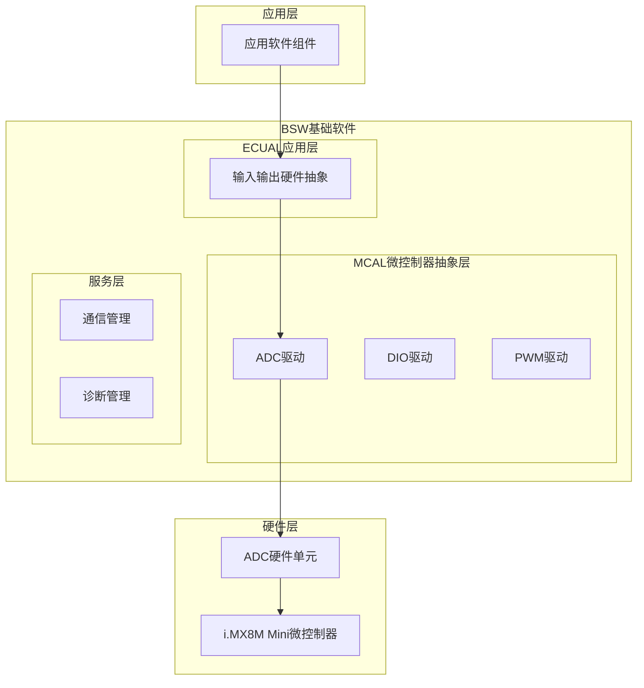
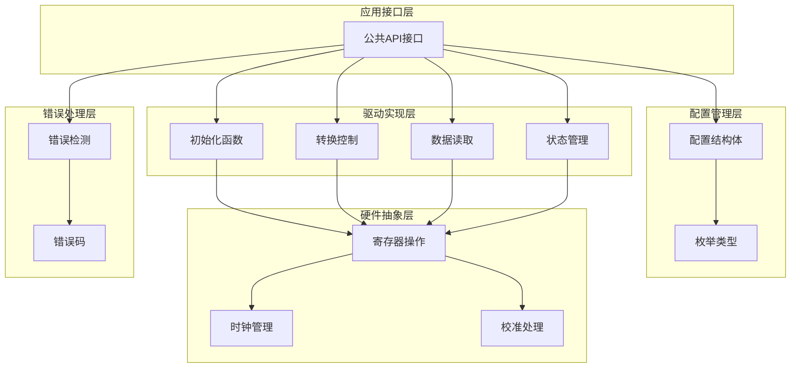
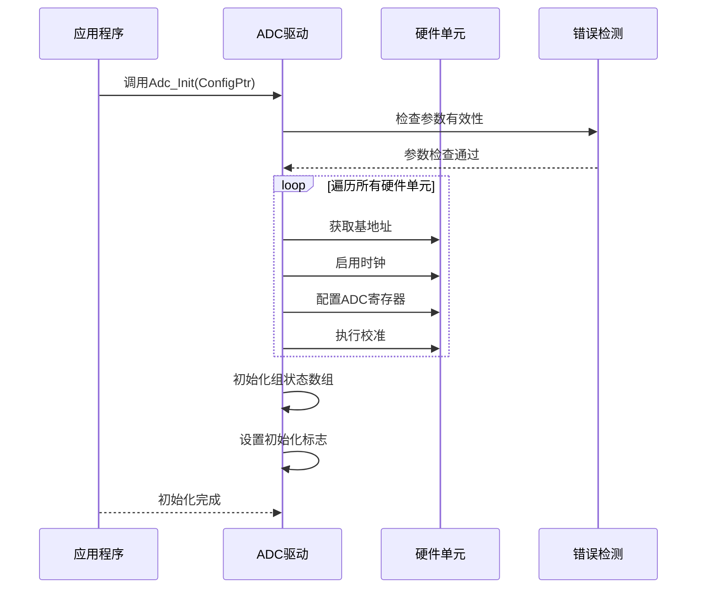
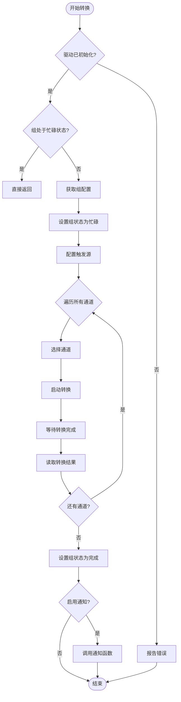
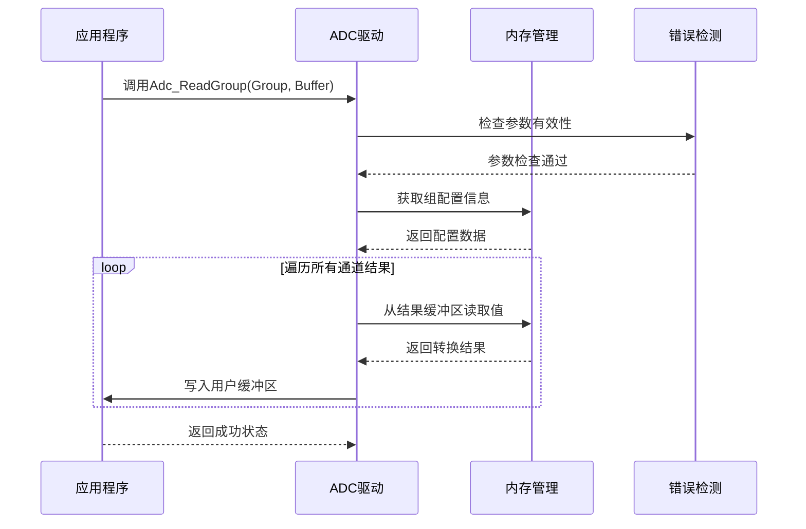
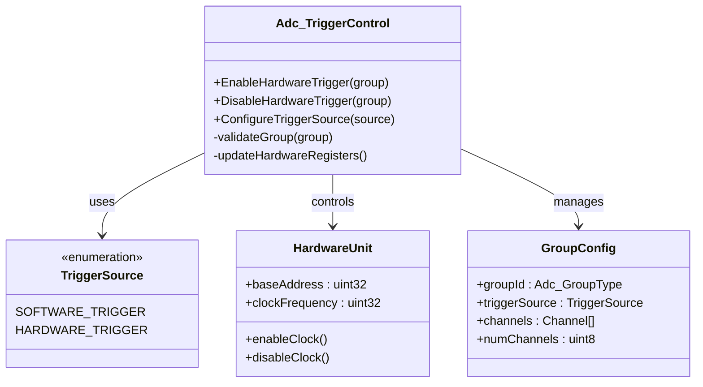
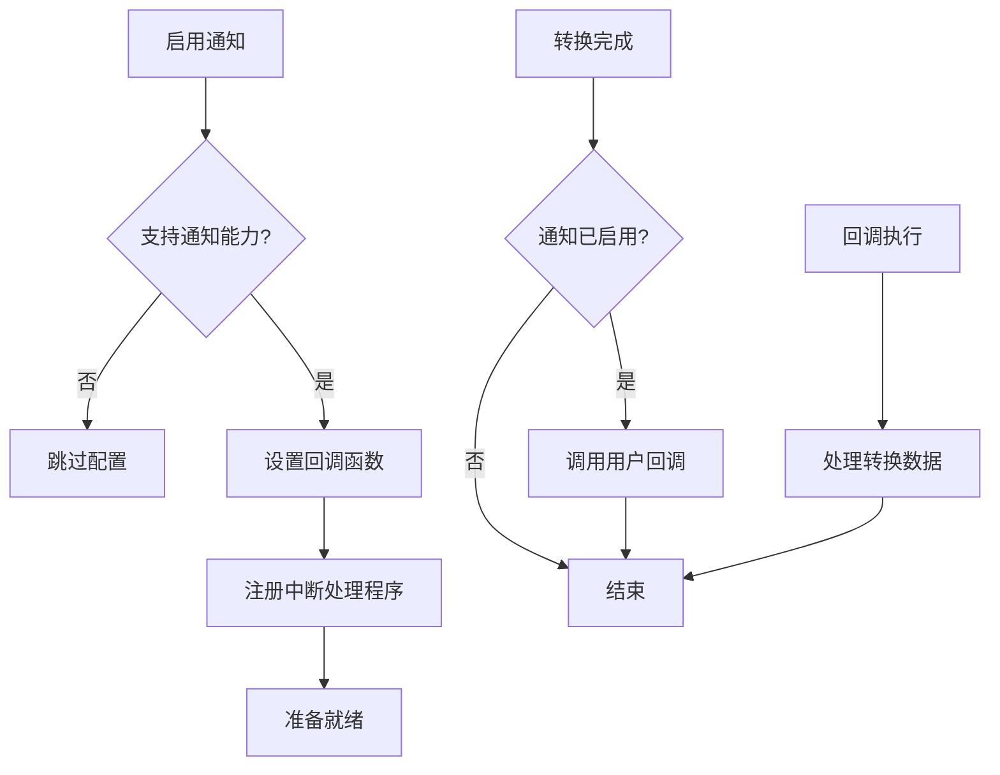
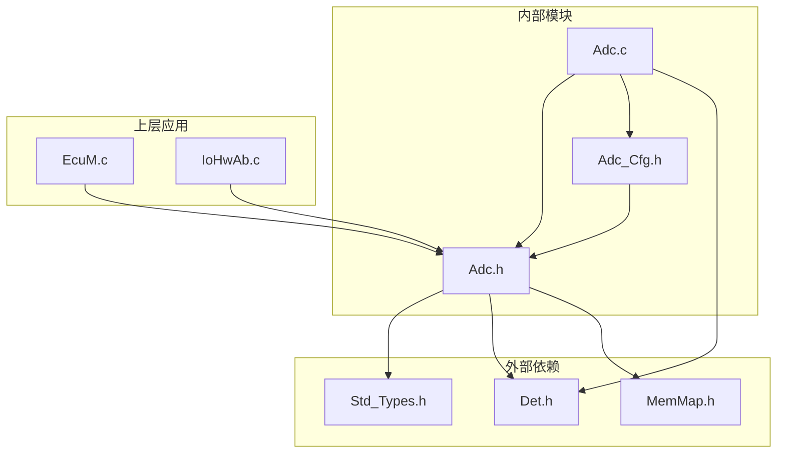

# Adc模数转换驱动

<cite>
**本文档引用的文件**
- [Adc.h](file://src/bsw/mcal/adc/include/Adc.h)
- [Adc_Cfg.h](file://src/bsw/mcal/adc/include/Adc_Cfg.h)
- [Adc.c](file://src/bsw/mcal/adc/src/Adc.c)
- [EcuM.c](file://src/bsw/integration/EcuM.c)
- [Det.h](file://src/bsw/common/Det.h)
- [Std_Types.h](file://src/bsw/common/Std_Types.h)
- [IoHwAb.c](file://src/bsw/ecual/iohwab/src/IoHwAb.c)
</cite>

## 目录
1. [简介](#简介)
2. [项目结构](#项目结构)
3. [核心组件](#核心组件)
4. [架构概览](#架构概览)
5. [详细组件分析](#详细组件分析)
6. [依赖关系分析](#依赖关系分析)
7. [性能考虑](#性能考虑)
8. [故障排除指南](#故障排除指南)
9. [结论](#结论)
10. [附录](#附录)

## 简介

Adc模数转换驱动是基于AutoSAR经典平台4.x标准开发的MCAL（微控制器抽象层）驱动模块，负责管理模拟信号到数字信号的转换过程。该驱动实现了完整的ADC功能集，包括初始化配置、采样管理、数据读取、触发控制和状态监控等核心功能。

本驱动模块针对i.MX8M Mini微控制器的ADC硬件进行优化，支持多通道、多组配置，提供灵活的采样时间和分辨率设置，并具备完善的错误检测和电源管理能力。

## 项目结构

Adc驱动模块位于BSW（基础软件）层的MCAL子系统中，采用AutoSAR标准的分层架构设计：



**图表来源**
- [Adc.h:1-384](file://src/bsw/mcal/adc/include/Adc.h#L1-L384)
- [EcuM.c:150-173](file://src/bsw/integration/EcuM.c#L150-L173)

**章节来源**
- [Adc.h:1-384](file://src/bsw/mcal/adc/include/Adc.h#L1-L384)
- [Adc_Cfg.h:1-105](file://src/bsw/mcal/adc/include/Adc_Cfg.h#L1-L105)

## 核心组件

Adc驱动模块的核心组件包括以下关键部分：

### 数据类型定义
- **Adc_ValueGroupType**: 16位无符号整数，用于存储ADC转换结果
- **Adc_StatusType**: ADC状态枚举，包括空闲、忙碌、流完成三种状态
- **Adc_TriggerSourceType**: 触发源类型，支持软件触发和硬件触发
- **Adc_ConversionModeType**: 转换模式，支持单次转换和连续转换

### 配置参数
- **ADC_NUM_GROUPS**: 支持8个ADC组
- **ADC_NUM_CHANNELS**: 支持16个ADC通道
- **ADC_NUM_HW_UNITS**: 支持2个硬件单元
- **默认分辨率**: 12位
- **默认采样时间**: 15个时钟周期

### 功能特性
- 完整的AutoSAR接口实现
- 多级错误检测机制
- 灵活的配置选项
- 电源状态管理支持
- 中断通知机制

**章节来源**
- [Adc.h:84-177](file://src/bsw/mcal/adc/include/Adc.h#L84-L177)
- [Adc_Cfg.h:28-87](file://src/bsw/mcal/adc/include/Adc_Cfg.h#L28-L87)

## 架构概览

Adc驱动采用分层架构设计，确保了良好的模块化和可维护性：



**图表来源**
- [Adc.c:93-136](file://src/bsw/mcal/adc/src/Adc.c#L93-L136)
- [Adc.h:231-242](file://src/bsw/mcal/adc/include/Adc.h#L231-L242)

## 详细组件分析

### 初始化组件分析

Adc_Init()函数负责驱动的整体初始化过程：



**图表来源**
- [Adc.c:93-136](file://src/bsw/mcal/adc/src/Adc.c#L93-L136)

#### 初始化流程详解

1. **参数验证**: 检查配置指针是否有效，确保驱动未被重复初始化
2. **硬件配置**: 针对每个硬件单元执行以下操作：
   - 获取硬件基地址
   - 启用相关时钟
   - 配置ADC控制寄存器（时钟分频、分辨率等）
   - 执行硬件校准程序
3. **状态初始化**: 将所有ADC组状态设置为空闲
4. **完成标记**: 设置驱动初始化完成标志

**章节来源**
- [Adc.c:93-136](file://src/bsw/mcal/adc/src/Adc.c#L93-L136)

### 采样管理组件分析

Adc_StartGroupConversion()和Adc_StopGroupConversion()函数管理采样过程：



**图表来源**
- [Adc.c:168-223](file://src/bsw/mcal/adc/src/Adc.c#L168-L223)

#### 采样管理特性

- **多通道支持**: 自动遍历组内所有配置的通道
- **状态跟踪**: 维护每个组的转换状态
- **中断集成**: 支持通知回调机制
- **资源保护**: 防止重复启动正在进行的转换

**章节来源**
- [Adc.c:168-223](file://src/bsw/mcal/adc/src/Adc.c#L168-L223)

### 数据读取组件分析

Adc_ReadGroup()函数提供数据读取接口：



**图表来源**
- [Adc.c:254-278](file://src/bsw/mcal/adc/src/Adc.c#L254-L278)

#### 数据读取特性

- **批量读取**: 支持一次性读取整个组的所有通道结果
- **内存安全**: 提供完整的指针和边界检查
- **数据完整性**: 确保只读取已完成转换的数据

**章节来源**
- [Adc.c:254-278](file://src/bsw/mcal/adc/src/Adc.c#L254-L278)

### 触发控制组件分析

硬件触发控制提供了灵活的外部触发机制：



**图表来源**
- [Adc.c:280-328](file://src/bsw/mcal/adc/src/Adc.c#L280-L328)
- [Adc.h:118-121](file://src/bsw/mcal/adc/include/Adc.h#L118-L121)

#### 触发控制特性

- **软件触发**: 通过编程方式启动转换
- **硬件触发**: 支持外部事件触发
- **动态切换**: 运行时可在不同触发模式间切换
- **状态同步**: 确保触发配置与硬件状态一致

**章节来源**
- [Adc.c:280-328](file://src/bsw/mcal/adc/src/Adc.c#L280-L328)

### 通知机制组件分析

组通知功能提供了异步转换完成通知：



**图表来源**
- [Adc.c:330-360](file://src/bsw/mcal/adc/src/Adc.c#L330-L360)

#### 通知机制特性

- **回调支持**: 用户可注册自定义通知回调函数
- **中断集成**: 与底层中断系统无缝集成
- **状态同步**: 确保通知在正确的时间点触发
- **可选配置**: 支持按需启用或禁用通知功能

**章节来源**
- [Adc.c:330-360](file://src/bsw/mcal/adc/src/Adc.c#L330-L360)

## 依赖关系分析

Adc驱动模块的依赖关系体现了AutoSAR标准的分层架构：



**图表来源**
- [Adc.c:9-11](file://src/bsw/mcal/adc/src/Adc.c#L9-L11)
- [Adc.h:19-20](file://src/bsw/mcal/adc/include/Adc.h#L19-L20)

### 关键依赖关系

1. **标准类型依赖**: 依赖Std_Types.h提供的标准数据类型定义
2. **错误检测依赖**: 依赖Det.h实现完整的错误检测机制
3. **内存映射依赖**: 使用MemMap.h进行内存段管理
4. **配置依赖**: 依赖Adc_Cfg.h提供编译时配置信息

**章节来源**
- [Adc.c:9-11](file://src/bsw/mcal/adc/src/Adc.c#L9-L11)
- [Adc.h:19-20](file://src/bsw/mcal/adc/include/Adc.h#L19-L20)

## 性能考虑

### 采样时间配置

Adc驱动支持多种采样时间配置，影响转换精度和速度：

| 采样时间配置 | 时钟周期数 | 典型应用场景 |
|------------|-----------|-------------|
| 3周期 | 3 | 高速测量，精度要求较低 |
| 15周期 | 15 | 平衡精度和速度 |
| 28周期 | 28 | 高精度测量 |
| 56周期 | 56 | 超高精度，低速信号 |
| 84周期 | 84 | 微弱信号检测 |
| 112周期 | 112 | 低噪声环境 |
| 144周期 | 144 | 极高精度应用 |
| 480周期 | 480 | 亚毫米级精密测量 |

### 分辨率设置

驱动支持4种不同的分辨率配置：

- **6位分辨率**: 64个量化级别，适合粗略测量
- **8位分辨率**: 256个量化级别，平衡精度和速度
- **10位分辨率**: 1024个量化级别，标准精度应用
- **12位分辨率**: 4096个量化级别，高精度应用

### 时钟频率优化

系统时钟频率直接影响ADC性能：
- **24MHz主频**: 默认配置，提供良好性能平衡
- **更高频率**: 可提高采样速度但增加功耗
- **更低频率**: 减少功耗但降低采样率

### 缓冲区管理

驱动提供两种缓冲区模式：
- **线性缓冲区**: 顺序存储转换结果
- **循环缓冲区**: 环形缓冲区，适合持续采样应用

## 故障排除指南

### 常见错误代码

Adc驱动定义了完整的错误检测机制：

| 错误代码 | 错误含义 | 可能原因 | 解决方案 |
|---------|---------|---------|---------|
| ADC_E_UNINIT | 未初始化 | 驱动未正确初始化 | 确保先调用Adc_Init() |
| ADC_E_ALREADY_INITIALIZED | 重复初始化 | 多次调用初始化函数 | 检查初始化逻辑 |
| ADC_E_PARAM_GROUP | 组参数无效 | 组号超出范围 | 验证组配置常量 |
| ADC_E_PARAM_POINTER | 指针参数无效 | 空指针传入 | 检查缓冲区分配 |
| ADC_E_BUSY | 设备忙 | 转换正在进行中 | 等待转换完成或停止 |
| ADC_E_IDLE | 设备空闲 | 尝试在空闲状态下操作 | 检查状态查询逻辑 |

### 调试建议

1. **初始化检查**: 确保所有必需的配置参数都已正确设置
2. **状态监控**: 定期检查Adc_GetGroupStatus()返回的状态
3. **错误日志**: 启用DET模块记录详细的错误信息
4. **时序验证**: 使用示波器验证触发信号和转换时序

**章节来源**
- [Adc.h:66-80](file://src/bsw/mcal/adc/include/Adc.h#L66-L80)
- [Adc.c:95-104](file://src/bsw/mcal/adc/src/Adc.c#L95-L104)

## 结论

Adc模数转换驱动模块是一个功能完整、设计规范的AutoSAR兼容驱动程序。它提供了：

1. **完整的AutoSAR接口**: 符合AUTOSAR 4.x标准的完整API集合
2. **灵活的配置选项**: 支持多种分辨率、采样时间和触发模式
3. **强大的错误检测**: 完善的运行时错误检测和报告机制
4. **高效的硬件抽象**: 针对i.MX8M Mini硬件的优化实现
5. **良好的可扩展性**: 模块化设计便于功能扩展和维护

该驱动模块为上层应用提供了可靠的ADC功能基础，支持从简单的单通道测量到复杂的多通道数据采集应用。

## 附录

### 配置示例

以下是一个典型的ADC配置示例：

```c
// ADC硬件单元配置
const Adc_HWUnitConfigType Adc_HwUnits[] = {
    {
        .HwUnitId = ADC_HWUNIT_0,
        .BaseAddress = 0x30610000UL,
        .ClockFrequency = 24000000U,
        .DefaultResolution = ADC_RESOLUTION_12BIT
    }
};

// ADC通道配置
const Adc_ChannelConfigType Adc_Channels[] = {
    {
        .ChannelId = ADC_CHANNEL_0,
        .SamplingTime = ADC_SAMPLING_TIME_15CYCLES,
        .ChannelInput = 0
    },
    // ... 更多通道配置
};

// ADC组配置
const Adc_GroupConfigType Adc_Groups[] = {
    {
        .GroupId = ADC_GROUP_0,
        .HwUnit = ADC_HWUNIT_0,
        .Channels = Adc_Channels,
        .NumChannels = 2,
        .TriggerSource = ADC_TRIGG_SRC_SW,
        .ConversionMode = ADC_CONV_MODE_CONTINUOUS,
        .AccessMode = ADC_ACCESS_MODE_SINGLE,
        .BufferMode = ADC_STREAM_BUFFER_LINEAR,
        .NumSamples = 1,
        .Resolution = ADC_RESOLUTION_12BIT,
        .GroupNotification = TRUE,
        .NotificationFn = myNotificationCallback
    }
};

// 完整配置结构
const Adc_ConfigType Adc_Config = {
    .HwUnits = Adc_HwUnits,
    .NumHwUnits = 1,
    .Channels = Adc_Channels,
    .NumChannels = 16,
    .Groups = Adc_Groups,
    .NumGroups = 8,
    .DevErrorDetect = STD_ON,
    .VersionInfoApi = STD_ON,
    .DeInitApi = STD_ON,
    .PowerStateSupported = STD_OFF
};
```

### 校准方法

ADC校准是确保测量精度的关键步骤：

1. **自动校准**: 驱动在初始化时自动执行硬件校准
2. **手动校准**: 支持用户自定义校准程序
3. **温度补偿**: 可根据环境温度调整校准参数
4. **定期校准**: 建议在系统启动后和长期运行期间定期执行

### 精度优化策略

1. **采样时间优化**: 根据信号频率选择合适的采样时间
2. **滤波技术**: 实现数字滤波减少噪声影响
3. **多点测量**: 通过多次测量取平均提高精度
4. **温度补偿**: 考虑温度变化对ADC性能的影响
5. **参考电压稳定**: 确保基准电压的稳定性

**章节来源**
- [Adc_Cfg.h:82-87](file://src/bsw/mcal/adc/include/Adc_Cfg.h#L82-L87)
- [Adc.c:125-128](file://src/bsw/mcal/adc/src/Adc.c#L125-L128)