# Can控制器驱动

<cite>
**本文引用的文件**
- [Can.h](file://src/bsw/mcal/can/include/Can.h)
- [Can.c](file://src/bsw/mcal/can/src/Can.c)
- [Can_Cfg.h](file://src/bsw/mcal/can/include/Can_Cfg.h)
- [CanIf.h](file://src/bsw/ecual/canif/include/CanIf.h)
- [main.c](file://examples/can_demo/main.c)
- [platform_config.h](file://platform/cortex-m/platform_config.h)
</cite>

## 目录
1. [简介](#简介)
2. [项目结构](#项目结构)
3. [核心组件](#核心组件)
4. [架构概览](#架构概览)
5. [详细组件分析](#详细组件分析)
6. [依赖分析](#依赖分析)
7. [性能考虑](#性能考虑)
8. [故障排查指南](#故障排查指南)
9. [结论](#结论)
10. [附录](#附录)

## 简介
本技术文档面向AutoSAR Classic平台的MCAL层Can控制器驱动模块，系统性阐述CAN控制器初始化、消息发送与接收管理、波特率配置、过滤器设置、缓冲区管理与中断处理机制，并结合ECUAL CanIf模块接口关系进行说明。文档同时提供配置示例、消息格式定义与错误处理策略，帮助开发者在目标平台上正确集成与使用Can驱动。

## 项目结构
Can控制器驱动位于MCAL层，遵循AutoSAR标准；上层通过ECUAL CanIf模块对接应用层（如Com、PduR）。示例工程展示了从平台初始化到CanIf主函数调度的完整调用链路。

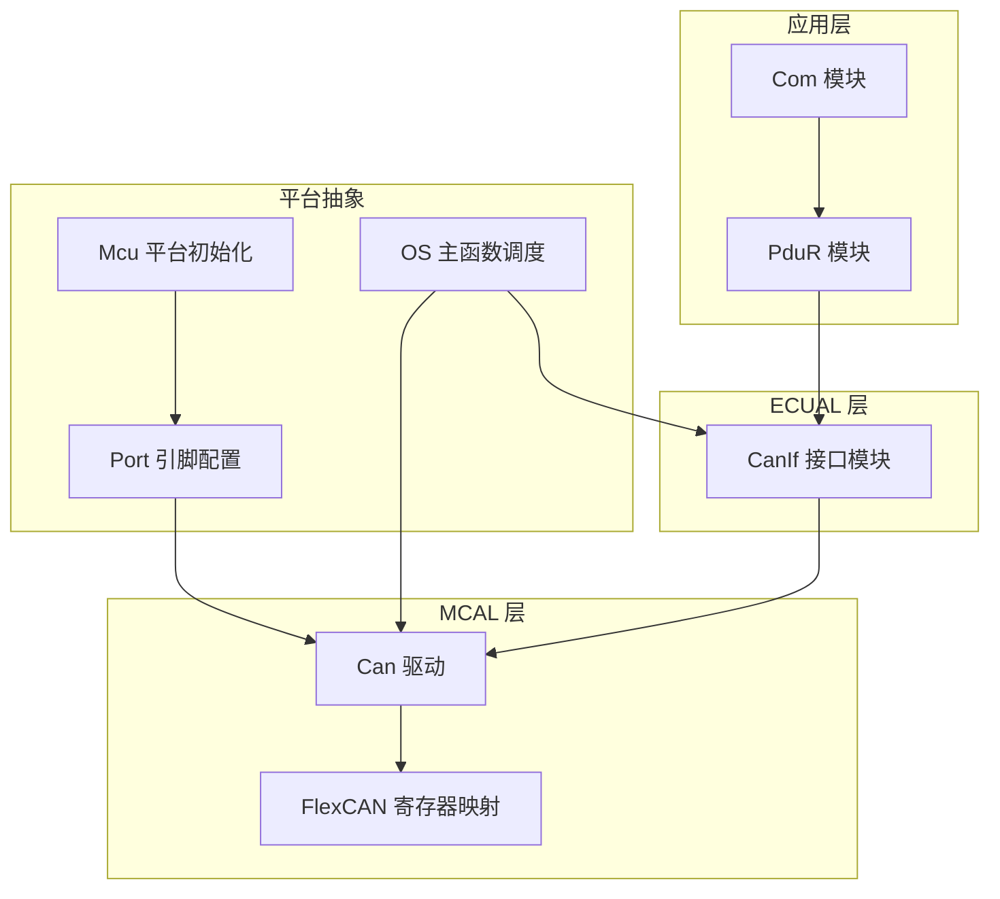

**图表来源**
- [Can.h:193-266](file://src/bsw/mcal/can/include/Can.h#L193-L266)
- [Can.c:126-200](file://src/bsw/mcal/can/src/Can.c#L126-L200)
- [CanIf.h:272-305](file://src/bsw/ecual/canif/include/CanIf.h#L272-L305)
- [main.c:63-118](file://examples/can_demo/main.c#L63-L118)

**章节来源**
- [Can.h:1-269](file://src/bsw/mcal/can/include/Can.h#L1-L269)
- [Can.c:1-463](file://src/bsw/mcal/can/src/Can.c#L1-L463)
- [Can_Cfg.h:1-73](file://src/bsw/mcal/can/include/Can_Cfg.h#L1-L73)
- [CanIf.h:1-403](file://src/bsw/ecual/canif/include/CanIf.h#L1-L403)
- [main.c:1-119](file://examples/can_demo/main.c#L1-L119)

## 核心组件
- 驱动接口头文件：定义服务ID、错误码、控制器状态、硬件对象类型、波特率配置、控制器配置、PDU结构体及对外API原型。
- 驱动实现源文件：基于i.MX8M Mini的FlexCAN控制器寄存器实现，包含初始化、模式切换、中断使能/禁用、发送写入、轮询读取与总线关闭处理。
- 配置头文件：声明编译期配置项（如控制器数量、硬件对象数量、波特率配置数、处理模式、句柄宏等）。
- ECUAL CanIf接口：向上提供统一的传输、接收、模式控制与版本信息查询接口，向下桥接MCAL Can驱动。
- 示例程序：展示从平台初始化到CanIf主函数调度的典型流程。

**章节来源**
- [Can.h:42-266](file://src/bsw/mcal/can/include/Can.h#L42-L266)
- [Can.c:126-463](file://src/bsw/mcal/can/src/Can.c#L126-L463)
- [Can_Cfg.h:15-73](file://src/bsw/mcal/can/include/Can_Cfg.h#L15-L73)
- [CanIf.h:36-402](file://src/bsw/ecual/canif/include/CanIf.h#L36-L402)
- [main.c:63-118](file://examples/can_demo/main.c#L63-L118)

## 架构概览
Can驱动采用分层设计：MCAL层直接操作FlexCAN硬件寄存器；ECUAL CanIf层负责PDU路由、ID映射与模式管理；应用层通过Com/PduR发起通信请求。驱动支持轮询模式下的发送完成与接收检测，以及可选的中断模式（由配置决定）。

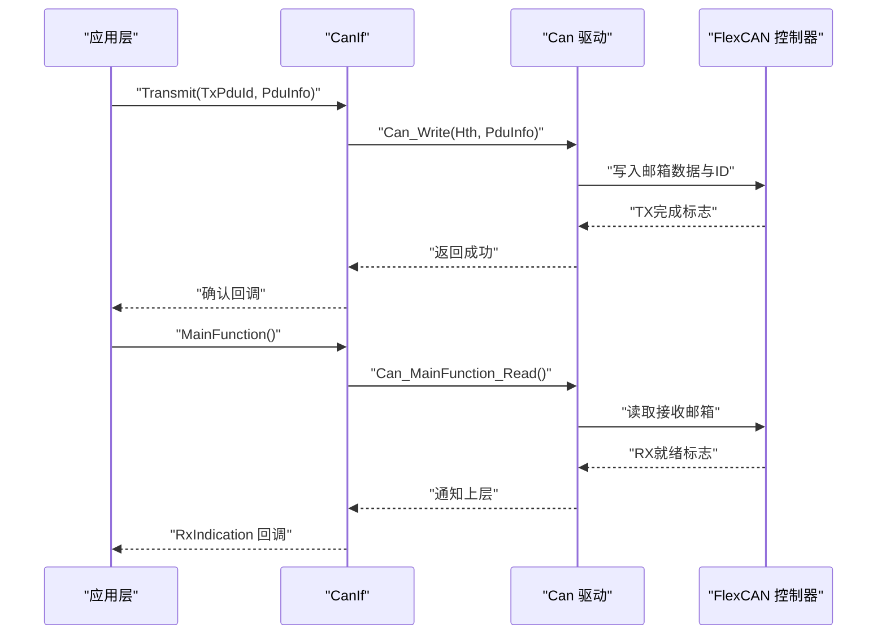

**图表来源**
- [Can.c:314-368](file://src/bsw/mcal/can/src/Can.c#L314-L368)
- [Can.c:390-409](file://src/bsw/mcal/can/src/Can.c#L390-L409)
- [CanIf.h:300-305](file://src/bsw/ecual/canif/include/CanIf.h#L300-L305)

## 详细组件分析

### 初始化流程（Can_Init）
- 参数校验与单次初始化保护
- 遍历所有控制器，设置基地址、进入冻结模式、配置最大消息缓冲区数量
- 写入波特率参数（预分频、同步跳跃宽度、相位段1/2、传播段）
- 初始化所有消息邮箱为“未激活”状态
- 根据配置启用必要中断（总线关闭、唤醒等），并设置初始状态为停止

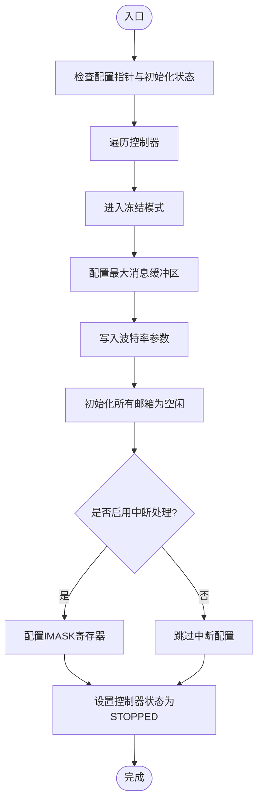

**图表来源**
- [Can.c:126-200](file://src/bsw/mcal/can/src/Can.c#L126-L200)

**章节来源**
- [Can.c:126-200](file://src/bsw/mcal/can/src/Can.c#L126-L200)

### 模式切换（Can_SetControllerMode）
- 支持STARTED与STOPPED两种模式
- STARTED：清除HALT位并等待NOT_READY清零后进入运行态
- STOPPED：置位HALT与FRZ并等待冻结确认
- Sleep模式在当前实现中不支持

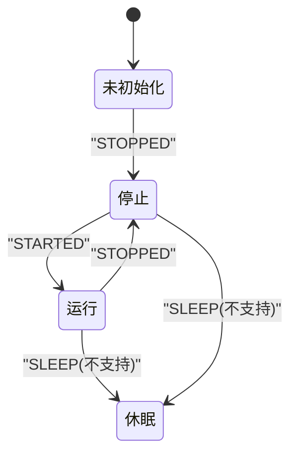

**图表来源**
- [Can.c:217-271](file://src/bsw/mcal/can/src/Can.c#L217-L271)

**章节来源**
- [Can.c:217-271](file://src/bsw/mcal/can/src/Can.c#L217-L271)

### 中断处理与轮询机制
- 中断使能/禁用：根据配置选择性开启总线关闭/错误中断
- 轮询模式下，主函数分别检查TX完成标志与RX就绪标志，清理对应中断标志并向CanIf上报
- 总线关闭处理：检测ESR1中的总线关闭中断并清理标志

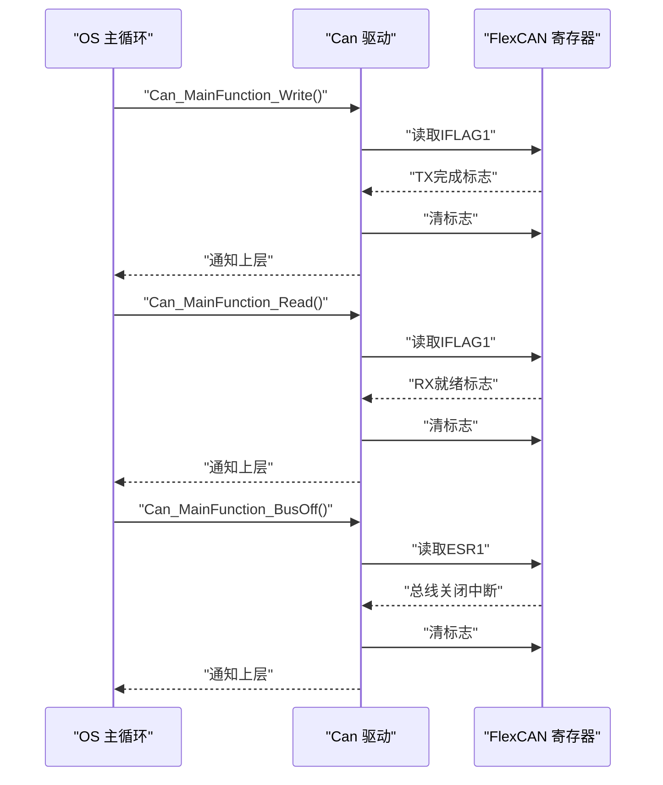

**图表来源**
- [Can.c:370-388](file://src/bsw/mcal/can/src/Can.c#L370-L388)
- [Can.c:390-409](file://src/bsw/mcal/can/src/Can.c#L390-L409)
- [Can.c:411-426](file://src/bsw/mcal/can/src/Can.c#L411-L426)

**章节来源**
- [Can.c:273-312](file://src/bsw/mcal/can/src/Can.c#L273-L312)
- [Can.c:370-426](file://src/bsw/mcal/can/src/Can.c#L370-L426)

### 发送流程（Can_Write）
- 输入参数校验（初始化状态、指针、句柄范围）
- 计算控制器与邮箱索引，检查目标邮箱是否处于“未激活”状态
- 写入ID（标准或扩展）、数据字（最多8字节拆分为两个32位字）
- 设置CS字段为“发送激活”，DLC为实际长度
- 返回发送结果

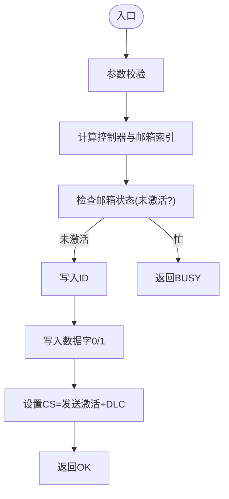

**图表来源**
- [Can.c:314-368](file://src/bsw/mcal/can/src/Can.c#L314-L368)

**章节来源**
- [Can.c:314-368](file://src/bsw/mcal/can/src/Can.c#L314-L368)

### 接收流程（Can_MainFunction_Read）
- 遍历所有控制器，若处于STARTED状态则检查IFLAG1
- 对于接收邮箱位，读取对应邮箱内容，清理中断标志，并向CanIf上报
- 当前实现为轮询模式，未使用外部中断

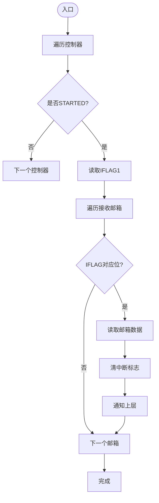

**图表来源**
- [Can.c:390-409](file://src/bsw/mcal/can/src/Can.c#L390-L409)

**章节来源**
- [Can.c:390-409](file://src/bsw/mcal/can/src/Can.c#L390-L409)

### 波特率配置与寄存器映射
- 配置结构体包含波特率索引、传播段、相位段1/2、同步跳跃宽度与预分频
- FlexCAN寄存器映射包括MCR、CTRL1、IMASK/IFLAG、ESR1等
- 初始化时根据配置写入CTRL1寄存器以设置时序参数

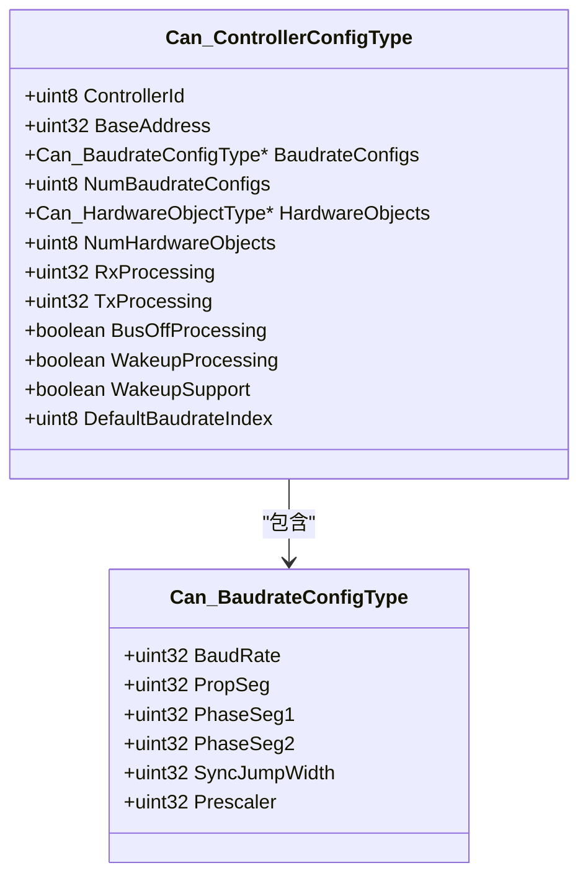

**图表来源**
- [Can.h:139-164](file://src/bsw/mcal/can/include/Can.h#L139-L164)
- [Can.h:139-146](file://src/bsw/mcal/can/include/Can.h#L139-L146)
- [Can.c:167-175](file://src/bsw/mcal/can/src/Can.c#L167-L175)

**章节来源**
- [Can.h:139-164](file://src/bsw/mcal/can/include/Can.h#L139-L164)
- [Can.h:139-146](file://src/bsw/mcal/can/include/Can.h#L139-L146)
- [Can.c:167-175](file://src/bsw/mcal/can/src/Can.c#L167-L175)

### 过滤器设置与硬件对象
- 硬件对象配置包含句柄、类型（接收/发送）、ID类型（标准/扩展）、首末ID、对象ID与过滤开关
- 当前实现未提供动态过滤器API，接收过滤主要通过邮箱配置与ID匹配实现

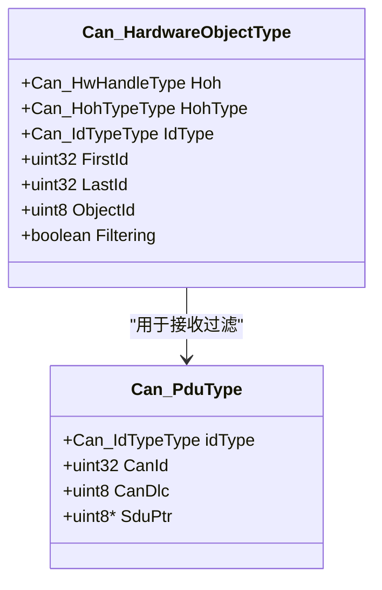

**图表来源**
- [Can.h:126-134](file://src/bsw/mcal/can/include/Can.h#L126-L134)
- [Can.h:116-121](file://src/bsw/mcal/can/include/Can.h#L116-L121)

**章节来源**
- [Can.h:126-134](file://src/bsw/mcal/can/include/Can.h#L126-L134)
- [Can.h:116-121](file://src/bsw/mcal/can/include/Can.h#L116-L121)

### 与ECUAL CanIf模块的接口关系
- CanIf向上提供Transmit、RxIndication、TxConfirmation、SetControllerMode等接口
- CanIf向下调用Can驱动的Can_Write与模式控制接口
- 示例程序展示了CanIf_Init、CanIf_SetControllerMode、周期性调用Can_MainFunction_Write/Read与CanIf_MainFunction的典型流程

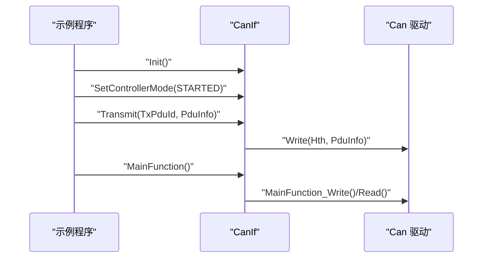

**图表来源**
- [main.c:86-118](file://examples/can_demo/main.c#L86-L118)
- [CanIf.h:272-305](file://src/bsw/ecual/canif/include/CanIf.h#L272-L305)
- [Can.c:370-409](file://src/bsw/mcal/can/src/Can.c#L370-L409)

**章节来源**
- [main.c:63-118](file://examples/can_demo/main.c#L63-L118)
- [CanIf.h:272-305](file://src/bsw/ecual/canif/include/CanIf.h#L272-L305)

## 依赖分析
- 驱动依赖：标准类型、错误检测模块、平台内存映射宏
- 配置依赖：编译期配置头文件提供控制器数量、硬件对象数量、波特率配置数、句柄宏与超时周期
- 上层依赖：ECUAL CanIf模块提供统一接口与回调，应用层通过Com/PduR使用

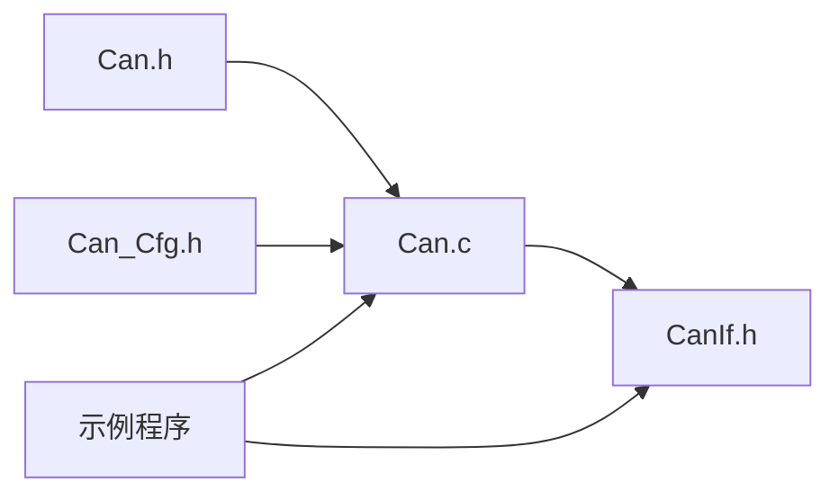

**图表来源**
- [Can.h:19-20](file://src/bsw/mcal/can/include/Can.h#L19-L20)
- [Can_Cfg.h:15-26](file://src/bsw/mcal/can/include/Can_Cfg.h#L15-L26)
- [Can.c:9-11](file://src/bsw/mcal/can/src/Can.c#L9-L11)
- [main.c:15-20](file://examples/can_demo/main.c#L15-L20)

**章节来源**
- [Can.h:19-20](file://src/bsw/mcal/can/include/Can.h#L19-L20)
- [Can_Cfg.h:15-26](file://src/bsw/mcal/can/include/Can_Cfg.h#L15-L26)
- [Can.c:9-11](file://src/bsw/mcal/can/src/Can.c#L9-L11)
- [main.c:15-20](file://examples/can_demo/main.c#L15-L20)

## 性能考虑
- 轮询模式：主函数周期性检查IFLAG寄存器，避免中断开销但占用CPU时间
- 发送路径：邮箱状态检查与数据写入均为寄存器级操作，延迟可忽略
- 接收路径：按邮箱位扫描，建议合理分配接收邮箱以减少无效轮询
- 时钟与SysTick：平台抽象提供SysTick初始化与计数接口，可用于主函数节拍控制

**章节来源**
- [Can.c:370-409](file://src/bsw/mcal/can/src/Can.c#L370-L409)
- [platform_config.h:286-298](file://platform/cortex-m/platform_config.h#L286-L298)

## 故障排查指南
- 初始化失败：检查配置指针与重复初始化保护；确认控制器基址与时序参数
- 发送失败：检查Hth句柄范围、邮箱状态（是否BUSY）、DLC合法性
- 模式切换异常：确保控制器处于预期状态后再执行切换；冻结/非就绪等待超时需检查时钟与复位
- 接收无数据：确认控制器处于STARTED状态且IFLAG对应位有效；检查邮箱配置与ID匹配
- 总线关闭：启用总线关闭中断并在主函数中调用BusOff处理；及时恢复模式

**章节来源**
- [Can.c:126-200](file://src/bsw/mcal/can/src/Can.c#L126-L200)
- [Can.c:314-368](file://src/bsw/mcal/can/src/Can.c#L314-L368)
- [Can.c:217-271](file://src/bsw/mcal/can/src/Can.c#L217-L271)
- [Can.c:411-426](file://src/bsw/mcal/can/src/Can.c#L411-L426)

## 结论
该Can控制器驱动实现了AutoSAR标准的MCAL接口，基于FlexCAN寄存器提供初始化、模式控制、发送与接收管理能力。通过ECUAL CanIf模块，上层应用可获得统一的通信接口。当前实现以轮询为主，具备清晰的状态机与错误处理机制，适合对实时性要求适中或资源受限的应用场景。后续可根据需求扩展中断模式与更丰富的过滤器配置。

## 附录

### API参考与错误码
- 初始化：Can_Init(Config)
- 版本信息：Can_GetVersionInfo(versioninfo)
- 模式控制：Can_SetControllerMode(Controller, Transition)
- 中断控制：Can_DisableControllerInterrupts(Controller)、Can_EnableControllerInterrupts(Controller)
- 发送：Can_Write(Hth, PduInfo)
- 主函数：Can_MainFunction_Write()、Can_MainFunction_Read()、Can_MainFunction_BusOff()、Can_MainFunction_Wakeup()、Can_MainFunction_Mode()
- 唤醒检测：Can_CheckWakeup(Controller)

常见错误码（示例）：参数指针无效、参数句柄越界、未初始化、状态转换非法、波特率参数无效、初始化失败、致命错误等。

**章节来源**
- [Can.h:42-71](file://src/bsw/mcal/can/include/Can.h#L42-L71)
- [Can.h:193-266](file://src/bsw/mcal/can/include/Can.h#L193-L266)

### 配置示例要点
- 控制器数量：CAN_NUM_CONTROLLERS
- 硬件对象数量：CAN_NUM_HOH
- 波特率配置数：CAN_NUM_BAUDRATE_CONFIGS
- 处理模式：CAN_PROCESSING_POLLING 或 CAN_PROCESSING_INTERRUPT
- 句柄宏：CAN_HOH_RX_n、CAN_HOH_TX_n
- 超时与主函数周期：CAN_TIMEOUT_DURATION、CAN_MAIN_FUNCTION_PERIOD_MS

**章节来源**
- [Can_Cfg.h:15-73](file://src/bsw/mcal/can/include/Can_Cfg.h#L15-L73)