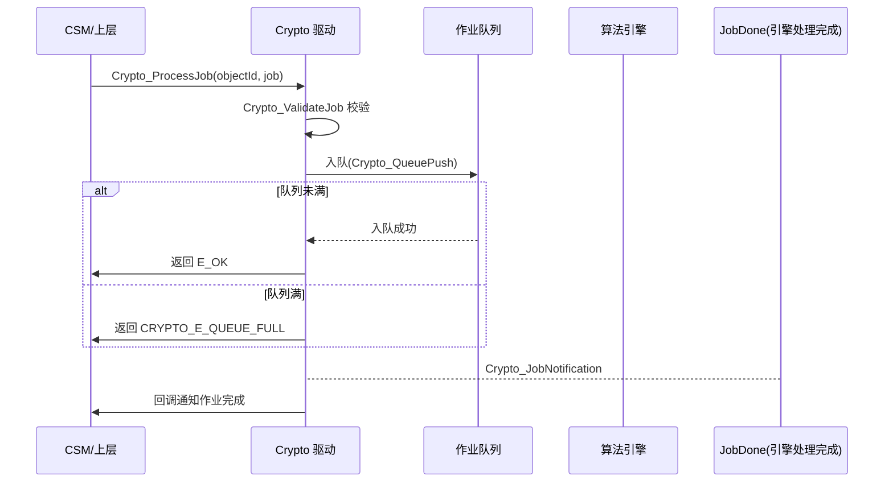
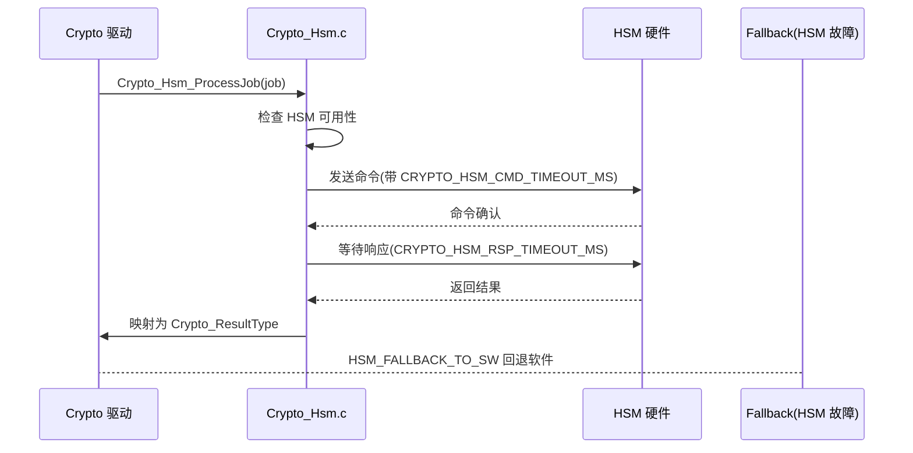

# Crypto（加密驱动模块）

<cite>
**本文档引用的文件**
- [Crypto.h](file://src/bsw/mcal/crypto/include/Crypto.h)
- [Crypto_Types.h](file://src/bsw/mcal/crypto/include/Crypto_Types.h)
- [Crypto_Cfg.h](file://src/bsw/mcal/crypto/include/Crypto_Cfg.h)
- [Crypto_MemMap.h](file://src/bsw/mcal/crypto/include/Crypto_MemMap.h)
- [Crypto_S32K312_Hsm.h](file://src/bsw/mcal/crypto/include/Crypto_S32K312_Hsm.h)
- [Crypto_HwTrng.h](file://src/bsw/mcal/crypto/include/Crypto_HwTrng.h)
- [Crypto.c](file://src/bsw/mcal/crypto/src/Crypto.c)
- [Crypto_Aes.c](file://src/bsw/mcal/crypto/src/Crypto_Aes.c)
- [Crypto_Hsm.c](file://src/bsw/mcal/crypto/src/Crypto_Hsm.c)
- [Crypto_MbedTLS.c](file://src/bsw/mcal/crypto/src/Crypto_MbedTLS.c)
- [Crypto_HwTrng.c](file://src/bsw/mcal/crypto/src/Crypto_HwTrng.c)
</cite>

## 目录
1. [简介](#简介)
2. [项目结构](#项目结构)
3. [核心组件](#核心组件)
4. [架构概览](#架构概览)
5. [详细组件分析](#详细组件分析)
6. [依赖关系分析](#依赖关系分析)
7. [性能考虑](#性能考虑)
8. [故障排除指南](#故障排除指南)
9. [结论](#结论)
10. [附录](#附录)

## 简介

Crypto 加密驱动模块是基于 AUTOSAR 4.4.0 标准开发的 MCAL 层加密服务驱动，为上层 CSM（加密服务管理）和 SecOC（安全车载通信）提供密钥管理、加解密、哈希、随机数生成等安全原语。该模块采用"软件实现（MbedTLS）+ 硬件安全模块（HSM）"双引擎架构，支持 AES、SHA、ECC、HKDF、HMAC、BLAKE2 等算法。

本模块实现了完整的 AUTOSAR Crypto API 集合（20+ 服务 ID），包括作业队列管理、密钥元素操作、随机数生成以及 CCC（China Cyber-security Certification，国密安全）相关扩展接口，针对 i.MX8M Mini 平台（含 S32K312 HSM 适配代码）设计。

**章节来源**
- [Crypto.h:16-90](file://src/bsw/mcal/crypto/include/Crypto.h#L16-L90)
- [Crypto_Types.h:1-446](file://src/bsw/mcal/crypto/include/Crypto_Types.h#L1-L446)

## 项目结构

Crypto 模块源码位于 `src/bsw/mcal/crypto/`，采用多文件模块化设计：

```
src/bsw/mcal/crypto/
├── include/
│   ├── Crypto.h                  # 公共 API
│   ├── Crypto_Types.h            # 数据类型定义（446 行）
│   ├── Crypto_Cfg.h              # 预编译配置（199 行）
│   ├── Crypto_MemMap.h           # 内存段映射
│   ├── Crypto_MbedTLS_Mem.h      # MbedTLS 内存管理
│   ├── Crypto_S32K312_Hsm.h      # S32K312 HSM 接口
│   └── Crypto_HwTrng.h           # 硬件 TRNG 接口
├── legacy/
│   ├── _crypto_hsm_aes_impl.c    # 遗留 HSM AES 实现
│   ├── _crypto_hsm_ecc_impl.c    # 遗留 HSM ECC 实现
│   ├── _crypto_hsm_key_impl.c    # 遗留 HSM 密钥实现
│   └── _crypto_hsm_sha_impl.c    # 遗留 HSM SHA 实现
└── src/
    ├── Crypto.c                  # 核心调度与 API（作业队列）
    ├── Crypto_Aes.c              # AES 算法实现
    ├── Crypto_Hsm.c              # HSM 接口层
    ├── Crypto_HwTrng.c           # 硬件真随机数生成器
    ├── Crypto_MbedTLS.c          # MbedTLS 软件实现
    ├── Crypto_MbedTLS_Mem.c      # MbedTLS 内存管理
    ├── Crypto_S32K312_Hsm.c      # S32K312 HSM 驱动
    └── Crypto_Cfg.c              # 配置实例
```

```mermaid
graph TB
subgraph "服务层"
CSM[CSM 加密服务管理]
SECOC[SecOC 安全通信]
KEYM[KeyM 密钥管理]
end
subgraph "MCAL"
CRYPTO[Crypto 加密驱动]
subgraph "Crypto 内部引擎"
AES[Crypto_Aes.c]
MBED[Crypto_MbedTLS.c]
HSM[Crypto_Hsm.c]
TRNG[Crypto_HwTrng.c]
end
end
subgraph "硬件/库"
MBEDLIB[MbedTLS 库]
HSMHW[HSM 安全模块]
TRNGHW[硬件 TRNG]
END
CSM --> CRYPTO
SECOC --> CRYPTO
KEYM --> CRYPTO
CRYPTO --> AES
CRYPTO --> MBED
CRYPTO --> HSM
CRYPTO --> TRNG
MBED --> MBEDLIB
HSM --> HSMHW
TRNG --> TRNGHW
```

**图表来源**
- [Crypto.c:8-16](file://src/bsw/mcal/crypto/src/Crypto.c#L8-L16)
- [Crypto.h:16-24](file://src/bsw/mcal/crypto/include/Crypto.h#L16-L24)

**章节来源**
- [Crypto.h:1-100](file://src/bsw/mcal/crypto/include/Crypto.h#L1-L100)
- [Crypto_Cfg.h:1-199](file://src/bsw/mcal/crypto/include/Crypto_Cfg.h#L1-L199)

## 核心组件

Crypto 模块的核心组件包括：

### 数据类型定义（Crypto_Types.h）
- **Crypto_ResultType**: 结果类型（OK/NOT_OK/BUSY/BUSY_RETRY_LATER/ENTROPY_EXHAUSTED）
- **Crypto_ProcessingType**: 处理类型（ASYNC 异步/SYNC 同步）
- **Crypto_KeyTypeEnum**: 密钥类型（SEED/SHE/HSM/CUSTOM）
- **Crypto_HsmStateType**: HSM 状态（IDLE/BUSY/ERROR/UNINIT）
- **Crypto_EccCurveType**: ECC 曲线（SECP256R1/384R1/521R1/256K1/BRAINPOOL 系列）
- **Crypto_KeyType**: 密钥结构（keyId + 元素数组 + 类型 + 状态）
- **Crypto_JobPrimitiveInputOutputType**: 作业 I/O（输入/输出/次输出/验证结果指针）
- **Crypto_JobType**: 作业结构（jobId/状态/原语 I/O/算法信息/密钥 ID 等）
- **Crypto_QueueElementType**: 作业队列元素（链式队列）

### 配置参数（Crypto_Cfg.h）
- **CRYPTO_NUM_KEYS**: 16 个密钥槽
- **CRYPTO_CFG_QUEUE_SIZE**: 作业队列容量 8
- **CRYPTO_CFG_HSM_ENABLED**: HSM 启用
- **CRYPTO_CFG_HSM_FALLBACK_TO_SW**: HSM 不可用时回退软件实现
- **CRYPTO_HSM_CMD_TIMEOUT_MS / RSP_TIMEOUT_MS**: HSM 命令/响应超时（1000/5000ms）
- **CRYPTO_CFG_MAX_KEY_SIZE**: 128 字节、**CRYPTO_CFG_MAX_SIGNATURE_SIZE**: 72 字节
- **CRYPTO_HSM_SUPPORT_ECDSA/ECDH/AES_GCM/SHA256/HKDF/HMAC/RANDOM**: HSM 算法使能
- **CRYPTO_KEY_ID_DEVICE**: 设备密钥 ID 3，**CRYPTO_KEY_ID_CCC_DEVICE_KEY**: CCC 设备密钥 14

### 功能特性
- 作业队列异步处理
- 密钥生命周期管理（生成/派生/导入/导出/清除）
- 硬件 TRNG 真随机数
- BLAKE2b/BLAKE2s 流式哈希
- CCC 国密安全扩展（证明/证书/会话密钥）

**章节来源**
- [Crypto_Types.h:194-446](file://src/bsw/mcal/crypto/include/Crypto_Types.h#L194-L446)
- [Crypto_Cfg.h:20-120](file://src/bsw/mcal/crypto/include/Crypto_Cfg.h#L20-L120)

## 架构概览

Crypto 采用"API 层 → 作业调度层 → 算法引擎层 → 硬件/库抽象层"的四层架构：

```mermaid
graph TB
subgraph "API 层"
PROC[Crypto_ProcessJob/CancelJob]
KEY[密钥操作 API 组]
RAND[Crypto_RandomGenerate/Seed]
CCC[Crypto_Ccc* 国密扩展]
HASH[Crypto_Blake2*]
HSMAPI[Crypto_Hsm* 管理]
end
subgraph "作业调度层"
QUEUE[作业队列(链式)]
VALIDATE[Crypto_ValidateJob]
DISPATCH[Crypto_ProcessService]
NOTIFY[Crypto_JobNotification]
end
subgraph "算法引擎层"
AES_ENG[AES 引擎]
HASH_ENG[SHA/BLAKE2 引擎]
ECC_ENG[ECC 引擎]
END
subgraph "实现层"
MBEDTLS[MbedTLS 软件实现]
HSM_DRV[HSM 硬件驱动]
TRNG_DRV[硬件 TRNG]
END
PROC --> QUEUE
QUEUE --> VALIDATE
VALIDATE --> DISPATCH
DISPATCH --> AES_ENG
DISPATCH --> HASH_ENG
DISPATCH --> ECC_ENG
AES_ENG --> MBEDTLS
HASH_ENG --> MBEDTLS
ECC_ENG --> MBEDTLS
HSMAPI --> HSM_DRV
RAND --> TRNG_DRV
AES_ENG --> HSM_DRV
NOTIFY --> PROC
```

**图表来源**
- [Crypto.c:88-97](file://src/bsw/mcal/crypto/src/Crypto.c#L88-L97)
- [Crypto.c:191-300](file://src/bsw/mcal/crypto/src/Crypto.c#L191-L300)
- [Crypto_Aes.c:22-45](file://src/bsw/mcal/crypto/src/Crypto_Aes.c#L22-L45)

## 详细组件分析

### 作业调度组件分析

Crypto_ProcessJob() 实现作业的异步调度：



**图表来源**
- [Crypto.c:191-240](file://src/bsw/mcal/crypto/src/Crypto.c#L191-L240)
- [Crypto.h:119-127](file://src/bsw/mcal/crypto/include/Crypto.h#L119-L127)

#### 调度特性

- **链式队列**: Crypto_QueueElementType 双向链表管理最多 8 个作业
- **服务分发**: Crypto_ProcessService 按算法族分发到对应引擎
- **作业状态**: jobState 跟踪从入队到完成的全过程
- **取消支持**: Crypto_CancelJob 支持取消排队中的作业

**章节来源**
- [Crypto.c:88-97](file://src/bsw/mcal/crypto/src/Crypto.c#L88-L97)
- [Crypto.c:241-268](file://src/bsw/mcal/crypto/src/Crypto.c#L241-L268)

### 密钥管理组件分析

密钥操作 API 覆盖密钥全生命周期：

```mermaid
flowchart TD
Start([密钥操作组]) --> Ops{操作类型}
Ops --> |KeyElementSet| Set[导入密钥元素]
Ops --> |KeyElementGet| Get[导出密钥元素]
Ops --> |KeyValidSet| Valid[设置密钥有效性]
Ops --> |KeyGenerate| Gen[密钥生成]
Gen --> Curve{算法族}
Curve --> |ECC| EccGen[ECC 密钥对生成]
Curve --> |AES| AesGen[AES 密钥生成]
Ops --> |KeyDerive| Derive[密钥派生(HKDF)]
Ops --> |KeyExchangeCalcSecret| ECDH[ECDH 密钥协商]
Ops --> |KeyElementCopy/Move/Clear| Mgmt[密钥元素管理]
Ops --> |KeyCopy| KCopy[密钥复制]
```

**图表来源**
- [Crypto.c:269-577](file://src/bsw/mcal/crypto/src/Crypto.c#L269-L577)
- [Crypto.h:141-280](file://src/bsw/mcal/crypto/include/Crypto.h#L141-L280)

#### 密钥管理特性

- **密钥元素模型**: Crypto_KeyElementType（id/size/访问权限/数据）
- **访问控制**: allowPartialAccess/readAccess/writeAccess 权限位
- **HSM 密钥**: 支持 HSM 密钥导入导出（Crypto_HsmLoadKey/UnloadKey）
- **类型支持**: SEED/SHE/HSM/CUSTOM 四种密钥类型

**章节来源**
- [Crypto_Types.h:260-350](file://src/bsw/mcal/crypto/include/Crypto_Types.h#L260-L350)
- [Crypto.h:141-280](file://src/bsw/mcal/crypto/include/Crypto.h#L141-L280)

### HSM 接口组件分析

Crypto_Hsm.c 提供硬件安全模块接口：



**图表来源**
- [Crypto_Hsm.c:46-210](file://src/bsw/mcal/crypto/src/Crypto_Hsm.c#L46-L210)
- [Crypto_S32K312_Hsm.h:1-120](file://src/bsw/mcal/crypto/include/Crypto_S32K312_Hsm.h#L1-L120)

#### HSM 特性

- **算法支持**: ECDSA/ECDH/AES-GCM/SHA256/HKDF/HMAC/RANDOM（可裁剪）
- **安全等级**: CRYPTO_HSM_SECURITY_LEVEL_1/2 配置
- **自检**: Crypto_HsmSelfTest 上电自检
- **软件回退**: CRYPTO_CFG_HSM_FALLBACK_TO_SW 保证可用性

**章节来源**
- [Crypto_Hsm.c:46-210](file://src/bsw/mcal/crypto/src/Crypto_Hsm.c#L46-L210)
- [Crypto_Cfg.h:80-120](file://src/bsw/mcal/crypto/include/Crypto_Cfg.h#L80-L120)

### 随机数与哈希组件分析

- **硬件 TRNG**: Crypto_HwTrng.c 利用硬件真随机源，支持 Crypto_RandomGenerate/RandomSeed
- **BLAKE2 系列**: Crypto_Blake2b/Blake2s 单次调用 + Start/Update/Finish 流式接口
- **AES 引擎**: Crypto_Aes.c 实现 AES 加密/解密及流模式（StreamStart/Update/Finish），支持 GCM 等认证加密
- **CCC 扩展**: Crypto_CccGenerateAttestation/VerifyOwnerCertificate/DeriveSessionKey/Encrypt/Decrypt 国密安全接口（AES-GCM + ECDSA 组合）

**章节来源**
- [Crypto.c:644-900](file://src/bsw/mcal/crypto/src/Crypto.c#L644-L900)
- [Crypto_Aes.c:22-69](file://src/bsw/mcal/crypto/src/Crypto_Aes.c#L22-L69)

## 依赖关系分析

Crypto 模块的依赖关系：

```mermaid
graph TB
subgraph "Crypto 内部"
CR_H[Crypto.h]
CR_T[Crypto_Types.h]
CR_CFG[Crypto_Cfg.h]
CR_C[Crypto.c]
CR_AES[Crypto_Aes.c]
CR_HSM[Crypto_Hsm.c]
CR_MB[Crypto_MbedTLS.c]
CR_TRNG[Crypto_HwTrng.c]
END
subgraph "基础依赖"
STD[Std_Types.h]
DET[Det.h]
MEMMAP[Crypto_MemMap.h]
END
subgraph "第三方库"
MBEDLIB[MbedTLS]
BLAKE2[blake2.h]
END
subgraph "上层"
CSM[CSM]
SECOC[SecOC]
KEYM[KeyM]
END
CR_H --> CR_T
CR_H --> CR_CFG
CR_C --> CR_H
CR_C --> DET
CR_C --> BLAKE2
CR_AES --> CR_H
CR_HSM --> CR_H
CR_MB --> CR_H
CR_TRNG --> CR_H
CR_MB --> MBEDLIB
CSM --> CR_H
SECOC --> CR_H
KEYM --> CR_H
```

**图表来源**
- [Crypto.c:8-16](file://src/bsw/mcal/crypto/src/Crypto.c#L8-L16)
- [Crypto.h:16-24](file://src/bsw/mcal/crypto/include/Crypto.h#L16-L24)

### 关键依赖关系

1. **MbedTLS 依赖**: 软件算法实现依赖 MbedTLS 库（Crypto_MbedTLS.c）
2. **HSM 硬件依赖**: HSM 命令通过 S32K312 平台驱动访问
3. **TRNG 硬件依赖**: 真随机数来自硬件 TRNG 外设
4. **上层服务依赖**: CSM 通过作业接口调用，SecOC 使用 AES-GCM/CMAC，KeyM 使用密钥管理 API

**章节来源**
- [Crypto.c:8-16](file://src/bsw/mcal/crypto/src/Crypto.c#L8-L16)
- [Crypto.h:16-24](file://src/bsw/mcal/crypto/include/Crypto.h#L16-L24)

## 性能考虑

### 引擎选择策略

| 场景 | 引擎 | 说明 |
|------|------|------|
| HSM 可用且支持 | HSM 硬件 | 高性能、密钥不出硬件 |
| HSM 不可用 | MbedTLS 软件 | 回退保证功能可用 |
| 随机数 | 硬件 TRNG | 真随机，NIST 合规 |
| 流式哈希 | BLAKE2 软件 | 高速软件哈希 |

### 超时与并发

- **CRYPTO_HSM_CMD_TIMEOUT_MS**: 1000ms 命令超时
- **CRYPTO_HSM_RSP_TIMEOUT_MS**: 5000ms 响应超时
- **CRYPTO_HSM_MAX_CONCURRENT_JOBS**: 4 个并发作业
- **CRYPTO_CFG_QUEUE_SIZE**: 8 个排队作业

### 缓冲区约束

| 限制项 | 大小 |
|--------|------|
| 最大密钥 | 128 字节 |
| IV/标签 | 16 字节 |
| AAD | 256 字节 |
| 哈希 | 64 字节 |
| 签名 | 72 字节 |
| ECC 密钥 | 96 字节 |

**章节来源**
- [Crypto_Cfg.h:40-90](file://src/bsw/mcal/crypto/include/Crypto_Cfg.h#L40-L90)
- [Crypto_Cfg.h:90-130](file://src/bsw/mcal/crypto/include/Crypto_Cfg.h#L90-L130)

## 故障排除指南

### 常见错误代码

| 错误代码 | 错误含义 | 可能原因 | 解决方案 |
|---------|---------|---------|---------|
| CRYPTO_E_UNINIT (0x01) | 未初始化 | Init 前调用 | 检查初始化时序 |
| CRYPTO_E_PARAM_HANDLE (0x04) | 句柄无效 | 密钥/对象 ID 非法 | 检查对象 ID 配置 |
| CRYPTO_E_SMALL_BUFFER (0x07) | 缓冲区过小 | 输出缓冲不足 | 增大缓冲区 |
| CRYPTO_E_NOT_SUPPORTED (0x08) | 不支持 | 算法未使能 | 检查算法配置 |
| CRYPTO_E_QUEUE_FULL (0x09) | 队列满 | 作业过载 | 增大 QUEUE_SIZE |
| CRYPTO_E_JOB_CANCELED (0x0A) | 作业已取消 | 作业被取消 | 检查调用逻辑 |
| CRYPTO_RESULT_ENTROPY_EXHAUSTED | 熵耗尽 | TRNG 资源不足 | 补充随机种子 |

### 调试建议

1. **HSM 状态检查**: Crypto_HsmGetStatus() 确认 HSM 健康状态
2. **自检执行**: 启动时调用 Crypto_HsmSelfTest() 验证 HSM 功能
3. **队列监控**: 跟踪 QueueCount 观察作业积压
4. **密钥验证**: KeyElementGet 导出比对密钥数据一致性

**章节来源**
- [Crypto.h:46-56](file://src/bsw/mcal/crypto/include/Crypto.h#L46-L56)
- [Crypto.h:284-318](file://src/bsw/mcal/crypto/include/Crypto.h#L284-L318)

## 结论

Crypto 加密驱动模块是功能完备、安全架构先进的 MCAL 安全组件。它提供：

1. **完整 AUTOSAR 接口**: 20+ 服务覆盖作业、密钥、随机数全场景
2. **双引擎架构**: HSM 硬件加速 + MbedTLS 软件回退
3. **密钥生命周期管理**: 生成/派生/导入/导出/清除全流程
4. **国密安全扩展**: CCC 证明/证书/会话密钥支持
5. **硬件随机数**: 真随机数满足安全强度要求

该模块为整车信息安全（SecOC、诊断安全、密钥管理）提供了坚实的密码学基础。

## 附录

### 作业处理示例

```c
/* AES-GCM 加密作业配置 */
Crypto_JobPrimitiveInfoType primInfo = {
    .callbackId = 0U,
    .algorithm = &(Crypto_AlgorithmInfoType){
        .family = CRYPTO_ALGOFAM_AES,
        .mode = CRYPTO_ALGOMODE_AES_GCM,
        .keyLength = 128U
    },
    .processingType = CRYPTO_PROCESSING_SYNC,
    .primitiveCallbackUpdateNotification = FALSE
};

Crypto_JobType job = {
    .jobId = 1U,
    .jobState = CRYPTO_JOBSTATE_IDLE,
    .jobPrimitiveInfo = &primInfo,
    .cryptoKeyId = CRYPTO_KEY_ID_CCC_DEVICE_KEY,
    .jobPrimitiveInputOutput = &jobIO
};

Crypto_ProcessJob(CRYPTO_KEY_ID_CCC_DEVICE_KEY, &job);
```

### HSM 使能流程

1. 初始化时 Crypto_Hsm_Init() 配置 HSM
2. Crypto_HsmSelfTest() 执行安全自检
3. Crypto_HsmLoadKey() 将密钥装载到 HSM
4. 后续加密作业自动路由到 HSM 执行

**章节来源**
- [Crypto_Types.h:343-446](file://src/bsw/mcal/crypto/include/Crypto_Types.h#L343-L446)
- [Crypto_Hsm.c:46-210](file://src/bsw/mcal/crypto/src/Crypto_Hsm.c#L46-L210)
