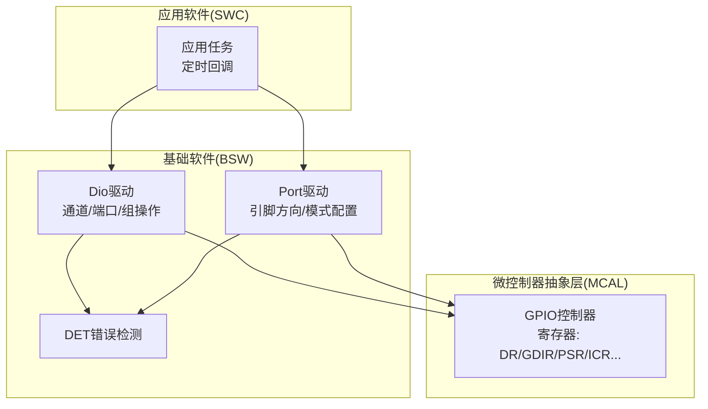
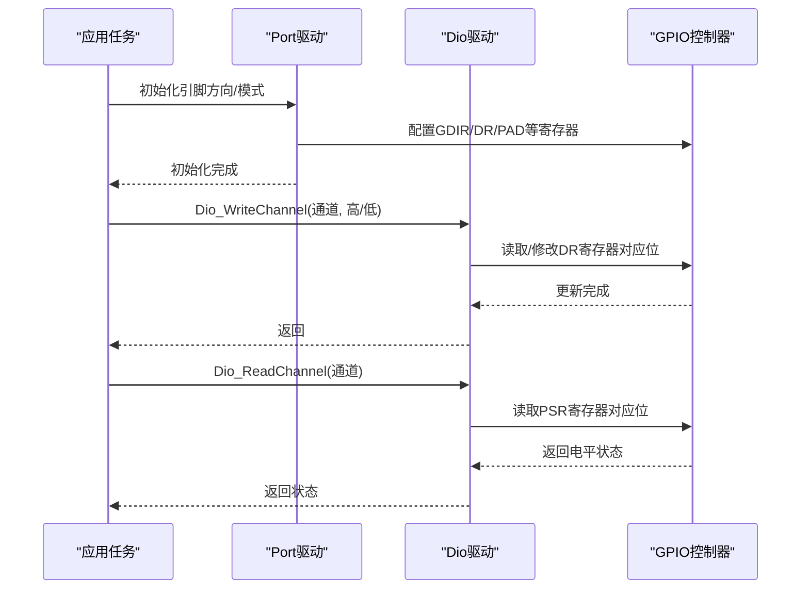
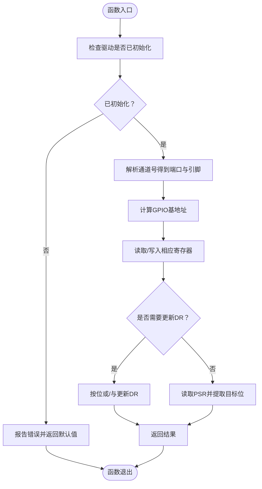
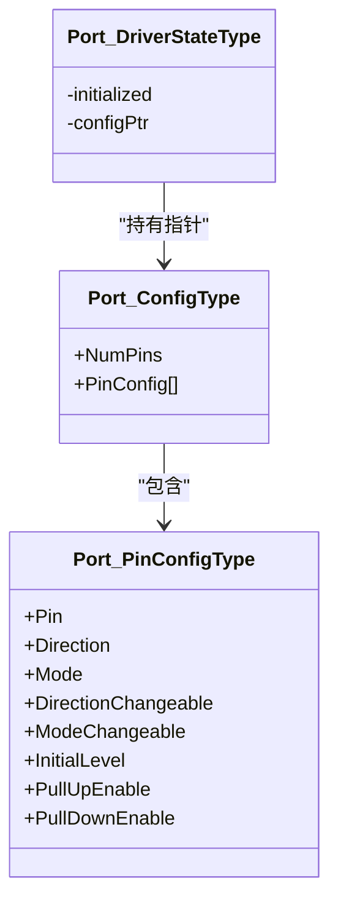
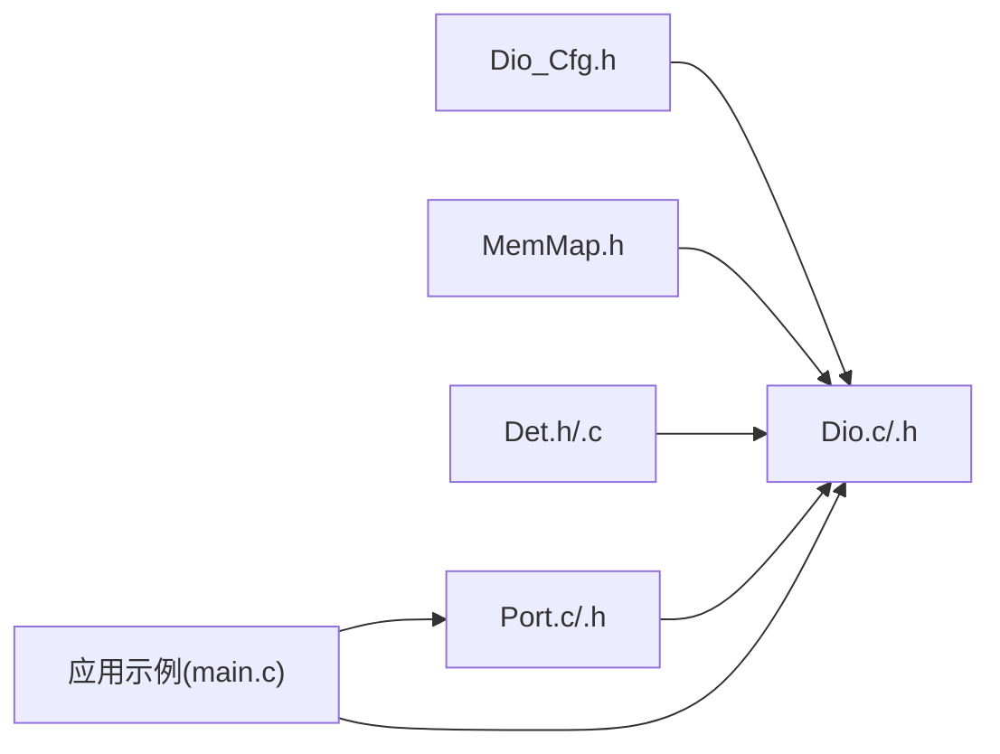

# Dio数字I/O驱动

<cite>
**本文引用的文件**
- [Dio.h](file://src/bsw/mcal/dio/include/Dio.h)
- [Dio.c](file://src/bsw/mcal/dio/src/Dio.c)
- [Dio_Cfg.h](file://src/bsw/mcal/dio/include/Dio_Cfg.h)
- [Port.h](file://src/bsw/mcal/port/include/Port.h)
- [Port.c](file://src/bsw/mcal/port/src/Port.c)
- [Port_Cfg.h](file://src/bsw/config/templates/Port_Cfg.h)
- [MemMap.h](file://src/bsw/general/inc/MemMap.h)
- [Det.h](file://src/bsw/services/det/include/Det.h)
- [Det.c](file://src/bsw/services/det/src/Det.c)
- [main.c](file://examples/led_blink/main.c)
</cite>

## 目录
1. [简介](#简介)
2. [项目结构](#项目结构)
3. [核心组件](#核心组件)
4. [架构总览](#架构总览)
5. [详细组件分析](#详细组件分析)
6. [依赖关系分析](#依赖关系分析)
7. [性能考虑](#性能考虑)
8. [故障排查指南](#故障排查指南)
9. [结论](#结论)
10. [附录](#附录)

## 简介
本文件为Dio数字I/O驱动模块的技术文档，面向嵌入式系统开发者与测试工程师，系统性阐述数字输入输出端口的配置、读写操作与状态管理能力。重点覆盖以下核心API：
- Dio_WriteChannel：通道写入
- Dio_ReadChannel：通道读取
- Dio_WritePort：端口写入
- Dio_ReadPort：端口读取
- Dio_FlipChannel：通道翻转（可选）
- Dio_ReadChannelGroup / Dio_WriteChannelGroup：通道组读写（可选）
并结合平台i.MX8M Mini的GPIO寄存器模型，说明端口配置参数、引脚映射关系、高低电平定义以及中断触发相关配置要点。同时提供GPIO配置示例、端口操作模式与性能优化建议，并解释Dio与上层模块（如Port）的接口关系与硬件抽象机制。

## 项目结构
Dio位于MCAL层，遵循AutoSAR标准，提供对GPIO控制器的直接访问与抽象封装。其主要文件组织如下：
- 头文件：Dio.h（对外API）、Dio_Cfg.h（编译期配置）
- 实现：Dio.c（基于寄存器的底层实现）
- 平台与内存映射：MemMap.h（编译器无关的内存段宏）
- 错误检测：Det.h/.c（开发错误追踪）
- 上层接口：Port.h/.c（引脚方向、模式、上下拉等配置）
- 示例：examples/led_blink/main.c（演示Dio与Gpt配合的LED闪烁）

图表来源
- [Dio.h:101-185](file://src/bsw/mcal/dio/include/Dio.h#L101-L185)
- [Dio.c:56-262](file://src/bsw/mcal/dio/src/Dio.c#L56-L262)
- [Port.h:119-173](file://src/bsw/mcal/port/include/Port.h#L119-L173)
- [Port.c:252-306](file://src/bsw/mcal/port/src/Port.c#L252-L306)

章节来源
- [Dio.h:1-195](file://src/bsw/mcal/dio/include/Dio.h#L1-L195)
- [Dio.c:1-266](file://src/bsw/mcal/dio/src/Dio.c#L1-L266)
- [Port.h:1-183](file://src/bsw/mcal/port/include/Port.h#L1-L183)
- [Port.c:1-461](file://src/bsw/mcal/port/src/Port.c#L1-L461)
- [MemMap.h:46-173](file://src/bsw/general/inc/MemMap.h#L46-L173)

## 核心组件
- Dio驱动（MCAL）
  - 对外API：通道读写、端口读写、通道组读写、通道翻转（可选）、版本信息（可选）
  - 内部实现：通过GPIO基地址与寄存器偏移进行位操作，支持错误检测与版本信息导出
- Port驱动（MCAL）
  - 配置引脚方向、模式、上下拉、输出速度等，将引脚切换到GPIO模式并设置初始电平
- 内存映射与编译器适配
  - MemMap.h提供统一的代码段、常量段、配置数据段与变量段宏，确保不同编译器的一致性
- 错误检测（DET）
  - 提供错误上报、启动与版本查询接口，用于在开发阶段捕获非法调用

章节来源
- [Dio.h:54-185](file://src/bsw/mcal/dio/include/Dio.h#L54-L185)
- [Dio.c:56-262](file://src/bsw/mcal/dio/src/Dio.c#L56-L262)
- [Port.h:55-173](file://src/bsw/mcal/port/include/Port.h#L55-L173)
- [Port.c:252-457](file://src/bsw/mcal/port/src/Port.c#L252-L457)
- [MemMap.h:46-173](file://src/bsw/general/inc/MemMap.h#L46-L173)
- [Det.h:47-71](file://src/bsw/services/det/include/Det.h#L47-L71)
- [Det.c:47-80](file://src/bsw/services/det/src/Det.c#L47-L80)

## 架构总览
Dio与Port共同构成数字I/O的完整栈：Port负责引脚级的硬件配置（方向、模式、电气特性），Dio负责运行时的读写与翻转操作。两者通过统一的通道/端口编号体系与寄存器地址映射协同工作。

图表来源
- [Port.c:266-302](file://src/bsw/mcal/port/src/Port.c#L266-L302)
- [Dio.c:91-115](file://src/bsw/mcal/dio/src/Dio.c#L91-L115)
- [Dio.c:68-89](file://src/bsw/mcal/dio/src/Dio.c#L68-L89)

## 详细组件分析

### Dio驱动API与实现
- 通道读取（Dio_ReadChannel）
  - 功能：返回指定通道的当前电平（高/低）
  - 实现要点：解析通道号获取端口与引脚，计算GPIO基地址，读取PSR寄存器对应位
  - 错误处理：未初始化或通道越界时报错
- 通道写入（Dio_WriteChannel）
  - 功能：将指定通道设置为高电平或低电平
  - 实现要点：读取DR寄存器，按位或/与操作更新目标引脚，写回DR
  - 错误处理：同上
- 端口读取（Dio_ReadPort）
  - 功能：读取整个端口的32位电平值
  - 实现要点：根据端口索引计算基址，读取PSR
- 端口写入（Dio_WritePort）
  - 功能：一次性写入端口全部32位
  - 实现要点：根据端口索引计算基址，直接写DR
- 通道组读写（Dio_ReadChannelGroup / Dio_WriteChannelGroup）
  - 功能：对端口中的连续若干位进行读写，支持掩码与偏移
  - 实现要点：利用mask与offset定位子集，读写DR并按位组合
- 通道翻转（Dio_FlipChannel，可选）
  - 功能：将通道电平从高变低或从低变高
  - 实现要点：读取DR，取反目标位后写回
- 版本信息（Dio_GetVersionInfo，可选）
  - 功能：返回模块版本信息（供应商ID、模块ID、主/次/补丁版本）

图表来源
- [Dio.c:68-115](file://src/bsw/mcal/dio/src/Dio.c#L68-L115)
- [Dio.c:117-151](file://src/bsw/mcal/dio/src/Dio.c#L117-L151)
- [Dio.c:153-191](file://src/bsw/mcal/dio/src/Dio.c#L153-L191)
- [Dio.c:210-240](file://src/bsw/mcal/dio/src/Dio.c#L210-L240)

章节来源
- [Dio.h:90-185](file://src/bsw/mcal/dio/include/Dio.h#L90-L185)
- [Dio.c:56-262](file://src/bsw/mcal/dio/src/Dio.c#L56-L262)

### Dio配置参数与通道映射
- 编译期配置（Dio_Cfg.h）
  - 开关：DIO_DEV_ERROR_DETECT、DIO_VERSION_INFO_API、DIO_FLIP_CHANNEL_API、DIO_MASKED_WRITE_PORT_API
  - 数量：DIO_NUM_PORTS（8）、DIO_NUM_CHANNELS_PER_PORT（32）
  - 端口常量：DIO_PORT_A..DIO_PORT_H（0..7）
  - 通道常量：每个端口包含0..31号通道，采用高位表示端口、低位表示引脚的编码格式
- 通道组配置
  - 支持定义通道组数量（DIO_NUM_CHANNEL_GROUPS），通过Dio_ChannelGroupType结构体描述端口、偏移与掩码

章节来源
- [Dio_Cfg.h:15-87](file://src/bsw/mcal/dio/include/Dio_Cfg.h#L15-L87)

### Port驱动与引脚配置
- 引脚方向与模式
  - 方向：输入/输出（PORT_PIN_IN/PORT_PIN_OUT）
  - 模式：GPIO、ADC、CAN、SPI、UART、I2C、PWM、ETH等
  - 初始电平：输出时可配置初始高/低
- 上下拉与电气特性
  - 上拉/下拉：PORT_PIN_PULL_UP/DOWN/NONE
  - 输出类型：推挽/开漏（PORT_PIN_OUTPUT_PUSH_PULL/OPEN_DRAIN）
  - 输出速度：低/中/高/极高
- 寄存器映射与实现要点
  - IOMUXC寄存器：SW_MUX_CTL_PAD与SW_PAD_CTL_PAD，用于选择复用模式与电气参数
  - GPIO寄存器：DR（数据寄存器）、GDIR（方向寄存器）、PSR（状态寄存器）、ICR/IMR/ISR/EDGE_SEL（中断相关）
- 初始化流程
  - 遍历配置数组，为每个引脚设置复用模式、PAD参数，并在GPIO模式下设置方向与初始电平

图表来源
- [Port.h:74-89](file://src/bsw/mcal/port/include/Port.h#L74-L89)
- [Port.c:68-82](file://src/bsw/mcal/port/src/Port.c#L68-L82)

章节来源
- [Port.h:55-173](file://src/bsw/mcal/port/include/Port.h#L55-L173)
- [Port.c:252-457](file://src/bsw/mcal/port/src/Port.c#L252-L457)
- [Port_Cfg.h:20-78](file://src/bsw/config/templates/Port_Cfg.h#L20-L78)

### 硬件抽象与寄存器访问
- 基地址与寄存器偏移
  - GPIO1..GPIO5基地址常量定义于Dio.c与Port.c中
  - 关键寄存器：DR（数据寄存器）、GDIR（方向寄存器）、PSR（状态寄存器）、ICR1/ICR2（中断触发控制）、IMR（中断屏蔽）、ISR（中断状态）、EDGE_SEL（边沿选择）
- 访问宏
  - 通过DIO_GET_PORT/ DIO_GET_PIN宏从通道号中提取端口与引脚
  - MemMap.h提供跨编译器的内存段宏，确保代码正确放置到指定段

章节来源
- [Dio.c:13-29](file://src/bsw/mcal/dio/src/Dio.c#L13-L29)
- [Port.c:24-42](file://src/bsw/mcal/port/src/Port.c#L24-L42)
- [MemMap.h:46-173](file://src/bsw/general/inc/MemMap.h#L46-L173)

### 中断触发配置说明
- Dio层不直接提供中断触发配置API；中断相关寄存器（ICR1/ICR2/IMR/ISR/EDGE_SEL）由底层GPIO控制器管理
- 若需启用外部中断，通常在Port层配置引脚模式为GPIO并设置IOMUXC复用，再在上层软件中结合ICR寄存器进行边沿/电平触发配置
- Dio层可通过Dio_ReadChannelGroup等接口读取中断状态寄存器（ISR）以确认中断事件

章节来源
- [Dio.c:19-27](file://src/bsw/mcal/dio/src/Dio.c#L19-L27)
- [Port.c:37-41](file://src/bsw/mcal/port/src/Port.c#L37-L41)

### GPIO配置示例与端口操作模式
- 示例：LED闪烁（examples/led_blink/main.c）
  - 步骤：Mcu_Init → Port_Init（GPIO模式与方向）→ Dio_Init → Gpt_Init → 回调中周期性调用Dio_WriteChannel翻转LED
  - 注意：示例中使用了DioConf_*符号，表明存在配置生成工具链，实际工程中应确保Dio配置与Port配置一致
- 端口操作模式
  - 单通道模式：Dio_ReadChannel / Dio_WriteChannel
  - 端口模式：Dio_ReadPort / Dio_WritePort
  - 掩码写入模式：Dio_MaskedWritePort（可选）
  - 组操作模式：Dio_ReadChannelGroup / Dio_WriteChannelGroup（可选）

章节来源
- [main.c:61-99](file://examples/led_blink/main.c#L61-L99)
- [Dio.c:242-262](file://src/bsw/mcal/dio/src/Dio.c#L242-L262)
- [Dio.h:145-156](file://src/bsw/mcal/dio/include/Dio.h#L145-L156)

## 依赖关系分析
- 模块内依赖
  - Dio依赖Dio_Cfg.h提供的编译期配置与通道/端口常量
  - Dio依赖MemMap.h进行内存段管理
  - Dio在开启错误检测时依赖Det.h/.c进行错误上报
- 模块间依赖
  - Port负责将引脚切换到GPIO模式并设置方向/初始电平，Dio在此基础上进行读写
  - 应用层通过Port配置引脚，通过Dio进行运行时控制

图表来源
- [Dio_Cfg.h:15-87](file://src/bsw/mcal/dio/include/Dio_Cfg.h#L15-L87)
- [Dio.h:20-21](file://src/bsw/mcal/dio/include/Dio.h#L20-L21)
- [Dio.c:9-11](file://src/bsw/mcal/dio/src/Dio.c#L9-L11)
- [MemMap.h:46-173](file://src/bsw/general/inc/MemMap.h#L46-L173)
- [Det.h:17-19](file://src/bsw/services/det/include/Det.h#L17-L19)
- [Det.c:19-20](file://src/bsw/services/det/src/Det.c#L19-L20)
- [Port.h:21-22](file://src/bsw/mcal/port/include/Port.h#L21-L22)
- [Port.c:17-19](file://src/bsw/mcal/port/src/Port.c#L17-L19)
- [main.c:15-18](file://examples/led_blink/main.c#L15-L18)

章节来源
- [Dio.h:1-195](file://src/bsw/mcal/dio/include/Dio.h#L1-L195)
- [Dio.c:1-266](file://src/bsw/mcal/dio/src/Dio.c#L1-L266)
- [Port.h:1-183](file://src/bsw/mcal/port/include/Port.h#L1-L183)
- [Port.c:1-461](file://src/bsw/mcal/port/src/Port.c#L1-L461)
- [main.c:1-100](file://examples/led_blink/main.c#L1-L100)

## 性能考虑
- 寄存器访问优化
  - 尽量合并对同一端口的多次写操作，减少重复读取/写入DR寄存器的次数
  - 使用端口写入（Dio_WritePort）替代逐通道写入，降低寄存器访问开销
- 通道组与掩码写入
  - 在需要部分位保持不变时，优先使用掩码写入（Dio_MaskedWritePort，可选）以避免读-改-写竞争
- 错误检测成本
  - 在生产版本可关闭DIO_DEV_ERROR_DETECT以减少分支判断与错误上报开销
- 中断场景
  - 若频繁触发中断，建议在Port层合理配置ICR寄存器，避免过多无效中断；在Dio层通过组读取快速判定中断源

## 故障排查指南
- 常见错误与定位
  - 未初始化：调用Dio_WriteChannel/Dio_ReadChannel前必须先调用Dio_Init；若未初始化，DET会报告错误
  - 参数越界：通道号超过范围或端口号超出限制会导致错误上报
  - 指针为空：版本信息查询或通道组操作传入空指针会触发错误
- 调试建议
  - 启用DET并在开发阶段观察错误码，定位调用顺序与参数问题
  - 使用Port_GetVersionInfo与Dio_GetVersionInfo核对模块版本一致性
  - 在Port层确认引脚模式已切换至GPIO且方向正确

章节来源
- [Dio.c:58-66](file://src/bsw/mcal/dio/src/Dio.c#L58-L66)
- [Dio.c:71-80](file://src/bsw/mcal/dio/src/Dio.c#L71-L80)
- [Dio.c:196-207](file://src/bsw/mcal/dio/src/Dio.c#L196-L207)
- [Det.h:47-71](file://src/bsw/services/det/include/Det.h#L47-L71)
- [Det.c:47-80](file://src/bsw/services/det/src/Det.c#L47-L80)

## 结论
Dio驱动提供了简洁高效的数字I/O访问接口，结合Port驱动的引脚配置能力，能够满足从引脚模式切换到运行时读写的完整需求。通过合理的端口/通道组操作与掩码写入策略，可在保证正确性的前提下提升性能。建议在开发阶段充分利用DET进行错误检测，在生产阶段根据需求权衡错误检测开关以获得最佳性能。

## 附录

### API一览与参数说明
- Dio_ReadChannel(通道ID) → 电平（高/低）
- Dio_WriteChannel(通道ID, 电平) → void
- Dio_ReadPort(端口ID) → 端口电平值
- Dio_WritePort(端口ID, 电平值) → void
- Dio_ReadChannelGroup(通道组指针) → 子集电平值
- Dio_WriteChannelGroup(通道组指针, 电平值) → void
- Dio_FlipChannel(通道ID) → 翻转后的电平（可选）
- Dio_GetVersionInfo(版本信息指针) → void（可选）

章节来源
- [Dio.h:90-185](file://src/bsw/mcal/dio/include/Dio.h#L90-L185)

### 高低电平与端口定义
- 电平类型：STD_LOW（0V）、STD_HIGH（5V/3.3V）
- 端口数量：8个（A..H），每端口32位
- 通道编码：高位为端口索引，低位为引脚索引

章节来源
- [Dio.h:64-74](file://src/bsw/mcal/dio/include/Dio.h#L64-L74)
- [Dio_Cfg.h:23-36](file://src/bsw/mcal/dio/include/Dio_Cfg.h#L23-L36)