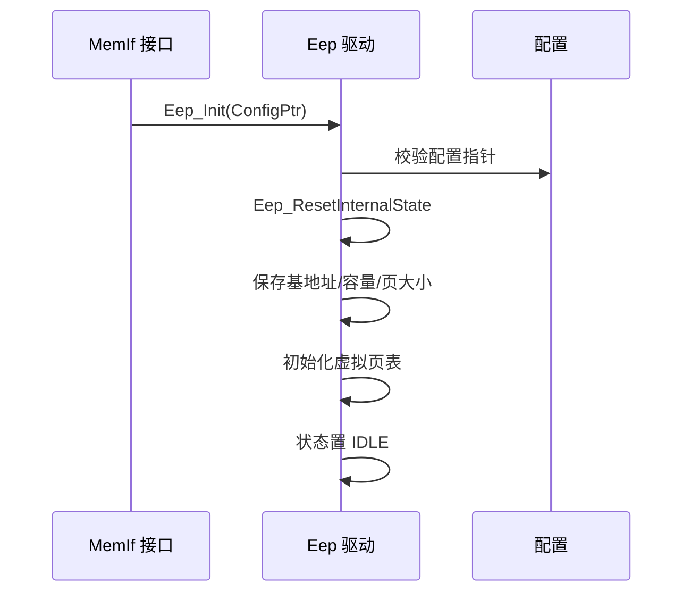
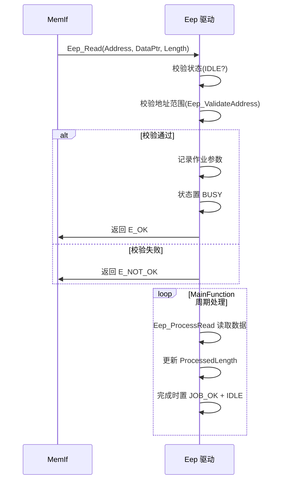
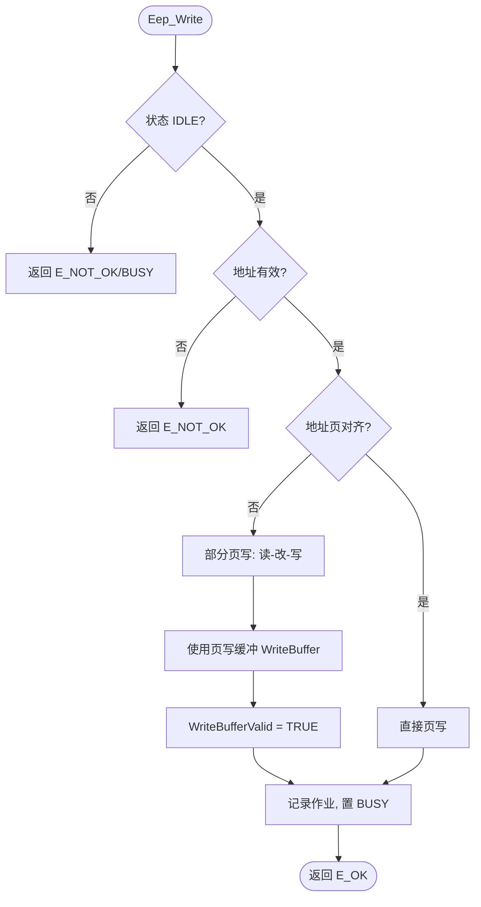

# Eep（EEPROM驱动模块）

<cite>
**本文档引用的文件**
- [Eep.h](file://src/bsw/mcal/eep/include/Eep.h)
- [Eep_Cfg.h](file://src/bsw/mcal/eep/include/Eep_Cfg.h)
- [Eep.c](file://src/bsw/mcal/eep/src/Eep.c)
- [Eep_Lcfg.c](file://src/bsw/mcal/eep/src/Eep_Lcfg.c)
- [MemIf.h](file://src/bsw/ecual/memif/include/MemIf.h)
- [Det.h](file://src/bsw/services/det/include/Det.h)
- [Std_Types.h](file://src/bsw/os/include/Std_Types.h)
</cite>

## 目录
1. [简介](#简介)
2. [项目结构](#项目结构)
3. [核心组件](#核心组件)
4. [架构概览](#架构概览)
5. [详细组件分析](#详细组件分析)
6. [依赖关系分析](#依赖关系分析)
7. [性能考虑](#性能考虑)
8. [故障排除指南](#故障排除指南)
9. [结论](#结论)
10. [附录](#附录)

## 简介

Eep（EEPROM Driver，EEPROM 驱动）是基于 AUTOSAR 4.4.0 标准开发的 MCAL 层非易失存储器驱动模块，提供 EEPROM 设备的读、写、擦除和状态管理功能。该模块实现了 AUTOSAR 标准的外部 EEPROM 驱动接口，支持异步作业处理（轮询模式）、虚拟页表管理和磨损均衡（Wear Leveling）机制。

Eep 位于 MemIf（存储器接口）之下，为上层 Ea（EEPROM 抽象）和 NvM（非易失存储器管理）提供统一的 EEPROM 访问服务，针对 i.MX8M Mini 平台的 EEPROM 硬件（基地址 0x08078000，64KB 容量）实现。

**章节来源**
- [Eep.h:16-60](file://src/bsw/mcal/eep/include/Eep.h#L16-L60)
- [Eep.h:62-110](file://src/bsw/mcal/eep/include/Eep.h#L62-L110)

## 项目结构

Eep 模块源码位于 `src/bsw/mcal/eep/`：

```
src/bsw/mcal/eep/
├── include/
│   ├── Eep.h              # 公共 API 与类型定义（215 行）
│   └── Eep_Cfg.h          # 预编译配置（42 行）
└── src/
    ├── Eep.c              # 驱动实现（状态机 + 作业处理）
    └── Eep_Lcfg.c         # 链接时配置
```

```mermaid
graph TB
subgraph "服务层"
NVM[NvM 非易失存储器管理]
end
subgraph "ECUAL"
EA[Ea EEPROM 抽象]
MEMIF[MemIf 存储器接口]
end
subgraph "MCAL"
EEP[Eep 驱动]
end
subgraph "硬件"
EEPROM[EEPROM 设备]
END
NVM --> EA
NVM --> MEMIF
EA --> MEMIF
MEMIF --> EEP
EEP --> EEPROM
```

**图表来源**
- [Eep.h:16-20](file://src/bsw/mcal/eep/include/Eep.h#L16-L20)
- [Eep.c:8-16](file://src/bsw/mcal/eep/src/Eep.c#L8-L16)

**章节来源**
- [Eep.h:1-110](file://src/bsw/mcal/eep/include/Eep.h#L1-L110)
- [Eep_Cfg.h:1-42](file://src/bsw/mcal/eep/include/Eep_Cfg.h#L1-L42)

## 核心组件

Eep 模块的核心组件包括：

### 数据类型定义
- **Eep_AddressType**: 地址类型（uint32）
- **Eep_LengthType**: 长度类型（uint32）
- **Eep_JobResultType**: 作业结果枚举（JOB_OK/JOB_PENDING/JOB_FAILED/JOB_CANCELED）
- **Eep_StatusType**: 模块状态（UNINIT/IDLE/BUSY）
- **Eep_ModeType**: 模式类型（uint8）
- **Eep_ConfigType**: 配置结构（BaseAddress、Size、JobCallCycle、PageSize、WriteCycleTimeMs、EraseCycleTimeMs、PollingMode）

### 内部状态（Eep.c）
- **Eep_InternalType**: 模块内部状态：
  - 状态/作业结果/当前操作（Read/Write/Erase）
  - 当前地址/数据指针/长度/已处理长度
  - 虚拟页表（Eep_VirtualPageType）：物理页内的虚拟页 ID + 磨损均衡序列号
  - 写缓冲：EEP_PAGE_SIZE 字节的页写缓冲

### 配置参数（Eep_Cfg.h）
- **EEP_BASE_ADDRESS**: 0x08078000（134742016）
- **EEP_SIZE**: 64KB
- **EEP_PAGE_SIZE**: 8 字节
- **EEP_WRITE_CYCLE_TIME**: 写周期 10ms
- **EEP_ERASE_CYCLE_TIME**: 擦除周期 20ms
- **EEP_JOB_CALL_CYCLE**: 作业调用周期 10ms
- **EEP_POLLING_MODE**: 轮询模式
- **EEP_CANCEL_API**: 取消 API 使能

**章节来源**
- [Eep.h:85-110](file://src/bsw/mcal/eep/include/Eep.h#L85-L110)
- [Eep.c:40-125](file://src/bsw/mcal/eep/src/Eep.c#L40-L125)

## 架构概览

Eep 采用"API 层 → 作业状态机 → 分页处理层 → 硬件访问层"的架构：

```mermaid
graph TB
subgraph "API 层"
READ[Eep_Read]
WRITE[Eep_Write]
ERASE[Eep_Erase]
CANCEL[Eep_Cancel]
STATUS[Eep_GetStatus/GetJobResult]
MAIN[Eep_MainFunction]
VER[Eep_GetVersionInfo]
end
subgraph "作业状态机"
OPDISP[作业分发]
PROCESS_R[Eep_ProcessRead]
PROCESS_W[Eep_ProcessWrite]
PROCESS_E[Eep_ProcessErase]
EXEC[Eep_ExecuteMemoryAccess]
END
subgraph "分页与磨损均衡"
PAGETBL[虚拟页表]
WRBUF[页写缓冲]
END
subgraph "硬件访问"
HWACC[存储器访问]
TIMING[Eep_GetTick 超时]
END
READ --> OPDISP
WRITE --> OPDISP
ERASE --> OPDISP
OPDISP --> PROCESS_R
OPDISP --> PROCESS_W
OPDISP --> PROCESS_E
PROCESS_W --> PAGETBL
PROCESS_W --> WRBUF
PROCESS_R --> EXEC
PROCESS_W --> EXEC
PROCESS_E --> EXEC
EXEC --> HWACC
MAIN --> PROCESS_R
MAIN --> PROCESS_W
MAIN --> PROCESS_E
STATUS --> OPDISP
```

**图表来源**
- [Eep.c:131-273](file://src/bsw/mcal/eep/src/Eep.c#L131-L273)
- [Eep.c:275-560](file://src/bsw/mcal/eep/src/Eep.c#L275-L560)

## 详细组件分析

### 初始化组件分析

Eep_Init() 完成驱动初始化：



**图表来源**
- [Eep.c:275-305](file://src/bsw/mcal/eep/src/Eep.c#L275-L305)

#### 初始化流程详解

1. **参数验证**: 检查配置指针（DET 上报 EEP_E_PARAM_POINTER）
2. **状态重置**: 清空当前操作、作业结果、缓冲
3. **配置装载**: 保存地址/容量/页参数
4. **页表建立**: 初始化虚拟页表与磨损均衡序列

**章节来源**
- [Eep.c:275-305](file://src/bsw/mcal/eep/src/Eep.c#L275-L305)

### 读作业组件分析

Eep_Read() 与 Eep_ProcessRead() 实现异步读：



**图表来源**
- [Eep.c:320-373](file://src/bsw/mcal/eep/src/Eep.c#L320-L373)
- [Eep.c:192-213](file://src/bsw/mcal/eep/src/Eep.c#L192-L213)

#### 读作业特性

- **异步模型**: 请求立即返回，MainFunction 中完成实际读取
- **地址校验**: Eep_ValidateAddress 检查地址+长度不越界
- **状态跟踪**: 通过 GetStatus/GetJobResult 轮询进度

**章节来源**
- [Eep.c:320-373](file://src/bsw/mcal/eep/src/Eep.c#L320-L373)

### 写作业组件分析

Eep_Write() 实现带磨损均衡的页写：



**图表来源**
- [Eep.c:374-426](file://src/bsw/mcal/eep/src/Eep.c#L374-L426)
- [Eep.c:214-235](file://src/bsw/mcal/eep/src/Eep.c#L214-L235)

#### 写作业特性

- **页粒度写入**: 按 EEP_PAGE_SIZE（8 字节）分页处理
- **部分页支持**: 非对齐写入通过读-改-写缓冲实现
- **磨损均衡**: 虚拟页序列号 (Sequence) 轮换写入位置
- **写周期控制**: WriteCycleMs 约束每页写入间隔

**章节来源**
- [Eep.c:374-426](file://src/bsw/mcal/eep/src/Eep.c#L374-L426)

### 擦除与主函数组件分析

- **Eep_Erase**: 按长度发起擦除作业，处理流程与读写一致（Eep_ProcessErase）
- **Eep_MainFunction**: 周期驱动作业推进，按 JobCallCycle（10ms）节拍执行
- **Eep_Cancel**: 取消当前作业（返回 EEP_JOB_CANCELED）
- **Eep_GetStatus/GetJobResult**: 供 MemIf/NvM 轮询作业状态

**章节来源**
- [Eep.c:427-544](file://src/bsw/mcal/eep/src/Eep.c#L427-L544)
- [Eep.h:110-130](file://src/bsw/mcal/eep/include/Eep.h#L110-L130)

## 依赖关系分析

Eep 模块的依赖关系：

```mermaid
graph TB
subgraph "Eep 内部"
EP_H[Eep.h]
EP_CFG[Eep_Cfg.h]
EP_C[Eep.c]
EP_LCFG[Eep_Lcfg.c]
END
subgraph "基础依赖"
STD[Std_Types.h]
DET[Det.h]
MEMMAP[MemMap.h]
END
subgraph "上层"
MEMIF[MemIf]
EA[Ea]
NVM[NvM]
END
EP_H --> STD
EP_H --> EP_CFG
EP_C --> EP_H
EP_C --> DET
EP_LCFG --> EP_CFG
MEMIF --> EP_H
EA --> MEMIF
NVM --> MEMIF
```

**图表来源**
- [Eep.h:16-20](file://src/bsw/mcal/eep/include/Eep.h#L16-L20)
- [Eep.c:8-16](file://src/bsw/mcal/eep/src/Eep.c#L8-L16)

### 关键依赖关系

1. **MemIf 依赖**: 通过 MemIf 标准接口被 Ea/NvM 调用
2. **错误检测依赖**: Det.h 提供 DET 错误上报
3. **标准类型依赖**: Std_Types.h 提供基础类型
4. **配置依赖**: Eep_Lcfg.c 提供 Eep_Config 配置实例

**章节来源**
- [Eep.h:16-20](file://src/bsw/mcal/eep/include/Eep.h#L16-L20)
- [Eep_Cfg.h:20-42](file://src/bsw/mcal/eep/include/Eep_Cfg.h#L20-L42)

## 性能考虑

### 时序参数

| 参数 | 值 | 说明 |
|------|-----|------|
| EEP_PAGE_SIZE | 8 字节 | 页写入粒度 |
| EEP_WRITE_CYCLE_TIME | 10ms | 每页写周期 |
| EEP_ERASE_CYCLE_TIME | 20ms | 擦除周期 |
| EEP_JOB_CALL_CYCLE | 10ms | MainFunction 节拍 |
| EEP_SIZE | 64KB | 容量 |

### 吞吐量估算

- **写吞吐**: 8 字节/10ms = 800 字节/秒（页对齐最优）
- **部分页写**: 增加读-改-写开销（约 2 倍耗时）
- **磨损均衡**: 虚拟页轮换降低单页擦写次数，延长寿命

### 资源占用

- 内部状态：约 200 字节（含页表与写缓冲）
- 虚拟页表：按 EEP_MAX_VIRTUAL_PAGES 线性增长
- 轮询模式无中断资源占用

**章节来源**
- [Eep_Cfg.h:30-42](file://src/bsw/mcal/eep/include/Eep_Cfg.h#L30-L42)
- [Eep.c:40-125](file://src/bsw/mcal/eep/src/Eep.c#L40-L125)

## 故障排除指南

### 常见错误代码

| 错误代码 | 错误含义 | 可能原因 | 解决方案 |
|---------|---------|---------|---------|
| EEP_E_PARAM_POINTER (0x01) | 指针无效 | 空指针参数 | 检查调用参数 |
| EEP_E_PARAM_ADDRESS (0x02) | 地址无效 | 地址越界 | 检查地址范围 |
| EEP_E_PARAM_LENGTH (0x03) | 长度无效 | 长度+地址越界 | 检查长度参数 |
| EEP_E_UNINIT (0x04) | 未初始化 | Init 前调用 | 检查初始化时序 |
| EEP_E_BUSY (0x05) | 忙 | 作业进行中 | 等待 IDLE |
| EEP_E_WRITE_PROTECTED (0x06) | 写保护 | 硬件写保护 | 解除保护 |
| EEP_E_COMPARE_FAILED (0x07) | 比较失败 | 数据校验不符 | 检查写时序 |
| EEP_E_TIMEOUT (0x09) | 超时 | 作业未完成 | 检查硬件 |

### 调试建议

1. **作业状态监控**: 轮询 GetStatus/GetJobResult 观察作业推进
2. **地址校验**: 确认访问地址+长度不越过 EEP_SIZE
3. **磨损观察**: 检查虚拟页序列号轮换是否正常
4. **时序验证**: 示波器测量页写时序是否符合 EEPROM 数据手册

**章节来源**
- [Eep.h:66-80](file://src/bsw/mcal/eep/include/Eep.h#L66-L80)
- [Eep.c:147-190](file://src/bsw/mcal/eep/src/Eep.c#L147-L190)

## 结论

Eep EEPROM 驱动模块是一个实现规范、功能完整的 AUTOSAR 4.4.0 MCAL 存储器组件。它提供：

1. **完整 AUTOSAR 接口**: 读/写/擦除/取消/状态查询全套 API
2. **异步作业模型**: 请求-轮询模式支持与 MemIf 无缝协作
3. **磨损均衡**: 虚拟页表与序列号轮换延长 EEPROM 寿命
4. **页缓冲写入**: 支持非对齐部分页写入
5. **超时保护**: 作业级超时防止硬件挂死

该模块为 NvM 非易失数据管理提供了可靠的底层存储服务。

## 附录

### 配置示例

```c
/* Eep_Lcfg.c 配置实例 */
const Eep_ConfigType Eep_Config = {
    .BaseAddress = EEP_BASE_ADDRESS,        /* 0x08078000 */
    .Size = EEP_SIZE,                        /* 65536 */
    .JobCallCycle = EEP_JOB_CALL_CYCLE,      /* 10ms */
    .PageSize = EEP_PAGE_SIZE,               /* 8 */
    .WriteCycleTimeMs = EEP_WRITE_CYCLE_TIME,/* 10 */
    .EraseCycleTimeMs = EEP_ERASE_CYCLE_TIME,/* 20 */
    .PollingMode = TRUE
};
```

### 使用流程

1. MemIf 选择 Eep 设备后调用 Eep_Init()
2. NvM 写请求 → MemIf → Eep_Write 发起作业
3. MainFunction 周期推进写作业直至完成
4. NvM 通过 GetJobResult 确认写完成
5. 多块写入时合理安排 JobCallCycle 避免总线拥塞

**章节来源**
- [Eep_Lcfg.c:1-80](file://src/bsw/mcal/eep/src/Eep_Lcfg.c#L1-L80)
- [Eep.h:85-110](file://src/bsw/mcal/eep/include/Eep.h#L85-L110)
