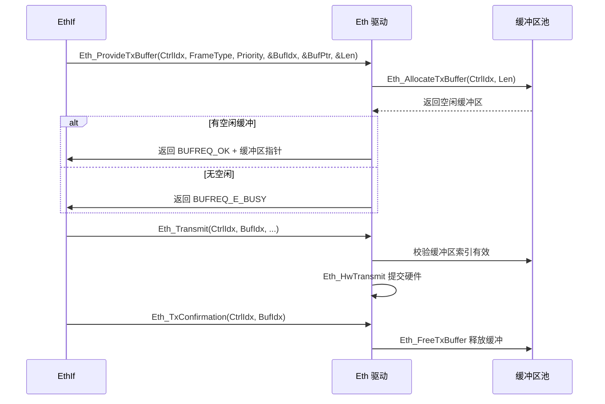
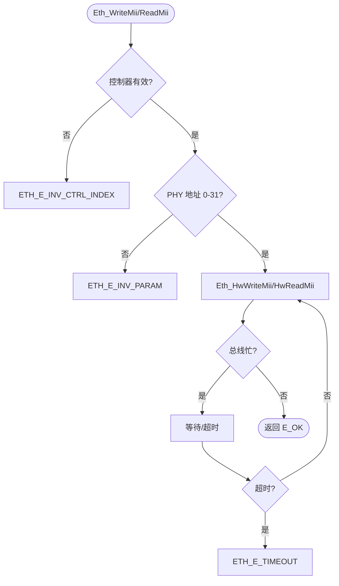
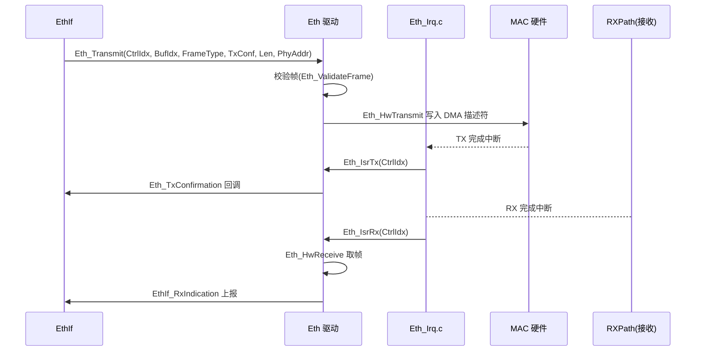

# Eth（以太网驱动模块）

<cite>
**本文档引用的文件**
- [Eth.h](file://src/bsw/mcal/eth/include/Eth.h)
- [Eth_Cfg.h](file://src/bsw/mcal/eth/include/Eth_Cfg.h)
- [Eth_Lcfg.h](file://src/bsw/mcal/eth/include/Eth_Lcfg.h)
- [Eth_Private.h](file://src/bsw/mcal/eth/include/Eth_Private.h)
- [Eth_GeneralTypes.h](file://src/bsw/mcal/eth/include/Eth_GeneralTypes.h)
- [Eth.c](file://src/bsw/mcal/eth/src/Eth.c)
- [Eth_Irq.c](file://src/bsw/mcal/eth/src/Eth_Irq.c)
- [Det.h](file://src/bsw/services/det/include/Det.h)
- [Std_Types.h](file://src/bsw/os/include/Std_Types.h)
</cite>

## 目录
1. [简介](#简介)
2. [项目结构](#项目结构)
3. [核心组件](#核心组件)
4. [架构概览](#架构概览)
5. [详细组件分析](#详细组件分析)
6. [依赖关系分析](#依赖关系分析)
7. [性能考虑](#性能考虑)
8. [故障排除指南](#故障排除指南)
9. [结论](#结论)
10. [附录](#附录)

## 简介

Eth（Ethernet Driver，以太网驱动）是基于 AUTOSAR 4.4.0 标准开发的 MCAL 层以太网控制器驱动模块，负责管理以太网 MAC 控制器的初始化、模式管理、帧收发、MII（媒体独立接口）管理寄存器和地址过滤等功能。该模块针对 NXP i.MX8M Mini 平台的以太网控制器实现，为上层 EthIf/EthTrcv/EthSM 提供统一的硬件抽象。

本模块实现了完整的 AUTOSAR Eth API 集合（22 个服务 ID），支持多控制器管理、DMA 缓冲区管理、收发校验和卸载（Checksum Offload）和硬件时间戳（供 StbM 使用）。

**章节来源**
- [Eth.h:28-90](file://src/bsw/mcal/eth/include/Eth.h#L28-L90)
- [Eth.h:88-140](file://src/bsw/mcal/eth/include/Eth.h#L88-L140)

## 项目结构

Eth 模块源码位于 `src/bsw/mcal/eth/`：

```
src/bsw/mcal/eth/
├── include/
│   ├── Eth.h                  # 公共 API（278 行）
│   ├── Eth_Cfg.h              # 预编译配置
│   ├── Eth_Lcfg.h             # 链接时配置声明
│   ├── Eth_Private.h          # 私有数据结构
│   └── Eth_GeneralTypes.h     # 通用类型（链路/接收状态/唤醒源）
└── src/
    ├── Eth.c                  # 驱动实现（缓冲区/MII/收发）
    └── Eth_Irq.c              # 中断服务程序
```

```mermaid
graph TB
subgraph "上层"
ETHIF[EthIf 以太网接口]
ETHTRCV[EthTrcv 收发器驱动]
ETHSM[EthSM 状态管理]
STBM[StbM 时间同步]
end
subgraph "MCAL"
ETH[Eth 驱动]
subgraph "内部组件"
BUF[缓冲区管理]
MII[MII 管理接口]
TX[发送路径]
RX[接收路径]
IRQ[中断处理 Eth_Irq.c]
end
end
subgraph "硬件"
MAC[以太网 MAC 控制器]
PHY[PHY 芯片]
END
ETHIF --> ETH
ETHTRCV --> ETH
ETHSM --> ETH
STBM --> ETH
ETH --> BUF
ETH --> MII
ETH --> TX
ETH --> RX
BUF --> MAC
TX --> MAC
RX --> MAC
IRQ --> MAC
MII --> PHY
MAC --> PHY
```

**图表来源**
- [Eth.h:14-24](file://src/bsw/mcal/eth/include/Eth.h#L14-L24)
- [Eth.c:8-16](file://src/bsw/mcal/eth/src/Eth.c#L8-L16)

**章节来源**
- [Eth.h:1-90](file://src/bsw/mcal/eth/include/Eth.h#L1-L90)
- [Eth.h:140-180](file://src/bsw/mcal/eth/include/Eth.h#L140-L180)

## 核心组件

Eth 模块的核心组件包括：

### 数据类型定义
- **Eth_StateType**: 控制器状态（UNINIT/INIT）
- **Eth_ModeType**: 控制器模式（DOWN/ACTIVE）
- **Eth_ControllerType**: 控制器索引（uint8，INVALID_CONTROLLER_INDEX=0xFF）
- **Eth_BufIdxType**: 缓冲区索引（uint8，INVALID_BUF_INDEX=0xFF）
- **Eth_FrameIdType**: 帧 ID（uint16）
- **Eth_MacAddrType**: MAC 地址（6 字节数组）
- **Eth_RateType**: 速率（10/100/1000 Mbps）
- **Eth_PhyAddrType**: PHY 地址（0-31）
- **Eth_RegAddrType**: MII 寄存器地址（BMCR=0x00、BMSR=0x01、PHYIDR1=0x02 等）
- **Eth_FrameStructType**: 帧结构（源/目的 MAC、帧类型、载荷指针与长度）
- **Eth_ControllerConfigType**: 控制器配置（MAC 地址、速率、双工、校验和卸载、PHY 地址、TX/RX 缓冲数、缓冲大小）
- **Eth_ConfigType**: 模块配置（控制器配置数组、数量、DET/版本开关）

### 通用类型（Eth_GeneralTypes.h）
- **Eth_LinkStateType**: 链路状态（DOWN/UP）
- **Eth_RxStatusType**: 接收状态（NONE/NEW_DATA/...）
- **Eth_WakeupSourceType**: 唤醒源
- **Eth_BufReqType**: 缓冲请求类型

### MII 寄存器定义
- ETH_MII_REG_BMCR/BMSR/PHYIDR1/PHYIDR2: 标准 PHY 寄存器

**章节来源**
- [Eth.h:88-180](file://src/bsw/mcal/eth/include/Eth.h#L88-L180)
- [Eth_GeneralTypes.h:16-44](file://src/bsw/mcal/eth/include/Eth_GeneralTypes.h#L16-L44)

## 架构概览

Eth 采用"API 层 → 控制器管理层 → 缓冲区管理 → 硬件访问层"的分层架构：

```mermaid
graph TB
subgraph "API 层"
INIT[Eth_Init/DeInit/ControllerInit]
MODE[Eth_SetControllerMode/GetControllerMode]
MAC[Eth_GetPhysAddr/SetPhysAddr/UpdatePhysAddrFilter]
MII[Eth_WriteMii/ReadMii]
TX[Eth_Transmit/ProvideTxBuffer/TxConfirmation]
RX[Eth_Receive]
IRQ[Eth_EnableIrq/DisableIrq]
TS[Eth_GetCurrentTime]
end
subgraph "控制器管理层"
HWINIT[Eth_HwInit/HwDeInit]
HWMODE[Eth_HwSetMode]
END
subgraph "缓冲区管理"
TXBUF[Eth_InitTxBuffers/AllocateTxBuffer/FreeTxBuffer]
RXBUF[Eth_InitRxBuffers/FreeRxBuffer]
END
subgraph "硬件访问层"
HWTX[Eth_HwTransmit]
HWRX[Eth_HwReceive]
HWMII[Eth_HwWriteMii/HwReadMii]
MACFILT[Eth_UpdateMacAddress]
END
INIT --> HWINIT
MODE --> HWMODE
TX --> TXBUF
TX --> HWTX
RX --> RXBUF
RX --> HWRX
MII --> HWMII
MAC --> MACFILT
TXBUF --> HWTX
RXBUF --> HWRX
```

**图表来源**
- [Eth.c:56-333](file://src/bsw/mcal/eth/src/Eth.c#L56-L333)
- [Eth.c:334-700](file://src/bsw/mcal/eth/src/Eth.c#L334-L700)

## 详细组件分析

### 缓冲区管理组件分析

Eth_InitTxBuffers()/Eth_AllocateTxBuffer() 实现 DMA 缓冲区管理：



**图表来源**
- [Eth.c:95-130](file://src/bsw/mcal/eth/src/Eth.c#L95-L130)
- [Eth.c:452-540](file://src/bsw/mcal/eth/src/Eth.c#L452-L540)

#### 缓冲区管理特性

- **双缓冲池**: TX/RX 独立缓冲区池（TxBufCount/RxBufCount 配置）
- **帧长约束**: ETH_MIN_FRAME_SIZE(14) ~ ETH_MAX_FRAME_SIZE(1522)，默认缓冲 1536 字节
- **索引追踪**: BufIdx 生命周期由 ProvideTxBuffer → Transmit → TxConfirmation 管理
- **非法索引保护**: ETH_INVALID_BUF_INDEX 哨兵值

**章节来源**
- [Eth.c:95-142](file://src/bsw/mcal/eth/src/Eth.c#L95-L142)
- [Eth.h:107-115](file://src/bsw/mcal/eth/include/Eth.h#L107-L115)

### MII 管理组件分析

Eth_WriteMii()/Eth_ReadMii() 提供 PHY 寄存器访问：



**图表来源**
- [Eth.c:636-700](file://src/bsw/mcal/eth/src/Eth.c#L636-L700)

#### MII 特性

- **标准寄存器集**: BMCR/BMSR/PHYIDR1/PHYIDR2 定义
- **超时保护**: MII 总线访问带超时检测
- **供 EthTrcv 使用**: EthTrcv 的 PHY 读写复用此接口

**章节来源**
- [Eth.c:636-700](file://src/bsw/mcal/eth/src/Eth.c#L636-L700)
- [Eth.h:152-158](file://src/bsw/mcal/eth/include/Eth.h#L152-L158)

### 收发路径组件分析

Eth_Transmit()/Eth_Receive() 与中断服务程序：



**图表来源**
- [Eth.c:284-333](file://src/bsw/mcal/eth/src/Eth.c#L284-L333)
- [Eth_Irq.c:1-120](file://src/bsw/mcal/eth/src/Eth_Irq.c#L1-L120)

#### 收发特性

- **DMA 描述符**: 硬件 DMA 收发减少 CPU 拷贝
- **校验和卸载**: Rx/TxChecksumOffload 配置硬件计算
- **MAC 过滤**: UpdatePhysAddrFilter 支持接收地址过滤
- **时间戳**: Eth_GetCurrentTime 供 StbM 时间同步

**章节来源**
- [Eth.c:284-333](file://src/bsw/mcal/eth/src/Eth.c#L284-L333)
- [Eth.h:220-278](file://src/bsw/mcal/eth/include/Eth.h#L220-L278)

## 依赖关系分析

Eth 模块的依赖关系：

```mermaid
graph TB
subgraph "Eth 内部"
ETH_H[Eth.h]
ETH_CFG[Eth_Cfg.h]
ETH_L[Eth_Lcfg.h]
ETH_P[Eth_Private.h]
ETH_G[Eth_GeneralTypes.h]
ETH_C[Eth.c]
ETH_IRQ[Eth_Irq.c]
END
subgraph "基础依赖"
STD[Std_Types.h]
DET[Det.h]
COMSTACK[ComStack_Types.h]
MEMMAP[MemMap.h]
END
subgraph "上层"
ETHIF[EthIf]
ETHTRCV[EthTrcv]
STBM[StbM]
END
ETH_H --> ETH_G
ETH_H --> ETH_CFG
ETH_C --> ETH_H
ETH_C --> ETH_P
ETH_C --> DET
ETH_IRQ --> ETH_H
ETHIF --> ETH_H
ETHTRCV --> ETH_H
STBM --> ETH_H
```

**图表来源**
- [Eth.h:14-24](file://src/bsw/mcal/eth/include/Eth.h#L14-L24)
- [Eth.c:8-16](file://src/bsw/mcal/eth/src/Eth.c#L8-L16)

### 关键依赖关系

1. **EthIf 依赖**: EthIf 调用收发/配置 API，接收 TxConfirmation/RxIndication
2. **EthTrcv 依赖**: EthTrcv 复用 MII 管理接口访问 PHY
3. **StbM 依赖**: 时间戳接口服务时间同步
4. **ComStack 依赖**: BufReq_ReturnType 来自 ComStack_Types.h

**章节来源**
- [Eth.h:14-24](file://src/bsw/mcal/eth/include/Eth.h#L14-L24)
- [Eth.h:232-240](file://src/bsw/mcal/eth/include/Eth.h#L232-L240)

## 性能考虑

### 帧长约束

| 参数 | 值 | 说明 |
|------|-----|------|
| ETH_MIN_FRAME_SIZE | 14 字节 | MAC 头最小长度 |
| ETH_MAX_FRAME_SIZE | 1522 字节 | 最大帧（含 FCS） |
| ETH_DEFAULT_FRAME_SIZE | 1536 字节 | 默认缓冲区大小 |

### 速率与双工

- 支持 10/100/1000 Mbps（ETH_RATE_* 枚举）
- 半双工/全双工配置（FullDuplex 标志）
- 校验和卸载显著降低 CPU 负担

### 缓冲区资源

- TX/RX 缓冲数量与大小由 ControllerConfig 配置
- 缓冲不足时 ProvideTxBuffer 返回 BUFREQ_E_BUSY
- 中断路径（Eth_Irq.c）保证收发实时性

**章节来源**
- [Eth.h:113-118](file://src/bsw/mcal/eth/include/Eth.h#L113-L118)
- [Eth.h:160-180](file://src/bsw/mcal/eth/include/Eth.h#L160-L180)

## 故障排除指南

### 常见错误代码

| 错误代码 | 错误含义 | 可能原因 | 解决方案 |
|---------|---------|---------|---------|
| ETH_E_NOT_INITIALIZED (0x01) | 未初始化 | Init 前调用 | 检查初始化时序 |
| ETH_E_INV_CTRL_INDEX (0x02) | 控制器无效 | 索引越界 | 检查 NumControllers |
| ETH_E_INV_POINTER (0x03) | 指针无效 | 空指针参数 | 检查调用参数 |
| ETH_E_INV_PARAM (0x04) | 参数无效 | 帧长/PHY 地址非法 | 检查参数范围 |
| ETH_E_INV_MODE (0x06) | 模式无效 | 模式枚举非法 | 使用 ModeType |
| ETH_E_INV_FRAME_LENGTH (0x07) | 帧长无效 | 超出 14-1522 | 检查帧长 |
| ETH_E_TIMEOUT (0x0A) | 超时 | MII/硬件无响应 | 检查 PHY/时钟 |
| ETH_E_BUSY (0x0B) | 忙 | 缓冲不足 | 增大缓冲配置 |

### 调试建议

1. **寄存器检查**: ReadMii 检查 PHYIDR/BMSR 确认 PHY 通信正常
2. **缓冲监控**: 观察 ProvideTxBuffer 返回码检查缓冲耗尽
3. **中断验证**: 确认 IsrTx/IsrRx 触发频率与流量匹配
4. **地址过滤**: 验证 UpdatePhysAddrFilter 后帧过滤行为

**章节来源**
- [Eth.h:73-83](file://src/bsw/mcal/eth/include/Eth.h#L73-L83)
- [Eth.c:20-40](file://src/bsw/mcal/eth/src/Eth.c#L20-L40)

## 结论

Eth 以太网驱动模块是功能完整、性能优良的 AUTOSAR 4.4.0 MCAL 网络组件。它提供：

1. **完整 AUTOSAR 接口**: 22 个服务覆盖配置、收发、MII、中断全场景
2. **DMA 缓冲区管理**: 高效收发路径减少 CPU 干预
3. **多控制器支持**: 独立配置多个以太网控制器
4. **校验和卸载**: 硬件加速降低协议栈开销
5. **时间戳支持**: 为 TSN 时间同步提供硬件时间源

该模块为车载以太网通信栈（EthIf/EthTrcv/EthSM）提供了坚实的硬件抽象基础。

## 附录

### 控制器配置示例

```c
/* Eth_Lcfg.c 控制器配置 */
const Eth_ControllerConfigType Eth_Controllers[] = {
    {
        .CtrlIdx = 0U,
        .MacAddr = {0x00, 0x11, 0x22, 0x33, 0x44, 0x55},
        .Speed = ETH_RATE_100MBPS,
        .FullDuplex = TRUE,
        .RxChecksumOffload = TRUE,
        .TxChecksumOffload = TRUE,
        .PhyAddress = 0U,
        .TxBufCount = 8U,
        .RxBufCount = 16U,
        .BufSize = ETH_DEFAULT_FRAME_SIZE
    }
};

const Eth_ConfigType Eth_Config = {
    .CtrlConfig = Eth_Controllers,
    .NumControllers = 1U,
    .DevErrorDetect = STD_ON,
    .VersionInfoApi = STD_ON
};
```

### 收发流程

1. EthIf 调 ProvideTxBuffer 获取缓冲并填充帧数据
2. Eth_Transmit 提交硬件 DMA，完成中断触发 TxConfirmation
3. 接收中断中 Eth_Receive 取帧并上报 EthIf_RxIndication
4. 诊断可通过 ReadMii/WriteMii 直接访问 PHY 寄存器

**章节来源**
- [Eth_Lcfg.h:1-80](file://src/bsw/mcal/eth/include/Eth_Lcfg.h#L1-L80)
- [Eth.h:180-278](file://src/bsw/mcal/eth/include/Eth.h#L180-L278)
