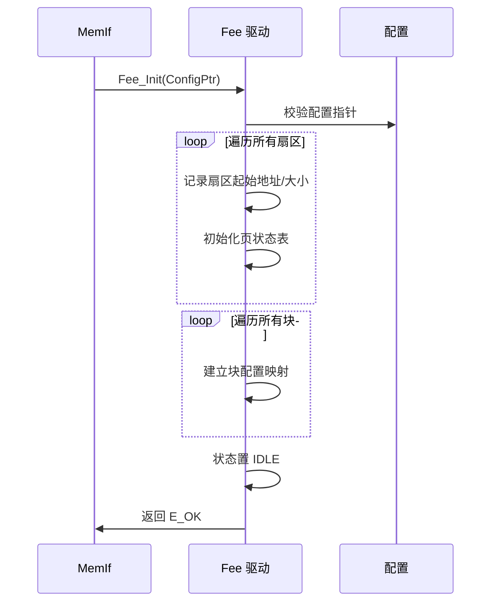
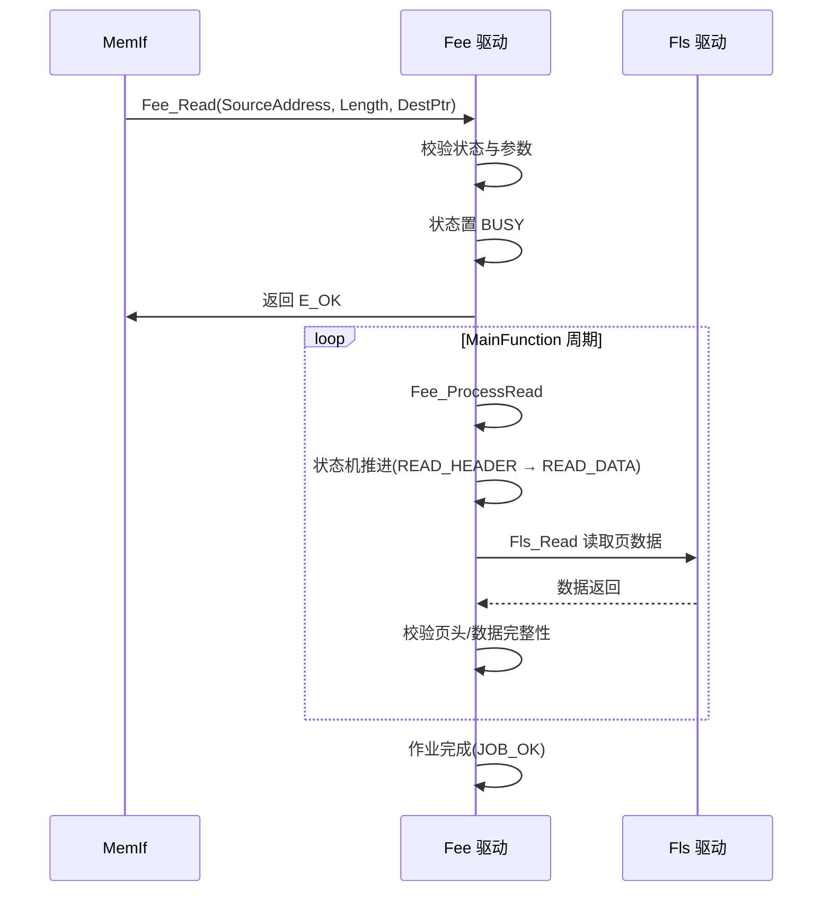
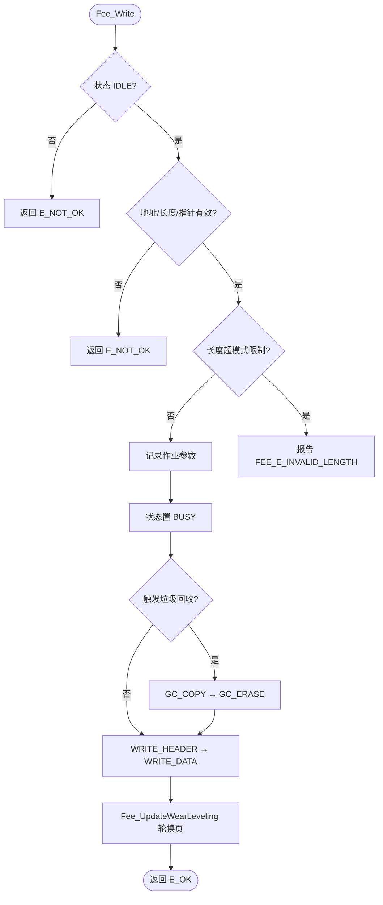

# Fee（Flash EEPROM仿真模块）

<cite>
**本文档引用的文件**
- [Fee.h](file://src/bsw/mcal/fee/include/Fee.h)
- [Fee_Cfg.h](file://src/bsw/mcal/fee/include/Fee_Cfg.h)
- [Fee_MemMap.h](file://src/bsw/mcal/fee/include/Fee_MemMap.h)
- [SchM_Fee.h](file://src/bsw/mcal/fee/include/SchM_Fee.h)
- [Fee.c](file://src/bsw/mcal/fee/src/Fee.c)
- [Fee_Lcfg.c](file://src/bsw/mcal/fee/src/Fee_Lcfg.c)
- [MemIf.h](file://src/bsw/ecual/memif/include/MemIf.h)
- [Det.h](file://src/bsw/services/det/include/Det.h)
</cite>

## 目录
1. [简介](#简介)
2. [项目结构](#项目结构)
3. [核心组件](#核心组件)
4. [架构概览](#架构概览)
5. [详细组件分析](#详细组件分析)
6. [依赖关系分析](#依赖关系分析)
7. [性能考虑](#性能考虑)
8. [故障排除指南](#故障排除指南)
9. [结论](#结论)
10. [附录](#附录)

## 简介

Fee（Flash EEPROM Emulation，Flash EEPROM 仿真）是基于 AUTOSAR 4.7.0 标准开发的 MCAL 层非易失存储器抽象驱动，通过 Flash 扇区管理模拟 EEPROM 行为，为上层 NvM 提供按块读写的非易失存储服务。该模块实现虚拟页管理、磨损均衡（Wear Leveling）、垃圾回收（Garbage Collection）、擦除挂起/恢复等高级功能。

Fee 位于 Fls（Flash 驱动）之上、MemIf（存储器接口）之下，针对 i.MX8M Mini 平台的内部 Flash（基地址 0x10000000，8MB，扇区 64KB）实现 EEPROM 仿真，支持最多 4 个扇区、16 个数据块。

**章节来源**
- [Fee.h:42-110](file://src/bsw/mcal/fee/include/Fee.h#L42-L110)
- [Fee.h:114-180](file://src/bsw/mcal/fee/include/Fee.h#L114-L180)

## 项目结构

Fee 模块源码位于 `src/bsw/mcal/fee/`：

```
src/bsw/mcal/fee/
├── include/
│   ├── Fee.h               # 公共 API 与类型定义（483 行）
│   ├── Fee_Cfg.h           # 预编译配置
│   ├── Fee_MemMap.h        # 内存段映射
│   └── SchM_Fee.h          # 调度器互斥接口
└── src/
    ├── Fee.c               # 驱动实现（作业状态机）
    └── Fee_Lcfg.c          # 链接时扇区/块配置
```

```mermaid
graph TB
subgraph "服务层"
NVM[NvM 非易失存储器管理]
end
subgraph "ECUAL"
MEMIF[MemIf 存储器接口]
end
subgraph "MCAL"
FEE[Fee 驱动]
subgraph "内部机制"
PAGE[虚拟页管理]
WEAR[磨损均衡]
GC[垃圾回收]
SUSPEND[擦除挂起/恢复]
end
end
FLS[Fls Flash 驱动]
subgraph "硬件"
FLASH[内部 Flash]
END
NVM --> MEMIF
MEMIF --> FEE
FEE --> PAGE
FEE --> WEAR
FEE --> GC
FEE --> SUSPEND
FEE --> FLS
FLS --> FLASH
```

**图表来源**
- [Fee.h:37-44](file://src/bsw/mcal/fee/include/Fee.h#L37-L44)
- [Fee.c:8-16](file://src/bsw/mcal/fee/src/Fee.c#L8-L16)

**章节来源**
- [Fee.h:1-110](file://src/bsw/mcal/fee/include/Fee.h#L1-L110)
- [Fee_Cfg.h:1-120](file://src/bsw/mcal/fee/include/Fee_Cfg.h#L1-L120)

## 核心组件

Fee 模块的核心组件包括：

### 数据类型定义
- **Fee_AddressType / Fee_LengthType**: 地址与长度类型（uint32）
- **Fee_StateType**: 驱动状态（UNINIT/IDLE/BUSY）
- **Fee_JobResultType**: 作业结果（JOB_OK/JOB_FAILED/JOB_PENDING/JOB_CANCELLED/BLOCK_INCONSISTENT/BLOCK_INVALID）
- **Fee_ModeType**: 模式（NORMAL/FAST）
- **Fee_SectorType**: 扇区配置（起始地址、大小、页大小、擦除周期、可写/可擦标志）
- **Fee_BlockType**: 块配置（块号、起始地址、大小、写周期、立即数据标志）
- **Fee_BlockConfigType**: 块配置（Configurator 格式：块号/大小/立即数据/设备索引/周期/对齐）
- **Fee_PageConfigType**: 页配置（起始地址、大小、页号）
- **Fee_JobType**: 作业类型（READ/WRITE/ERASE_IMMEDIATE/GC_PAGE/NONE）
- **Fee_InternalStateType**: 内部状态机（IDLE/READ_HEADER/READ_DATA/WRITE_HEADER/WRITE_DATA/ERASE_IMMEDIATE/GC_COPY/GC_ERASE）

### 配置参数（Fee_Cfg.h）
- **FEE_NUM_SECTORS**: 4 个扇区、**FEE_NUM_BLOCKS**: 16 个块
- **FEE_FLASH_BASE_ADDR**: 0x10000000（268435456）
- **FEE_FLASH_TOTAL_SIZE**: 8MB、**FEE_FLASH_SECTOR_SIZE**: 64KB、**FEE_FLASH_PAGE_SIZE**: 256 字节
- **FEE_VIRTUAL_PAGE_SIZE**: 8 字节（虚拟页）
- **FEE_MAX_WRITE_CYCLES / ERASE_CYCLES**: 100000 次
- **FEE_GC_THRESHOLD_PERCENT**: 80%（垃圾回收阈值）
- **FEE_ERASE_TIMEOUT_US**: 5000000、**FEE_WRITE_TIMEOUT_US**: 100000
- **FEE_ERASE_SUSPEND_SUPPORT / WRITE_VERIFY_SUPPORT / COMPARE_SUPPORT / BLANK_CHECK_SUPPORT / CANCEL_SUPPORT**: 功能开关
- **FEE_MAX_READ/WRITE_NORMAL_MODE**: 256 字节、FAST_MODE: 1024/512 字节

**章节来源**
- [Fee.h:114-280](file://src/bsw/mcal/fee/include/Fee.h#L114-L280)
- [Fee_Cfg.h:20-120](file://src/bsw/mcal/fee/include/Fee_Cfg.h#L20-L120)

## 架构概览

Fee 采用"API 层 → 作业状态机 → 页管理 → Fls 访问"的分层架构：

```mermaid
graph TB
subgraph "API 层"
READ[Fee_Read]
WRITE[Fee_Write]
ERASE[Fee_Erase]
COMPARE[Fee_Compare]
BLANK[Fee_BlankCheck]
MODE[Fee_SetMode]
CTRL[Fee_Cancel/Suspend/Resume]
STATUS[Fee_GetStatus/GetJobResult]
MAIN[Fee_MainFunction]
NOTIFY[Fee_JobEndNotification/JobErrorNotification]
end
subgraph "作业状态机"
STATE[Fee_InternalStateType]
NEXT[Fee_GetNextState]
VALID[Fee_IsStateTransitionValid]
END
subgraph "页管理与磨损均衡"
WEARLVL[Fee_UpdateWearLeveling]
GCPREF[Fee_GetPreferredPageForGc]
BLKCFG[Fee_GetBlockConfig/GetPageConfig]
END
subgraph "Flash 访问"
FLASH_R[Fee_FlashRead]
FLASH_W[Fee_FlashWrite]
FLASH_E[Fee_FlashErase]
END
READ --> STATE
WRITE --> STATE
ERASE --> STATE
MAIN --> STATE
STATE --> NEXT
NEXT --> VALID
WRITE --> WEARLVL
MAIN --> GCPREF
STATE --> FLASH_R
STATE --> FLASH_W
STATE --> FLASH_E
NOTIFY --> STATUS
```

**图表来源**
- [Fee.c:105-390](file://src/bsw/mcal/fee/src/Fee.c#L105-L390)
- [Fee.h:280-483](file://src/bsw/mcal/fee/include/Fee.h#L280-L483)

## 详细组件分析

### 扇区初始化与地址校验组件分析

Fee_InitSectors() 与 Fee_ValidateAddress()：



**图表来源**
- [Fee.c:153-172](file://src/bsw/mcal/fee/src/Fee.c#L153-L172)
- [Fee.c:173-204](file://src/bsw/mcal/fee/src/Fee.c#L173-L204)

#### 地址校验特性

- **扇区归属检查**: Fee_IsAddressInSector / Fee_FindSectorForAddress 定位目标扇区
- **边界保护**: 地址+长度必须落在配置的扇区范围内
- **可写/可擦检查**: 依据 sectorWritable/sectorErasable 标志

**章节来源**
- [Fee.c:143-153](file://src/bsw/mcal/fee/src/Fee.c#L143-L153)
- [Fee.c:173-235](file://src/bsw/mcal/fee/src/Fee.c#L173-L235)

### 读作业组件分析

Fee_Read() 与 Fee_ProcessRead()：



**图表来源**
- [Fee.c:244-279](file://src/bsw/mcal/fee/src/Fee.c#L244-L279)
- [Fee.c:391-480](file://src/bsw/mcal/fee/src/Fee.c#L391-L480)

#### 读作业特性

- **模式约束**: NORMAL 模式单周期最多 256 字节，FAST 模式 1024 字节
- **页头解析**: 读取虚拟页头判断块归属与有效性
- **一致性检查**: BLOCK_INCONSISTENT/BLOCK_INVALID 结果标识块异常

**章节来源**
- [Fee.c:244-279](file://src/bsw/mcal/fee/src/Fee.c#L244-L279)

### 写作业与磨损均衡组件分析

Fee_Write() 与 Fee_UpdateWearLeveling()：



**图表来源**
- [Fee.c:280-331](file://src/bsw/mcal/fee/src/Fee.c#L280-L331)
- [Fee.h:330-360](file://src/bsw/mcal/fee/include/Fee.h#L330-L360)

#### 写作业特性

- **虚拟页写**: 数据写入 FEE_VIRTUAL_PAGE_SIZE（8 字节）虚拟页
- **磨损均衡**: 页轮换（UpdateWearLeveling）避免固定页磨损
- **写校验**: WRITE_VERIFY_SUPPORT 开启时写后回读校验
- **垃圾回收**: 页使用率达 80%（GC_THRESHOLD）时触发 GC

**章节来源**
- [Fee.c:280-331](file://src/bsw/mcal/fee/src/Fee.c#L280-L331)
- [Fee_Cfg.h:50-60](file://src/bsw/mcal/fee/include/Fee_Cfg.h#L50-L60)

### 垃圾回收与擦除挂起组件分析

- **GC 流程**: GC_COPY（拷贝有效页）→ GC_ERASE（擦除源扇区）→ 页表更新
- **GC 页选择**: Fee_GetPreferredPageForGc 选择有效页最少的页
- **擦除挂起**: ERASE_SUSPEND_SUPPORT 开启时支持擦除中挂起，让高优先级读插入
- **状态机验证**: Fee_IsStateTransitionValid 校验所有状态转换合法性

**章节来源**
- [Fee.h:460-483](file://src/bsw/mcal/fee/include/Fee.h#L460-L483)
- [Fee.c:332-390](file://src/bsw/mcal/fee/src/Fee.c#L332-L390)

## 依赖关系分析

Fee 模块的依赖关系：

```mermaid
graph TB
subgraph "Fee 内部"
FE_H[Fee.h]
FE_CFG[Fee_Cfg.h]
FE_MM[Fee_MemMap.h]
FE_SCHM[SchM_Fee.h]
FE_C[Fee.c]
FE_LCFG[Fee_Lcfg.c]
END
subgraph "基础依赖"
STD[Std_Types.h]
DET[Det.h]
END
subgraph "下层"
FLS[Fls Flash 驱动]
END
subgraph "上层"
MEMIF[MemIf]
NVM[NvM]
END
FE_H --> FE_CFG
FE_C --> FE_H
FE_C --> DET
FE_C --> FLS
FE_LCFG --> FE_CFG
MEMIF --> FE_H
NVM --> MEMIF
FE_SCHM --> FE_C
```

**图表来源**
- [Fee.h:37-44](file://src/bsw/mcal/fee/include/Fee.h#L37-L44)
- [Fee.c:8-16](file://src/bsw/mcal/fee/src/Fee.c#L8-L16)

### 关键依赖关系

1. **Fls 依赖**: 所有 Flash 读写擦操作委托 Fls 驱动
2. **MemIf 依赖**: 通过 MemIf 被 NvM 使用（NvM 作业通知回调）
3. **SchM 依赖**: SchM_Fee.h 提供调度器互斥保护
4. **配置依赖**: Fee_Lcfg.c 提供扇区/块/页配置

**章节来源**
- [Fee.h:37-44](file://src/bsw/mcal/fee/include/Fee.h#L37-L44)
- [Fee_Lcfg.c:1-120](file://src/bsw/mcal/fee/src/Fee_Lcfg.c#L1-L120)

## 性能考虑

### 模式吞吐限制

| 模式 | 最大读/周期 | 最大写/周期 |
|------|------------|------------|
| NORMAL | 256 字节 | 256 字节 |
| FAST | 1024 字节 | 512 字节 |

### Flash 时序参数

| 参数 | 值 | 说明 |
|------|-----|------|
| FEE_ERASE_TIMEOUT_US | 5000000 (5s) | 擦除超时 |
| FEE_WRITE_TIMEOUT_US | 100000 (100ms) | 写入超时 |
| FEE_READ_TIMEOUT_US | 10000 (10ms) | 读取超时 |
| FEE_GC_THRESHOLD_PERCENT | 80% | GC 触发阈值 |
| 最大写/擦周期 | 100000 次 | 磨损寿命 |

### 寿命估算

- 4 扇区 × 64KB，虚拟页 8 字节
- 磨损均衡 + GC 可将有效擦写寿命提升至接近 100k × 页数

**章节来源**
- [Fee_Cfg.h:28-60](file://src/bsw/mcal/fee/include/Fee_Cfg.h#L28-L60)
- [Fee_Cfg.h:60-90](file://src/bsw/mcal/fee/include/Fee_Cfg.h#L60-L90)

## 故障排除指南

### 常见错误代码

| 错误代码 | 错误含义 | 可能原因 | 解决方案 |
|---------|---------|---------|---------|
| FEE_E_PARAM_CONFIG (0x01) | 配置无效 | 配置指针错误 | 检查 Lcfg |
| FEE_E_PARAM_ADDRESS (0x02) | 地址无效 | 地址越界 | 检查地址范围 |
| FEE_E_UNINIT (0x05) | 未初始化 | Init 前调用 | 检查初始化时序 |
| FEE_E_BUSY (0x06) | 忙 | 作业进行中 | 等待 IDLE |
| FEE_E_INVALID_LENGTH (0x07) | 长度无效 | 超模式限制 | 分次读写 |
| FEE_E_ERASE_FAILED (0x0B) | 擦除失败 | Flash 故障 | 检查硬件 |
| FEE_E_WRITE_FAILED (0x0C) | 写失败 | 写校验失败 | 检查时序 |
| FEE_BLOCK_INCONSISTENT | 块不一致 | 页头损坏 | 触发恢复 |
| FEE_E_INVALID_SUSPEND (0x10) | 挂起无效 | 不支持挂起 | 检查配置 |
| FEE_E_SUSPENDED (0x11) | 已挂起 | 重复挂起 | 先 Resume |

### 调试建议

1. **状态机观察**: 使用 Fee_GetNextState/Fee_IsStateTransitionValid 验证转换
2. **磨损监控**: 观察 Fee_GetPreferredPageForGc 返回值判断磨损分布
3. **GC 触发**: 检查 GC_THRESHOLD 配置与 GC 执行频率
4. **一致性检查**: 出现 BLOCK_INCONSISTENT 时检查页头序列号

**章节来源**
- [Fee.h:88-105](file://src/bsw/mcal/fee/include/Fee.h#L88-L105)
- [Fee.c:20-40](file://src/bsw/mcal/fee/src/Fee.c#L20-L40)

## 结论

Fee Flash EEPROM 仿真模块是一个功能先进、机制完善的 AUTOSAR 4.7.0 MCAL 存储器组件。它提供：

1. **完整 AUTOSAR 接口**: 读/写/擦/比较/空白检查/挂起恢复全套 API
2. **虚拟页管理**: 8 字节虚拟页 + 页头元数据
3. **磨损均衡**: 页轮换机制延长 Flash 寿命
4. **垃圾回收**: 阈值触发 + 有效页拷贝 + 扇区回收
5. **擦除挂起**: 高优先级读写插入保障实时性

该模块为 NvM 提供了高效可靠的 EEPROM 仿真服务，是整车数据持久化的关键 MCAL 组件。

## 附录

### 配置示例

```c
/* Fee_Lcfg.c 扇区配置 */
const Fee_SectorType Fee_Sectors[FEE_NUM_SECTORS] = {
    {
        .sectorStartAddr = FEE_SECTOR0_START_ADDR,   /* 0x10000000 */
        .sectorSize = FEE_SECTOR0_SIZE,              /* 65536 */
        .sectorPageSize = FEE_FLASH_PAGE_SIZE,       /* 256 */
        .sectorEraseCycles = FEE_SECTOR0_ERASE_CYCLES,
        .sectorWritable = TRUE,
        .sectorErasable = TRUE
    }
    /* 更多扇区 */
};

/* 块配置 */
const Fee_BlockType Fee_Blocks[FEE_NUM_BLOCKS] = {
    {
        .blockNumber = 0U,
        .blockStartAddr = FEE_SECTOR0_START_ADDR,
        .blockSize = 256U,
        .writeCycleCount = FEE_MAX_WRITE_CYCLES,
        .immediateData = FALSE
    }
    /* 更多块 */
};

const Fee_ConfigType Fee_Config = {
    .sectorList = Fee_Sectors,
    .blockList = Fee_Blocks,
    .sectorCount = FEE_NUM_SECTORS,
    .blockCount = FEE_NUM_BLOCKS,
    .defaultMode = FEE_MODE_NORMAL,
    .virtualPageSize = FEE_VIRTUAL_PAGE_SIZE,
    .maxReadNormalMode = FEE_MAX_READ_NORMAL_MODE,
    .maxReadFastMode = FEE_MAX_READ_FAST_MODE,
    .maxWriteNormalMode = FEE_MAX_WRITE_NORMAL_MODE,
    .maxWriteFastMode = FEE_MAX_WRITE_FAST_MODE,
    .eraseSuspendSupport = FEE_ERASE_SUSPEND_SUPPORT,
    .writeVerifySupport = FEE_WRITE_VERIFY_SUPPORT,
    .compareSupport = FEE_COMPARE_SUPPORT,
    .blankCheckSupport = FEE_BLANK_CHECK_SUPPORT
};
```

### 使用流程

1. NvM 通过 MemIf 请求 Fee_Read/Fee_Write
2. Fee 在 MainFunction 中推进页级作业状态机
3. 写满页后按磨损均衡轮换，GC 阈值触发回收
4. 擦除操作支持挂起，让实时性要求高的读插入执行

**章节来源**
- [Fee_Lcfg.c:1-200](file://src/bsw/mcal/fee/src/Fee_Lcfg.c#L1-L200)
- [Fee.h:280-483](file://src/bsw/mcal/fee/include/Fee.h#L280-L483)
