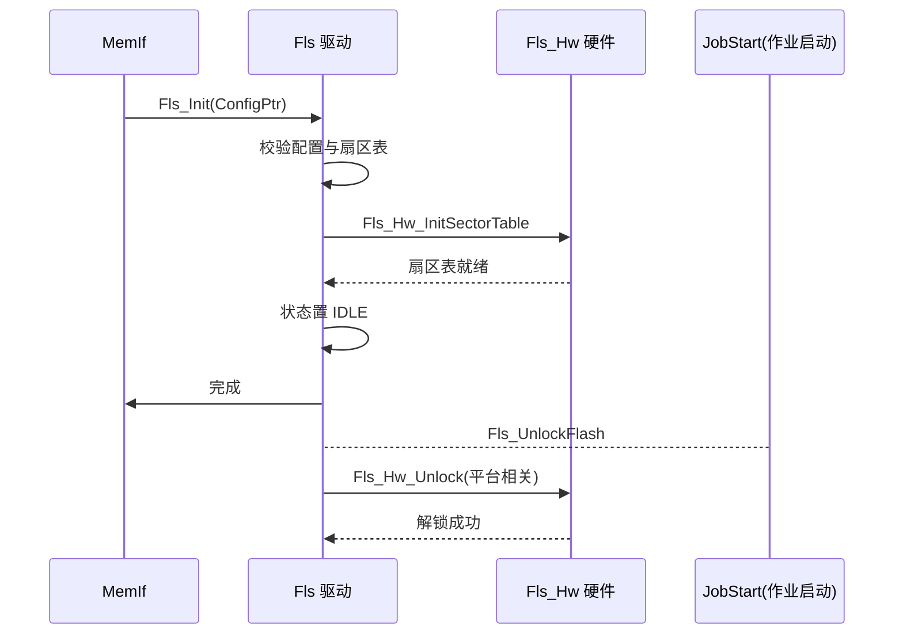
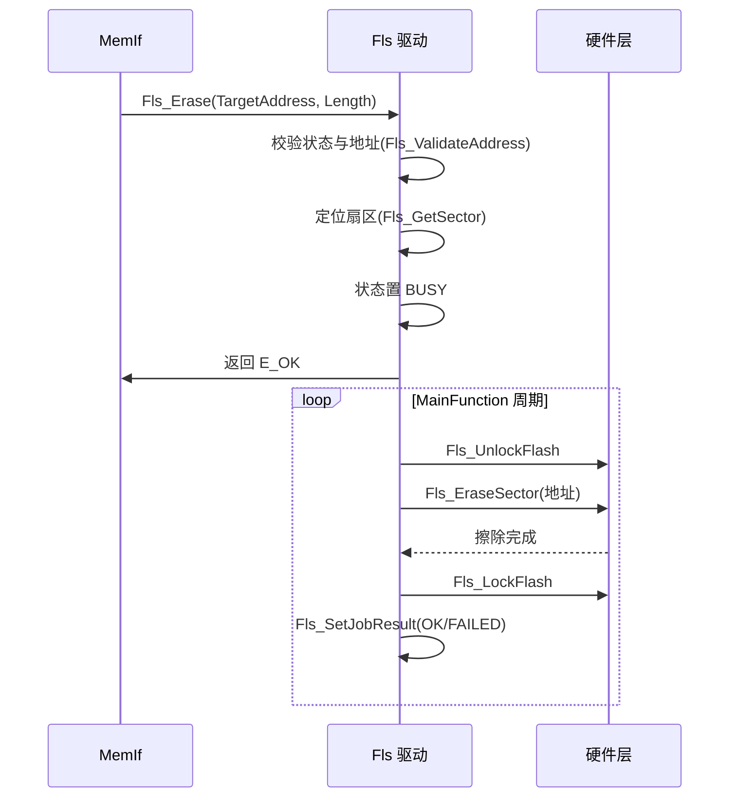

# Fls（Flash驱动模块）

<cite>
**本文档引用的文件**
- [Fls.h](file://src/bsw/mcal/fls/include/Fls.h)
- [Fls_Cfg.h](file://src/bsw/mcal/fls/include/Fls_Cfg.h)
- [Fls_Hw.h](file://src/bsw/mcal/fls/include/Fls_Hw.h)
- [Fls_MemMap.h](file://src/bsw/mcal/fls/include/Fls_MemMap.h)
- [Fls.c](file://src/bsw/mcal/fls/src/Fls.c)
- [Fls_Hw.c](file://src/bsw/mcal/fls/src/Fls_Hw.c)
- [MemIf.h](file://src/bsw/ecual/memif/include/MemIf.h)
- [Det.h](file://src/bsw/services/det/include/Det.h)
</cite>

## 目录
1. [简介](#简介)
2. [项目结构](#项目结构)
3. [核心组件](#核心组件)
4. [架构概览](#架构概览)
5. [详细组件分析](#详细组件分析)
6. [依赖关系分析](#依赖关系分析)
7. [性能考虑](#性能考虑)
8. [故障排除指南](#故障排除指南)
9. [结论](#结论)
10. [附录](#附录)

## 简介

Fls（Flash Driver，Flash 驱动）是基于 AUTOSAR 4.7.0 标准开发的 MCAL 层 Flash 存储驱动模块，提供内部 Flash 的擦除、写入、读取、比较和空白检查等底层服务。该模块实现了 Flash 操作的关键时序要求（解锁/加锁、扇区擦除、页编程），并支持轮询与中断两种作业模式。

Fls 位于 MemIf（存储器接口）之下，为 Fee（EEPROM 仿真）和上层 NvM 提供 Flash 访问服务，同时支持 STM32 与 STM32H7 平台的硬件适配（Fls_Hw.c），并包含软件仿真模式用于无硬件开发调试。

**章节来源**
- [Fls.h:31-130](file://src/bsw/mcal/fls/include/Fls.h#L31-L130)
- [Fls.h:140-175](file://src/bsw/mcal/fls/include/Fls.h#L140-L175)

## 项目结构

Fls 模块源码位于 `src/bsw/mcal/fls/`：

```
src/bsw/mcal/fls/
├── include/
│   ├── Fls.h               # 公共 API 与类型定义（342 行）
│   ├── Fls_Cfg.h           # 预编译配置
│   ├── Fls_Hw.h            # 硬件抽象接口
│   └── Fls_MemMap.h        # 内存段映射
└── src/
    ├── Fls.c               # 驱动实现（作业状态机）
    └── Fls_Hw.c            # 硬件层（STM32/STM32H7/仿真）
```

```mermaid
graph TB
subgraph "服务层"
NVM[NvM 非易失存储器管理]
end
subgraph "ECUAL"
MEMIF[MemIf 存储器接口]
FEE[Fee EEPROM 仿真]
end
subgraph "MCAL"
FLS[Fls Flash 驱动]
subgraph "内部"
JOB[作业状态机]
MODE[模式管理]
END
HW[Fls_Hw 硬件抽象]
end
subgraph "硬件"
FLASH[内部 Flash]
END
NVM --> MEMIF
MEMIF --> FEE
FEE --> FLS
NVM --> FLS
FLS --> JOB
FLS --> MODE
FLS --> HW
HW --> FLASH
```

**图表来源**
- [Fls.h:64-70](file://src/bsw/mcal/fls/include/Fls.h#L64-L70)
- [Fls.c:8-16](file://src/bsw/mcal/fls/src/Fls.c#L8-L16)

**章节来源**
- [Fls.h:1-130](file://src/bsw/mcal/fls/include/Fls.h#L1-L130)
- [Fls_Cfg.h:1-120](file://src/bsw/mcal/fls/include/Fls_Cfg.h#L1-L120)

## 核心组件

Fls 模块的核心组件包括：

### 数据类型定义
- **Fls_AddressType / Fls_LengthType**: 地址与长度（uint32）
- **Fls_StatusType**: 驱动状态（UNINIT/IDLE/BUSY）
- **Fls_JobResultType**: 作业结果（复用 MemIf_JobResultType）
- **Fls_JobType**: 作业类型（JOB_NONE/READ/WRITE/ERASE/SUSPEND/RESUME/COMPARE/BLANK_CHECK/CANCEL）
- **Fls_OpModeType**: 操作模式（NORMAL/FAST）
- **Fls_SectorType**: 扇区配置（起始地址、大小、页大小、解锁掩码、可写/可擦标志）
- **Fls_ConfigType**: 全局配置（扇区列表、数量、模式、读写限制、通知开关）
- **Fls_JobEndNotificationType / Fls_JobErrorNotificationType**: 作业完成/错误回调函数指针

### 配置参数（Fls_Cfg.h）
- **FLS_NUM_OF_SECTORS**: 4 个扇区
- **FLS_BASE_ADDRESS**: 0x08000000（134217728），**FLS_TOTAL_SIZE**: 1MB
- 扇区布局：S0=64KB、S1=64KB、S2=128KB、S3=768KB
- **FLS_SECTOR_x_PAGE_SIZE**: 4 字节（页编程粒度）
- **FLS_MAX_READ_NORMAL_MODE**: 256 字节、FAST: 512
- **FLS_MAX_WRITE_NORMAL_MODE**: 32 字节、FAST: 64
- **FLS_USE_ISR**: 中断模式关闭（轮询）
- **FLS_JOB_END_NOTIFICATION / ERROR_NOTIFICATION**: 通知使能
- **FLS_TIMEOUT_VALUE**: 1000、**FLS_MAIN_FUNCTION_PERIOD**: 10ms

### 硬件抽象（Fls_Hw.c）
- **Fls_Hw_StatusType**: 硬件状态（IDLE/BUSY）
- **Fls_Hw_ErrorType**: 硬件错误类型
- 支持 STM32（Fls_Hw_UnlockSTM32/EraseSectorSTM32/ProgramWordSTM32）与 STM32H7 双平台
- **Fls_Hw_MockFlash**: 软件仿真 Flash 数组（FLS_HW_MOCK_FLASH_SIZE）

**章节来源**
- [Fls.h:140-175](file://src/bsw/mcal/fls/include/Fls.h#L140-L175)
- [Fls.h:175-210](file://src/bsw/mcal/fls/include/Fls.h#L175-L210)
- [Fls_Cfg.h:20-90](file://src/bsw/mcal/fls/include/Fls_Cfg.h#L20-L90)

## 架构概览

Fls 采用"API 层 → 作业状态机 → 硬件抽象层"的三层架构：

```mermaid
graph TB
subgraph "API 层"
INIT[Fls_Init/DeInit]
ERASE[Fls_Erase]
WRITE[Fls_Write]
READ[Fls_Read/ReadSync]
COMPARE[Fls_Compare]
MODE[Fls_SetMode]
CTRL[Fls_Cancel]
STATUS[Fls_GetStatus/GetJobResult]
MAIN[Fls_MainFunction]
VER[Fls_GetVersionInfo]
end
subgraph "作业状态机"
JOBCTRL[Fls_JobControl]
PROC_E[Fls_ProcessErase]
PROC_W[Fls_ProcessWrite]
PROC_R[Fls_ProcessRead]
PROC_C[Fls_ProcessCompare]
FINISH[Fls_FinishJob]
END
subgraph "硬件抽象层"
HW_UNLOCK[Fls_UnlockFlash/LockFlash]
HW_ERASE[Fls_EraseSector]
HW_WRITE[Fls_WritePage]
HW_READ[Fls_ReadData]
END
subgraph "硬件实现"
STM32[STM32 平台实现]
STM32H7[STM32H7 平台实现]
MOCK[软件仿真]
END
ERASE --> PROC_E
WRITE --> PROC_W
READ --> PROC_R
COMPARE --> PROC_C
MAIN --> PROC_E
MAIN --> PROC_W
MAIN --> PROC_R
PROC_E --> HW_ERASE
PROC_W --> HW_WRITE
PROC_R --> HW_READ
HW_UNLOCK --> STM32
HW_ERASE --> STM32
HW_WRITE --> STM32
HW_ERASE --> STM32H7
HW_WRITE --> STM32H7
HW_ERASE --> MOCK
FINISH --> STATUS
```

**图表来源**
- [Fls.c:108-155](file://src/bsw/mcal/fls/src/Fls.c#L108-L155)
- [Fls.c:155-560](file://src/bsw/mcal/fls/src/Fls.c#L155-L560)
- [Fls_Hw.c:265-400](file://src/bsw/mcal/fls/src/Fls_Hw.c#L265-L400)

## 详细组件分析

### 初始化组件分析

Fls_Init() 与 Fls_UnlockFlash()：



**图表来源**
- [Fls.c:155-204](file://src/bsw/mcal/fls/src/Fls.c#L155-L204)
- [Fls.c:134-135](file://src/bsw/mcal/fls/src/Fls.c#L134-L135)

#### 初始化流程详解

1. **参数验证**: 校验配置指针与扇区表（DET 上报）
2. **扇区表初始化**: Fls_Hw_InitSectorTable 建立硬件扇区映射
3. **状态就绪**: Fls_Status 置 IDLE
4. **解锁机制**: 每次擦写前 Fls_UnlockFlash，完成后 Fls_LockFlash

**章节来源**
- [Fls.c:155-204](file://src/bsw/mcal/fls/src/Fls.c#L155-L204)

### 擦除作业组件分析

Fls_Erase() 与 Fls_ProcessErase()：



**图表来源**
- [Fls.c:205-269](file://src/bsw/mcal/fls/src/Fls.c#L205-L269)
- [Fls.c:360-402](file://src/bsw/mcal/fls/src/Fls.c#L360-L402)

#### 擦除特性

- **扇区对齐**: 擦除按扇区边界执行，跨扇区自动分段
- **超时保护**: Fls_TimeoutCounter 配合 FLS_TIMEOUT_VALUE 防止挂死
- **错误上报**: 擦除失败设置 JobResult FAILED 并通知 JobErrorNotification

**章节来源**
- [Fls.c:205-269](file://src/bsw/mcal/fls/src/Fls.c#L205-L269)

### 写入作业组件分析

Fls_Write() 与 Fls_WritePage()：

```mermaid
flowchart TD
Start([Fls_Write]) --> Check{状态 IDLE 且参数有效?}
Check --> |否| Err1[返回 E_NOT_OK]
Check --> |是| CheckLen{长度超 NORMAL 限制?}
CheckLen --> |是| Err2[报告 FLS_E_INVALID_LENGTH]
CheckLen --> |否| SetBusy[状态置 BUSY]
SetBusy --> Unlock[Fls_UnlockFlash]
Unlock --> Loop{按页处理}
Loop --> |下一页| Align{地址页对齐?}
Align --> |否| WordWrite[按字写入(4字节)]
Align --> |是| PageWrite[页编程]
WordWrite --> CheckDone{完成?}
PageWrite --> CheckDone
CheckDone --> |否| Loop
CheckDone --> |是| Lock[Fls_LockFlash]
Lock --> Finish[设置 JobResult]
Finish --> Notify[JobEndNotification]
```

**图表来源**
- [Fls.c:270-344](file://src/bsw/mcal/fls/src/Fls.c#L270-L344)
- [Fls.c:137-138](file://src/bsw/mcal/fls/src/Fls.c#L137-L138)

#### 写入特性

- **页粒度**: 按 FLS_SECTOR_x_PAGE_SIZE（4 字节）编程
- **字对齐处理**: 非对齐写入按字（32 位）操作
- **写后验证**: 支持写后比较校验
- **模式限制**: NORMAL 32 字节/周期、FAST 64 字节/周期

**章节来源**
- [Fls.c:270-344](file://src/bsw/mcal/fls/src/Fls.c#L270-L344)
- [Fls_Cfg.h:70-80](file://src/bsw/mcal/fls/include/Fls_Cfg.h#L70-L80)

### 硬件抽象层组件分析

Fls_Hw.c 提供多平台硬件实现：

```mermaid
graph TB
subgraph "Fls_Hw 接口"
HW_INIT[Fls_Hw_Init]
HW_ERASE[Fls_Hw_PerformErase]
HW_WRITE[Fls_Hw_PerformWrite]
HW_ERR[Fls_Hw_SetError]
HW_STATUS[Fls_Hw_SetStatus]
END
subgraph "平台实现"
STM32[STM32: Unlock/Erase/ProgramWord]
H7[STM32H7: 双 Bank 支持]
MOCK[仿真: MockFlash 数组]
END
subgraph "寄存器仿真"
CR[Fls_Hw_Mock_CR 控制寄存器]
SR[Fls_Hw_Mock_SR 状态寄存器]
KEYR[Fls_Hw_Mock_KEYR 解锁寄存器]
END
HW_INIT --> STM32
HW_INIT --> MOCK
HW_ERASE --> STM32
HW_ERASE --> H7
HW_WRITE --> STM32
HW_WRITE --> H7
HW_ERASE --> MOCK
MOCK --> CR
MOCK --> SR
MOCK --> KEYR
```

**图表来源**
- [Fls_Hw.c:265-400](file://src/bsw/mcal/fls/src/Fls_Hw.c#L265-L400)
- [Fls_Hw.h:1-120](file://src/bsw/mcal/fls/include/Fls_Hw.h#L1-L120)

#### 硬件层特性

- **平台宏切换**: 通过编译宏选择 STM32/STM32H7/仿真实现
- **寄存器仿真**: Mock CR/SR/KEYR 支持无硬件测试
- **错误跟踪**: Fls_Hw_LastError 记录最近硬件错误
- **扇区表**: Fls_Hw_SectorTable 维护硬件扇区映射

**章节来源**
- [Fls_Hw.c:265-400](file://src/bsw/mcal/fls/src/Fls_Hw.c#L265-L400)

## 依赖关系分析

Fls 模块的依赖关系：

```mermaid
graph TB
subgraph "Fls 内部"
FL_H[Fls.h]
FL_CFG[Fls_Cfg.h]
FL_HW_H[Fls_Hw.h]
FL_MM[Fls_MemMap.h]
FL_C[Fls.c]
FL_HW[Fls_Hw.c]
END
subgraph "基础依赖"
STD[Std_Types.h]
DET[Det.h]
MEMIF[MEMIF 类型]
END
subgraph "平台头文件"
S32K[S32K312.h]
STM32H[STM32 寄存器定义]
END
subgraph "上层"
FEE[Fee]
MEMIF2[MemIf]
NVM[NvM]
END
FL_H --> FL_CFG
FL_H --> MEMIF
FL_C --> FL_H
FL_C --> DET
FL_C --> FL_HW_H
FL_HW --> FL_HW_H
FL_CFG --> S32K
FEE --> FL_H
MEMIF2 --> FL_H
NVM --> MEMIF2
```

**图表来源**
- [Fls.h:64-70](file://src/bsw/mcal/fls/include/Fls.h#L64-L70)
- [Fls.c:8-16](file://src/bsw/mcal/fls/src/Fls.c#L8-L16)

### 关键依赖关系

1. **MemIf 依赖**: Fls_JobResultType 复用 MemIf_JobResultType，被 MemIf 调度
2. **平台依赖**: Fls_Cfg.h 包含 S32K312.h 平台头文件
3. **Fee 依赖**: Fee 通过 Fls 访问 Flash 实现 EEPROM 仿真
4. **DET 依赖**: 开发期错误上报

**章节来源**
- [Fls.h:64-70](file://src/bsw/mcal/fls/include/Fls.h#L64-L70)
- [Fls_Cfg.h:16-20](file://src/bsw/mcal/fls/include/Fls_Cfg.h#L16-L20)

## 性能考虑

### 读写吞吐限制

| 模式 | 最大读/周期 | 最大写/周期 |
|------|------------|------------|
| NORMAL | 256 字节 | 32 字节 |
| FAST | 512 字节 | 64 字节 |

### Flash 特性

| 参数 | 值 | 说明 |
|------|-----|------|
| 扇区页大小 | 4 字节 | 页编程粒度 |
| 总容量 | 1MB | 4 扇区（64K+64K+128K+768K） |
| FLS_TIMEOUT_VALUE | 1000 | 作业超时计数 |
| FLS_MAIN_FUNCTION_PERIOD | 10ms | 主函数周期 |

### 性能优化

- **FAST 模式**: 提高单周期处理量（读 2 倍、写 2 倍）
- **轮询模式**: 无中断开销，适合非实时性要求场景
- **同步读**: FLS_USE_ISR 关闭时可使用 Fls_ReadSync 阻塞读取

**章节来源**
- [Fls_Cfg.h:65-80](file://src/bsw/mcal/fls/include/Fls_Cfg.h#L65-L80)
- [Fls_Cfg.h:40-50](file://src/bsw/mcal/fls/include/Fls_Cfg.h#L40-L50)

## 故障排除指南

### 常见错误代码

| 错误代码 | 错误含义 | 可能原因 | 解决方案 |
|---------|---------|---------|---------|
| FLS_E_PARAM_CONFIG (0x01) | 配置无效 | 配置指针错误 | 检查 Lcfg |
| FLS_E_PARAM_ADDRESS (0x02) | 地址无效 | 地址越界/未对齐 | 检查地址 |
| FLS_E_PARAM_LENGTH (0x03) | 长度无效 | 长度超限制 | 分次操作 |
| FLS_E_PARAM_DATA (0x04) | 数据无效 | 空数据指针 | 检查参数 |
| FLS_E_UNINIT (0x05) | 未初始化 | Init 前调用 | 检查时序 |
| FLS_E_BUSY (0x06) | 忙 | 作业进行中 | 等待 IDLE |
| FLS_E_ERASE_FAILED | 擦除失败 | 硬件/解锁失败 | 检查硬件 |
| FLS_E_WRITE_FAILED | 写失败 | 编程时序错误 | 检查时序 |
| FLS_E_COMPARE_FAILED | 比较失败 | 数据不一致 | 重新写入 |
| FLS_E_UNEXPECTED_FLASH_ID | Flash ID 异常 | 芯片不匹配 | 检查芯片 |

### 调试建议

1. **解锁验证**: 确认 Fls_UnlockFlash 成功（KEYR 寄存器序列）
2. **擦除确认**: 擦除后读回验证（应全 0xFF）
3. **超时排查**: 擦写超时时检查 FLS_TIMEOUT_VALUE 与硬件状态
4. **仿真模式**: 无硬件时启用 MockFlash 验证逻辑正确性

**章节来源**
- [Fls.h:115-130](file://src/bsw/mcal/fls/include/Fls.h#L115-L130)
- [Fls.c:20-40](file://src/bsw/mcal/fls/src/Fls.c#L20-L40)

## 结论

Fls Flash 驱动模块是一个功能完整、硬件适配灵活的 AUTOSAR 4.7.0 MCAL 存储组件。它提供：

1. **完整 AUTOSAR 接口**: 擦/写/读/比较/模式/取消全套 API
2. **多平台支持**: STM32、STM32H7 与软件仿真三模式
3. **安全时序**: 解锁/加锁机制保证 Flash 操作安全
4. **作业管理**: 超时保护 + 完成/错误通知回调
5. **双模式**: NORMAL/FAST 适应不同吞吐需求

该模块为 Fee EEPROM 仿真和 NvM 提供了可靠的 Flash 底层服务，是整车数据持久化的基础组件。

## 附录

### 配置示例

```c
/* Fls_Cfg.h 扇区配置（编译期常量） */
const Fls_SectorType Fls_Sectors[FLS_NUM_OF_SECTORS] = {
    {
        .sectorStartAddr = FLS_SECTOR_0_START_ADDR,  /* 0x08000000 */
        .sectorSize = FLS_SECTOR_0_SIZE,             /* 65536 */
        .sectorPageSize = FLS_SECTOR_0_PAGE_SIZE,    /* 4 */
        .sectorWritable = TRUE,
        .sectorErasable = TRUE
    },
    /* 扇区 1-3 配置类似 */
};

const Fls_ConfigType Fls_Config = {
    .sectorList = Fls_Sectors,
    .sectorCount = FLS_NUM_OF_SECTORS,
    .defaultMode = FLS_MODE_NORMAL,
    .maxReadFastMode = FLS_MAX_READ_FAST_MODE,
    .maxReadNormalMode = FLS_MAX_READ_NORMAL_MODE,
    .maxWriteFastMode = FLS_MAX_WRITE_FAST_MODE,
    .maxWriteNormalMode = FLS_MAX_WRITE_NORMAL_MODE,
    .jobEndNotificationEnabled = FLS_JOB_END_NOTIFICATION,
    .jobErrorNotificationEnabled = FLS_JOB_ERROR_NOTIFICATION
};
```

### 使用流程

1. Fee 通过 Fls_Erase/Fls_Write 实现 EEPROM 仿真页管理
2. 作业在 MainFunction 中推进，完成时触发 JobEndNotification
3. 擦写失败触发 JobErrorNotification 供上层恢复
4. 诊断服务可通过 Fls_ReadSync 同步读取 Flash 数据

**章节来源**
- [Fls_Cfg.h:20-90](file://src/bsw/mcal/fls/include/Fls_Cfg.h#L20-L90)
- [Fls.h:210-342](file://src/bsw/mcal/fls/include/Fls.h#L210-L342)
