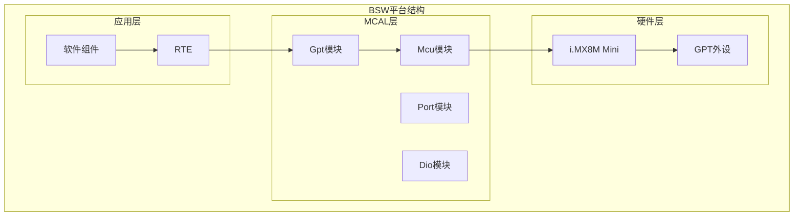
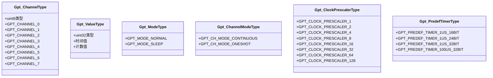
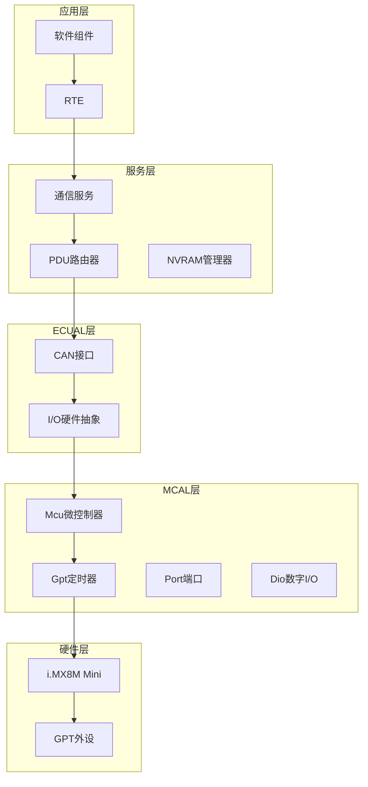
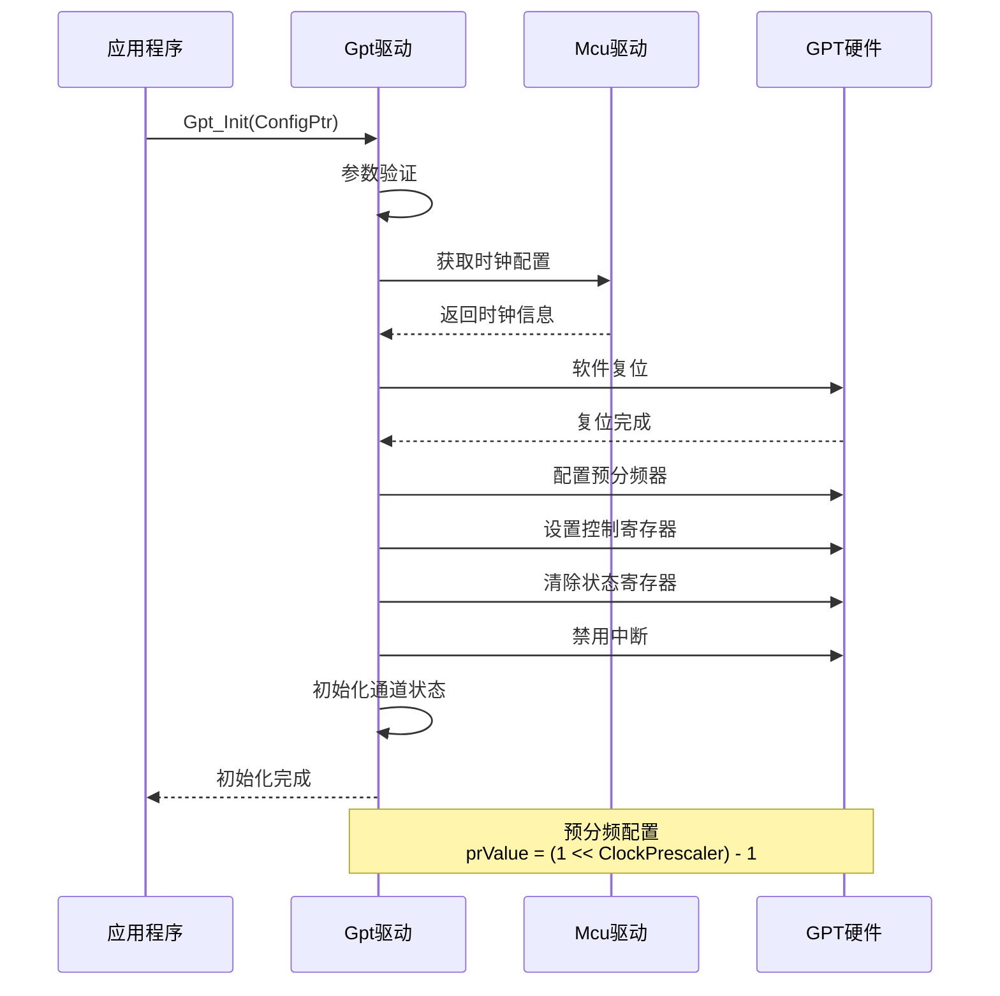
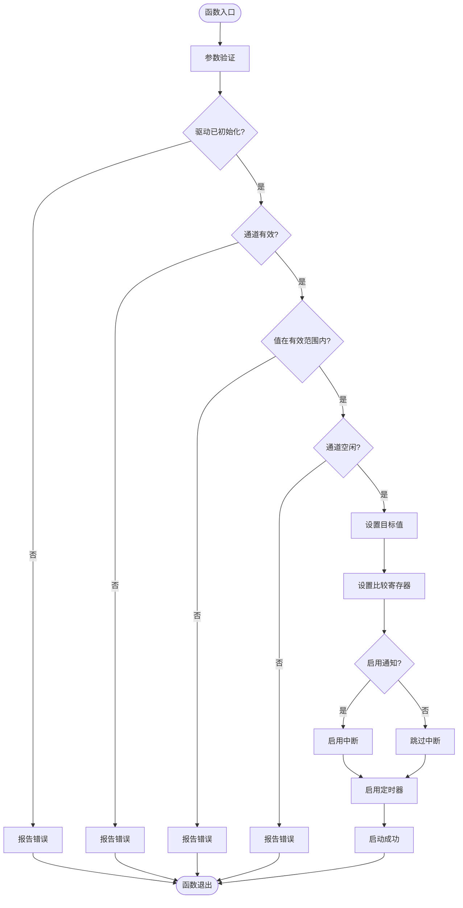
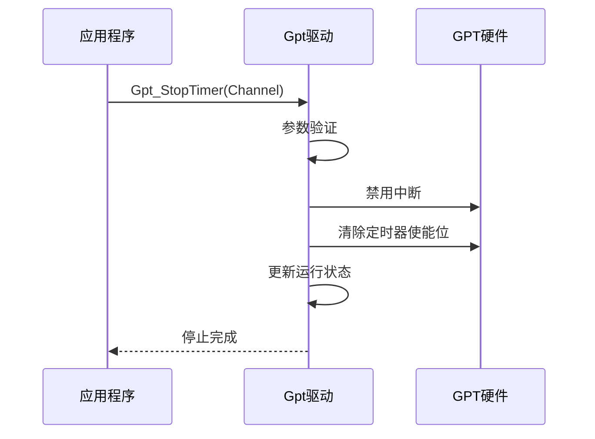
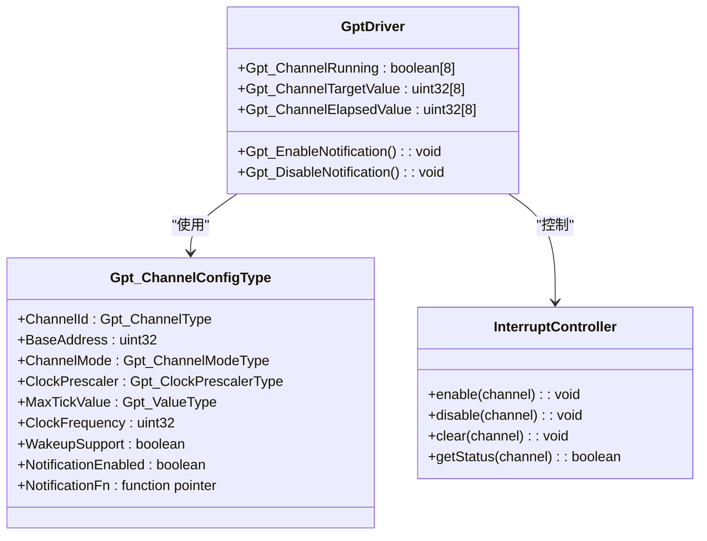
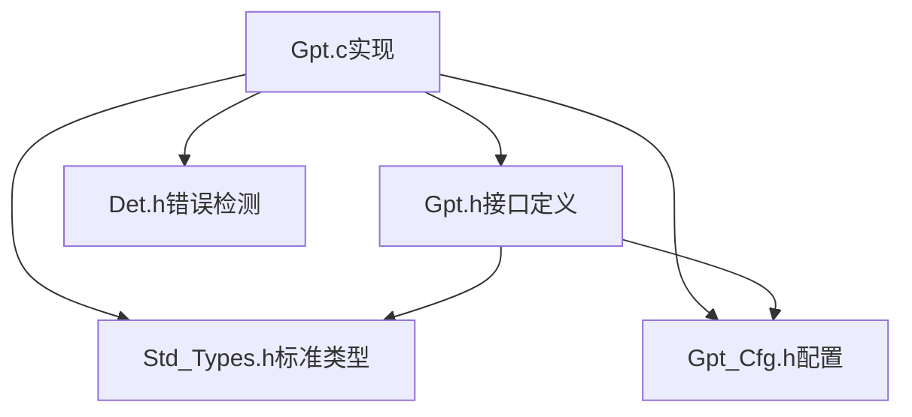
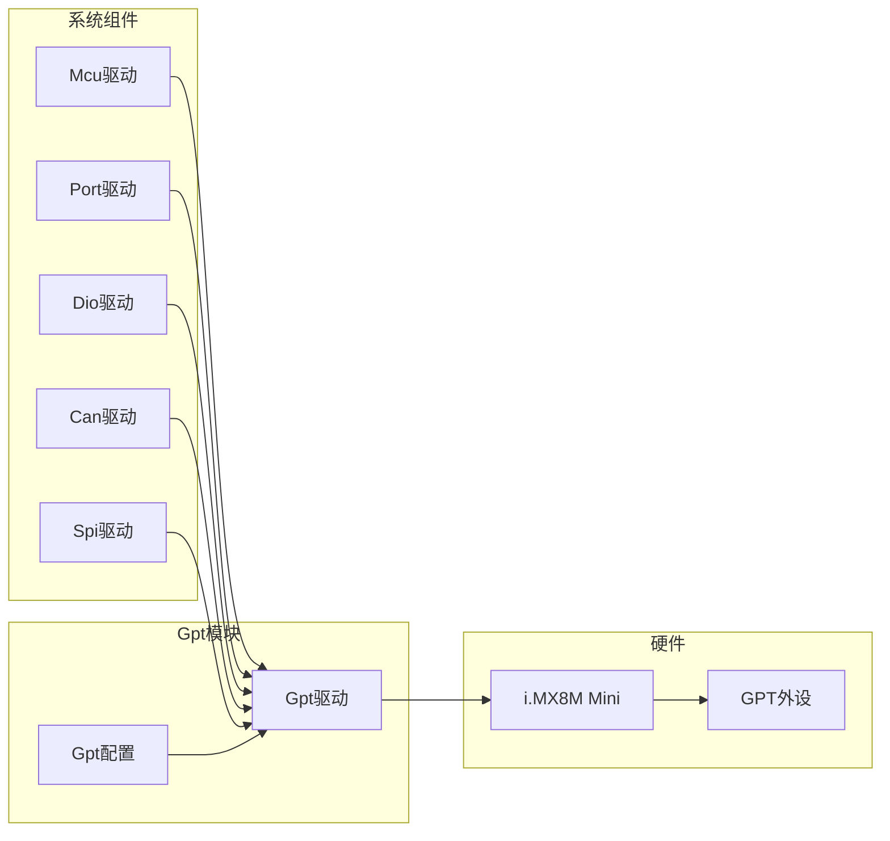

# Gpt通用定时器驱动

<cite>
**本文档引用的文件**
- [Gpt.h](file://src/bsw/mcal/gpt/include/Gpt.h)
- [Gpt.c](file://src/bsw/mcal/gpt/src/Gpt.c)
- [Gpt_Cfg.h](file://src/bsw/mcal/gpt/include/Gpt_Cfg.h)
- [Gpt_Cfg.h](file://src/bsw/config/templates/Gpt_Cfg.h)
- [Std_Types.h](file://src/bsw/common/Std_Types.h)
- [Det.h](file://src/bsw/common/Det.h)
- [architecture.md](file://docs/architecture.md)
- [modules.md](file://docs/modules.md)
- [main.c](file://examples/led_blink/main.c)
- [platform_config.h](file://platform/cortex-m/platform_config.h)
- [startup_cortex_m.c](file://platform/cortex-m/startup_cortex_m.c)
</cite>

## 目录
1. [简介](#简介)
2. [项目结构](#项目结构)
3. [核心组件](#核心组件)
4. [架构概览](#架构概览)
5. [详细组件分析](#详细组件分析)
6. [依赖关系分析](#依赖关系分析)
7. [性能考虑](#性能考虑)
8. [故障排除指南](#故障排除指南)
9. [结论](#结论)

## 简介

Gpt通用定时器驱动模块是YuleTech AutoSAR BSW平台中的关键MCAL层组件，基于AutoSAR Classic Platform 4.4标准实现。该模块提供了通用定时器功能，支持8通道定时器配置，广泛应用于汽车电子系统中的时间基准、周期性任务调度、延时控制等场景。

该驱动模块针对NXP i.MX8M Mini微控制器的GPT外设进行优化，实现了完整的定时器初始化、启动、停止、中断管理等核心功能。模块采用标准的AutoSAR接口设计，确保了良好的可移植性和可配置性。

## 项目结构

Gpt模块在YuleTech BSW平台中的组织结构如下：

**图表来源**
- [architecture.md:23-81](file://docs/architecture.md#L23-L81)
- [modules.md:84-92](file://docs/modules.md#L84-L92)

**章节来源**
- [architecture.md:23-81](file://docs/architecture.md#L23-L81)
- [modules.md:84-92](file://docs/modules.md#L84-L92)

## 核心组件

### 数据类型定义

Gpt模块定义了完整的数据类型体系，确保类型安全和接口一致性：

**图表来源**
- [Gpt.h:76](file://src/bsw/mcal/gpt/include/Gpt.h#L76)
- [Gpt.h:86](file://src/bsw/mcal/gpt/include/Gpt.h#L86)
- [Gpt.h:104](file://src/bsw/mcal/gpt/include/Gpt.h#L104)
- [Gpt.h:112](file://src/bsw/mcal/gpt/include/Gpt.h#L112)
- [Gpt.h:94](file://src/bsw/mcal/gpt/include/Gpt.h#L94)

### 配置参数

Gpt模块支持丰富的配置选项，满足不同应用场景的需求：

| 配置项 | 默认值 | 描述 |
|--------|--------|------|
| GPT_DEV_ERROR_DETECT | STD_ON | 开发错误检测开关 |
| GPT_VERSION_INFO_API | STD_ON | 版本信息API支持 |
| GPT_DEINIT_API | STD_ON | 反初始化API支持 |
| GPT_TIME_ELAPSED_API | STD_ON | 已用时间查询支持 |
| GPT_TIME_REMAINING_API | STD_ON | 剩余时间查询支持 |
| GPT_ENABLE_DISABLE_NOTIFICATION_API | STD_ON | 中断通知支持 |
| GPT_WAKEUP_FUNCTIONALITY_API | STD_OFF | 唤醒功能支持 |
| GPT_NUM_CHANNELS | 8 | 定时器通道数量 |
| GPT_CLOCK_FREQUENCY_HZ | 24000000 | 时钟频率(24MHz) |

**章节来源**
- [Gpt_Cfg.h:15](file://src/bsw/mcal/gpt/include/Gpt_Cfg.h#L15)
- [Gpt_Cfg.h:31](file://src/bsw/mcal/gpt/include/Gpt_Cfg.h#L31)
- [Gpt_Cfg.h:53](file://src/bsw/mcal/gpt/include/Gpt_Cfg.h#L53)

## 架构概览

### 系统架构

Gpt模块在AutoSAR分层架构中位于MCAL层，作为硬件抽象层向上提供标准化接口：

**图表来源**
- [architecture.md:27-81](file://docs/architecture.md#L27-L81)

### 硬件特性

Gpt模块基于NXP i.MX8M Mini的GPT外设实现，具有以下硬件特性：

| 特性 | 描述 | 值 |
|------|------|----|
| 通道数量 | 支持的定时器通道 | 8通道 |
| 时钟源 | 外设时钟源 | 24MHz |
| 计数器宽度 | 最大计数值 | 32位 |
| 预分频 | 支持的预分频系数 | 1/2/4/8/16/32/64/128 |
| 中断类型 | 支持的中断 | 输出比较中断 |

**章节来源**
- [Gpt.c:13](file://src/bsw/mcal/gpt/src/Gpt.c#L13-L26)
- [Gpt_Cfg.h:31](file://src/bsw/mcal/gpt/include/Gpt_Cfg.h#L31)
- [Gpt_Cfg.h:53](file://src/bsw/mcal/gpt/include/Gpt_Cfg.h#L53)

## 详细组件分析

### Gpt_Init()初始化流程

Gpt_Init()函数负责定时器驱动的初始化，建立与硬件的连接并配置基本参数：

**图表来源**
- [Gpt.c:113](file://src/bsw/mcal/gpt/src/Gpt.c#L113-L162)

初始化过程的关键步骤包括：
1. **参数验证** - 检查配置指针和初始化状态
2. **时钟配置** - 设置外设时钟源和预分频
3. **硬件复位** - 执行软件复位确保稳定状态
4. **寄存器配置** - 配置控制寄存器和中断设置
5. **状态初始化** - 初始化内部状态变量

**章节来源**
- [Gpt.c:113](file://src/bsw/mcal/gpt/src/Gpt.c#L113-L162)

### Gpt_StartTimer()启动流程

Gpt_StartTimer()函数启动指定通道的定时器，设置比较值并启用中断：

**图表来源**
- [Gpt.c:245](file://src/bsw/mcal/gpt/src/Gpt.c#L245-L286)

启动流程的核心逻辑：
1. **完整性检查** - 验证驱动初始化状态和参数有效性
2. **目标值设置** - 将定时目标值存储到数组中
3. **硬件配置** - 设置输出比较寄存器值
4. **中断管理** - 根据配置启用相应的中断
5. **定时器启动** - 使能定时器计数

**章节来源**
- [Gpt.c:245](file://src/bsw/mcal/gpt/src/Gpt.c#L245-L286)

### Gpt_StopTimer()停止流程

Gpt_StopTimer()函数安全地停止定时器，禁用中断并清除运行状态：

**图表来源**
- [Gpt.c:288](file://src/bsw/mcal/gpt/src/Gpt.c#L288-L314)

停止流程的特点：
1. **安全关闭** - 先禁用中断再停止定时器
2. **状态同步** - 更新内部运行状态标志
3. **资源清理** - 清除相关寄存器位

**章节来源**
- [Gpt.c:288](file://src/bsw/mcal/gpt/src/Gpt.c#L288-L314)

### 中断管理机制

Gpt模块实现了完整的中断管理机制，支持通道级中断控制：

**图表来源**
- [Gpt.h:126](file://src/bsw/mcal/gpt/include/Gpt.h#L126-L136)
- [Gpt.c:317](file://src/bsw/mcal/gpt/src/Gpt.c#L317-L360)

中断管理的关键特性：
1. **通道独立控制** - 每个通道可独立启用/禁用中断
2. **自动状态管理** - 启动时自动启用中断，停止时自动禁用
3. **回调机制** - 支持用户自定义中断处理函数

**章节来源**
- [Gpt.c:317](file://src/bsw/mcal/gpt/src/Gpt.c#L317-L360)

### 时间获取API

Gpt模块提供了多种时间获取功能，满足不同的时间测量需求：

| API函数 | 功能描述 | 返回值 | 使用场景 |
|---------|----------|--------|----------|
| Gpt_GetTimeElapsed() | 获取已用时间 | 已计数值 | 精确时间测量 |
| Gpt_GetTimeRemaining() | 获取剩余时间 | 剩余计数值 | 剩余时间计算 |
| Gpt_GetPredefTimerValue() | 获取预定义定时器值 | 时间值 | 标准时间基准 |

**章节来源**
- [Gpt.h:190](file://src/bsw/mcal/gpt/include/Gpt.h#L190)
- [Gpt.h:197](file://src/bsw/mcal/gpt/include/Gpt.h#L197)
- [Gpt.h:261](file://src/bsw/mcal/gpt/include/Gpt.h#L261)

## 依赖关系分析

### 内部依赖关系

Gpt模块的内部依赖关系体现了清晰的模块化设计：

**图表来源**
- [Gpt.c:9](file://src/bsw/mcal/gpt/src/Gpt.c#L9-L12)
- [Gpt.h:19](file://src/bsw/mcal/gpt/include/Gpt.h#L19)

### 外部依赖关系

Gpt模块与系统其他组件的交互关系：

**图表来源**
- [architecture.md:55-66](file://docs/architecture.md#L55-L66)

**章节来源**
- [architecture.md:55-66](file://docs/architecture.md#L55-L66)

## 性能考虑

### 时钟源与时序

Gpt模块的性能主要取决于时钟源配置和预分频设置：

| 时钟配置 | 预分频系数 | 计数频率 | 最大定时范围 |
|----------|------------|----------|--------------|
| 24MHz | 1 | 24MHz | 4294967295 | 
| 24MHz | 2 | 12MHz | 4294967295 |
| 24MHz | 128 | 187.5kHz | 4294967295 |

### 中断开销

中断处理对系统性能的影响：
- **中断延迟** - 从定时器溢出到中断处理完成的时间
- **中断响应** - NVIC优先级配置影响响应时间
- **处理开销** - 用户回调函数执行时间

### 内存使用

Gpt模块的内存占用：
- **静态内存** - 8个通道的状态变量约32字节
- **配置内存** - 配置结构体大小取决于具体配置
- **栈空间** - 中断处理函数栈需求

## 故障排除指南

### 常见错误代码

| 错误码 | 错误描述 | 可能原因 | 解决方案 |
|--------|----------|----------|----------|
| GPT_E_UNINIT | 未初始化 | 调用API前未调用Gpt_Init | 确保先调用Gpt_Init |
| GPT_E_PARAM_CHANNEL | 通道参数无效 | 通道号超出范围 | 检查通道配置 |
| GPT_E_PARAM_VALUE | 值参数无效 | 定时值为0或超范围 | 验证定时值范围 |
| GPT_E_CHANNEL_BUSY | 通道忙 | 通道已在运行 | 停止当前定时器 |
| GPT_E_ALREADY_INITIALIZED | 已初始化 | 重复初始化 | 检查初始化状态 |

### 调试建议

1. **初始化检查**
   - 确认Gpt_Init()返回成功
   - 验证配置参数正确性
   - 检查时钟配置是否符合预期

2. **运行时监控**
   - 使用Gpt_GetTimeElapsed()监控计数
   - 检查中断是否正常触发
   - 验证回调函数执行情况

3. **硬件验证**
   - 确认GPT外设时钟已启用
   - 检查GPIO引脚配置
   - 验证中断向量表设置

**章节来源**
- [Gpt.h:62](file://src/bsw/mcal/gpt/include/Gpt.h#L62-L72)
- [Gpt.c:115](file://src/bsw/mcal/gpt/src/Gpt.c#L115-L124)

## 结论

Gpt通用定时器驱动模块是一个功能完整、设计规范的AutoSAR兼容组件。其特点包括：

**技术优势**
- 完整的AutoSAR 4.4标准实现
- 灵活的配置选项和通道管理
- 完善的错误检测和处理机制
- 高效的中断管理机制

**应用场景**
- 系统时间基准提供
- 周期性任务调度
- 延时和定时控制
- 精确时间测量

**扩展能力**
- 支持8通道独立配置
- 可配置的预分频设置
- 灵活的中断处理机制
- 标准化的API接口

该模块为YuleTech AutoSAR BSW平台提供了可靠的定时器基础设施，满足了汽车电子系统对精确时间控制的需求。