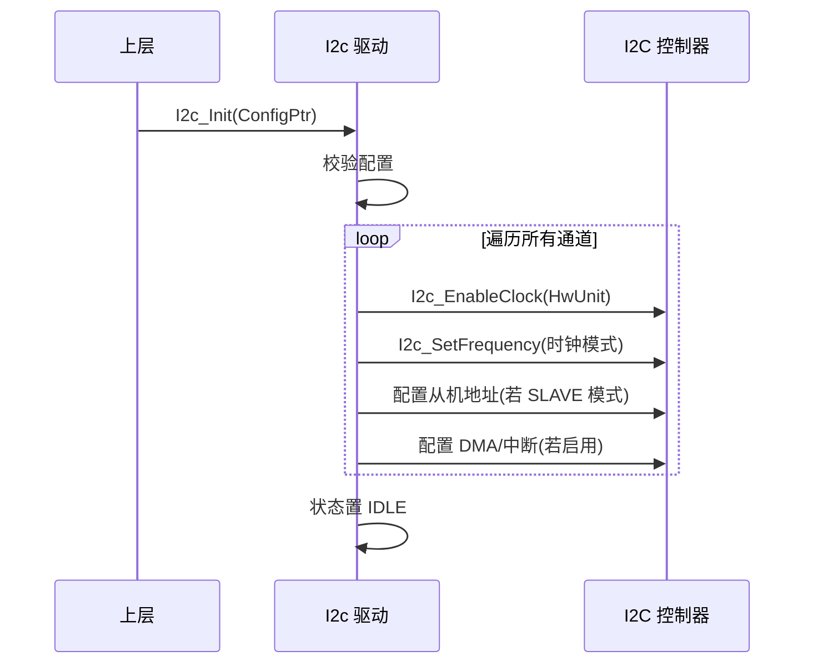
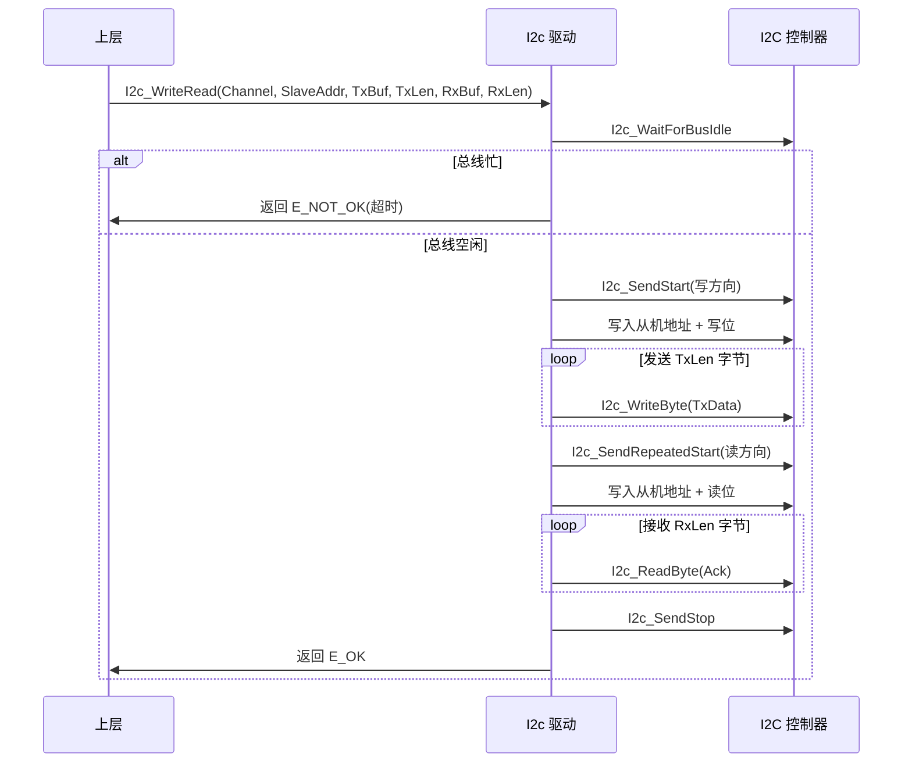

# I2c（I2C驱动模块）

<cite>
**本文档引用的文件**
- [I2c.h](file://src/bsw/mcal/i2c/include/I2c.h)
- [I2c_Cfg.h](file://src/bsw/mcal/i2c/include/I2c_Cfg.h)
- [I2c.c](file://src/bsw/mcal/i2c/src/I2c.c)
- [Det.h](file://src/bsw/services/det/include/Det.h)
- [Std_Types.h](file://src/bsw/os/include/Std_Types.h)
</cite>

## 目录
1. [简介](#简介)
2. [项目结构](#项目结构)
3. [核心组件](#核心组件)
4. [架构概览](#架构概览)
5. [详细组件分析](#详细组件分析)
6. [依赖关系分析](#依赖关系分析)
7. [性能考虑](#性能考虑)
8. [故障排除指南](#故障排除指南)
9. [结论](#结论)
10. [附录](#附录)

## 简介

I2c（I2C Driver，I2C 驱动）是基于 AUTOSAR 4.4.0 标准开发的 MCAL 层串行通信驱动模块，负责管理 I2C 总线的数据收发。该模块支持主从双模式、7/10 位地址、四种时钟模式（标准 100KHz ~ 高速 3.4MHz）、三种传输方式（轮询/中断/DMA）以及 SMBus 扩展功能。

本模块针对 i.MX8M Mini 平台的 I2C 控制器实现，支持最多 8 个通道、4 个硬件单元，提供完整的 AUTOSAR I2C API 集合（23 个服务 ID），为上层传感器、EEPROM、PHY 等外设访问提供串行通信基础。

**章节来源**
- [I2c.h:14-90](file://src/bsw/mcal/i2c/include/I2c.h#L14-L90)
- [I2c.h:90-130](file://src/bsw/mcal/i2c/include/I2c.h#L90-L130)

## 项目结构

I2c 模块源码位于 `src/bsw/mcal/i2c/`：

```
src/bsw/mcal/i2c/
├── include/
│   ├── I2c.h               # 公共 API 与类型定义（484 行）
│   └── I2c_Cfg.h           # 预编译配置
└── src/
    └── I2c.c               # 驱动实现（寄存器/传输/中断/DMA）
```

```mermaid
graph TB
subgraph "上层"
ETHIF[EthTrcv PHY 访问]
SENSOR[传感器驱动]
EEPROM[EEPROM 访问]
end
subgraph "MCAL"
I2C[I2c 驱动]
subgraph "内部"
REG[寄存器操作层]
MST[主模式传输]
SLV[从模式传输]
DMA[DMA 传输]
ISR[中断处理]
END
end
subgraph "硬件"
I2CHW[I2C 控制器]
END
ETHIF --> I2C
SENSOR --> I2C
EEPROM --> I2C
I2C --> REG
I2C --> MST
I2C --> SLV
I2C --> DMA
I2C --> ISR
REG --> I2CHW
MST --> REG
SLV --> REG
DMA --> REG
```

**图表来源**
- [I2c.h:14-20](file://src/bsw/mcal/i2c/include/I2c.h#L14-L20)
- [I2c.c:8-16](file://src/bsw/mcal/i2c/src/I2c.c#L8-L16)

**章节来源**
- [I2c.h:1-130](file://src/bsw/mcal/i2c/include/I2c.h#L1-L130)
- [I2c_Cfg.h:1-100](file://src/bsw/mcal/i2c/include/I2c_Cfg.h#L1-L100)

## 核心组件

I2c 模块的核心组件包括：

### 数据类型定义
- **I2c_StatusType**: 驱动状态（UNINIT/IDLE/BUSY/ERROR）
- **I2c_OpModeType**: 操作模式（MASTER/SLAVE）
- **I2c_TransferModeType**: 传输模式（POLLING/INTERRUPT/DMA）
- **I2c_AddrModeType**: 地址模式（7BIT/10BIT/16BIT）
- **I2c_ClockModeType**: 时钟模式（STANDARD 100KHz/FAST 400KHz/FAST_PLUS 1MHz/HIGH_SPEED 3.4MHz）
- **I2c_BusStateType**: 总线状态（IDLE/OWNER/BUSY）
- **I2c_ResultType**: 传输结果（OK/PENDING/FAILED/TIMEOUT/CANCELLED）
- **I2c_ChannelType / I2c_HWUnitType**: 通道与硬件单元类型
- **I2c_NotifyType**: 通知回调函数指针

### 配置结构
- **I2c_SlaveAddressConfigType**: 从机地址配置（地址、模式、广播使能）
- **I2c_MasterConfigType**: 主机配置（时钟模式、自定义频率、多主机、时钟拉伸）
- **I2c_SlaveConfigType**: 从机配置（多地址表、双地址、广播）
- **I2c_SmbusConfigType**: SMBus 配置（PEC、Alert、主机通知、超时）
- **I2c_DmaConfigType**: DMA 配置（TX/RX 通道与优先级）
- **I2c_InterruptConfigType**: 中断配置（使能与优先级）
- **I2c_ChannelConfigType**: 通道配置（通道 ID、硬件单元、模式、传输方式、回调）
- **I2c_ConfigType**: 全局配置（通道表、数量、外设时钟频率）

### 配置参数（I2c_Cfg.h）
- **I2C_NUM_CHANNELS**: 8 通道、**I2C_NUM_HW_UNITS**: 4 硬件单元、**I2C_NUM_DMA_CHANNELS**: 8
- **I2C_BUS_BUSY_TIMEOUT_MS**: 100ms、**I2C_TRANSFER_TIMEOUT_MS**: 1000ms
- **I2C_CLOCK_STRETCH_TIMEOUT_MS**: 50ms、**I2C_SMBUS_TIMEOUT_MS**: 35ms
- **I2C_DMA_SUPPORTED / SMBUS_SUPPORTED / SLAVE_MODE_SUPPORTED / CLOCK_STRETCHING_SUPPORTED**: 功能开关

**章节来源**
- [I2c.h:130-280](file://src/bsw/mcal/i2c/include/I2c.h#L130-L280)
- [I2c.h:280-330](file://src/bsw/mcal/i2c/include/I2c.h#L280-L330)
- [I2c_Cfg.h:20-90](file://src/bsw/mcal/i2c/include/I2c_Cfg.h#L20-L90)

## 架构概览

I2c 采用"API 层 → 传输管理层 → 寄存器操作层"的分层架构：

```mermaid
graph TB
subgraph "API 层"
WRITE[I2c_WriteBytes]
READ[I2c_ReadBytes]
WR_RD[I2c_WriteRead]
MODE[I2c_SetClockMode/SetTransferMode]
SLAVE[I2c_SetSlaveAddress/PrepareSlaveBuffer/SlaveWriteBuffer/SlaveReadBuffer]
BUSCTL[I2c_GetBusState/ClearBus/SoftwareReset]
IRQCTL[I2c_EnableInterrupt/DisableInterrupt]
CANCEL[I2c_CancelTransfer]
MAIN[I2c_MainFunction]
END
subgraph "传输管理层"
POLL[I2c_MasterTransferPolling]
IRQ[I2c_MasterTransferInterrupt]
DMAT[I2c_MasterTransferDma]
ERRH[I2c_ErrorHandler]
END
subgraph "寄存器操作层"
BASE[I2c_GetBaseAddr]
CLK[I2c_EnableClock/SetFrequency]
BUS[I2c_WaitForBusIdle/WaitForTransferComplete]
START[I2c_SendStart/SendRepeatedStart/SendStop]
BYTE[I2c_WriteByte/ReadByte]
END
WRITE --> POLL
WRITE --> IRQ
WRITE --> DMAT
READ --> POLL
WR_RD --> POLL
MAIN --> POLL
IRQCTL --> IRQ
DMA --> DMAT
POLL --> BUS
POLL --> START
POLL --> BYTE
IRQ --> BYTE
DMAT --> BYTE
ERRH --> BASE
START --> BASE
BYTE --> BASE
CLK --> BASE
```

**图表来源**
- [I2c.c:127-250](file://src/bsw/mcal/i2c/src/I2c.c#L127-L250)
- [I2c.c:250-484](file://src/bsw/mcal/i2c/src/I2c.c#L250-L484)
- [I2c.h:330-484](file://src/bsw/mcal/i2c/include/I2c.h#L330-L484)

## 详细组件分析

### 初始化组件分析

I2c_Init() 完成控制器初始化：



**图表来源**
- [I2c.c:127-180](file://src/bsw/mcal/i2c/src/I2c.c#L127-L180)

#### 初始化流程详解

1. **参数验证**: 校验配置指针与通道表
2. **时钟使能**: 为每个硬件单元使能外设时钟
3. **频率设置**: 按 ClockMode 配置波特率（I2c_FreqDividerTable 分频表）
4. **从机配置**: SLAVE 模式通道注册地址与缓冲

**章节来源**
- [I2c.c:127-180](file://src/bsw/mcal/i2c/src/I2c.c#L127-L180)

### 主机传输组件分析

I2c_WriteRead() 实现写读组合传输：



**图表来源**
- [I2c.c:250-350](file://src/bsw/mcal/i2c/src/I2c.c#L250-L350)

#### 主机传输特性

- **三种传输模式**: 轮询（默认）、中断、DMA（I2c_MasterTransfer* 三函数）
- **重复起始**: WriteRead 通过 RepeatedStart 实现读改写事务
- **超时保护**: BusBusy 100ms / Transfer 1000ms / ClockStretch 50ms
- **频率分频**: I2c_FreqDividerTable[64] 支持 4 种时钟模式

**章节来源**
- [I2c.c:250-350](file://src/bsw/mcal/i2c/src/I2c.c#L250-L350)
- [I2c_Cfg.h:45-55](file://src/bsw/mcal/i2c/include/I2c_Cfg.h#L45-L55)

### 从机模式组件分析

I2c_PrepareSlaveBuffer()/I2c_SlaveWriteBuffer()/I2c_SlaveReadBuffer()：

- **缓冲准备**: PrepareSlaveBuffer 注册接收缓冲，等待主机写
- **从机发送**: SlaveWriteBuffer 准备发送数据，主机读时自动输出
- **从机接收**: SlaveReadBuffer 读取主机写入的数据
- **多地址**: 支持最多 I2C_MAX_SLAVE_ADDRESSES 地址 + 双地址模式
- **通用呼叫**: GeneralCallEnabled 支持广播地址

**章节来源**
- [I2c.h:400-450](file://src/bsw/mcal/i2c/include/I2c.h#L400-L450)
- [I2c_Cfg.h:70-80](file://src/bsw/mcal/i2c/include/I2c_Cfg.h#L70-L80)

### DMA 与中断组件分析

- **DMA 传输**: I2c_DmaInit/Start/Stop 管理 DMA 通道（TX/RX 独立通道）
- **中断处理**: I2c_IsrHandler 处理完成/错误中断
- **错误处理**: I2c_ErrorHandler 识别仲裁丢失、总线错误、ACK 错误、溢出
- **通知回调**: TxNotification/RxNotification/ErrorNotification 三回调

**章节来源**
- [I2c.c:163-167](file://src/bsw/mcal/i2c/src/I2c.c#L163-L167)
- [I2c.h:280-330](file://src/bsw/mcal/i2c/include/I2c.h#L280-L330)

## 依赖关系分析

I2c 模块的依赖关系：

```mermaid
graph TB
subgraph "I2c 内部"
IC_H[I2c.h]
IC_CFG[I2c_Cfg.h]
IC_C[I2c.c]
END
subgraph "基础依赖"
STD[Std_Types.h]
DET[Det.h]
MEMMAP[MemMap.h]
END
subgraph "上层调用方"
ETHTRCV[EthTrcv(PHY 通过 I2C 访问)]
SENSOR[传感器驱动]
EEP[外部 EEPROM]
END
subgraph "硬件"
I2CHW[I2C 控制器]
DMAHW[DMA 控制器]
END
IC_H --> STD
IC_H --> IC_CFG
IC_C --> IC_H
IC_C --> DET
ETHTRCV --> IC_H
SENSOR --> IC_H
EEP --> IC_H
IC_C --> I2CHW
IC_C --> DMAHW
```

**图表来源**
- [I2c.h:14-20](file://src/bsw/mcal/i2c/include/I2c.h#L14-L20)
- [I2c.c:8-16](file://src/bsw/mcal/i2c/src/I2c.c#L8-L16)

### 关键依赖关系

1. **DMA 依赖**: DMA 传输模式依赖硬件 DMA 控制器
2. **上层依赖**: EthTrcv 支持通过 I2C 访问 PHY（ETHTRCV_ACCESS_I2C）
3. **配置依赖**: I2c_Cfg.h 提供通道/超时/功能开关
4. **DET 依赖**: 参数错误上报

**章节来源**
- [I2c.h:14-20](file://src/bsw/mcal/i2c/include/I2c.h#L14-L20)
- [I2c_Cfg.h:60-90](file://src/bsw/mcal/i2c/include/I2c_Cfg.h#L60-L90)

## 性能考虑

### 时钟模式与速率

| 时钟模式 | 速率 | 典型应用 |
|---------|------|---------|
| STANDARD | 100 KHz | 通用外设 |
| FAST | 400 KHz | 传感器/EEPROM |
| FAST_PLUS | 1 MHz | 高带宽外设 |
| HIGH_SPEED | 3.4 MHz | 高速器件 |

### 传输模式对比

| 模式 | 吞吐 | CPU 占用 | 适用场景 |
|------|------|---------|---------|
| 轮询 | 中 | 高（阻塞） | 简单访问 |
| 中断 | 高 | 中 | 常规通信 |
| DMA | 最高 | 低 | 大数据块 |

### 超时参数

| 超时 | 值 | 说明 |
|------|-----|------|
| I2C_BUS_BUSY_TIMEOUT_MS | 100ms | 等待总线空闲 |
| I2C_TRANSFER_TIMEOUT_MS | 1000ms | 传输完成 |
| I2C_CLOCK_STRETCH_TIMEOUT_MS | 50ms | 时钟拉伸 |
| I2C_SMBUS_TIMEOUT_MS | 35ms | SMBus 超时 |

**章节来源**
- [I2c.h:105-112](file://src/bsw/mcal/i2c/include/I2c.h#L105-L112)
- [I2c_Cfg.h:45-55](file://src/bsw/mcal/i2c/include/I2c_Cfg.h#L45-L55)

## 故障排除指南

### 常见错误代码

| 错误代码 | 错误含义 | 可能原因 | 解决方案 |
|---------|---------|---------|---------|
| I2C_E_PARAM_CHANNEL (0x01) | 通道无效 | 通道号越界 | 检查 I2C_NUM_CHANNELS |
| I2C_E_PARAM_POINTER (0x02) | 指针无效 | 空缓冲指针 | 检查参数 |
| I2C_E_PARAM_LENGTH (0x03) | 长度无效 | 长度越界 | 检查长度 |
| I2C_E_UNINIT (0x08) | 未初始化 | Init 前调用 | 检查时序 |
| I2C_E_BUSY (0x09) | 忙 | 传输进行中 | 等待完成 |
| I2C_E_TIMEOUT (0x0A) | 超时 | 总线无响应 | 检查从机 |
| I2C_E_ARBITRATION_LOST (0x0B) | 仲裁丢失 | 多主机冲突 | 重试传输 |
| I2C_E_BUS_ERROR (0x0C) | 总线错误 | 总线短路 | 检查硬件 |
| I2C_E_ACK_ERROR (0x0D) | ACK 错误 | 从机无应答 | 检查地址 |
| I2C_E_CLOCK_STRETCH_TIMEOUT (0x12) | 时钟拉伸超时 | 从机挂死 | 检查从机 |

### 调试建议

1. **总线监控**: 逻辑分析仪抓取 SCL/SDA 波形验证时序
2. **地址确认**: 7 位地址左移 1 位构成 8 位地址字节
3. **上拉电阻**: 确认 SCL/SDA 上拉电阻配置正确
4. **超时排查**: 传输超时时检查从机供电与地址匹配

**章节来源**
- [I2c.h:68-85](file://src/bsw/mcal/i2c/include/I2c.h#L68-L85)
- [I2c.c:20-40](file://src/bsw/mcal/i2c/src/I2c.c#L20-L40)

## 结论

I2c I2C 驱动模块是一个功能完备、模式丰富的 AUTOSAR 4.4.0 MCAL 串行通信组件。它提供：

1. **完整 AUTOSAR 接口**: 23 个服务覆盖主从传输、总线管理、SMBus
2. **多传输模式**: 轮询/中断/DMA 三模式按需选择
3. **灵活时钟**: 4 种时钟模式 + 自定义频率
4. **从机能力**: 多地址、双地址、通用呼叫完整支持
5. **SMBus 扩展**: PEC、Alert、Host 通知

该模块为车载外设（传感器、EEPROM、PHY）提供了高性能串行通信基础，是 ECUAL/MCAL 通信链的关键组件。

## 附录

### 配置示例

```c
/* I2c_Lcfg.c 通道配置 */
const I2c_ChannelConfigType I2c_Channels[I2C_NUM_CHANNELS] = {
    {
        .ChannelId = I2C_CHANNEL_0,
        .HwUnit = 0U,
        .OpMode = I2C_MODE_MASTER,
        .TransferMode = I2C_TRANSFER_POLLING,
        .MasterConfig = {
            .ClockMode = I2C_CLOCK_FAST,        /* 400 KHz */
            .MultiMasterEnabled = TRUE,
            .ClockStretchingEnabled = TRUE
        },
        .TxNotification = NULL_PTR,
        .RxNotification = NULL_PTR,
        .ErrorNotification = NULL_PTR
    }
};

const I2c_ConfigType I2c_Config = {
    .Channels = I2c_Channels,
    .NumChannels = I2C_NUM_CHANNELS,
    .DevErrorDetect = STD_ON,
    .VersionInfoApi = STD_ON,
    .PeripheralClockFreq = 24000000U
};
```

### 典型访问流程

1. I2c_WriteBytes 写寄存器地址/命令到从机
2. I2c_ReadBytes 读取数据（简单读）
3. I2c_WriteRead 组合事务（写寄存器地址 + 读数据）
4. 传输完成后检查 I2c_GetStatus/GetBusState

**章节来源**
- [I2c_Cfg.h:80-100](file://src/bsw/mcal/i2c/include/I2c_Cfg.h#L80-L100)
- [I2c.h:330-484](file://src/bsw/mcal/i2c/include/I2c.h#L330-L484)
