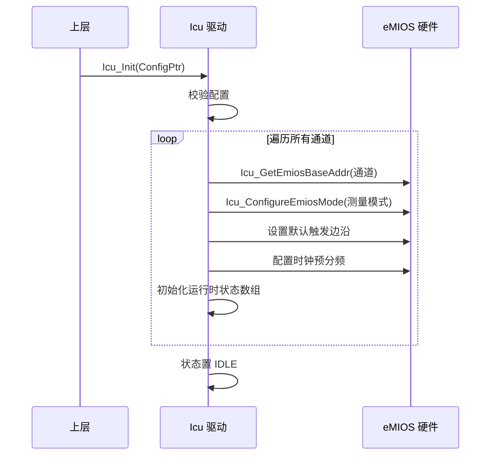
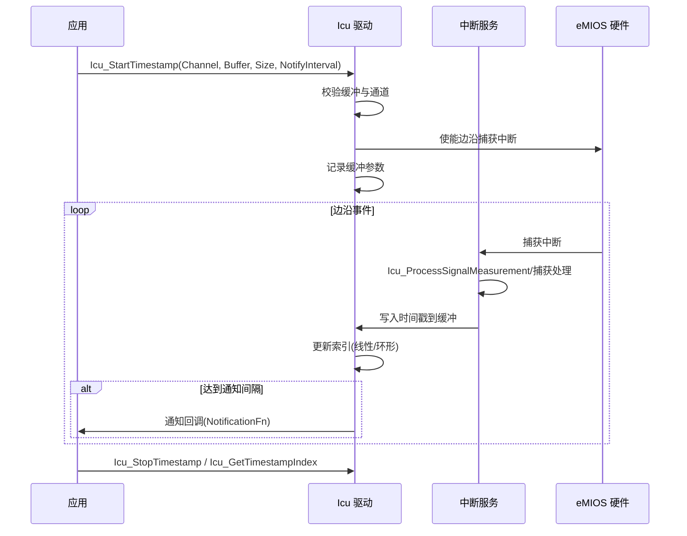
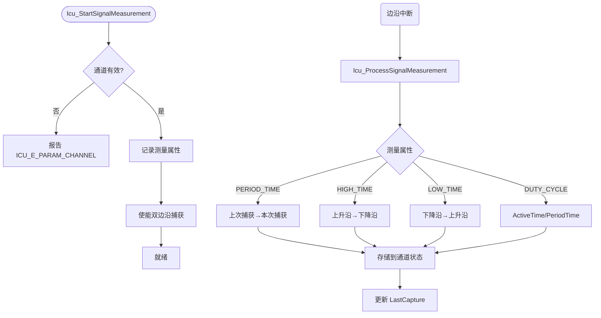

# Icu（输入捕获驱动模块）

<cite>
**本文档引用的文件**
- [Icu.h](file://src/bsw/mcal/icu/include/Icu.h)
- [Icu_Cfg.h](file://src/bsw/mcal/icu/include/Icu_Cfg.h)
- [Icu_Lcfg.h](file://src/bsw/mcal/icu/include/Icu_Lcfg.h)
- [Icu_Private.h](file://src/bsw/mcal/icu/include/Icu_Private.h)
- [Icu.c](file://src/bsw/mcal/icu/src/Icu.c)
- [Icu_Irq.c](file://src/bsw/mcal/icu/src/Icu_Irq.c)
- [Icu_Lcfg.c](file://src/bsw/mcal/icu/src/Icu_Lcfg.c)
- [Det.h](file://src/bsw/services/det/include/Det.h)
- [Std_Types.h](file://src/bsw/os/include/Std_Types.h)
</cite>

## 目录
1. [简介](#简介)
2. [项目结构](#项目结构)
3. [核心组件](#核心组件)
4. [架构概览](#架构概览)
5. [详细组件分析](#详细组件分析)
6. [依赖关系分析](#依赖关系分析)
7. [性能考虑](#性能考虑)
8. [故障排除指南](#故障排除指南)
9. [结论](#结论)
10. [附录](#附录)

## 简介

Icu（Input Capture Unit，输入捕获驱动）是基于 AUTOSAR 4.4.0 标准开发的 MCAL 层输入捕获驱动模块，提供信号边沿检测、时间戳捕获、信号测量（周期/占空比）和边沿计数四大功能。该模块针对 NXP i.MX8M Mini 平台的 eMIOS 定时器硬件实现，支持最多 8 个通道的独立配置。

Icu 是测量类应用（转速、脉宽、频率）与唤醒检测（边沿触发唤醒）的基础 MCAL 组件，通过统一 API 为上层提供精确的硬件时间测量能力。

**章节来源**
- [Icu.h:14-90](file://src/bsw/mcal/icu/include/Icu.h#L14-L90)
- [Icu.h:90-130](file://src/bsw/mcal/icu/include/Icu.h#L90-L130)

## 项目结构

Icu 模块源码位于 `src/bsw/mcal/icu/`：

```
src/bsw/mcal/icu/
├── include/
│   ├── Icu.h               # 公共 API 与类型定义（402 行）
│   ├── Icu_Cfg.h           # 预编译配置
│   ├── Icu_Lcfg.h          # 链接时配置声明
│   └── Icu_Private.h       # 私有数据结构
└── src/
    ├── Icu.c               # 驱动实现（eMIOS 寄存器操作）
    ├── Icu_Irq.c           # 中断服务程序
    └── Icu_Lcfg.c          # 链接时通道配置
```

```mermaid
graph TB
subgraph "上层"
ECUM[EcuM 唤醒管理]
APP[应用层测量(转速/脉宽)]
DIAG[诊断]
end
subgraph "MCAL"
ICU[Icu 驱动]
subgraph "内部"
EDGE[边沿检测]
TS[时间戳捕获]
MEAS[信号测量]
CNT[边沿计数]
WAKE[唤醒检测]
END
IRQ[Icu_Irq.c 中断]
END
subgraph "硬件"
EMIOS[eMIOS 定时器]
END
ECUM --> ICU
APP --> ICU
DIAG --> ICU
ICU --> EDGE
ICU --> TS
ICU --> MEAS
ICU --> CNT
ICU --> WAKE
EDGE --> EMIOS
TS --> EMIOS
MEAS --> EMIOS
CNT --> EMIOS
IRQ --> EMIOS
```

**图表来源**
- [Icu.h:14-20](file://src/bsw/mcal/icu/include/Icu.h#L14-L20)
- [Icu.c:8-16](file://src/bsw/mcal/icu/src/Icu.c#L8-L16)

**章节来源**
- [Icu.h:1-130](file://src/bsw/mcal/icu/include/Icu.h#L1-L130)
- [Icu_Cfg.h:1-80](file://src/bsw/mcal/icu/include/Icu_Cfg.h#L1-L80)

## 核心组件

Icu 模块的核心组件包括：

### 数据类型定义
- **Icu_ChannelType**: 通道类型（uint8，0-7）
- **Icu_StateType**: 驱动状态（UNINIT/IDLE/BUSY）
- **Icu_SignalEdgeType**: 信号边沿（NONE/RISING/FALLING/BOTH）
- **Icu_ActivationType**: 触发边沿（FALLING/RISING/BOTH）
- **Icu_ModeType**: 驱动模式（NORMAL/SLEEP）
- **Icu_MeasurementModeType**: 测量模式（SIGNAL_EDGE_DETECT/SIGNAL_MEASUREMENT/TIMESTAMP/EDGE_COUNTER）
- **Icu_SignalMeasurementPropertyType**: 测量属性（PERIOD_TIME/HIGH_TIME/LOW_TIME/DUTY_CYCLE）
- **Icu_TimestampBufferType**: 时间戳缓冲（LINEAR/CIRCULAR）
- **Icu_DutyCycleType**: 占空比结构（ActiveTime + PeriodTime）
- **Icu_ChannelConfigType**: 通道配置（通道 ID、基地址、测量模式、默认触发、缓冲配置、唤醒支持、通知回调、时钟预分频）
- **Icu_ConfigType**: 全局配置（通道表、功能开关、默认模式）

### 配置参数（Icu_Cfg.h）
- **ICU_NUM_CHANNELS**: 8 通道、**ICU_MAX_EDGE_COUNT**: 65535
- **ICU_MAIN_FUNCTION_PERIOD_MS**: 1ms
- **ICU_DEFAULT_MODE**: NORMAL、**ICU_DEFAULT_ACTIVATION**: RISING_EDGE
- **ICU_CLOCK_FREQUENCY_HZ**: 24MHz
- **ICU_EMIOS_0_BASE_ADDR**: 0x40034000（1073922048）
- **ICU_EMIOS_1_BASE_ADDR**: 0x40038000（1073926144）
- 功能开关：TIMESTAMP_API/SIGNAL_MEASUREMENT_API/EDGE_COUNT_API/WAKEUP_API

### 运行时状态（Icu.c）
- 每通道：输入状态、触发配置、通知使能、运行标志、唤醒使能
- 时间戳缓冲：Buffer + Size + Index + 通知间隔 + 捕获计数
- 信号测量：周期/有效时间/上次捕获
- 边沿计数：EdgeCount + 使能标志

**章节来源**
- [Icu.h:90-240](file://src/bsw/mcal/icu/include/Icu.h#L90-L240)
- [Icu.h:240-330](file://src/bsw/mcal/icu/include/Icu.h#L240-L330)
- [Icu.c:90-128](file://src/bsw/mcal/icu/src/Icu.c#L90-L128)

## 架构概览

Icu 采用"API 层 → 功能管理层 → eMIOS 寄存器层"的分层架构：

```mermaid
graph TB
subgraph "API 层"
INIT[Icu_Init/DeInit/SetMode]
WAKE[Icu_EnableWakeup/DisableWakeup/CheckWakeup]
EDGE[Icu_SetActivationCondition/GetInputState/GetInputLevel]
TS[Icu_StartTimestamp/StopTimestamp/GetTimestampIndex]
CNT[Icu_EnableEdgeCount/ResetEdgeCount/GetEdgeNumbers]
MEAS[Icu_StartSignalMeasurement/StopSignalMeasurement/GetDutyCycleValues]
NOTIFY[Icu_EnableNotification/DisableNotification]
SYS[Icu_GetSysTimestamp]
END
subgraph "功能管理层"
EDGE_CTL[边沿检测管理]
TS_CTL[时间戳缓冲管理]
MEAS_CTL[信号测量管理(周期/高/低/占空比)]
CNT_CTL[边沿计数管理]
WAKE_CTL[唤醒检测管理]
END
subgraph "寄存器层"
EMIOS_CFG[Icu_ConfigureEmiosMode]
EMIOS_IRQ[Icu_EnableChannelInterrupt]
EMIOS_FLAG[Icu_GetChannelFlag/ClearChannelFlag]
EMIOS_REG[Icu_GetChannelRegAddr]
END
INIT --> EMIOS_CFG
EDGE --> EDGE_CTL
TS --> TS_CTL
MEAS --> MEAS_CTL
CNT --> CNT_CTL
WAKE --> WAKE_CTL
EDGE_CTL --> EMIOS_CFG
TS_CTL --> EMIOS_IRQ
MEAS_CTL --> EMIOS_FLAG
CNT_CTL --> EMIOS_CFG
WAKE_CTL --> EMIOS_IRQ
NOTIFY --> EMIOS_IRQ
SYS --> EMIOS_REG
```

**图表来源**
- [Icu.c:130-283](file://src/bsw/mcal/icu/src/Icu.c#L130-L283)
- [Icu.c:284-402](file://src/bsw/mcal/icu/src/Icu.c#L284-L402)
- [Icu.h:330-402](file://src/bsw/mcal/icu/include/Icu.h#L330-L402)

## 详细组件分析

### 初始化组件分析

Icu_Init() 完成 eMIOS 通道配置：



**图表来源**
- [Icu.c:284-330](file://src/bsw/mcal/icu/src/Icu.c#L284-L330)

#### 初始化流程详解

1. **参数验证**: 校验配置指针与通道表
2. **硬件映射**: Icu_GetEmiosBaseAddr/GetEmiosChannelNum 建立通道→eMIOS 映射
3. **模式配置**: 按 MeasurementMode 配置 eMIOS 工作模式
4. **状态初始化**: 运行时数组清零（通知/唤醒/测量标志）

**章节来源**
- [Icu.c:284-330](file://src/bsw/mcal/icu/src/Icu.c#L284-L330)

### 时间戳捕获组件分析

Icu_StartTimestamp() 与中断捕获流程：



**图表来源**
- [Icu.c:130-283](file://src/bsw/mcal/icu/src/Icu.c#L130-L283)
- [Icu_Irq.c:1-120](file://src/bsw/mcal/icu/src/Icu_Irq.c#L1-L120)

#### 时间戳特性

- **双缓冲模式**: LINEAR（线性，满则停）/ CIRCULAR（环形，循环覆盖）
- **通知间隔**: NotifyInterval 控制回调频率，减少中断负载
- **索引查询**: Icu_GetTimestampIndex 返回当前写入位置
- **系统时间戳**: Icu_GetSysTimestamp 提供全局时间基准

**章节来源**
- [Icu.c:130-283](file://src/bsw/mcal/icu/src/Icu.c#L130-L283)
- [Icu.h:250-280](file://src/bsw/mcal/icu/include/Icu.h#L250-L280)

### 信号测量组件分析

Icu_StartSignalMeasurement() 与 Icu_ProcessSignalMeasurement()：



**图表来源**
- [Icu.c:231-283](file://src/bsw/mcal/icu/src/Icu.c#L231-L283)
- [Icu_Irq.c:1-120](file://src/bsw/mcal/icu/src/Icu_Irq.c#L1-L120)

#### 测量特性

- **四类属性**: 周期、高电平时间、低电平时间、占空比
- **占空比查询**: Icu_GetDutyCycleValues 返回 ActiveTime/PeriodTime 结构
- **时间查询**: Icu_GetTimeElapsed 返回测量进行中的经过时间
- **精度**: 24MHz 时钟下捕获分辨率为 41.7ns

**章节来源**
- [Icu.c:231-283](file://src/bsw/mcal/icu/src/Icu.c#L231-L283)
- [Icu.h:280-300](file://src/bsw/mcal/icu/include/Icu.h#L280-L300)

### 唤醒与边沿计数组件分析

- **唤醒检测**: Icu_EnableWakeup/DisableWakeup 控制边沿唤醒，CheckWakeup 供 EcuM 查询
- **边沿计数**: EnableEdgeCount 启动计数（上限 65535），GetEdgeNumbers 读取，ResetEdgeCount 清零
- **输入状态**: GetInputState/GetInputLevel 实时读取引脚电平
- **通知控制**: EnableNotification/DisableNotification 管理中断回调

**章节来源**
- [Icu.h:300-330](file://src/bsw/mcal/icu/include/Icu.h#L300-L330)
- [Icu.h:330-402](file://src/bsw/mcal/icu/include/Icu.h#L330-L402)

## 依赖关系分析

Icu 模块的依赖关系：

```mermaid
graph TB
subgraph "Icu 内部"
IC_H[Icu.h]
IC_CFG[Icu_Cfg.h]
IC_L[Icu_Lcfg.h]
IC_P[Icu_Private.h]
IC_C[Icu.c]
IC_IRQ[Icu_Irq.c]
IC_LCFG[Icu_Lcfg.c]
END
subgraph "基础依赖"
STD[Std_Types.h]
DET[Det.h]
MEMMAP[MemMap.h]
END
subgraph "上层"
ECUM[EcuM]
APP[测量应用]
DIAG[诊断]
END
subgraph "硬件"
EMIOS[eMIOS]
END
IC_H --> STD
IC_H --> IC_CFG
IC_C --> IC_H
IC_C --> IC_P
IC_C --> DET
IC_IRQ --> IC_H
IC_LCFG --> IC_CFG
ECUM --> IC_H
APP --> IC_H
DIAG --> IC_H
IC_C --> EMIOS
```

**图表来源**
- [Icu.h:14-20](file://src/bsw/mcal/icu/include/Icu.h#L14-L20)
- [Icu.c:8-16](file://src/bsw/mcal/icu/src/Icu.c#L8-L16)

### 关键依赖关系

1. **eMIOS 硬件依赖**: 所有功能基于 eMIOS 定时器通道
2. **EcuM 依赖**: CheckWakeup 供唤醒流程调用
3. **中断依赖**: 捕获功能依赖中断服务（Icu_Irq.c）
4. **配置依赖**: Icu_Lcfg.c 提供通道配置（含基地址）

**章节来源**
- [Icu.h:14-20](file://src/bsw/mcal/icu/include/Icu.h#L14-L20)
- [Icu_Cfg.h:60-80](file://src/bsw/mcal/icu/include/Icu_Cfg.h#L60-L80)

## 性能考虑

### 测量精度

| 参数 | 值 | 说明 |
|------|-----|------|
| ICU_CLOCK_FREQUENCY_HZ | 24MHz | eMIOS 计数时钟 |
| 捕获分辨率 | ~41.7ns | 1/24MHz |
| ICU_MAX_EDGE_COUNT | 65535 | 边沿计数上限 |
| ICU_MAIN_FUNCTION_PERIOD_MS | 1ms | 主函数周期 |

### 中断负载

- 时间戳捕获每次边沿触发一次中断（高频信号需注意）
- NotifyInterval 可降低应用层回调频率
- 边沿计数模式仅需定期读取，中断负担最小

### 资源占用

- 每通道运行时状态：约 30 字节
- 时间戳缓冲由应用提供（BufferPtr）
- 无动态内存分配

**章节来源**
- [Icu_Cfg.h:30-60](file://src/bsw/mcal/icu/include/Icu_Cfg.h#L30-L60)
- [Icu.h:180-200](file://src/bsw/mcal/icu/include/Icu.h#L180-L200)

## 故障排除指南

### 常见错误代码

| 错误代码 | 错误含义 | 可能原因 | 解决方案 |
|---------|---------|---------|---------|
| ICU_E_PARAM_CONFIG (0x0A) | 配置无效 | 配置指针错误 | 检查 Lcfg |
| ICU_E_UNINIT (0x0B) | 未初始化 | Init 前调用 | 检查时序 |
| ICU_E_PARAM_CHANNEL (0x0C) | 通道无效 | 通道号越界 | 检查 ICU_NUM_CHANNELS |
| ICU_E_PARAM_ACTIVATION (0x0D) | 触发边沿无效 | 枚举非法 | 使用 ActivationType |
| ICU_E_PARAM_BUFFER_SIZE (0x0E) | 缓冲无效 | 缓冲指针/大小错误 | 检查缓冲 |
| ICU_E_BUSY (0x11) | 忙 | 测量运行中 | 先停止 |
| ICU_E_MEASUREMENT_NOT_RUNNING (0x14) | 测量未运行 | 停止时未启动 | 检查调用逻辑 |
| ICU_E_STAMP_NOT_RUNNING (0x16) | 时间戳未运行 | 索引查询过早 | 检查启动 |
| ICU_E_EDGE_ALREADY_ENABLED (0x18) | 计数已使能 | 重复使能 | 检查逻辑 |

### 调试建议

1. **波形验证**: 示波器对比输入信号与捕获值换算的周期
2. **时钟确认**: 验证 eMIOS 时钟配置与 ICU_CLOCK_FREQUENCY_HZ 一致
3. **中断频率**: 高频信号下监控中断负载，必要时降低通知频率
4. **唤醒测试**: 边沿唤醒后检查 CheckWakeup 返回值

**章节来源**
- [Icu.h:72-88](file://src/bsw/mcal/icu/include/Icu.h#L72-L88)
- [Icu.c:20-40](file://src/bsw/mcal/icu/src/Icu.c#L20-L40)

## 结论

Icu 输入捕获驱动模块是一个功能丰富、测量精准的 AUTOSAR 4.4.0 MCAL 组件。它提供：

1. **四大功能**: 边沿检测、时间戳、信号测量、边沿计数
2. **多通道支持**: 8 通道独立配置
3. **高精度测量**: 24MHz 时钟下 41.7ns 分辨率
4. **唤醒集成**: 边沿触发唤醒与 EcuM 协作
5. **灵活缓冲**: 线性/环形双缓冲模式

该模块为转速测量、脉宽分析、唤醒检测等应用提供了可靠的硬件时间测量基础。

## 附录

### 配置示例

```c
/* Icu_Lcfg.c 通道配置 */
static uint32 Icu_TimestampBuffer0[64];

const Icu_ChannelConfigType Icu_Channels[ICU_NUM_CHANNELS] = {
    {
        .ChannelId = ICU_CHANNEL_0,
        .BaseAddress = ICU_EMIOS_0_BASE_ADDR,
        .MeasurementMode = ICU_MODE_SIGNAL_MEASUREMENT,
        .DefaultActivation = ICU_BOTH_EDGES,
        .SignalMeasurementProperty = ICU_DUTY_CYCLE,
        .TimestampBufferType = ICU_CIRCULAR_BUFFER,
        .BufferSize = 64U,
        .BufferPtr = Icu_TimestampBuffer0,
        .WakeupSupport = FALSE,
        .NotificationEnabled = TRUE,
        .NotificationFn = MyIcuCallback,
        .ClockPrescaler = 1U
    }
    /* 更多通道 */
};

const Icu_ConfigType Icu_Config = {
    .Channels = Icu_Channels,
    .NumChannels = ICU_NUM_CHANNELS,
    .DevErrorDetect = STD_ON,
    .VersionInfoApi = STD_ON,
    .TimestampApi = STD_ON,
    .EdgeCountApi = STD_ON,
    .SignalMeasurementApi = STD_ON,
    .DefaultMode = ICU_DEFAULT_MODE
};
```

### 典型测量流程

1. Icu_StartSignalMeasurement(Channel, ICU_DUTY_CYCLE) 启动测量
2. 边沿中断中 Icu_ProcessSignalMeasurement 计算周期/有效时间
3. Icu_GetDutyCycleValues 读取 ActiveTime/PeriodTime
4. 测量完成 Icu_StopSignalMeasurement 停止
5. 低频应用可改用 EdgeCount 模式降低中断频率

**章节来源**
- [Icu_Lcfg.c:1-120](file://src/bsw/mcal/icu/src/Icu_Lcfg.c#L1-L120)
- [Icu.h:330-402](file://src/bsw/mcal/icu/include/Icu.h#L330-L402)
