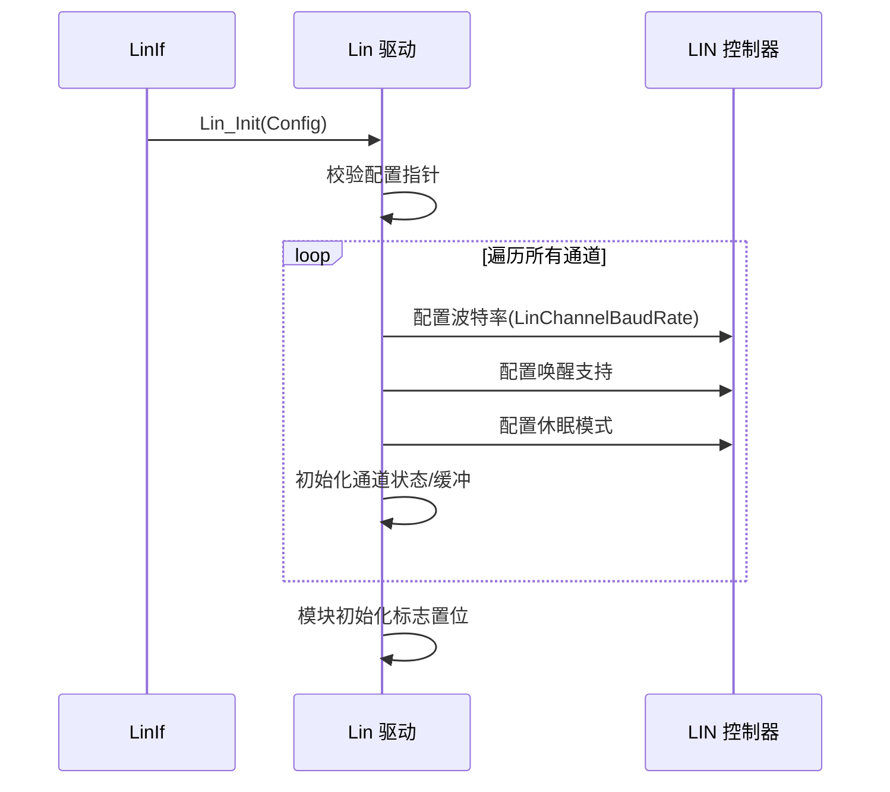
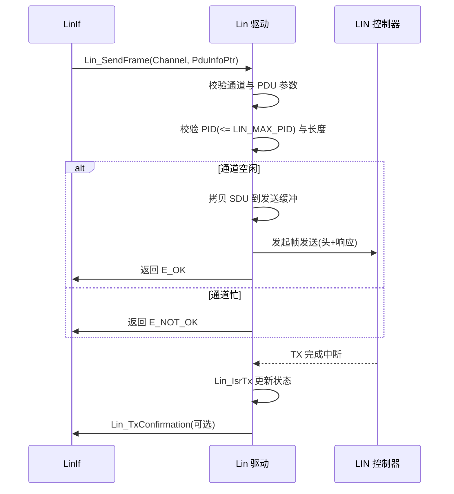
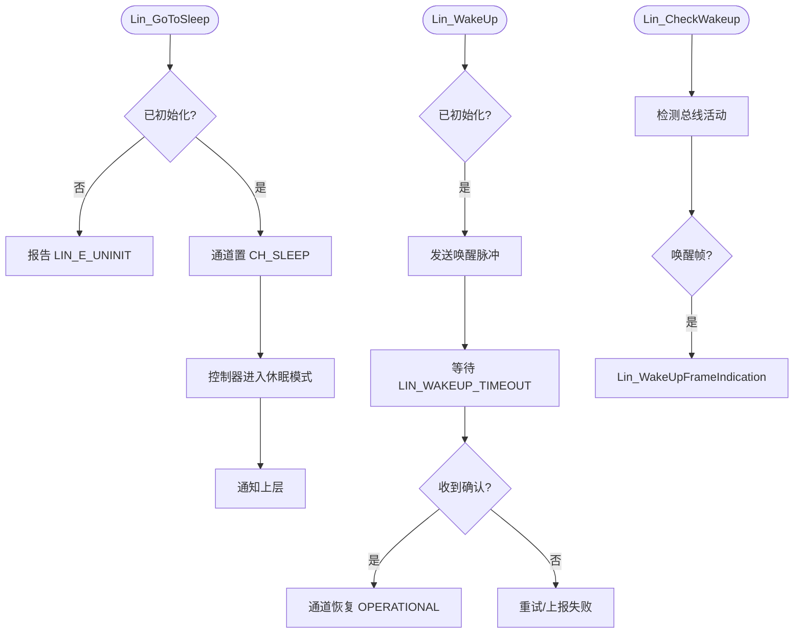

# Lin（LIN驱动模块）

<cite>
**本文档引用的文件**
- [Lin.h](file://src/bsw/mcal/lin/include/Lin.h)
- [Lin_Cfg.h](file://src/bsw/mcal/lin/include/Lin_Cfg.h)
- [LinMaster.h](file://src/bsw/mcal/lin/include/LinMaster.h)
- [LinMaster_Types.h](file://src/bsw/mcal/lin/include/LinMaster_Types.h)
- [LinMaster_Cfg.h](file://src/bsw/mcal/lin/include/LinMaster_Cfg.h)
- [LinSlave.h](file://src/bsw/mcal/lin/include/LinSlave.h)
- [LinSlave_Types.h](file://src/bsw/mcal/lin/include/LinSlave_Types.h)
- [LinSlave_Tp.h](file://src/bsw/mcal/lin/include/LinSlave_Tp.h)
- [Lin.c](file://src/bsw/mcal/lin/src/Lin.c)
- [Det.h](file://src/bsw/services/det/include/Det.h)
- [Std_Types.h](file://src/bsw/os/include/Std_Types.h)
</cite>

## 目录
1. [简介](#简介)
2. [项目结构](#项目结构)
3. [核心组件](#核心组件)
4. [架构概览](#架构概览)
5. [详细组件分析](#详细组件分析)
6. [依赖关系分析](#依赖关系分析)
7. [性能考虑](#性能考虑)
8. [故障排除指南](#故障排除指南)
9. [结论](#结论)
10. [附录](#附录)

## 简介

Lin（LIN Driver，LIN 驱动）是基于 AUTOSAR 4.0.3 标准开发的 MCAL 层 LIN 总线驱动模块，负责管理 LIN 控制器的帧收发、休眠唤醒和状态管理。该模块实现了 AUTOSAR LinIf 所需的底层接口，支持主从双模式（LinMaster/LinSlave 子模块）、5 种帧类型、3 种响应类型和 2 种校验和类型。

本模块针对 NXP i.MX8M Mini 平台的 LIN 控制器实现，支持最多 2 个通道、19200bps 波特率、8 字节最大帧载荷，为上层 LinIf/LinSM/LinNM 提供完整的 LIN 通信基础。

**章节来源**
- [Lin.h:23-60](file://src/bsw/mcal/lin/include/Lin.h#L23-L60)
- [Lin.h:62-120](file://src/bsw/mcal/lin/include/Lin.h#L62-L120)

## 项目结构

Lin 模块源码位于 `src/bsw/mcal/lin/`，采用主从分离的多文件设计：

```
src/bsw/mcal/lin/
├── include/
│   ├── Lin.h                    # 公共 API（157 行）
│   ├── Lin_Cfg.h                # 预编译配置
│   ├── LinMaster.h              # 主机模式 API
│   ├── LinMaster_Types.h        # 主机模式类型
│   ├── LinMaster_Cfg.h          # 主机模式配置
│   ├── LinSlave.h               # 从机模式 API
│   ├── LinSlave_Types.h         # 从机模式类型
│   ├── LinSlave_Hal.h           # 从机硬件抽象
│   ├── LinSlave_CfgTable.h      # 从机配置表
│   └── LinSlave_Tp.h            # 从机传输协议（诊断）
└── src/
    └── Lin.c                    # 驱动实现（收发/休眠/唤醒/ISR）
```

```mermaid
graph TB
subgraph "上层"
LINIF[LinIf 接口]
LINSM[LinSM 调度]
LINNM[LinNm 网络管理]
end
subgraph "MCAL"
LIN[Lin 驱动]
subgraph "模式子模块"
MASTER[LinMaster 主机模式]
SLAVE[LinSlave 从机模式]
SLTP[LinSlave_Tp 诊断传输]
END
end
subgraph "硬件"
LINHW[LIN 控制器]
BUS[LIN 总线]
END
LINIF --> LIN
LINSM --> LIN
LINNM --> LIN
LIN --> MASTER
LIN --> SLAVE
SLAVE --> SLTP
MASTER --> LINHW
SLAVE --> LINHW
LINHW --> BUS
```

**图表来源**
- [Lin.h:23-30](file://src/bsw/mcal/lin/include/Lin.h#L23-L30)
- [Lin.c:8-16](file://src/bsw/mcal/lin/src/Lin.c#L8-L16)

**章节来源**
- [Lin.h:1-120](file://src/bsw/mcal/lin/include/Lin.h#L1-L120)
- [Lin_Cfg.h:1-80](file://src/bsw/mcal/lin/include/Lin_Cfg.h#L1-L80)

## 核心组件

Lin 模块的核心组件包括：

### 数据类型定义
- **Lin_StatusType**: 状态码（11 种）：
  - LIN_NOT_OK/TX_OK/TX_BUSY/TX_HEADER_ERROR/TX_ERROR/RX_OK/RX_BUSY/RX_ERROR/RX_NO_RESPONSE/OPERATIONAL/CH_SLEEP
- **Lin_FrameTypeType**: 帧类型（UNCONDITIONAL 无条件/EVENT_TRIGGERED 事件触发/SPORADIC 偶发/DIAGNOSTIC 诊断/USER_DEFINED 用户定义）
- **Lin_FrameResponseType**: 响应类型（MASTER_RESPONSE/SLAVE_RESPONSE/SLAVE_TO_SLAVE）
- **Lin_FrameCheckSumType**: 校验和（CLASSIC_CS 经典/ENHANCED_CS 增强）
- **Lin_FramePidType**: 帧 PID（0-63）
- **Lin_PduType**: 帧结构（PID、帧类型、响应类型、长度、校验和类型、SDU 指针）
- **Lin_ChannelConfigType**: 通道配置（波特率、通道 ID、唤醒支持、休眠模式）
- **Lin_ConfigType**: 全局配置（通道配置数组、数量、DET/版本开关）

### 配置参数（Lin_Cfg.h）
- **LIN_MAX_CHANNELS**: 2 通道
- **LIN_CH0/CH1_BAUDRATE**: 19200bps
- **LIN_MAX_FRAME_LENGTH**: 8 字节
- **LIN_MAX_PID**: 63
- **LIN_WAKEUP_SUPPORT**: 唤醒支持
- **LIN_TIMEOUT**: 100、**LIN_WAKEUP_TIMEOUT**: 50
- **LIN_BAUDRATE_9600/19200**: 波特率常量

### 运行时状态（Lin.c）
- **Lin_ChannelStatus**: 每通道状态数组
- **Lin_ChannelInitialized**: 通道初始化标志
- **Lin_TxBuffer/RxBuffer**: 每通道收发缓冲（LIN_MAX_FRAME_LENGTH 字节）

**章节来源**
- [Lin.h:62-120](file://src/bsw/mcal/lin/include/Lin.h#L62-L120)
- [Lin.h:98-110](file://src/bsw/mcal/lin/include/Lin.h#L98-L110)
- [Lin_Cfg.h:20-60](file://src/bsw/mcal/lin/include/Lin_Cfg.h#L20-L60)

## 架构概览

Lin 采用"API 层 → 通道管理层 → 硬件/ISR 层"的分层架构：

```mermaid
graph TB
subgraph "API 层"
INIT[Lin_Init/DeInit]
SEND[Lin_SendFrame/SendResponse/DisableResponse]
WAKE[Lin_WakeUp/WakeUpInternal/CheckWakeup]
SLEEP[Lin_GoToSleep/GoToSleepInternal]
STATUS[Lin_GetStatus]
VER[Lin_GetVersionInfo]
END
subgraph "通道管理层"
CHSTAT[通道状态数组]
TXBUF[发送缓冲管理]
RXBUF[接收缓冲管理]
CHCFG[通道配置]
END
subgraph "回调与 ISR"
CBK[Lin_WakeUpConfirmation/WakeUpFrameIndication]
ISRTX[Lin_IsrTx]
ISRRX[Lin_IsrRx]
ISRERR[Lin_IsrErr]
END
subgraph "硬件"
LINHW[LIN 控制器]
END
INIT --> CHCFG
SEND --> TXBUF
SEND --> CHSTAT
WAKE --> CHSTAT
SLEEP --> CHSTAT
STATUS --> CHSTAT
TXBUF --> LINHW
RXBUF --> LINHW
ISRTX --> TXBUF
ISRRX --> RXBUF
ISRERR --> CHSTAT
CBK --> CHSTAT
```

**图表来源**
- [Lin.c:23-34](file://src/bsw/mcal/lin/src/Lin.c#L23-L34)
- [Lin.c:36-341](file://src/bsw/mcal/lin/src/Lin.c#L36-L341)
- [Lin.h:120-157](file://src/bsw/mcal/lin/include/Lin.h#L120-L157)

## 详细组件分析

### 初始化组件分析

Lin_Init() 完成通道初始化：



**图表来源**
- [Lin.c:36-67](file://src/bsw/mcal/lin/src/Lin.c#L36-L67)

#### 初始化流程详解

1. **参数验证**: 检查配置指针与通道数（DET 上报 LIN_E_INVALID_POINTER）
2. **硬件配置**: 按 LinChannelBaudRate（19200）配置波特率
3. **状态初始化**: Lin_ChannelStatus 置 OPERATIONAL，缓冲清零
4. **模块标志**: Lin_ModuleInitialized 置位

**章节来源**
- [Lin.c:36-67](file://src/bsw/mcal/lin/src/Lin.c#L36-L67)

### 帧发送组件分析

Lin_SendFrame() 与 Lin_SendResponse()：



**图表来源**
- [Lin.c:102-145](file://src/bsw/mcal/lin/src/Lin.c#L102-L145)
- [Lin.c:325-340](file://src/bsw/mcal/lin/src/Lin.c#L325-L340)

#### 帧发送特性

- **发送缓冲**: 每通道独立 Lin_TxBuffer（8 字节）
- **状态跟踪**: TX_OK/TX_BUSY/TX_HEADER_ERROR/TX_ERROR 状态码
- **响应控制**: SendResponse 发送从机响应帧，DisableResponse 关闭
- **诊断帧**: 通过 LinSlave_Tp 支持诊断传输（0x3C/0x3D）

**章节来源**
- [Lin.c:102-145](file://src/bsw/mcal/lin/src/Lin.c#L102-L145)
- [Lin.c:146-172](file://src/bsw/mcal/lin/src/Lin.c#L146-L172)

### 休眠与唤醒组件分析

Lin_GoToSleep()/Lin_WakeUp() 与状态机：



**图表来源**
- [Lin.c:270-310](file://src/bsw/mcal/lin/src/Lin.c#L270-L310)
- [Lin.c:190-246](file://src/bsw/mcal/lin/src/Lin.c#L190-L246)

#### 休眠唤醒特性

- **双接口**: WakeUp（上层请求）/WakeUpInternal（内部唤醒序列）
- **唤醒确认**: Lin_WakeUpConfirmation 回调通知唤醒完成
- **唤醒帧指示**: Lin_WakeUpFrameIndication 通知总线唤醒帧到达
- **超时保护**: LIN_WAKEUP_TIMEOUT（50）约束唤醒流程

**章节来源**
- [Lin.c:190-246](file://src/bsw/mcal/lin/src/Lin.c#L190-L246)
- [Lin.c:270-310](file://src/bsw/mcal/lin/src/Lin.c#L270-L310)

### 状态查询组件分析

Lin_GetStatus() 提供收发状态查询：

- 返回通道状态码（TX_OK/RX_OK/TX_BUSY 等）
- 通过 Lin_SduPtr 输出参数返回接收数据指针
- 供 LinIf 轮询帧收发完成状态
- ISR（IsrTx/IsrRx/IsrErr）更新状态供查询

**章节来源**
- [Lin.c:248-269](file://src/bsw/mcal/lin/src/Lin.c#L248-L269)
- [Lin.h:120-140](file://src/bsw/mcal/lin/include/Lin.h#L120-L140)

## 依赖关系分析

Lin 模块的依赖关系：

```mermaid
graph TB
subgraph "Lin 内部"
LN_H[Lin.h]
LN_CFG[Lin_Cfg.h]
LN_M[LinMaster.h]
LN_S[LinSlave.h]
LN_TP[LinSlave_Tp.h]
LN_C[Lin.c]
END
subgraph "基础依赖"
STD[Std_Types.h]
DET[Det.h]
MEMMAP[MemMap.h]
END
subgraph "上层"
LINIF[LinIf]
LINSM[LinSM]
LINNM[LinNm]
END
subgraph "硬件"
LINHW[LIN 控制器]
END
LN_H --> STD
LN_H --> LN_CFG
LN_C --> LN_H
LN_C --> DET
LN_M --> LN_H
LN_S --> LN_H
LN_TP --> LN_S
LINIF --> LN_H
LINSM --> LN_H
LINNM --> LN_H
LN_C --> LINHW
```

**图表来源**
- [Lin.h:23-30](file://src/bsw/mcal/lin/include/Lin.h#L23-L30)
- [Lin.c:8-16](file://src/bsw/mcal/lin/src/Lin.c#L8-L16)

### 关键依赖关系

1. **LinIf 依赖**: 上层通过 SendFrame/GetStatus 调度帧收发
2. **LinSM 依赖**: 休眠唤醒流程由 LinSM 驱动
3. **LinNM 依赖**: NM 报文通过 LinIf 传递至 Lin 驱动
4. **主从模块依赖**: LinMaster/LinSlave 子模块（含从机 TP 诊断）

**章节来源**
- [Lin.h:23-30](file://src/bsw/mcal/lin/include/Lin.h#L23-L30)
- [Lin_Cfg.h:40-60](file://src/bsw/mcal/lin/include/Lin_Cfg.h#L40-L60)

## 性能考虑

### 帧时序

| 参数 | 值 | 说明 |
|------|-----|------|
| 波特率 | 19200 bps | 通道默认 |
| 最大帧长 | 8 字节 | 数据段 |
| 最大 PID | 63 | 6 位 PID |
| LIN_TIMEOUT | 100 | 传输超时 |

### 帧时间估算

- 8 字节数据帧：约 13 字节总长 × 10 位/字节 ÷ 19200 ≈ 6.8ms
- 调度表周期需容纳最坏情况帧时间
- 唤醒脉冲 250μs-5ms（符合 LIN 规范）

### 资源占用

- 收发缓冲：2 通道 × 8 字节 × 2（TX+RX）
- 通道状态：每通道 1 字节 + 标志
- 无动态内存分配

**章节来源**
- [Lin_Cfg.h:25-45](file://src/bsw/mcal/lin/include/Lin_Cfg.h#L25-L45)
- [Lin.h:62-70](file://src/bsw/mcal/lin/include/Lin.h#L62-L70)

## 故障排除指南

### 常见错误代码

| 错误代码 | 错误含义 | 可能原因 | 解决方案 |
|---------|---------|---------|---------|
| LIN_E_UNINIT (0x00) | 未初始化 | Init 前调用 | 检查时序 |
| LIN_E_INVALID_CHANNEL (0x01) | 通道无效 | 通道号越界 | 检查 LIN_MAX_CHANNELS |
| LIN_E_INVALID_POINTER (0x02) | 指针无效 | 空 PDU 指针 | 检查参数 |
| LIN_E_STATE_TRANSITION (0x03) | 状态转换错误 | 非法状态操作 | 检查调用逻辑 |
| LIN_E_PARAM_VALUE (0x04) | 参数值无效 | PID/长度越界 | 检查帧配置 |

### 状态码诊断

| 状态码 | 含义 | 处理建议 |
|--------|------|---------|
| LIN_TX_HEADER_ERROR | 帧头发送错误 | 检查总线电平 |
| LIN_TX_ERROR | 发送错误 | 检查收发器 |
| LIN_RX_NO_RESPONSE | 从机无响应 | 检查从机地址/PID |
| LIN_RX_ERROR | 接收错误 | 检查校验和配置 |

### 调试建议

1. **总线波形**: 示波器验证帧头（同步间隔 13 位 + 同步场 + PID）
2. **PID 校验**: 确认 PID 奇偶校验位与 LinMaster_Cfg 调度一致
3. **唤醒测试**: 测量唤醒脉冲宽度与 LIN_WAKEUP_TIMEOUT 匹配
4. **调度验证**: 检查 LinIf 调度表周期与帧时间匹配

**章节来源**
- [Lin.h:54-60](file://src/bsw/mcal/lin/include/Lin.h#L54-L60)
- [Lin.h:62-70](file://src/bsw/mcal/lin/include/Lin.h#L62-L70)

## 结论

Lin LIN 驱动模块是一个功能完整、主从兼顾的 AUTOSAR 4.0.3 MCAL 总线组件。它提供：

1. **完整 AUTOSAR 接口**: 收发/休眠/唤醒/状态查询全套 API
2. **主从双模式**: LinMaster/LinSlave 子模块 + 从机诊断 TP
3. **多帧类型**: 无条件/事件触发/偶发/诊断/用户定义
4. **休眠唤醒管理**: 完整唤醒序列与超时保护
5. **状态诊断**: 11 种状态码覆盖收发全场景

该模块为 LIN 网络通信（LinIf 调度、LinSM 休眠管理、LinNM 网络管理）提供了可靠的 MCAL 基础。

## 附录

### 配置示例

```c
/* Lin_Lcfg.c 通道配置 */
const Lin_ChannelConfigType Lin_Channels[LIN_MAX_CHANNELS] = {
    {
        .LinChannelBaudRate = LIN_CH0_BAUDRATE,    /* 19200 */
        .LinChannelId = LIN_CHANNEL_0,
        .LinChannelWakeupSupport = LIN_CH0_WAKEUP_SUPPORT,
        .LinChannelSleepMode = 0U
    },
    {
        .LinChannelBaudRate = LIN_CH1_BAUDRATE,    /* 19200 */
        .LinChannelId = LIN_CHANNEL_1,
        .LinChannelWakeupSupport = LIN_CH1_WAKEUP_SUPPORT,
        .LinChannelSleepMode = 0U
    }
};

const Lin_ConfigType Lin_Config = {
    .ChannelConfigPtr = Lin_Channels,
    .NumChannels = LIN_MAX_CHANNELS,
    .DevErrorDetect = STD_ON,
    .VersionInfoApi = STD_ON
};
```

### 帧发送流程

1. LinIf 调度表到期，构造 Lin_PduType（PID/类型/长度/SDU）
2. Lin_SendFrame 发起发送，硬件完成触发 IsrTx
3. LinIf 轮询 Lin_GetStatus 确认 TX_OK
4. 从机响应帧通过 Lin_SendResponse 发送
5. 休眠时 LinSM 调 GoToSleep，唤醒经 CheckWakeup/WakeUp 恢复

**章节来源**
- [Lin_Cfg.h:50-70](file://src/bsw/mcal/lin/include/Lin_Cfg.h#L50-L70)
- [Lin.h:98-157](file://src/bsw/mcal/lin/include/Lin.h#L98-L157)
