# MCAL硬件抽象层

<cite>
**本文档引用的文件**
- [Mcu.h](file://src/bsw/mcal/mcu/include/Mcu.h)
- [Mcu_Cfg.h](file://src/bsw/mcal/mcu/include/Mcu_Cfg.h)
- [Dio.h](file://src/bsw/mcal/dio/include/Dio.h)
- [Dio_Cfg.h](file://src/bsw/mcal/dio/include/Dio_Cfg.h)
- [Can.h](file://src/bsw/mcal/can/include/Can.h)
- [Can_Cfg.h](file://src/bsw/mcal/can/include/Can_Cfg.h)
- [Spi.h](file://src/bsw/mcal/spi/include/Spi.h)
- [Spi_Cfg.h](file://src/bsw/mcal/spi/include/Spi_Cfg.h)
- [Gpt.h](file://src/bsw/mcal/gpt/include/Gpt.h)
- [Gpt_Cfg.h](file://src/bsw/mcal/gpt/include/Gpt_Cfg.h)
- [Port.h](file://src/bsw/mcal/port/include/Port.h)
- [Port_Cfg.h](file://src/bsw/mcal/port/include/Port_Cfg.h)
- [Pwm.h](file://src/bsw/mcal/pwm/include/Pwm.h)
- [Pwm_Cfg.h](file://src/bsw/mcal/pwm/include/Pwm_Cfg.h)
- [Adc.h](file://src/bsw/mcal/adc/include/Adc.h)
- [Adc_Cfg.h](file://src/bsw/mcal/adc/include/Adc_Cfg.h)
- [Wdg.h](file://src/bsw/mcal/wdg/include/Wdg.h)
- [Wdg_Cfg.h](file://src/bsw/mcal/wdg/include/Wdg_Cfg.h)
</cite>

## 目录
1. [引言](#引言)
2. [项目结构](#项目结构)
3. [核心组件](#核心组件)
4. [架构概览](#架构概览)
5. [详细组件分析](#详细组件分析)
6. [依赖关系分析](#依赖关系分析)
7. [性能考虑](#性能考虑)
8. [故障排除指南](#故障排除指南)
9. [结论](#结论)

## 引言

MCAL（微控制器抽象层）是AUTOSAR架构中的关键组件，位于应用软件和硬件之间，提供标准化的硬件访问接口。本项目实现了完整的MCAL硬件抽象层，包含9个核心硬件驱动模块，为上层应用软件提供统一的硬件操作接口。

本MCAL实现遵循AUTOSAR经典平台4.x标准，采用模块化设计，每个硬件驱动都提供了标准化的接口规范、配置参数和运行时管理机制。所有模块都支持错误检测和报告（DET），确保系统的可靠性和可维护性。

## 项目结构

MCAL硬件抽象层采用按功能模块组织的目录结构，每个硬件驱动模块都包含独立的头文件和配置文件：

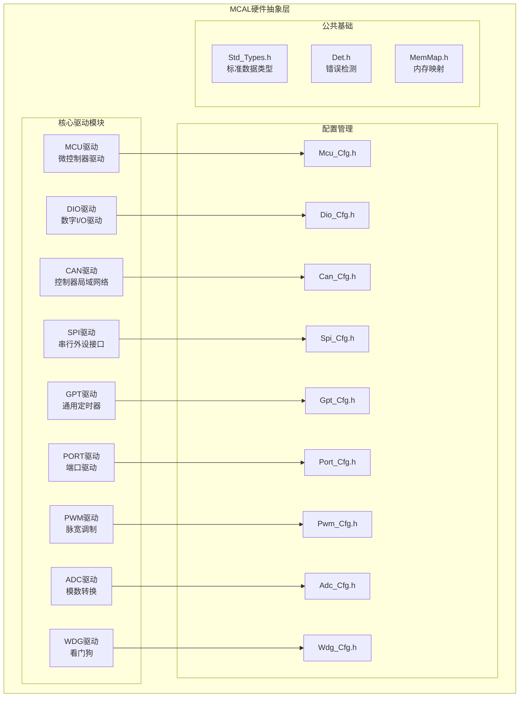

**图表来源**
- [Mcu.h:1-239](file://src/bsw/mcal/mcu/include/Mcu.h#L1-L239)
- [Dio.h:1-195](file://src/bsw/mcal/dio/include/Dio.h#L1-L195)
- [Can.h:1-269](file://src/bsw/mcal/can/include/Can.h#L1-L269)
- [Spi.h:1-362](file://src/bsw/mcal/spi/include/Spi.h#L1-L362)
- [Gpt.h:1-267](file://src/bsw/mcal/gpt/include/Gpt.h#L1-L267)
- [Port.h:1-183](file://src/bsw/mcal/port/include/Port.h#L1-L183)
- [Pwm.h:1-299](file://src/bsw/mcal/pwm/include/Pwm.h#L1-L299)
- [Adc.h:1-384](file://src/bsw/mcal/adc/include/Adc.h#L1-L384)
- [Wdg.h:1-169](file://src/bsw/mcal/wdg/include/Wdg.h#L1-L169)

**章节来源**
- [Mcu.h:1-239](file://src/bsw/mcal/mcu/include/Mcu.h#L1-L239)
- [Dio.h:1-195](file://src/bsw/mcal/dio/include/Dio.h#L1-L195)
- [Can.h:1-269](file://src/bsw/mcal/can/include/Can.h#L1-L269)
- [Spi.h:1-362](file://src/bsw/mcal/spi/include/Spi.h#L1-L362)
- [Gpt.h:1-267](file://src/bsw/mcal/gpt/include/Gpt.h#L1-L267)
- [Port.h:1-183](file://src/bsw/mcal/port/include/Port.h#L1-L183)
- [Pwm.h:1-299](file://src/bsw/mcal/pwm/include/Pwm.h#L1-L299)
- [Adc.h:1-384](file://src/bsw/mcal/adc/include/Adc.h#L1-L384)
- [Wdg.h:1-169](file://src/bsw/mcal/wdg/include/Wdg.h#L1-L169)

## 核心组件

MCAL硬件抽象层包含9个核心硬件驱动模块，每个模块都实现了AUTOSAR标准定义的接口规范：

### 微控制器驱动（Mcu）

Mcu驱动负责微控制器的初始化、时钟配置、复位管理和低功耗模式控制。该模块提供了完整的电源管理模式，包括正常模式、睡眠模式和深度睡眠模式。

**主要功能特性：**
- 多时钟源支持（XTAL、PLL、RC）
- 动态时钟分频和倍频
- 复位原因检测和报告
- 低功耗模式管理
- 版本信息查询

**章节来源**
- [Mcu.h:134-220](file://src/bsw/mcal/mcu/include/Mcu.h#L134-L220)
- [Mcu_Cfg.h:15-80](file://src/bsw/mcal/mcu/include/Mcu_Cfg.h#L15-L80)

### 数字I/O驱动（Dio）

Dio驱动提供对微控制器数字I/O端口的直接访问，支持单个通道、端口整体和通道组的操作。该模块实现了灵活的I/O配置和状态管理。

**主要功能特性：**
- 单通道读写操作
- 端口级读写操作  
- 通道组操作
- 翻转操作支持
- 端口方向动态配置

**章节来源**
- [Dio.h:90-185](file://src/bsw/mcal/dio/include/Dio.h#L90-L185)
- [Dio_Cfg.h:15-87](file://src/bsw/mcal/dio/include/Dio_Cfg.h#L15-L87)

### 控制器局域网络驱动（Can）

Can驱动实现AUTOSAR标准的CAN控制器接口，支持多控制器、多硬件对象和多种传输模式。该模块提供了完整的CAN通信栈支持。

**主要功能特性：**
- 多控制器支持（最多2个）
- 硬件对象管理（最多16个）
- 多波特率配置
- 中断和轮询两种处理模式
- 主函数处理机制

**章节来源**
- [Can.h:193-263](file://src/bsw/mcal/can/include/Can.h#L193-L263)
- [Can_Cfg.h:15-73](file://src/bsw/mcal/can/include/Can_Cfg.h#L15-L73)

### 串行外设接口驱动（Spi）

Spi驱动提供SPI总线的完整支持，包括内部缓冲区、外部缓冲区和异步传输模式。该模块支持复杂的SPI设备配置和数据传输。

**主要功能特性：**
- 内部缓冲区和外部缓冲区支持
- 8个通道、8个作业、4个序列配置
- 异步和同步传输模式
- 设备级配置管理
- 传输结果查询

**章节来源**
- [Spi.h:250-356](file://src/bsw/mcal/spi/include/Spi.h#L250-L356)
- [Spi_Cfg.h:15-98](file://src/bsw/mcal/spi/include/Spi_Cfg.h#L15-L98)

### 通用定时器驱动（Gpt）

Gpt驱动提供通用定时器功能，支持多个独立的定时器通道和预定义定时器。该模块用于精确的时间管理和周期性任务调度。

**主要功能特性：**
- 8个独立定时器通道
- 多种时钟预分频器
- 预定义定时器支持（1μs、100μs）
- 一次性和连续模式
- 通知中断支持

**章节来源**
- [Gpt.h:174-261](file://src/bsw/mcal/gpt/include/Gpt.h#L174-L261)
- [Gpt_Cfg.h:15-66](file://src/bsw/mcal/gpt/include/Gpt_Cfg.h#L15-L66)

### 端口驱动（Port）

Port驱动管理微控制器端口引脚的配置和状态，提供引脚方向和模式的动态设置能力。该模块是所有外设驱动的基础配置接口。

**主要功能特性：**
- 8个端口，每端口32个引脚
- 引脚方向动态配置
- 多种引脚模式支持
- 初始状态配置
- 模式变更控制

**章节来源**
- [Port.h:109-173](file://src/bsw/mcal/port/include/Port.h#L109-L173)
- [Port_Cfg.h:15-103](file://src/bsw/mcal/port/include/Port_Cfg.h#L15-L103)

### 脉宽调制驱动（Pwm）

Pwm驱动提供精确的脉宽调制输出控制，支持多种通道类型和输出状态管理。该模块用于电机控制、LED调光等应用。

**主要功能特性：**
- 8个PWM通道
- 变周期和固定周期模式
- 多种极性配置
- 输出状态监控
- 通知中断支持

**章节来源**
- [Pwm.h:209-293](file://src/bsw/mcal/pwm/include/Pwm.h#L209-L293)
- [Pwm_Cfg.h:15-63](file://src/bsw/mcal/pwm/include/Pwm_Cfg.h#L15-L63)

### 模数转换驱动（Adc）

Adc驱动提供高精度的模拟信号数字化功能，支持多硬件单元和通道组配置。该模块用于传感器数据采集和信号处理。

**主要功能特性：**
- 2个ADC硬件单元
- 8个通道组，16个通道
- 多种采样时间和分辨率
- 流式和单次转换模式
- 硬件触发支持

**章节来源**
- [Adc.h:261-378](file://src/bsw/mcal/adc/include/Adc.h#L261-L378)
- [Adc_Cfg.h:15-105](file://src/bsw/mcal/adc/include/Adc_Cfg.h#L15-L105)

### 看门狗驱动（Wdg）

Wdg驱动提供系统看门狗功能，确保系统在异常情况下能够自动恢复。该模块支持多种工作模式和超时配置。

**主要功能特性：**
- OFF、SLOW、FAST三种工作模式
- 窗口模式支持
- 中断模式配置
- 触发条件动态设置
- 版本信息查询

**章节来源**
- [Wdg.h:134-163](file://src/bsw/mcal/wdg/include/Wdg.h#L134-L163)
- [Wdg_Cfg.h:15-62](file://src/bsw/mcal/wdg/include/Wdg_Cfg.h#L15-L62)

## 架构概览

MCAL硬件抽象层采用分层架构设计，确保了良好的模块化和可扩展性：

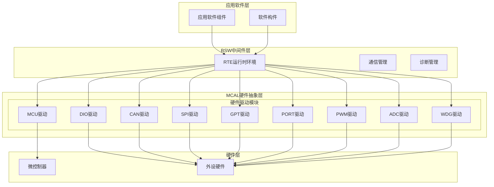

**图表来源**
- [Mcu.h:1-239](file://src/bsw/mcal/mcu/include/Mcu.h#L1-L239)
- [Can.h:1-269](file://src/bsw/mcal/can/include/Can.h#L1-L269)
- [Spi.h:1-362](file://src/bsw/mcal/spi/include/Spi.h#L1-L362)
- [Gpt.h:1-267](file://src/bsw/mcal/gpt/include/Gpt.h#L1-L267)
- [Port.h:1-183](file://src/bsw/mcal/port/include/Port.h#L1-L183)
- [Pwm.h:1-299](file://src/bsw/mcal/pwm/include/Pwm.h#L1-L299)
- [Adc.h:1-384](file://src/bsw/mcal/adc/include/Adc.h#L1-L384)
- [Wdg.h:1-169](file://src/bsw/mcal/wdg/include/Wdg.h#L1-L169)

### 硬件抽象设计原理

MCAL硬件抽象层遵循以下设计原则：

1. **标准化接口**：所有驱动模块都提供统一的API接口，确保上层软件的可移植性
2. **配置驱动**：通过配置文件实现硬件定制，支持不同的硬件平台
3. **错误处理**：集成AUTOSAR标准的错误检测和报告机制
4. **内存管理**：使用标准的内存映射机制，确保代码和数据的正确布局
5. **中断管理**：提供统一的中断处理接口和优先级管理

## 详细组件分析

### MCU微控制器驱动分析

MCU驱动是整个MCAL系统的核心，负责微控制器的初始化和系统级管理。

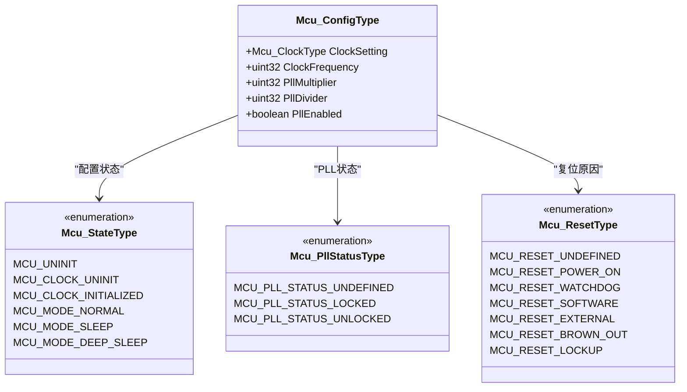

**图表来源**
- [Mcu.h:94-101](file://src/bsw/mcal/mcu/include/Mcu.h#L94-L101)
- [Mcu.h:66-92](file://src/bsw/mcal/mcu/include/Mcu.h#L66-L92)

**初始化流程：**

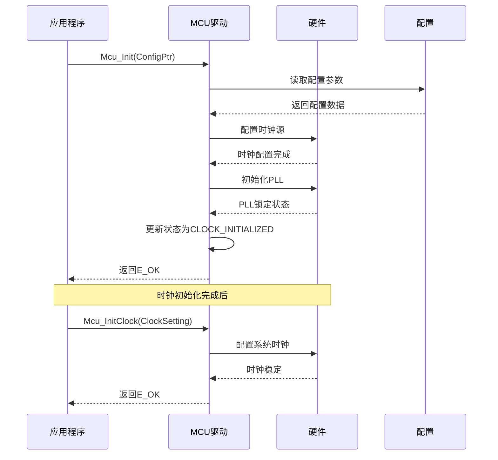

**图表来源**
- [Mcu.h:148-175](file://src/bsw/mcal/mcu/include/Mcu.h#L148-L175)

**配置参数详解：**

| 参数名称 | 类型 | 默认值 | 描述 |
|---------|------|--------|------|
| MCU_XTAL_FREQUENCY_HZ | uint32 | 24,000,000 | 晶振频率（Hz） |
| MCU_SYSTEM_CLOCK_HZ | uint32 | 1,000,000,000 | 系统时钟频率（Hz） |
| MCU_BUS_CLOCK_HZ | uint32 | 500,000,000 | 总线时钟频率（Hz） |
| MCU_FLASH_CLOCK_HZ | uint32 | 100,000,000 | 存储器时钟频率（Hz） |
| MCU_PLL_MULTIPLIER | uint32 | 125 | PLL倍频系数 |
| MCU_PLL_POSTDIV | uint32 | 3 | PLL后分频系数 |

**章节来源**
- [Mcu.h:134-230](file://src/bsw/mcal/mcu/include/Mcu.h#L134-L230)
- [Mcu_Cfg.h:25-75](file://src/bsw/mcal/mcu/include/Mcu_Cfg.h#L25-L75)

### Dio数字I/O驱动分析

Dio驱动提供对数字I/O端口的直接控制，支持灵活的通道组合和状态管理。

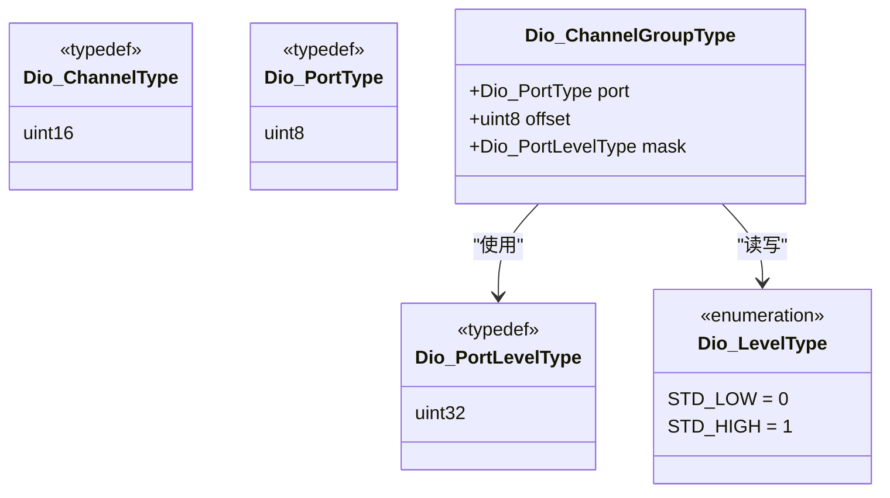

**图表来源**
- [Dio.h:54-74](file://src/bsw/mcal/dio/include/Dio.h#L54-L74)
- [Dio.h:64-67](file://src/bsw/mcal/dio/include/Dio.h#L64-L67)

**API参考：**

| 函数名称 | 参数 | 返回值 | 功能描述 |
|---------|------|--------|----------|
| Dio_ReadChannel | ChannelId: Dio_ChannelType | Dio_LevelType | 读取指定通道状态 |
| Dio_WriteChannel | ChannelId: Dio_ChannelType Level: Dio_LevelType | void | 写入通道状态 |
| Dio_ReadPort | PortId: Dio_PortType | Dio_PortLevelType | 读取端口所有通道 |
| Dio_WritePort | PortId: Dio_PortType Level: Dio_PortLevelType | void | 写入端口状态 |
| Dio_ReadChannelGroup | ChannelGroupIdPtr: const Dio_ChannelGroupType* | Dio_PortLevelType | 读取通道组状态 |
| Dio_WriteChannelGroup | ChannelGroupIdPtr: const Dio_ChannelGroupType* Level: Dio_PortLevelType | void | 写入通道组状态 |

**配置选项：**

| 配置项 | 默认值 | 描述 |
|-------|--------|------|
| DIO_NUM_PORTS | 8 | 端口数量 |
| DIO_NUM_CHANNELS_PER_PORT | 32 | 每端口通道数 |
| DIO_VERSION_INFO_API | STD_ON | 版本信息API开关 |
| DIO_FLIP_CHANNEL_API | STD_ON | 翻转操作API开关 |

**章节来源**
- [Dio.h:90-185](file://src/bsw/mcal/dio/include/Dio.h#L90-L185)
- [Dio_Cfg.h:15-87](file://src/bsw/mcal/dio/include/Dio_Cfg.h#L15-L87)

### Can控制器驱动分析

Can驱动实现AUTOSAR标准的CAN控制器接口，支持复杂的网络通信功能。

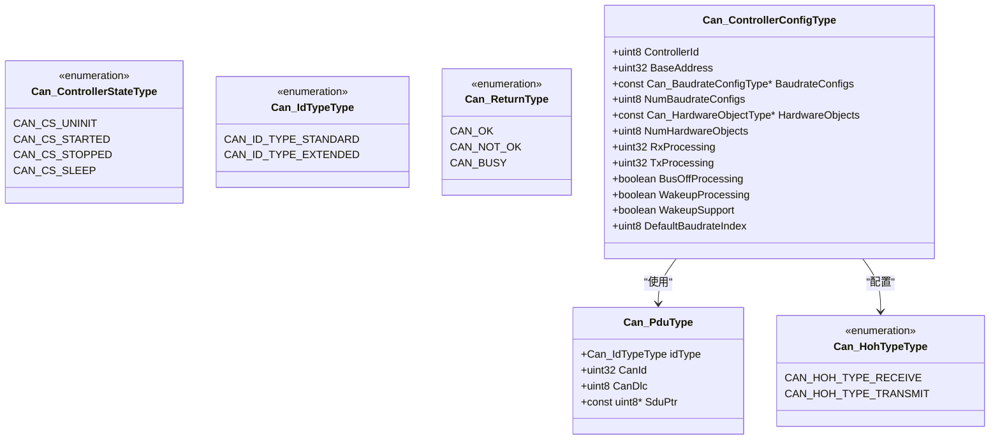

**图表来源**
- [Can.h:76-164](file://src/bsw/mcal/can/include/Can.h#L76-L164)

**通信流程：**

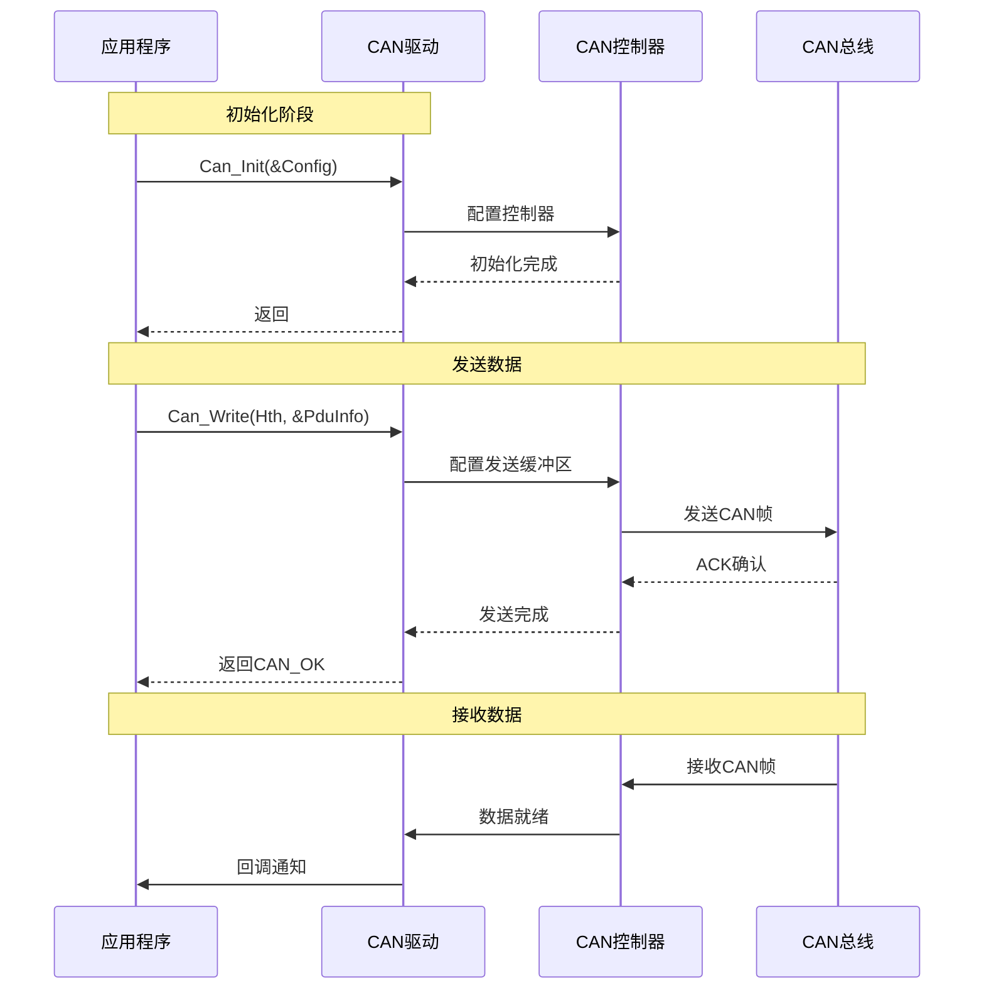

**图表来源**
- [Can.h:211-263](file://src/bsw/mcal/can/include/Can.h#L211-L263)

**配置参数：**

| 参数名称 | 类型 | 默认值 | 描述 |
|---------|------|--------|------|
| CAN_NUM_CONTROLLERS | uint8 | 2 | 控制器数量 |
| CAN_NUM_HOH | uint8 | 16 | 硬件对象数量 |
| CAN_NUM_BAUDRATE_CONFIGS | uint8 | 3 | 波特率配置数量 |
| CAN_PROCESSING_POLLING | uint8 | 1 | 轮询模式 |
| CAN_MAIN_FUNCTION_PERIOD_MS | uint32 | 10 | 主函数周期(ms) |

**章节来源**
- [Can.h:193-263](file://src/bsw/mcal/can/include/Can.h#L193-L263)
- [Can_Cfg.h:15-73](file://src/bsw/mcal/can/include/Can_Cfg.h#L15-L73)

### Spi串行通信驱动分析

Spi驱动提供高性能的串行通信功能，支持复杂的设备配置和数据传输模式。

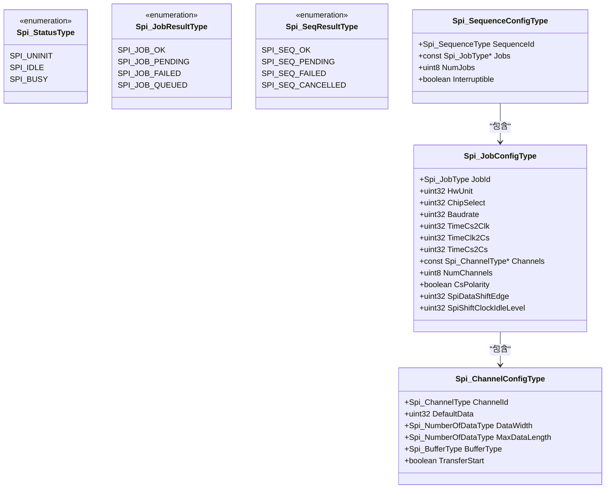

**图表来源**
- [Spi.h:82-231](file://src/bsw/mcal/spi/include/Spi.h#L82-L231)

**传输模式：**

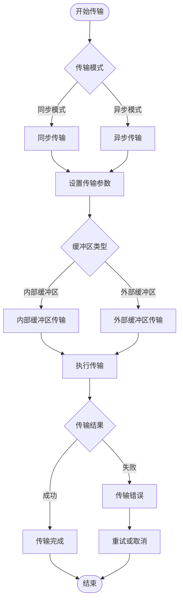

**图表来源**
- [Spi.h:267-356](file://src/bsw/mcal/spi/include/Spi.h#L267-L356)

**配置参数：**

| 参数名称 | 类型 | 默认值 | 描述 |
|---------|------|--------|------|
| SPI_NUM_CHANNELS | uint8 | 8 | 通道数量 |
| SPI_NUM_JOBS | uint8 | 8 | 作业数量 |
| SPI_NUM_SEQUENCES | uint8 | 4 | 序列数量 |
| SPI_NUM_HW_UNITS | uint8 | 4 | 硬件单元数量 |
| SPI_DEFAULT_ASYNC_MODE | Spi_AsyncModeType | SPI_POLLING_MODE | 默认异步模式 |
| SPI_MAX_BUFFER_SIZE | uint32 | 256 | 最大缓冲区大小 |

**章节来源**
- [Spi.h:250-356](file://src/bsw/mcal/spi/include/Spi.h#L250-L356)
- [Spi_Cfg.h:15-98](file://src/bsw/mcal/spi/include/Spi_Cfg.h#L15-L98)

### Gpt通用定时器驱动分析

Gpt驱动提供精确的时间基准和定时功能，支持多种定时器配置和模式。

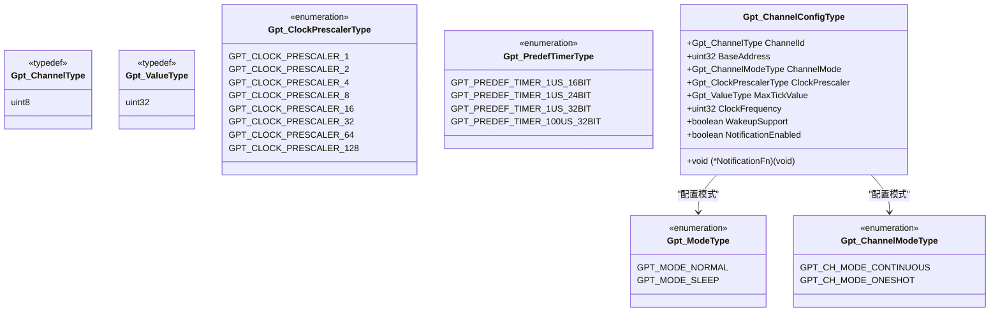

**图表来源**
- [Gpt.h:75-155](file://src/bsw/mcal/gpt/include/Gpt.h#L75-L155)

**定时器配置：**

| 配置参数 | 默认值 | 描述 |
|---------|--------|------|
| GPT_NUM_CHANNELS | 8 | 定时器通道数量 |
| GPT_DEFAULT_MODE | GPT_MODE_NORMAL | 默认工作模式 |
| GPT_CLOCK_FREQUENCY_HZ | 24,000,000 | 时钟频率（Hz） |
| GPT_MAX_TICK_VALUE | 0xFFFFFFFF | 最大计数值 |
| GPT_MAIN_FUNCTION_PERIOD_MS | 1 | 主函数周期（ms） |

**章节来源**
- [Gpt.h:174-261](file://src/bsw/mcal/gpt/include/Gpt.h#L174-L261)
- [Gpt_Cfg.h:15-66](file://src/bsw/mcal/gpt/include/Gpt_Cfg.h#L15-L66)

### Port端口驱动分析

Port驱动管理微控制器端口引脚的配置，为其他外设驱动提供基础的引脚管理功能。

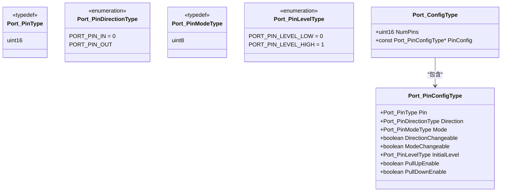

**图表来源**
- [Port.h:55-89](file://src/bsw/mcal/port/include/Port.h#L55-L89)

**引脚配置：**

| 引脚模式 | 编号 | 描述 |
|---------|------|------|
| PORT_PIN_MODE_GPIO | 0 | 通用数字I/O |
| PORT_PIN_MODE_CAN | 1 | CAN通信接口 |
| PORT_PIN_MODE_SPI | 2 | SPI通信接口 |
| PORT_PIN_MODE_UART | 3 | UART通信接口 |
| PORT_PIN_MODE_I2C | 4 | I2C通信接口 |
| PORT_PIN_MODE_PWM | 5 | PWM输出接口 |
| PORT_PIN_MODE_ADC | 6 | ADC输入接口 |
| PORT_PIN_MODE_ETH | 7 | 以太网接口 |
| PORT_PIN_MODE_USB | 8 | USB接口 |
| PORT_PIN_MODE_FLEXIO | 9 | FlexIO接口 |
| PORT_PIN_MODE_DISABLED | 15 | 禁用模式 |

**章节来源**
- [Port.h:109-173](file://src/bsw/mcal/port/include/Port.h#L109-L173)
- [Port_Cfg.h:15-103](file://src/bsw/mcal/port/include/Port_Cfg.h#L15-L103)

### Pwm脉宽调制驱动分析

Pwm驱动提供精确的脉宽调制输出，支持多种波形生成和控制功能。

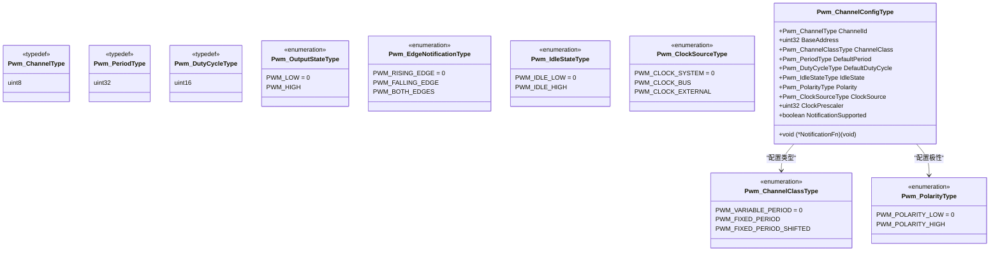

**图表来源**
- [Pwm.h:75-190](file://src/bsw/mcal/pwm/include/Pwm.h#L75-L190)

**PWM配置参数：**

| 参数名称 | 类型 | 默认值 | 描述 |
|---------|------|--------|------|
| PWM_NUM_CHANNELS | uint8 | 8 | PWM通道数量 |
| PWM_DEFAULT_PERIOD | Pwm_PeriodType | 1000 | 默认周期（ticks） |
| PWM_DEFAULT_DUTY_CYCLE | uint16 | 0x4000 | 默认占空比（0x8000 = 100%） |
| PWM_DUTY_CYCLE_RESOLUTION | uint16 | 0x8000 | 占空比分辨率 |
| PWM_CLOCK_FREQUENCY_HZ | uint32 | 24,000,000 | PWM时钟频率（Hz） |

**章节来源**
- [Pwm.h:209-293](file://src/bsw/mcal/pwm/include/Pwm.h#L209-L293)
- [Pwm_Cfg.h:15-63](file://src/bsw/mcal/pwm/include/Pwm_Cfg.h#L15-L63)

### Adc模数转换驱动分析

Adc驱动提供高精度的模拟信号数字化功能，支持多种采样模式和数据处理方式。

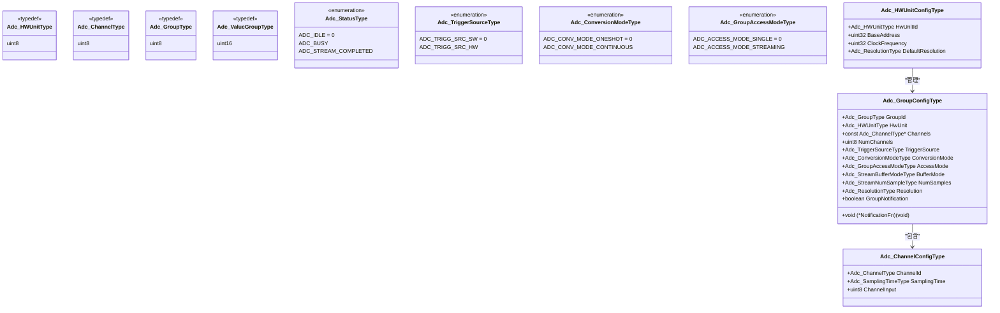

**图表来源**
- [Adc.h:88-242](file://src/bsw/mcal/adc/include/Adc.h#L88-L242)

**采样配置：**

| 采样时间 | 周期数 | 适用场景 |
|---------|--------|----------|
| ADC_SAMPLING_TIME_3CYCLES | 3 | 高速采样，精度较低 |
| ADC_SAMPLING_TIME_15CYCLES | 15 | 标准采样，平衡速度和精度 |
| ADC_SAMPLING_TIME_28CYCLES | 28 | 精确采样，中等速度 |
| ADC_SAMPLING_TIME_56CYCLES | 56 | 高精度采样，较慢速度 |
| ADC_SAMPLING_TIME_84CYCLES | 84 | 超高精度，低速采样 |
| ADC_SAMPLING_TIME_112CYCLES | 112 | 极高精度，最慢速度 |
| ADC_SAMPLING_TIME_144CYCLES | 144 | 超高精度，最低速 |
| ADC_SAMPLING_TIME_480CYCLES | 480 | 极限精度，最慢速度 |

**章节来源**
- [Adc.h:261-378](file://src/bsw/mcal/adc/include/Adc.h#L261-L378)
- [Adc_Cfg.h:15-105](file://src/bsw/mcal/adc/include/Adc_Cfg.h#L15-L105)

### Wdg看门狗驱动分析

Wdg驱动提供系统看门狗功能，确保系统在异常情况下能够自动恢复。

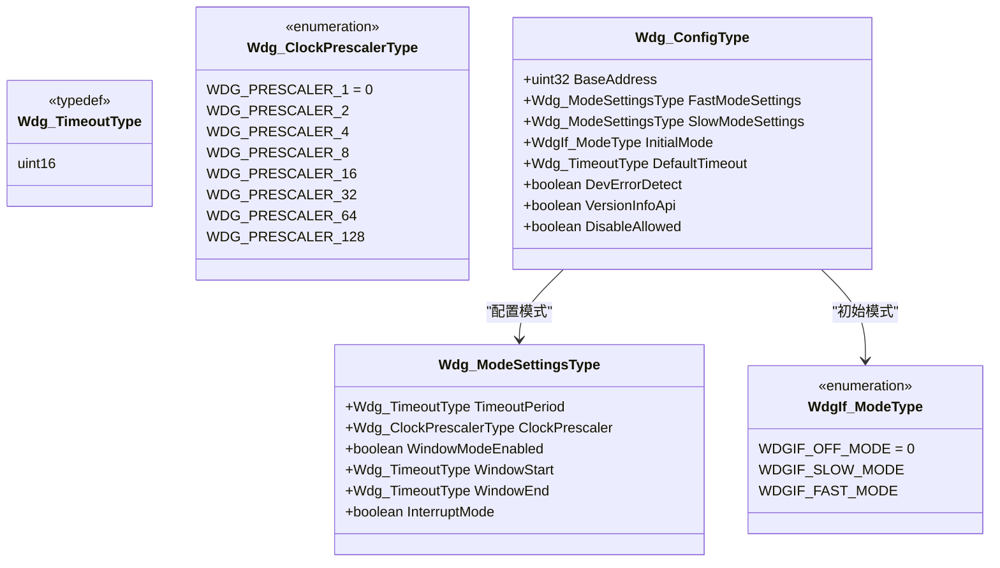

**图表来源**
- [Wdg.h:65-115](file://src/bsw/mcal/wdg/include/Wdg.h#L65-L115)

**看门狗模式：**

| 模式 | 超时时间 | 预分频器 | 窗口模式 | 中断模式 | 适用场景 |
|------|----------|----------|----------|----------|----------|
| OFF_MODE | 可配置 | 无 | 不适用 | 不适用 | 禁用看门狗 |
| SLOW_MODE | 100-500ms | 256 | 可选 | 可选 | 低功耗应用 |
| FAST_MODE | 10-50ms | 64 | 可选 | 可选 | 实时应用 |

**配置参数：**

| 参数名称 | 类型 | 默认值 | 描述 |
|---------|------|--------|------|
| WDG_INITIAL_MODE | WdgIf_ModeType | WDGIF_FAST_MODE | 初始工作模式 |
| WDG_DEFAULT_TIMEOUT | Wdg_TimeoutType | 100 | 默认超时时间(ms) |
| WDG_FAST_MODE_TIMEOUT | Wdg_TimeoutType | 50 | 快速模式超时(ms) |
| WDG_SLOW_MODE_TIMEOUT | Wdg_TimeoutType | 500 | 慢速模式超时(ms) |
| WDG_BASE_ADDRESS | uint32 | 0x30280000 | 硬件基地址 |
| WDG_CLOCK_FREQUENCY_HZ | uint32 | 32,000 | 时钟频率(Hz) |

**章节来源**
- [Wdg.h:134-163](file://src/bsw/mcal/wdg/include/Wdg.h#L134-L163)
- [Wdg_Cfg.h:15-62](file://src/bsw/mcal/wdg/include/Wdg_Cfg.h#L15-L62)

## 依赖关系分析

MCAL硬件抽象层的模块间依赖关系体现了清晰的层次结构和职责分离：

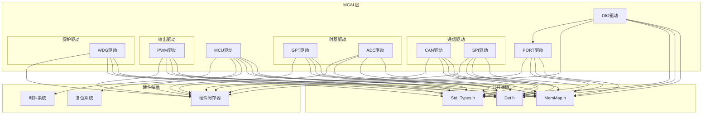

**图表来源**
- [Mcu.h:19-21](file://src/bsw/mcal/mcu/include/Mcu.h#L19-L21)
- [Dio.h:20-21](file://src/bsw/mcal/dio/include/Dio.h#L20-L21)
- [Can.h:19-20](file://src/bsw/mcal/can/include/Can.h#L19-L20)
- [Spi.h:19-20](file://src/bsw/mcal/spi/include/Spi.h#L19-L20)
- [Gpt.h:19-20](file://src/bsw/mcal/gpt/include/Gpt.h#L19-L20)
- [Port.h:21-22](file://src/bsw/mcal/port/include/Port.h#L21-L22)
- [Pwm.h:19-20](file://src/bsw/mcal/pwm/include/Pwm.h#L19-L20)
- [Adc.h:19-20](file://src/bsw/mcal/adc/include/Adc.h#L19-L20)
- [Wdg.h:19-20](file://src/bsw/mcal/wdg/include/Wdg.h#L19-L20)

### 错误处理机制

所有MCAL驱动模块都集成了AUTOSAR标准的错误检测和报告机制：

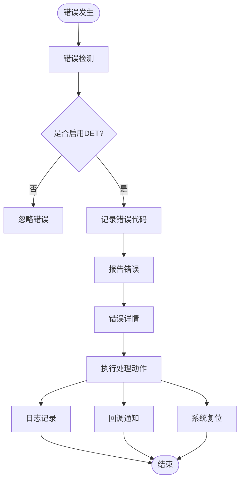

**图表来源**
- [Mcu.h:45-52](file://src/bsw/mcal/mcu/include/Mcu.h#L45-L52)
- [Dio.h:45-49](file://src/bsw/mcal/dio/include/Dio.h#L45-L49)
- [Can.h:61-71](file://src/bsw/mcal/can/include/Can.h#L61-L71)

## 性能考虑

MCAL硬件抽象层在设计时充分考虑了性能优化和资源利用效率：

### 内存优化策略

1. **配置驱动优化**：通过配置文件减少编译时代码膨胀
2. **内存映射管理**：使用标准的MemMap.h确保正确的内存布局
3. **静态分配**：大部分配置数据使用静态分配，减少运行时开销

### 时序优化

1. **零拷贝传输**：SPI驱动支持外部缓冲区，避免不必要的数据复制
2. **批量操作**：Dio驱动支持端口级操作，提高I/O效率
3. **中断优化**：各驱动模块都支持中断模式，减少CPU占用

### 功耗优化

1. **多模式支持**：MCU驱动支持多种低功耗模式
2. **智能唤醒**：GPT和ADC驱动支持唤醒功能
3. **动态时钟**：支持时钟分频和节流

## 故障排除指南

### 常见问题诊断

**MCU初始化失败**
- 检查时钟配置参数是否正确
- 验证PLL设置是否合理
- 确认复位寄存器状态

**Dio操作异常**
- 验证端口配置是否正确
- 检查引脚模式设置
- 确认方向配置是否匹配

**Can通信错误**
- 检查波特率配置
- 验证硬件对象配置
- 确认控制器状态

**Spi传输失败**
- 检查时钟极性和相位设置
- 验证CS引脚配置
- 确认缓冲区大小

**章节来源**
- [Mcu.h:45-52](file://src/bsw/mcal/mcu/include/Mcu.h#L45-L52)
- [Dio.h:45-49](file://src/bsw/mcal/dio/include/Dio.h#L45-L49)
- [Can.h:61-71](file://src/bsw/mcal/can/include/Can.h#L61-L71)
- [Spi.h:65-78](file://src/bsw/mcal/spi/include/Spi.h#L65-L78)

### 调试建议

1. **启用DET**：确保错误检测功能开启以便及时发现问题
2. **使用版本信息**：通过GetVersionInfo检查驱动版本兼容性
3. **监控状态**：定期检查各驱动模块的状态和配置
4. **日志记录**：建立完善的错误日志记录机制

## 结论

MCAL硬件抽象层为AUTOSAR架构提供了完整的硬件抽象解决方案。通过9个核心驱动模块的协同工作，实现了对微控制器各种外设的统一管理和高效控制。

本实现的主要优势包括：

1. **标准化接口**：完全符合AUTOSAR标准，确保了良好的可移植性
2. **模块化设计**：清晰的职责分离和接口定义
3. **配置灵活**：通过配置文件支持多种硬件平台
4. **错误处理**：完善的错误检测和报告机制
5. **性能优化**：针对实时应用进行了专门的性能优化

未来可以考虑的改进方向：

1. **扩展更多硬件支持**：增加对新硬件平台的支持
2. **增强调试功能**：提供更丰富的调试和诊断工具
3. **优化内存使用**：进一步减少内存占用
4. **提升安全性**：增加更多的安全防护机制