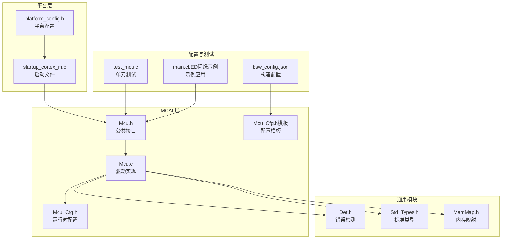
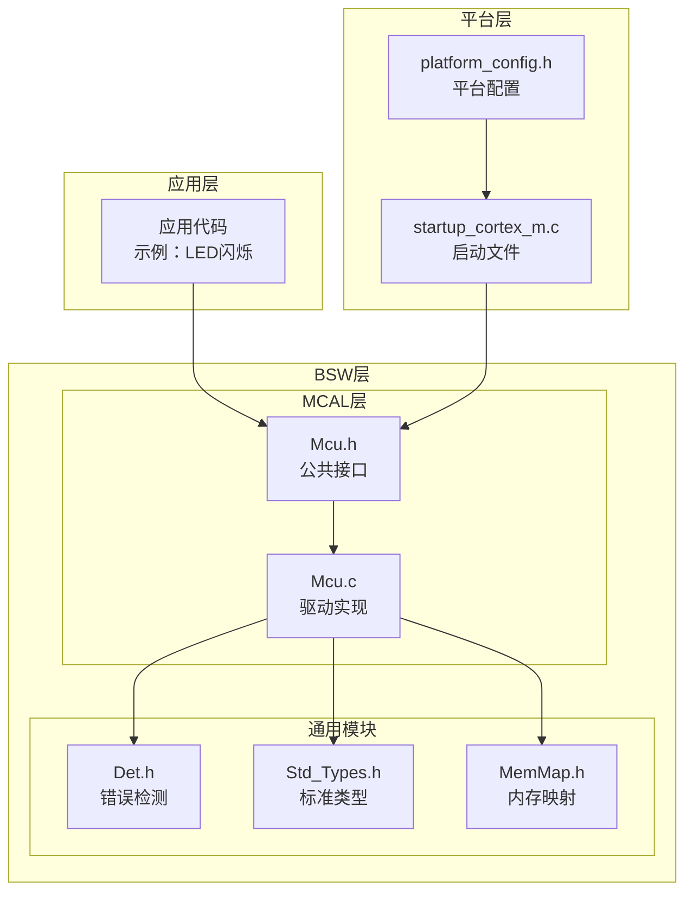
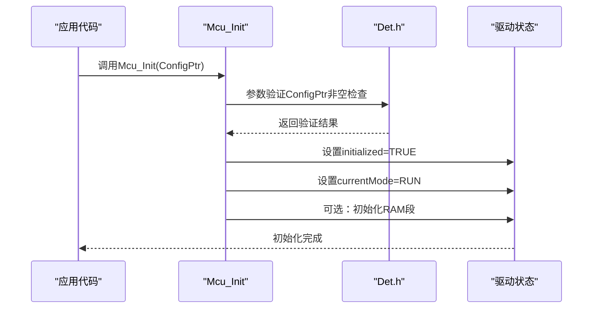
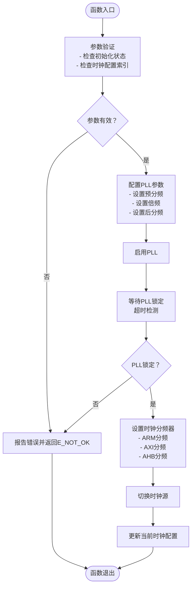
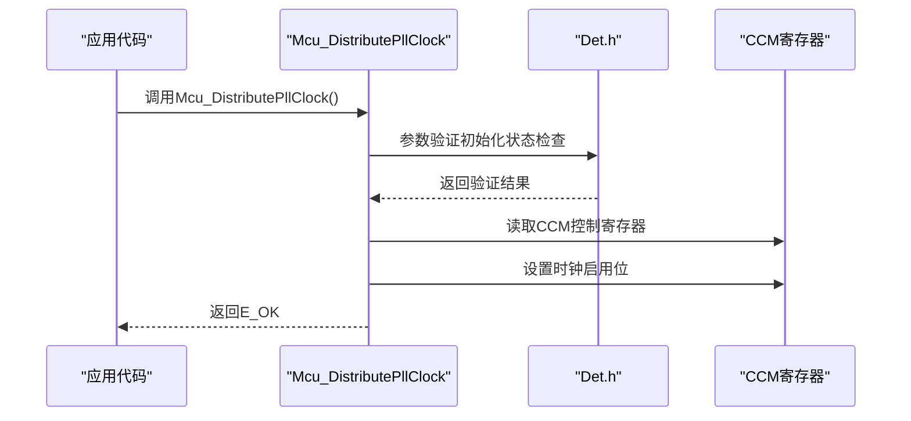
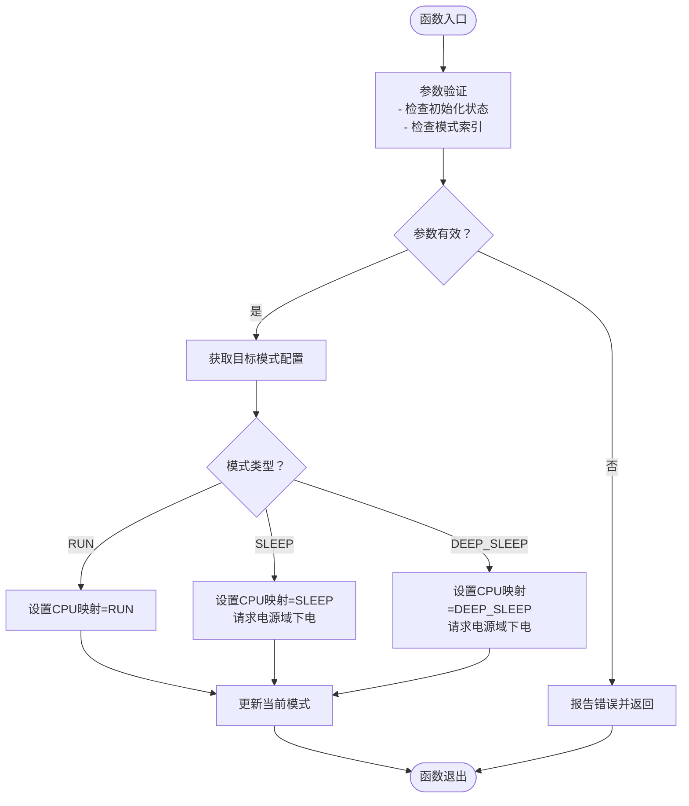
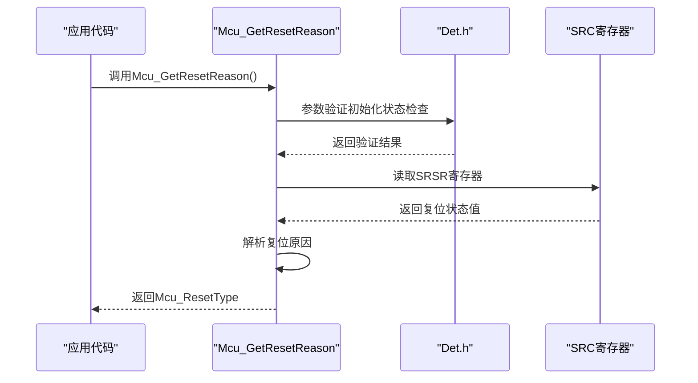
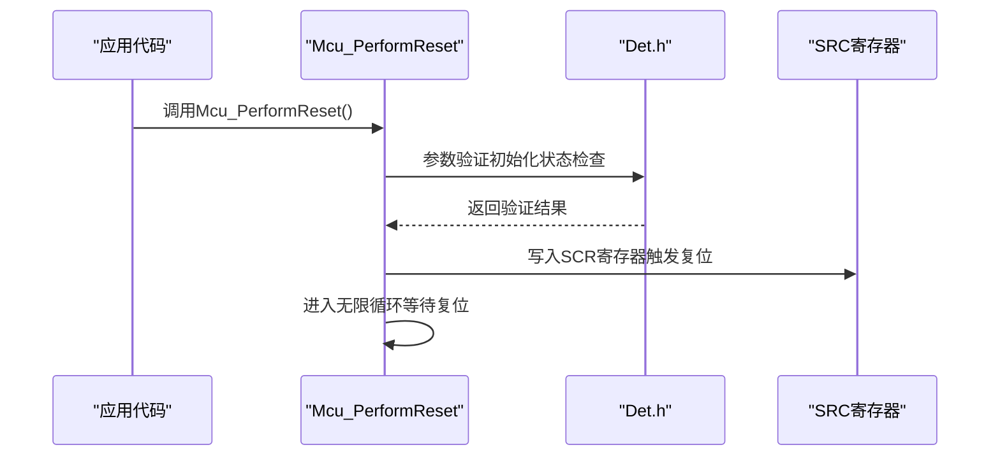
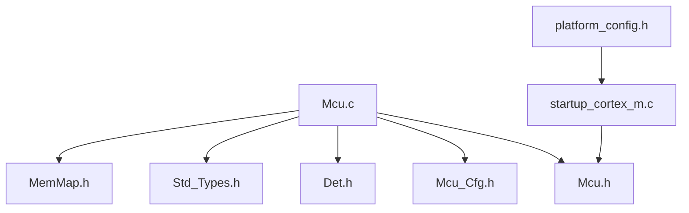
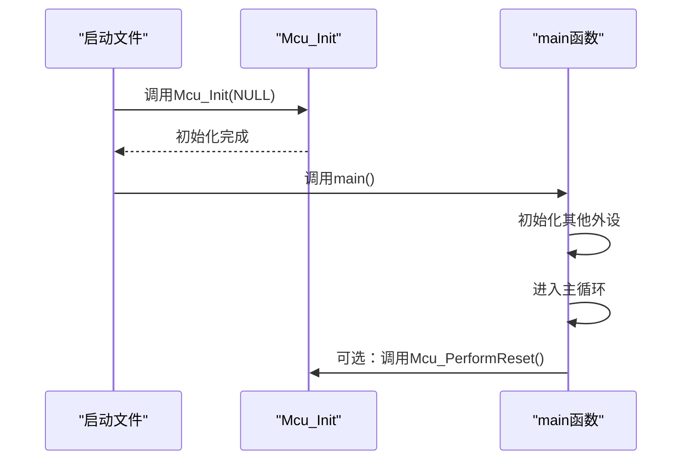

# Mcu微控制器驱动

<cite>
**本文档引用的文件**
- [Mcu.h](file://src/bsw/mcal/mcu/include/Mcu.h)
- [Mcu.c](file://src/bsw/mcal/mcu/src/Mcu.c)
- [Mcu_Cfg.h](file://src/bsw/mcal/mcu/include/Mcu_Cfg.h)
- [Mcu_Cfg.h（模板）](file://src/bsw/config/templates/Mcu_Cfg.h)
- [Det.h](file://src/bsw/common/Det.h)
- [Std_Types.h](file://src/bsw/common/Std_Types.h)
- [MemMap.h](file://src/bsw/general/inc/MemMap.h)
- [platform_config.h](file://platform/cortex-m/platform_config.h)
- [startup_cortex_m.c](file://platform/cortex-m/startup_cortex_m.c)
- [bsw_config.json](file://config/bsw_config.json)
- [test_mcu.c](file://tests/unit/test_mcu.c)
- [main.c（LED闪烁示例）](file://examples/led_blink/main.c)
</cite>

## 目录
1. [简介](#简介)
2. [项目结构](#项目结构)
3. [核心组件](#核心组件)
4. [架构概览](#架构概览)
5. [详细组件分析](#详细组件分析)
6. [依赖关系分析](#依赖关系分析)
7. [性能考虑](#性能考虑)
8. [故障排除指南](#故障排除指南)
9. [结论](#结论)
10. [附录](#附录)

## 简介
本文件为Mcu微控制器驱动模块的详细技术文档，涵盖微控制器初始化、时钟配置、复位管理和低功耗模式控制功能。文档重点说明以下核心API：Mcu_Init()初始化流程、Mcu_InitClock()时钟系统配置、Mcu_DistributePllClock() PLL时钟分发、Mcu_SetMode()模式切换、Mcu_GetResetReason()复位原因获取和Mcu_PerformReset()系统复位等。同时包含配置参数说明、状态管理机制、错误处理策略和版本信息获取，提供具体使用示例和最佳实践，解释PLL锁定机制、时钟频率配置和电源管理模式。

## 项目结构
Mcu驱动位于BSW（基础软件）层的MCAL（微控制器抽象层），采用AutoSAR标准实现，支持多种平台。核心目录与文件如下：
- 接口头文件：src/bsw/mcal/mcu/include/Mcu.h
- 实现文件：src/bsw/mcal/mcu/src/Mcu.c
- 配置头文件：src/bsw/mcal/mcu/include/Mcu_Cfg.h
- 配置模板：src/bsw/config/templates/Mcu_Cfg.h
- 错误检测模块：src/bsw/common/Det.h
- 标准类型定义：src/bsw/common/Std_Types.h
- 内存映射宏：src/bsw/general/inc/MemMap.h
- 平台配置：platform/cortex-m/platform_config.h
- 启动文件：platform/cortex-m/startup_cortex_m.c
- 构建配置：config/bsw_config.json
- 单元测试：tests/unit/test_mcu.c
- 示例应用：examples/led_blink/main.c

**图表来源**
- [Mcu.h:1-239](file://src/bsw/mcal/mcu/include/Mcu.h#L1-L239)
- [Mcu.c:1-547](file://src/bsw/mcal/mcu/src/Mcu.c#L1-L547)
- [Mcu_Cfg.h:1-82](file://src/bsw/mcal/mcu/include/Mcu_Cfg.h#L1-L82)
- [Mcu_Cfg.h（模板）:1-69](file://src/bsw/config/templates/Mcu_Cfg.h#L1-L69)
- [Det.h:1-76](file://src/bsw/common/Det.h#L1-L76)
- [Std_Types.h:1-117](file://src/bsw/common/Std_Types.h#L1-L117)
- [MemMap.h:29-79](file://src/bsw/general/inc/MemMap.h#L29-L79)
- [platform_config.h:1-307](file://platform/cortex-m/platform_config.h#L1-L307)
- [startup_cortex_m.c:1-267](file://platform/cortex-m/startup_cortex_m.c#L1-L267)
- [bsw_config.json:1-21](file://config/bsw_config.json#L1-L21)
- [test_mcu.c:1-209](file://tests/unit/test_mcu.c#L1-L209)
- [main.c（LED闪烁示例）:1-100](file://examples/led_blink/main.c#L1-L100)

**章节来源**
- [Mcu.h:1-239](file://src/bsw/mcal/mcu/include/Mcu.h#L1-L239)
- [Mcu.c:1-547](file://src/bsw/mcal/mcu/src/Mcu.c#L1-L547)
- [Mcu_Cfg.h:1-82](file://src/bsw/mcal/mcu/include/Mcu_Cfg.h#L1-L82)
- [Mcu_Cfg.h（模板）:1-69](file://src/bsw/config/templates/Mcu_Cfg.h#L1-L69)
- [Det.h:1-76](file://src/bsw/common/Det.h#L1-L76)
- [Std_Types.h:1-117](file://src/bsw/common/Std_Types.h#L1-L117)
- [MemMap.h:29-79](file://src/bsw/general/inc/MemMap.h#L29-L79)
- [platform_config.h:1-307](file://platform/cortex-m/platform_config.h#L1-L307)
- [startup_cortex_m.c:1-267](file://platform/cortex-m/startup_cortex_m.c#L1-L267)
- [bsw_config.json:1-21](file://config/bsw_config.json#L1-L21)
- [test_mcu.c:1-209](file://tests/unit/test_mcu.c#L1-L209)
- [main.c（LED闪烁示例）:1-100](file://examples/led_blink/main.c#L1-L100)

## 核心组件
本节概述Mcu驱动的核心数据结构、枚举类型和API接口，包括状态管理、错误码、版本信息等。

- 状态类型（Mcu_StateType）
  - MCU_UNINIT：未初始化
  - MCU_CLOCK_UNINIT：时钟未初始化
  - MCU_CLOCK_INITIALIZED：时钟已初始化
  - MCU_MODE_NORMAL：正常模式
  - MCU_MODE_SLEEP：睡眠模式
  - MCU_MODE_DEEP_SLEEP：深度睡眠模式

- PLL状态类型（Mcu_PllStatusType）
  - MCU_PLL_STATUS_UNDEFINED：未定义
  - MCU_PLL_STATUS_LOCKED：已锁定
  - MCU_PLL_STATUS_UNLOCKED：未锁定

- 复位原因类型（Mcu_ResetType）
  - MCU_RESET_UNDEFINED：未定义
  - MCU_RESET_POWER_ON：上电复位
  - MCU_RESET_WATCHDOG：看门狗复位
  - MCU_RESET_SOFTWARE：软件复位
  - MCU_RESET_EXTERNAL：外部复位
  - MCU_RESET_BROWN_OUT：欠压复位
  - MCU_RESET_LOCKUP：锁死复位

- 配置类型（Mcu_ConfigType）
  - ClockSetting：时钟配置设置
  - ClockFrequency：目标时钟频率（Hz）
  - PllMultiplier：PLL倍频系数
  - PllDivider：PLL分频系数
  - PllEnabled：PLL使能标志

- 版本信息类型（Std_VersionInfoType）
  - vendorID：供应商ID
  - moduleID：模块ID
  - sw_major_version：软件主版本
  - sw_minor_version：软件次版本
  - sw_patch_version：软件补丁版本

- 错误码
  - MCU_E_PARAM_CONFIG：配置参数错误
  - MCU_E_PARAM_CLOCK：时钟参数错误
  - MCU_E_PARAM_MODE：模式参数错误
  - MCU_E_PLL_NOT_LOCKED：PLL未锁定
  - MCU_E_UNINIT：模块未初始化
  - MCU_E_PARAM_POINTER：指针参数错误
  - MCU_E_INIT_FAILED：初始化失败

**章节来源**
- [Mcu.h:67-92](file://src/bsw/mcal/mcu/include/Mcu.h#L67-L92)
- [Mcu.h:95-110](file://src/bsw/mcal/mcu/include/Mcu.h#L95-L110)
- [Mcu.h:45-52](file://src/bsw/mcal/mcu/include/Mcu.h#L45-L52)

## 架构概览
Mcu驱动采用分层架构，位于MCAL层，向上提供AutoSAR标准接口，向下直接操作硬件寄存器。主要架构组件包括：
- 接口层：Mcu.h定义公共API
- 实现层：Mcu.c实现具体功能
- 配置层：Mcu_Cfg.h提供编译期和运行期配置
- 平台层：platform_config.h和startup_cortex_m.c提供平台特定配置
- 错误检测：Det.h提供开发错误追踪
- 标准类型：Std_Types.h提供基础数据类型

**图表来源**
- [Mcu.h:134-230](file://src/bsw/mcal/mcu/include/Mcu.h#L134-L230)
- [Mcu.c:252-488](file://src/bsw/mcal/mcu/src/Mcu.c#L252-L488)
- [Det.h:51-70](file://src/bsw/common/Det.h#L51-L70)
- [Std_Types.h:40-80](file://src/bsw/common/Std_Types.h#L40-L80)
- [MemMap.h:40-79](file://src/bsw/general/inc/MemMap.h#L40-L79)
- [platform_config.h:1-307](file://platform/cortex-m/platform_config.h#L1-L307)
- [startup_cortex_m.c:243-266](file://platform/cortex-m/startup_cortex_m.c#L243-L266)

## 详细组件分析

### Mcu_Init() 初始化流程
Mcu_Init()负责驱动模块的初始化，包括参数验证、状态设置和可选的RAM段初始化。

**图表来源**
- [Mcu.c:252-280](file://src/bsw/mcal/mcu/src/Mcu.c#L252-L280)
- [Det.h:59-59](file://src/bsw/common/Det.h#L59-L59)

**章节来源**
- [Mcu.c:252-280](file://src/bsw/mcal/mcu/src/Mcu.c#L252-L280)
- [Mcu.h:134-148](file://src/bsw/mcal/mcu/include/Mcu.h#L134-L148)

### Mcu_InitClock() 时钟系统配置
Mcu_InitClock()用于初始化时钟系统，支持多配置选择和PLL配置。

**图表来源**
- [Mcu.c:285-310](file://src/bsw/mcal/mcu/src/Mcu.c#L285-L310)
- [Mcu.c:89-124](file://src/bsw/mcal/mcu/src/Mcu.c#L89-L124)
- [Mcu.c:129-165](file://src/bsw/mcal/mcu/src/Mcu.c#L129-L165)
- [Mcu.c:170-186](file://src/bsw/mcal/mcu/src/Mcu.c#L170-L186)
- [Mcu.c:191-212](file://src/bsw/mcal/mcu/src/Mcu.c#L191-L212)

**章节来源**
- [Mcu.c:285-310](file://src/bsw/mcal/mcu/src/Mcu.c#L285-L310)
- [Mcu.h:150-163](file://src/bsw/mcal/mcu/include/Mcu.h#L150-L163)

### Mcu_DistributePllClock() PLL时钟分发
该函数用于启用PLL时钟分发到系统总线。

**图表来源**
- [Mcu.c:315-333](file://src/bsw/mcal/mcu/src/Mcu.c#L315-L333)
- [Mcu.c:33-43](file://src/bsw/mcal/mcu/src/Mcu.c#L33-L43)

**章节来源**
- [Mcu.c:315-333](file://src/bsw/mcal/mcu/src/Mcu.c#L315-L333)
- [Mcu.h:165-175](file://src/bsw/mcal/mcu/include/Mcu.h#L165-L175)

### Mcu_SetMode() 模式切换
支持正常模式、睡眠模式和深度睡眠模式的切换。

**图表来源**
- [Mcu.c:367-406](file://src/bsw/mcal/mcu/src/Mcu.c#L367-L406)
- [Mcu.c:29-43](file://src/bsw/mcal/mcu/src/Mcu.c#L29-L43)

**章节来源**
- [Mcu.c:367-406](file://src/bsw/mcal/mcu/src/Mcu.c#L367-L406)
- [Mcu.h:184-194](file://src/bsw/mcal/mcu/include/Mcu.h#L184-L194)

### Mcu_GetResetReason() 和 Mcu_GetResetRawValue()
用于获取复位原因和复位寄存器原始值。

**图表来源**
- [Mcu.c:411-425](file://src/bsw/mcal/mcu/src/Mcu.c#L411-L425)
- [Mcu.c:217-241](file://src/bsw/mcal/mcu/src/Mcu.c#L217-L241)
- [Mcu.c:40-43](file://src/bsw/mcal/mcu/src/Mcu.c#L40-L43)

**章节来源**
- [Mcu.c:411-425](file://src/bsw/mcal/mcu/src/Mcu.c#L411-L425)
- [Mcu.c:430-444](file://src/bsw/mcal/mcu/src/Mcu.c#L430-L444)
- [Mcu.h:196-210](file://src/bsw/mcal/mcu/include/Mcu.h#L196-L210)

### Mcu_PerformReset() 系统复位
执行软件复位，函数不会返回。

**图表来源**
- [Mcu.c:449-467](file://src/bsw/mcal/mcu/src/Mcu.c#L449-L467)
- [Mcu.c:40-43](file://src/bsw/mcal/mcu/src/Mcu.c#L40-L43)

**章节来源**
- [Mcu.c:449-467](file://src/bsw/mcal/mcu/src/Mcu.c#L449-L467)
- [Mcu.h:212-220](file://src/bsw/mcal/mcu/include/Mcu.h#L212-L220)

### 配置参数说明
Mcu驱动支持多种配置选项，可通过Mcu_Cfg.h进行配置：

- 开关配置
  - MCU_DEV_ERROR_DETECT：开发错误检测开关
  - MCU_VERSION_INFO_API：版本信息API开关
  - MCU_PERFORM_RESET_API：系统复位API开关
  - MCU_INIT_CLOCK_API：时钟初始化API开关
  - MCU_NO_PLL：禁用PLL开关

- 时钟频率配置（Hz）
  - MCU_XTAL_FREQUENCY：晶振频率
  - MCU_SYSTEM_CLOCK_HZ：系统时钟频率
  - MCU_BUS_CLOCK_HZ：总线时钟频率
  - MCU_FLASH_CLOCK_HZ：闪存时钟频率

- 模式定义
  - MCU_MODE_NORMAL：正常模式
  - MCU_MODE_SLEEP：睡眠模式
  - MCU_MODE_DEEP_SLEEP：深度睡眠模式
  - MCU_MODE_RESET：复位模式

- 复位原因定义
  - MCU_RESET_UNDEFINED：未定义
  - MCU_RESET_POWER_ON：上电复位
  - MCU_RESET_WATCHDOG：看门狗复位
  - MCU_RESET_SW：软件复位
  - MCU_RESET_EXT：外部复位

**章节来源**
- [Mcu_Cfg.h:15-80](file://src/bsw/mcal/mcu/include/Mcu_Cfg.h#L15-L80)
- [Mcu_Cfg.h（模板）:20-67](file://src/bsw/config/templates/Mcu_Cfg.h#L20-L67)

### 状态管理机制
驱动内部维护一个状态结构体，跟踪初始化状态、当前时钟配置和当前模式：

- initialized：驱动是否已初始化
- currentClock：当前时钟配置索引
- currentMode：当前运行模式
- ramState：RAM状态（可选）

状态转换遵循严格的顺序：UNINIT → CLOCK_UNINIT → CLOCK_INITIALIZED → NORMAL/SLEEP/DEEP_SLEEP。

**章节来源**
- [Mcu.c:51-74](file://src/bsw/mcal/mcu/src/Mcu.c#L51-L74)
- [Mcu.c:252-280](file://src/bsw/mcal/mcu/src/Mcu.c#L252-L280)

### 错误处理策略
Mcu驱动采用开发错误检测（DevErrorDetect）机制，所有公共API都包含参数验证：
- 空指针检查：ConfigPtr、versioninfo等
- 初始化状态检查：确保模块已正确初始化
- 参数范围检查：时钟配置索引、模式索引等
- PLL状态检查：在需要PLL锁定的操作前验证状态

当检测到错误时，通过Det_ReportError上报错误码，避免系统崩溃。

**章节来源**
- [Mcu.c:254-264](file://src/bsw/mcal/mcu/src/Mcu.c#L254-L264)
- [Mcu.c:289-299](file://src/bsw/mcal/mcu/src/Mcu.c#L289-L299)
- [Mcu.c:317-327](file://src/bsw/mcal/mcu/src/Mcu.c#L317-L327)
- [Det.h:59-59](file://src/bsw/common/Det.h#L59-L59)

### 版本信息获取
Mcu_GetVersionInfo()提供模块版本信息，包含供应商ID、模块ID和软件版本号。

**章节来源**
- [Mcu.c:472-488](file://src/bsw/mcal/mcu/src/Mcu.c#L472-L488)
- [Mcu.h:222-229](file://src/bsw/mcal/mcu/include/Mcu.h#L222-L229)

## 依赖关系分析
Mcu驱动的依赖关系清晰明确，遵循AutoSAR分层架构原则。

**图表来源**
- [Mcu.c:17-21](file://src/bsw/mcal/mcu/src/Mcu.c#L17-L21)
- [Mcu.h:19-20](file://src/bsw/mcal/mcu/include/Mcu.h#L19-L20)
- [Mcu_Cfg.h:1-82](file://src/bsw/mcal/mcu/include/Mcu_Cfg.h#L1-L82)
- [Det.h:17-17](file://src/bsw/common/Det.h#L17-L17)
- [Std_Types.h:17-18](file://src/bsw/common/Std_Types.h#L17-L18)
- [MemMap.h:40-41](file://src/bsw/general/inc/MemMap.h#L40-L41)
- [platform_config.h:1-307](file://platform/cortex-m/platform_config.h#L1-L307)
- [startup_cortex_m.c:19-19](file://platform/cortex-m/startup_cortex_m.c#L19-L19)

**章节来源**
- [Mcu.c:17-21](file://src/bsw/mcal/mcu/src/Mcu.c#L17-L21)
- [Mcu.h:19-20](file://src/bsw/mcal/mcu/include/Mcu.h#L19-L20)

## 性能考虑
- 超时机制：PLL锁定和时钟切换均设置了超时保护（默认10ms），防止系统挂起
- 寄存器访问优化：使用宏封装寄存器读写，减少重复代码
- 条件编译：通过配置开关控制功能启用，减少不必要的代码开销
- 内存映射：合理使用MemMap.h进行内存段划分，优化内存使用

## 故障排除指南
常见问题及解决方案：

1. **初始化失败**
   - 检查ConfigPtr是否为NULL
   - 确认模块未重复初始化
   - 验证配置参数的有效性

2. **PLL未锁定**
   - 检查输入时钟频率和配置参数
   - 验证PLL配置寄存器设置
   - 查看超时日志和错误码

3. **时钟切换失败**
   - 确认PLL已正确锁定
   - 检查时钟分频器配置
   - 验证时钟源选择

4. **模式切换异常**
   - 检查目标模式配置
   - 确认电源域状态
   - 验证GPIO配置

**章节来源**
- [test_mcu.c:36-44](file://tests/unit/test_mcu.c#L36-L44)
- [test_mcu.c:85-96](file://tests/unit/test_mcu.c#L85-L96)
- [test_mcu.c:98-112](file://tests/unit/test_mcu.c#L98-L112)

## 结论
Mcu微控制器驱动模块提供了完整的微控制器管理功能，包括初始化、时钟配置、复位管理和低功耗模式控制。模块采用AutoSAR标准设计，具有良好的可移植性和可扩展性。通过合理的错误处理机制和超时保护，确保了系统的稳定性和可靠性。建议在实际应用中：
- 仔细配置时钟参数以满足系统需求
- 启用适当的错误检测功能
- 在低功耗场景下合理使用睡眠模式
- 定期检查PLL锁定状态

## 附录

### 使用示例
LED闪烁示例展示了Mcu驱动的基本使用方法：

**图表来源**
- [startup_cortex_m.c:258-262](file://platform/cortex-m/startup_cortex_m.c#L258-L262)
- [main.c（LED闪烁示例）:61-96](file://examples/led_blink/main.c#L61-L96)

**章节来源**
- [startup_cortex_m.c:258-262](file://platform/cortex-m/startup_cortex_m.c#L258-L262)
- [main.c（LED闪烁示例）:61-96](file://examples/led_blink/main.c#L61-L96)

### 最佳实践
1. **初始化顺序**：先调用Mcu_Init()，再初始化其他外设
2. **参数验证**：始终检查API返回值和错误码
3. **时钟配置**：根据应用需求合理设置时钟频率
4. **低功耗设计**：在空闲时使用睡眠模式降低功耗
5. **错误处理**：启用DevErrorDetect功能进行调试
6. **版本管理**：定期更新驱动版本以获得最新功能和修复