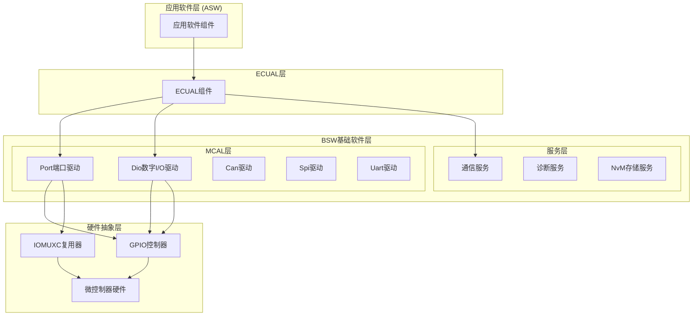
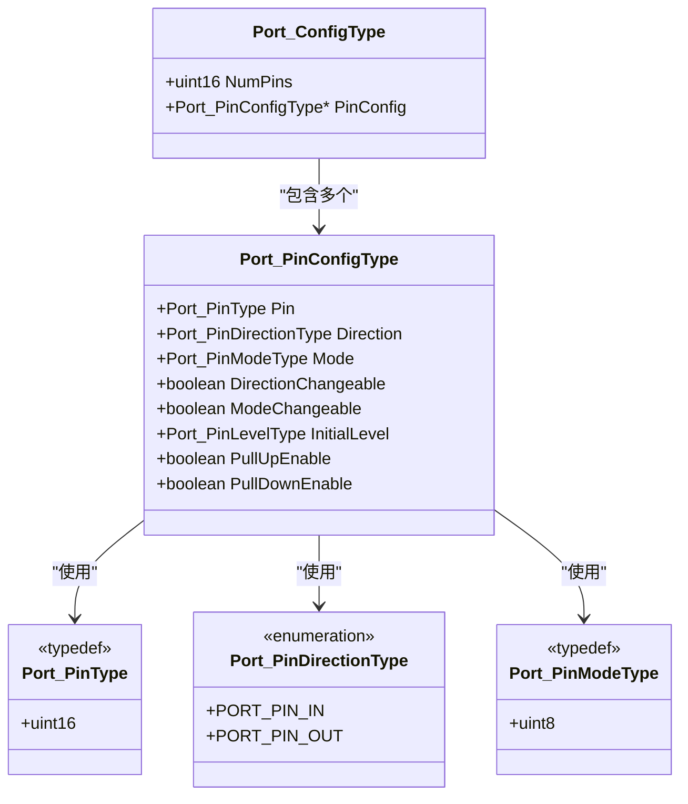
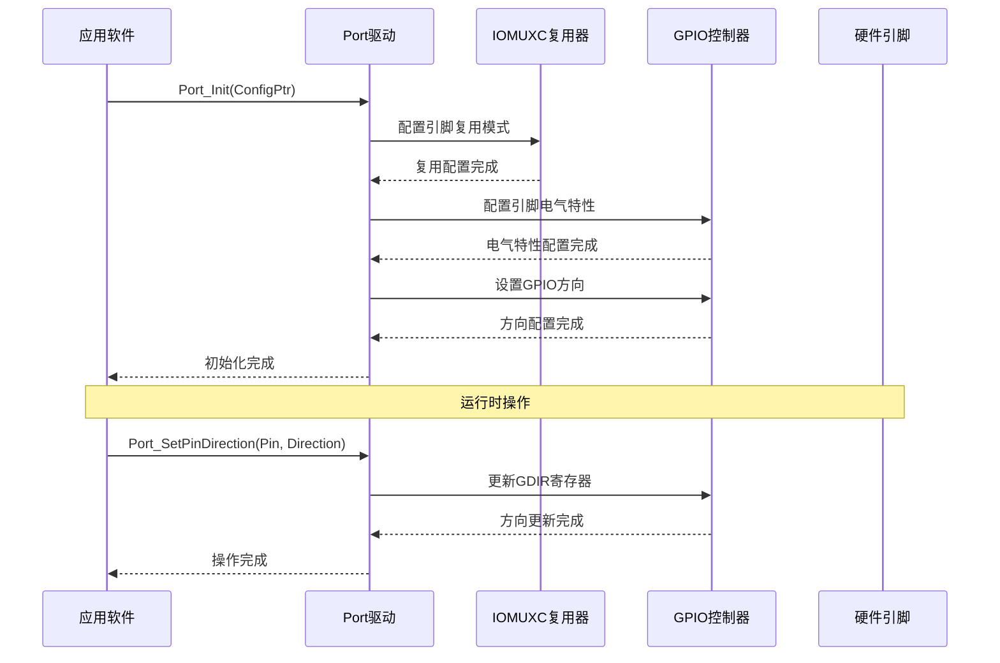
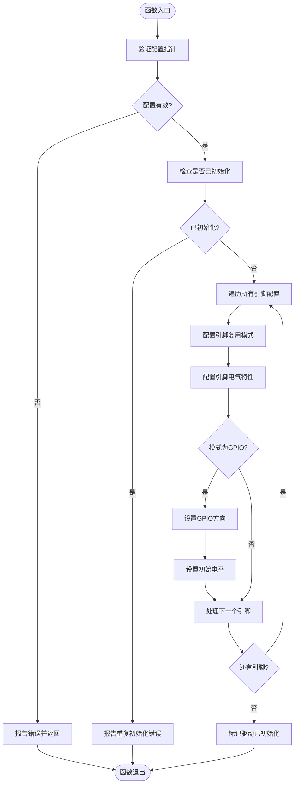
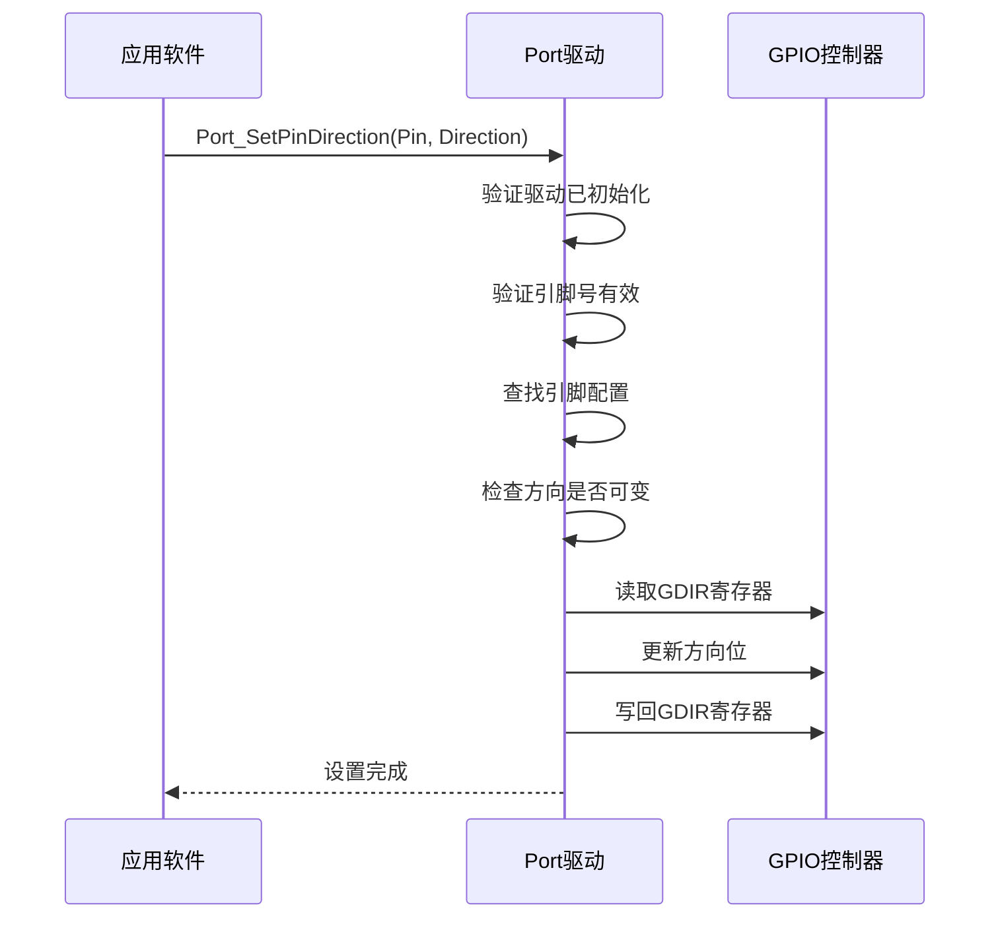
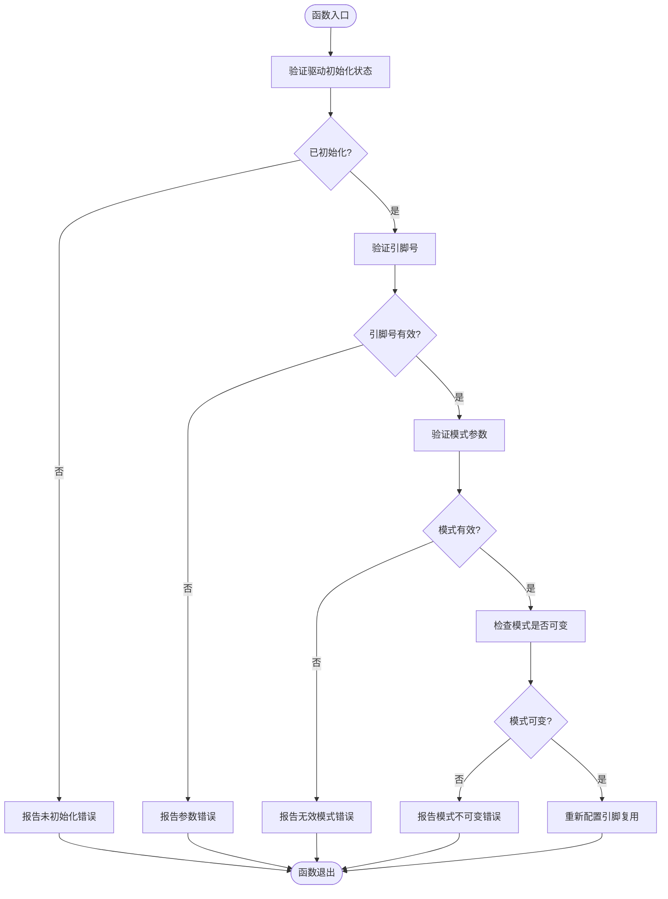
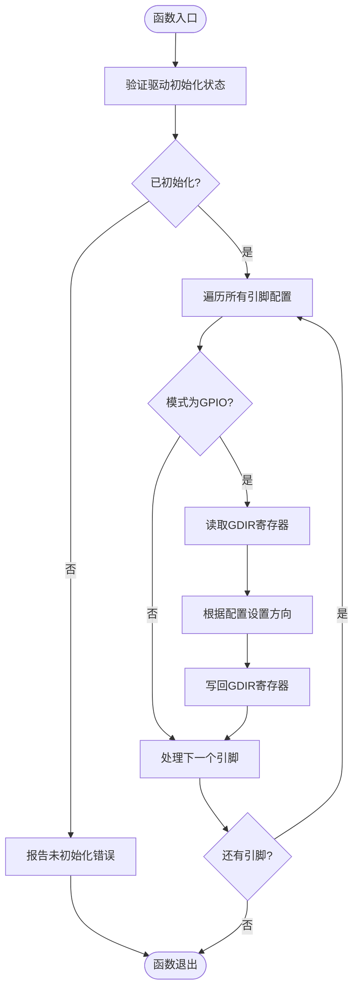
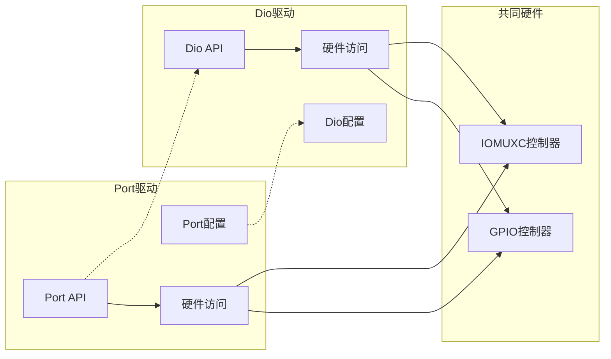
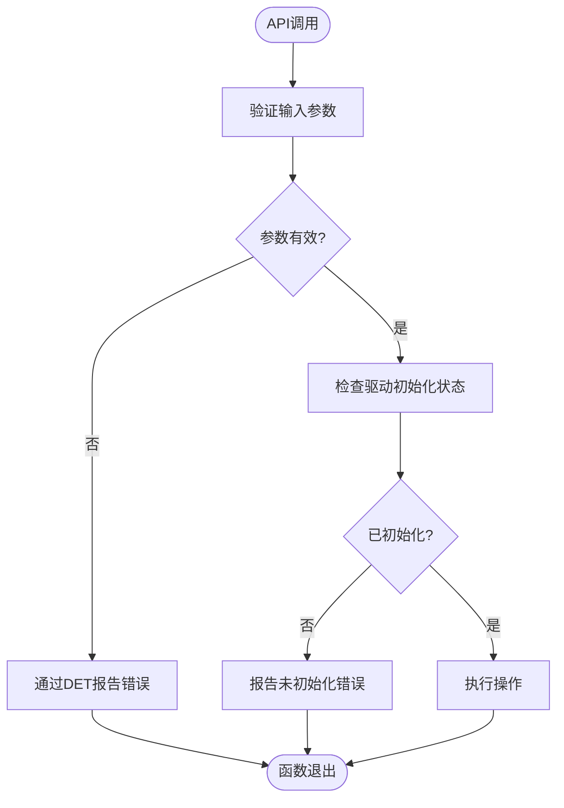

# Port端口驱动

<cite>
**本文档引用的文件**
- [Port.h](file://src/bsw/mcal/port/include/Port.h)
- [Port.c](file://src/bsw/mcal/port/src/Port.c)
- [Port_Cfg.h](file://src/bsw/mcal/port/include/Port_Cfg.h)
- [Port_Cfg.h](file://src/bsw/config/templates/Port_Cfg.h)
- [Dio.h](file://src/bsw/mcal/dio/include/Dio.h)
- [Dio.c](file://src/bsw/mcal/dio/src/Dio.c)
- [main.c](file://examples/led_blink/main.c)
- [EcuM_test.c](file://tests/integration/bsw/EcuM_test.c)
</cite>

## 目录
1. [简介](#简介)
2. [项目结构](#项目结构)
3. [核心组件](#核心组件)
4. [架构概览](#架构概览)
5. [详细组件分析](#详细组件分析)
6. [依赖关系分析](#依赖关系分析)
7. [性能考虑](#性能考虑)
8. [故障排除指南](#故障排除指南)
9. [结论](#结论)

## 简介

Port端口驱动模块是AUTOSAR MCAL（微控制器抽象层）中的关键组件，负责管理微控制器的端口引脚配置和控制。该模块提供了对GPIO引脚的初始化、方向设置、模式配置以及触发刷新等功能，为上层软件组件提供了统一的硬件抽象接口。

Port驱动模块基于NXP i.MX8M Mini微控制器平台实现，支持多种外设模式（GPIO、CAN、SPI、UART、I2C、PWM、ADC、以太网等），并通过IOMUXC（输入输出复用器）和GPIO控制器实现引脚功能选择和电气特性配置。

## 项目结构

Port端口驱动模块位于AUTOSAR BSW（基础软件）的MCAL层中，采用标准的AUTOSAR分层架构设计：

**图表来源**
- [Port.h:1-183](file://src/bsw/mcal/port/include/Port.h#L1-L183)
- [Dio.h:1-195](file://src/bsw/mcal/dio/include/Dio.h#L1-L195)

**章节来源**
- [Port.h:10-13](file://src/bsw/mcal/port/include/Port.h#L10-L13)
- [Port.c:1-12](file://src/bsw/mcal/port/src/Port.c#L1-L12)

## 核心组件

### 端口配置类型

Port驱动定义了完整的配置数据结构，用于描述端口引脚的电气特性和功能配置：

**图表来源**
- [Port.h:73-89](file://src/bsw/mcal/port/include/Port.h#L73-L89)

### 硬件寄存器映射

Port驱动直接操作硬件寄存器来实现引脚配置：

| 寄存器名称 | 地址偏移 | 功能描述 |
|------------|----------|----------|
| IOMUXC_SW_MUX_CTL_PAD | 0x0000 | 引脚复用控制寄存器 |
| IOMUXC_SW_PAD_CTL_PAD | 0x0204 | 引脚电气特性控制寄存器 |
| GPIO_DR | 0x00 | 数据寄存器 |
| GPIO_GDIR | 0x04 | GPIO方向寄存器 |
| GPIO_PSR | 0x08 | 引脚状态寄存器 |
| GPIO_ICR1 | 0x0C | 中断配置寄存器1 |
| GPIO_ICR2 | 0x10 | 中断配置寄存器2 |
| GPIO_IMR | 0x14 | 中断屏蔽寄存器 |
| GPIO_ISR | 0x18 | 中断状态寄存器 |
| GPIO_EDGE_SEL | 0x1C | 边沿选择寄存器 |

**章节来源**
- [Port.c:24-41](file://src/bsw/mcal/port/src/Port.c#L24-L41)

## 架构概览

Port端口驱动模块采用分层架构设计，实现了完整的硬件抽象：

**图表来源**
- [Port.c:252-306](file://src/bsw/mcal/port/src/Port.c#L252-L306)
- [Port.c:312-356](file://src/bsw/mcal/port/src/Port.c#L312-L356)

## 详细组件分析

### Port_Init() - 端口初始化函数

Port_Init()是端口驱动的核心初始化函数，负责完成所有引脚的配置过程：

**图表来源**
- [Port.c:252-306](file://src/bsw/mcal/port/src/Port.c#L252-L306)

#### 初始化流程详解

1. **配置验证**：检查传入的配置指针是否有效
2. **状态检查**：确保驱动未被重复初始化
3. **引脚遍历**：逐个处理配置数组中的引脚
4. **复用配置**：根据模式设置IOMUXC寄存器
5. **电气配置**：配置驱动强度、上下拉电阻等特性
6. **GPIO方向**：对于GPIO模式设置输入/输出方向
7. **初始电平**：设置输出引脚的初始逻辑电平

**章节来源**
- [Port.c:252-306](file://src/bsw/mcal/port/src/Port.c#L252-L306)

### Port_SetPinDirection() - 引脚方向设置

Port_SetPinDirection()函数允许在运行时动态改变引脚的方向，但仅限于配置为可变的引脚：

**图表来源**
- [Port.c:312-356](file://src/bsw/mcal/port/src/Port.c#L312-L356)

#### 方向设置限制

- 仅适用于GPIO模式的引脚
- 只能设置为配置文件中声明为可变的方向
- 需要确保引脚对应的GPIO控制器存在

**章节来源**
- [Port.c:312-356](file://src/bsw/mcal/port/src/Port.c#L312-L356)

### Port_SetPinMode() - 引脚模式配置

Port_SetPinMode()函数允许在运行时更改引脚的工作模式：

**图表来源**
- [Port.c:419-456](file://src/bsw/mcal/port/src/Port.c#L419-L456)

#### 支持的引脚模式

| 模式编号 | 模式名称 | 描述 |
|----------|----------|------|
| 0 | GPIO | 通用数字I/O功能 |
| 1 | CAN | 控制器局域网络通信 |
| 2 | SPI | 同步串行外设接口 |
| 3 | UART | 通用异步收发传输器 |
| 4 | I2C | 两线式串行总线 |
| 5 | PWM | 脉冲宽度调制 |
| 6 | ADC | 模数转换器 |
| 7 | ETH | 以太网物理层 |
| 8 | USB | 通用串行总线 |
| 9 | FLEXIO | 灵活I/O接口 |
| 15 | DISABLED | 禁用模式 |

**章节来源**
- [Port_Cfg.h:42-52](file://src/bsw/mcal/port/include/Port_Cfg.h#L42-L52)

### Port_RefreshTriggers() - 触发刷新功能

虽然Port驱动中没有名为Port_RefreshTriggers()的具体函数，但Port_RefreshPortDirection()提供了类似的功能：

**图表来源**
- [Port.c:362-392](file://src/bsw/mcal/port/src/Port.c#L362-L392)

**章节来源**
- [Port.c:362-392](file://src/bsw/mcal/port/src/Port.c#L362-L392)

## 依赖关系分析

### 与Dio模块的关系

Port驱动与Dio驱动在硬件抽象层面紧密协作：

**图表来源**
- [Port.h:21-22](file://src/bsw/mcal/port/include/Port.h#L21-L22)
- [Dio.h:20-21](file://src/bsw/mcal/dio/include/Dio.h#L20-L21)

### 错误检测机制

Port驱动实现了完整的错误检测和报告机制：

**图表来源**
- [Port.c:254-264](file://src/bsw/mcal/port/src/Port.c#L254-L264)

**章节来源**
- [Port.h:44-50](file://src/bsw/mcal/port/include/Port.h#L44-L50)
- [Port.c:254-264](file://src/bsw/mcal/port/src/Port.c#L254-L264)

## 性能考虑

### 内存使用优化

Port驱动采用了内存效率的设计：

- **静态状态存储**：驱动状态存储在静态变量中，避免动态内存分配
- **编译时常量**：大量配置参数在编译时确定，减少运行时开销
- **寄存器直接访问**：通过宏定义直接访问硬件寄存器，避免函数调用开销

### 执行效率优化

- **批量配置**：Port_Init()一次性配置所有引脚，减少多次硬件访问
- **条件编译**：通过预处理器指令控制API可用性，避免不使用的代码
- **快速路径**：对于GPIO模式的引脚，直接操作寄存器而不进行额外检查

### 并发安全性

Port驱动在多任务环境中需要考虑以下安全问题：

- **原子操作**：GPIO寄存器访问应保证原子性
- **中断处理**：在修改引脚配置时可能需要禁用相关中断
- **状态一致性**：确保驱动状态与硬件状态保持一致

## 故障排除指南

### 常见错误代码及解决方案

| 错误代码 | 错误含义 | 可能原因 | 解决方案 |
|----------|----------|----------|----------|
| PORT_E_PARAM_PIN | 参数引脚号无效 | 引脚号超出范围 | 检查引脚定义常量 |
| PORT_E_DIRECTION_UNCHANGEABLE | 方向不可变 | 引脚配置不允许变更 | 修改配置文件中的DirectionChangeable标志 |
| PORT_E_PARAM_CONFIG | 配置指针为空 | 传入NULL指针 | 提供有效的配置结构体 |
| PORT_E_PARAM_INVALID_MODE | 无效的模式参数 | 模式值超出范围 | 使用预定义的模式常量 |
| PORT_E_MODE_UNCHANGEABLE | 模式不可变 | 引脚配置不允许变更 | 修改配置文件中的ModeChangeable标志 |
| PORT_E_UNINIT | 驱动未初始化 | 在初始化前调用API | 确保先调用Port_Init() |

### 调试技巧

1. **启用DET报告**：确保PORT_DEV_ERROR_DETECT设置为STD_ON
2. **检查引脚映射**：验证引脚定义常量与硬件手册一致
3. **验证配置数组**：确保NumPins与实际配置数量匹配
4. **监控硬件状态**：使用调试工具检查GPIO寄存器值

**章节来源**
- [Port.h:44-50](file://src/bsw/mcal/port/include/Port.h#L44-L50)
- [Port.c:254-264](file://src/bsw/mcal/port/src/Port.c#L254-L264)

## 结论

Port端口驱动模块为AUTOSAR BSW提供了完整的硬件抽象接口，实现了对微控制器引脚的灵活配置和控制。该模块具有以下特点：

**优势特性**：
- 完整的AUTOSAR兼容性
- 灵活的引脚模式配置
- 运行时方向和模式变更能力
- 详细的错误检测和报告机制
- 高效的硬件访问实现

**应用场景**：
- GPIO输入/输出控制
- 外设引脚复用配置
- 中断引脚设置
- 电源管理引脚控制

**最佳实践**：
- 在系统启动早期调用Port_Init()
- 合理配置引脚的DirectionChangeable和ModeChangeable标志
- 使用配置模板工具生成引脚配置
- 实施适当的错误处理机制

Port驱动模块作为AUTOSAR架构中的关键组件，为上层软件提供了可靠、高效的硬件抽象接口，是构建复杂嵌入式系统的重要基础设施。