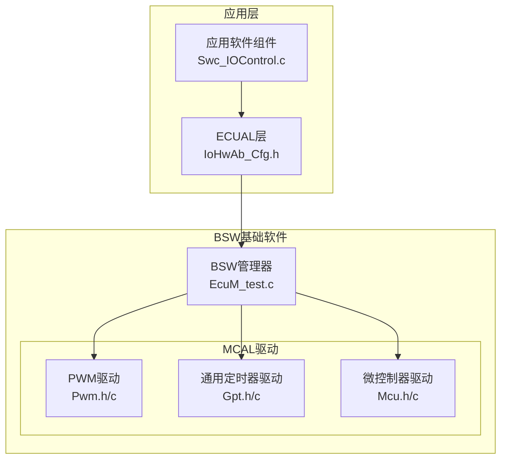
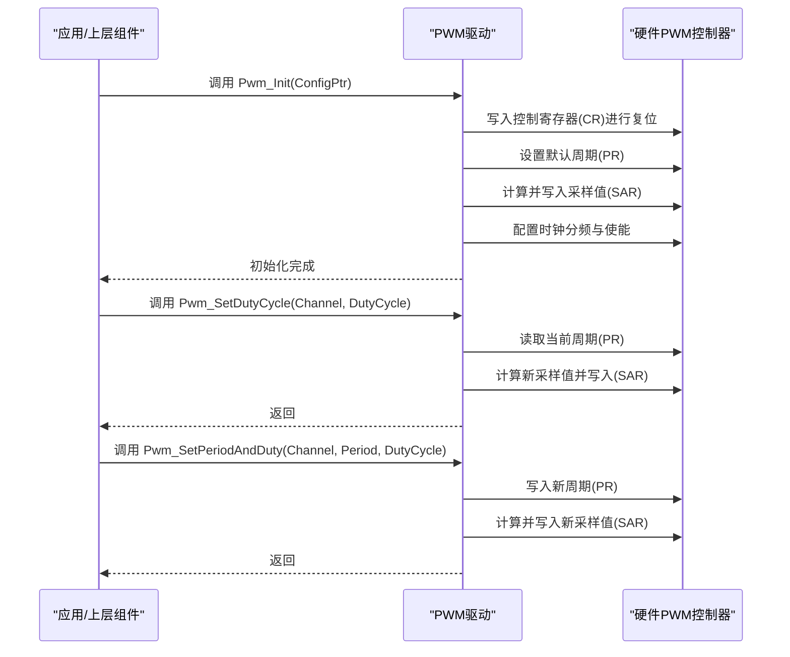
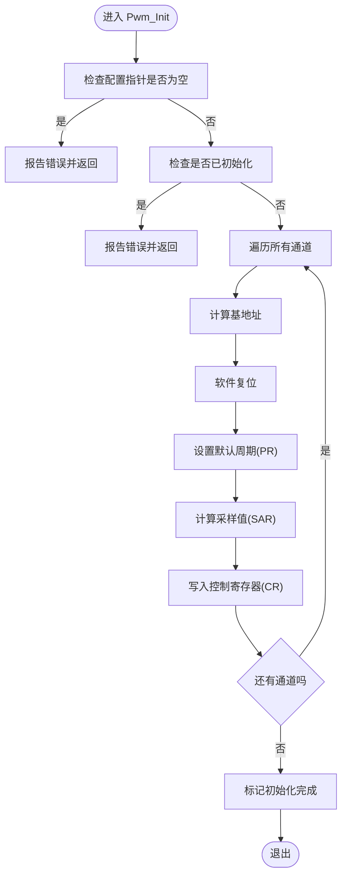
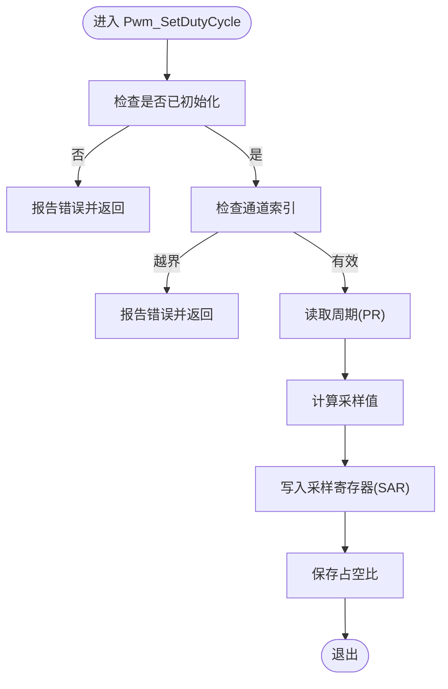
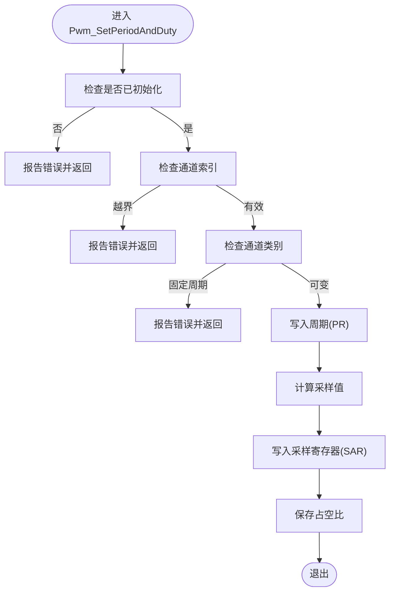
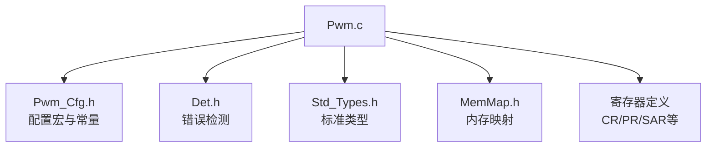

# Pwm脉宽调制驱动

<cite>
**本文档引用的文件**
- [Pwm.h](file://src/bsw/mcal/pwm/include/Pwm.h)
- [Pwm.c](file://src/bsw/mcal/pwm/src/Pwm.c)
- [Pwm_Cfg.h](file://src/bsw/mcal/pwm/include/Pwm_Cfg.h)
- [EcuM_test.c](file://src/bsw/integration/EcuM_test.c)
- [IoHwAb_Cfg.h](file://src/bsw/ecual/iohwab/include/IoHwAb_Cfg.h)
- [Swc_IOControl.c](file://src/asw/io_control/src/Swc_IOControl.c)
</cite>

## 目录
1. [简介](#简介)
2. [项目结构](#项目结构)
3. [核心组件](#核心组件)
4. [架构概览](#架构概览)
5. [详细组件分析](#详细组件分析)
6. [依赖关系分析](#依赖关系分析)
7. [性能考虑](#性能考虑)
8. [故障排除指南](#故障排除指南)
9. [结论](#结论)
10. [附录](#附录)

## 简介
本文件为PWM（脉冲宽度调制）驱动模块的详细技术文档，基于AutoSAR Classic Platform 4.x标准实现。该驱动模块提供PWM信号生成、占空比控制、频率调节、输出状态管理、中断通知以及电源状态管理等核心功能。文档重点涵盖以下方面：
- PWM信号生成原理与定时器关系
- 核心API：Pwm_Init()、Pwm_SetDutyCycle()、Pwm_SetPeriodAndDuty()、Pwm_SetOutputToIdle()、Pwm_GetOutputState()、Pwm_EnableNotification()/Pwm_DisableNotification()、Pwm_GetVersionInfo()及电源状态相关接口
- 配置参数：默认周期、默认占空比、占空比分辨率、时钟源与分频等
- 死区控制、互补输出与正交编码支持的现状与扩展建议
- 应用示例：电机控制配置、音频生成方案
- 错误处理与调试建议

## 项目结构
PWM驱动位于BSW（基础软件）的MCAL（微控制器抽象层）中，采用AutoSAR分层架构设计。关键文件组织如下：
- 接口定义：src/bsw/mcal/pwm/include/Pwm.h
- 实现代码：src/bsw/mcal/pwm/src/Pwm.c
- 配置头文件：src/bsw/mcal/pwm/include/Pwm_Cfg.h
- 集成测试桩：src/bsw/integration/EcuM_test.c
- 上层应用接口配置：src/bsw/ecual/iohwab/include/IoHwAb_Cfg.h
- 应用层IO控制实现：src/asw/io_control/src/Swc_IOControl.c

**图表来源**
- [Pwm.h:209-293](file://src/bsw/mcal/pwm/include/Pwm.h#L209-L293)
- [Pwm.c:84-127](file://src/bsw/mcal/pwm/src/Pwm.c#L84-L127)
- [EcuM_test.c:114-124](file://src/bsw/integration/EcuM_test.c#L114-L124)

**章节来源**
- [Pwm.h:1-299](file://src/bsw/mcal/pwm/include/Pwm.h#L1-L299)
- [Pwm.c:1-383](file://src/bsw/mcal/pwm/src/Pwm.c#L1-L383)
- [Pwm_Cfg.h:1-63](file://src/bsw/mcal/pwm/include/Pwm_Cfg.h#L1-L63)
- [EcuM_test.c:55-254](file://src/bsw/integration/EcuM_test.c#L55-L254)

## 核心组件
本节概述PWM驱动的核心数据类型、配置结构和API函数族。

- 数据类型与枚举
  - 通道类型：Pwm_ChannelType（无符号8位）
  - 周期类型：Pwm_PeriodType（无符号32位）
  - 占空比类型：Pwm_DutyCycleType（无符号16位）
  - 输出状态：Pwm_OutputStateType（低电平/高电平）
  - 中断边沿类型：Pwm_EdgeNotificationType（上升沿/下降沿/双边沿）
  - 电源状态请求结果：Pwm_PowerStateRequestResultType（服务接受/未初始化/序列错误/硬件故障/不支持/不可转换）
  - 通道类别：Pwm_ChannelClassType（可变周期/固定周期/固定周期偏移）
  - 空闲状态：Pwm_IdleStateType（低电平/高电平）
  - 极性：Pwm_PolarityType（低电平/高电平）
  - 时钟源：Pwm_ClockSourceType（系统/总线/外部）

- 配置结构
  - Pwm_ChannelConfigType：包含通道ID、基地址、通道类别、默认周期、默认占空比、空闲状态、极性、时钟源、时钟分频、是否支持通知、通知回调指针
  - Pwm_ConfigType：包含通道数组指针、通道数量、是否启用DET、版本信息API、去初始化API、设置占空比API、设置周期和占空比API、设置输出到空闲API、获取输出状态API、是否支持通知、是否支持电源状态

- API函数族
  - 初始化与去初始化：Pwm_Init()、Pwm_DeInit()
  - 占空比与周期控制：Pwm_SetDutyCycle()、Pwm_SetPeriodAndDuty()
  - 输出状态管理：Pwm_SetOutputToIdle()、Pwm_GetOutputState()
  - 中断通知：Pwm_EnableNotification()、Pwm_DisableNotification()
  - 版本信息：Pwm_GetVersionInfo()
  - 电源状态：Pwm_SetPowerState()、Pwm_GetTargetPowerState()、Pwm_GetCurrentPowerState()、Pwm_PreparePowerState()

**章节来源**
- [Pwm.h:75-190](file://src/bsw/mcal/pwm/include/Pwm.h#L75-L190)
- [Pwm.h:209-293](file://src/bsw/mcal/pwm/include/Pwm.h#L209-L293)

## 架构概览
PWM驱动通过寄存器直接操作实现对硬件PWM控制器的控制。其架构遵循AutoSAR MCAL分层，上层通过Pwm.h提供的接口访问驱动，驱动内部根据配置参数初始化硬件寄存器，并在运行时通过API更新周期、占空比或输出状态。

**图表来源**
- [Pwm.c:84-127](file://src/bsw/mcal/pwm/src/Pwm.c#L84-L127)
- [Pwm.c:153-174](file://src/bsw/mcal/pwm/src/Pwm.c#L153-L174)
- [Pwm.c:177-204](file://src/bsw/mcal/pwm/src/Pwm.c#L177-L204)

## 详细组件分析

### PWM初始化流程（Pwm_Init）
- 参数校验：若配置指针为空或驱动已初始化，则触发DET错误报告并返回
- 遍历所有通道：根据通道ID计算基地址，执行软件复位，设置默认周期与采样值，配置时钟分频与使能
- 状态维护：记录配置指针与初始化标志

**图表来源**
- [Pwm.c:84-127](file://src/bsw/mcal/pwm/src/Pwm.c#L84-L127)

**章节来源**
- [Pwm.c:84-127](file://src/bsw/mcal/pwm/src/Pwm.c#L84-L127)

### 占空比设置（Pwm_SetDutyCycle）
- 参数校验：未初始化或通道越界则报告错误
- 读取当前周期：从周期寄存器PR读取
- 计算采样值：按占空比分辨率换算后写入采样寄存器SAR
- 状态更新：保存当前通道占空比

**图表来源**
- [Pwm.c:153-174](file://src/bsw/mcal/pwm/src/Pwm.c#L153-L174)

**章节来源**
- [Pwm.c:153-174](file://src/bsw/mcal/pwm/src/Pwm.c#L153-L174)

### 同时设置周期与占空比（Pwm_SetPeriodAndDuty）
- 参数校验：未初始化、通道越界、固定周期通道禁止修改周期
- 写入周期寄存器PR
- 计算并写入采样寄存器SAR
- 更新占空比缓存

**图表来源**
- [Pwm.c:177-204](file://src/bsw/mcal/pwm/src/Pwm.c#L177-L204)

**章节来源**
- [Pwm.c:177-204](file://src/bsw/mcal/pwm/src/Pwm.c#L177-L204)

### 输出到空闲（Pwm_SetOutputToIdle）
- 将采样寄存器SAR写入0，实现输出空闲（通常为低电平）

**章节来源**
- [Pwm.c:208-225](file://src/bsw/mcal/pwm/src/Pwm.c#L208-L225)

### 获取输出状态（Pwm_GetOutputState）
- 读取计数寄存器CNR与采样寄存器SAR
- 比较计数值与采样值决定输出高低电平

**章节来源**
- [Pwm.c:229-251](file://src/bsw/mcal/pwm/src/Pwm.c#L229-L251)

### 中断通知（Pwm_EnableNotification/Pwm_DisableNotification）
- 通过中断寄存器IR配置上升沿/下降沿中断
- 支持禁用所有通知

**章节来源**
- [Pwm.c:255-297](file://src/bsw/mcal/pwm/src/Pwm.c#L255-L297)

### 版本信息与电源状态
- 版本信息：填充供应商ID、模块ID与软件版本
- 电源状态：当前实现返回服务接受，电源状态支持可配置关闭

**章节来源**
- [Pwm.c:300-379](file://src/bsw/mcal/pwm/src/Pwm.c#L300-L379)

## 依赖关系分析
PWM驱动的依赖关系主要体现在配置、错误检测与平台寄存器操作三个方面。

**图表来源**
- [Pwm.c:9-11](file://src/bsw/mcal/pwm/src/Pwm.c#L9-L11)
- [Pwm_Cfg.h:15-61](file://src/bsw/mcal/pwm/include/Pwm_Cfg.h#L15-L61)

**章节来源**
- [Pwm.c:9-11](file://src/bsw/mcal/pwm/src/Pwm.c#L9-L11)
- [Pwm_Cfg.h:15-61](file://src/bsw/mcal/pwm/include/Pwm_Cfg.h#L15-L61)

## 性能考虑
- 占空比分辨率：默认0x8000（即65536级），提供较高精度的占空比控制
- 周期与采样计算：采用整型乘除法，避免浮点运算，适合实时系统
- 寄存器访问：直接写入硬件寄存器，延迟低，适合高频PWM应用
- 时钟分频：通过CR寄存器的预分频字段配置，影响PWM频率与分辨率
- 功耗管理：支持等待/停机/休眠模式控制位，可在低功耗场景下降低功耗

[本节为一般性指导，无需特定文件来源]

## 故障排除指南
- 初始化错误
  - 配置指针为空：检查传入的配置结构体是否正确初始化
  - 已初始化再次初始化：确保仅调用一次初始化
- 运行时错误
  - 未初始化调用API：确保先调用Pwm_Init()
  - 通道索引越界：确认通道ID在有效范围内
  - 固定周期通道修改周期：固定周期通道不允许动态修改周期
- 中断与通知
  - 通知未触发：检查IR寄存器配置与中断使能
- 电源状态
  - 电源状态不支持：当前实现返回不支持，需根据硬件能力扩展

**章节来源**
- [Pwm.h:62-71](file://src/bsw/mcal/pwm/include/Pwm.h#L62-L71)
- [Pwm.c:86-94](file://src/bsw/mcal/pwm/src/Pwm.c#L86-L94)
- [Pwm.c:155-163](file://src/bsw/mcal/pwm/src/Pwm.c#L155-L163)
- [Pwm.c:179-191](file://src/bsw/mcal/pwm/src/Pwm.c#L179-L191)

## 结论
PWM驱动模块实现了AutoSAR标准要求的核心功能，提供了灵活的占空比与周期控制、输出状态管理与中断通知机制。通过清晰的配置接口与严格的错误检测，该驱动适用于汽车电子中的电机控制、背光调节、音频生成等多种应用场景。未来可扩展死区控制、互补输出与正交编码支持，以满足更复杂的工业控制需求。

[本节为总结性内容，无需特定文件来源]

## 附录

### PWM配置参数与说明
- 默认周期：1000个计数单位（对应1kHz）
- 默认占空比：0x4000（50%）
- 占空比分辨率：0x8000（65536级）
- 时钟频率：24MHz
- 通道数量：8个
- 是否启用DET：开启
- 是否支持版本信息API：开启
- 是否支持去初始化API：开启
- 是否支持设置占空比API：开启
- 是否支持设置周期与占空比API：开启
- 是否支持设置输出到空闲API：开启
- 是否支持获取输出状态API：开启
- 是否支持通知：开启
- 是否支持电源状态：关闭

**章节来源**
- [Pwm_Cfg.h:15-61](file://src/bsw/mcal/pwm/include/Pwm_Cfg.h#L15-L61)

### PWM波形生成原理与定时器关系
- PWM波形由计数寄存器CNR与采样寄存器SAR比较生成
- 周期寄存器PR决定一个周期的计数上限
- 采样寄存器SAR决定高电平持续的计数阈值
- 通过改变PR与SAR可实现频率与占空比调节
- 时钟源与时钟分频通过控制寄存器CR配置

**章节来源**
- [Pwm.c:18-46](file://src/bsw/mcal/pwm/src/Pwm.c#L18-L46)
- [Pwm.c:167-173](file://src/bsw/mcal/pwm/src/Pwm.c#L167-L173)

### 应用示例与最佳实践
- 电机控制配置
  - 使用Pwm_SetPeriodAndDuty设置期望转速对应的PWM频率与占空比
  - 通过Pwm_SetOutputToIdle实现刹车或停止
  - 使用Pwm_GetOutputState监控输出状态
- 音频生成方案
  - 利用较高的PWM频率（如10kHz以上）配合音频信号调制
  - 通过Pwm_SetDutyCycle实现音量控制
  - 使用中断通知在每个周期结束时更新采样值
- 上层集成
  - 应用层通过Swc_IOControl.c接收目标占空比与频率，调用Pwm驱动实现输出
  - IoHwAb_Cfg.h提供IO硬件抽象层的占空比缩放配置（0.01%分辨率）

**章节来源**
- [Swc_IOControl.c:596-625](file://src/asw/io_control/src/Swc_IOControl.c#L596-L625)
- [IoHwAb_Cfg.h:94-94](file://src/bsw/ecual/iohwab/include/IoHwAb_Cfg.h#L94-L94)

### 死区控制、互补输出与正交编码支持现状与扩展建议
- 现状
  - 当前实现未提供死区控制、互补输出与正交编码支持
- 扩展建议
  - 在Pwm_ChannelConfigType中增加死区时间、互补输出极性与正交编码配置字段
  - 在Pwm_ConfigType中增加相应API开关
  - 在Pwm.c中扩展寄存器配置逻辑，支持TRM/DTF/IOCR等扩展寄存器
  - 提供独立的正交解码与计数通道配置

[本节为概念性扩展建议，无需特定文件来源]