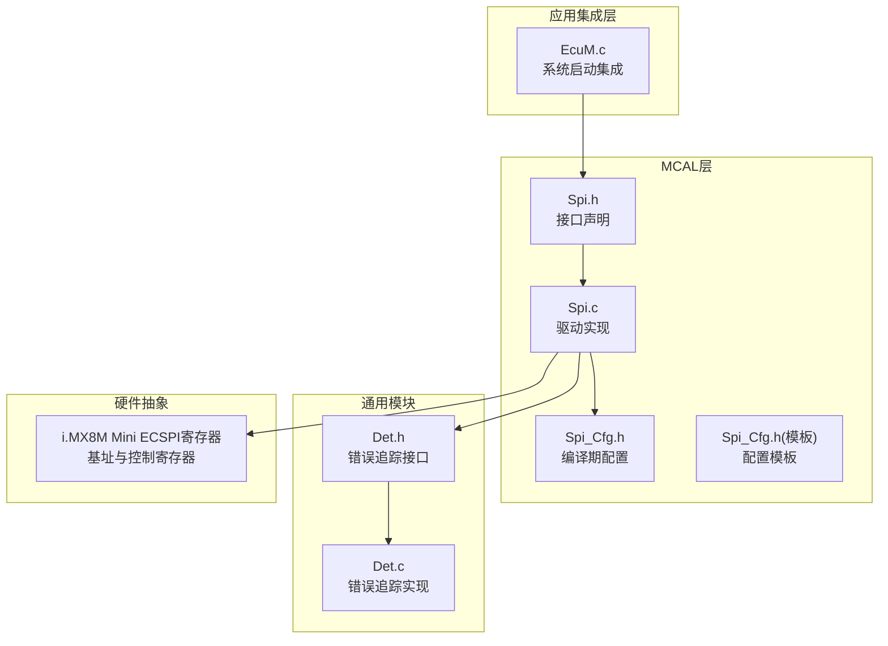
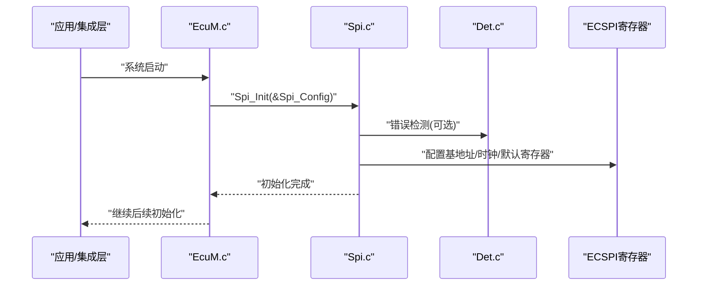
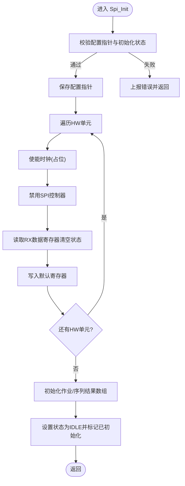
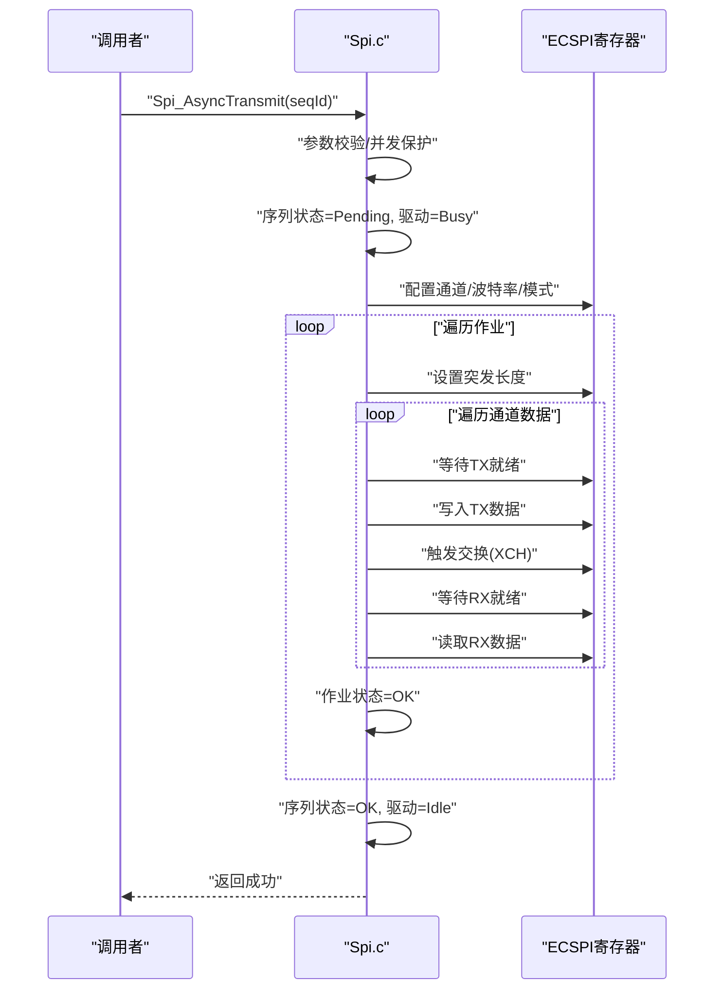
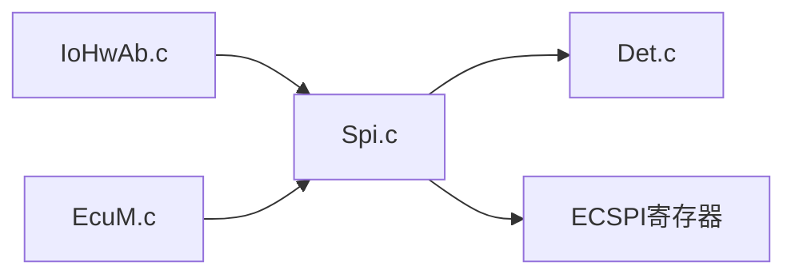

# Spi串行通信驱动

<cite>
**本文档引用的文件**
- [Spi.h](file://src/bsw/mcal/spi/include/Spi.h)
- [Spi.c](file://src/bsw/mcal/spi/src/Spi.c)
- [Spi_Cfg.h](file://src/bsw/mcal/spi/include/Spi_Cfg.h)
- [Spi_Cfg.h（模板）](file://src/bsw/config/templates/Spi_Cfg.h)
- [EcuM.c](file://src/bsw/services/ecum/src/EcuM.c)
- [Det.h](file://src/bsw/services/det/include/Det.h)
- [Det.c](file://src/bsw/services/det/src/Det.c)
- [modules.md](file://docs/modules.md)
- [api-reference.md](file://docs/api-reference.md)
- [README.md](file://README.md)
</cite>

## 目录
1. [简介](#简介)
2. [项目结构](#项目结构)
3. [核心组件](#核心组件)
4. [架构总览](#架构总览)
5. [详细组件分析](#详细组件分析)
6. [依赖关系分析](#依赖关系分析)
7. [性能考虑](#性能考虑)
8. [故障排查指南](#故障排查指南)
9. [结论](#结论)
10. [附录](#附录)

## 简介
本文件为YuleTech AutoSAR BSW平台中的SPI驱动模块提供完整技术文档。该驱动遵循AutoSAR Classic Platform 4.x标准，面向NXP i.MX8M Mini硬件平台，实现SPI接口的初始化、数据传输、模式配置、状态查询与取消等核心功能。文档重点覆盖以下API：
- Spi_Init()：驱动初始化
- Spi_WriteIB()：向内部缓冲区写入数据
- Spi_ReadIB()：从内部缓冲区读取数据
- Spi_AsyncTransmit()：异步序列传输
- Spi_FlowControl()：流控制（当前实现为空）

同时，文档详细说明了时钟极性（CPOL）、数据相位（CPHA）、片选（CS）极性、波特率分频、通道选择、突发长度配置以及与外部设备的通信机制，并提供配置示例、数据格式定义与传输优化策略。

## 项目结构
SPI驱动位于MCAL层，采用AutoSAR分层架构，与上层服务层（如IoHwAb）协作，与硬件寄存器直接交互。关键文件组织如下：
- 接口头文件：src/bsw/mcal/spi/include/Spi.h
- 实现文件：src/bsw/mcal/spi/src/Spi.c
- 配置头文件：src/bsw/mcal/spi/include/Spi_Cfg.h
- 配置模板：src/bsw/config/templates/Spi_Cfg.h
- 集成示例：src/bsw/services/ecum/src/EcuM.c
- DET错误追踪：src/bsw/services/det/include/Det.h, src/bsw/services/det/src/Det.c
- 文档：docs/modules.md, docs/api-reference.md, README.md

图表来源
- [Spi.h:1-362](file://src/bsw/mcal/spi/include/Spi.h#L1-L362)
- [Spi.c:1-439](file://src/bsw/mcal/spi/src/Spi.c#L1-L439)
- [Spi_Cfg.h:1-98](file://src/bsw/mcal/spi/include/Spi_Cfg.h#L1-L98)
- [Spi_Cfg.h（模板）:1-93](file://src/bsw/config/templates/Spi_Cfg.h#L1-L93)
- [EcuM.c:150-170](file://src/bsw/services/ecum/src/EcuM.c#L150-L170)
- [Det.h:1-76](file://src/bsw/services/det/include/Det.h#L1-L76)
- [Det.c:1-88](file://src/bsw/services/det/src/Det.c#L1-L88)

章节来源
- [Spi.h:1-362](file://src/bsw/mcal/spi/include/Spi.h#L1-L362)
- [Spi.c:1-439](file://src/bsw/mcal/spi/src/Spi.c#L1-L439)
- [Spi_Cfg.h:1-98](file://src/bsw/mcal/spi/include/Spi_Cfg.h#L1-L98)
- [Spi_Cfg.h（模板）:1-93](file://src/bsw/config/templates/Spi_Cfg.h#L1-L93)
- [EcuM.c:150-170](file://src/bsw/services/ecum/src/EcuM.c#L150-L170)
- [Det.h:1-76](file://src/bsw/services/det/include/Det.h#L1-L76)
- [Det.c:1-88](file://src/bsw/services/det/src/Det.c#L1-L88)

## 核心组件
- 接口与类型定义：包含状态类型、作业/序列结果类型、缓冲区类型、异步模式、通道/作业/序列/HW单元标识、数据缓冲结构、通道/作业/序列/外部设备配置结构、全局配置结构等。
- API集合：初始化、反初始化、内部缓冲区读写、外部缓冲区设置、同步/异步传输、状态查询、版本信息、硬件单元状态、取消、异步模式设置、主函数等。
- 配置宏：开发错误检测开关、版本信息API开关、通道缓冲允许模式、可中断序列、硬件状态API、取消API、通道/作业/序列/HW单元数量、默认异步模式、最大缓冲大小、主函数周期等。
- 硬件抽象：ECSPI寄存器基址、寄存器偏移、控制寄存器位掩码、状态寄存器位掩码、时钟分频计算、模式配置（CPOL/CPHA/SS极性）等。

章节来源
- [Spi.h:83-231](file://src/bsw/mcal/spi/include/Spi.h#L83-L231)
- [Spi.h:247-362](file://src/bsw/mcal/spi/include/Spi.h#L247-L362)
- [Spi_Cfg.h:15-96](file://src/bsw/mcal/spi/include/Spi_Cfg.h#L15-L96)
- [Spi.c:13-126](file://src/bsw/mcal/spi/src/Spi.c#L13-L126)

## 架构总览
SPI驱动在AutoSAR分层中属于MCAL层，向上为ECUAL/Service层提供统一接口，向下直接操作ECSPI硬件寄存器。系统启动阶段由EcuM负责调用Spi_Init完成驱动初始化；随后IoHwAb等模块可按需进行传输。

图表来源
- [EcuM.c:160-161](file://src/bsw/services/ecum/src/EcuM.c#L160-L161)
- [Spi.c:131-174](file://src/bsw/mcal/spi/src/Spi.c#L131-L174)
- [Det.c:47-57](file://src/bsw/services/det/src/Det.c#L47-L57)

章节来源
- [EcuM.c:150-170](file://src/bsw/services/ecum/src/EcuM.c#L150-L170)
- [Spi.c:131-174](file://src/bsw/mcal/spi/src/Spi.c#L131-L174)
- [Det.c:47-57](file://src/bsw/services/det/src/Det.c#L47-L57)

## 详细组件分析

### 初始化流程（Spi_Init）
- 参数校验：若启用开发错误检测且传入配置指针为空或驱动已初始化，则上报错误并返回。
- 全局配置指针保存：将传入配置保存至静态指针。
- 硬件单元遍历：对每个可用的HW单元（ECSPI1/2/3），获取基址并执行以下步骤：
  - 使能时钟（当前实现为空）
  - 禁用SPI控制器
  - 读取RX数据寄存器清空状态
  - 写入默认使能位与周期寄存器、中断寄存器
- 结果状态初始化：清空所有作业/序列结果，设置驱动状态为IDLE，标记为已初始化。

图表来源
- [Spi.c:131-174](file://src/bsw/mcal/spi/src/Spi.c#L131-L174)

章节来源
- [Spi.c:131-174](file://src/bsw/mcal/spi/src/Spi.c#L131-L174)

### 异步传输流程（Spi_AsyncTransmit）
- 参数校验：若驱动未初始化或序列ID越界，上报错误并返回失败。
- 并发保护：若序列处于PENDING状态则返回失败。
- 状态更新：将序列标记为PENDING，驱动状态设为BUSY。
- 序列执行：遍历序列中的每个作业：
  - 获取作业配置与对应HW单元基址
  - 将作业标记为PENDING
  - 配置通道、波特率、模式
  - 遍历作业中的每个通道：
    - 设置突发长度（数据宽度-1）
    - 对通道的最大数据长度循环：
      - 等待TX就绪
      - 写入默认数据（实际应用中应写入有效数据）
      - 触发交换（XCH）
      - 等待RX就绪
      - 读取RX数据寄存器
  - 将作业标记为OK
- 完成处理：序列标记为OK，驱动状态设为IDLE，返回成功。

图表来源
- [Spi.c:219-293](file://src/bsw/mcal/spi/src/Spi.c#L219-L293)

章节来源
- [Spi.c:219-293](file://src/bsw/mcal/spi/src/Spi.c#L219-L293)

### 内部缓冲区读写（Spi_WriteIB / Spi_ReadIB）
- Spi_WriteIB：当前实现为空，仅进行参数校验（若启用DET）。建议在实际应用中将数据写入内部缓冲区以便后续传输。
- Spi_ReadIB：当前实现为空，仅进行参数校验（若启用DET）。建议在实际应用中从内部缓冲区读取数据。

章节来源
- [Spi.c:203-218](file://src/bsw/mcal/spi/src/Spi.c#L203-L218)
- [Spi.c:295-309](file://src/bsw/mcal/spi/src/Spi.c#L295-L309)

### 外部缓冲区设置（Spi_SetupEB）
- 当前实现为空，仅进行参数校验（若启用DET）。建议在实际应用中配置源/目的缓冲区与长度，以支持外部缓冲区传输。

章节来源
- [Spi.c:311-329](file://src/bsw/mcal/spi/src/Spi.c#L311-L329)

### 状态与结果查询
- 驱动状态：Spi_GetStatus返回当前驱动状态（UNINIT/IDLE/BUSY）。
- 作业结果：Spi_GetJobResult返回指定作业的结果（OK/PENDING/FAILED/QUEUED）。
- 序列结果：Spi_GetSequenceResult返回指定序列的结果（OK/PENDING/FAILED/CANCELLED）。
- 硬件单元状态：Spi_GetHWUnitStatus返回指定HW单元的状态（UNINIT/IDLE/BUSY）。

章节来源
- [Spi.c:331-403](file://src/bsw/mcal/spi/src/Spi.c#L331-L403)

### 取消与异步模式
- 取消：Spi_Cancel仅在序列处于PENDING时将其标记为CANCELLED并恢复驱动状态为IDLE。
- 异步模式：Spi_SetAsyncMode当前为空实现，不改变任何状态。

章节来源
- [Spi.c:405-427](file://src/bsw/mcal/spi/src/Spi.c#L405-L427)

### 主函数（主循环）
- Spi_MainFunction_Handling/Spi_MainFunction_Driving：当前为空实现，预留用于轮询或中断驱动的处理逻辑。

章节来源
- [Spi.c:429-435](file://src/bsw/mcal/spi/src/Spi.c#L429-L435)

### 配置与数据格式

#### 配置宏与常量
- 开发错误检测、版本信息API、通道缓冲允许模式、可中断序列、硬件状态API、取消API等编译期开关。
- 通道/作业/序列/HW单元数量定义。
- 默认异步模式、最大缓冲大小、主函数周期等。

章节来源
- [Spi_Cfg.h:15-96](file://src/bsw/mcal/spi/include/Spi_Cfg.h#L15-L96)

#### 数据结构与枚举
- 状态类型、作业/序列结果类型、缓冲区类型、异步模式类型、标识类型（通道/作业/序列/HW单元）、数据缓冲结构、通道/作业/序列/外部设备配置结构、全局配置结构。

章节来源
- [Spi.h:83-231](file://src/bsw/mcal/spi/include/Spi.h#L83-L231)

#### 硬件寄存器与模式配置
- ECSPI基址：ECSPI1/2/3。
- 寄存器偏移：RX/TX、CONREG、CONFIGREG、INTREG、DMAREG、STATREG、PERIODREG、TESTREG、MSGDATA。
- 控制寄存器位掩码：使能、半双工、交换、单主、通道选择、预分频、后分频、突发长度等。
- 状态寄存器位掩码：RX就绪、TX就绪、边界溢出、RX溢出、传输完成等。
- 模式配置：根据作业配置设置CPOL/CPHA与SS极性。

章节来源
- [Spi.c:13-44](file://src/bsw/mcal/spi/src/Spi.c#L13-L44)
- [Spi.c:108-126](file://src/bsw/mcal/spi/src/Spi.c#L108-L126)

### SPI协议特性与外部设备通信机制
- 时钟极性（CPOL）与数据相位（CPHA）：通过CONFIGREG按片选通道位域配置，支持不同模式组合。
- 片选（CS）极性：支持高电平有效或低电平有效。
- 波特率：基于24MHz参考时钟，计算预分频与后分频，设置CONREG的PRE/POST DIVIDER。
- 通道选择：通过CONREG的CHANNEL SELECT位域选择当前通道。
- 突发长度：通过CONREG的BURST LENGTH位域设置数据宽度（数据宽度-1）。
- 传输流程：等待TX就绪→写入TX→触发交换→等待RX就绪→读取RX。

章节来源
- [Spi.c:87-126](file://src/bsw/mcal/spi/src/Spi.c#L87-L126)

### SPI设备配置示例与数据格式定义
- 外部设备配置结构包含设备ID、CS引脚、波特率、数据宽度、时钟空闲电平、数据移位边沿、CS到CLK、CLK到CS、CS到CS时间等字段，便于为不同外设建立独立配置。
- 通道/作业/序列配置结构分别描述通道默认数据、数据宽度、最大长度、缓冲区类型、传输起始位置，作业的HW单元、CS引脚、波特率、时钟/数据配置、CS极性与时序，序列的作业列表、可中断性等。

章节来源
- [Spi.h:202-231](file://src/bsw/mcal/spi/include/Spi.h#L202-L231)

### 传输优化策略
- 批量传输：通过设置突发长度与合适的通道/作业配置，减少频繁切换带来的开销。
- 波特率选择：根据外设能力与系统负载选择合适分频，平衡速度与稳定性。
- 缓冲区策略：优先使用内部缓冲区（若实现）以减少外部内存访问；必要时使用外部缓冲区并确保对齐与长度正确。
- 时序控制：合理设置CS到CLK、CLK到CS、CS到CS时间，避免竞争与毛刺。
- 错误处理：启用DET并在异常路径中及时上报，便于定位问题。

章节来源
- [Spi.c:87-126](file://src/bsw/mcal/spi/src/Spi.c#L87-L126)
- [Spi_Cfg.h:15-96](file://src/bsw/mcal/spi/include/Spi_Cfg.h#L15-L96)

## 依赖关系分析
- 上层依赖：IoHwAb等ECUAL模块通过SPI接口与外部设备通信；系统启动由EcuM负责调用Spi_Init。
- 下层依赖：直接操作ECSPI寄存器，受平台启动脚本与时钟配置影响。
- 通用依赖：DET错误追踪模块在启用时参与错误上报。

图表来源
- [EcuM.c:160-161](file://src/bsw/services/ecum/src/EcuM.c#L160-L161)
- [Spi.c:131-174](file://src/bsw/mcal/spi/src/Spi.c#L131-L174)
- [Det.c:47-57](file://src/bsw/services/det/src/Det.c#L47-L57)

章节来源
- [EcuM.c:150-170](file://src/bsw/services/ecum/src/EcuM.c#L150-L170)
- [Spi.c:131-174](file://src/bsw/mcal/spi/src/Spi.c#L131-L174)
- [Det.c:47-57](file://src/bsw/services/det/src/Det.c#L47-L57)

## 性能考虑
- 硬件寄存器访问：尽量批量设置寄存器，减少多次读写。
- 时钟分频：合理选择分频值，避免过高的波特率导致信号完整性问题。
- 中断与轮询：当前实现为轮询模式，若需要更高吞吐量，可在后续版本引入中断或DMA支持（当前API预留，具体实现需扩展）。
- 缓冲区管理：减少不必要的拷贝，优先使用DMA或零拷贝策略（若硬件支持）。

## 故障排查指南
- 初始化失败：
  - 检查配置指针是否为空或重复初始化。
  - 确认硬件单元基址映射正确。
- 传输超时/失败：
  - 检查TX/RX就绪标志位。
  - 核对波特率分频与外设时序。
  - 确认CS极性与时序设置。
- 状态异常：
  - 使用Spi_GetStatus/Spi_GetHWUnitStatus确认驱动/硬件状态。
  - 使用Spi_GetJobResult/Spi_GetSequenceResult检查作业/序列结果。
- 错误上报：
  - 启用DET后，关注错误码与服务ID，定位具体问题。

章节来源
- [Spi.c:131-174](file://src/bsw/mcal/spi/src/Spi.c#L131-L174)
- [Spi.c:219-293](file://src/bsw/mcal/spi/src/Spi.c#L219-L293)
- [Spi.c:331-403](file://src/bsw/mcal/spi/src/Spi.c#L331-L403)
- [Det.h:41-70](file://src/bsw/services/det/include/Det.h#L41-L70)
- [Det.c:47-57](file://src/bsw/services/det/src/Det.c#L47-L57)

## 结论
本SPI驱动实现了AutoSAR标准的接口与配置框架，具备初始化、异步传输、状态查询与错误处理能力。当前实现以轮询为主，模式配置与波特率分频已完备，为后续扩展DMA与中断提供了清晰的接口基础。结合合理的配置与优化策略，可满足大多数MCAL层对SPI通信的需求。

## 附录
- 模块文档与API参考：参见docs/modules.md与docs/api-reference.md。
- 项目概述与模块清单：参见README.md。

章节来源
- [modules.md:74-82](file://docs/modules.md#L74-L82)
- [api-reference.md:1-609](file://docs/api-reference.md#L1-L609)
- [README.md:32-93](file://README.md#L32-L93)