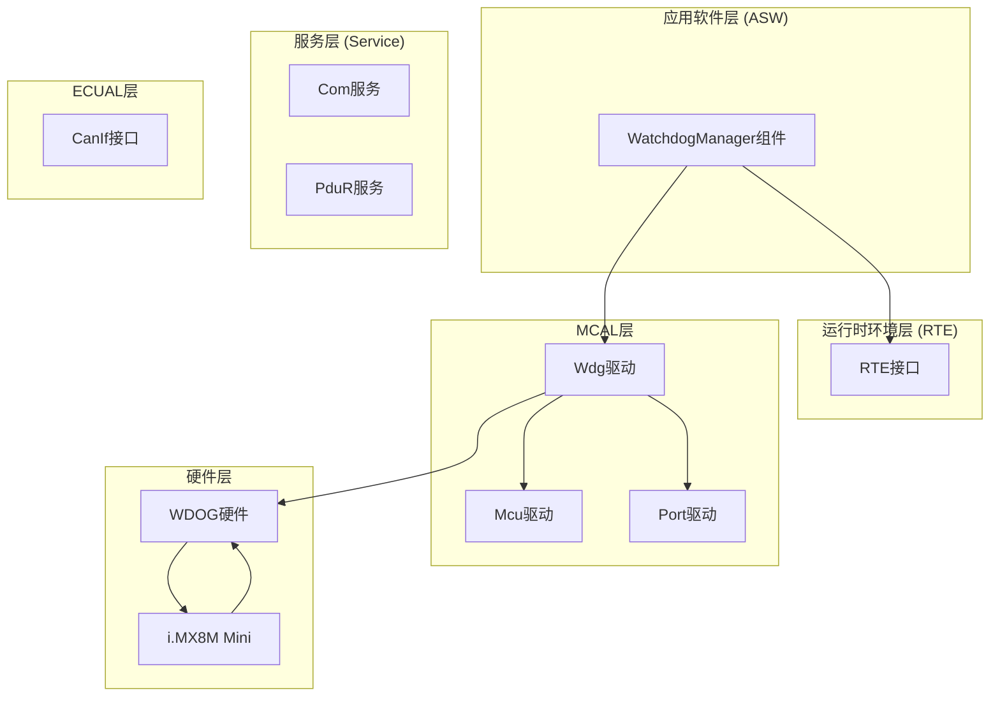
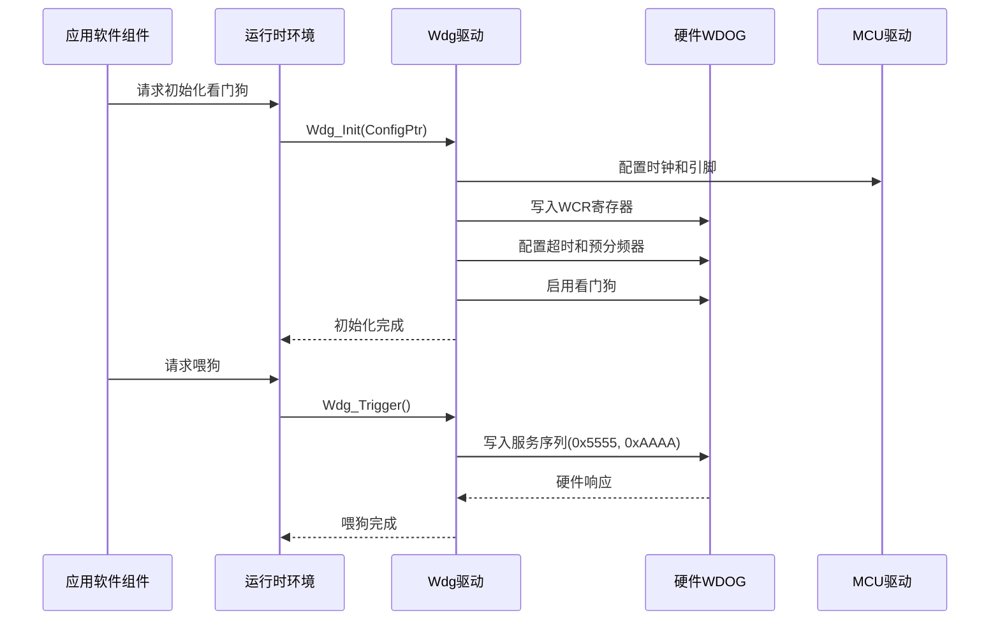
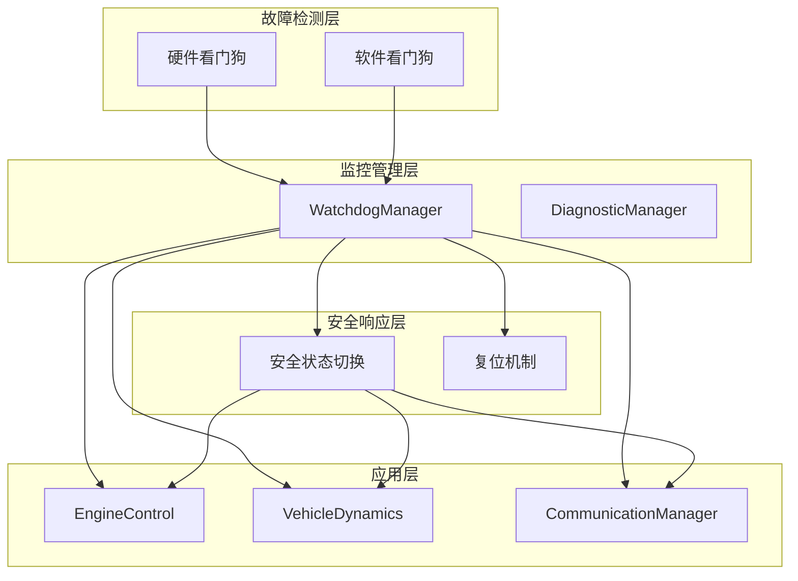
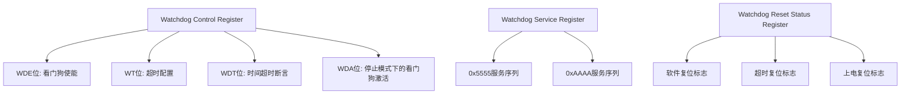
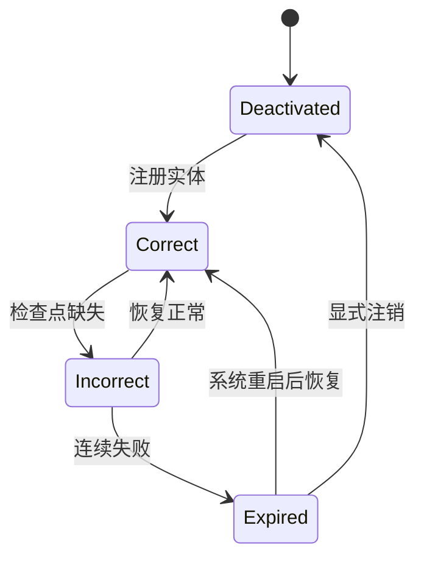
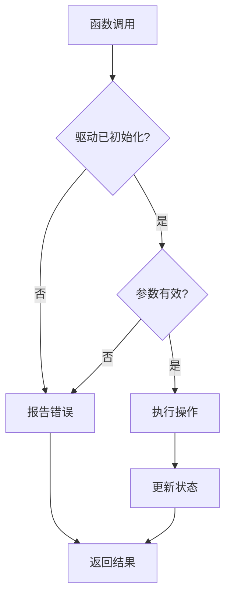
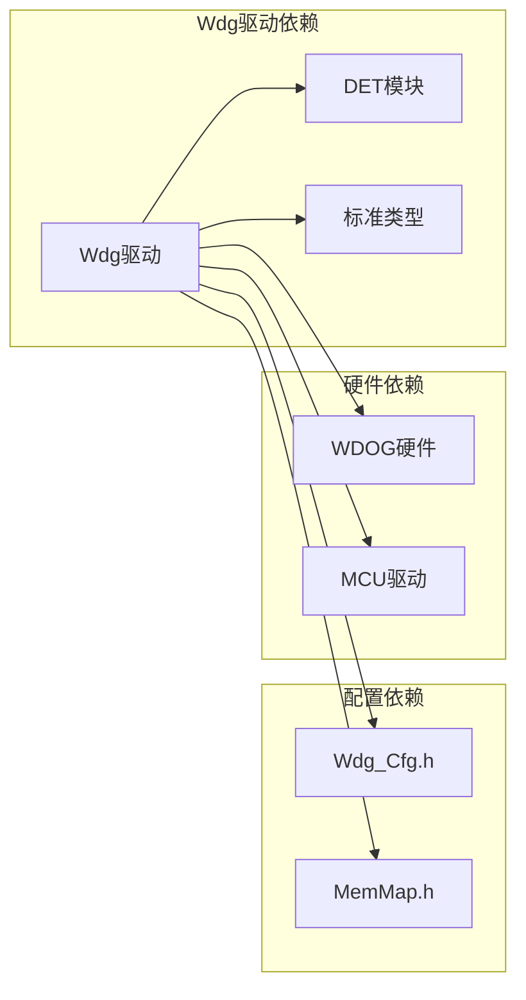

# Wdg看门狗驱动

<cite>
**本文档引用的文件**
- [Wdg.h](file://src/bsw/mcal/wdg/include/Wdg.h)
- [Wdg_Cfg.h](file://src/bsw/mcal/wdg/include/Wdg_Cfg.h)
- [Wdg.c](file://src/bsw/mcal/wdg/src/Wdg.c)
- [Swc_WatchdogManager.h](file://src/asw/watchdog_manager/include/Swc_WatchdogManager.h)
- [Swc_WatchdogManager.c](file://src/asw/watchdog_manager/src/Swc_WatchdogManager.c)
- [Det.h](file://src/bsw/common/Det.h)
- [Std_Types.h](file://src/bsw/common/Std_Types.h)
- [modules.md](file://docs/modules.md)
</cite>

## 目录
1. [简介](#简介)
2. [项目结构](#项目结构)
3. [核心组件](#核心组件)
4. [架构概览](#架构概览)
5. [详细组件分析](#详细组件分析)
6. [依赖关系分析](#依赖关系分析)
7. [性能考虑](#性能考虑)
8. [故障排除指南](#故障排除指南)
9. [结论](#结论)

## 简介

Wdg看门狗驱动是YuleTech AutoSAR BSW平台中的关键安全模块，遵循AutoSAR Classic Platform 4.x标准。该驱动模块提供了对NXP i.MX8M Mini微控制器内置WDOG（Watchdog）硬件的抽象和控制，实现了系统级的故障检测和自动恢复机制。

看门狗驱动的核心职责包括：
- 硬件看门狗的初始化和配置
- 多模式运行模式支持（OFF、SLOW、FAST）
- 超时时间管理和窗口模式配置
- 喂狗操作（Trigger）的执行
- 错误检测和报告机制
- 与应用软件组件的协作

## 项目结构

Wdg看门狗驱动模块位于BSW（Basic Software）层的MCAL（Microcontroller Abstraction Layer）中，采用AutoSAR标准的分层架构设计：



**图表来源**
- [modules.md:558-623](file://docs/modules.md#L558-L623)

**章节来源**
- [modules.md:114-122](file://docs/modules.md#L114-L122)

## 核心组件

### 看门狗驱动接口

Wdg驱动提供了完整的AutoSAR标准接口，包括以下核心API：

#### 初始化接口
- `Wdg_Init()`: 初始化看门狗驱动，配置硬件寄存器和运行模式
- `Wdg_GetVersionInfo()`: 获取驱动版本信息

#### 模式控制接口
- `Wdg_SetMode()`: 设置看门狗运行模式（OFF/SLOW/FAST）
- `Wdg_SetTriggerCondition()`: 设置触发条件超时值

#### 喂狗操作
- `Wdg_Trigger()`: 执行喂狗操作，重置看门狗计时器

### 配置参数

看门狗驱动支持多种配置参数，包括：

| 参数类别 | 配置项 | 默认值 | 描述 |
|---------|--------|--------|------|
| 基础配置 | DevErrorDetect | STD_ON | 开发错误检测开关 |
| 基础配置 | VersionInfoApi | STD_ON | 版本信息API开关 |
| 基础配置 | DisableAllowed | STD_OFF | 允许禁用看门狗 |
| 模式配置 | InitialMode | WDGIF_FAST_MODE | 初始运行模式 |
| 模式配置 | DefaultTimeout | 100ms | 默认超时时间 |
| 快速模式 | FastModeTimeout | 50ms | 快速模式超时 |
| 快速模式 | FastModePrescaler | 64 | 快速模式预分频器 |
| 快速模式 | FastWindowMode | STD_OFF | 快速模式窗口模式 |
| 慢速模式 | SlowModeTimeout | 500ms | 慢速模式超时 |
| 慢速模式 | SlowModePrescaler | 256 | 慢速模式预分频器 |
| 慢速模式 | SlowWindowMode | STD_OFF | 慢速模式窗口模式 |

**章节来源**
- [Wdg.h:66-115](file://src/bsw/mcal/wdg/include/Wdg.h#L66-L115)
- [Wdg_Cfg.h:15-60](file://src/bsw/mcal/wdg/include/Wdg_Cfg.h#L15-L60)

## 架构概览

Wdg看门狗驱动采用分层架构设计，实现了硬件抽象和应用软件之间的解耦：



**图表来源**
- [Wdg.c:85-143](file://src/bsw/mcal/wdg/src/Wdg.c#L85-L143)
- [Wdg.c:209-227](file://src/bsw/mcal/wdg/src/Wdg.c#L209-L227)

### 系统可靠性架构

看门狗驱动在整个系统可靠性架构中扮演着关键角色：



**图表来源**
- [Swc_WatchdogManager.c:500-516](file://src/asw/watchdog_manager/src/Swc_WatchdogManager.c#L500-L516)

## 详细组件分析

### 看门狗驱动实现

#### 硬件寄存器映射

Wdg驱动直接操作i.MX8M Mini的WDOG硬件寄存器：

| 寄存器 | 地址偏移 | 功能描述 |
|--------|----------|----------|
| WCR | 0x00 | Watchdog Control Register (控制寄存器) |
| WSR | 0x02 | Watchdog Service Register (服务寄存器) |
| WRSR | 0x04 | Watchdog Reset Status Register (复位状态寄存器) |
| WICR | 0x06 | Watchdog Interrupt Control Register (中断控制寄存器) |
| WMCR | 0x08 | Watchdog Miscellaneous Control Register (杂项控制寄存器) |

#### 关键寄存器位定义



**图表来源**
- [Wdg.c:13-45](file://src/bsw/mcal/wdg/src/Wdg.c#L13-L45)

**章节来源**
- [Wdg.c:58-80](file://src/bsw/mcal/wdg/src/Wdg.c#L58-L80)

### WatchdogManager应用组件

WatchdogManager作为ASW层的应用软件组件，提供了更高层次的看门狗管理功能：

#### 实体监督机制



#### 监督周期管理

WatchdogManager采用10ms周期的监督机制：

| 监督周期 | 功能描述 | 触发条件 |
|----------|----------|----------|
| 10ms | 实体状态检查 | 定时器中断 |
| 100ms | 超时阈值检查 | 10倍周期 |
| 1s | 系统健康状态 | 100倍周期 |

**章节来源**
- [Swc_WatchdogManager.c:96-134](file://src/asw/watchdog_manager/src/Swc_WatchdogManager.c#L96-L134)
- [Swc_WatchdogManager.c:168-182](file://src/asw/watchdog_manager/src/Swc_WatchdogManager.c#L168-L182)

### 错误处理和安全机制

#### 错误检测配置

Wdg驱动实现了完整的错误检测机制：



#### 错误代码定义

| 错误代码 | 错误描述 | 触发条件 |
|----------|----------|----------|
| WDG_E_UNINIT | 驱动未初始化 | 调用未初始化的API |
| WDG_E_DISABLE_NOT_ALLOWED | 禁用不允许 | 禁用看门狗但配置不允许 |
| WDG_E_PARAM_MODE | 模式参数无效 | 传入无效的运行模式 |
| WDG_E_PARAM_POINTER | 指针参数无效 | 传入NULL指针 |
| WDG_E_PARAM_TIMEOUT | 超时参数无效 | 超时值超出范围 |

**章节来源**
- [Wdg.h:53-61](file://src/bsw/mcal/wdg/include/Wdg.h#L53-L61)
- [Wdg.c:147-202](file://src/bsw/mcal/wdg/src/Wdg.c#L147-L202)

## 依赖关系分析

### 模块间依赖关系



**图表来源**
- [Wdg.h:19-20](file://src/bsw/mcal/wdg/include/Wdg.h#L19-L20)
- [Wdg.c:9-11](file://src/bsw/mcal/wdg/src/Wdg.c#L9-L11)

### 配置变体支持

Wdg驱动支持三种配置变体：

| 配置变体 | 编译时支持 | 运行时支持 | 适用场景 |
|----------|------------|------------|----------|
| Pre-compile | ✓ | ✗ | 固定配置，高性能 |
| Link-time | ✓ | ✓ | 部分可配置 |
| Post-build | ✗ | ✓ | 运行时完全可配置 |

**章节来源**
- [Wdg.h:37-39](file://src/bsw/mcal/wdg/include/Wdg.h#L37-L39)

## 性能考虑

### 时钟频率和超时计算

看门狗驱动使用32kHz低功耗振荡器作为时钟源：

```mermaid
flowchart TD
Timeout[期望超时时间(ms)] --> Calc[计算公式]
Calc --> Formula[WCR[WT] = (timeout × clockFreq / 2000) - 1]
Formula --> Value[WT值计算]
Value --> Range{是否超出范围?}
Range --> |是| Clamp[限制到最大值]
Range --> |否| Valid[使用计算值]
Clamp --> Valid
Valid --> Write[写入寄存器]
```

### 内存使用优化

Wdg驱动采用了内存映射技术来优化内存使用：

| 内存段 | 用途 | 大小 |
|--------|------|------|
| VAR_CLEARED_UNSPECIFIED | 静态变量 | 小于1KB |
| CONFIG_DATA_UNSPECIFIED | 配置常量 | 小于2KB |
| CODE | 可执行代码 | 几KB |

## 故障排除指南

### 常见问题诊断

#### 看门狗不工作

**症状**: 系统无法被看门狗复位
**可能原因**:
1. 看门狗处于OFF模式
2. 驱动未正确初始化
3. 喂狗序列未正确执行

**解决步骤**:
1. 检查Wdg_Init()返回值
2. 确认Wdg_Trigger()定期调用
3. 验证硬件连接

#### 超时时间不准确

**症状**: 看门狗超时时间与预期不符
**可能原因**:
1. 时钟频率配置错误
2. 预分频器设置不当
3. 超时计算公式错误

**解决步骤**:
1. 验证Wdg_Cfg.h中的时钟配置
2. 检查预分频器选择
3. 重新计算超时值

#### 窗口模式问题

**症状**: 窗口模式下看门狗频繁复位
**可能原因**:
1. 喂狗时机不在允许窗口内
2. 窗口配置错误
3. 系统响应时间过长

**解决步骤**:
1. 检查窗口起始和结束时间
2. 优化系统响应时间
3. 调整喂狗频率

**章节来源**
- [Wdg.c:71-80](file://src/bsw/mcal/wdg/src/Wdg.c#L71-L80)
- [Wdg_Cfg.h:53](file://src/bsw/mcal/wdg/include/Wdg_Cfg.h#L53)

### 调试建议

1. **启用开发错误检测**: 在调试阶段将WDG_DEV_ERROR_DETECT设置为STD_ON
2. **监控寄存器状态**: 使用调试器观察WCR、WSR等关键寄存器
3. **验证喂狗序列**: 确保Wdg_Trigger()执行正确的服务序列
4. **测试不同模式**: 验证OFF、SLOW、FAST模式的正确切换

## 结论

Wdg看门狗驱动模块是YuleTech AutoSAR BSW平台中实现系统可靠性的关键组件。通过遵循AutoSAR标准和采用分层架构设计，该驱动实现了：

1. **硬件抽象**: 为上层软件提供统一的看门狗接口
2. **多模式支持**: 支持OFF、SLOW、FAST三种运行模式
3. **错误检测**: 完整的错误检测和报告机制
4. **配置灵活性**: 支持多种配置变体和运行时调整
5. **安全性**: 实现了严格的安全约束和故障恢复策略

该驱动模块与WatchdogManager应用组件协同工作，形成了完整的系统级故障检测和恢复机制，为汽车电子系统的可靠性提供了坚实保障。

在未来的发展中，可以考虑增加更多高级功能，如：
- 更精细的窗口模式配置
- 多级看门狗支持
- 更丰富的错误报告机制
- 实时性能监控