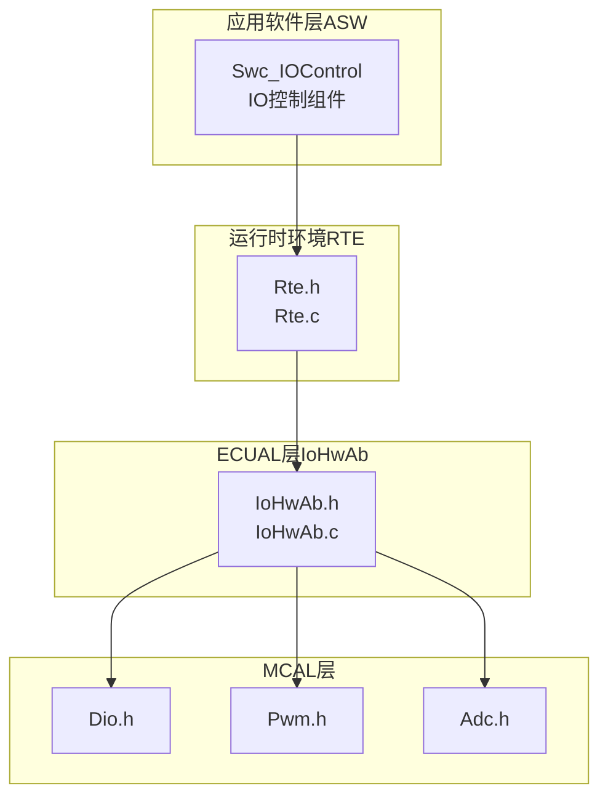
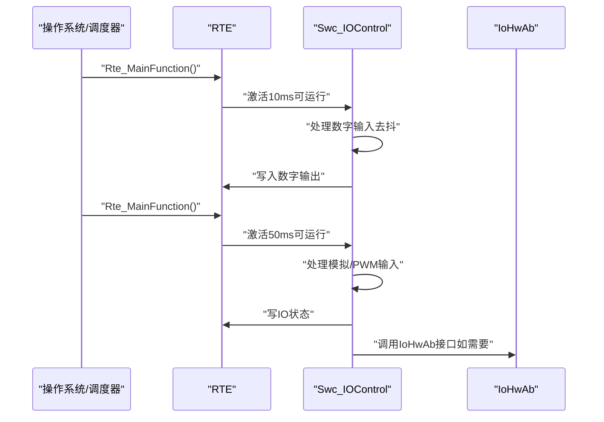
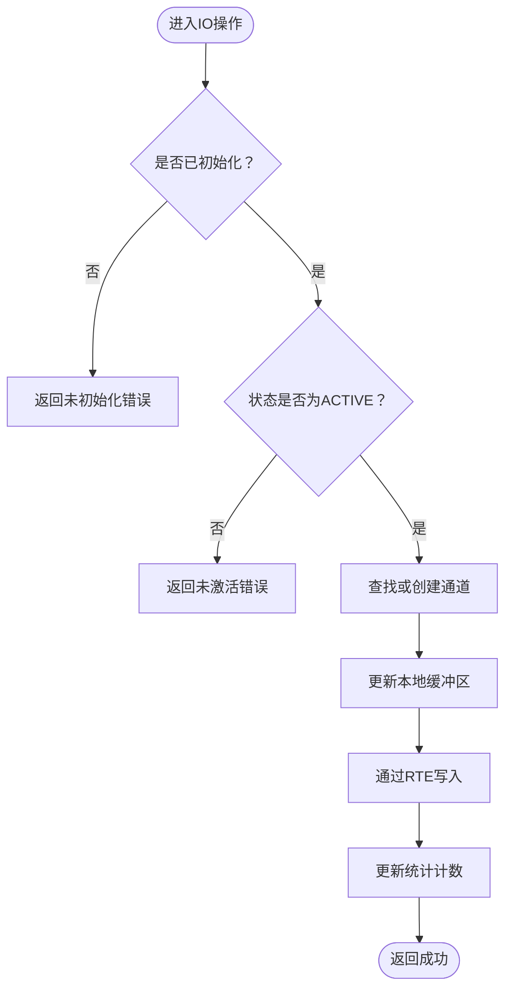
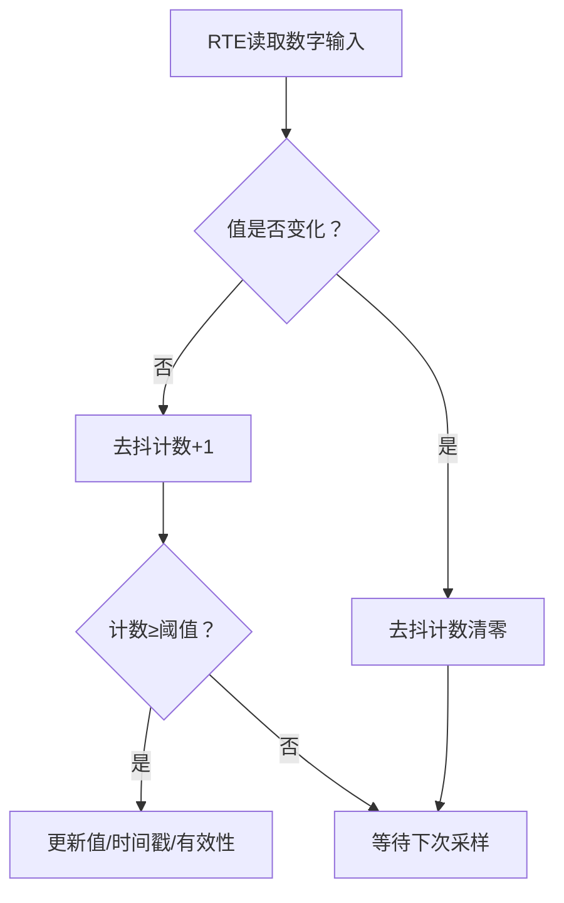
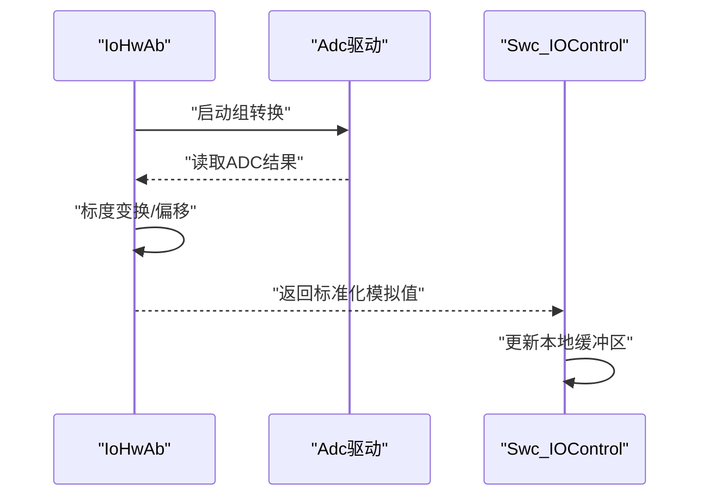
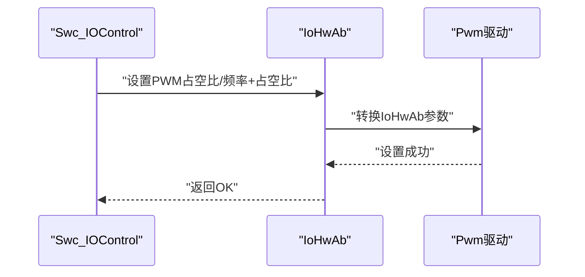
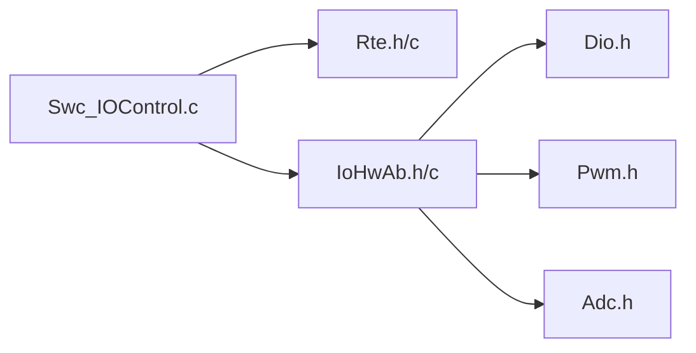

# IO控制组件(Swc_IOControl)

<cite>
**本文档引用的文件**
- [Swc_IOControl.h](file://src/asw/io_control/include/Swc_IOControl.h)
- [Swc_IOControl.c](file://src/asw/io_control/src/Swc_IOControl.c)
- [IoHwAb.h](file://src/bsw/ecual/iohwab/include/IoHwAb.h)
- [IoHwAb.c](file://src/bsw/ecual/iohwab/src/IoHwAb.c)
- [IoHwAb_Cfg.h](file://src/bsw/config/templates/IoHwAb_Cfg.h)
- [Rte.h](file://src/bsw/rte/include/Rte.h)
- [Rte.c](file://src/bsw/rte/src/Rte.c)
- [Rte_Type.h](file://src/bsw/rte/include/Rte_Type.h)
- [Dio.h](file://src/bsw/mcal/dio/include/Dio.h)
- [Pwm.h](file://src/bsw/mcal/pwm/include/Pwm.h)
- [Adc.h](file://src/bsw/mcal/adc/include/Adc.h)
- [asw_interfaces.h](file://src/asw/asw_interfaces.h)
</cite>

## 目录
1. [简介](#简介)
2. [项目结构](#项目结构)
3. [核心组件](#核心组件)
4. [架构概览](#架构概览)
5. [详细组件分析](#详细组件分析)
6. [依赖关系分析](#依赖关系分析)
7. [性能考虑](#性能考虑)
8. [故障排查指南](#故障排查指南)
9. [结论](#结论)
10. [附录](#附录)

## 简介
本文件为IO控制组件（Swc_IOControl）的完整技术文档，涵盖数字IO、模拟IO与PWM控制的实现机制。文档详细解释了IOState_DE、DigitalIOValue_DE、AnalogIOValue_DE、PwmIOValue_DE等数据结构的设计原理，阐述了IO通道管理、信号转换、滤波处理与输出控制策略，并提供了IO初始化配置、实时数据采集与执行器控制的实现细节。同时，文档覆盖硬件抽象层（IoHwAb）接口调用、IO保护机制与故障诊断功能，并给出不同IO类型的配置示例与性能优化建议。

## 项目结构
Swc_IOControl位于应用软件层（ASW），通过RTE与BSW交互，底层依赖IoHwAb进行硬件抽象，IoHwAb再调用MCAL驱动（Dio、Pwm、Adc）完成具体硬件操作。

**图表来源**
- [Swc_IOControl.c:1-100](file://src/asw/io_control/src/Swc_IOControl.c#L1-L100)
- [Rte.h:1-120](file://src/bsw/rte/include/Rte.h#L1-L120)
- [IoHwAb.h:1-120](file://src/bsw/ecual/iohwab/include/IoHwAb.h#L1-L120)
- [Dio.h:1-80](file://src/bsw/mcal/dio/include/Dio.h#L1-L80)
- [Pwm.h:1-120](file://src/bsw/mcal/pwm/include/Pwm.h#L1-L120)
- [Adc.h:1-120](file://src/bsw/mcal/adc/include/Adc.h#L1-L120)

**章节来源**
- [Swc_IOControl.h:12-258](file://src/asw/io_control/include/Swc_IOControl.h#L12-L258)
- [Swc_IOControl.c:12-100](file://src/asw/io_control/src/Swc_IOControl.c#L12-L100)

## 核心组件
- IO通道类型：支持数字输入/输出、模拟输入/输出、PWM输入/输出。
- IO状态类型：INACTIVE、ACTIVE、FAULT、TEST。
- 数据结构：
  - DigitalIOValue_DE：包含通道ID、数值、时间戳、有效性标记。
  - AnalogIOValue_DE：包含通道ID、原始值、物理值、时间戳、有效性标记。
  - PwmIOValue_DE：包含通道ID、占空比、频率、时间戳、有效性标记。
- 统计信息：记录各类IO读写次数与错误计数。

**章节来源**
- [Swc_IOControl.h:25-104](file://src/asw/io_control/include/Swc_IOControl.h#L25-L104)
- [asw_interfaces.h:198-238](file://src/asw/asw_interfaces.h#L198-L238)

## 架构概览
Swc_IOControl通过RTE端口与上层组件通信，内部维护各类型IO缓冲区与状态机。定时器触发10ms与50ms周期性任务，分别处理快速与慢速IO流程；同时在50ms任务中上报IO状态至RTE。

**图表来源**
- [Swc_IOControl.c:368-406](file://src/asw/io_control/src/Swc_IOControl.c#L368-L406)
- [Rte.c:387-397](file://src/bsw/rte/src/Rte.c#L387-L397)

**章节来源**
- [Swc_IOControl.c:368-406](file://src/asw/io_control/src/Swc_IOControl.c#L368-L406)
- [Rte.c:387-397](file://src/bsw/rte/src/Rte.c#L387-L397)

## 详细组件分析

### IO状态与数据结构设计
- IOState_DE：用于表示IO通道的全局状态，支持INACTIVE、ACTIVE、FAULT、TEST四种状态。
- DigitalIOValue_DE：封装数字IO的通道标识、电平值、时间戳与有效性标志，便于上层组件安全读取。
- AnalogIOValue_DE：封装模拟IO的原始值与物理值，支持标度变换后的物理量读取。
- PwmIOValue_DE：封装PWM的占空比与频率，支持频率与占空比同步设置。

这些结构体的设计确保了数据一致性与可追溯性，配合RTE端口实现跨组件的数据传递。

**章节来源**
- [asw_interfaces.h:200-238](file://src/asw/asw_interfaces.h#L200-L238)
- [Swc_IOControl.h:38-91](file://src/asw/io_control/include/Swc_IOControl.h#L38-L91)

### IO通道管理与生命周期
- 通道查找：通过通道ID在内部数组中定位对应通道索引，若不存在则按需创建新通道（受最大数量限制）。
- 初始化：清零所有通道缓冲区，初始化统计计数，设置状态为ACTIVE并标记已初始化。
- 状态控制：支持设置与获取IO状态，状态检查贯穿写IO操作前的安全校验。

**图表来源**
- [Swc_IOControl.c:442-481](file://src/asw/io_control/src/Swc_IOControl.c#L442-L481)
- [Swc_IOControl.c:517-557](file://src/asw/io_control/src/Swc_IOControl.c#L517-L557)
- [Swc_IOControl.c:596-638](file://src/asw/io_control/src/Swc_IOControl.c#L596-L638)

**章节来源**
- [Swc_IOControl.c:282-363](file://src/asw/io_control/src/Swc_IOControl.c#L282-L363)
- [Swc_IOControl.c:640-678](file://src/asw/io_control/src/Swc_IOControl.c#L640-L678)

### 数字IO处理与去抖策略
- 快速处理（10ms）：从RTE读取数字输入，比较当前值与历史值，采用简单计数法实现去抖，达到阈值后才更新有效值与时间戳。
- 输出写入：按需创建输出通道，更新缓冲区后立即通过RTE写入，失败时增加错误计数。

**图表来源**
- [Swc_IOControl.c:205-231](file://src/asw/io_control/src/Swc_IOControl.c#L205-L231)

**章节来源**
- [Swc_IOControl.c:205-231](file://src/asw/io_control/src/Swc_IOControl.c#L205-L231)
- [Swc_IOControl.c:442-481](file://src/asw/io_control/src/Swc_IOControl.c#L442-L481)

### 模拟IO处理与信号转换
- 慢速处理（50ms）：从RTE读取模拟输入，直接复制原始值与物理值到本地缓冲区，更新时间戳与有效性。
- 转换流程：IoHwAb对ADC读数进行标度变换与偏移处理，得到标准化的IoHwAb值，再由上层组件映射到所需范围。

**图表来源**
- [IoHwAb.c:97-142](file://src/bsw/ecual/iohwab/src/IoHwAb.c#L97-L142)
- [Swc_IOControl.c:236-252](file://src/asw/io_control/src/Swc_IOControl.c#L236-L252)

**章节来源**
- [IoHwAb.c:97-142](file://src/bsw/ecual/iohwab/src/IoHwAb.c#L97-L142)
- [Swc_IOControl.c:236-252](file://src/asw/io_control/src/Swc_IOControl.c#L236-L252)

### PWM处理与输出控制
- 输入处理：从RTE读取PWM输入的占空比与频率，更新本地缓冲区。
- 输出控制：通过IoHwAb设置PWM占空比或频率与占空比，内部将IoHwAb格式转换为具体MCAL驱动所需的参数。

**图表来源**
- [Swc_IOControl.c:596-638](file://src/asw/io_control/src/Swc_IOControl.c#L596-L638)
- [IoHwAb.c:232-296](file://src/bsw/ecual/iohwab/src/IoHwAb.c#L232-L296)
- [Pwm.h:213-246](file://src/bsw/mcal/pwm/include/Pwm.h#L213-L246)

**章节来源**
- [Swc_IOControl.c:596-638](file://src/asw/io_control/src/Swc_IOControl.c#L596-L638)
- [IoHwAb.c:232-296](file://src/bsw/ecual/iohwab/src/IoHwAb.c#L232-L296)
- [Pwm.h:213-246](file://src/bsw/mcal/pwm/include/Pwm.h#L213-L246)

### IO保护机制与错误处理
- 状态保护：所有写IO操作均检查组件初始化状态与IO状态，防止在非ACTIVE状态下写入。
- 边界保护：通道数量上限检查，避免越界分配。
- 错误计数：RTE写入失败时增加错误计数，便于诊断。
- DET报告：IoHwAb在开发错误检测开启时，对非法参数、未初始化等场景上报错误。

**章节来源**
- [Swc_IOControl.c:447-453](file://src/asw/io_control/src/Swc_IOControl.c#L447-L453)
- [Swc_IOControl.c:522-528](file://src/asw/io_control/src/Swc_IOControl.c#L522-L528)
- [Swc_IOControl.c:603-609](file://src/asw/io_control/src/Swc_IOControl.c#L603-L609)
- [IoHwAb.c:34-43](file://src/bsw/ecual/iohwab/src/IoHwAb.c#L34-L43)

### IO统计与诊断
- 统计项：数字/模拟/PWM读写次数与错误计数。
- 查询与复位：提供查询与复位统计接口，便于运行时监控与故障定位。

**章节来源**
- [Swc_IOControl.c:683-715](file://src/asw/io_control/src/Swc_IOControl.c#L683-L715)

## 依赖关系分析
Swc_IOControl与RTE、IoHwAb、MCAL驱动之间存在清晰的分层依赖关系，RTE负责组件间通信与调度，IoHwAb负责硬件抽象，MCAL提供底层驱动能力。

**图表来源**
- [Swc_IOControl.c:15-18](file://src/asw/io_control/src/Swc_IOControl.c#L15-L18)
- [IoHwAb.h:19-25](file://src/bsw/ecual/iohwab/include/IoHwAb.h#L19-L25)

**章节来源**
- [Swc_IOControl.c:15-18](file://src/asw/io_control/src/Swc_IOControl.c#L15-L18)
- [IoHwAb.h:19-25](file://src/bsw/ecual/iohwab/include/IoHwAb.h#L19-L25)

## 性能考虑
- 采样策略：数字IO采用10ms快速处理，模拟/PWM采用50ms慢速处理，平衡实时性与系统负载。
- 去抖参数：去抖样本数与阈值应根据硬件噪声与机械开关抖动特性调整，避免误判与响应迟滞。
- 缓冲与拷贝：RTE缓冲区长度与有效性标记减少上下文切换开销，建议合理设置缓冲大小以避免溢出。
- 驱动调用：IoHwAb对ADC采用阻塞式读取（简化实现），实际部署建议改为中断或DMA提高吞吐量。
- 统计与诊断：定期查询统计信息，结合错误计数定位瓶颈与异常。

## 故障排查指南
- 未初始化错误：确认Swc_IOControl_Init已调用且RTE已启动。
- 未激活错误：检查IO状态是否为ACTIVE，必要时通过状态接口切换。
- 通道未连接：检查RTE端口连接与数据有效性，确保RTE写入成功。
- 参数错误：核对通道ID、数值范围与配置参数，IoHwAb在开发错误检测开启时会报告DET错误。
- 读写失败：检查RTE返回状态与错误计数，定位通信链路问题。

**章节来源**
- [Rte_Type.h:38-67](file://src/bsw/rte/include/Rte_Type.h#L38-L67)
- [IoHwAb.c:34-43](file://src/bsw/ecual/iohwab/src/IoHwAb.c#L34-L43)

## 结论
Swc_IOControl通过清晰的分层架构与完善的保护机制，实现了数字、模拟与PWM IO的统一管理。其基于RTE的端口通信与IoHwAb的硬件抽象，既保证了可移植性，又为后续扩展与优化提供了良好基础。建议在实际部署中结合硬件特性调整采样与去抖参数，并充分利用统计与诊断接口进行持续监控。

## 附录

### 配置示例与最佳实践
- 数字IO配置要点
  - 使用IoHwAb_DigitalChannelConfigType定义DIO通道与极性反转需求。
  - 在Swc_IOControl中通过RTE端口读取/写入数字值，注意去抖参数设置。
- 模拟IO配置要点
  - 使用IoHwAb_AnalogChannelConfigType配置ADC通道、分辨率、标度因子与偏移。
  - 在IoHwAb_AnalogRead中完成标度变换，上层组件仅处理物理值。
- PWM配置要点
  - 使用IoHwAb_PwmChannelConfigType配置默认周期与占空比。
  - 通过IoHwAb_PwmSetFreqAndDuty设置频率与占空比，注意IoHwAb与MCAL驱动的参数转换。

**章节来源**
- [IoHwAb_Cfg.h:26-114](file://src/bsw/config/templates/IoHwAb_Cfg.h#L26-L114)
- [IoHwAb.h:88-141](file://src/bsw/ecual/iohwab/include/IoHwAb.h#L88-L141)
- [IoHwAb.c:97-142](file://src/bsw/ecual/iohwab/src/IoHwAb.c#L97-L142)
- [IoHwAb.c:232-296](file://src/bsw/ecual/iohwab/src/IoHwAb.c#L232-L296)