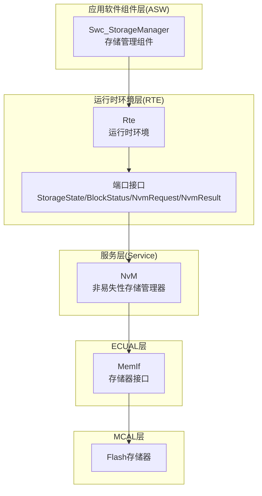
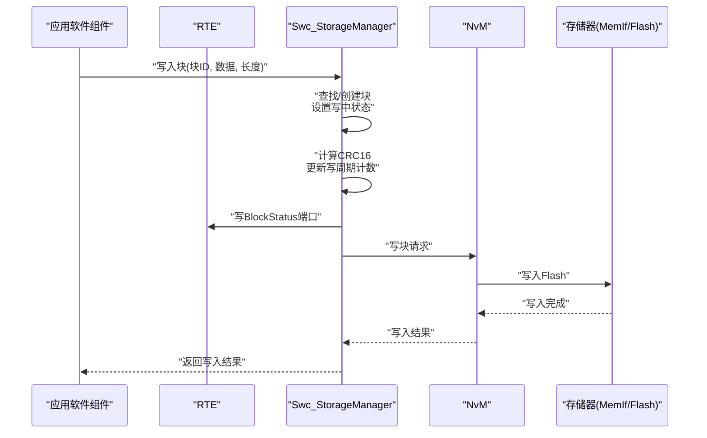
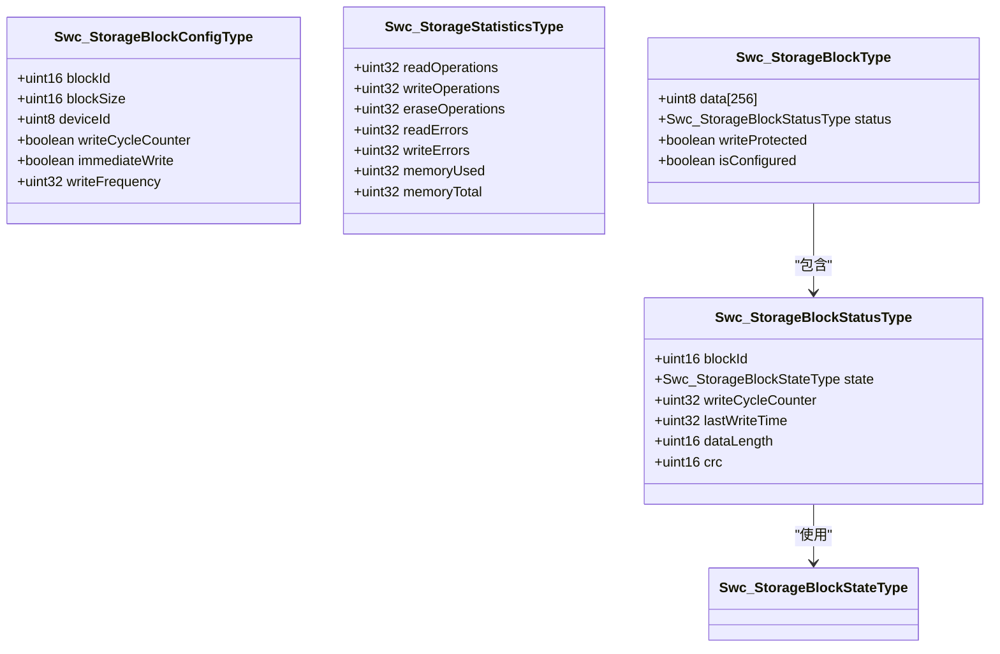
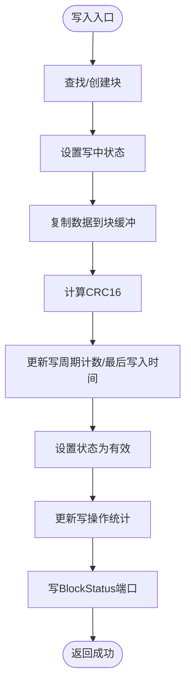
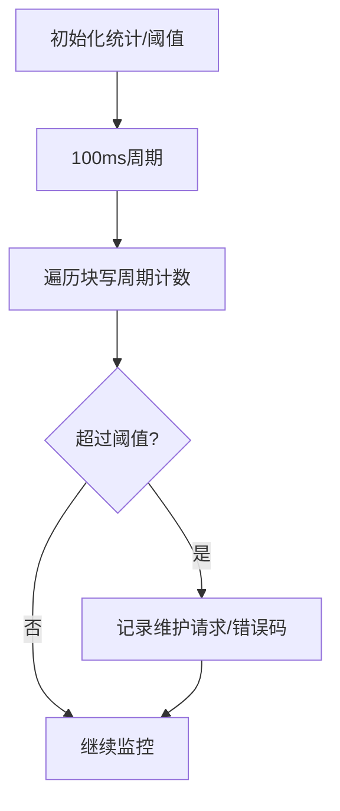
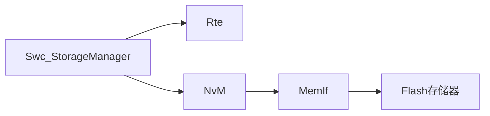

# 存储管理组件(Swc_StorageManager)

<cite>
**本文档引用的文件**
- [Swc_StorageManager.h](file://src/asw/storage_manager/include/Swc_StorageManager.h)
- [Swc_StorageManager.c](file://src/asw/storage_manager/src/Swc_StorageManager.c)
- [NvM.h](file://src/bsw/services/nvm/include/NvM.h)
- [NvM.c](file://src/bsw/services/nvm/src/NvM.c)
- [Rte.h](file://src/bsw/rte/include/Rte.h)
- [Rte.c](file://src/bsw/rte/src/Rte.c)
- [modules.md](file://docs/modules.md)
- [architecture.md](file://docs/architecture.md)
- [bsw_config.json](file://config/bsw_config.json)
</cite>

## 目录
1. [简介](#简介)
2. [项目结构](#项目结构)
3. [核心组件](#核心组件)
4. [架构总览](#架构总览)
5. [详细组件分析](#详细组件分析)
6. [依赖关系分析](#依赖关系分析)
7. [性能考虑](#性能考虑)
8. [故障排查指南](#故障排查指南)
9. [结论](#结论)
10. [附录](#附录)

## 简介
本文件为存储管理组件（Swc_StorageManager）的详细技术文档，面向应用软件组件（ASW）层，负责非易失性数据块的管理与持久化。该组件提供块级读写、状态查询、写保护、块擦除等能力，并通过运行时环境（RTE）与服务层（如NvM）进行接口对接。文档重点涵盖：
- 存储块状态管理与监控
- 数据写入策略、CRC校验与完整性保护
- 磨损均衡与写周期维护机制
- 初始化流程、读写操作与错误恢复
- 与NvM服务层的接口规范
- 存储空间管理与性能优化策略
- 存储配置示例与数据迁移方案

## 项目结构
Swc_StorageManager位于ASW层，遵循AutoSAR Classic Platform 4.x标准，采用模块化设计并通过RTE进行组件间通信。其核心文件组织如下：
- 头文件：定义组件类型、枚举、API接口与RTE端口映射
- 实现文件：提供初始化、读写、状态查询、统计与维护逻辑
- 服务层接口：与NvM进行数据持久化对接
- 运行时环境：通过RTE端口进行数据交换

图表来源
- [Swc_StorageManager.h:96-100](file://src/asw/storage_manager/include/Swc_StorageManager.h#L96-L100)
- [Swc_StorageManager.c:336](file://src/asw/storage_manager/src/Swc_StorageManager.c#L336)
- [NvM.h:195](file://src/bsw/services/nvm/include/NvM.h#L195)
- [Rte.h:316](file://src/bsw/rte/include/Rte.h#L316)

章节来源
- [Swc_StorageManager.h:107-183](file://src/asw/storage_manager/include/Swc_StorageManager.h#L107-L183)
- [Swc_StorageManager.c:161-195](file://src/asw/storage_manager/src/Swc_StorageManager.c#L161-L195)
- [modules.md:474-490](file://docs/modules.md#L474-L490)

## 核心组件
本组件提供以下核心能力：
- 存储块管理：块ID、大小、设备号、写周期计数、立即写入策略、写频率等配置
- 状态监控：块状态、写周期计数、最后写入时间、数据长度、CRC校验值
- 统计信息：读写擦除次数、读写错误数、已用/总内存
- 运行期维护：100ms周期统计更新、写周期阈值检查、写保护设置
- 数据完整性：CRC16校验、状态机保护（写中/有效/无效/不一致）
- 与NvM接口：通过RTE端口发送请求、接收结果

章节来源
- [Swc_StorageManager.h:28-71](file://src/asw/storage_manager/include/Swc_StorageManager.h#L28-L71)
- [Swc_StorageManager.h:107-183](file://src/asw/storage_manager/include/Swc_StorageManager.h#L107-L183)
- [Swc_StorageManager.c:37-49](file://src/asw/storage_manager/src/Swc_StorageManager.c#L37-L49)

## 架构总览
Swc_StorageManager作为ASW组件，通过RTE端口与服务层NvM交互，实现块级数据的读写与持久化。组件内部维护本地块数组与统计信息，周期性更新并进行写周期监控。

图表来源
- [Swc_StorageManager.c:280-339](file://src/asw/storage_manager/src/Swc_StorageManager.c#L280-L339)
- [Swc_StorageManager.c:335-336](file://src/asw/storage_manager/src/Swc_StorageManager.c#L335-L336)
- [NvM.h:235](file://src/bsw/services/nvm/include/NvM.h#L235)

## 详细组件分析

### 存储块状态与数据结构
- 存储块状态枚举：EMPTY/VALID/INVALID/INCONSISTENT/WRITING，用于标识块的当前状态
- 存储块状态结构体：包含块ID、状态、写周期计数、最后写入时间、数据长度、CRC
- 存储块配置结构体：块ID、块大小、设备号、是否启用写周期计数、是否立即写入、写频率
- 统计信息结构体：读写擦除次数、读写错误数、已用/总内存

图表来源
- [Swc_StorageManager.h:64-84](file://src/asw/storage_manager/include/Swc_StorageManager.h#L64-L84)
- [Swc_StorageManager.c:37-42](file://src/asw/storage_manager/src/Swc_StorageManager.c#L37-L42)

章节来源
- [Swc_StorageManager.h:28-71](file://src/asw/storage_manager/include/Swc_StorageManager.h#L28-L71)
- [Swc_StorageManager.c:37-49](file://src/asw/storage_manager/src/Swc_StorageManager.c#L37-L49)

### 数据写入策略与CRC校验
- 写入流程：查找或创建块 -> 设置写中状态 -> 复制数据 -> 计算CRC16 -> 更新写周期计数与最后写入时间 -> 设置状态为有效 -> 更新统计 -> 通过RTE上报块状态
- CRC校验：采用CRC16算法对写入数据进行校验，存储于块状态结构体中，用于后续读取时的数据完整性验证
- 立即写入策略：配置项支持立即写入，便于实时性要求较高的场景

图表来源
- [Swc_StorageManager.c:295-339](file://src/asw/storage_manager/src/Swc_StorageManager.c#L295-L339)

章节来源
- [Swc_StorageManager.c:100-118](file://src/asw/storage_manager/src/Swc_StorageManager.c#L100-L118)
- [Swc_StorageManager.c:314-330](file://src/asw/storage_manager/src/Swc_StorageManager.c#L314-L330)

### 磨损均衡与写周期维护
- 写周期阈值：当块的写周期计数超过阈值时，触发维护逻辑（当前实现记录错误码，实际磨损均衡可在扩展中实现）
- 维护Runnable：每周期扫描块写周期计数，为后续磨损均衡策略提供依据
- 写保护：支持对块设置写保护，防止意外写入

图表来源
- [Swc_StorageManager.c:141-152](file://src/asw/storage_manager/src/Swc_StorageManager.c#L141-L152)
- [Swc_StorageManager.c:216-231](file://src/asw/storage_manager/src/Swc_StorageManager.c#L216-L231)

章节来源
- [Swc_StorageManager.c:141-152](file://src/asw/storage_manager/src/Swc_StorageManager.c#L141-L152)
- [Swc_StorageManager.c:216-231](file://src/asw/storage_manager/src/Swc_StorageManager.c#L216-L231)

### 数据完整性保护机制
- 状态机保护：写入过程中块状态为WRITING，避免并发读取导致的数据不一致
- CRC校验：写入时计算CRC16，读取前验证状态，确保数据完整性
- 不一致状态：当检测到数据损坏或校验失败时，可标记为INCONSISTENT，便于上层处理

章节来源
- [Swc_StorageManager.c:257-261](file://src/asw/storage_manager/src/Swc_StorageManager.c#L257-L261)
- [Swc_StorageManager.c:314-330](file://src/asw/storage_manager/src/Swc_StorageManager.c#L314-L330)

### 存储初始化流程
- 初始化步骤：清空块状态、设置默认值、初始化统计信息、标记初始化完成
- 错误上报：通过DET上报初始化完成事件
- 生命周期：仅在首次调用时执行初始化，后续重复调用直接返回

章节来源
- [Swc_StorageManager.c:161-195](file://src/asw/storage_manager/src/Swc_StorageManager.c#L161-L195)

### 数据读写操作
- 读取操作：校验参数与初始化状态 -> 查找块 -> 验证块状态 -> 复制数据 -> 更新统计
- 写入操作：校验参数与初始化状态 -> 查找/创建块 -> 写保护检查 -> 设置写中状态 -> 计算CRC -> 更新统计 -> 通过RTE上报状态
- 状态查询：返回指定块的当前状态
- 块擦除：清除块数据并重置状态为空
- 写保护：设置/取消写保护

章节来源
- [Swc_StorageManager.c:236-275](file://src/asw/storage_manager/src/Swc_StorageManager.c#L236-L275)
- [Swc_StorageManager.c:280-339](file://src/asw/storage_manager/src/Swc_StorageManager.c#L280-L339)
- [Swc_StorageManager.c:344-366](file://src/asw/storage_manager/src/Swc_StorageManager.c#L344-L366)
- [Swc_StorageManager.c:400-432](file://src/asw/storage_manager/src/Swc_StorageManager.c#L400-L432)
- [Swc_StorageManager.c:454-473](file://src/asw/storage_manager/src/Swc_StorageManager.c#L454-L473)

### 错误恢复处理
- 参数错误：空指针、长度为0、超出块大小等返回无效数据错误
- 初始化未完成：返回未就绪错误
- 块不存在：返回无效块错误
- 写保护：返回写保护错误
- 内存不足：返回内存满错误
- 读取错误：统计读取错误数，返回未就绪错误

章节来源
- [Swc_StorageManager.c:242-248](file://src/asw/storage_manager/src/Swc_StorageManager.c#L242-L248)
- [Swc_StorageManager.c:253-261](file://src/asw/storage_manager/src/Swc_StorageManager.c#L253-L261)
- [Swc_StorageManager.c:300-302](file://src/asw/storage_manager/src/Swc_StorageManager.c#L300-L302)
- [Swc_StorageManager.c:310-312](file://src/asw/storage_manager/src/Swc_StorageManager.c#L310-L312)
- [Swc_StorageManager.c:411-413](file://src/asw/storage_manager/src/Swc_StorageManager.c#L411-L413)

### 与NvM服务层的接口规范
- 请求端口：通过RTE写入NVM请求端口，传递块状态与数据
- 结果端口：通过RTE读取NVM结果端口，获取写入结果
- 数据持久化：NvM负责块级数据的最终落盘与冗余处理
- 错误码：遵循NvM错误码规范，支持完整性失败、块跳过、从ROM恢复等

章节来源
- [Swc_StorageManager.h:197-201](file://src/asw/storage_manager/include/Swc_StorageManager.h#L197-L201)
- [NvM.h:81-92](file://src/bsw/services/nvm/include/NvM.h#L81-L92)

## 依赖关系分析
Swc_StorageManager依赖关系清晰，遵循AutoSAR分层架构：
- 上层：RTE（组件通信与调度）
- 下层：NvM（非易失性存储管理）、MemIf（存储器接口）、Flash（物理存储）

图表来源
- [Swc_StorageManager.c:335-336](file://src/asw/storage_manager/src/Swc_StorageManager.c#L335-L336)
- [NvM.h:195](file://src/bsw/services/nvm/include/NvM.h#L195)

章节来源
- [architecture.md:340-376](file://docs/architecture.md#L340-L376)
- [modules.md:474-490](file://docs/modules.md#L474-L490)

## 性能考虑
- 内存布局：使用静态数组存储块数据，减少动态分配开销
- 查找算法：线性查找块，适合小规模块数量；大规模场景建议采用哈希表或二分查找
- CRC计算：采用16位CRC算法，计算效率高，适合实时性要求场景
- 统计更新：100ms周期更新统计，避免频繁I/O操作
- 写保护：通过布尔标志快速判断写入权限，减少分支开销

## 故障排查指南
- 初始化失败：检查初始化函数是否被正确调用，确认RTE已启动
- 读取失败：确认块状态为VALID，检查数据长度与CRC一致性
- 写入失败：检查写保护状态、块是否存在、内存是否充足
- 维护告警：关注写周期阈值触发日志，评估磨损均衡策略
- NvM通信：检查RTE端口连接状态与数据有效性

章节来源
- [Swc_StorageManager.c:193-194](file://src/asw/storage_manager/src/Swc_StorageManager.c#L193-L194)
- [Swc_StorageManager.c:258-261](file://src/asw/storage_manager/src/Swc_StorageManager.c#L258-L261)
- [Swc_StorageManager.c:310-312](file://src/asw/storage_manager/src/Swc_StorageManager.c#L310-L312)

## 结论
Swc_StorageManager提供了完整的块级存储管理能力，具备状态监控、CRC校验、写保护与统计信息等特性。通过与RTE和NvM的协作，实现了可靠的数据持久化与完整性保护。未来可进一步完善磨损均衡策略与块查找算法，以提升大规模场景下的性能与可靠性。

## 附录

### 存储配置示例
- 块配置参数：块ID、块大小、设备号、写周期计数开关、立即写入开关、写频率
- 典型配置：块大小256字节，最大32个块，写周期阈值100000次

章节来源
- [Swc_StorageManager.h:52-59](file://src/asw/storage_manager/include/Swc_StorageManager.h#L52-L59)
- [Swc_StorageManager.c:25-32](file://src/asw/storage_manager/src/Swc_StorageManager.c#L25-L32)

### 数据迁移方案
- 块迁移：当写周期接近阈值时，触发迁移流程，将有效数据迁移到新块并标记旧块为无效
- 冗余策略：结合NvM的冗余存储机制，提高数据可靠性
- 回滚机制：迁移失败时回滚至原状态，保证系统可用性

章节来源
- [Swc_StorageManager.c:146-151](file://src/asw/storage_manager/src/Swc_StorageManager.c#L146-L151)
- [NvM.c:1878-1905](file://src/bsw/services/nvm/src/NvM.c#L1878-L1905)