# 应用软件层(ASW)

<cite>
**本文档引用的文件**
- [asw_interfaces.h](file://src/asw/asw_interfaces.h)
- [Swc_EngineControl.h](file://src/asw/engine_control/include/Swc_EngineControl.h)
- [Swc_EngineControl.c](file://src/asw/engine_control/src/Swc_EngineControl.c)
- [Swc_CommunicationManager.h](file://src/asw/communication_manager/include/Swc_CommunicationManager.h)
- [Swc_CommunicationManager.c](file://src/asw/communication_manager/src/Swc_CommunicationManager.c)
- [Swc_DiagnosticManager.h](file://src/asw/diagnostic_manager/include/Swc_DiagnosticManager.h)
- [Swc_DiagnosticManager.c](file://src/asw/diagnostic_manager/src/Swc_DiagnosticManager.c)
- [Swc_IOControl.h](file://src/asw/io_control/include/Swc_IOControl.h)
- [Swc_IOControl.c](file://src/asw/io_control/src/Swc_IOControl.c)
- [Swc_ModeManager.h](file://src/asw/mode_manager/include/Swc_ModeManager.h)
- [Swc_ModeManager.c](file://src/asw/mode_manager/src/Swc_ModeManager.c)
- [Swc_StorageManager.h](file://src/asw/storage_manager/include/Swc_StorageManager.h)
- [Swc_StorageManager.c](file://src/asw/storage_manager/src/Swc_StorageManager.c)
- [Swc_VehicleDynamics.h](file://src/asw/vehicle_dynamics/include/Swc_VehicleDynamics.h)
- [Swc_VehicleDynamics.c](file://src/asw/vehicle_dynamics/src/Swc_VehicleDynamics.c)
- [Swc_WatchdogManager.h](file://src/asw/watchdog_manager/include/Swc_WatchdogManager.h)
- [Swc_WatchdogManager.c](file://src/asw/watchdog_manager/src/Swc_WatchdogManager.c)
</cite>

## 目录
1. [引言](#引言)
2. [项目结构](#项目结构)
3. [核心组件](#核心组件)
4. [架构总览](#架构总览)
5. [详细组件分析](#详细组件分析)
6. [依赖关系分析](#依赖关系分析)
7. [性能考虑](#性能考虑)
8. [故障排查指南](#故障排查指南)
9. [结论](#结论)

## 引言
本技术文档面向应用软件层（ASW）的8个核心组件，系统性阐述其功能实现、接口规范、状态管理、事件处理以及与运行时环境（RTE）的交互方式。文档旨在帮助开发者快速理解各组件职责边界、数据流与控制流，并提供可操作的集成与维护指导。

## 项目结构
ASW层位于src/asw目录下，按功能划分为8个子模块：EngineControl（发动机控制）、CommunicationManager（通信管理）、DiagnosticManager（诊断管理）、IOControl（IO控制）、ModeManager（模式管理）、StorageManager（存储管理）、VehicleDynamics（车辆动力学）、WatchdogManager（看门狗管理）。每个子模块均包含头文件（include）与实现文件（src），遵循AutoSAR Classic平台4.x风格的模块化组织。

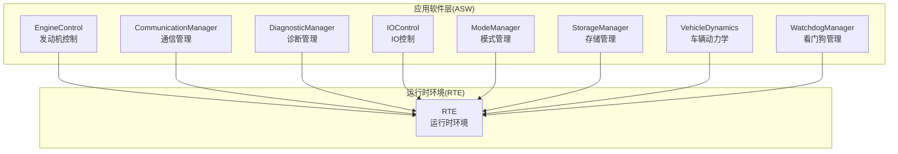

**图表来源**
- [Swc_EngineControl.h:12-183](file://src/asw/engine_control/include/Swc_EngineControl.h#L12-L183)
- [Swc_CommunicationManager.h:12-222](file://src/asw/communication_manager/include/Swc_CommunicationManager.h#L12-L222)
- [Swc_DiagnosticManager.h:12-211](file://src/asw/diagnostic_manager/include/Swc_DiagnosticManager.h#L12-L211)
- [Swc_IOControl.h:12-258](file://src/asw/io_control/include/Swc_IOControl.h#L12-L258)
- [Swc_ModeManager.h:12-217](file://src/asw/mode_manager/include/Swc_ModeManager.h#L12-L217)
- [Swc_StorageManager.h:12-204](file://src/asw/storage_manager/include/Swc_StorageManager.h#L12-L204)
- [Swc_VehicleDynamics.h:12-176](file://src/asw/vehicle_dynamics/include/Swc_VehicleDynamics.h#L12-L176)
- [Swc_WatchdogManager.h:12-202](file://src/asw/watchdog_manager/include/Swc_WatchdogManager.h#L12-L202)

**章节来源**
- [asw_interfaces.h:1-314](file://src/asw/asw_interfaces.h#L1-L314)

## 核心组件
本节概述8个组件的核心职责与关键接口能力：
- 发动机控制（EngineControl）：负责发动机状态机、参数计算与控制输出，支持多模式（经济/运动/限滑等）。
- 通信管理（CommunicationManager）：负责信号与PDU的收发、统计与超时检测，支持多总线类型。
- 诊断管理（DiagnosticManager）：提供会话切换、安全访问、DTC读写、请求处理等诊断服务。
- IO控制（IOControl）：统一管理数字/模拟/PWM输入输出，提供去抖动与统计信息。
- 模式管理（ModeManager）：协调系统模式转换、组件就绪检查与全局状态更新。
- 存储管理（StorageManager）：非易失存储块的读写、CRC校验、写保护与统计。
- 车辆动力学（VehicleDynamics）：基于轮速/转向/加速度估算车速与稳定性，计算干预策略。
- 看门狗管理（WatchdogManager）：实体存活监控、超时判定与硬件看门狗触发。

**章节来源**
- [Swc_EngineControl.h:24-183](file://src/asw/engine_control/include/Swc_EngineControl.h#L24-L183)
- [Swc_CommunicationManager.h:24-222](file://src/asw/communication_manager/include/Swc_CommunicationManager.h#L24-L222)
- [Swc_DiagnosticManager.h:24-211](file://src/asw/diagnostic_manager/include/Swc_DiagnosticManager.h#L24-L211)
- [Swc_IOControl.h:24-258](file://src/asw/io_control/include/Swc_IOControl.h#L24-L258)
- [Swc_ModeManager.h:24-217](file://src/asw/mode_manager/include/Swc_ModeManager.h#L24-L217)
- [Swc_StorageManager.h:24-204](file://src/asw/storage_manager/include/Swc_StorageManager.h#L24-L204)
- [Swc_VehicleDynamics.h:24-176](file://src/asw/vehicle_dynamics/include/Swc_VehicleDynamics.h#L24-L176)
- [Swc_WatchdogManager.h:24-202](file://src/asw/watchdog_manager/include/Swc_WatchdogManager.h#L24-L202)

## 架构总览
各组件通过RTE端口进行数据交换，形成“传感器输入→组件处理→RTE转发→执行器输出”的闭环。组件内部采用状态机与定时器驱动的可重入函数模型，确保实时性与确定性。

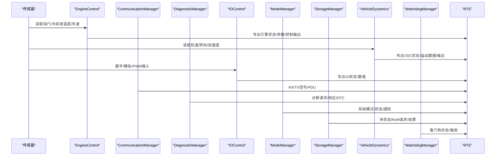

**图表来源**
- [Swc_EngineControl.c:360-394](file://src/asw/engine_control/src/Swc_EngineControl.c#L360-L394)
- [Swc_VehicleDynamics.c:337-371](file://src/asw/vehicle_dynamics/src/Swc_VehicleDynamics.c#L337-L371)
- [Swc_IOControl.c:368-406](file://src/asw/io_control/src/Swc_IOControl.c#L368-L406)
- [Swc_CommunicationManager.c:295-340](file://src/asw/communication_manager/src/Swc_CommunicationManager.c#L295-L340)
- [Swc_DiagnosticManager.c:458-531](file://src/asw/diagnostic_manager/src/Swc_DiagnosticManager.c#L458-L531)
- [Swc_ModeManager.c:317-335](file://src/asw/mode_manager/src/Swc_ModeManager.c#L317-L335)
- [Swc_StorageManager.c:200-231](file://src/asw/storage_manager/src/Swc_StorageManager.c#L200-L231)
- [Swc_WatchdogManager.c:272-307](file://src/asw/watchdog_manager/src/Swc_WatchdogManager.c#L272-L307)

## 详细组件分析

### 发动机控制组件（EngineControl）
- 业务逻辑
  - 状态机：OFF → CRANKING → RUNNING → STOPPING → FAULT，依据启动/停止条件与故障计数迁移。
  - 参数计算：根据油门位置、车速、温度计算负载与转速；在不同控制模式下调整目标怠速。
  - 输出计算：燃料脉宽、点火提前角、怠速目标、截止开关；过热时触发燃料截止。
- 接口规范
  - 运行周期：10ms快环与100ms慢环；状态机在慢环推进。
  - 端口：引擎状态、参数、控制输出；读取油门位置、冷却液温度、车速。
  - API：初始化、10ms/100ms/状态机Runnable；查询状态/模式；计算燃料/点火。
- 集成要点
  - 通过RTE端口写入控制输出，读取传感器输入；使用DET上报错误。
  - 支持外部PIM参数（燃料修正、点火偏置）影响输出。

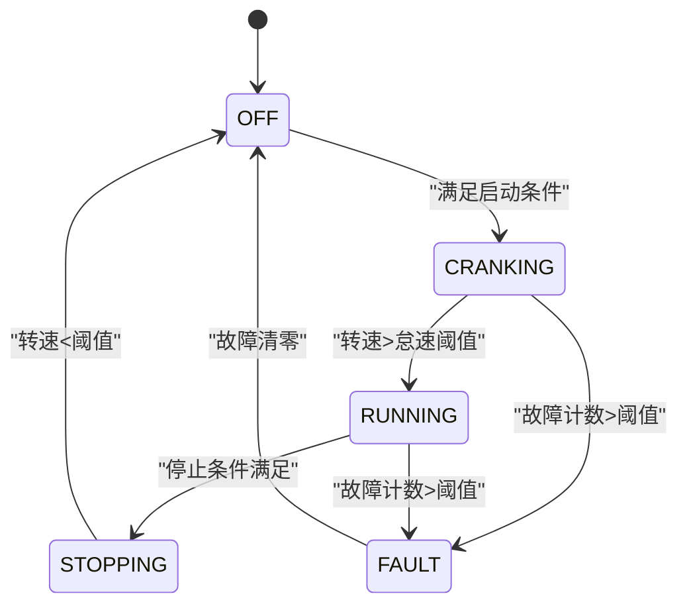

**图表来源**
- [Swc_EngineControl.c:152-202](file://src/asw/engine_control/src/Swc_EngineControl.c#L152-L202)

**章节来源**
- [Swc_EngineControl.h:24-183](file://src/asw/engine_control/include/Swc_EngineControl.h#L24-L183)
- [Swc_EngineControl.c:318-540](file://src/asw/engine_control/src/Swc_EngineControl.c#L318-L540)

### 通信管理组件（CommunicationManager）
- 业务逻辑
  - 信号与PDU管理：接收RX PDU后解析为信号，TX PDU由信号打包生成；统计收发数量与错误。
  - 超时检测：对已有效信号设置默认超时，超时则标记无效并增加超时计数。
  - 状态机：OFF → INIT → READY → ACTIVE → FAULT，受外部状态控制。
- 接口规范
  - 运行周期：10ms（超时检查+状态写出）、RX/TX处理Runnable。
  - 端口：通信状态、信号数据、PDU收发。
  - API：初始化、10ms、RX/TX Runnable；发送/接收信号/PDU；查询状态/统计。
- 集成要点
  - 通过RTE读写PDU与信号；支持最大信号与PDU数量上限；提供统计复位。

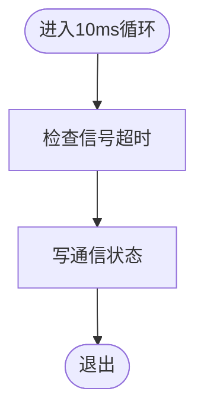

**图表来源**
- [Swc_CommunicationManager.c:295-306](file://src/asw/communication_manager/src/Swc_CommunicationManager.c#L295-L306)

**章节来源**
- [Swc_CommunicationManager.h:24-222](file://src/asw/communication_manager/include/Swc_CommunicationManager.h#L24-L222)
- [Swc_CommunicationManager.c:245-553](file://src/asw/communication_manager/src/Swc_CommunicationManager.c#L245-L553)

### 诊断管理组件（DiagnosticManager）
- 业务逻辑
  - 会话管理：默认/编程/扩展/安全系统会话，支持超时自动回退。
  - 安全访问：分级别解锁（客户/工程/制造商），种子密钥验证。
  - DTC管理：读取/清除DTC，统计故障次数与老化计数。
  - 请求处理：按服务ID分派处理，构建正/负响应。
- 接口规范
  - 运行周期：50ms（超时与状态写出）、请求处理Runnable。
  - 端口：诊断会话/安全级别、DTC状态、诊断请求/响应。
  - API：初始化、50ms、请求处理Runnable；会话切换/安全解锁；DTC查询/清除；状态查询。
- 集成要点
  - 通过RTE读取请求并写入响应；维护会话与安全超时；支持多种UDS服务。

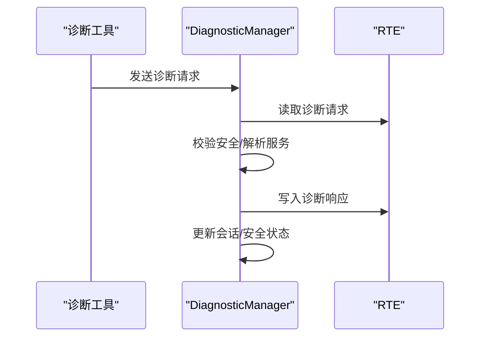

**图表来源**
- [Swc_DiagnosticManager.c:471-531](file://src/asw/diagnostic_manager/src/Swc_DiagnosticManager.c#L471-L531)

**章节来源**
- [Swc_DiagnosticManager.h:24-211](file://src/asw/diagnostic_manager/include/Swc_DiagnosticManager.h#L24-L211)
- [Swc_DiagnosticManager.c:418-686](file://src/asw/diagnostic_manager/src/Swc_DiagnosticManager.c#L418-L686)

### IO控制组件（IOControl）
- 业务逻辑
  - 数字输入：从RTE读取，带去抖动算法，稳定后更新有效标志。
  - 模拟/PWM输入：直接读取物理值与原始值，记录时间戳。
  - 输出：按需创建通道，写入RTE并统计读写次数与错误。
  - 状态：全局IO状态，支持设置/查询。
- 接口规范
  - 运行周期：10ms（数字输入处理）、50ms（模拟/PWM输入处理+状态写出）。
  - 端口：IO状态、数字/模拟/PWM输入输出。
  - API：初始化、10ms/50ms Runnable；读写数字/模拟/PWM；查询状态/统计。
- 集成要点
  - 支持多类型通道上限；提供统计复位；数字输入具备防抖配置。

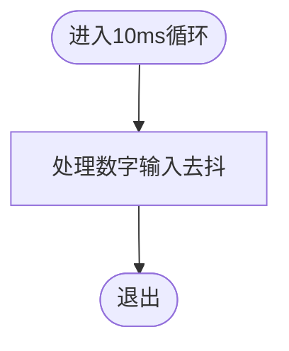

**图表来源**
- [Swc_IOControl.c:368-383](file://src/asw/io_control/src/Swc_IOControl.c#L368-L383)

**章节来源**
- [Swc_IOControl.h:24-258](file://src/asw/io_control/include/Swc_IOControl.h#L24-L258)
- [Swc_IOControl.c:282-719](file://src/asw/io_control/src/Swc_IOControl.c#L282-L719)

### 模式管理组件（ModeManager）
- 业务逻辑
  - 模式转换：基于当前模式与目标模式的有效性判断；支持强制转换与优先级比较。
  - 组件协调：向所有组件广播新模式通知，等待组件就绪确认。
  - 超时处理：转换超时则进入错误状态并上报。
- 接口规范
  - 运行周期：50ms（请求处理/转换执行/持续时间更新/状态写出）。
  - 端口：系统模式/状态、模式请求、组件模式通知。
  - API：初始化、50ms、模式切换Runnable；请求模式转换；查询当前/前一模式/系统状态；组件确认；强制转换。
- 集成要点
  - 通过RTE广播组件模式通知；维护组件就绪集合；支持系统状态映射。

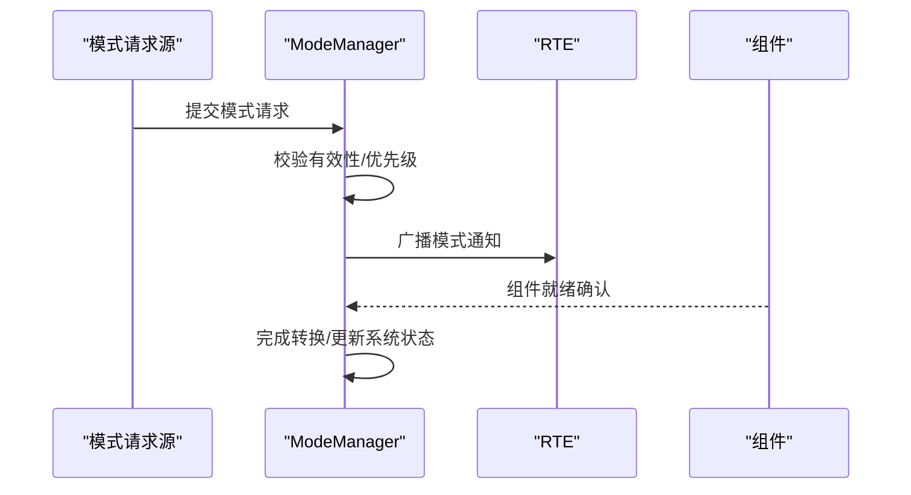

**图表来源**
- [Swc_ModeManager.c:89-120](file://src/asw/mode_manager/src/Swc_ModeManager.c#L89-L120)

**章节来源**
- [Swc_ModeManager.h:24-217](file://src/asw/mode_manager/include/Swc_ModeManager.h#L24-L217)
- [Swc_ModeManager.c:274-563](file://src/asw/mode_manager/src/Swc_ModeManager.c#L274-L563)

### 存储管理组件（StorageManager）
- 业务逻辑
  - 块管理：支持读写/失效/擦除；CRC校验；写保护；写周期统计与维护触发。
  - 统计：读/写/擦除次数与内存使用量统计。
  - 生命周期：块状态机（空/有效/无效/不一致/写入中）。
- 接口规范
  - 运行周期：100ms（统计更新/写周期检查）、写周期Runnable。
  - 端口：存储状态、块状态、NvM请求/结果。
  - API：初始化、100ms、写周期Runnable；读写块；获取块状态/统计；失效/擦除；设置写保护。
- 集成要点
  - 通过RTE写块状态；支持最大块数与单块大小限制；提供统计复位。

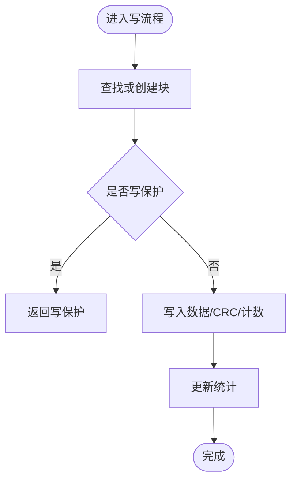

**图表来源**
- [Swc_StorageManager.c:280-339](file://src/asw/storage_manager/src/Swc_StorageManager.c#L280-L339)

**章节来源**
- [Swc_StorageManager.h:24-204](file://src/asw/storage_manager/include/Swc_StorageManager.h#L24-L204)
- [Swc_StorageManager.c:161-477](file://src/asw/storage_manager/src/Swc_StorageManager.c#L161-L477)

### 车辆动力学组件（VehicleDynamics）
- 业务逻辑
  - 运动数据：从轮速/转向/加速度推导车速与侧向加速度；目标偏航率与实际偏航率比较。
  - 稳定性：当偏航误差或侧向加速度超过阈值时进入干预状态，计算制动力分配与扭矩削减。
  - 模式：正常/运动/越野/禁用；禁用时状态为非激活。
- 接口规范
  - 运行周期：10ms（干预计算与输出写出）、20ms（目标偏航率与稳定性检查）。
  - 端口：VDC状态/运动数据/VDC输出；读取轮速/转向/加速度。
  - API：初始化、10ms/20ms Runnable；查询VDC状态/运动数据；设置VDC模式；计算滑移比/制动干预。
- 集成要点
  - 通过RTE读取传感器并写出控制输出；支持PIM灵敏度参数；具备干预计数与状态机。

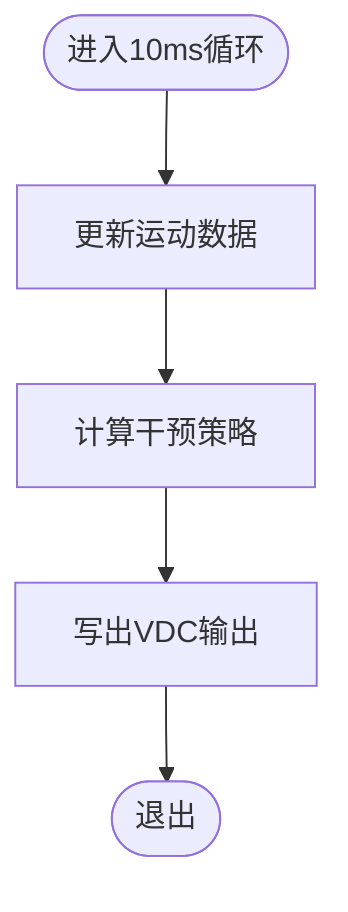

**图表来源**
- [Swc_VehicleDynamics.c:337-351](file://src/asw/vehicle_dynamics/src/Swc_VehicleDynamics.c#L337-L351)

**章节来源**
- [Swc_VehicleDynamics.h:24-176](file://src/asw/vehicle_dynamics/include/Swc_VehicleDynamics.h#L24-L176)
- [Swc_VehicleDynamics.c:292-488](file://src/asw/vehicle_dynamics/src/Swc_VehicleDynamics.c#L292-L488)

### 看门狗管理组件（WatchdogManager）
- 业务逻辑
  - 实体监督：注册/注销被监督实体，记录存活指示次数与超时；状态机跟踪正确/不正确/过期/停用。
  - 触发策略：全局状态正确时触发硬件看门狗；否则标记过期。
  - 超时处理：到期回调用于安全状态过渡与错误上报。
- 接口规范
  - 运行周期：10ms（存活计数更新/超时检查/状态写出）、触发Runnable（实体监督/周期递增/触发）。
  - 端口：看门狗状态/实体状态、存活指示、看门狗触发。
  - API：初始化、10ms、触发Runnable；实体到达（CheckpointReached）；注册/注销实体；查询状态/实体状态；设置实体活跃；全局状态检查；到期处理。
- 集成要点
  - 通过RTE写触发信号至硬件看门狗；支持窗口模式与快速模式配置；维护实体数量与周期。

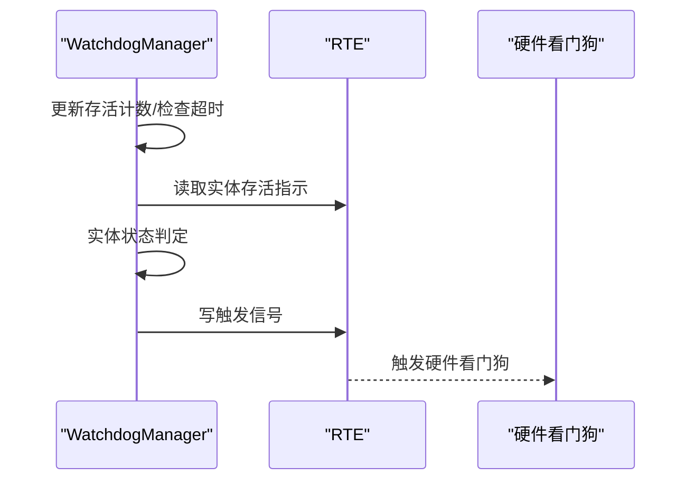

**图表来源**
- [Swc_WatchdogManager.c:139-182](file://src/asw/watchdog_manager/src/Swc_WatchdogManager.c#L139-L182)

**章节来源**
- [Swc_WatchdogManager.h:24-202](file://src/asw/watchdog_manager/include/Swc_WatchdogManager.h#L24-L202)
- [Swc_WatchdogManager.c:222-520](file://src/asw/watchdog_manager/src/Swc_WatchdogManager.c#L222-L520)

## 依赖关系分析
- 组件间耦合
  - 低耦合：各组件通过RTE端口解耦，仅在数据流上存在间接依赖。
  - 外部依赖：均依赖RTE与DET；部分组件依赖底层MCAL（如看门狗驱动）。
- 关键依赖链
  - 传感器→各组件→RTE→执行器/驱动
  - 模式管理→各组件模式通知→组件就绪确认→模式完成
  - 看门狗管理→各组件存活指示→硬件看门狗触发

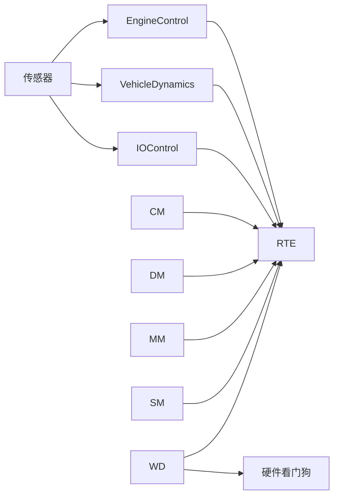

**图表来源**
- [Swc_EngineControl.c:360-394](file://src/asw/engine_control/src/Swc_EngineControl.c#L360-L394)
- [Swc_VehicleDynamics.c:337-371](file://src/asw/vehicle_dynamics/src/Swc_VehicleDynamics.c#L337-L371)
- [Swc_WatchdogManager.c:204-213](file://src/asw/watchdog_manager/src/Swc_WatchdogManager.c#L204-L213)

## 性能考虑
- 周期性Runnable
  - 各组件按固定周期运行，避免长任务阻塞；建议将耗时计算拆分到多个周期。
- 内存与统计
  - 通信/IO/存储组件维护大量统计与缓冲区，注意上限配置与溢出防护。
- 实时性
  - 看门狗管理与车辆动力学对实时性要求较高，应保证10ms/20ms周期的稳定性。
- 错误上报
  - 使用DET上报错误码，便于静态分析与调试定位。

## 故障排查指南
- 初始化失败
  - 检查组件是否重复初始化；确认RTE端口可用；查看DET错误码。
- 通信异常
  - 核对信号/PDU上限与超时配置；检查RX/TX统计与错误计数。
- 诊断无响应
  - 确认安全级别与会话权限；检查请求格式与服务ID支持情况。
- IO读写失败
  - 检查通道ID是否存在；确认IO状态为ACTIVE；查看错误计数。
- 模式转换卡住
  - 检查组件就绪确认；核对转换超时；查看系统状态映射。
- 存储写入失败
  - 检查写保护、块状态、容量与CRC；关注写周期维护触发。
- 看门狗不触发
  - 检查实体注册/活跃状态；确认全局状态正确；核对触发周期与超时。

**章节来源**
- [Swc_CommunicationManager.c:345-374](file://src/asw/communication_manager/src/Swc_CommunicationManager.c#L345-L374)
- [Swc_DiagnosticManager.c:567-581](file://src/asw/diagnostic_manager/src/Swc_DiagnosticManager.c#L567-L581)
- [Swc_IOControl.c:411-437](file://src/asw/io_control/src/Swc_IOControl.c#L411-L437)
- [Swc_ModeManager.c:354-387](file://src/asw/mode_manager/src/Swc_ModeManager.c#L354-L387)
- [Swc_StorageManager.c:280-339](file://src/asw/storage_manager/src/Swc_StorageManager.c#L280-L339)
- [Swc_WatchdogManager.c:312-335](file://src/asw/watchdog_manager/src/Swc_WatchdogManager.c#L312-L335)

## 结论
ASW层8个组件以RTE为核心枢纽，围绕实时性、可靠性与可维护性设计。通过明确的状态机、定时器驱动与统计机制，组件能够协同完成从传感器采集到执行器控制的完整闭环。建议在集成阶段重点关注端口配置、超时与上限参数、以及跨组件的同步与一致性问题，确保系统整体鲁棒性与可测性。