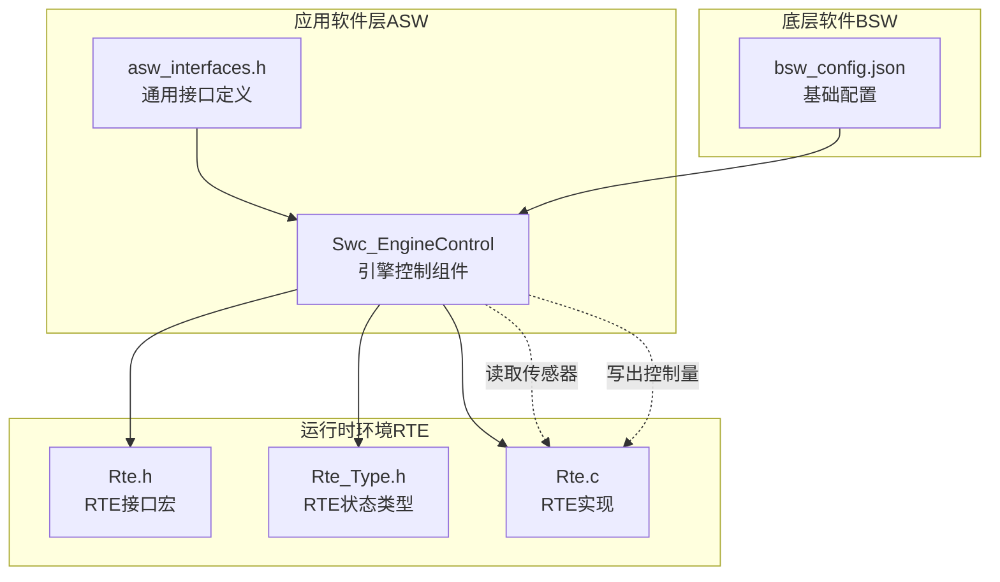
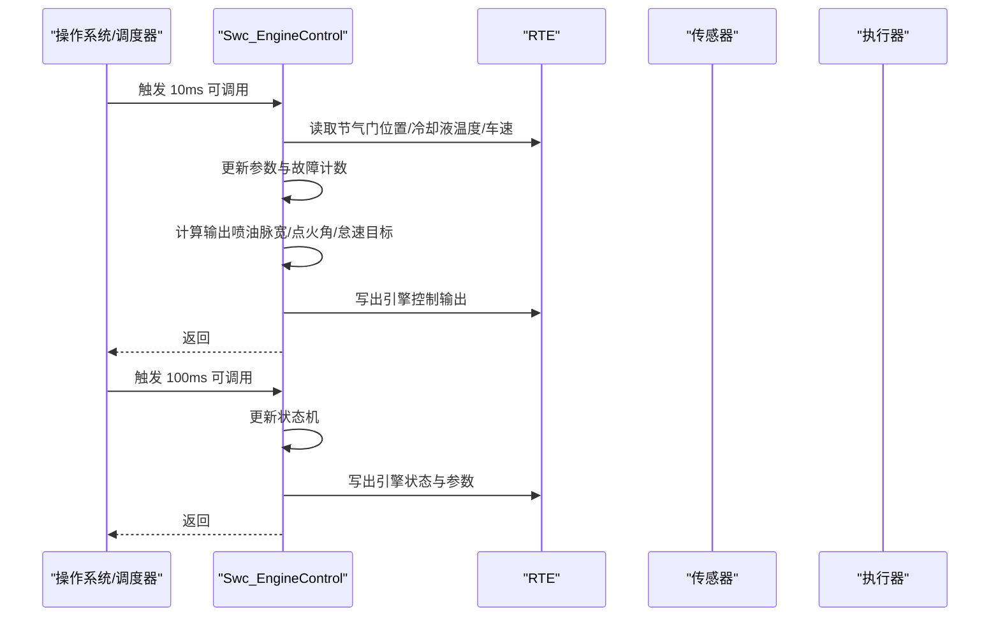
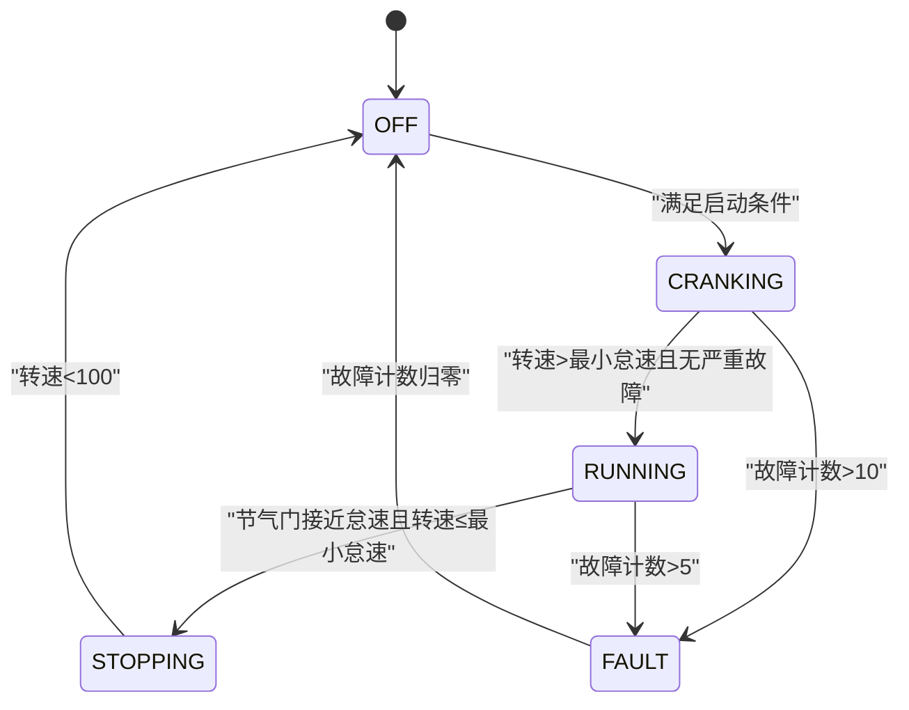
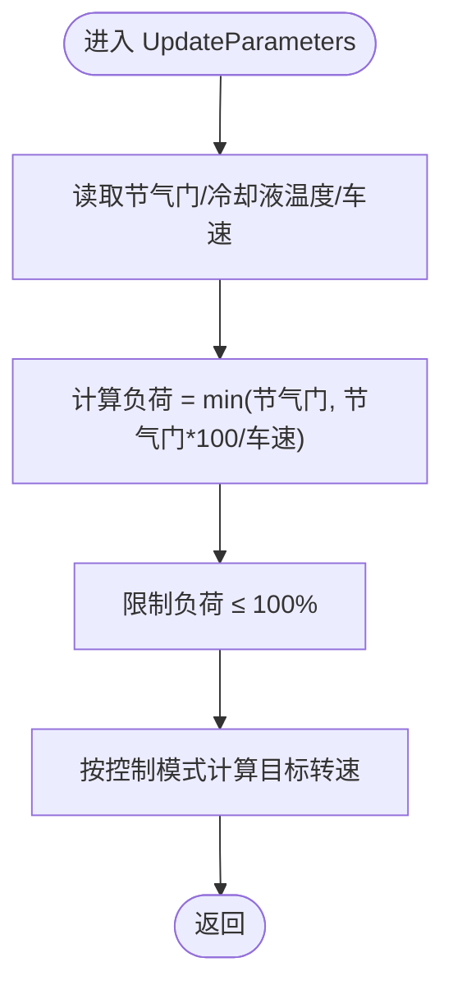
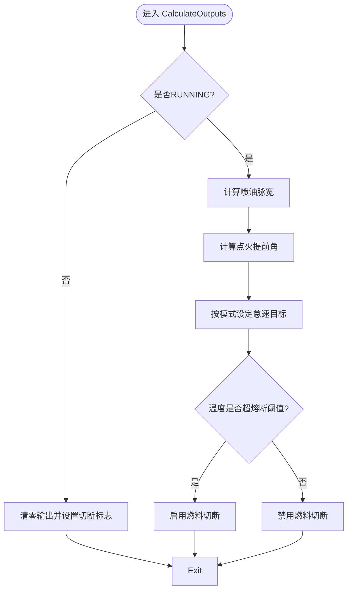
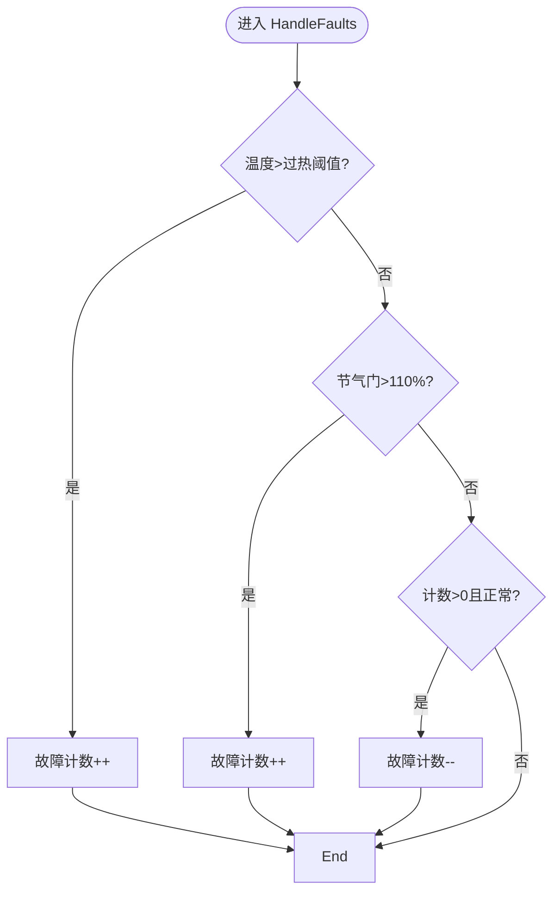
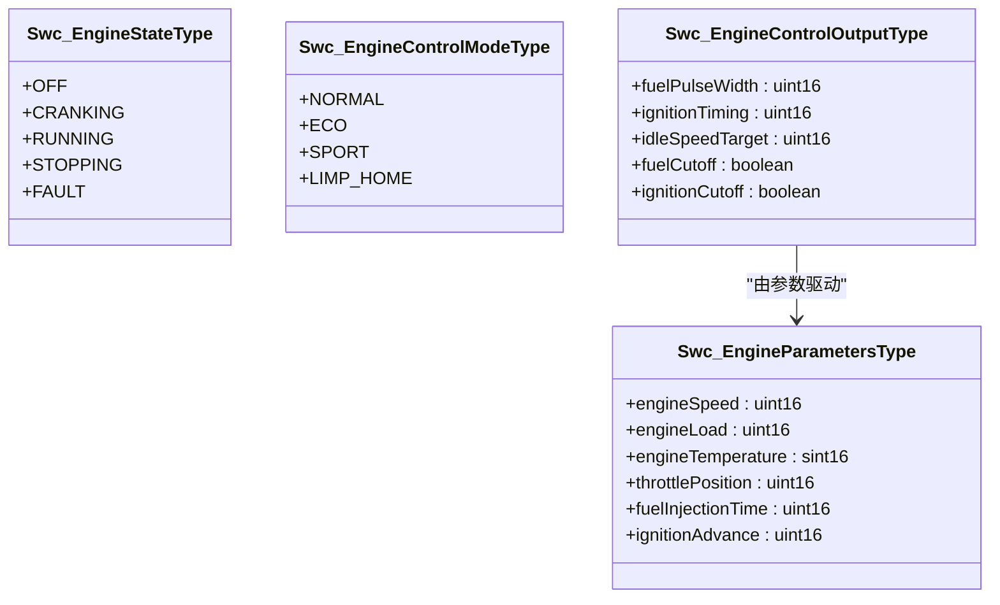
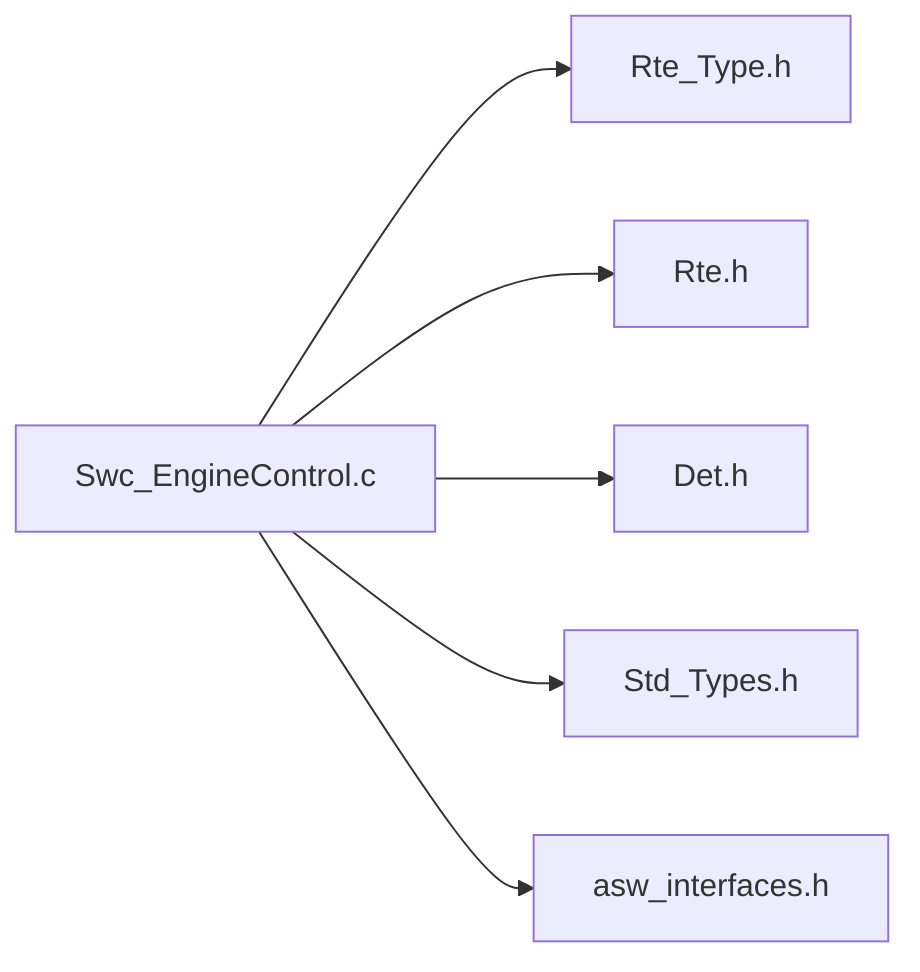

# 引擎控制组件(Swc_EngineControl)

<cite>
**本文引用的文件**
- [Swc_EngineControl.h](file://src/asw/engine_control/include/Swc_EngineControl.h)
- [Swc_EngineControl.c](file://src/asw/engine_control/src/Swc_EngineControl.c)
- [asw_interfaces.h](file://src/asw/asw_interfaces.h)
- [Rte.h](file://src/bsw/rte/include/Rte.h)
- [Rte_Type.h](file://src/bsw/rte/include/Rte_Type.h)
- [Rte.c](file://src/bsw/rte/src/Rte.c)
- [bsw_config.json](file://config/bsw_config.json)
- [integration_test.c](file://tests/integration/bsw/integration_test.c)
- [integration_test_cfg.h](file://tests/integration/integration_test_cfg.h)
</cite>

## 目录
1. [简介](#简介)
2. [项目结构](#项目结构)
3. [核心组件](#核心组件)
4. [架构总览](#架构总览)
5. [详细组件分析](#详细组件分析)
6. [依赖关系分析](#依赖关系分析)
7. [性能考虑](#性能考虑)
8. [故障排查指南](#故障排查指南)
9. [结论](#结论)
10. [附录](#附录)

## 简介
本技术文档面向引擎控制组件（Swc_EngineControl），系统性阐述其在AUTOSAR Classic平台下的实现原理与工程实践。重点覆盖：
- 引擎状态机管理：OFF、CRANKING、RUNNING、STOPPING、FAULT五态转换逻辑与触发条件
- 转速控制：基于控制模式与负荷的目标转速计算
- 负荷调节：节气门位置与车速共同决定的负荷估算
- 温度监控：过热与熔断阈值，以及冷启动富油补偿
- 点火正时控制：速度、负荷与温度的综合修正
- 数据接口：EngineState_DE、EngineParameters_DE、EngineControlOutput_DE的定义与映射
- 启动序列、正常运行模式与故障保护机制
- 传感器数据交互、执行器控制策略与安全约束
- 集成与配置示例路径指引

## 项目结构
Swc_EngineControl位于应用软件层（ASW）的engine_control子模块中，通过RTE与BSW层通信，并依赖标准类型与错误检测模块。

图表来源
- [Swc_EngineControl.h:18-182](file://src/asw/engine_control/include/Swc_EngineControl.h#L18-L182)
- [Rte.h:380-423](file://src/bsw/rte/include/Rte.h#L380-L423)
- [Rte_Type.h:38-67](file://src/bsw/rte/include/Rte_Type.h#L38-L67)
- [Rte.c:331-354](file://src/bsw/rte/src/Rte.c#L331-L354)
- [asw_interfaces.h:25-56](file://src/asw/asw_interfaces.h#L25-L56)
- [bsw_config.json:1-21](file://config/bsw_config.json#L1-L21)

章节来源
- [Swc_EngineControl.h:18-182](file://src/asw/engine_control/include/Swc_EngineControl.h#L18-L182)
- [asw_interfaces.h:25-56](file://src/asw/asw_interfaces.h#L25-L56)
- [Rte.h:380-423](file://src/bsw/rte/include/Rte.h#L380-L423)
- [Rte_Type.h:38-67](file://src/bsw/rte/include/Rte_Type.h#L38-L67)
- [Rte.c:331-354](file://src/bsw/rte/src/Rte.c#L331-L354)
- [bsw_config.json:1-21](file://config/bsw_config.json#L1-L21)

## 核心组件
- 引擎状态枚举（Swc_EngineStateType）
  - OFF、CRANKING、RUNNING、STOPPING、FAULT
- 控制模式枚举（Swc_EngineControlModeType）
  - NORMAL、ECO、SPORT、LIMP_HOME
- 参数结构体（Swc_EngineParametersType）
  - 发动机转速、负荷、冷却液温度、节气门位置、喷油脉宽、点火提前角
- 输出结构体（Swc_EngineControlOutputType）
  - 喷油脉宽、点火角度、怠速目标转速、燃料/点火切断标志
- 运行可调用（Runnable）
  - 初始化、10ms快环、100ms慢环、状态机
- 接口端口
  - 引擎状态发送、引擎参数发送、引擎控制输出发送
  - 节气门位置接收、冷却液温度接收、车速接收
  - 模式切换接口

章节来源
- [Swc_EngineControl.h:28-67](file://src/asw/engine_control/include/Swc_EngineControl.h#L28-L67)
- [Swc_EngineControl.h:72-86](file://src/asw/engine_control/include/Swc_EngineControl.h#L72-L86)
- [Swc_EngineControl.h:96-150](file://src/asw/engine_control/include/Swc_EngineControl.h#L96-L150)

## 架构总览
Swc_EngineControl采用“快慢环+状态机”的经典控制架构：
- 快环（10ms）：更新参数、故障检测、输出计算、写RTE
- 慢环（100ms）：状态机推进、写引擎状态与参数
- 状态机：根据启动/停止条件与故障计数进行状态迁移
- 数据流：通过RTE端口读取传感器，写入执行器控制量

图表来源
- [Swc_EngineControl.c:360-394](file://src/asw/engine_control/src/Swc_EngineControl.c#L360-L394)
- [Swc_EngineControl.h:169-176](file://src/asw/engine_control/include/Swc_EngineControl.h#L169-L176)
- [Swc_EngineControl.h:160-167](file://src/asw/engine_control/include/Swc_EngineControl.h#L160-L167)

## 详细组件分析

### 引擎状态机
状态机实现五态模型，支持从OFF到CRANKING再到RUNNING的启动过程，以及从RUNNING到STOPPING再回到OFF的停机过程；当故障计数超过阈值时进入FAULT态，故障消除后自动回到OFF。

图表来源
- [Swc_EngineControl.c:152-202](file://src/asw/engine_control/src/Swc_EngineControl.c#L152-L202)
- [Swc_EngineControl.c:281-309](file://src/asw/engine_control/src/Swc_EngineControl.c#L281-L309)

章节来源
- [Swc_EngineControl.c:152-202](file://src/asw/engine_control/src/Swc_EngineControl.c#L152-L202)
- [Swc_EngineControl.c:281-309](file://src/asw/engine_control/src/Swc_EngineControl.c#L281-L309)

### 参数更新与传感器交互
- 读取节气门位置、冷却液温度、车速
- 计算发动机负荷：优先使用节气门与车速比值，上限100%
- 基于控制模式与负荷计算目标转速

图表来源
- [Swc_EngineControl.c:101-147](file://src/asw/engine_control/src/Swc_EngineControl.c#L101-L147)

章节来源
- [Swc_EngineControl.c:101-147](file://src/asw/engine_control/src/Swc_EngineControl.c#L101-L147)

### 输出计算与控制策略
- 喷油脉宽：基础时间+负荷修正+速度修正+温度修正（冷启动富油、热机稀释）+PIM修正，限幅处理
- 点火提前角：基础值+速度修正+负荷修正+温度修正（极冷/极热退后）+PIM修正，限幅处理
- 怠速目标：ECO最低、SPORT最高、NORMAL居中
- 燃料切断：冷却液温度超过熔断阈值时启用
- 点火切断：当前实现未启用（保留位）

图表来源
- [Swc_EngineControl.c:207-253](file://src/asw/engine_control/src/Swc_EngineControl.c#L207-L253)
- [Swc_EngineControl.c:463-498](file://src/asw/engine_control/src/Swc_EngineControl.c#L463-L498)
- [Swc_EngineControl.c:503-536](file://src/asw/engine_control/src/Swc_EngineControl.c#L503-L536)

章节来源
- [Swc_EngineControl.c:207-253](file://src/asw/engine_control/src/Swc_EngineControl.c#L207-L253)
- [Swc_EngineControl.c:463-498](file://src/asw/engine_control/src/Swc_EngineControl.c#L463-L498)
- [Swc_EngineControl.c:503-536](file://src/asw/engine_control/src/Swc_EngineControl.c#L503-L536)

### 故障检测与保护机制
- 温度过高：超过过热阈值时故障计数递增
- 传感器异常：节气门位置异常高时故障计数递增
- 故障消退：当温度与节气门回到正常范围时递减计数
- 启动/停机条件：启动需温度在范围内且故障计数未超阈；停机需节气门接近怠速且转速较低

图表来源
- [Swc_EngineControl.c:258-276](file://src/asw/engine_control/src/Swc_EngineControl.c#L258-L276)

章节来源
- [Swc_EngineControl.c:258-276](file://src/asw/engine_control/src/Swc_EngineControl.c#L258-L276)
- [Swc_EngineControl.c:281-309](file://src/asw/engine_control/src/Swc_EngineControl.c#L281-L309)

### 数据模型与接口映射
- EngineState_DE：与Swc_EngineStateType一一对应
- EngineParameters_DE：包含转速、负荷、温度、节气门、喷油脉宽、点火提前角
- EngineControlOutput_DE：包含喷油脉宽、点火角度、怠速目标、燃料/点火切断标志
- 组件API：初始化、10ms/100ms可调用、状态机、获取状态/参数、设置模式、计算喷油/点火

图表来源
- [Swc_EngineControl.h:28-67](file://src/asw/engine_control/include/Swc_EngineControl.h#L28-L67)
- [asw_interfaces.h:25-56](file://src/asw/asw_interfaces.h#L25-L56)

章节来源
- [Swc_EngineControl.h:28-67](file://src/asw/engine_control/include/Swc_EngineControl.h#L28-L67)
- [asw_interfaces.h:25-56](file://src/asw/asw_interfaces.h#L25-L56)

### 启动序列、正常运行与故障保护
- 启动序列：OFF→CRANKING（满足温度与故障条件）→RUNNING（转速上升且无故障）
- 正常运行：RUNNING态下持续更新参数、计算输出、写RTE
- 停止序列：RUNNING→STOPPING（节气门接近怠速且转速下降）→OFF
- 故障保护：FAULT态仅在故障计数归零后回到OFF；温度过高时强制燃料切断

章节来源
- [Swc_EngineControl.c:152-202](file://src/asw/engine_control/src/Swc_EngineControl.c#L152-L202)
- [Swc_EngineControl.c:237-244](file://src/asw/engine_control/src/Swc_EngineControl.c#L237-L244)
- [Swc_EngineControl.c:281-309](file://src/asw/engine_control/src/Swc_EngineControl.c#L281-L309)

### 与传感器数据的交互方式
- 通过RTE端口读取节气门位置、冷却液温度、车速
- 将引擎状态、参数与控制输出通过RTE端口写出
- 模式切换通过RTE模式接口完成

章节来源
- [Swc_EngineControl.h:169-180](file://src/asw/engine_control/include/Swc_EngineControl.h#L169-L180)
- [Rte.h:380-423](file://src/bsw/rte/include/Rte.h#L380-L423)

### 执行器控制策略与安全约束
- 执行器输出：喷油脉宽、点火角度、怠速目标、燃料/点火切断
- 安全约束：温度熔断阈值触发燃料切断；冷启动富油补偿；热机稀释；速度/负荷/温度修正限幅
- 模式影响：ECO降低怠速目标，SPORT提高怠速目标

章节来源
- [Swc_EngineControl.c:207-253](file://src/asw/engine_control/src/Swc_EngineControl.c#L207-L253)
- [Swc_EngineControl.c:463-498](file://src/asw/engine_control/src/Swc_EngineControl.c#L463-L498)
- [Swc_EngineControl.c:503-536](file://src/asw/engine_control/src/Swc_EngineControl.c#L503-L536)

### 具体集成与配置示例（路径指引）
- 初始化与主循环：参考组件API与RTE接口宏
  - [Swc_EngineControl_Init:318-355](file://src/asw/engine_control/src/Swc_EngineControl.c#L318-L355)
  - [Swc_EngineControl_10ms:360-377](file://src/asw/engine_control/src/Swc_EngineControl.c#L360-L377)
  - [Swc_EngineControl_100ms:382-394](file://src/asw/engine_control/src/Swc_EngineControl.c#L382-L394)
  - [Swc_EngineControl_StateMachine:399-407](file://src/asw/engine_control/src/Swc_EngineControl.c#L399-L407)
- 获取状态/参数/设置模式
  - [Swc_EngineControl_GetEngineState:412-424](file://src/asw/engine_control/src/Swc_EngineControl.c#L412-L424)
  - [Swc_EngineControl_GetEngineParameters:446-458](file://src/asw/engine_control/src/Swc_EngineControl.c#L446-L458)
  - [Swc_EngineControl_SetControlMode:429-441](file://src/asw/engine_control/src/Swc_EngineControl.c#L429-L441)
- 计算函数
  - [Swc_EngineControl_CalculateFuelInjection:463-498](file://src/asw/engine_control/src/Swc_EngineControl.c#L463-L498)
  - [Swc_EngineControl_CalculateIgnitionTiming:503-536](file://src/asw/engine_control/src/Swc_EngineControl.c#L503-L536)
- 数据接口映射
  - [EngineState_DE/EngineParameters_DE/EngineControlOutput_DE:25-56](file://src/asw/asw_interfaces.h#L25-L56)
- RTE接口与状态类型
  - [Rte.h 接口宏:380-423](file://src/bsw/rte/include/Rte.h#L380-L423)
  - [Rte_Type.h 状态类型:38-67](file://src/bsw/rte/include/Rte_Type.h#L38-L67)
  - [Rte.c 启动/停止:331-354](file://src/bsw/rte/src/Rte.c#L331-L354)
- 基础配置
  - [bsw_config.json:1-21](file://config/bsw_config.json#L1-L21)
- 集成测试参考
  - [integration_test.c 中的RTE读取示例:1027-1031](file://tests/integration/bsw/integration_test.c#L1027-L1031)
  - [integration_test_cfg.h 引擎配置类型:92-98](file://tests/integration/integration_test_cfg.h#L92-L98)

## 依赖关系分析
- 组件对外依赖
  - 标准类型：Std_Types.h
  - RTE接口：Rte.h、Rte_Type.h
  - 错误检测：Det.h
- 组件内部耦合
  - 内部状态与参数结构体集中管理
  - 计算函数独立，便于单元测试与复用
- 外部接口
  - 传感器端口：节气门位置、冷却液温度、车速
  - 执行器端口：引擎控制输出
  - 模式端口：控制模式切换

图表来源
- [Swc_EngineControl.c:15-17](file://src/asw/engine_control/src/Swc_EngineControl.c#L15-L17)
- [Swc_EngineControl.h:18-19](file://src/asw/engine_control/include/Swc_EngineControl.h#L18-L19)
- [asw_interfaces.h:18-19](file://src/asw/asw_interfaces.h#L18-L19)

章节来源
- [Swc_EngineControl.c:15-17](file://src/asw/engine_control/src/Swc_EngineControl.c#L15-L17)
- [Swc_EngineControl.h:18-19](file://src/asw/engine_control/include/Swc_EngineControl.h#L18-L19)
- [asw_interfaces.h:18-19](file://src/asw/asw_interfaces.h#L18-L19)

## 性能考虑
- 循环周期：10ms快环用于实时控制，100ms慢环用于状态机推进与参数写回
- 计算复杂度：参数更新与输出计算均为常数时间操作，满足实时性要求
- 限幅策略：喷油脉宽与点火提前角均有限幅，避免执行器饱和与硬件损坏
- 故障抑制：温度熔断阈值与故障计数机制有效防止热失控

## 故障排查指南
- 症状：无法启动
  - 检查冷却液温度是否在允许范围内
  - 检查故障计数是否超过启动阈值
  - 参考：[启动条件检查:281-295](file://src/asw/engine_control/src/Swc_EngineControl.c#L281-L295)
- 症状：运行中突然停机
  - 检查节气门位置与转速是否满足停机条件
  - 检查是否存在故障计数溢出
  - 参考：[停机条件检查:299-309](file://src/asw/engine_control/src/Swc_EngineControl.c#L299-L309)
- 症状：温度过高报警
  - 检查温度传感器输入与熔断阈值
  - 检查故障计数是否递增
  - 参考：[故障检测:258-276](file://src/asw/engine_control/src/Swc_EngineControl.c#L258-L276)
- 症状：输出异常（喷油/点火）
  - 检查计算函数输入参数（转速、负荷、温度）
  - 检查PIM修正参数（燃料trim、点火偏置）
  - 参考：[喷油计算:463-498](file://src/asw/engine_control/src/Swc_EngineControl.c#L463-L498)、[点火计算:503-536](file://src/asw/engine_control/src/Swc_EngineControl.c#L503-L536)

章节来源
- [Swc_EngineControl.c:258-276](file://src/asw/engine_control/src/Swc_EngineControl.c#L258-L276)
- [Swc_EngineControl.c:281-309](file://src/asw/engine_control/src/Swc_EngineControl.c#L281-L309)
- [Swc_EngineControl.c:463-498](file://src/asw/engine_control/src/Swc_EngineControl.c#L463-L498)
- [Swc_EngineControl.c:503-536](file://src/asw/engine_control/src/Swc_EngineControl.c#L503-L536)

## 结论
Swc_EngineControl以清晰的状态机与快慢环架构实现了对发动机的闭环控制，具备良好的实时性与安全性。通过RTE接口与标准类型，组件与BSW层解耦良好，便于集成与测试。建议在实际部署中结合集成测试与边界条件验证，确保在极端工况下的鲁棒性。

## 附录
- 关键API与路径
  - [Swc_EngineControl_Init:318-355](file://src/asw/engine_control/src/Swc_EngineControl.c#L318-L355)
  - [Swc_EngineControl_10ms:360-377](file://src/asw/engine_control/src/Swc_EngineControl.c#L360-L377)
  - [Swc_EngineControl_100ms:382-394](file://src/asw/engine_control/src/Swc_EngineControl.c#L382-L394)
  - [Swc_EngineControl_StateMachine:399-407](file://src/asw/engine_control/src/Swc_EngineControl.c#L399-L407)
  - [Swc_EngineControl_GetEngineState:412-424](file://src/asw/engine_control/src/Swc_EngineControl.c#L412-L424)
  - [Swc_EngineControl_GetEngineParameters:446-458](file://src/asw/engine_control/src/Swc_EngineControl.c#L446-L458)
  - [Swc_EngineControl_SetControlMode:429-441](file://src/asw/engine_control/src/Swc_EngineControl.c#L429-L441)
  - [Swc_EngineControl_CalculateFuelInjection:463-498](file://src/asw/engine_control/src/Swc_EngineControl.c#L463-L498)
  - [Swc_EngineControl_CalculateIgnitionTiming:503-536](file://src/asw/engine_control/src/Swc_EngineControl.c#L503-L536)
- 数据接口
  - [EngineState_DE/EngineParameters_DE/EngineControlOutput_DE:25-56](file://src/asw/asw_interfaces.h#L25-L56)
- RTE与状态类型
  - [Rte.h 接口宏:380-423](file://src/bsw/rte/include/Rte.h#L380-L423)
  - [Rte_Type.h 状态类型:38-67](file://src/bsw/rte/include/Rte_Type.h#L38-L67)
  - [Rte.c 启动/停止:331-354](file://src/bsw/rte/src/Rte.c#L331-L354)
- 基础配置
  - [bsw_config.json:1-21](file://config/bsw_config.json#L1-L21)
- 集成测试参考
  - [integration_test.c 中的RTE读取示例:1027-1031](file://tests/integration/bsw/integration_test.c#L1027-L1031)
  - [integration_test_cfg.h 引擎配置类型:92-98](file://tests/integration/integration_test_cfg.h#L92-L98)