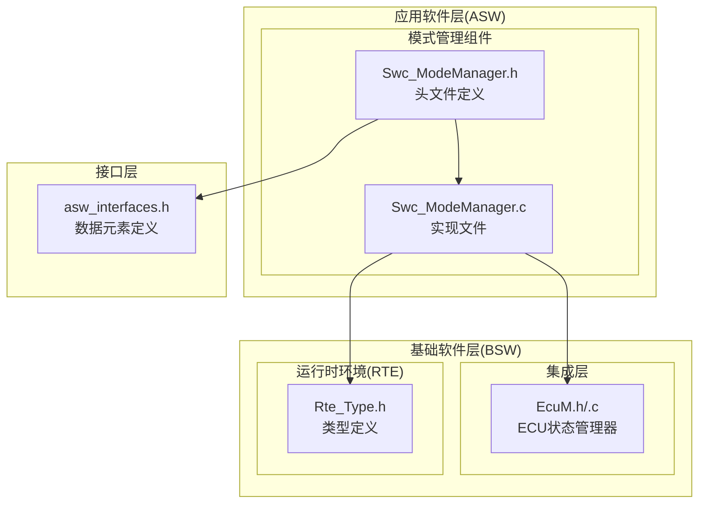
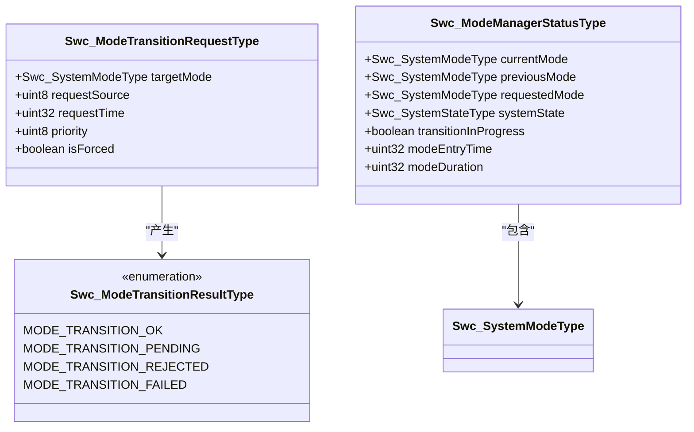
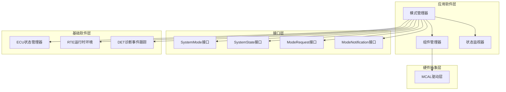
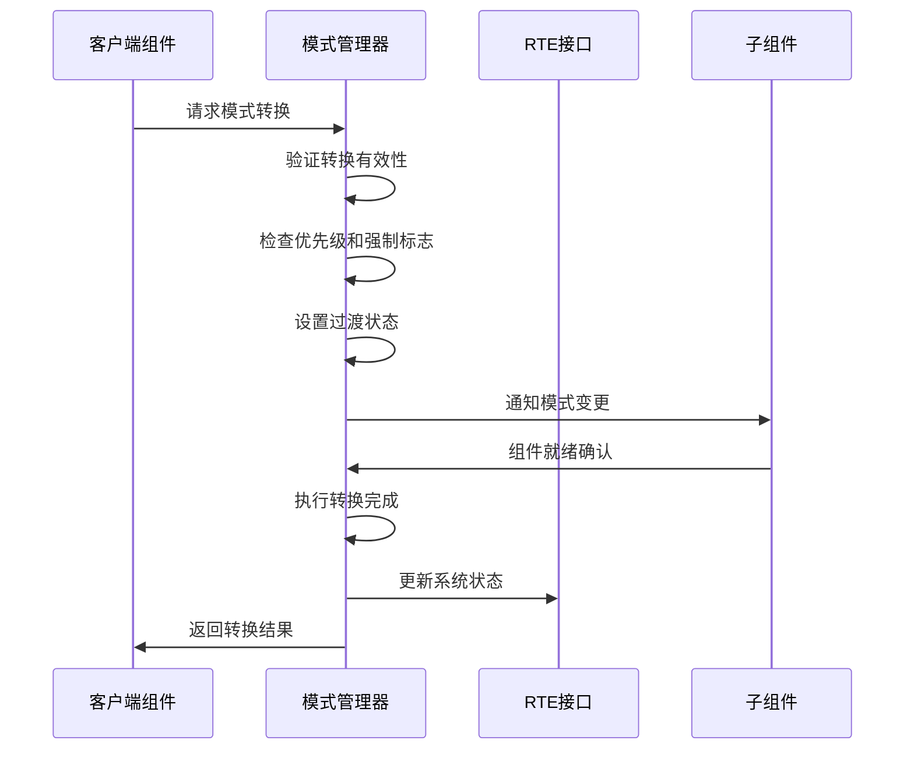
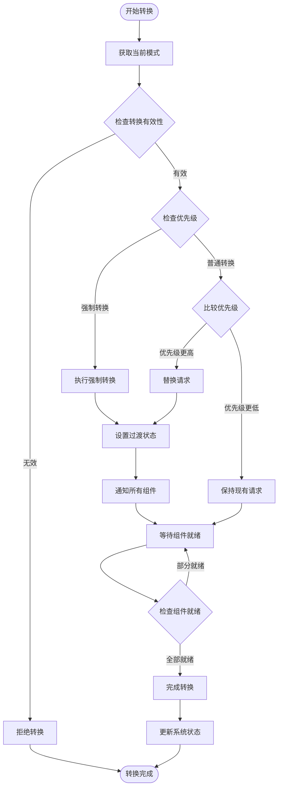
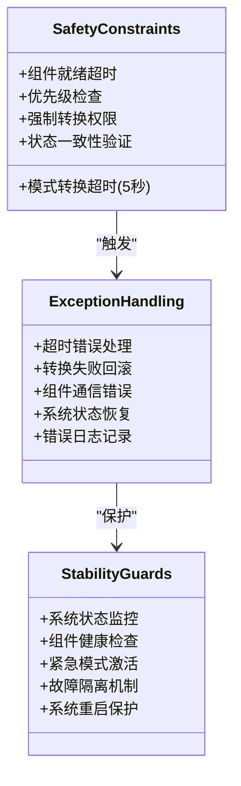
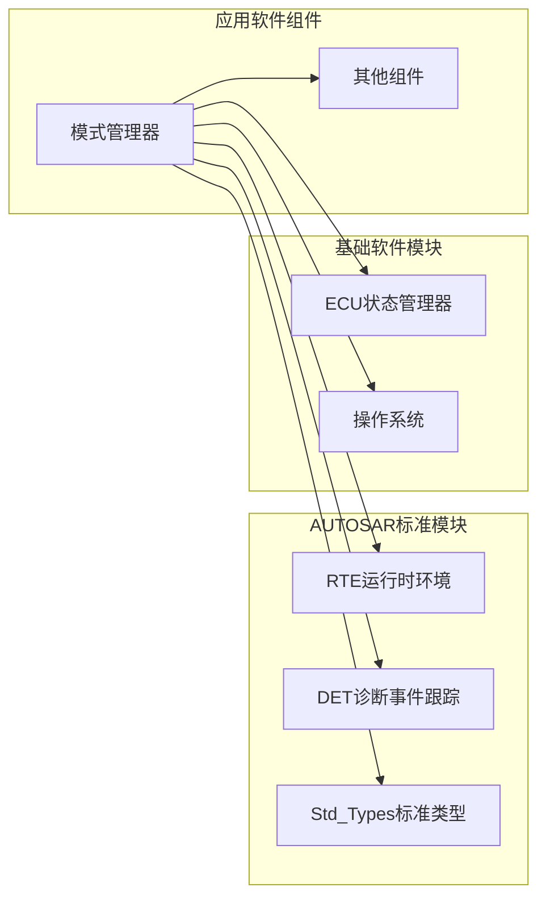
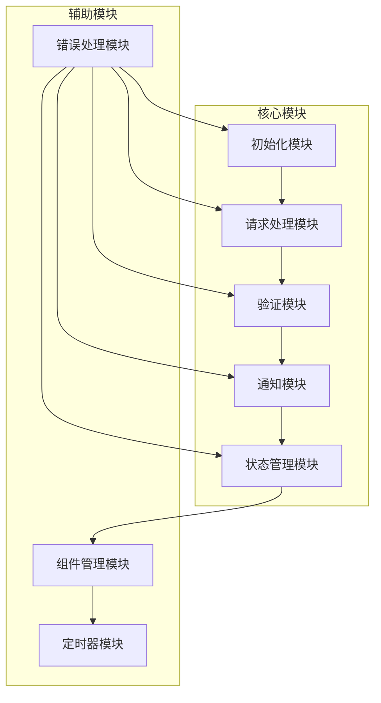

# 模式管理组件(Swc_ModeManager)

<cite>
**本文档中引用的文件**
- [Swc_ModeManager.h](file://src/asw/mode_manager/include/Swc_ModeManager.h)
- [Swc_ModeManager.c](file://src/asw/mode_manager/src/Swc_ModeManager.c)
- [asw_interfaces.h](file://src/asw/asw_interfaces.h)
- [EcuM.h](file://src/bsw/integration/EcuM.h)
- [EcuM.c](file://src/bsw/integration/EcuM.c)
- [Rte_Type.h](file://src/bsw/rte/include/Rte_Type.h)
- [asw_verification.md](file://verification/asw_verification.md)
</cite>

## 目录
1. [简介](#简介)
2. [项目结构](#项目结构)
3. [核心组件](#核心组件)
4. [架构概览](#架构概览)
5. [详细组件分析](#详细组件分析)
6. [依赖关系分析](#依赖关系分析)
7. [性能考虑](#性能考虑)
8. [故障排除指南](#故障排除指南)
9. [结论](#结论)

## 简介

Swc_ModeManager 是一个基于 AUTOSAR Classic Platform 4.x 标准的应用软件组件，专门负责系统的模式管理和状态机协调。该组件实现了完整的系统模式生命周期管理，包括启动序列、正常运行模式、诊断模式和紧急模式之间的转换控制。

该组件的核心职责是：
- 管理系统从 OFF 到 EMERGENCY 的七种模式状态
- 协调各子组件的状态同步和模式切换
- 实现优先级控制和强制模式转换机制
- 提供与 EcuM 的集成协调和系统稳定性保障

## 项目结构

模式管理组件位于 AUTOSAR 应用软件层的模式管理目录中，采用标准的 AUTOSAR 文件组织结构：

**图表来源**
- [Swc_ModeManager.h:1-217](file://src/asw/mode_manager/include/Swc_ModeManager.h#L1-217)
- [Swc_ModeManager.c:1-563](file://src/asw/mode_manager/src/Swc_ModeManager.c#L1-563)
- [EcuM.h:1-220](file://src/bsw/integration/EcuM.h#L1-220)
- [Rte_Type.h:1-361](file://src/bsw/rte/include/Rte_Type.h#L1-361)

**章节来源**
- [Swc_ModeManager.h:1-217](file://src/asw/mode_manager/include/Swc_ModeManager.h#L1-217)
- [Swc_ModeManager.c:1-563](file://src/asw/mode_manager/src/Swc_ModeManager.c#L1-563)

## 核心组件

### 系统模式枚举(SystemMode_DE)

系统模式定义了七个主要的操作状态：

| 模式编号 | 模式名称 | 描述 | 系统状态映射 |
|---------|----------|------|-------------|
| 0x00 | OFF | 系统关闭状态 | OFF |
| 0x01 | INIT | 初始化状态 | INITIALIZING |
| 0x02 | STANDBY | 待机状态 | RUNNING |
| 0x03 | NORMAL | 正常运行状态 | RUNNING |
| 0x04 | DIAGNOSTIC | 诊断状态 | READY |
| 0x05 | SLEEP | 睡眠状态 | SHUTDOWN |
| 0x06 | EMERGENCY | 紧急状态 | DEGRADED |

### 系统状态类型(SystemState_DE)

系统状态反映了整体系统健康状况：

| 状态编号 | 状态名称 | 描述 | 适用模式 |
|---------|----------|------|----------|
| 0x00 | OFF | 系统完全关闭 | OFF |
| 0x01 | INITIALIZING | 系统正在初始化 | INIT |
| 0x02 | READY | 系统准备就绪 | DIAGNOSTIC |
| 0x03 | RUNNING | 系统正常运行 | STANDBY, NORMAL |
| 0x04 | DEGRADED | 系统降级运行 | EMERGENCY |
| 0x05 | SHUTDOWN | 系统关闭过程 | SLEEP |
| 0x06 | ERROR | 系统错误状态 | 所有模式 |

### 模式转换请求结构体

**图表来源**
- [Swc_ModeManager.h:54-83](file://src/asw/mode_manager/include/Swc_ModeManager.h#L54-L83)

**章节来源**
- [Swc_ModeManager.h:28-83](file://src/asw/mode_manager/include/Swc_ModeManager.h#L28-L83)
- [asw_interfaces.h:248-277](file://src/asw/asw_interfaces.h#L248-L277)

## 架构概览

模式管理组件采用分层架构设计，实现了严格的职责分离和接口标准化：

**图表来源**
- [Swc_ModeManager.c:274-335](file://src/asw/mode_manager/src/Swc_ModeManager.c#L274-L335)
- [EcuM.c:252-342](file://src/bsw/integration/EcuM.c#L252-L342)

## 详细组件分析

### 模式转换引擎

模式转换引擎是组件的核心，负责验证和执行模式转换请求：

**图表来源**
- [Swc_ModeManager.c:354-387](file://src/asw/mode_manager/src/Swc_ModeManager.c#L354-L387)
- [Swc_ModeManager.c:125-179](file://src/asw/mode_manager/src/Swc_ModeManager.c#L125-L179)

### 状态转换验证机制

系统实现了严格的模式转换验证，确保只允许合法的状态转换：

**图表来源**
- [Swc_ModeManager.c:208-246](file://src/asw/mode_manager/src/Swc_ModeManager.c#L208-L246)
- [Swc_ModeManager.c:375-387](file://src/asw/mode_manager/src/Swc_ModeManager.c#L375-L387)

### 组件协调机制

组件协调机制确保所有子组件能够同步响应模式变化：

| 组件ID | 组件名称 | 功能描述 | 就绪检查 |
|-------|----------|----------|----------|
| 0x00 | EngineControl | 发动机控制系统 | 发动机状态就绪 |
| 0x01 | VehicleDynamics | 车辆动力学系统 | 车辆状态就绪 |
| 0x02 | DiagnosticManager | 诊断管理系统 | 诊断接口就绪 |
| 0x03 | CommunicationManager | 通信管理系统 | 通信链路就绪 |
| 0x04 | StorageManager | 存储管理系统 | 存储操作就绪 |
| 0x05 | IOControl | IO控制系统 | IO端口就绪 |
| 0x06 | WatchdogManager | 看门狗管理系统 | 监控状态就绪 |

### 安全约束和异常处理

系统实现了多层次的安全约束和异常处理机制：

**图表来源**
- [Swc_ModeManager.c:29-30](file://src/asw/mode_manager/src/Swc_ModeManager.c#L29-L30)
- [Swc_ModeManager.c:135-143](file://src/asw/mode_manager/src/Swc_ModeManager.c#L135-L143)

**章节来源**
- [Swc_ModeManager.c:208-246](file://src/asw/mode_manager/src/Swc_ModeManager.c#L208-L246)
- [Swc_ModeManager.c:125-179](file://src/asw/mode_manager/src/Swc_ModeManager.c#L125-L179)

## 依赖关系分析

### 外部依赖关系

模式管理组件依赖于多个 AUTOSAR 标准模块：

**图表来源**
- [Swc_ModeManager.c:15-18](file://src/asw/mode_manager/src/Swc_ModeManager.c#L15-L18)
- [EcuM.c:19-52](file://src/bsw/integration/EcuM.c#L19-L52)

### 内部组件依赖

组件内部实现了清晰的模块化设计：

**图表来源**
- [Swc_ModeManager.c:72-79](file://src/asw/mode_manager/src/Swc_ModeManager.c#L72-L79)

**章节来源**
- [Swc_ModeManager.c:15-18](file://src/asw/mode_manager/src/Swc_ModeManager.c#L15-L18)
- [EcuM.h:13-22](file://src/bsw/integration/EcuM.h#L13-L22)

## 性能考虑

### 时间复杂度分析

模式管理组件的时间复杂度主要取决于以下因素：

- **模式转换验证**: O(1) - 使用 switch-case 结构进行常数时间验证
- **组件就绪检查**: O(n) - 需要遍历所有已注册组件
- **模式请求处理**: O(1) - 常数时间的请求验证和处理
- **状态更新**: O(1) - 常数时间的状态更新操作

### 内存使用优化

组件采用了多种内存优化策略：

- **静态内存分配**: 关键数据结构使用静态分配，避免动态内存管理开销
- **固定大小数组**: 组件列表使用固定大小数组，减少内存碎片
- **状态机优化**: 使用枚举类型而非字符串，节省内存空间
- **缓存友好的数据结构**: 相关数据结构紧密排列，提高缓存命中率

### 实时性保证

系统确保了严格的实时性要求：

- **50ms 周期运行**: 主循环以 50ms 周期执行，满足大多数实时需求
- **非阻塞设计**: 所有操作都是非阻塞的，避免系统延迟
- **优先级队列**: 支持多优先级请求处理，确保高优先级任务及时响应
- **超时机制**: 实现了完善的超时处理，防止系统挂起

## 故障排除指南

### 常见问题诊断

| 问题症状 | 可能原因 | 解决方案 |
|----------|----------|----------|
| 模式转换被拒绝 | 非法的模式转换请求 | 检查目标模式是否在允许范围内 |
| 转换超时 | 组件未就绪或通信故障 | 检查组件状态和通信链路 |
| 系统状态不一致 | 组件确认丢失 | 实施组件重新同步机制 |
| 优先级冲突 | 多个组件同时请求转换 | 实施优先级仲裁机制 |
| 内存不足 | 组件数量超过限制 | 增加组件最大数量配置 |

### 错误代码参考

组件使用 DET (Diagnostic Event Trace) 进行错误报告：

| 错误代码 | 错误描述 | 处理建议 |
|----------|----------|----------|
| 0x01 | 组件初始化成功 | 无需处理，系统正常运行 |
| 0x50 | 模式转换超时 | 检查组件就绪状态和通信链路 |
| 0xXX | 其他错误 | 根据具体错误代码进行相应处理 |

### 调试工具和方法

推荐使用以下调试方法：

1. **状态监控**: 定期检查系统状态和模式转换历史
2. **组件跟踪**: 监控各个子组件的就绪状态
3. **时间测量**: 测量模式转换的执行时间
4. **错误日志**: 记录所有错误事件和处理结果

**章节来源**
- [Swc_ModeManager.c:140-142](file://src/asw/mode_manager/src/Swc_ModeManager.c#L140-L142)
- [asw_verification.md:158-179](file://verification/asw_verification.md#L158-L179)

## 结论

Swc_ModeManager 模式管理组件是一个设计精良、功能完整的 AUTOSAR 组件，具有以下特点：

### 技术优势

- **严格的模式管理**: 实现了完整的七种系统模式和相应的状态转换
- **可靠的组件协调**: 提供了完善的组件通知和确认机制
- **安全的转换控制**: 包含多重安全约束和异常处理机制
- **高性能设计**: 采用优化的数据结构和算法，满足实时性要求

### 架构特色

- **模块化设计**: 清晰的职责分离和接口定义
- **可扩展性**: 支持动态组件注册和配置
- **稳定性保障**: 实现了全面的错误处理和恢复机制
- **标准化接口**: 符合 AUTOSAR 标准规范

### 应用价值

该组件为整个系统的稳定运行提供了坚实的基础，确保了：
- 系统启动序列的可靠执行
- 模式转换过程的平滑过渡
- 组件间的协调一致
- 紧急情况下的安全处理

通过持续的测试验证和性能优化，Swc_ModeManager 为 YuleTech AutoSAR 平台提供了高质量的模式管理服务。