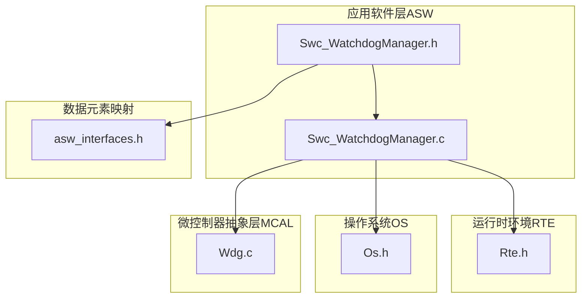
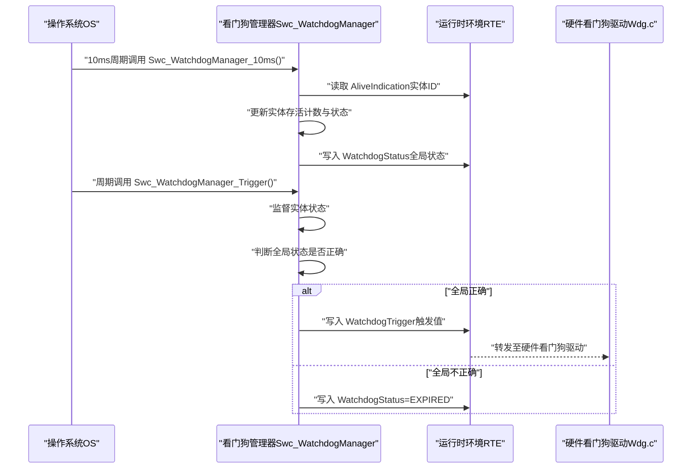
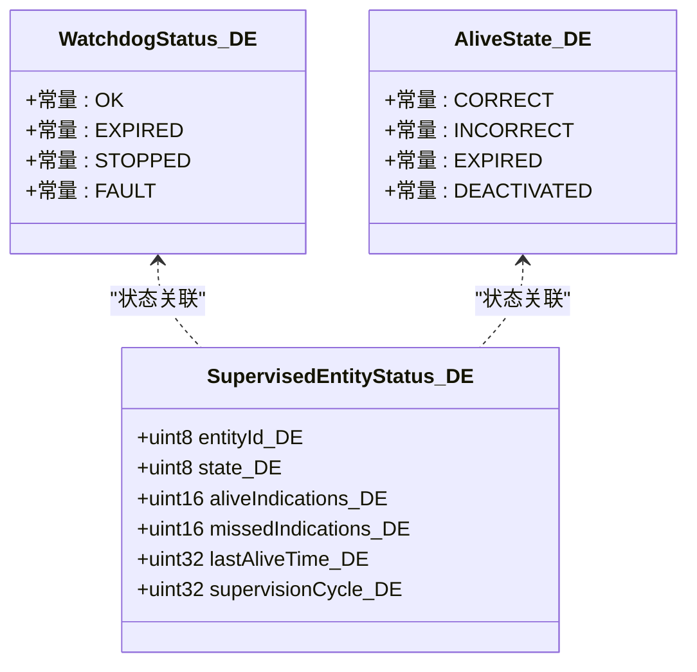
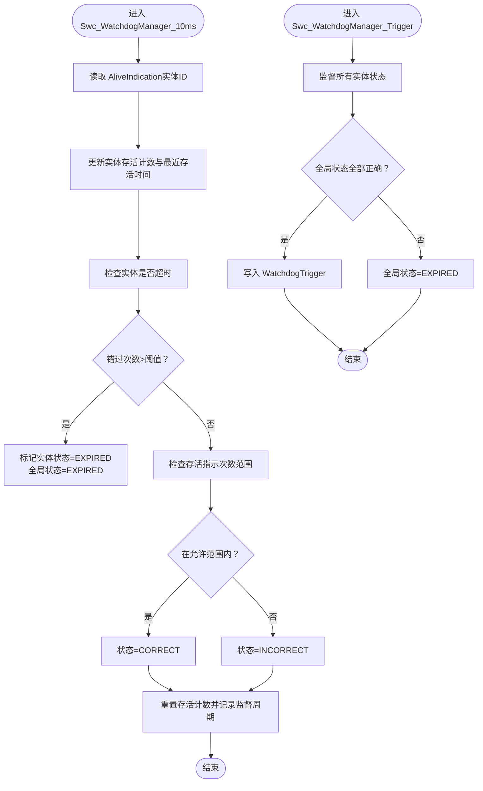
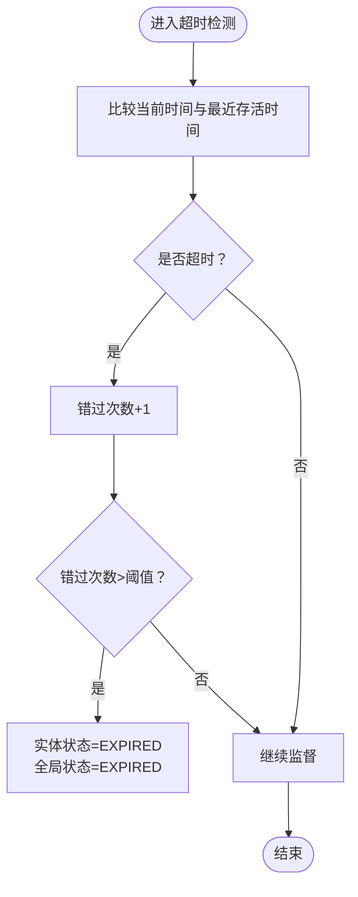
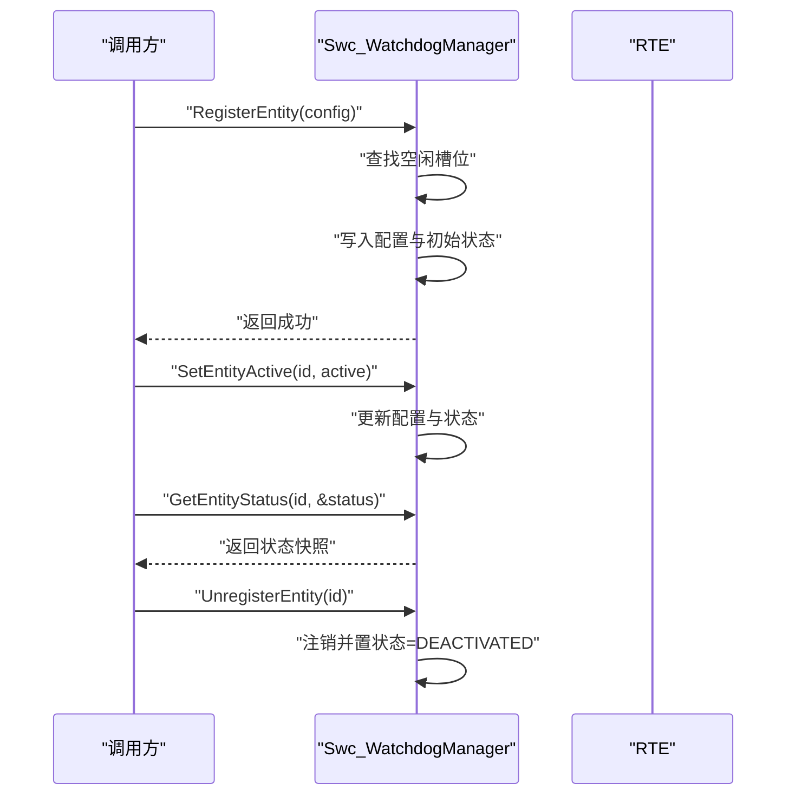
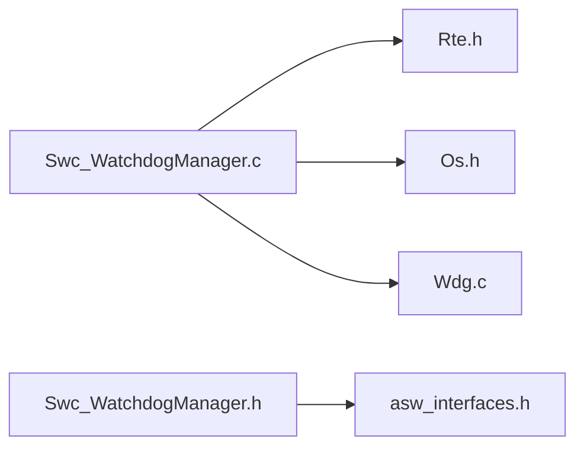

# 看门狗管理组件(Swc_WatchdogManager)

<cite>
**本文引用的文件列表**
- [Swc_WatchdogManager.h](file://src/asw/watchdog_manager/include/Swc_WatchdogManager.h)
- [Swc_WatchdogManager.c](file://src/asw/watchdog_manager/src/Swc_WatchdogManager.c)
- [asw_interfaces.h](file://src/asw/asw_interfaces.h)
- [Rte.h](file://src/bsw/rte/include/Rte.h)
- [Os.h](file://src/bsw/os/include/Os.h)
- [Wdg.c](file://src/bsw/mcal/wdg/src/Wdg.c)
- [os_verification.md](file://verification/os_verification.md)
</cite>

## 目录
1. [简介](#简介)
2. [项目结构](#项目结构)
3. [核心组件](#核心组件)
4. [架构总览](#架构总览)
5. [详细组件分析](#详细组件分析)
6. [依赖关系分析](#依赖关系分析)
7. [性能考量](#性能考量)
8. [故障排查指南](#故障排查指南)
9. [结论](#结论)
10. [附录](#附录)

## 简介
本文件为看门狗管理组件（Swc_WatchdogManager）的详细技术文档，面向具备不同技术背景的读者，系统阐述其监督机制、存活检测与故障处理的实现原理。重点包括：
- WatchdogStatus_DE、AliveState_DE、SupervisedEntityStatus_DE 的设计目的与使用场景
- 监督周期管理、存活指示处理、超时检测与故障响应机制
- 看门狗配置策略、实体注册流程与状态监控实现
- 与运行时环境（RTE）及操作系统（OS）的集成方式、中断处理与系统保护机制
- 最佳实践与故障诊断方法

## 项目结构
Swc_WatchdogManager 位于应用软件层（ASW），通过RTE与底层硬件看门狗驱动交互，并由OS进行周期性调度。关键文件组织如下：
- 接口定义：Swc_WatchdogManager.h
- 实现逻辑：Swc_WatchdogManager.c
- 数据元素映射：asw_interfaces.h（含WatchdogStatus_DE、AliveState_DE、SupervisedEntityStatus_DE）
- 运行时环境：Rte.h
- 操作系统：Os.h
- 硬件看门狗驱动：Wdg.c
- OS验证：os_verification.md

图表来源
- [Swc_WatchdogManager.h:1-202](file://src/asw/watchdog_manager/include/Swc_WatchdogManager.h#L1-L202)
- [Swc_WatchdogManager.c:1-520](file://src/asw/watchdog_manager/src/Swc_WatchdogManager.c#L1-L520)
- [Rte.h:1-200](file://src/bsw/rte/include/Rte.h#L1-L200)
- [Os.h:1-213](file://src/bsw/os/include/Os.h#L1-L213)
- [Wdg.c:162-195](file://src/bsw/mcal/wdg/src/Wdg.c#L162-L195)
- [asw_interfaces.h:282-313](file://src/asw/asw_interfaces.h#L282-L313)

章节来源
- [Swc_WatchdogManager.h:1-202](file://src/asw/watchdog_manager/include/Swc_WatchdogManager.h#L1-L202)
- [Swc_WatchdogManager.c:1-520](file://src/asw/watchdog_manager/src/Swc_WatchdogManager.c#L1-L520)

## 核心组件
- 看门狗状态枚举（WatchdogStatus_DE）：用于表示全局看门狗监督状态，包含“正常”“已过期”“已停止”“故障”等状态，便于上层监控与告警。
- 存活状态枚举（AliveState_DE）：用于表示被监督实体的存活状态，包含“正确”“不正确”“已过期”“已停用”，用于区分实体是否按时上报存活指示。
- 被监督实体状态结构体（SupervisedEntityStatus_DE）：封装实体ID、当前状态、存活指示次数、错过次数、最近存活时间、监督周期等字段，用于记录与查询实体健康状况。
- 看门狗管理器配置与状态：包含初始超时、窗口超时、窗口模式开关、快速模式开关；以及全局状态（看门狗状态、实体数量、全局监督周期、初始化标志）。

章节来源
- [asw_interfaces.h:282-313](file://src/asw/asw_interfaces.h#L282-L313)
- [Swc_WatchdogManager.h:25-87](file://src/asw/watchdog_manager/include/Swc_WatchdogManager.h#L25-L87)

## 架构总览
Swc_WatchdogManager 通过RTE端口与上层组件通信，周期性地从RTE读取“存活指示”信号，更新各实体的存活计数与状态；同时根据全局状态决定是否向硬件看门狗驱动写入“触发”信号。OS负责以固定周期调度该组件的可运行函数。

图表来源
- [Swc_WatchdogManager.c:272-307](file://src/asw/watchdog_manager/src/Swc_WatchdogManager.c#L272-L307)
- [Swc_WatchdogManager.c:139-163](file://src/asw/watchdog_manager/src/Swc_WatchdogManager.c#L139-L163)
- [Swc_WatchdogManager.c:204-213](file://src/asw/watchdog_manager/src/Swc_WatchdogManager.c#L204-L213)
- [Rte.h:1-200](file://src/bsw/rte/include/Rte.h#L1-L200)
- [Wdg.c:162-195](file://src/bsw/mcal/wdg/src/Wdg.c#L162-L195)

## 详细组件分析

### 数据模型与枚举
- WatchdogStatus_DE：全局看门狗状态，用于对外暴露当前系统看门狗监督健康状况。
- AliveState_DE：实体存活状态，反映实体是否按时上报存活指示。
- SupervisedEntityStatus_DE：实体健康状态快照，包含实体ID、状态、存活指示次数、错过次数、最近存活时间、监督周期等。

图表来源
- [asw_interfaces.h:282-313](file://src/asw/asw_interfaces.h#L282-L313)

章节来源
- [asw_interfaces.h:282-313](file://src/asw/asw_interfaces.h#L282-L313)

### 监督周期管理与存活指示处理
- 10ms周期可运行函数：读取RTE中的“存活指示”信号，按实体ID更新对应实体的存活计数与最近存活时间；随后检查各实体是否超时，若超时则增加错过次数，超过阈值则标记为“已过期”，并将全局看门狗状态置为“已过期”。
- 触发可运行函数：在每次触发周期内，先监督所有实体状态，再判断全局状态是否全部正确；若正确则向硬件看门狗驱动写入触发信号，否则保持“已过期”。

图表来源
- [Swc_WatchdogManager.c:96-134](file://src/asw/watchdog_manager/src/Swc_WatchdogManager.c#L96-L134)
- [Swc_WatchdogManager.c:139-163](file://src/asw/watchdog_manager/src/Swc_WatchdogManager.c#L139-L163)
- [Swc_WatchdogManager.c:272-307](file://src/asw/watchdog_manager/src/Swc_WatchdogManager.c#L272-L307)

章节来源
- [Swc_WatchdogManager.c:96-134](file://src/asw/watchdog_manager/src/Swc_WatchdogManager.c#L96-L134)
- [Swc_WatchdogManager.c:139-163](file://src/asw/watchdog_manager/src/Swc_WatchdogManager.c#L139-L163)
- [Swc_WatchdogManager.c:272-307](file://src/asw/watchdog_manager/src/Swc_WatchdogManager.c#L272-L307)

### 超时检测与故障响应机制
- 超时检测：基于实体最近一次存活时间与配置的存活超时比较，若超过阈值则增加错过次数；当错过次数超过设定阈值时，实体状态标记为“已过期”，并更新全局看门狗状态为“已过期”。
- 故障响应：当全局状态为“已过期”时，不再触发硬件看门狗，避免在异常状态下继续喂狗；同时通过RTE写回全局状态，供上层监控与诊断使用。

图表来源
- [Swc_WatchdogManager.c:107-116](file://src/asw/watchdog_manager/src/Swc_WatchdogManager.c#L107-L116)

章节来源
- [Swc_WatchdogManager.c:107-116](file://src/asw/watchdog_manager/src/Swc_WatchdogManager.c#L107-L116)

### 实体注册流程与状态监控
- 注册实体：接收实体配置（实体ID、存活超时、期望存活指示次数、最小/最大正确指示次数、是否激活），在未注册且有空位的情况下完成注册，并初始化状态为“正确”。
- 设置活跃状态：可动态启用/停用实体，停用时状态置为“已停用”。
- 查询状态：支持按实体ID查询其当前状态快照。
- 取消注册：注销实体并将其状态置为“已停用”，减少全局实体计数。

图表来源
- [Swc_WatchdogManager.c:340-408](file://src/asw/watchdog_manager/src/Swc_WatchdogManager.c#L340-L408)
- [Swc_WatchdogManager.c:413-434](file://src/asw/watchdog_manager/src/Swc_WatchdogManager.c#L413-L434)
- [Swc_WatchdogManager.c:439-462](file://src/asw/watchdog_manager/src/Swc_WatchdogManager.c#L439-L462)

章节来源
- [Swc_WatchdogManager.c:340-408](file://src/asw/watchdog_manager/src/Swc_WatchdogManager.c#L340-L408)
- [Swc_WatchdogManager.c:413-434](file://src/asw/watchdog_manager/src/Swc_WatchdogManager.c#L413-L434)
- [Swc_WatchdogManager.c:439-462](file://src/asw/watchdog_manager/src/Swc_WatchdogManager.c#L439-L462)

### 与OS的集成方式、中断处理与系统保护机制
- OS调度：Swc_WatchdogManager 的可运行函数由OS以固定周期调度，确保监督与触发逻辑按计划执行。
- 中断管理：OS提供全局中断使能/禁止接口，可用于在关键路径中保护共享资源或避免竞态条件。
- 系统保护：OS的错误钩子、启动/关闭钩子可用于在系统异常或关闭时进行清理与状态上报。

章节来源
- [Os.h:158-210](file://src/bsw/os/include/Os.h#L158-L210)
- [os_verification.md:71-97](file://verification/os_verification.md#L71-L97)

### 看门狗配置策略与最佳实践
- 初始超时与窗口超时：建议根据系统最慢任务的执行周期设置初始超时；窗口超时用于限定存活指示的上报窗口，避免长周期任务在窗口外触发误报。
- 实体存活指示范围：合理设置最小/最大正确指示次数，以适应不同任务的执行频率与抖动。
- 快速模式与窗口模式：在需要更严格的时间约束时启用窗口模式；快速模式用于缩短触发周期，但需谨慎评估系统稳定性。
- 实体注册与去活：仅在任务稳定运行后再注册实体；对临时性任务应支持去活与注销，避免占用资源。
- 全局状态检查：触发前必须确保全局状态正确，防止在异常状态下继续喂狗导致系统无法恢复。

章节来源
- [Swc_WatchdogManager.h:70-77](file://src/asw/watchdog_manager/include/Swc_WatchdogManager.h#L70-L77)
- [Swc_WatchdogManager.c:230-235](file://src/asw/watchdog_manager/src/Swc_WatchdogManager.c#L230-L235)

## 依赖关系分析
- 组件间依赖：
  - Swc_WatchdogManager 依赖 RTE 进行端口读写与时间获取。
  - Swc_WatchdogManager 依赖 OS 提供的调度与中断管理能力。
  - Swc_WatchdogManager 通过RTE将触发信号转发给硬件看门狗驱动。
- 外部依赖：
  - 硬件看门狗驱动（Wdg.c）负责实际的看门狗控制寄存器操作。
  - OS 验证报告表明中断管理与调度器映射完善，为看门狗管理提供稳定基础。

图表来源
- [Swc_WatchdogManager.c:15-18](file://src/asw/watchdog_manager/src/Swc_WatchdogManager.c#L15-L18)
- [Swc_WatchdogManager.h:18-19](file://src/asw/watchdog_manager/include/Swc_WatchdogManager.h#L18-L19)
- [Wdg.c:162-195](file://src/bsw/mcal/wdg/src/Wdg.c#L162-L195)

章节来源
- [Swc_WatchdogManager.c:15-18](file://src/asw/watchdog_manager/src/Swc_WatchdogManager.c#L15-L18)
- [Swc_WatchdogManager.h:18-19](file://src/asw/watchdog_manager/include/Swc_WatchdogManager.h#L18-L19)
- [Wdg.c:162-195](file://src/bsw/mcal/wdg/src/Wdg.c#L162-L195)

## 性能考量
- 周期性开销：10ms周期的监督与触发逻辑在每次调用中遍历已注册实体，实体数量上限为16，通常不会造成显著开销。
- 时间基准：使用RTE提供的统一时间基准，避免跨模块时间计算差异。
- 中断影响：在关键路径中可通过OS的中断管理接口保护共享状态，避免竞态与抖动。

## 故障排查指南
- 现象：全局状态持续为“已过期”
  - 可能原因：存在实体超时或存活指示次数不在允许范围内；或触发周期内全局状态不正确。
  - 排查步骤：调用获取实体状态接口，确认具体实体的状态与错过次数；检查实体是否被正确注册与激活；核对配置的存活超时与指示范围。
- 现象：硬件看门狗未被触发
  - 可能原因：全局状态不正确导致拒绝触发；实体未按时上报存活指示。
  - 排查步骤：确认 Swc_WatchdogManager_IsGlobalStatusCorrect 返回值；检查RTE端口 AliveIndication 是否被正确写入；核对实体的存活计数与最近存活时间。
- 现象：系统异常重启
  - 可能原因：硬件看门狗到期且 HandleExpiration 被调用，系统进入安全状态。
  - 排查步骤：检查 HandleExpiration 的调用路径与错误报告；结合OS错误钩子与日志定位异常根因。

章节来源
- [Swc_WatchdogManager.c:484-498](file://src/asw/watchdog_manager/src/Swc_WatchdogManager.c#L484-L498)
- [Swc_WatchdogManager.c:503-516](file://src/asw/watchdog_manager/src/Swc_WatchdogManager.c#L503-L516)

## 结论
Swc_WatchdogManager 通过明确的数据模型与严格的监督机制，实现了对多个被监督实体的存活检测与全局看门狗状态管理。其与RTE、OS及硬件看门狗驱动的协作清晰，具备良好的可维护性与可扩展性。遵循配置策略与最佳实践，可有效提升系统的可靠性与安全性。

## 附录
- 关键API与端口
  - 可运行函数：Swc_WatchdogManager_Init、Swc_WatchdogManager_10ms、Swc_WatchdogManager_Trigger
  - 端口宏：Rte_Write_WatchdogStatus、Rte_Write_EntityStatus、Rte_Read_AliveIndication、Rte_Write_WatchdogTrigger
- 数据元素映射
  - WatchdogStatus_DE、AliveState_DE、SupervisedEntityStatus_DE 在 asw_interfaces.h 中定义，用于与上层组件的数据交换。

章节来源
- [Swc_WatchdogManager.h:92-200](file://src/asw/watchdog_manager/include/Swc_WatchdogManager.h#L92-L200)
- [asw_interfaces.h:282-313](file://src/asw/asw_interfaces.h#L282-L313)