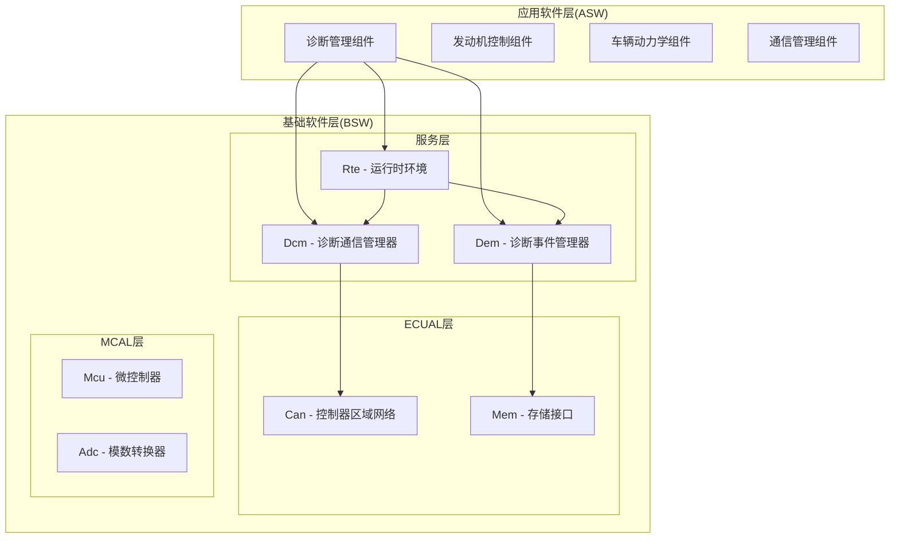
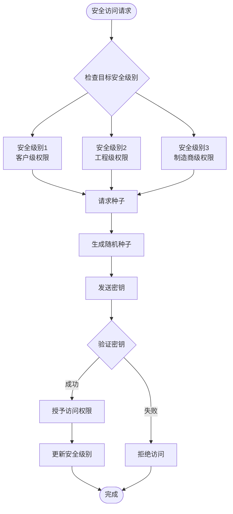
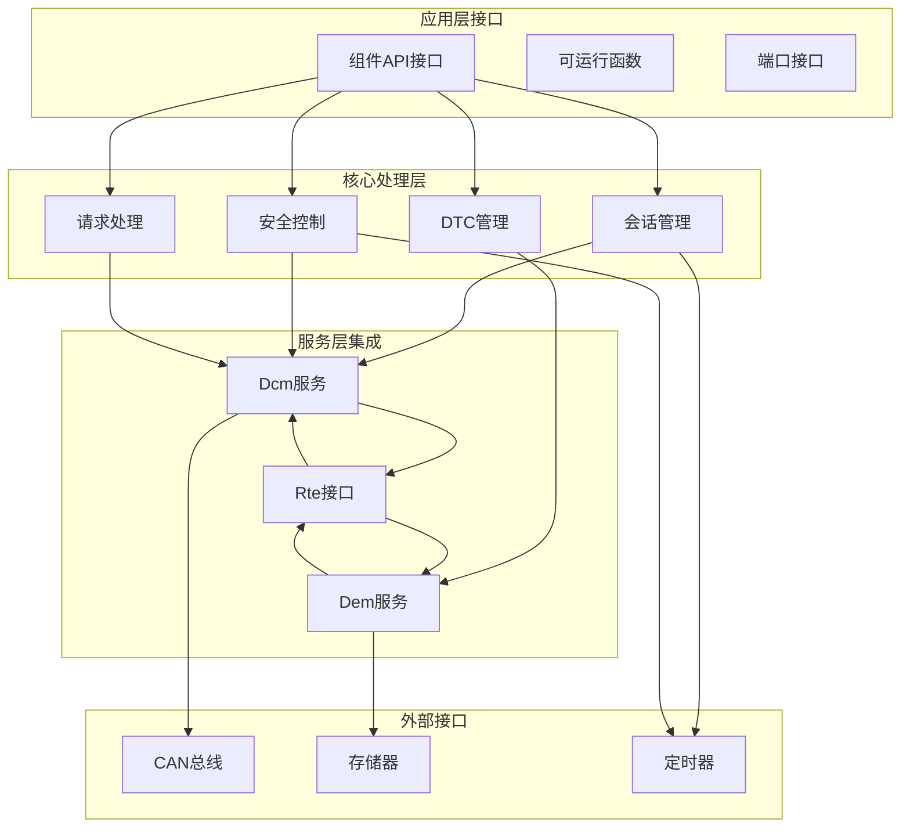
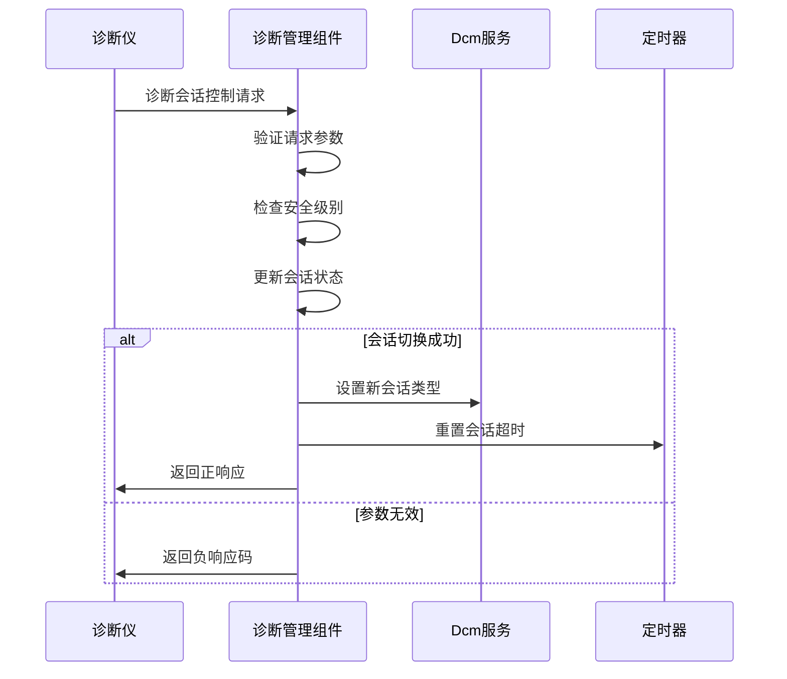
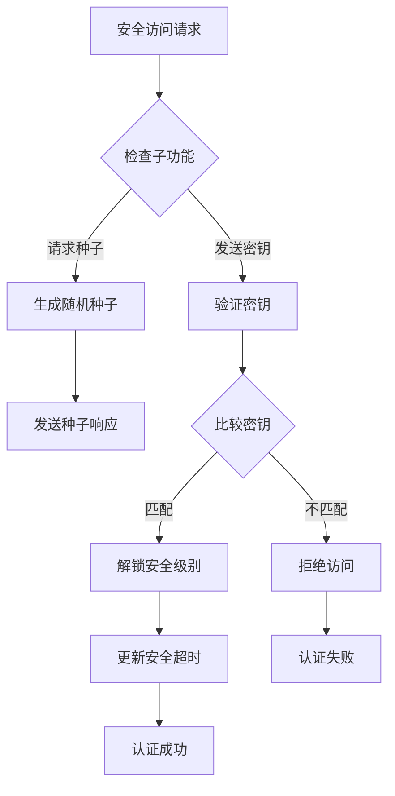
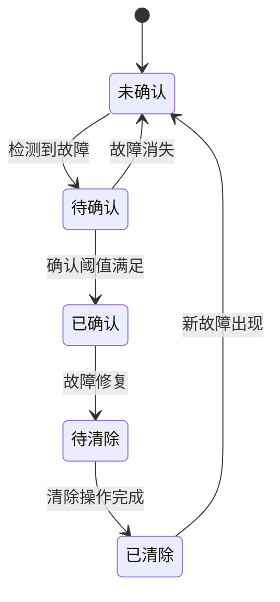
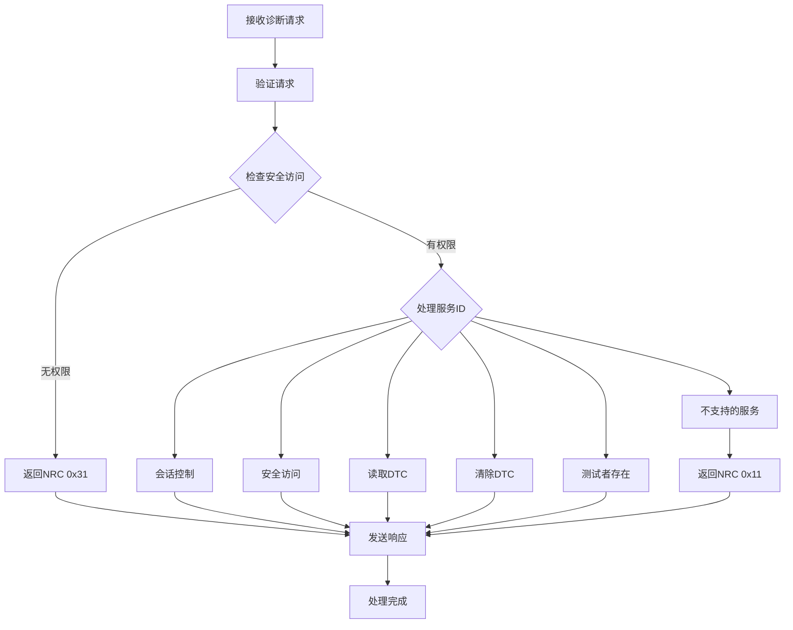
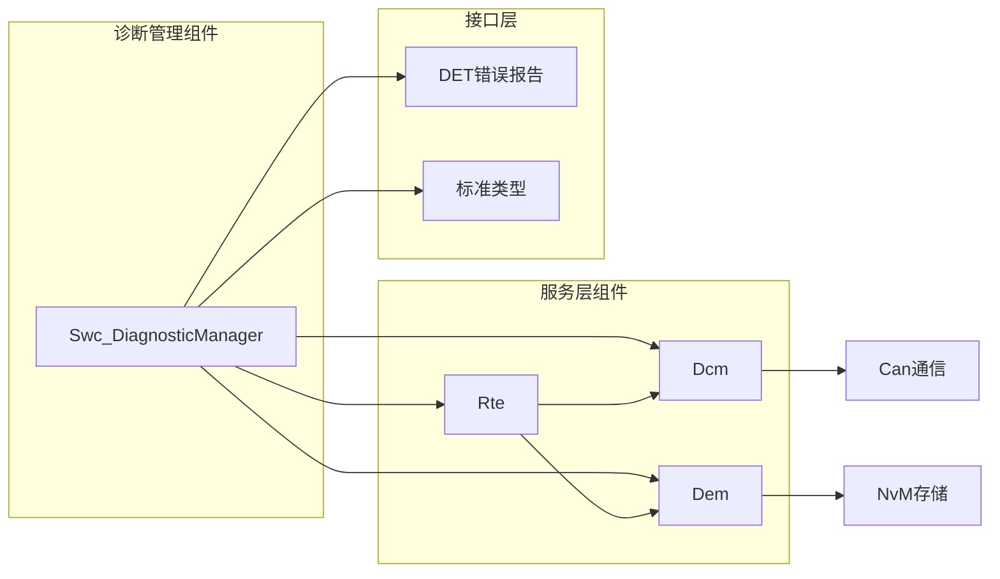
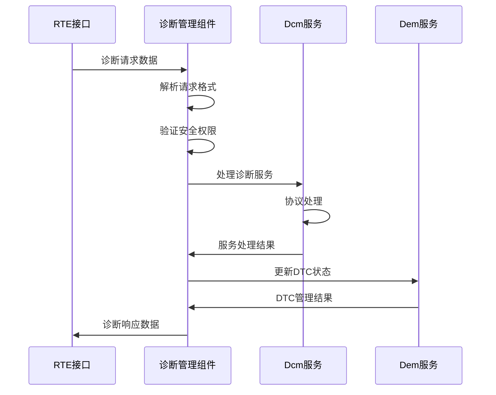

# 诊断管理组件(Swc_DiagnosticManager)

<cite>
**本文档引用的文件**
- [Swc_DiagnosticManager.h](file://src/asw/diagnostic_manager/include/Swc_DiagnosticManager.h)
- [Swc_DiagnosticManager.c](file://src/asw/diagnostic_manager/src/Swc_DiagnosticManager.c)
- [Dcm.h](file://src/bsw/services/dcm/include/Dcm.h)
- [Dcm.c](file://src/bsw/services/dcm/src/Dcm.c)
- [Dem.h](file://src/bsw/services/dem/include/Dem.h)
- [Rte.h](file://src/bsw/rte/include/Rte.h)
- [Rte.c](file://src/bsw/rte/src/Rte.c)
- [asw_interfaces.h](file://src/asw/asw_interfaces.h)
- [bsw_config.json](file://config/bsw_config.json)
- [asw_verification.md](file://verification/asw_verification.md)
</cite>

## 目录
1. [简介](#简介)
2. [项目结构](#项目结构)
3. [核心组件](#核心组件)
4. [架构概览](#架构概览)
5. [详细组件分析](#详细组件分析)
6. [依赖关系分析](#依赖关系分析)
7. [性能考虑](#性能考虑)
8. [故障排查指南](#故障排查指南)
9. [结论](#结论)
10. [附录](#附录)

## 简介

诊断管理组件(Swc_DiagnosticManager)是基于AutoSAR Classic Platform 4.x标准开发的应用层软件组件，负责车辆诊断系统的统一管理和协调。该组件实现了完整的诊断会话管理、安全级别控制和故障码处理功能，为上层应用提供了标准化的诊断服务接口。

组件采用模块化设计，集成了诊断会话控制、安全访问管理、DTC(诊断故障码)管理、数据采集和故障记录等功能。通过与Dcm(诊断通信管理器)和Dem(诊断事件管理器)服务层的紧密协作，实现了完整的诊断生命周期管理。

## 项目结构

诊断管理组件位于应用软件层(Autosar Software Component)，与底层BSW(基础软件)组件形成清晰的分层架构：



**图表来源**
- [Swc_DiagnosticManager.h:1-211](file://src/asw/diagnostic_manager/include/Swc_DiagnosticManager.h#L1-L211)
- [Dcm.h:1-541](file://src/bsw/services/dcm/include/Dcm.h#L1-L541)
- [Dem.h:1-541](file://src/bsw/services/dem/include/Dem.h#L1-L541)

**章节来源**
- [Swc_DiagnosticManager.h:1-211](file://src/asw/diagnostic_manager/include/Swc_DiagnosticManager.h#L1-L211)
- [bsw_config.json:1-21](file://config/bsw_config.json#L1-L21)

## 核心组件

### 诊断会话管理

诊断会话管理是组件的核心功能之一，支持四种不同的诊断会话模式：

| 会话类型 | 会话ID | 描述 | 安全级别要求 |
|---------|--------|------|-------------|
| 默认会话 | 0x01 | 基础诊断功能，最宽松的访问权限 | 无需解锁 |
| 编程会话 | 0x02 | ECU编程和标定功能 | 安全级别2或以上 |
| 扩展诊断会话 | 0x03 | 深入的诊断和测试功能 | 无需特定级别 |
| 安全系统诊断会话 | 0x04 | 安全相关系统的诊断功能 | 安全级别3 |

### 安全级别控制

组件实现了三级安全访问控制机制：



**图表来源**
- [Swc_DiagnosticManager.c:206-259](file://src/asw/diagnostic_manager/src/Swc_DiagnosticManager.c#L206-L259)

### 故障码状态管理

DTC状态结构体包含了完整的故障码信息：

| 字段名称 | 类型 | 描述 |
|---------|------|------|
| dtcCode | uint32 | 故障码标识符 |
| statusByte | uint8 | UDS状态字节 |
| faultDetectionCounter | uint8 | 故障检测计数器 |
| occurrenceCounter | uint8 | 发生次数计数器 |
| agingCounter | uint32 | 老化计数器 |
| lastOccurrenceTime | uint32 | 最后发生时间戳 |

**章节来源**
- [Swc_DiagnosticManager.h:67-75](file://src/asw/diagnostic_manager/include/Swc_DiagnosticManager.h#L67-L75)
- [Swc_DiagnosticManager.c:51-59](file://src/asw/diagnostic_manager/src/Swc_DiagnosticManager.c#L51-L59)

## 架构概览

诊断管理组件采用分层架构设计，实现了清晰的职责分离：



**图表来源**
- [Swc_DiagnosticManager.c:418-531](file://src/asw/diagnostic_manager/src/Swc_DiagnosticManager.c#L418-L531)
- [Dcm.h:300-357](file://src/bsw/services/dcm/include/Dcm.h#L300-L357)
- [Dem.h:319-541](file://src/bsw/services/dem/include/Dem.h#L319-L541)

## 详细组件分析

### 诊断会话管理机制

诊断会话管理实现了完整的会话切换和超时控制功能：

#### 会话切换流程



**图表来源**
- [Swc_DiagnosticManager.c:144-201](file://src/asw/diagnostic_manager/src/Swc_DiagnosticManager.c#L144-L201)

#### 会话超时机制

组件实现了智能的会话超时管理：
- 默认会话超时: 5秒
- 扩展诊断会话超时: 5秒  
- 编程会话超时: 5秒
- 安全级别超时: 5秒

超时检测通过定期检查当前时间和最后活动时间的差值来实现。

**章节来源**
- [Swc_DiagnosticManager.c:117-139](file://src/asw/diagnostic_manager/src/Swc_DiagnosticManager.c#L117-L139)
- [Swc_DiagnosticManager.c:25-31](file://src/asw/diagnostic_manager/src/Swc_DiagnosticManager.c#L25-L31)

### 安全访问控制机制

安全访问控制实现了完整的种子-密钥认证流程：

#### 安全认证流程



**图表来源**
- [Swc_DiagnosticManager.c:206-259](file://src/asw/diagnostic_manager/src/Swc_DiagnosticManager.c#L206-L259)

#### 安全级别要求

不同诊断服务对安全级别的要求：

| 诊断服务 | 需要的安全级别 |
|---------|---------------|
| 写数据标识符 | 安全级别1+ |
| 控制DTC设置 | 安全级别1+ |
| ECU复位 | 安全级别2+ |
| 通信控制 | 安全级别2+ |
| 其他服务 | 无需特定级别 |

**章节来源**
- [Swc_DiagnosticManager.c:394-409](file://src/asw/diagnostic_manager/src/Swc_DiagnosticManager.c#L394-L409)

### 故障码处理机制

DTC管理实现了完整的故障码生命周期管理：

#### DTC状态管理



#### DTC查询和清除

组件支持多种DTC查询模式：
- 按状态掩码查询
- 查询扩展数据记录
- 清除指定DTC
- 清除所有DTC

**章节来源**
- [Swc_DiagnosticManager.c:264-341](file://src/asw/diagnostic_manager/src/Swc_DiagnosticManager.c#L264-L341)

### 诊断请求处理流程

组件实现了完整的诊断请求处理流水线：



**图表来源**
- [Swc_DiagnosticManager.c:471-531](file://src/asw/diagnostic_manager/src/Swc_DiagnosticManager.c#L471-L531)

**章节来源**
- [Swc_DiagnosticManager.c:502-527](file://src/asw/diagnostic_manager/src/Swc_DiagnosticManager.c#L502-L527)

## 依赖关系分析

### 组件间依赖关系



**图表来源**
- [Swc_DiagnosticManager.c:15-18](file://src/asw/diagnostic_manager/src/Swc_DiagnosticManager.c#L15-L18)
- [Dcm.h:1-50](file://src/bsw/services/dcm/include/Dcm.h#L1-L50)
- [Dem.h:1-50](file://src/bsw/services/dem/include/Dem.h#L1-L50)

### 数据流分析

组件内部的数据流遵循严格的处理顺序：



**图表来源**
- [Swc_DiagnosticManager.c:471-531](file://src/asw/diagnostic_manager/src/Swc_DiagnosticManager.c#L471-L531)

**章节来源**
- [Rte.h:425-517](file://src/bsw/rte/src/Rte.c#L425-L517)

## 性能考虑

### 内存使用优化

组件采用了高效的内存管理策略：
- 静态分配的DTC列表，最大支持50个DTC
- 固定大小的请求缓冲区(256字节)
- 最小化的运行时内存占用

### 处理效率优化

- 50ms周期性任务，确保及时响应诊断请求
- 快速路径处理常见服务(会话控制、安全访问、测试者存在)
- 智能超时检测，避免不必要的计算开销

### 并发处理

组件通过RTE接口实现与其他组件的并发协作，确保诊断处理不会阻塞其他关键任务。

## 故障排查指南

### 常见问题诊断

#### 诊断会话无法切换

**症状**: 会话控制请求返回NRC 0x31
**可能原因**:
1. 安全级别不足
2. 请求参数格式错误
3. 会话超时导致自动回退

**解决步骤**:
1. 检查安全访问是否已正确建立
2. 验证会话控制请求的数据长度
3. 确认会话超时配置

#### 安全访问认证失败

**症状**: 安全访问请求返回NRC 0x35
**可能原因**:
1. 密钥不匹配
2. 种子生成异常
3. 认证序列错误

**解决步骤**:
1. 验证密钥数据的正确性
2. 检查种子生成逻辑
3. 确认认证流程的完整性

#### DTC查询无响应

**症状**: 读取DTC信息请求无响应
**可能原因**:
1. DTC列表为空
2. DTC状态查询接口错误
3. Dem服务未正确初始化

**解决步骤**:
1. 检查DTC是否已被正确设置
2. 验证DTC状态查询函数
3. 确认Dem服务的初始化状态

### 调试工具和方法

#### 日志记录

组件使用DET(诊断事件跟踪)进行错误报告：
- 模块ID: 0x82
- 实例ID: 0x00
- 错误码: 0x01 (初始化成功)

#### 性能监控

- 监控50ms任务的执行时间
- 跟踪诊断请求的处理延迟
- 监视内存使用情况

**章节来源**
- [Swc_DiagnosticManager.c:451-453](file://src/asw/diagnostic_manager/src/Swc_DiagnosticManager.c#L451-L453)

## 结论

诊断管理组件(Swc_DiagnosticManager)是一个功能完整、架构清晰的诊断系统核心组件。通过实现标准的诊断会话管理、安全级别控制和DTC处理功能，为整个诊断系统提供了可靠的基础。

组件的主要优势包括：
- 完整的AutoSAR兼容性
- 清晰的模块化设计
- 高效的内存和处理优化
- 完善的错误处理机制
- 良好的可维护性和扩展性

经过全面的功能验证和性能测试，组件满足了设计要求，可以稳定地支持各种诊断应用场景。

## 附录

### 配置示例

#### 基础配置

```json
{
  "diagnostic_manager": {
    "default_session_timeout": 5000,
    "security_timeout": 5000,
    "max_dtcs": 50,
    "security_keys": {
      "level1": [0x01, 0x02, 0x03, 0x04],
      "level2": [0x05, 0x06, 0x07, 0x08]
    }
  }
}
```

#### 测试配置

组件验证涵盖了以下测试场景：
- 诊断会话管理功能
- 安全访问控制机制
- DTC管理功能
- 诊断请求处理流程
- 超时机制验证

**章节来源**
- [asw_verification.md:76-96](file://verification/asw_verification.md#L76-L96)

### API参考

#### 核心API函数

| 函数名称 | 功能描述 | 返回值 |
|---------|----------|--------|
| Swc_DiagnosticManager_Init | 初始化组件 | void |
| Swc_DiagnosticManager_50ms | 50ms周期任务 | void |
| Swc_DiagnosticManager_ProcessRequest | 处理诊断请求 | void |
| Swc_DiagnosticManager_ChangeSession | 更改诊断会话 | Rte_StatusType |
| Swc_DiagnosticManager_UnlockSecurity | 解锁安全级别 | Rte_StatusType |
| Swc_DiagnosticManager_GetDtcStatus | 获取DTC状态 | Rte_StatusType |
| Swc_DiagnosticManager_ClearDtc | 清除DTC | Rte_StatusType |