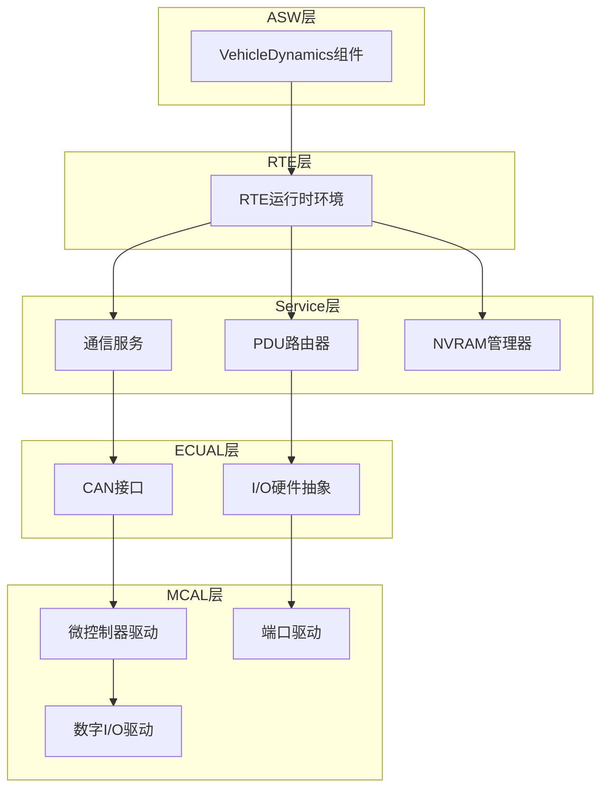
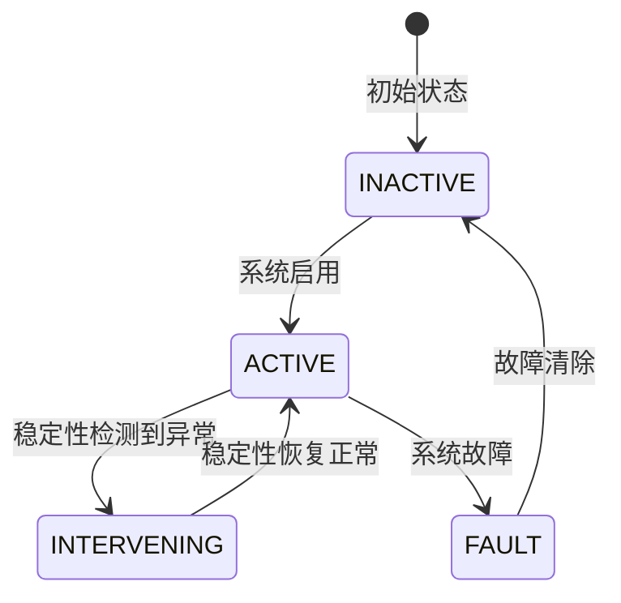
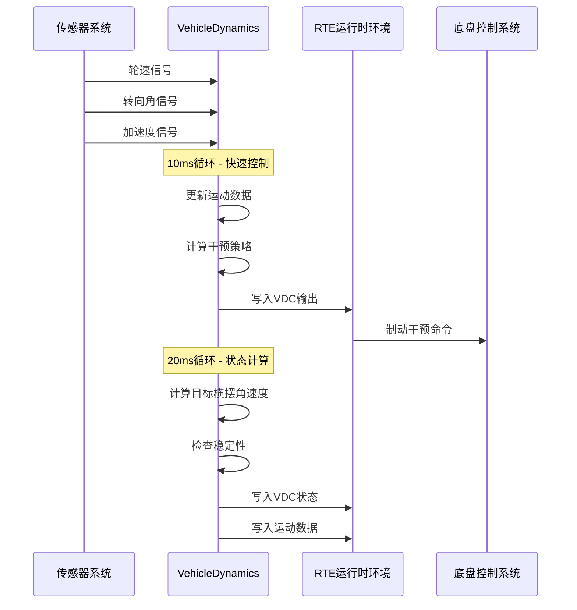
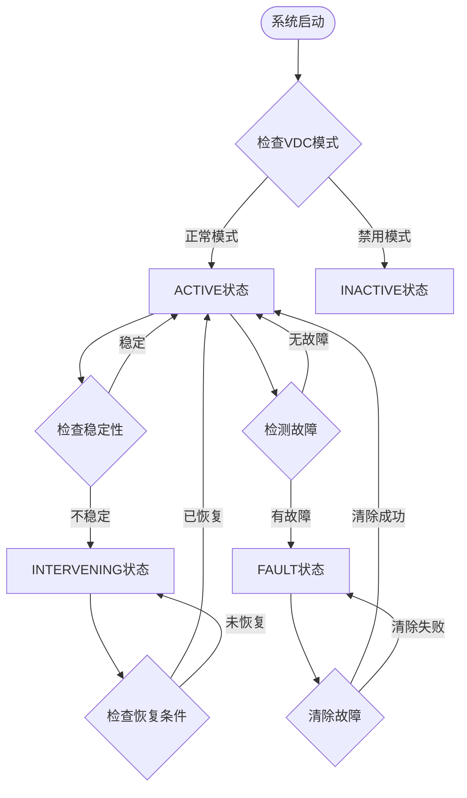
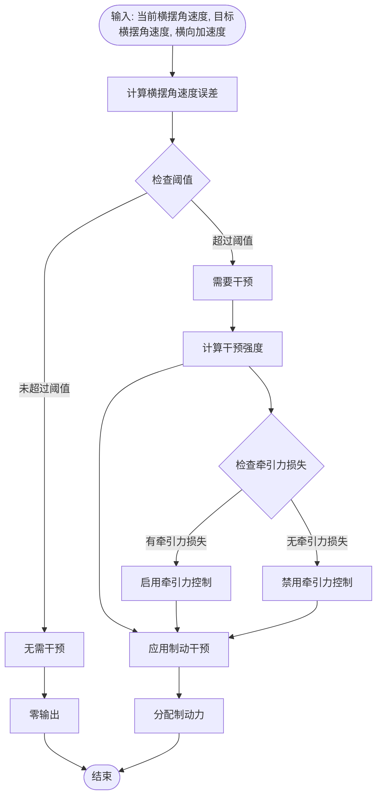
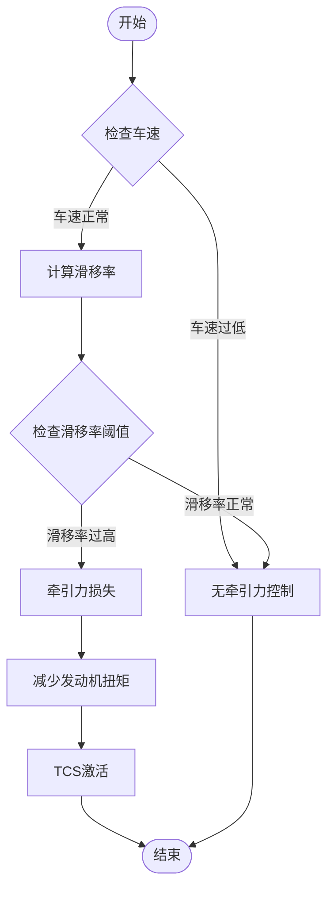
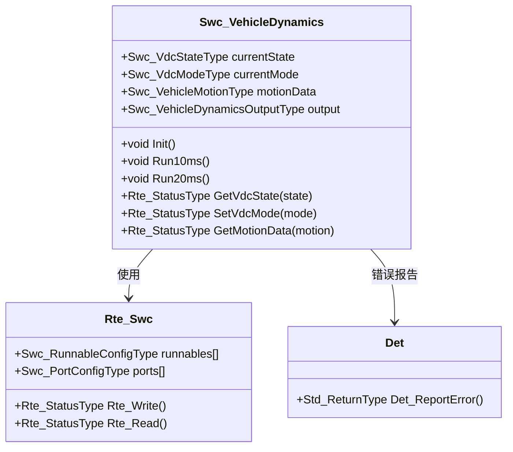
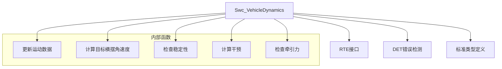
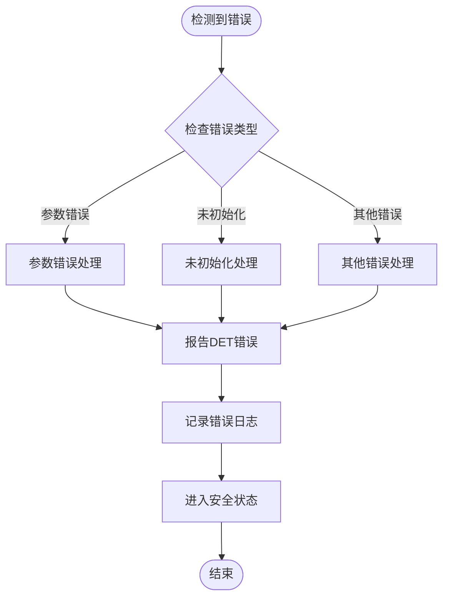

# 车辆动力学组件(Swc_VehicleDynamics)

<cite>
**本文档引用的文件**
- [Swc_VehicleDynamics.h](file://src/asw/vehicle_dynamics/include/Swc_VehicleDynamics.h)
- [Swc_VehicleDynamics.c](file://src/asw/vehicle_dynamics/src/Swc_VehicleDynamics.c)
- [Rte_Swc.h](file://src/bsw/rte/include/Rte_Swc.h)
- [Rte.h](file://src/bsw/rte/include/Rte.h)
- [Det.h](file://src/bsw/services/det/include/Det.h)
- [modules.md](file://docs/modules.md)
- [bsw_config.json](file://config/bsw_config.json)
</cite>

## 目录
1. [简介](#简介)
2. [项目结构](#项目结构)
3. [核心组件](#核心组件)
4. [架构概览](#架构概览)
5. [详细组件分析](#详细组件分析)
6. [依赖关系分析](#依赖关系分析)
7. [性能考虑](#性能考虑)
8. [故障排除指南](#故障排除指南)
9. [结论](#结论)
10. [附录](#附录)

## 简介

Swc_VehicleDynamics 是一个基于 AUTOSAR Classic Platform 4.x 的车辆动力学软件组件，负责实现车辆稳定性控制(VDC)、牵引力控制和制动干预功能。该组件通过实时运行循环实现快速的动态响应，并与底盘控制系统进行紧密集成。

该组件采用分层架构设计，包含10ms快循环和20ms慢循环，分别处理实时控制和状态计算。通过RTE接口与上层应用软件组件通信，实现了传感器数据融合和控制策略执行的分离。

## 项目结构

车辆动力学组件位于ASW层的VehicleDynamics子目录中，遵循AUTOSAR标准的分层架构：

**图表来源**
- [modules.md:558-623](file://docs/modules.md#L558-L623)

**章节来源**
- [modules.md:424-440](file://docs/modules.md#L424-L440)

## 核心组件

### VdcState_DE VDC状态枚举

VDC状态枚举定义了车辆稳定性控制系统的四种工作状态：

**图表来源**
- [Swc_VehicleDynamics.h:28-33](file://src/asw/vehicle_dynamics/include/Swc_VehicleDynamics.h#L28-L33)

### VehicleMotion_DE 车辆运动状态结构体

车辆运动状态结构体包含了完整的车辆动态信息：

| 字段名 | 类型 | 单位 | 描述 |
|--------|------|------|------|
| vehicleSpeed | uint16 | km/h | 车辆速度 |
| longitudinalAccel | sint16 | m/s² × 100 | 纵向加速度 |
| lateralAccel | sint16 | m/s² × 100 | 横向加速度 |
| yawRate | sint16 | deg/s × 10 | 横摆角速度 |
| steeringAngle | sint16 | 度 | 转向角度 |
| wheelSpeedFL | uint16 | km/h | 左前轮速 |
| wheelSpeedFR | uint16 | km/h | 右前轮速 |
| wheelSpeedRL | uint16 | km/h | 左后轮速 |
| wheelSpeedRR | uint16 | km/h | 右后轮速 |

### VdcOutput_DE VDC输出结构体

VDC输出结构体定义了控制系统的输出指令：

| 字段名 | 类型 | 单位 | 描述 |
|--------|------|------|------|
| brakeForceFront | sint16 | 百分比(-100~100) | 前轮制动力分配 |
| brakeForceRear | sint16 | 百分比(-100~100) | 后轮制动力分配 |
| brakeForceLeft | sint16 | 百分比(-100~100) | 左侧制动力分配 |
| brakeForceRight | sint16 | 百分比(-100~100) | 右侧制动力分配 |
| torqueReduction | sint16 | 百分比(0~100) | 发动机扭矩减少量 |
| stabilityIntervention | boolean | - | 稳定性干预标志 |
| tractionControlActive | boolean | - | 牵引力控制激活标志 |

**章节来源**
- [Swc_VehicleDynamics.h:48-71](file://src/asw/vehicle_dynamics/include/Swc_VehicleDynamics.h#L48-L71)

## 架构概览

车辆动力学组件采用双循环架构设计，实现了高实时性的控制算法：

**图表来源**
- [Swc_VehicleDynamics.c:337-371](file://src/asw/vehicle_dynamics/src/Swc_VehicleDynamics.c#L337-L371)

### 运行循环设计

组件包含三个主要运行循环：

1. **Init运行循环**: 组件初始化
2. **10ms运行循环**: 快速动态控制，处理实时制动干预
3. **20ms运行循环**: 动态计算，处理稳定性检查和状态更新

**章节来源**
- [Swc_VehicleDynamics.h:76-78](file://src/asw/vehicle_dynamics/include/Swc_VehicleDynamics.h#L76-L78)

## 详细组件分析

### 状态管理系统

状态管理器实现了完整的VDC状态转换逻辑：

**图表来源**
- [Swc_VehicleDynamics.c:149-182](file://src/asw/vehicle_dynamics/src/Swc_VehicleDynamics.c#L149-L182)

### 稳定性控制算法

稳定性控制算法基于横摆角速度误差和横向加速度进行判断：

**图表来源**
- [Swc_VehicleDynamics.c:187-236](file://src/asw/vehicle_dynamics/src/Swc_VehicleDynamics.c#L187-L236)

### 牵引力控制算法

牵引力控制算法通过滑移率检测实现：

**图表来源**
- [Swc_VehicleDynamics.c:255-283](file://src/asw/vehicle_dynamics/src/Swc_VehicleDynamics.c#L255-L283)

### 接口设计

组件通过RTE接口与系统其他部分通信：

**图表来源**
- [Swc_VehicleDynamics.h:157-173](file://src/asw/vehicle_dynamics/include/Swc_VehicleDynamics.h#L157-L173)
- [Rte_Swc.h:177-264](file://src/bsw/rte/include/Rte_Swc.h#L177-L264)

**章节来源**
- [Swc_VehicleDynamics.c:337-430](file://src/asw/vehicle_dynamics/src/Swc_VehicleDynamics.c#L337-L430)

## 依赖关系分析

### 内部依赖关系

**图表来源**
- [Swc_VehicleDynamics.c:79-84](file://src/asw/vehicle_dynamics/src/Swc_VehicleDynamics.c#L79-L84)

### 外部接口依赖

组件通过RTE接口与系统其他组件通信：

| 接口名称 | 类型 | 方向 | 描述 |
|----------|------|------|------|
| VDC_STATE_P | Sender-Receiver | Provided | VDC状态输出 |
| MOTION_DATA_P | Sender-Receiver | Provided | 车辆运动数据 |
| VDC_OUTPUT_P | Sender-Receiver | Provided | VDC控制输出 |
| WHEEL_SPEEDS_R | Client-Server | Required | 轮速数据读取 |
| STEERING_ANGLE_R | Client-Server | Required | 转向角数据读取 |
| ACCEL_DATA_R | Client-Server | Required | 加速度数据读取 |

**章节来源**
- [Swc_VehicleDynamics.h:83-88](file://src/asw/vehicle_dynamics/include/Swc_VehicleDynamics.h#L83-L88)

## 性能考虑

### 实时性能指标

组件设计满足以下实时性能要求：

- **10ms循环**: 快速制动干预响应时间
- **20ms循环**: 稳定性状态更新周期
- **中断处理**: 传感器数据采样和处理
- **内存使用**: 静态内存分配，避免动态内存

### 优化策略

1. **算法简化**: 使用线性近似替代复杂数学运算
2. **阈值设定**: 合理的安全阈值确保系统稳定性
3. **数据类型优化**: 使用定点数运算提高性能
4. **内存管理**: 静态变量分配，减少运行时开销

### 安全限制

组件实现了多层次的安全保护：

- **输入验证**: 所有外部输入参数验证
- **状态检查**: 运行时状态完整性检查
- **错误报告**: DET错误检测和报告
- **故障处理**: 故障状态下的安全降级

**章节来源**
- [Swc_VehicleDynamics.c:25-38](file://src/asw/vehicle_dynamics/src/Swc_VehicleDynamics.c#L25-L38)

## 故障排除指南

### 常见问题诊断

| 问题症状 | 可能原因 | 解决方案 |
|----------|----------|----------|
| VDC状态始终为INACTIVE | 组件未正确初始化 | 检查Init运行循环执行 |
| 制动干预无效 | 传感器数据异常 | 验证轮速和转向角信号 |
| 稳定性控制频繁动作 | 阈值设置不当 | 调整稳定性阈值参数 |
| 牵引力控制不工作 | 车速过低 | 检查车速计算逻辑 |

### 错误处理机制

组件使用DET模块进行错误检测和报告：

**图表来源**
- [Swc_VehicleDynamics.c:330-331](file://src/asw/vehicle_dynamics/src/Swc_VehicleDynamics.c#L330-L331)

**章节来源**
- [Det.h:59-70](file://src/bsw/services/det/include/Det.h#L59-L70)

## 结论

Swc_VehicleDynamics组件是一个功能完整、性能可靠的车辆动力学控制软件组件。其设计特点包括：

1. **实时性**: 双循环架构确保快速响应
2. **安全性**: 多层次安全保护机制
3. **可维护性**: 清晰的模块化设计
4. **可扩展性**: 支持不同驾驶模式配置

该组件为车辆提供了基础的稳定性控制和牵引力控制功能，是现代汽车电子系统中不可或缺的重要组成部分。

## 附录

### 参数配置指南

| 参数名称 | 默认值 | 单位 | 描述 |
|----------|--------|------|------|
| VDC_MAX_VEHICLE_SPEED | 250 | km/h | 最大允许车速 |
| VDC_MAX_ACCEL | 2000 | m/s² × 100 | 最大加速度 |
| VDC_MAX_YAW_RATE | 1000 | deg/s × 10 | 最大横摆角速度 |
| VDC_MAX_STEERING_ANGLE | 720 | 度 | 最大转向角 |
| VDC_SLIP_THRESHOLD_LOW | 10 | % | 低滑移率阈值 |
| VDC_SLIP_THRESHOLD_HIGH | 25 | % | 高滑移率阈值 |
| VDC_SLIP_THRESHOLD_CRITICAL | 40 | % | 临界滑移率阈值 |
| VDC_YAW_RATE_THRESHOLD | 50 | deg/s × 10 | 横摆角速度阈值 |
| VDC_LAT_ACCEL_THRESHOLD | 800 | m/s² × 100 | 横向加速度阈值 |

### 性能调优建议

1. **阈值调整**: 根据不同驾驶场景调整稳定性阈值
2. **敏感度调节**: 通过PIM参数调节控制算法敏感度
3. **模式选择**: 根据路况选择合适的VDC模式
4. **校准程序**: 定期进行传感器校准和系统标定