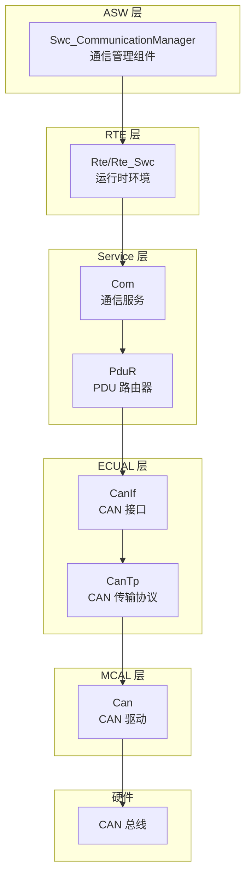
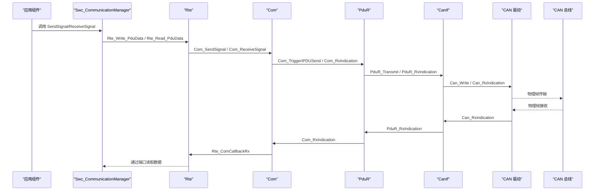
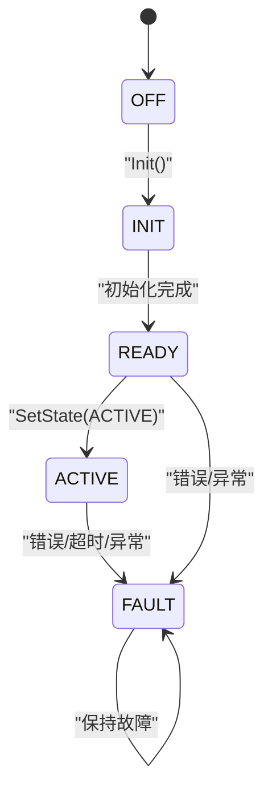
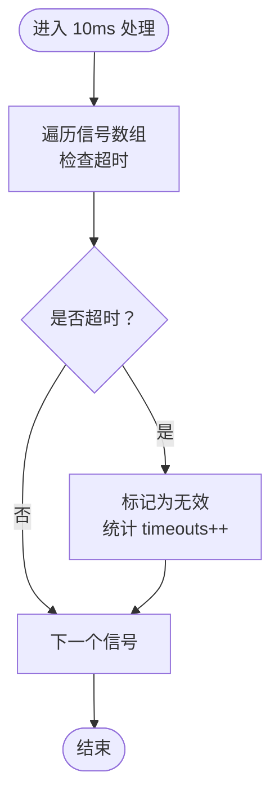
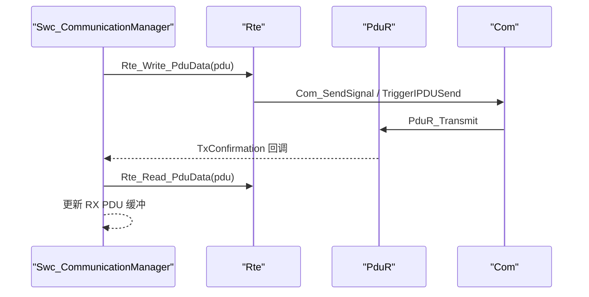
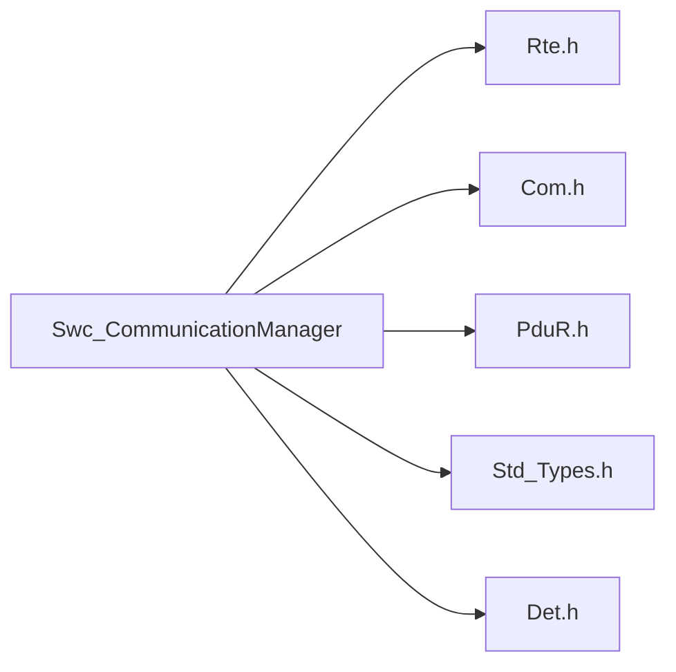

# 通信管理组件(Swc_CommunicationManager)

<cite>
**本文引用的文件列表**
- [Swc_CommunicationManager.h](file://src/asw/communication_manager/include/Swc_CommunicationManager.h)
- [Swc_CommunicationManager.c](file://src/asw/communication_manager/src/Swc_CommunicationManager.c)
- [Com.h](file://src/bsw/services/com/include/Com.h)
- [Com_Cfg.h](file://src/bsw/services/com/include/Com_Cfg.h)
- [Rte.h](file://src/bsw/rte/include/Rte.h)
- [PduR.h](file://src/bsw/services/pdur/include/PduR.h)
- [Det.h](file://src/bsw/common/Det.h)
- [Std_Types.h](file://src/bsw/common/Std_Types.h)
- [architecture.md](file://docs/architecture.md)
- [modules.md](file://docs/modules.md)
- [README.md](file://README.md)
</cite>

## 目录
1. [简介](#简介)
2. [项目结构](#项目结构)
3. [核心组件](#核心组件)
4. [架构总览](#架构总览)
5. [详细组件分析](#详细组件分析)
6. [依赖关系分析](#依赖关系分析)
7. [性能考虑](#性能考虑)
8. [故障排查指南](#故障排查指南)
9. [结论](#结论)
10. [附录](#附录)

## 简介
本文件为通信管理组件（Swc_CommunicationManager）的详细技术文档，面向应用软件组件（ASW）层，聚焦于通信状态管理、信号值处理与PDU信息管理的实现机制。文档涵盖：
- 通信状态枚举 CommState_DE 的设计与使用
- 信号值结构体 SignalValue_DE 的字段语义与生命周期
- PDU 信息结构体 PduInfo_DE 的数据组织与路由
- 通信协议适配、数据包路由、错误检测与重传机制
- 通信初始化流程、运行时状态转换与故障恢复策略
- 与 Com 服务层的接口规范与数据交换格式
- 实际通信配置示例与调试方法

## 项目结构
通信管理组件位于 ASW 层，遵循 AutoSAR Classic Platform 4.x 分层架构，向上通过 RTE 与 Com 服务层交互，向下依赖 ECUAL/Service 层完成物理链路与协议栈处理。

图表来源
- [architecture.md](file://docs/architecture.md)
- [modules.md](file://docs/modules.md)

章节来源
- [architecture.md](file://docs/architecture.md)
- [modules.md](file://docs/modules.md)
- [README.md](file://README.md)

## 核心组件
本节概述通信管理组件对外暴露的数据类型、Runnable、端口与 API，以及与 RTE 的接口宏映射。

- 通信总线类型：CAN、LIN、FlexRay、以太网、内部总线
- 通信状态：OFF、INIT、READY、ACTIVE、FAULT
- 信号方向：TX、RX
- 关键数据结构：
  - 信号配置：包含信号ID、总线类型、方向、长度、周期、超时、是否事件触发
  - 信号值：包含信号ID、值、时间戳、有效性、更新标记
  - PDU 信息：包含PDU ID、总线类型、长度、数据缓冲、时间戳
  - 通信统计：发送/接收信号与PDU次数、发送/接收错误、超时次数
- Runnable：
  - Init：组件初始化
  - 10ms：周期性处理（超时检测、状态上报）
  - RxProcess：接收处理（从PDU提取信号）
  - TxProcess：发送处理（打包信号到PDU并发送）
- 端口：
  - 通信状态端口（写）
  - 信号数据端口（写）
  - PDU 数据接收端口（读）
  - PDU 数据发送端口（写）
- API：
  - Get/SetState：获取/设置通信状态
  - Send/ReceiveSignal：发送/接收信号
  - Send/ReceivePdu：发送/接收PDU
  - GetStatistics/ResetStatistics：获取/重置统计

章节来源
- [Swc_CommunicationManager.h](file://src/asw/communication_manager/include/Swc_CommunicationManager.h)
- [Swc_CommunicationManager.c](file://src/asw/communication_manager/src/Swc_CommunicationManager.c)

## 架构总览
通信管理组件在 AutoSAR 分层中的位置如下：
- 应用软件组件（ASW）层：Swc_CommunicationManager
- 运行时环境（RTE）层：通过 Rte.h/Rte_Swc 接口与 Com 服务层交互
- 服务层：Com（信号/信号组管理）、PduR（PDU 路由）
- ECUAL 层：CanIf/CantTp 等接口与物理总线交互
- 硬件：CAN 总线

图表来源
- [architecture.md](file://docs/architecture.md)
- [Rte.h](file://src/bsw/rte/include/Rte.h)
- [Com.h](file://src/bsw/services/com/include/Com.h)
- [PduR.h](file://src/bsw/services/pdur/include/PduR.h)

章节来源
- [architecture.md](file://docs/architecture.md)
- [Rte.h](file://src/bsw/rte/include/Rte.h)
- [Com.h](file://src/bsw/services/com/include/Com.h)
- [PduR.h](file://src/bsw/services/pdur/include/PduR.h)

## 详细组件分析

### 通信状态管理（CommState_DE）
- 状态枚举：OFF、INIT、READY、ACTIVE、FAULT
- 生命周期：
  - Init：进入 INIT，初始化内部状态、信号与PDU数组、统计计数
  - Ready：初始化完成后进入 READY
  - Active：外部通过 SetState 设置为 ACTIVE 后进入 ACTIVE
  - Fault：异常或错误检测后进入 FAULT
- 状态转换：
  - OFF → INIT → READY → ACTIVE（正常路径）
  - 任意状态 → FAULT（异常路径）
- 10ms Runnable 会写入通信状态端口，供其他组件观察

图表来源
- [Swc_CommunicationManager.c](file://src/asw/communication_manager/src/Swc_CommunicationManager.c)

章节来源
- [Swc_CommunicationManager.h](file://src/asw/communication_manager/include/Swc_CommunicationManager.h)
- [Swc_CommunicationManager.c](file://src/asw/communication_manager/src/Swc_CommunicationManager.c)

### 信号值处理（SignalValue_DE）
- 字段语义：
  - signalId：信号唯一标识
  - value：信号值（64位）
  - timestamp：最近一次更新的时间戳
  - isValid：信号是否有效
  - isUpdated：信号是否在本次周期内更新
- 生命周期：
  - SendSignal：若信号不存在则创建；若存在则更新值、时间戳、有效性与更新标记
  - ReceiveSignal：根据 signalId 查找，校验有效性后返回值
  - RxProcess：从 PDU 中提取信号值，更新对应信号项
  - 10ms：CheckTimeouts 检测超时，将无效信号计数加1
- 超时检测：
  - 默认超时阈值为固定常量（毫秒级），当前时间与信号时间戳差超过阈值则标记为无效

图表来源
- [Swc_CommunicationManager.c](file://src/asw/communication_manager/src/Swc_CommunicationManager.c)

章节来源
- [Swc_CommunicationManager.h](file://src/asw/communication_manager/include/Swc_CommunicationManager.h)
- [Swc_CommunicationManager.c](file://src/asw/communication_manager/src/Swc_CommunicationManager.c)

### PDU 信息管理（PduInfo_DE）
- 字段语义：
  - pduId：PDU 唯一标识
  - busType：总线类型
  - length：数据长度
  - data[64]：数据缓冲区
  - timestamp：时间戳
- 生命周期：
  - SendPdu：若 TX PDU 不存在则创建；复制数据并立即通过 RTE 发送；统计发送成功/失败
  - ReceivePdu：根据 pduId 查找 RX PDU 并返回
  - RxProcess：从 PDU 数据端口读取 PDU，更新 RX PDU 缓冲，并尝试从 PDU 中提取信号值
  - TxProcess：遍历 TX PDU，打包信号到 PDU 数据，写入时间戳，通过 RTE 发送并统计

图表来源
- [Swc_CommunicationManager.c](file://src/asw/communication_manager/src/Swc_CommunicationManager.c)
- [Rte.h](file://src/bsw/rte/include/Rte.h)
- [PduR.h](file://src/bsw/services/pdur/include/PduR.h)
- [Com.h](file://src/bsw/services/com/include/Com.h)

章节来源
- [Swc_CommunicationManager.h](file://src/asw/communication_manager/include/Swc_CommunicationManager.h)
- [Swc_CommunicationManager.c](file://src/asw/communication_manager/src/Swc_CommunicationManager.c)
- [Rte.h](file://src/bsw/rte/include/Rte.h)
- [PduR.h](file://src/bsw/services/pdur/include/PduR.h)
- [Com.h](file://src/bsw/services/com/include/Com.h)

### 通信协议适配与数据包路由
- 协议适配：
  - 通过 Com 服务层进行信号/信号组的发送与接收
  - 通过 PduR 进行 PDU 的路由与转发
- 数据包路由：
  - 发送路径：应用层 → RTE → Com → PduR → CanIf → Can → 总线
  - 接收路径：总线 → Can → CanIf → PduR → Com → RTE → 应用层
- 事件与周期：
  - RxProcess/TxProcess 作为周期性 Runnable，按需处理接收/发送
  - 10ms Runnable 负责超时检测与状态上报

章节来源
- [architecture.md](file://docs/architecture.md)
- [Com.h](file://src/bsw/services/com/include/Com.h)
- [PduR.h](file://src/bsw/services/pdur/include/PduR.h)

### 错误检测与重传机制
- 错误检测：
  - DET（Development Error Tracer）：通过 Det_ReportError 记录错误
  - 状态检查：未初始化、非法参数、超出限制等均返回相应错误码
  - 超时检测：10ms Runnable 中对信号有效性进行检查
- 重传机制：
  - 当前实现中，SendPdu 返回发送结果并统计发送错误，未见显式的自动重传逻辑
  - 建议：可在上层（如 Com）启用重试配置，或在应用层增加指数退避重传策略

章节来源
- [Swc_CommunicationManager.c](file://src/asw/communication_manager/src/Swc_CommunicationManager.c)
- [Det.h](file://src/bsw/common/Det.h)
- [Com_Cfg.h](file://src/bsw/services/com/include/Com_Cfg.h)

### 通信初始化流程
- 初始化步骤：
  - 设置状态为 INIT
  - 初始化信号数组、RX/TX PDU 数组与统计计数
  - 标记为已初始化，状态转为 READY
  - 通过 DET 上报初始化完成
- 启动流程：
  - 外部调用 SetState(ACTIVE) 后，组件进入 ACTIVE
  - 10ms Runnable 开始运行，周期性检测超时并写入通信状态

章节来源
- [Swc_CommunicationManager.c](file://src/asw/communication_manager/src/Swc_CommunicationManager.c)

### 运行时状态转换与故障恢复策略
- 状态转换：
  - OFF → INIT → READY → ACTIVE（正常）
  - 任意状态 → FAULT（异常）
- 故障恢复：
  - 通过 ResetStatistics 清零统计计数
  - 重新初始化（Init）后回到 READY
  - 若需要，可再次 SetState(ACTIVE) 进入 ACTIVE

章节来源
- [Swc_CommunicationManager.c](file://src/asw/communication_manager/src/Swc_CommunicationManager.c)

### 与 Com 服务层的接口规范与数据交换格式
- 接口规范：
  - Com_SendSignal/Com_ReceiveSignal：信号发送/接收
  - Com_TriggerIPDUSend/Com_RxIndication：I-PDU 触发与接收指示
  - Com_TxConfirmation/Com_SwitchIpduTxMode：发送确认与传输模式切换
- 数据交换格式：
  - 信号：Com_SignalIdType（uint16）+ 信号数据缓冲
  - I-PDU：Com_IpduIdType（uint16）+ PduInfoType（长度+数据）

章节来源
- [Com.h](file://src/bsw/services/com/include/Com.h)
- [Com_Cfg.h](file://src/bsw/services/com/include/Com_Cfg.h)
- [Rte.h](file://src/bsw/rte/include/Rte.h)

## 依赖关系分析
- 组件内依赖：
  - Swc_CommunicationManager 内部维护信号数组、PDU 数组与统计信息
  - 通过 Rte.h 进行端口读写与回调
- 组件间依赖：
  - 与 Com 服务层：通过 Com.h 的 API 进行信号/I-PDU 交互
  - 与 PduR 服务层：通过 PduR.h 的 API 进行 PDU 路由
- 外部依赖：
  - 标准类型与错误码：Std_Types.h、Rte.h
  - 错误检测：Det.h

图表来源
- [Swc_CommunicationManager.h](file://src/asw/communication_manager/include/Swc_CommunicationManager.h)
- [Swc_CommunicationManager.c](file://src/asw/communication_manager/src/Swc_CommunicationManager.c)
- [Rte.h](file://src/bsw/rte/include/Rte.h)
- [Com.h](file://src/bsw/services/com/include/Com.h)
- [PduR.h](file://src/bsw/services/pdur/include/PduR.h)
- [Std_Types.h](file://src/bsw/common/Std_Types.h)
- [Det.h](file://src/bsw/common/Det.h)

章节来源
- [Swc_CommunicationManager.h](file://src/asw/communication_manager/include/Swc_CommunicationManager.h)
- [Swc_CommunicationManager.c](file://src/asw/communication_manager/src/Swc_CommunicationManager.c)
- [Rte.h](file://src/bsw/rte/include/Rte.h)
- [Com.h](file://src/bsw/services/com/include/Com.h)
- [PduR.h](file://src/bsw/services/pdur/include/PduR.h)
- [Std_Types.h](file://src/bsw/common/Std_Types.h)
- [Det.h](file://src/bsw/common/Det.h)

## 性能考虑
- 时间复杂度：
  - 信号查找与更新：O(N)（线性扫描信号数组）
  - PDU 查找与更新：O(M)（线性扫描 RX/TX PDU 数组）
  - 超时检测：O(N)（遍历信号数组）
- 内存使用：
  - 固定大小数组：COMM_MAX_SIGNALS、COMM_MAX_PDUS
  - 静态内存分配，避免动态分配带来的碎片与不确定性
- 优化建议：
  - 信号/ PDU 索引：引入哈希表或二分查找以降低查找复杂度
  - 批处理：合并多个信号打包到单个 I-PDU，减少发送次数
  - 优先级队列：对高优先级信号进行优先打包与发送

## 故障排查指南
- 常见错误与定位：
  - 未初始化：调用 API 前必须先 Init，否则返回未初始化错误
  - 参数非法：空指针、超出上限（信号/PDU数量）、非法状态等
  - 超时：10ms Runnable 中会统计超时次数，检查信号更新频率与阈值
  - 发送失败：SendPdu 返回发送错误，检查总线状态与路由配置
- 调试方法：
  - 读取统计信息：GetStatistics 获取发送/接收计数与错误计数
  - 重置统计：ResetStatistics 清零计数，便于对比前后差异
  - DET 日志：通过 Det_ReportError 记录错误上下文（模块ID、实例ID、API ID、错误ID）

章节来源
- [Swc_CommunicationManager.c](file://src/asw/communication_manager/src/Swc_CommunicationManager.c)
- [Det.h](file://src/bsw/common/Det.h)

## 结论
Swc_CommunicationManager 作为 ASW 层的通信管理组件，提供了信号与 PDU 的本地管理能力，并通过 RTE 与 Com/PduR 服务层协作完成跨总线的数据交换。其实现具备清晰的状态机、完善的错误检测与统计机制，适合在 AutoSAR Classic Platform 4.x 环境中稳定运行。为进一步提升性能与可靠性，建议引入索引优化、批处理与自动重传策略。

## 附录

### 实际通信配置示例（概念性说明）
- 信号配置：
  - 信号ID：自定义唯一标识
  - 总线类型：CAN/LIN/Ethernet
  - 方向：TX（发送）或 RX（接收）
  - 长度：位宽
  - 周期：毫秒
  - 超时：毫秒
  - 是否事件触发：布尔
- PDU 配置：
  - PDU ID：自定义唯一标识
  - 总线类型：与信号一致
  - 长度：字节数
  - 数据缓冲：最多 64 字节
  - 时间戳：由组件写入

章节来源
- [Swc_CommunicationManager.h](file://src/asw/communication_manager/include/Swc_CommunicationManager.h)
- [Swc_CommunicationManager.c](file://src/asw/communication_manager/src/Swc_CommunicationManager.c)