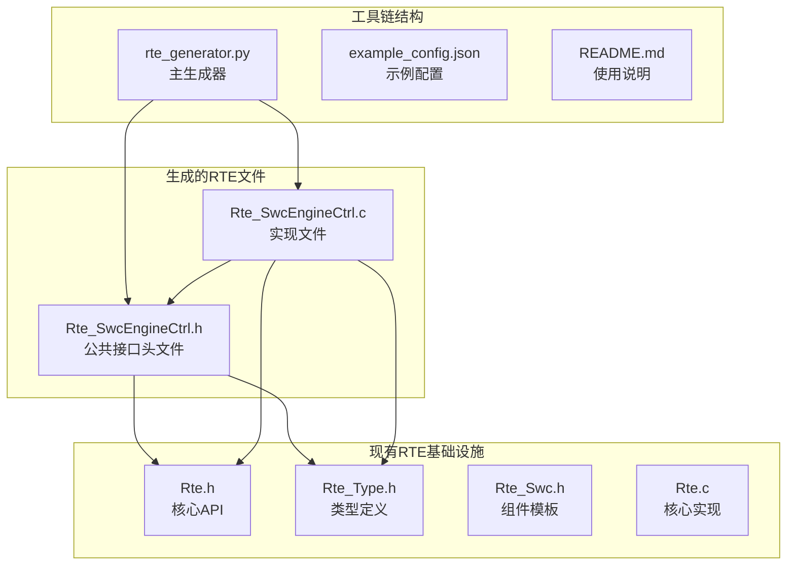
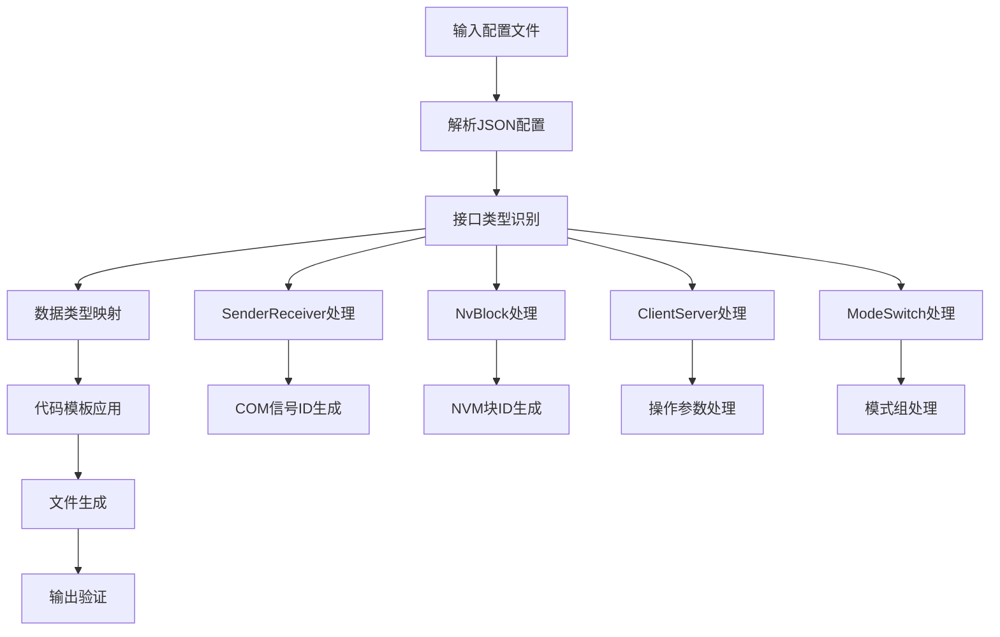
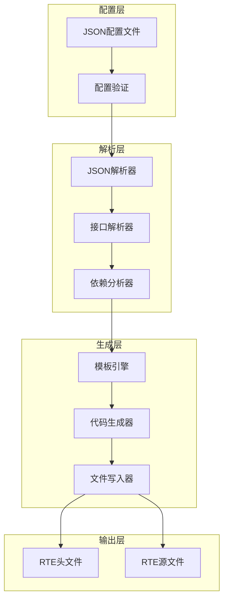
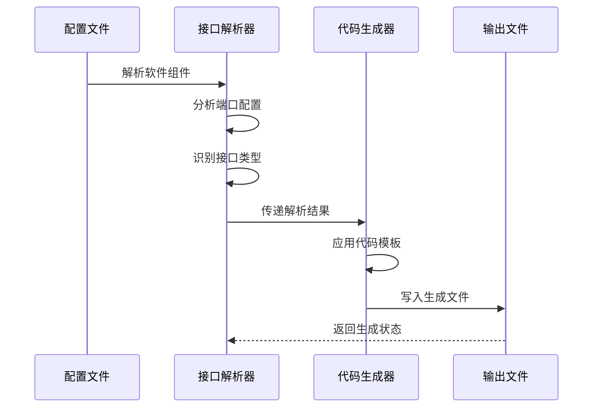
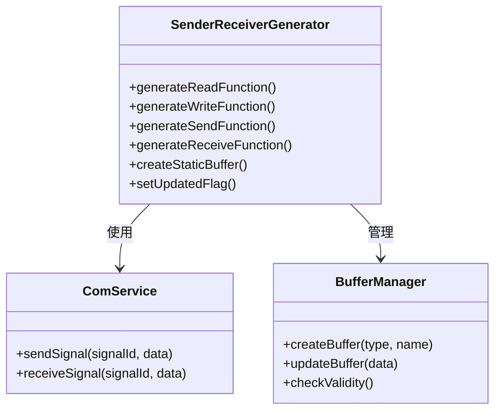
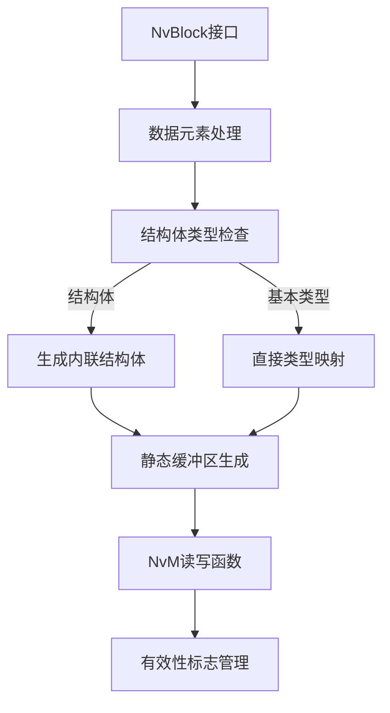
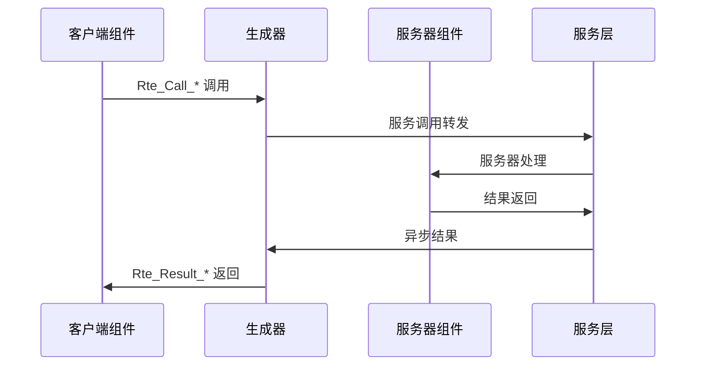
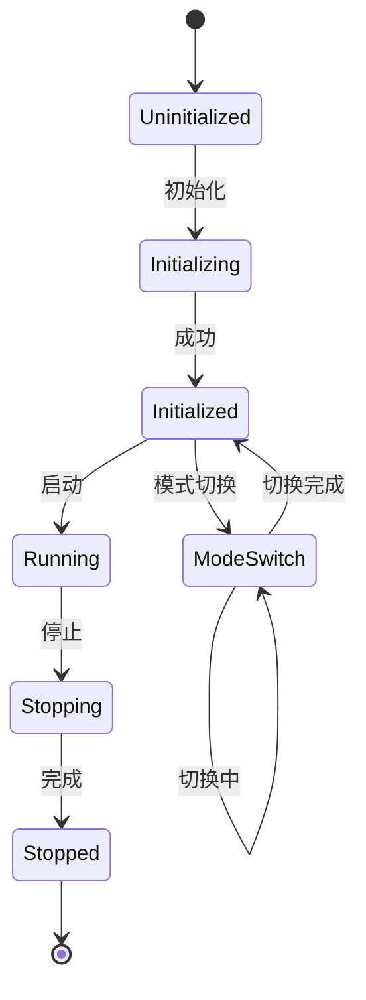
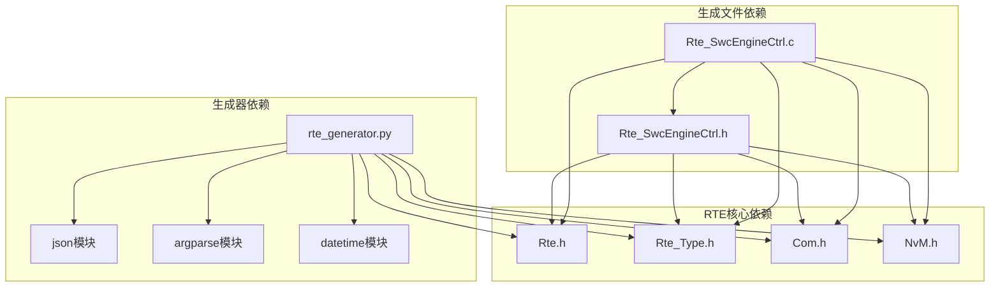
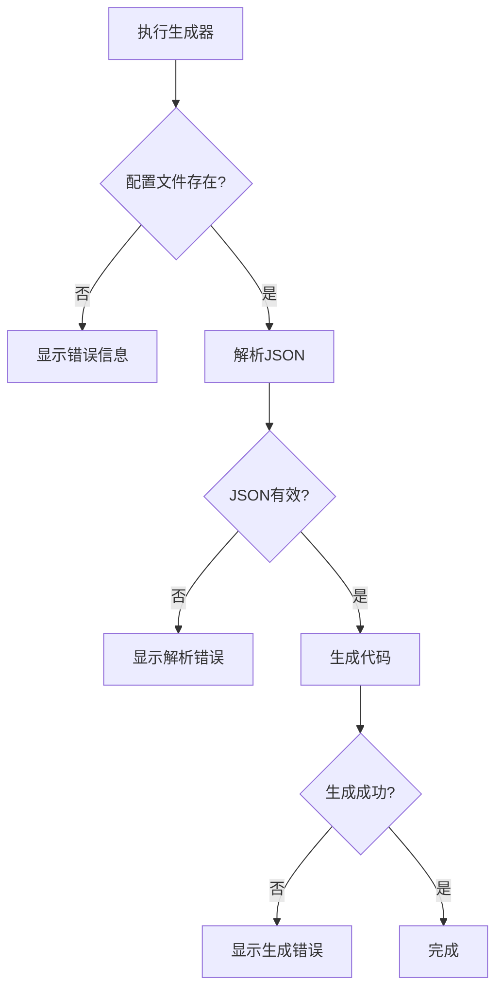

# RTE生成器

<cite>
**本文档引用的文件**
- [rte_generator.py](file://tools/rte_generator/rte_generator.py)
- [example_config.json](file://tools/rte_generator/example_config.json)
- [README.md](file://tools/rte_generator/README.md)
- [RteGenerator_spec.md](file://openspec/changes/dev-rte-generator/specs/RteGenerator_spec.md)
- [Rte.h](file://src/bsw/rte/include/Rte.h)
- [Rte_Type.h](file://src/bsw/rte/include/Rte_Type.h)
- [Rte_Swc.h](file://src/bsw/rte/include/Rte_Swc.h)
- [Rte.c](file://src/bsw/rte/src/Rte.c)
- [Rte_SwcEngineCtrl.h](file://src/bsw/rte/generated/Rte_SwcEngineCtrl.h)
- [Rte_SwcEngineCtrl.c](file://src/bsw/rte/generated/Rte_SwcEngineCtrl.c)
- [bsw_config.json](file://config/bsw_config.json)
- [code_generator.py](file://tools/generator/src/code_generator.py)
- [build.py](file://tools/build/build.py)
- [spec.md](file://openspec/specs/toolchain/spec.md)
</cite>

## 目录
1. [简介](#简介)
2. [项目结构](#项目结构)
3. [核心组件](#核心组件)
4. [架构概览](#架构概览)
5. [详细组件分析](#详细组件分析)
6. [依赖分析](#依赖分析)
7. [性能考虑](#性能考虑)
8. [故障排除指南](#故障排除指南)
9. [结论](#结论)
10. [附录](#附录)

## 简介

RTE生成器是YuleTech AutoSAR BSW项目中的关键工具，专门用于从JSON配置文件自动生成运行时环境(RTE)接口代码。该工具遵循AutoSAR Classic Platform 4.x标准，能够为软件组件(SWC)生成标准化的C语言接口代码，包括头文件和源文件。

该生成器的核心价值在于：
- **自动化代码生成**：从配置文件自动生成完整的RTE接口代码
- **标准兼容性**：完全符合AutoSAR 4.x规范和命名约定
- **多接口支持**：支持SenderReceiver、NvBlock、ClientServer和ModeSwitch四种主要接口类型
- **内存管理**：自动生成静态缓冲区和有效性标志
- **服务集成**：无缝集成COM和NVM等底层服务

## 项目结构

项目采用模块化的组织方式，RTE生成器位于tools/rte_generator目录下，与现有的RTE基础设施紧密集成：



**图表来源**
- [rte_generator.py:1-739](file://tools/rte_generator/rte_generator.py#L1-L739)
- [Rte_SwcEngineCtrl.h:1-82](file://src/bsw/rte/generated/Rte_SwcEngineCtrl.h#L1-L82)
- [Rte_SwcEngineCtrl.c:1-189](file://src/bsw/rte/generated/Rte_SwcEngineCtrl.c#L1-L189)

**章节来源**
- [rte_generator.py:1-739](file://tools/rte_generator/rte_generator.py#L1-L739)
- [README.md:1-172](file://tools/rte_generator/README.md#L1-L172)

## 核心组件

### 主生成器组件

RTE生成器的核心是一个Python脚本，实现了完整的代码生成流水线：



**图表来源**
- [rte_generator.py:180-700](file://tools/rte_generator/rte_generator.py#L180-L700)

### 数据类型映射系统

生成器内置了完整的数据类型映射机制，确保AutoSAR类型与C语言类型的正确对应：

| AutoSAR类型 | C语言类型 | 复杂度 |
|------------|-----------|--------|
| uint8 | uint8 | 基础整数 |
| uint16 | uint16 | 基础整数 |
| uint32 | uint32 | 基础整数 |
| sint8 | sint8 | 基础整数 |
| sint16 | sint16 | 基础整数 |
| sint32 | sint32 | 基础整数 |
| boolean | boolean | 布尔类型 |
| float32 | float32 | 浮点类型 |
| float64 | float64 | 浮点类型 |

**章节来源**
- [rte_generator.py:155-168](file://tools/rte_generator/rte_generator.py#L155-L168)
- [Rte_Type.h:215-236](file://src/bsw/rte/include/Rte_Type.h#L215-L236)

## 架构概览

RTE生成器采用分层架构设计，确保代码的可维护性和扩展性：



**图表来源**
- [rte_generator.py:674-700](file://tools/rte_generator/rte_generator.py#L674-L700)
- [RteGenerator_spec.md:11-26](file://openspec/changes/dev-rte-generator/specs/RteGenerator_spec.md#L11-L26)

### 接口解析算法

生成器实现了智能的接口解析算法，能够处理复杂的软件组件配置：



**图表来源**
- [rte_generator.py:354-671](file://tools/rte_generator/rte_generator.py#L354-L671)

**章节来源**
- [rte_generator.py:180-700](file://tools/rte_generator/rte_generator.py#L180-L700)
- [RteGenerator_spec.md:134-162](file://openspec/changes/dev-rte-generator/specs/RteGenerator_spec.md#L134-L162)

## 详细组件分析

### SenderReceiver接口生成

SenderReceiver接口是最常见的通信模式，生成器为其生成完整的发送和接收函数：



**图表来源**
- [rte_generator.py:375-460](file://tools/rte_generator/rte_generator.py#L375-L460)
- [Rte_SwcEngineCtrl.c:72-128](file://src/bsw/rte/generated/Rte_SwcEngineCtrl.c#L72-L128)

#### 接口生成规则

对于SenderReceiver接口，生成器遵循以下规则：

| 方向 | 生成函数 | 服务调用 | 缓冲策略 |
|------|----------|----------|----------|
| Provided | Rte_Write_* | Com_SendSignal | 更新本地缓冲区 |
| Required | Rte_Read_* | Com_ReceiveSignal | 设置更新标志 |
| Both | Rte_Send_* / Rte_Receive_* | 统一映射 | 状态同步 |

**章节来源**
- [rte_generator.py:201-242](file://tools/rte_generator/rte_generator.py#L201-L242)
- [RteGenerator_spec.md:136-141](file://openspec/changes/dev-rte-generator/specs/RteGenerator_spec.md#L136-L141)

### NvBlock接口生成

NvBlock接口用于非易失性存储访问，生成器提供完整的读写操作：



**图表来源**
- [rte_generator.py:461-525](file://tools/rte_generator/rte_generator.py#L461-L525)
- [Rte_SwcEngineCtrl.h:40-44](file://src/bsw/rte/generated/Rte_SwcEngineCtrl.h#L40-L44)

#### NvBlock数据元素配置

NvBlock接口支持复杂的数据结构定义：

| 字段 | 类型 | 必需性 | 描述 |
|------|------|--------|------|
| name | string | ✓ | 数据元素名称 |
| type | string/object | ✓ | C类型或结构体定义 |
| nvmBlockId | number | ✗ | NVM块标识符 |
| comSignalId | number | ✗ | COM信号ID（仅SenderReceiver） |

**章节来源**
- [rte_generator.py:244-270](file://tools/rte_generator/rte_generator.py#L244-L270)
- [RteGenerator_spec.md:143-149](file://openspec/changes/dev-rte-generator/specs/RteGenerator_spec.md#L143-L149)

### ClientServer接口生成

ClientServer接口实现请求-响应模式的服务调用：



**图表来源**
- [rte_generator.py:527-605](file://tools/rte_generator/rte_generator.py#L527-L605)

#### 操作参数处理

ClientServer接口的参数处理遵循严格的双向约束：

| 参数方向 | 类型 | 生成函数 | 内存访问 |
|----------|------|----------|----------|
| in | 基本类型 | 值传递 | 直接访问 |
| out | 基本类型 | 指针传递 | 间接访问 |
| in/out | 结构体 | 指针传递 | 结构体访问 |

**章节来源**
- [rte_generator.py:272-320](file://tools/rte_generator/rte_generator.py#L272-L320)
- [RteGenerator_spec.md:151-155](file://openspec/changes/dev-rte-generator/specs/RteGenerator_spec.md#L151-L155)

### ModeSwitch接口生成

ModeSwitch接口用于运行模式的切换和查询：



**图表来源**
- [rte_generator.py:607-641](file://tools/rte_generator/rte_generator.py#L607-L641)

**章节来源**
- [rte_generator.py:321-336](file://tools/rte_generator/rte_generator.py#L321-L336)
- [RteGenerator_spec.md:157-161](file://openspec/changes/dev-rte-generator/specs/RteGenerator_spec.md#L157-L161)

## 依赖分析

### 外部依赖关系

RTE生成器与现有RTE基础设施建立了清晰的依赖关系：



**图表来源**
- [rte_generator.py:13-17](file://tools/rte_generator/rte_generator.py#L13-L17)
- [Rte_SwcEngineCtrl.c:23-27](file://src/bsw/rte/generated/Rte_SwcEngineCtrl.c#L23-L27)

### 内部组件耦合

生成器内部组件之间保持低耦合高内聚的设计原则：

| 组件 | 职责 | 依赖关系 | 影响范围 |
|------|------|----------|----------|
| 配置解析器 | 解析JSON配置 | 无外部依赖 | 全局 |
| 接口生成器 | 生成具体接口 | 配置解析器 | 单个接口 |
| 模板引擎 | 应用代码模板 | 接口生成器 | 生成文件 |
| 文件写入器 | 写入输出文件 | 模板引擎 | 文件系统 |

**章节来源**
- [rte_generator.py:180-700](file://tools/rte_generator/rte_generator.py#L180-L700)
- [RteGenerator_spec.md:17-25](file://openspec/changes/dev-rte-generator/specs/RteGenerator_spec.md#L17-L25)

## 性能考虑

### 生成性能优化

RTE生成器在设计时充分考虑了性能因素：

1. **内存效率**：使用静态缓冲区减少动态内存分配
2. **模板复用**：统一的代码模板减少重复计算
3. **批量处理**：支持多个软件组件的批量生成
4. **增量更新**：支持部分文件的增量重新生成

### 运行时性能特性

生成的RTE代码具有以下性能特点：

- **零拷贝优化**：直接使用服务层的缓冲区
- **快速路径**：空指针检查和边界检查最小化
- **内存对齐**：遵循AutoSAR内存布局要求
- **编译器友好**：生成的代码易于优化

## 故障排除指南

### 常见配置错误

| 错误类型 | 症状 | 解决方案 |
|----------|------|----------|
| JSON格式错误 | 解析失败 | 使用JSON验证工具检查语法 |
| 缺少必需字段 | 生成异常 | 确保包含name、direction、interfaceType |
| 类型不匹配 | 编译错误 | 检查数据类型是否在映射表中 |
| ID冲突 | 运行时错误 | 确保COM信号ID和NVM块ID唯一 |

### 生成器执行问题



**图表来源**
- [rte_generator.py:703-739](file://tools/rte_generator/rte_generator.py#L703-L739)

### 集成问题排查

当生成的RTE文件无法正确集成到现有项目中时：

1. **检查包含路径**：确保编译器能找到Rte.h和Rte_Type.h
2. **验证宏定义**：确认RTE相关的宏定义已正确定义
3. **检查内存映射**：验证MemMap.h的配置正确
4. **确认服务接口**：确保Com.h和NvM.h已正确实现

**章节来源**
- [rte_generator.py:719-735](file://tools/rte_generator/rte_generator.py#L719-L735)
- [RteGenerator_spec.md:305-313](file://openspec/changes/dev-rte-generator/specs/RteGenerator_spec.md#L305-L313)

## 结论

RTE生成器作为YuleTech AutoSAR BSW项目的重要组成部分，成功实现了从配置到代码的自动化转换。该工具不仅满足了当前项目的需要，还为未来的扩展奠定了坚实的基础。

### 主要成就

- **标准化输出**：完全符合AutoSAR 4.x规范
- **完整性覆盖**：支持所有主要的接口类型
- **质量保证**：内置验证和错误处理机制
- **可扩展性**：模块化设计便于功能扩展

### 未来发展方向

1. **增强接口支持**：添加更多接口类型的生成支持
2. **性能优化**：改进生成速度和运行时性能
3. **集成增强**：更好的IDE和CI/CD集成
4. **文档完善**：增加更多的使用示例和最佳实践

## 附录

### 使用示例

#### 配置文件编写

完整的配置文件示例展示了如何定义两个软件组件：

```json
{
  "softwareComponents": [
    {
      "name": "SwcEngineCtrl",
      "description": "Engine Control Software Component",
      "ports": [
        {
          "name": "PpEngineSpeed",
          "direction": "Provided",
          "interfaceType": "SenderReceiver",
          "dataElements": [
            {
              "name": "EngineSpeed",
              "type": "uint16",
              "comSignalId": 100
            }
          ]
        }
      ]
    }
  ]
}
```

#### 生成器执行

使用命令行执行生成器的标准流程：

```bash
python tools/rte_generator/rte_generator.py \
    --config tools/rte_generator/example_config.json \
    --output src/bsw/rte/generated/
```

#### 结果验证

生成的文件结构和内容验证：

1. **头文件验证**：检查包含的Rte.h、Rte_Type.h和必要的服务头文件
2. **函数原型验证**：确认所有声明的函数原型正确
3. **宏定义验证**：验证便利宏的正确性
4. **源文件验证**：检查实现文件的完整性和正确性

**章节来源**
- [example_config.json:1-128](file://tools/rte_generator/example_config.json#L1-L128)
- [README.md:21-34](file://tools/rte_generator/README.md#L21-L34)
- [RteGenerator_spec.md:165-186](file://openspec/changes/dev-rte-generator/specs/RteGenerator_spec.md#L165-L186)

### 配置文件格式规范

#### 软件组件配置

| 字段 | 类型 | 必需性 | 描述 |
|------|------|--------|------|
| name | string | ✓ | 软件组件名称（PascalCase） |
| description | string | ✗ | 组件描述信息 |
| ports | array | ✓ | 端口定义数组 |

#### 端口配置

| 字段 | 类型 | 必需性 | 描述 |
|------|------|--------|------|
| name | string | ✓ | 端口名称（PascalCase） |
| direction | string | ✓ | "Provided" 或 "Required" |
| interfaceType | string | ✓ | 接口类型（SenderReceiver/NvBlock/ClientServer/ModeSwitch） |
| dataElements | array | 条件 | SenderReceiver和NvBlock必需 |
| operations | array | 条件 | ClientServer必需 |
| modeGroup | string | 条件 | ModeSwitch必需 |

**章节来源**
- [RteGenerator_spec.md:65-131](file://openspec/changes/dev-rte-generator/specs/RteGenerator_spec.md#L65-L131)
- [README.md:35-172](file://tools/rte_generator/README.md#L35-L172)

### 生成文件结构

每个软件组件都会生成两个文件：

#### 头文件（.h）
- 包含Rte.h和Rte_Type.h
- 函数原型声明
- 便利宏定义
- 版本信息

#### 源文件（.c）
- COM信号ID和NVM块ID定义
- 静态缓冲区声明
- 函数实现
- 内存映射段标记

**章节来源**
- [RteGenerator_spec.md:165-186](file://openspec/changes/dev-rte-generator/specs/RteGenerator_spec.md#L165-L186)
- [Rte_SwcEngineCtrl.h:16-81](file://src/bsw/rte/generated/Rte_SwcEngineCtrl.h#L16-L81)
- [Rte_SwcEngineCtrl.c:1-189](file://src/bsw/rte/generated/Rte_SwcEngineCtrl.c#L1-L189)