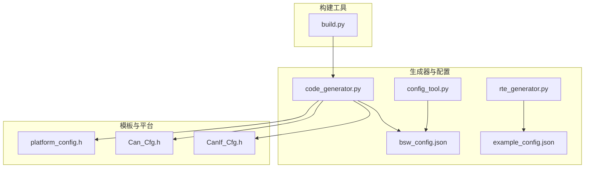
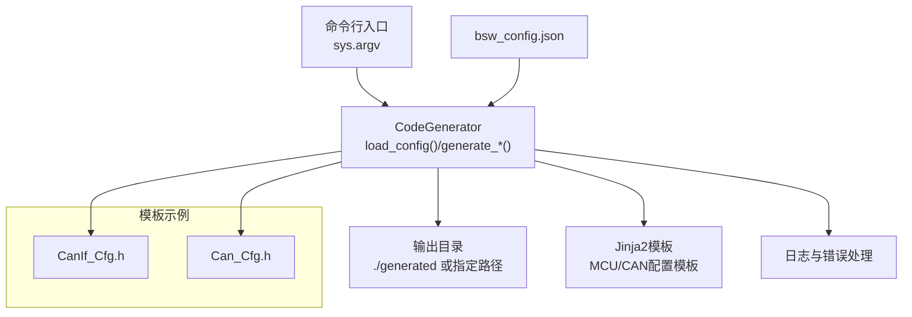
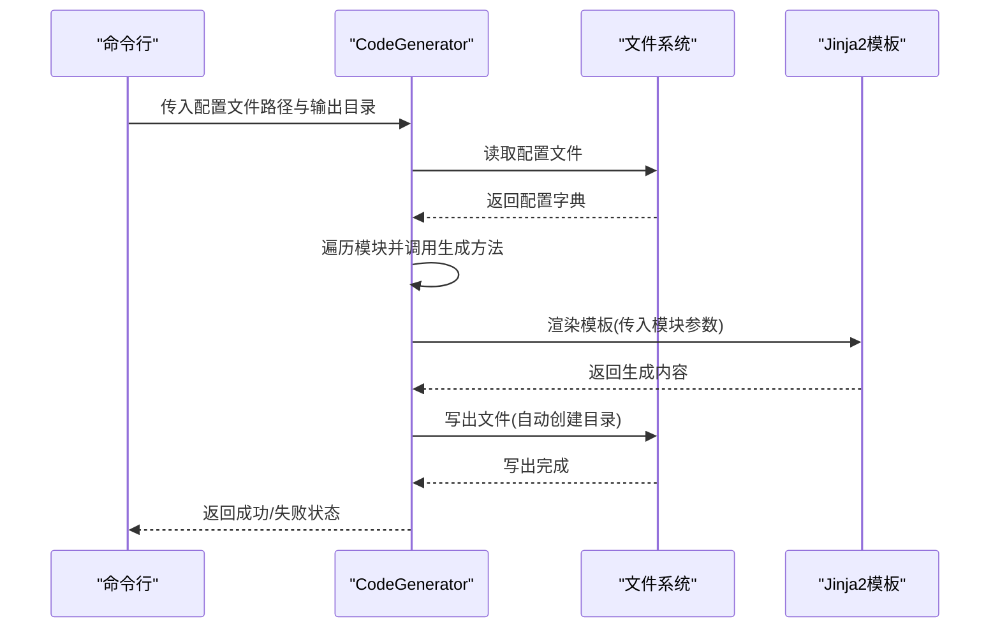
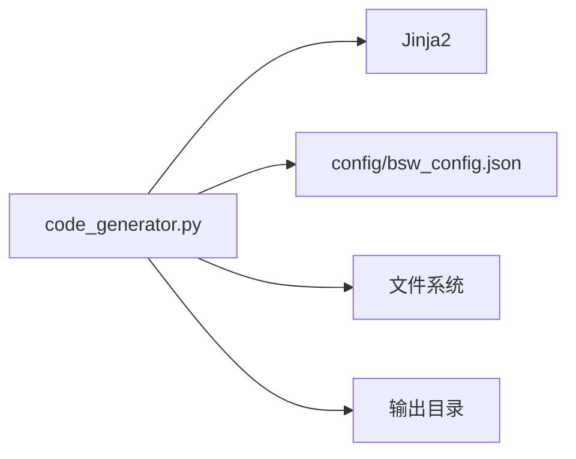

# 代码生成器

<cite>
**本文引用的文件**
- [tools/generator/src/code_generator.py](file://tools/generator/src/code_generator.py)
- [config/bsw_config.json](file://config/bsw_config.json)
- [tools/rte_generator/rte_generator.py](file://tools/rte_generator/rte_generator.py)
- [tools/rte_generator/example_config.json](file://tools/rte_generator/example_config.json)
- [tools/config/src/config_tool.py](file://tools/config/src/config_tool.py)
- [tools/build/build.py](file://tools/build/build.py)
- [src/bsw/config/templates/CanIf_Cfg.h](file://src/bsw/config/templates/CanIf_Cfg.h)
- [src/bsw/config/templates/Can_Cfg.h](file://src/bsw/config/templates/Can_Cfg.h)
- [platform/cortex-m/platform_config.h](file://platform/cortex-m/platform_config.h)
</cite>

## 目录
1. [简介](#简介)
2. [项目结构](#项目结构)
3. [核心组件](#核心组件)
4. [架构总览](#架构总览)
5. [详细组件分析](#详细组件分析)
6. [依赖分析](#依赖分析)
7. [性能考虑](#性能考虑)
8. [故障排查指南](#故障排查指南)
9. [结论](#结论)
10. [附录](#附录)

## 简介
本文件面向“代码生成器”子系统，系统性阐述基于Jinja2模板引擎的代码生成实现，覆盖模板文件结构、变量替换机制与输出格式；深入解释生成器工作流程（配置解析、模板加载、变量绑定与渲染）；明确支持的生成类型（头文件、源文件、配置文件与Makefile等）；提供模板定制指南（自定义模板编写、变量定义与条件渲染）；解释生成代码结构、命名约定与文件组织方式；并给出命令行参数、输出目录管理与错误处理机制。

## 项目结构
该仓库包含多个工具与生成器，其中与“代码生成器”直接相关的核心位置如下：
- 生成器实现：tools/generator/src/code_generator.py
- 配置文件：config/bsw_config.json
- 另一个生成器（RTE）：tools/rte_generator/rte_generator.py 与 tools/rte_generator/example_config.json
- 配置工具：tools/config/src/config_tool.py
- 构建工具：tools/build/build.py
- 模板样例：src/bsw/config/templates/*.h
- 平台配置：platform/cortex-m/platform_config.h

**图表来源**
- [tools/generator/src/code_generator.py](file://tools/generator/src/code_generator.py)
- [config/bsw_config.json](file://config/bsw_config.json)
- [tools/config/src/config_tool.py](file://tools/config/src/config_tool.py)
- [tools/rte_generator/rte_generator.py](file://tools/rte_generator/rte_generator.py)
- [tools/rte_generator/example_config.json](file://tools/rte_generator/example_config.json)
- [src/bsw/config/templates/CanIf_Cfg.h](file://src/bsw/config/templates/CanIf_Cfg.h)
- [src/bsw/config/templates/Can_Cfg.h](file://src/bsw/config/templates/Can_Cfg.h)
- [platform/cortex-m/platform_config.h](file://platform/cortex-m/platform_config.h)
- [tools/build/build.py](file://tools/build/build.py)

**章节来源**
- [tools/generator/src/code_generator.py](file://tools/generator/src/code_generator.py)
- [config/bsw_config.json](file://config/bsw_config.json)
- [tools/config/src/config_tool.py](file://tools/config/src/config_tool.py)
- [tools/rte_generator/rte_generator.py](file://tools/rte_generator/rte_generator.py)
- [tools/rte_generator/example_config.json](file://tools/rte_generator/example_config.json)
- [src/bsw/config/templates/CanIf_Cfg.h](file://src/bsw/config/templates/CanIf_Cfg.h)
- [src/bsw/config/templates/Can_Cfg.h](file://src/bsw/config/templates/Can_Cfg.h)
- [platform/cortex-m/platform_config.h](file://platform/cortex-m/platform_config.h)
- [tools/build/build.py](file://tools/build/build.py)

## 核心组件
- 基于Jinja2的代码生成器：负责从JSON配置读取模块参数，使用内嵌模板进行变量替换，并输出标准化的头文件。
- 配置工具：提供模块化数据类与配置文件的读写、校验能力，便于生成器消费统一格式的配置。
- RTE生成器：面向AutoSAR经典平台的RTE接口生成器，展示复杂模板拼装与多类型接口（发送/接收、NvBlock、客户端/服务端、模式切换）的代码生成。
- 模板样例：提供AutoSAR BSW层的配置头文件模板，体现命名约定与宏定义规范。
- 构建工具：提供完整的构建生命周期（清理、配置、构建、安装），可作为生成器产物的集成入口。

**章节来源**
- [tools/generator/src/code_generator.py](file://tools/generator/src/code_generator.py)
- [tools/config/src/config_tool.py](file://tools/config/src/config_tool.py)
- [tools/rte_generator/rte_generator.py](file://tools/rte_generator/rte_generator.py)
- [src/bsw/config/templates/CanIf_Cfg.h](file://src/bsw/config/templates/CanIf_Cfg.h)
- [src/bsw/config/templates/Can_Cfg.h](file://src/bsw/config/templates/Can_Cfg.h)
- [tools/build/build.py](file://tools/build/build.py)

## 架构总览
下图展示了“代码生成器”的高层架构与交互关系：

**图表来源**
- [tools/generator/src/code_generator.py](file://tools/generator/src/code_generator.py)
- [config/bsw_config.json](file://config/bsw_config.json)
- [src/bsw/config/templates/CanIf_Cfg.h](file://src/bsw/config/templates/CanIf_Cfg.h)
- [src/bsw/config/templates/Can_Cfg.h](file://src/bsw/config/templates/Can_Cfg.h)

## 详细组件分析

### 组件A：基于Jinja2的代码生成器（CodeGenerator）
- 职责
  - 加载JSON配置文件，解析模块参数。
  - 使用Jinja2模板对变量进行替换，生成标准化头文件。
  - 输出到指定目录，按需创建目录结构。
  - 提供命令行入口，支持默认输出路径与显式输出路径。

- 关键流程
  - 配置加载：读取配置文件并解析为字典。
  - 模块生成：逐个模块调用对应生成方法（如MCU、CAN）。
  - 模板渲染：将模块参数注入模板，生成内容。
  - 文件写出：确保输出目录存在，写入生成文件。
  - 错误处理：捕获异常并打印错误信息，返回成功/失败状态。

- 支持的生成类型
  - 头文件：当前实现生成以“.h”结尾的配置头文件（如Mcu_Cfg.h、Can_Cfg.h）。
  - 其他类型：通过扩展模板与生成方法，可支持源文件、配置文件与Makefile等。

- 命令行参数
  - 必选：配置文件路径。
  - 可选：输出目录，默认为“./generated”。

- 输出目录管理
  - 自动创建输出目录（含父级目录）。
  - 输出文件名遵循模块命名约定（如“模块名_Cfg.h”）。

- 错误处理
  - 配置加载失败时打印错误并返回False。
  - 各模块生成失败时记录错误并继续后续模块生成。
  - 最终汇总成功/失败状态。

**图表来源**
- [tools/generator/src/code_generator.py](file://tools/generator/src/code_generator.py)

**章节来源**
- [tools/generator/src/code_generator.py](file://tools/generator/src/code_generator.py)
- [config/bsw_config.json](file://config/bsw_config.json)

### 组件B：配置工具（ConfigManager）
- 职责
  - 定义模块数据类（含通用字段与特定模块字段）。
  - 从JSON配置文件加载模块配置，实例化对应模块对象。
  - 将内存中的模块配置序列化回JSON文件。
  - 提供配置校验（如版本必填等）。

- 与生成器的关系
  - 生成器可直接消费JSON配置；也可由配置工具生成/更新配置后供生成器使用。
  - 两者解耦，便于独立演进与测试。

**章节来源**
- [tools/config/src/config_tool.py](file://tools/config/src/config_tool.py)
- [config/bsw_config.json](file://config/bsw_config.json)

### 组件C：RTE生成器（RTE Generator）
- 职责
  - 从JSON描述软件组件（SWC）、端口与接口的配置中，生成RTE接口的C头文件与源文件。
  - 支持多种接口类型：发送/接收（SenderReceiver）、非易失存储块（NvBlock）、客户端/服务端（ClientServer）、模式切换（ModeSwitch）。
  - 生成API原型、宏、缓冲区与桩函数骨架，便于后续手动或半自动实现。

- 模板与变量
  - 使用字符串模板拼装，通过占位符与格式化函数注入变量（如SWC名称、接口类型、数据元素、COM/NVM标识等）。
  - 自动生成COM信号ID与NVM块ID的宏定义，便于上层模块引用。

- 与生成器的关系
  - 同属代码生成范畴，但面向不同层次（RTE接口 vs BSW配置）。
  - 可并行使用：先用配置工具生成基础配置，再用RTE生成器生成运行时接口。

**章节来源**
- [tools/rte_generator/rte_generator.py](file://tools/rte_generator/rte_generator.py)
- [tools/rte_generator/example_config.json](file://tools/rte_generator/example_config.json)

### 组件D：模板样例与平台配置
- 模板样例
  - 提供AutoSAR BSW层的配置头文件模板，展示命名约定、版本信息、宏定义与分段注释风格。
  - 用于指导生成器模板设计与输出格式一致性。

- 平台配置
  - 提供Cortex-M系列平台的通用配置头文件，包含内核选择、内存映射、时钟频率、中断与系统定时器等配置项。
  - 可作为生成器模板中的平台相关常量来源或参考。

**章节来源**
- [src/bsw/config/templates/CanIf_Cfg.h](file://src/bsw/config/templates/CanIf_Cfg.h)
- [src/bsw/config/templates/Can_Cfg.h](file://src/bsw/config/templates/Can_Cfg.h)
- [platform/cortex-m/platform_config.h](file://platform/cortex-m/platform_config.h)

## 依赖分析
- 生成器内部依赖
  - Python标准库：json、os、pathlib、typing。
  - Jinja2：模板渲染。
  - 无循环依赖，模块职责清晰。

- 生成器外部依赖
  - 配置文件：JSON格式，包含模块启用状态、版本与参数。
  - 模板：内嵌字符串模板或外部模板文件（当前实现使用内嵌模板）。
  - 平台配置：可选地被生成器模板引用。

**图表来源**
- [tools/generator/src/code_generator.py](file://tools/generator/src/code_generator.py)
- [config/bsw_config.json](file://config/bsw_config.json)

**章节来源**
- [tools/generator/src/code_generator.py](file://tools/generator/src/code_generator.py)
- [config/bsw_config.json](file://config/bsw_config.json)

## 性能考虑
- 模板渲染
  - 当前实现使用内嵌字符串模板，渲染开销低，适合小规模配置生成。
  - 若模板数量与复杂度上升，建议迁移到外部模板文件并缓存模板对象，减少重复解析成本。

- I/O与目录
  - 输出目录在每次生成前自动创建，避免重复mkdir调用；建议在批量生成时复用同一输出目录以减少磁盘操作。

- 并发与批处理
  - 生成器当前顺序执行各模块；若模块间无依赖，可考虑并发生成以提升吞吐。

[本节为通用建议，不直接分析具体文件]

## 故障排查指南
- 配置文件不存在或格式错误
  - 现象：生成器无法加载配置，返回失败。
  - 排查：确认配置文件路径正确，JSON语法合法；必要时使用配置工具重新生成默认配置。

- 模块禁用导致跳过
  - 现象：某模块未生成。
  - 排查：检查配置中模块的启用标志；若禁用则不会生成对应文件。

- 输出目录权限问题
  - 现象：写出失败。
  - 排查：确认输出目录具备写权限；必要时调整输出路径或使用管理员权限。

- 模板变量缺失
  - 现象：渲染报错或输出不完整。
  - 排查：核对模板所需变量是否在配置中提供；补充缺失参数或完善模板容错。

**章节来源**
- [tools/generator/src/code_generator.py](file://tools/generator/src/code_generator.py)
- [tools/config/src/config_tool.py](file://tools/config/src/config_tool.py)

## 结论
本代码生成器以简洁的Jinja2模板为核心，实现了从JSON配置到标准化头文件的自动化生成。其架构清晰、职责单一，易于扩展与维护。结合配置工具与RTE生成器，可覆盖从底层配置到运行时接口的全链路代码生成需求。建议后续引入外部模板文件、并发生成与更完善的模板校验机制，以进一步提升可维护性与性能。

[本节为总结性内容，不直接分析具体文件]

## 附录

### A. 模板定制指南
- 自定义模板编写
  - 使用Jinja2语法定义变量占位符与控制结构。
  - 将模板保存为外部文件并在生成器中加载，便于版本管理与团队协作。

- 变量定义
  - 在生成器中将配置参数映射到模板变量，确保变量命名与模板一致。
  - 对于复杂结构（如数组、嵌套对象），可在生成器中预处理为模板友好的形式。

- 条件渲染
  - 使用Jinja2的条件语句根据配置开关生成或跳过某段代码。
  - 对于可选功能，建议通过配置项控制模板分支，保持输出的一致性。

- 命名约定与输出格式
  - 统一采用“模块名_Cfg.h”等命名规则，便于集成与查找。
  - 输出文件采用AutoSAR风格的头部注释与宏定义，增强可读性与合规性。

**章节来源**
- [tools/generator/src/code_generator.py](file://tools/generator/src/code_generator.py)
- [src/bsw/config/templates/CanIf_Cfg.h](file://src/bsw/config/templates/CanIf_Cfg.h)
- [src/bsw/config/templates/Can_Cfg.h](file://src/bsw/config/templates/Can_Cfg.h)

### B. 命令行参数与使用示例
- 代码生成器
  - 参数：配置文件路径（必选），输出目录（可选，默认“./generated”）。
  - 示例：python code_generator.py config/bsw_config.json ./generated

- 构建工具
  - 参数：--clean、--configure、--build、--install、--project-root。
  - 示例：python build.py --build --project-root .

**章节来源**
- [tools/generator/src/code_generator.py](file://tools/generator/src/code_generator.py)
- [tools/build/build.py](file://tools/build/build.py)