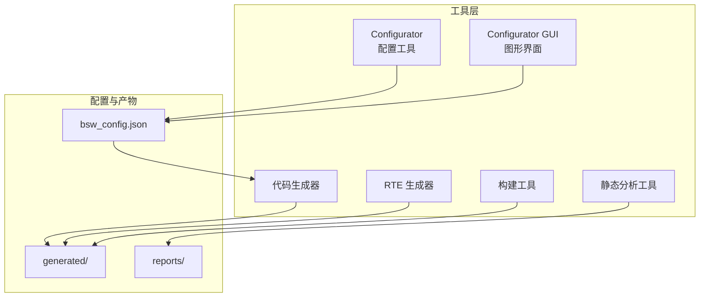
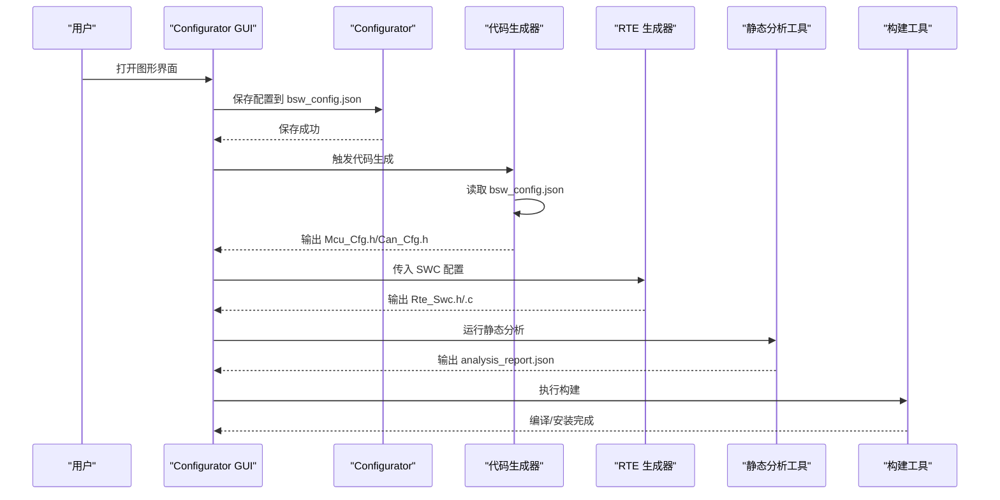
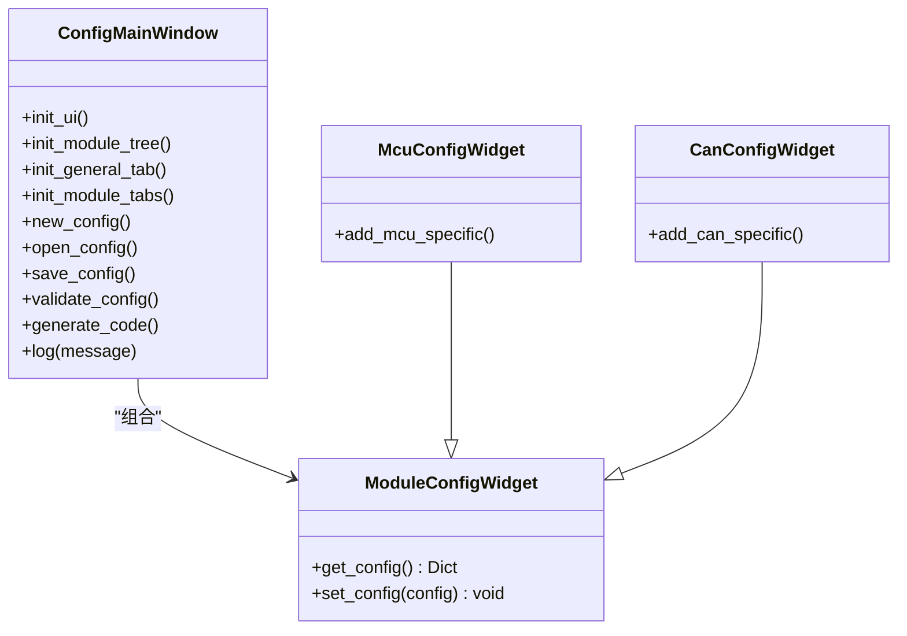
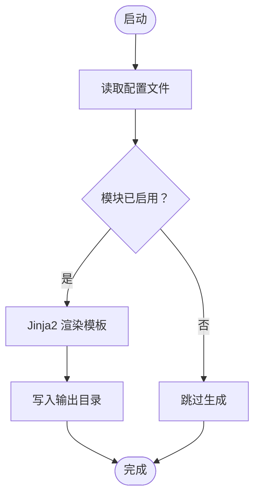
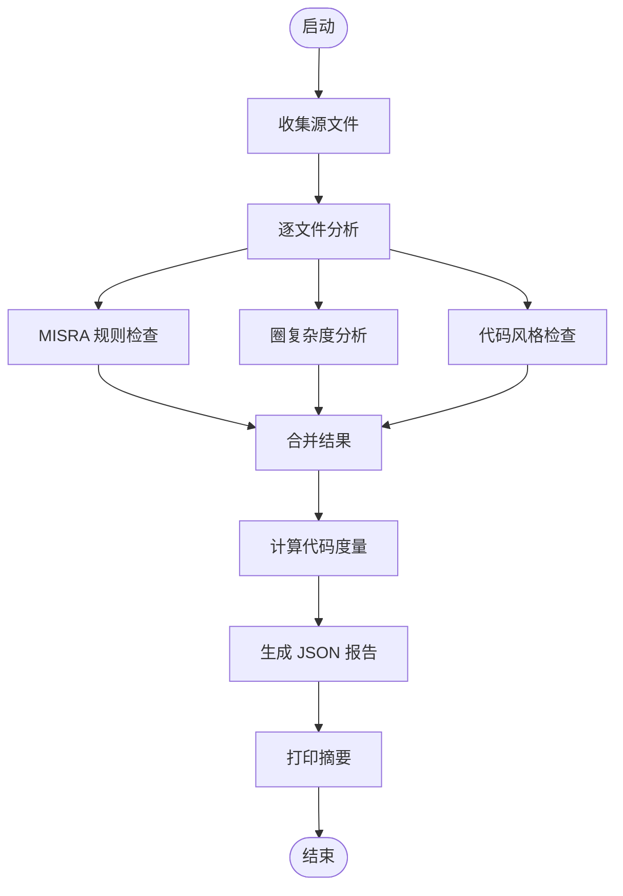
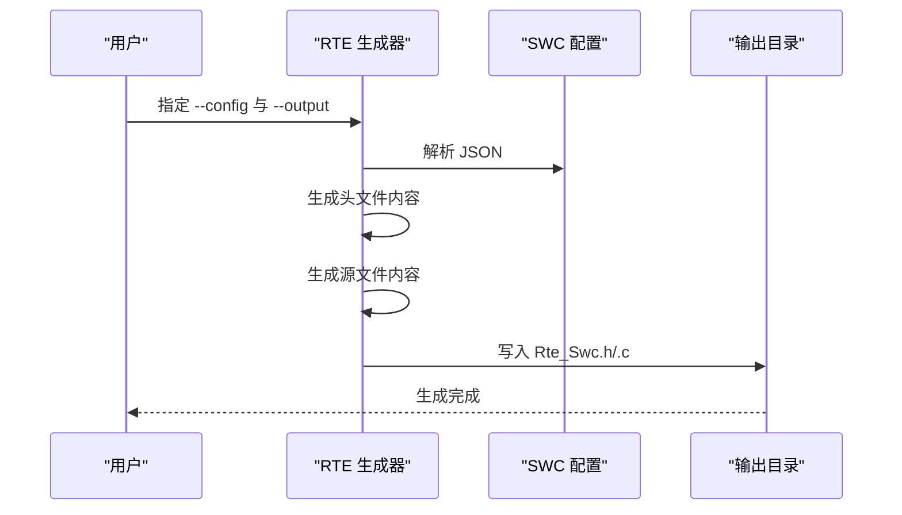
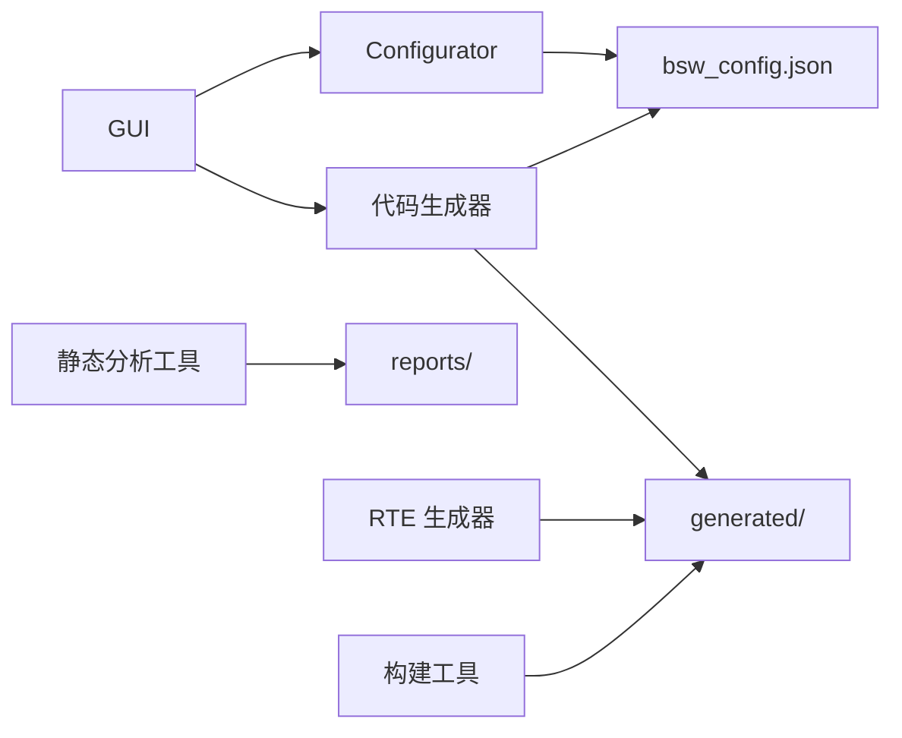

# 开发工具链

<cite>
**本文引用的文件列表**
- [config_tool.py](file://tools/config/src/config_tool.py)
- [config_gui.py](file://tools/config/gui/config_gui.py)
- [code_generator.py](file://tools/generator/src/code_generator.py)
- [rte_generator.py](file://tools/rte_generator/rte_generator.py)
- [static_analysis.py](file://tools/analysis/static_analysis.py)
- [build.py](file://tools/build/build.py)
- [bsw_config.json](file://config/bsw_config.json)
- [example_config.json](file://tools/rte_generator/example_config.json)
- [README.md](file://README.md)
</cite>

## 目录
1. [简介](#简介)
2. [项目结构](#项目结构)
3. [核心组件](#核心组件)
4. [架构总览](#架构总览)
5. [详细组件分析](#详细组件分析)
6. [依赖关系分析](#依赖关系分析)
7. [性能与质量考量](#性能与质量考量)
8. [故障排查指南](#故障排查指南)
9. [结论](#结论)
10. [附录](#附录)

## 简介
本文件系统性介绍该开发工具链的五个核心工具：Configurator 配置工具、GUI 图形界面、代码生成器、静态分析工具、RTE 生成器，并解释它们之间的协作关系与数据流转。文档覆盖命令行参数、配置选项、输出格式、安装部署、使用示例与集成方案，帮助团队提升开发效率与代码质量。

## 项目结构
工具链位于 tools 目录下，配合 config、generated、reports 等目录协同工作：
- tools/config：配置工具与图形界面
- tools/generator：代码生成器（基于模板）
- tools/rte_generator：RTE 代码自动生成器
- tools/analysis：静态分析与风格修复工具
- tools/build：构建自动化工具
- config：项目配置文件（如 bsw_config.json）
- generated：生成的代码输出目录
- reports：静态分析报告输出目录

图表来源
- [config_tool.py:126-158](file://tools/config/src/config_tool.py#L126-L158)
- [config_gui.py:371-397](file://tools/config/gui/config_gui.py#L371-L397)
- [code_generator.py:155-176](file://tools/generator/src/code_generator.py#L155-L176)
- [rte_generator.py:703-739](file://tools/rte_generator/rte_generator.py#L703-L739)
- [static_analysis.py:361-379](file://tools/analysis/static_analysis.py#L361-L379)
- [build.py:104-125](file://tools/build/build.py#L104-L125)

章节来源
- [README.md:153-199](file://README.md#L153-L199)

## 核心组件
- Configurator 配置工具：负责加载/保存/校验 BSW 模块配置，生成基础配置文件。
- Configurator GUI：提供图形界面，支持模块树浏览、配置编辑、保存/加载、验证与触发代码生成。
- 代码生成器：根据配置文件生成各模块的配置头文件（如 Mcu_Cfg.h、Can_Cfg.h）。
- 静态分析工具：执行 MISRA C 规则检查、圈复杂度分析、代码风格检查，输出 JSON 报告。
- RTE 生成器：根据 SWC 配置生成 RTE 接口头文件与源文件，遵循 AutoSAR Classic Platform 4.x 标准。
- 构建工具：封装 CMake 流程，支持清理、配置、编译、安装。

章节来源
- [config_tool.py:48-124](file://tools/config/src/config_tool.py#L48-L124)
- [config_gui.py:138-397](file://tools/config/gui/config_gui.py#L138-L397)
- [code_generator.py:59-153](file://tools/generator/src/code_generator.py#L59-L153)
- [static_analysis.py:52-379](file://tools/analysis/static_analysis.py#L52-L379)
- [rte_generator.py:180-701](file://tools/rte_generator/rte_generator.py#L180-L701)
- [build.py:15-103](file://tools/build/build.py#L15-L103)

## 架构总览
工具链围绕“配置—生成—分析—构建”的闭环展开。Configurator GUI 作为入口，负责生成 bsw_config.json；代码生成器读取该配置生成具体模块的配置头文件；静态分析工具对源码进行质量评估；RTE 生成器从 SWC 配置生成运行时接口；构建工具统一编译与安装。

图表来源
- [config_gui.py:371-397](file://tools/config/gui/config_gui.py#L371-L397)
- [config_tool.py:83-102](file://tools/config/src/config_tool.py#L83-L102)
- [code_generator.py:131-152](file://tools/generator/src/code_generator.py#L131-L152)
- [rte_generator.py:674-700](file://tools/rte_generator/rte_generator.py#L674-L700)
- [static_analysis.py:302-323](file://tools/analysis/static_analysis.py#L302-L323)
- [build.py:104-125](file://tools/build/build.py#L104-L125)

## 详细组件分析

### Configurator 配置工具
- 功能特性
  - 加载/保存配置文件（默认路径 config/bsw_config.json）
  - 校验模块配置（版本必填等）
  - 支持模块类型：Mcu、Can 等
- 命令行参数
  - 无参数：创建默认配置并保存
- 输出格式
  - JSON 文件（bsw_config.json），包含版本与模块集合
- 使用示例
  - 直接运行脚本生成默认配置并校验
- 集成方案
  - GUI 通过子进程调用该脚本或直接复用其逻辑

章节来源
- [config_tool.py:56-124](file://tools/config/src/config_tool.py#L56-L124)
- [bsw_config.json:1-21](file://config/bsw_config.json#L1-L21)

### Configurator GUI 图形界面
- 功能特性
  - 模块树：MCAL、ECUAL、Services、RTE 分类展示
  - 通用配置页：项目版本、目标平台、编译器
  - 模块配置页：Mcu、Can 等专用参数
  - 操作按钮：新建、打开、保存、验证、生成代码
  - 日志区域：记录操作状态
- 与代码生成器的集成
  - 点击“生成代码”后，调用 code_generator.py 并输出到 generated/
- 依赖与回退
  - 若未安装 PyQt5，则提示安装依赖

图表来源
- [config_gui.py:138-397](file://tools/config/gui/config_gui.py#L138-L397)
- [config_gui.py:28-136](file://tools/config/gui/config_gui.py#L28-L136)

章节来源
- [config_gui.py:138-397](file://tools/config/gui/config_gui.py#L138-L397)

### 代码生成器（模板引擎实现）
- 功能特性
  - 读取 bsw_config.json，按模块生成配置头文件
  - 当前支持：Mcu、Can
  - 使用 Jinja2 模板渲染
- 命令行参数
  - 必选：配置文件路径
  - 可选：输出目录（默认 ./generated）
- 输出格式
  - Mcu_Cfg.h、Can_Cfg.h 等头文件
- 模板引擎
  - 内置模板字符串，通过 Template 渲染变量
- 使用示例
  - python code_generator.py config/bsw_config.json generated

图表来源
- [code_generator.py:67-152](file://tools/generator/src/code_generator.py#L67-L152)

章节来源
- [code_generator.py:59-153](file://tools/generator/src/code_generator.py#L59-L153)

### 静态分析工具（质量评估机制）
- 功能特性
  - MISRA C 规则检查（简化规则集）
  - 圈复杂度分析（函数级）
  - 代码风格检查（行长、尾随空格、Tab 使用）
  - 生成 JSON 报告与控制台摘要
- 命令行参数
  - --project-root：项目根目录（默认当前目录）
  - --output：报告输出文件（默认 analysis_report.json）
- 输出格式
  - analysis_report.json（包含汇总、指标、问题列表、复杂度列表）
- 使用示例
  - python static_analysis.py --project-root . --output reports/static_analysis_report.json

图表来源
- [static_analysis.py:100-301](file://tools/analysis/static_analysis.py#L100-L301)

章节来源
- [static_analysis.py:52-379](file://tools/analysis/static_analysis.py#L52-L379)

### RTE 生成器（代码自动生成流程）
- 功能特性
  - 从 JSON 描述的 SWC 配置生成 Rte_Swc.h/.c
  - 支持 SenderReceiver、NvBlock、ClientServer、ModeSwitch 等接口类型
  - 生成 API 原型、宏、本地类型、缓冲区与 COM/NVM 接口
- 命令行参数
  - --config：输入 JSON 配置文件
  - --output：输出目录（生成的头/源文件）
- 输出格式
  - Rte_<Swc>.h、Rte_<Swc>.c
- 使用示例
  - python rte_generator.py --config tools/rte_generator/example_config.json --output src/bsw/rte/generated/

图表来源
- [rte_generator.py:180-701](file://tools/rte_generator/rte_generator.py#L180-L701)

章节来源
- [rte_generator.py:180-739](file://tools/rte_generator/rte_generator.py#L180-L739)
- [example_config.json:1-128](file://tools/rte_generator/example_config.json#L1-L128)

### 构建工具（安装部署与集成）
- 功能特性
  - 封装 CMake 流程：清理、配置、构建、安装
  - 支持分步执行或全量构建
- 命令行参数
  - --clean、--configure、--build、--install
  - --project-root：项目根目录（默认当前目录）
- 使用示例
  - python build.py（全量构建）
  - python build.py --build（仅构建）

章节来源
- [build.py:15-167](file://tools/build/build.py#L15-L167)

## 依赖关系分析
- 工具间耦合
  - GUI 依赖 Configurator 与代码生成器（通过子进程调用）
  - 代码生成器依赖 bsw_config.json
  - 静态分析工具独立运行，输出报告供后续流程使用
  - RTE 生成器独立运行，输出到生成目录
  - 构建工具独立运行，消费 generated/ 产物
- 外部依赖
  - Python 标准库
  - PyQt5（GUI 可选）
  - Jinja2（代码生成器）
  - CMake（构建工具）

图表来源
- [config_gui.py:371-397](file://tools/config/gui/config_gui.py#L371-L397)
- [code_generator.py:131-152](file://tools/generator/src/code_generator.py#L131-L152)
- [static_analysis.py:302-323](file://tools/analysis/static_analysis.py#L302-L323)
- [rte_generator.py:674-700](file://tools/rte_generator/rte_generator.py#L674-L700)
- [build.py:104-125](file://tools/build/build.py#L104-L125)

## 性能与质量考量
- 性能
  - 静态分析：按文件扫描，复杂度与正则匹配为主，适合中等规模项目
  - 代码生成：模板渲染，I/O 写入，速度取决于文件数量与大小
  - 构建工具：调用 CMake，受硬件与工具链影响
- 质量
  - MISRA 规则与复杂度阈值有助于提升可维护性
  - 自动生成的 RTE 与配置头文件遵循 AutoSAR 标准，减少手工错误
  - GUI 提供可视化配置与一键生成，降低出错概率

## 故障排查指南
- GUI 无法启动
  - 症状：提示 PyQt5 不可用
  - 处理：安装 PyQt5 后重试
- 代码生成失败
  - 症状：返回非零退出码
  - 处理：检查配置文件路径与权限；确认生成目录存在且可写
- 静态分析报错
  - 症状：解析 JSON 失败或编码异常
  - 处理：检查文件编码与 JSON 格式；排除 tools 与 generated 目录
- 构建失败
  - 症状：CMake 配置/编译阶段报错
  - 处理：确认 CMake 工具链与编译器可用；查看详细错误输出

章节来源
- [config_gui.py:401-403](file://tools/config/gui/config_gui.py#L401-L403)
- [code_generator.py:168-171](file://tools/generator/src/code_generator.py#L168-L171)
- [static_analysis.py:128-131](file://tools/analysis/static_analysis.py#L128-L131)
- [build.py:49-56](file://tools/build/build.py#L49-L56)

## 结论
该工具链通过图形化配置、模板化代码生成、静态分析与构建工具的协同，形成从配置到产物的一体化流程。结合 AutoSAR 标准与 MISRA 规则，有效提升开发效率与代码质量。建议在 CI/CD 中集成静态分析与构建步骤，确保持续交付质量。

## 附录
- 安装与环境要求
  - Python 3.9+
  - 可选：PyQt5（GUI）、Jinja2（代码生成器）
  - CMake 3.20+（构建）
- 常用命令
  - 生成配置：python tools/config/src/config_tool.py
  - 图形界面：python tools/config/gui/config_gui.py
  - 代码生成：python tools/generator/src/code_generator.py config/bsw_config.json generated
  - 静态分析：python tools/analysis/static_analysis.py --project-root . --output reports/static_analysis_report.json
  - 构建：python tools/build/build.py

章节来源
- [README.md:97-133](file://README.md#L97-L133)
- [config_tool.py:126-158](file://tools/config/src/config_tool.py#L126-L158)
- [config_gui.py:399-419](file://tools/config/gui/config_gui.py#L399-L419)
- [code_generator.py:155-176](file://tools/generator/src/code_generator.py#L155-L176)
- [static_analysis.py:361-379](file://tools/analysis/static_analysis.py#L361-L379)
- [build.py:127-167](file://tools/build/build.py#L127-L167)