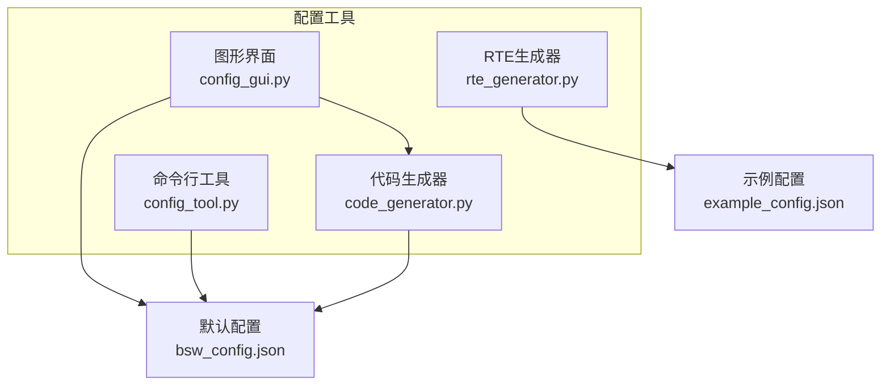
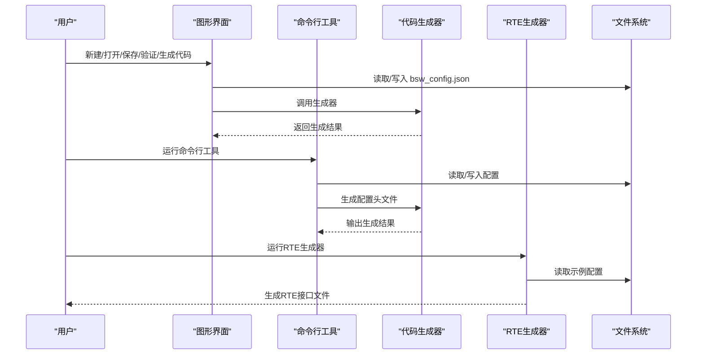
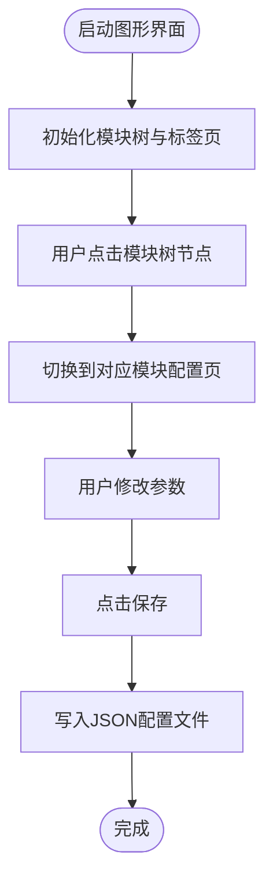
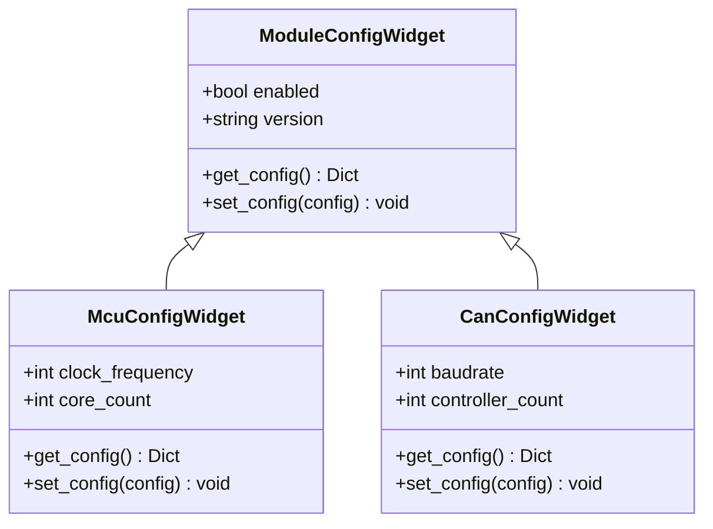
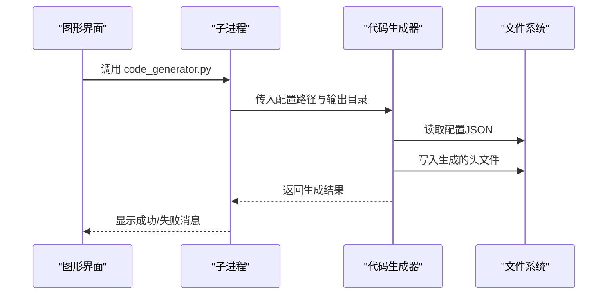
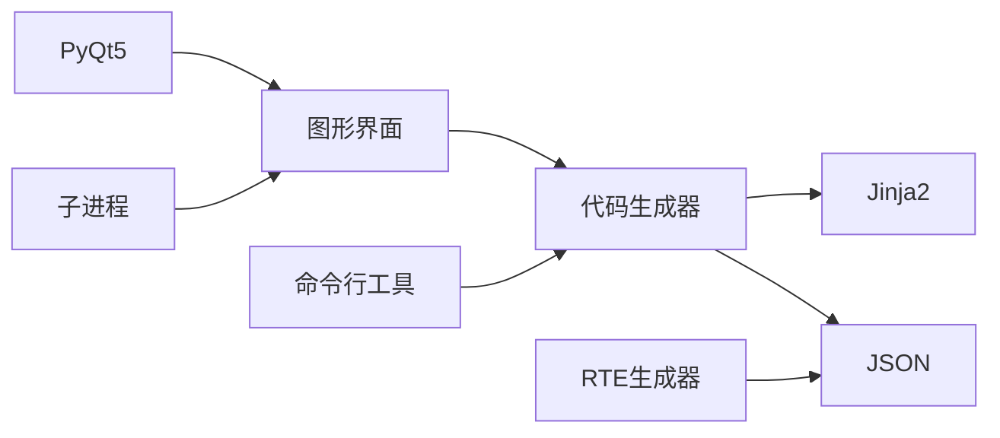

# 配置工具(Configurator)

<cite>
**本文引用的文件**
- [config_gui.py](file://tools/config/gui/config_gui.py)
- [config_tool.py](file://tools/config/src/config_tool.py)
- [code_generator.py](file://tools/generator/src/code_generator.py)
- [rte_generator.py](file://tools/rte_generator/rte_generator.py)
- [bsw_config.json](file://config/bsw_config.json)
- [example_config.json](file://tools/rte_generator/example_config.json)
- [modules.md](file://docs/modules.md)
- [README.md](file://README.md)
</cite>

## 目录
1. [简介](#简介)
2. [项目结构](#项目结构)
3. [核心组件](#核心组件)
4. [架构总览](#架构总览)
5. [详细组件分析](#详细组件分析)
6. [依赖关系分析](#依赖关系分析)
7. [性能与可用性考虑](#性能与可用性考虑)
8. [故障排查指南](#故障排查指南)
9. [结论](#结论)
10. [附录](#附录)

## 简介
本文件面向“配置工具(Configurator)”的使用者与维护者，系统化介绍基于PyQt5的图形化配置界面设计与命令行工具，涵盖模块树导航、配置表单控件、验证机制与代码生成功能。文档同时说明GUI界面的模块树结构、配置标签页、按钮功能与日志显示；解释配置数据结构、JSON格式规范与模块配置参数；并提供完整的使用流程（新建配置、模块选择、参数设置、配置验证与保存导出），以及命令行模式的使用方法与CLI工具的功能特性。最后给出支持的模块类型、配置参数范围与默认值设置说明。

## 项目结构
配置工具相关的核心位置如下：
- 图形界面：tools/config/gui/config_gui.py
- 命令行工具：tools/config/src/config_tool.py
- 代码生成器：tools/generator/src/code_generator.py
- RTE生成器：tools/rte_generator/rte_generator.py
- 默认配置示例：config/bsw_config.json
- 示例RTE配置：tools/rte_generator/example_config.json
- 模块清单与规范：docs/modules.md
- 项目总览与模块清单：README.md

图表来源
- [config_gui.py:138-419](file://tools/config/gui/config_gui.py#L138-L419)
- [config_tool.py:48-158](file://tools/config/src/config_tool.py#L48-L158)
- [code_generator.py:59-176](file://tools/generator/src/code_generator.py#L59-L176)
- [rte_generator.py:703-739](file://tools/rte_generator/rte_generator.py#L703-L739)
- [bsw_config.json:1-21](file://config/bsw_config.json#L1-L21)
- [example_config.json:1-128](file://tools/rte_generator/example_config.json#L1-L128)

章节来源
- [README.md:153-199](file://README.md#L153-L199)
- [modules.md:1-639](file://docs/modules.md#L1-L639)

## 核心组件
- 图形界面主窗口与模块树导航：负责模块树展示、模块选择与标签页切换。
- 模块配置控件：通用模块配置控件与具体模块（如Mcu、Can）的专用控件。
- 通用配置页：项目版本、目标平台、编译器等全局设置。
- 按钮区：新建、打开、保存、验证、生成代码。
- 日志显示：实时输出操作结果与错误信息。
- 命令行工具：加载/保存配置、验证配置、生成默认配置。
- 代码生成器：根据配置生成MCAL/ECUAL等模块的配置头文件。
- RTE生成器：根据SWC配置生成RTE接口代码（C头与源文件）。

章节来源
- [config_gui.py:28-419](file://tools/config/gui/config_gui.py#L28-L419)
- [config_tool.py:15-158](file://tools/config/src/config_tool.py#L15-L158)
- [code_generator.py:59-176](file://tools/generator/src/code_generator.py#L59-L176)
- [rte_generator.py:180-739](file://tools/rte_generator/rte_generator.py#L180-L739)

## 架构总览
图形界面与命令行工具共同围绕配置数据结构工作，GUI负责交互与可视化，CLI负责批处理与自动化；两者均可调用代码生成器生成最终的配置头文件；RTE生成器独立于BSW配置，面向软件组件（SWC）的接口生成。

图表来源
- [config_gui.py:371-396](file://tools/config/gui/config_gui.py#L371-L396)
- [config_tool.py:126-153](file://tools/config/src/config_tool.py#L126-L153)
- [code_generator.py:131-152](file://tools/generator/src/code_generator.py#L131-L152)
- [rte_generator.py:703-739](file://tools/rte_generator/rte_generator.py#L703-L739)

## 详细组件分析

### 图形界面组件与交互流程
- 模块树导航：左侧树形结构按层级组织MCAL、ECUAL、Services、RTE模块，点击节点自动切换右侧对应模块配置页。
- 配置标签页：通用配置页（项目版本、目标平台、编译器）与各模块配置页（如Mcu、Can）。
- 按钮功能：
  - 新建：清空当前配置，重置UI。
  - 打开：选择JSON文件加载配置，回填UI。
  - 保存：收集UI配置写入JSON文件。
  - 验证：检查必填项与有效性。
  - 生成代码：调用代码生成器，产出配置头文件。
- 日志显示：底部只读文本框，记录操作与错误信息。

图表来源
- [config_gui.py:162-193](file://tools/config/gui/config_gui.py#L162-L193)
- [config_gui.py:296-300](file://tools/config/gui/config_gui.py#L296-L300)

章节来源
- [config_gui.py:138-419](file://tools/config/gui/config_gui.py#L138-L419)

### 模块配置控件体系
- 通用模块控件：提供模块启用/禁用、版本号等通用字段。
- 具体模块控件：
  - Mcu：时钟频率、核心数。
  - Can：波特率、控制器数量。
- 控件继承关系与数据收集/回填逻辑清晰，便于扩展更多模块类型。

图表来源
- [config_gui.py:28-136](file://tools/config/gui/config_gui.py#L28-L136)

章节来源
- [config_gui.py:28-136](file://tools/config/gui/config_gui.py#L28-L136)

### 通用配置页与模块标签页
- 通用配置页：项目版本、目标平台（i.MX8M Mini、STM32F4xx、STM32H7xx、Generic Cortex-M4/7）、编译器（GCC、IAR、Keil）。
- 模块标签页：Mcu、Can等模块专用配置页，对应控件负责参数输入与数据绑定。

章节来源
- [config_gui.py:258-294](file://tools/config/gui/config_gui.py#L258-L294)

### 验证机制
- 图形界面验证：检查项目版本是否为空；当模块启用时，版本字段必须非空。
- 命令行工具验证：遍历模块，若启用则要求版本非空，返回布尔结果。

章节来源
- [config_gui.py:350-370](file://tools/config/gui/config_gui.py#L350-L370)
- [config_tool.py:112-123](file://tools/config/src/config_tool.py#L112-L123)

### 代码生成流程
- GUI调用：通过子进程调用代码生成器，传入配置路径与输出目录。
- CLI调用：直接运行代码生成器，支持指定配置文件与输出目录。
- 生成内容：针对启用的模块生成对应的配置头文件（如Mcu_Cfg.h、Can_Cfg.h）。

图表来源
- [config_gui.py:371-396](file://tools/config/gui/config_gui.py#L371-L396)
- [code_generator.py:131-152](file://tools/generator/src/code_generator.py#L131-L152)

章节来源
- [config_gui.py:371-396](file://tools/config/gui/config_gui.py#L371-L396)
- [code_generator.py:59-176](file://tools/generator/src/code_generator.py#L59-L176)

### 命令行工具与使用流程
- 默认配置生成：创建ConfigManager，添加默认模块（Mcu、Can），保存配置并进行验证。
- 加载/保存：从JSON文件加载配置，或将内存中的模块配置序列化为JSON。
- 验证：逐模块检查启用状态与版本字段。

章节来源
- [config_tool.py:126-153](file://tools/config/src/config_tool.py#L126-L153)
- [config_tool.py:48-123](file://tools/config/src/config_tool.py#L48-L123)

### 配置数据结构与JSON规范
- BSW配置结构（bsw_config.json）
  - 版本号：顶层version字段。
  - 模块集合：modules对象，键为模块名，值为模块配置对象。
  - 模块配置对象包含：name、enabled、version、parameters及模块特定参数（如clock_frequency、core_count、baudrate、controller_count等）。
- 示例：Mcu与Can模块的默认配置已包含上述字段。

章节来源
- [bsw_config.json:1-21](file://config/bsw_config.json#L1-L21)

### 支持的模块类型与参数范围
- MCAL层（9个模块）：Mcu、Port、Dio、Can、Spi、Gpt、Pwm、Adc、Wdg。
- ECUAL层（9个模块）：CanIf、IoHwAb、CanTp、EthIf、MemIf、Fee、Ea、FrIf、LinIf。
- 服务层（5个模块）：Com、PduR、NvM、Dcm、Dem。
- RTE层（1个模块）：Rte。
- ASW层（8个组件）：EngineControl、VehicleDynamics、DiagnosticManager、CommunicationManager、StorageManager、IOControl、ModeManager、WatchdogManager。

章节来源
- [modules.md:18-337](file://docs/modules.md#L18-L337)
- [README.md:201-246](file://README.md#L201-L246)

### 默认值与参数范围
- GUI默认值（示例）：
  - Mcu：时钟频率默认值、核心数默认值。
  - Can：波特率默认值、控制器数量默认值。
- CLI默认值（示例）：
  - Mcu：时钟频率默认值、核心数默认值。
  - Can：波特率默认值、控制器数量默认值。
- 参数范围（示例）：
  - Mcu：时钟频率范围、核心数范围。
  - Can：波特率枚举值、控制器数量范围。

章节来源
- [config_gui.py:62-96](file://tools/config/gui/config_gui.py#L62-L96)
- [config_tool.py:28-46](file://tools/config/src/config_tool.py#L28-L46)

### 命令行模式与CLI工具
- PyQt5不可用时，GUI自动降级为CLI模式，提示安装PyQt5。
- CLI工具提供：
  - 生成默认配置并保存。
  - 加载配置、保存配置。
  - 验证配置。
- 代码生成器支持命令行参数：配置文件路径与输出目录。

章节来源
- [config_gui.py:13-25](file://tools/config/gui/config_gui.py#L13-L25)
- [config_tool.py:126-153](file://tools/config/src/config_tool.py#L126-L153)
- [code_generator.py:155-171](file://tools/generator/src/code_generator.py#L155-L171)

## 依赖关系分析
- GUI依赖：
  - PyQt5（QtWidgets、QtCore、QtGui）。
  - 子进程调用代码生成器。
- CLI依赖：
  - JSON解析与序列化。
  - dataclass用于配置模型。
- 代码生成器依赖：
  - Jinja2模板引擎。
  - JSON解析。
- RTE生成器依赖：
  - JSON解析。
  - 字符串模板拼接。

图表来源
- [config_gui.py:13-25](file://tools/config/gui/config_gui.py#L13-L25)
- [code_generator.py:12-12](file://tools/generator/src/code_generator.py#L12-L12)
- [rte_generator.py:13-17](file://tools/rte_generator/rte_generator.py#L13-L17)

章节来源
- [config_gui.py:13-25](file://tools/config/gui/config_gui.py#L13-L25)
- [config_tool.py:8-12](file://tools/config/src/config_tool.py#L8-L12)
- [code_generator.py:12-12](file://tools/generator/src/code_generator.py#L12-L12)
- [rte_generator.py:13-17](file://tools/rte_generator/rte_generator.py#L13-L17)

## 性能与可用性考虑
- GUI响应：模块树展开与标签页切换为轻量操作，建议避免在大量模块时频繁刷新。
- 验证效率：图形界面与CLI验证均为O(n)遍历模块，性能良好。
- 生成效率：代码生成器按模块逐一渲染模板，I/O为瓶颈；建议批量生成与缓存模板。
- 错误提示：GUI与CLI均提供明确错误信息，便于定位问题。

[本节为通用指导，不直接分析具体文件]

## 故障排查指南
- PyQt5未安装：GUI提示安装PyQt5并退出；确保Python环境满足依赖。
- 配置文件格式错误：打开配置时捕获异常并弹出错误对话框；检查JSON语法与字段完整性。
- 生成失败：检查配置中启用模块的必要参数是否填写；查看日志输出的stderr信息。
- 权限问题：保存/生成文件时确认目标目录可写。

章节来源
- [config_gui.py:23-25](file://tools/config/gui/config_gui.py#L23-L25)
- [config_gui.py:328-329](file://tools/config/gui/config_gui.py#L328-L329)
- [config_gui.py:394-396](file://tools/config/gui/config_gui.py#L394-L396)

## 结论
配置工具提供了图形化与命令行两种使用方式，覆盖了从配置创建、参数设置、验证到代码生成的完整流程。GUI直观易用，CLI适合自动化集成；二者共享统一的配置数据结构与生成器，保证一致性与可扩展性。建议在团队协作中优先使用GUI进行交互式配置，在CI/CD中使用CLI与生成器实现自动化。

[本节为总结，不直接分析具体文件]

## 附录

### 使用流程（图形界面）
- 新建配置：点击“新建”，清空当前配置。
- 打开配置：点击“打开”，选择bsw_config.json加载。
- 选择模块：在左侧模块树中点击模块，右侧切换到对应配置页。
- 设置参数：在模块配置页调整参数（如Mcu时钟频率、Can波特率等）。
- 验证配置：点击“验证”，检查必填项与有效性。
- 保存配置：点击“保存”，选择保存路径与文件名。
- 生成代码：点击“生成代码”，等待生成完成并查看日志。

章节来源
- [config_gui.py:198-216](file://tools/config/gui/config_gui.py#L198-L216)
- [config_gui.py:306-348](file://tools/config/gui/config_gui.py#L306-L348)
- [config_gui.py:350-396](file://tools/config/gui/config_gui.py#L350-L396)

### 使用流程（命令行）
- 生成默认配置：运行命令行工具，自动生成并保存默认配置。
- 加载/保存配置：通过工具加载现有配置或保存当前配置。
- 验证配置：工具输出验证结果。
- 生成代码：调用代码生成器，传入配置文件与输出目录。

章节来源
- [config_tool.py:126-153](file://tools/config/src/config_tool.py#L126-L153)
- [code_generator.py:155-171](file://tools/generator/src/code_generator.py#L155-L171)

### 配置数据结构与JSON规范
- BSW配置（bsw_config.json）
  - 顶层字段：version、modules。
  - 模块字段：name、enabled、version、parameters及模块特定参数。
- 示例配置（example_config.json）
  - 软件组件（SWC）列表，包含端口与接口类型（SenderReceiver、NvBlock、ClientServer、ModeSwitch）。

章节来源
- [bsw_config.json:1-21](file://config/bsw_config.json#L1-L21)
- [example_config.json:1-128](file://tools/rte_generator/example_config.json#L1-L128)

### 支持的模块类型与参数范围
- 模块类型：MCAL、ECUAL、Service、RTE、ASW。
- 参数范围与默认值：见GUI与CLI中的控件与dataclass定义。

章节来源
- [modules.md:18-337](file://docs/modules.md#L18-L337)
- [config_gui.py:62-96](file://tools/config/gui/config_gui.py#L62-L96)
- [config_tool.py:28-46](file://tools/config/src/config_tool.py#L28-L46)