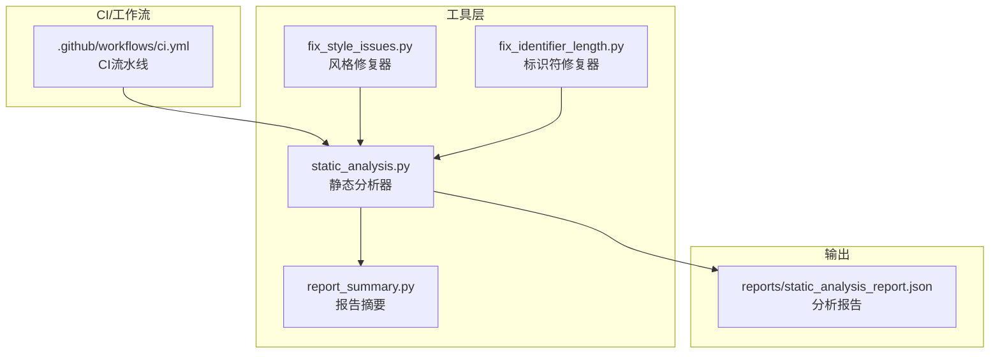
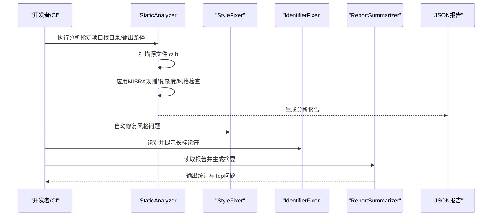
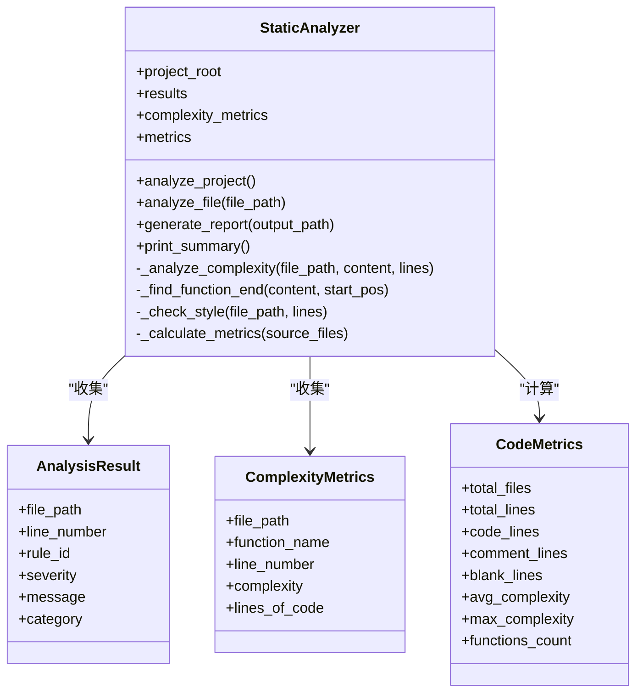
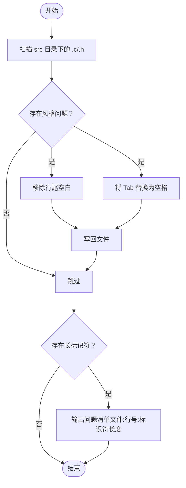
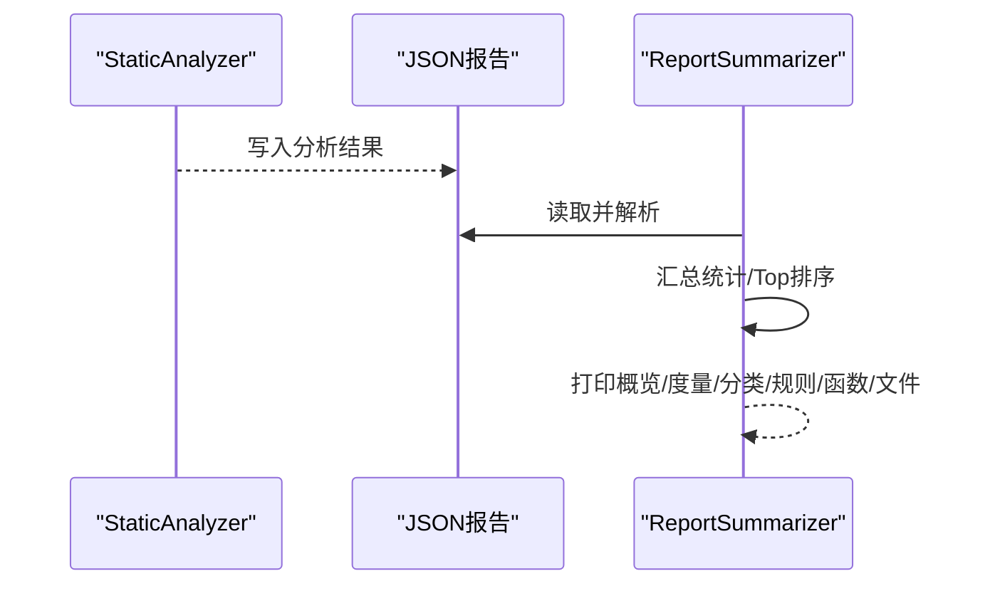
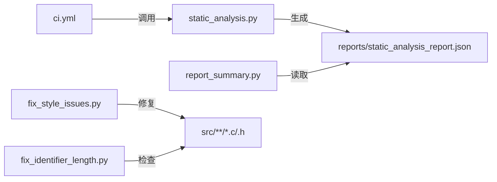

# 静态分析工具

<cite>
**本文引用的文件**
- [static_analysis.py](file://tools/analysis/static_analysis.py)
- [fix_style_issues.py](file://tools/analysis/fix_style_issues.py)
- [fix_identifier_length.py](file://tools/analysis/fix_identifier_length.py)
- [report_summary.py](file://tools/analysis/report_summary.py)
- [ci.yml](file://\.github/workflows/ci.yml)
- [README.md](file://README.md)
- [development-guide.md](file://docs/development-guide.md)
- [api-reference.md](file://docs/api-reference.md)
- [bsw_config.json](file://config/bsw_config.json)
- [static_analysis_report.json](file://reports/static_analysis_report.json)
- [main.c](file://examples/can_demo/main.c)
- [main.c](file://examples/led_blink/main.c)
</cite>

## 目录
1. [简介](#简介)
2. [项目结构](#项目结构)
3. [核心组件](#核心组件)
4. [架构总览](#架构总览)
5. [详细组件分析](#详细组件分析)
6. [依赖分析](#依赖分析)
7. [性能考虑](#性能考虑)
8. [故障排查指南](#故障排查指南)
9. [结论](#结论)
10. [附录](#附录)

## 简介
本文件为静态分析工具的技术文档，面向代码质量与合规性保障，覆盖 MISRA C 规则检查、圈复杂度分析、代码风格检查与报告生成等能力。工具围绕“扫描器-规则引擎-修复器-报告器”的分层架构组织，支持批量分析、质量统计与 CI 集成，帮助团队在开发早期发现潜在问题并持续改进。

## 项目结构
静态分析工具位于 tools/analysis 目录，配合 CI 工作流在 GitHub Actions 中执行，并输出 JSON 报告供后续汇总与展示。

图示来源
- [static_analysis.py](file://tools/analysis/static_analysis.py)
- [fix_style_issues.py](file://tools/analysis/fix_style_issues.py)
- [fix_identifier_length.py](file://tools/analysis/fix_identifier_length.py)
- [report_summary.py](file://tools/analysis/report_summary.py)
- [ci.yml](file://\.github/workflows/ci.yml)
- [static_analysis_report.json](file://reports/static_analysis_report.json)

章节来源
- [README.md](file://README.md)
- [ci.yml](file://\.github/workflows/ci.yml)

## 核心组件
- 扫描器（StaticAnalyzer）：负责遍历源码、匹配规则、统计度量与生成报告。
- 规则引擎：内置 MISRA C 规则集合与正则表达式，覆盖命名、复杂度、风格等维度。
- 修复器：提供风格修复与标识符长度修复脚本，辅助自动化清理。
- 报告生成器：输出结构化 JSON 报告，并提供摘要工具进行统计与可视化。

章节来源
- [static_analysis.py](file://tools/analysis/static_analysis.py)
- [fix_style_issues.py](file://tools/analysis/fix_style_issues.py)
- [fix_identifier_length.py](file://tools/analysis/fix_identifier_length.py)
- [report_summary.py](file://tools/analysis/report_summary.py)

## 架构总览
静态分析工具采用“命令行驱动 + JSON 报告”的轻量架构，支持本地执行与 CI 集成。

图示来源
- [static_analysis.py](file://tools/analysis/static_analysis.py)
- [fix_style_issues.py](file://tools/analysis/fix_style_issues.py)
- [fix_identifier_length.py](file://tools/analysis/fix_identifier_length.py)
- [report_summary.py](file://tools/analysis/report_summary.py)

## 详细组件分析

### 静态分析器（扫描与规则引擎）
- 职责
  - 遍历项目源文件，过滤 tools 与 generated 目录。
  - 应用 MISRA C 规则集合，匹配正则并定位问题。
  - 计算圈复杂度与代码度量，统计函数数量、注释率等。
  - 生成结构化 JSON 报告，包含汇总、度量、问题列表与复杂度明细。
- 关键实现要点
  - MISRA 规则：包含对 goto、空 if 表达式、函数返回类型、标识符长度等的检查。
  - 圈复杂度：基于关键字计数与函数体范围估算，阈值为 10。
  - 代码风格：行长度、尾随空白、Tab 使用等。
  - 报告结构：summary、metrics、issues、complexity 字段。

图示来源
- [static_analysis.py](file://tools/analysis/static_analysis.py)

章节来源
- [static_analysis.py](file://tools/analysis/static_analysis.py)

### 修复器
- 风格修复器（fix_style_issues.py）
  - 修复行尾空白、将 Tab 替换为空格，按 .c/.h 批量处理 src 目录。
- 标识符修复器（fix_identifier_length.py）
  - 识别超过 31 字符的宏定义，输出问题清单，提示需人工审查。

图示来源
- [fix_style_issues.py](file://tools/analysis/fix_style_issues.py)
- [fix_identifier_length.py](file://tools/analysis/fix_identifier_length.py)

章节来源
- [fix_style_issues.py](file://tools/analysis/fix_style_issues.py)
- [fix_identifier_length.py](file://tools/analysis/fix_identifier_length.py)

### 报告生成与摘要
- 报告生成器（static_analysis.py）
  - 输出 JSON，包含 summary、metrics、issues、complexity。
- 报告摘要（report_summary.py）
  - 统计总问题数、各类别分布、Top 规则、Top 高复杂度函数、Top 问题文件。

图示来源
- [static_analysis.py](file://tools/analysis/static_analysis.py)
- [report_summary.py](file://tools/analysis/report_summary.py)
- [static_analysis_report.json](file://reports/static_analysis_report.json)

章节来源
- [static_analysis.py](file://tools/analysis/static_analysis.py)
- [report_summary.py](file://tools/analysis/report_summary.py)
- [static_analysis_report.json](file://reports/static_analysis_report.json)

## 依赖分析
- 外部依赖
  - Python 标准库：os、re、json、pathlib、argparse、dataclasses、collections。
  - 第三方库：Jinja2（在其他工具中使用，非静态分析核心依赖）。
- 内部耦合
  - 扫描器与修复器解耦，修复器独立于扫描器执行。
  - 报告生成与摘要工具依赖统一的 JSON 结构。

图示来源
- [static_analysis.py](file://tools/analysis/static_analysis.py)
- [report_summary.py](file://tools/analysis/report_summary.py)
- [fix_style_issues.py](file://tools/analysis/fix_style_issues.py)
- [fix_identifier_length.py](file://tools/analysis/fix_identifier_length.py)
- [ci.yml](file://\.github/workflows/ci.yml)
- [static_analysis_report.json](file://reports/static_analysis_report.json)

章节来源
- [ci.yml](file://\.github/workflows/ci.yml)
- [static_analysis.py](file://tools/analysis/static_analysis.py)

## 性能考虑
- 文件扫描
  - 仅遍历 .c/.h，排除 tools 与 generated，减少无关文件处理。
- 正则匹配
  - 规则数量有限且多为简单模式，整体开销可控；建议避免过于复杂的正则。
- 复杂度计算
  - 基于关键字计数与函数体范围估算，时间复杂度近似 O(n)；建议在大型项目中分批处理或并行化（当前实现为顺序处理）。
- 报告生成
  - JSON 序列化与统计计算为线性复杂度，适合常规规模项目。

## 故障排查指南
- 常见问题
  - 无法找到源文件：确认项目根目录与文件后缀是否正确。
  - 规则误报/漏报：调整正则表达式或新增规则；注意注释与字符串内的误判。
  - 报告缺失：检查输出路径权限与 CI 工作流步骤是否执行。
- 定位方法
  - 使用报告摘要工具查看 Top 问题与规则分布，优先修复高频问题。
  - 对高复杂度函数进行重构，降低分支与逻辑嵌套。
  - 手动审查长标识符，避免命名冲突。

章节来源
- [report_summary.py](file://tools/analysis/report_summary.py)
- [static_analysis.py](file://tools/analysis/static_analysis.py)

## 结论
该静态分析工具提供了从扫描、规则检查、修复建议到报告生成的完整闭环，能够有效支撑 MISRA C 合规与代码质量提升。结合 CI 流水线，可在开发早期发现并修复问题，降低后期维护成本。

## 附录

### 支持的分析规则与严重等级
- MISRA C 规则（示例）
  - 命名规范：标识符长度不超过 31 字符（特殊前缀除外）。
  - 代码结构：禁止 goto、空 if 表达式、函数应显式返回类型。
  - 返回值使用：建议使用函数返回值。
- 复杂度
  - 圈复杂度 > 10 时标记为警告。
- 风格
  - 行长度 > 120、尾随空白、Tab 使用。

章节来源
- [static_analysis.py](file://tools/analysis/static_analysis.py)

### 修复工具使用方法
- 自动修复脚本
  - 风格修复：运行风格修复器，自动移除尾随空白、替换 Tab。
  - 标识符修复：运行标识符修复器，输出长标识符清单，建议人工审查与重命名。
- 批量处理
  - 在 CI 中通过命令行参数指定项目根目录与输出路径，实现批量分析与报告生成。
- 手动干预
  - 对高复杂度函数与规则误报进行人工评估与修正。

章节来源
- [fix_style_issues.py](file://tools/analysis/fix_style_issues.py)
- [fix_identifier_length.py](file://tools/analysis/fix_identifier_length.py)
- [static_analysis.py](file://tools/analysis/static_analysis.py)

### 报告格式与统计信息
- 报告字段
  - summary：总问题数、错误/警告/信息数量。
  - metrics：文件数、总行数、代码行、注释行、空行、注释率、函数数、平均/最大复杂度。
  - issues：问题列表，含文件路径、行号、规则 ID、严重等级、消息、类别。
  - complexity：函数级复杂度与代码行统计。
- 统计信息
  - 按类别与规则聚合统计，Top 高复杂度函数与 Top 问题文件。

章节来源
- [static_analysis.py](file://tools/analysis/static_analysis.py)
- [report_summary.py](file://tools/analysis/report_summary.py)
- [static_analysis_report.json](file://reports/static_analysis_report.json)

### 分析配置选项与自定义规则
- 命令行参数
  - --project-root：项目根目录，默认当前目录。
  - --output：输出报告文件路径，默认 analysis_report.json。
- 自定义规则
  - 在规则引擎中新增/修改正则表达式与消息内容，扩展 MISRA 规则或引入新规则。
  - 建议为每条规则提供清晰的消息与严重等级，便于团队共识。

章节来源
- [static_analysis.py](file://tools/analysis/static_analysis.py)

### 集成到 CI/CD 流程
- GitHub Actions
  - 在 CI 工作流中执行静态分析，上传报告作为制品，设置质量阈值（如错误数超过阈值则失败）。
- 建议流程
  - 构建完成后执行分析，生成报告并上传；根据报告质量决定是否阻塞合并。

章节来源
- [ci.yml](file://\.github/workflows/ci.yml)