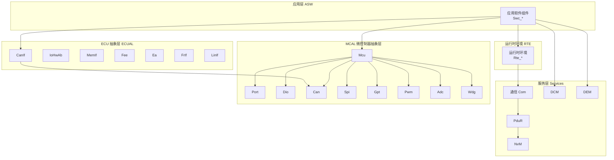
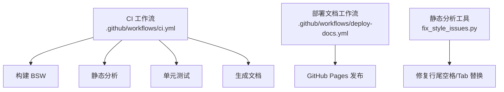
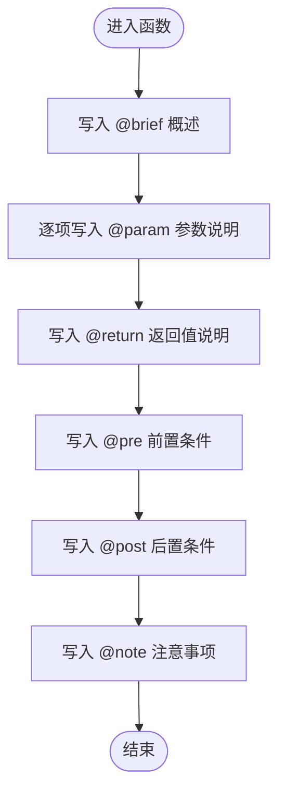
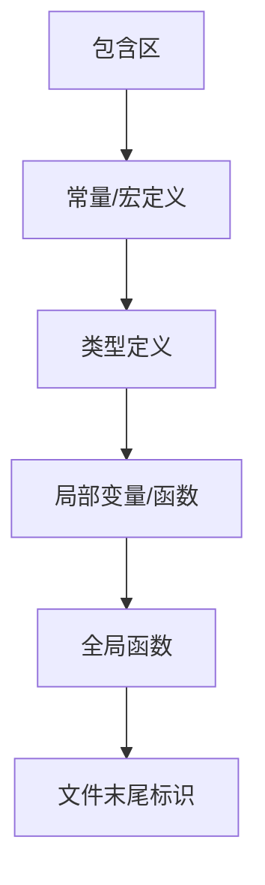
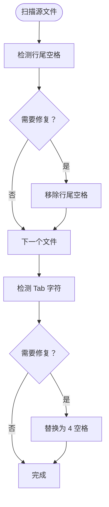
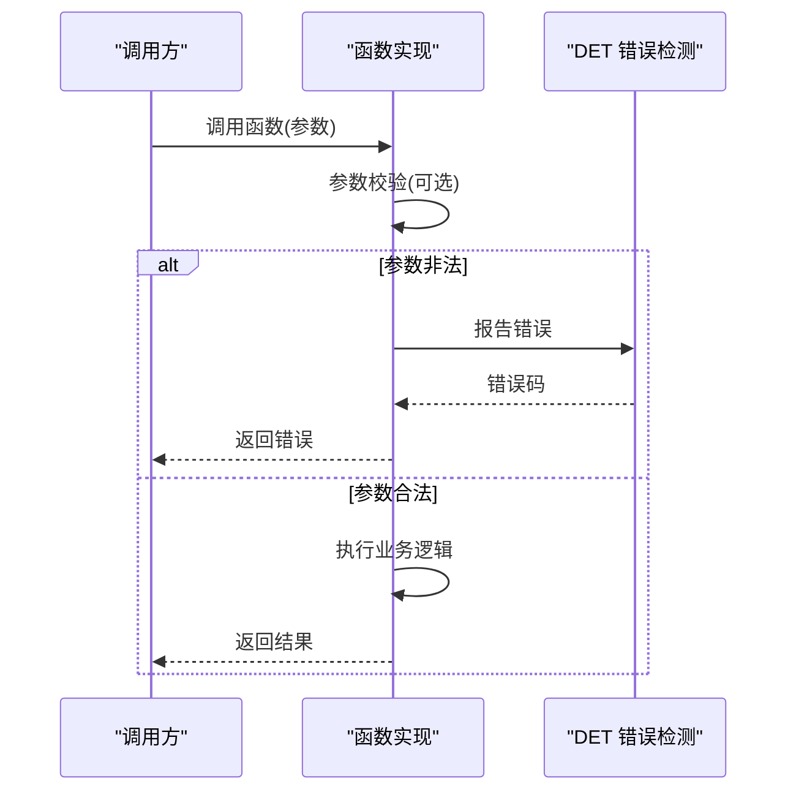
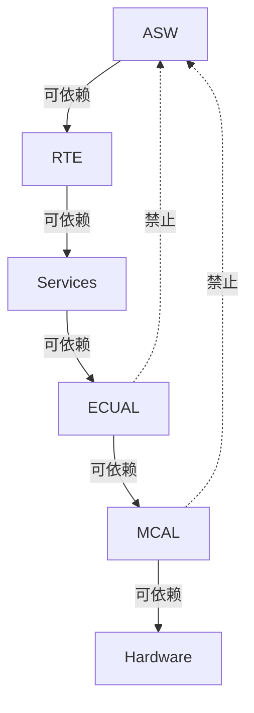

# 代码格式

<cite>
**本文引用的文件**
- [架构规则.md](file://.harness/architecture-rules.md)
- [AutoSAR BSW 开发技能.md](file://.harness/autosar-bsw-development.md)
- [予乐科技开发流程.md](file://.harness/yuletech-dev-process.md)
- [CI 工作流.yml](file://.github/workflows/ci.yml)
- [部署文档.yml](file://.github/workflows/deploy-docs.yml)
- [静态分析工具 fix_style_issues.py](file://tools/analysis/fix_style_issues.py)
- [通用 DET 头文件 Det.h](file://src/bsw/services/det/include/Det.h)
- [通用 DET 实现 Det.c](file://src/bsw/services/det/src/Det.c)
- [MCAL MCU 头文件 Mcu.h](file://src/bsw/mcal/mcu/include/Mcu.h)
- [MCAL MCU 实现 Mcu.c](file://src/bsw/mcal/mcu/src/Mcu.c)
- [ECUAL CanIf 头文件 CanIf.h](file://src/bsw/ecual/CanIf/include/CanIf.h)
- [示例：CAN 通信演示 main.c](file://examples/can_demo/main.c)
- [示例：LED 闪烁演示 main.c](file://examples/led_blink/main.c)
</cite>

## 目录
1. [引言](#引言)
2. [项目结构](#项目结构)
3. [核心组件](#核心组件)
4. [架构总览](#架构总览)
5. [详细组件分析](#详细组件分析)
6. [依赖分析](#依赖分析)
7. [性能考量](#性能考量)
8. [故障排查指南](#故障排查指南)
9. [结论](#结论)
10. [附录](#附录)

## 引言
本文件为 YuleTech AutoSAR BSW 平台制定统一的代码格式规范，面向不同层级（MCAL、ECUAL、Service、RTE、ASW）的开发者与维护者。内容涵盖文件头部格式、函数注释规范、代码结构布局、缩进与空格使用、括号与换行规则，并结合仓库中现有实现与流程规范，给出可操作的格式要求与最佳实践，确保代码可读性、一致性与可维护性。

## 项目结构
YuleTech BSW 采用分层架构与 AutoSAR 经典平台标准，代码组织遵循模块化与接口清晰的原则。典型模块由“头文件 + 配置头文件 + 实现文件”构成，部分模块还包含内存分区指令与版本信息定义。仓库中的示例程序展示了模块间的集成关系与调用顺序。

**章节来源**
- [.harness/architecture-rules.md: 第10-23 行:10-23](file://.harness/architecture-rules.md#L10-L23)
- [.harness/autosar-bsw-development.md: 第14-24 行:14-24](file://.harness/autosar-bsw-development.md#L14-L24)

## 核心组件
- 文件头部格式：统一的版权与版本声明，便于追溯与合规。
- 函数注释规范：使用 AutoSAR 风格的 doxygen 注释，包含 brief、参数、返回值、前置条件、后置条件、注意事项等。
- 代码结构布局：按“包含区 → 常量/宏定义 → 类型定义 → 局部变量/函数 → 全局函数”的顺序组织。
- 缩进与空格：统一使用空格缩进，避免 Tab；行尾不保留多余空格；确保文件以换行符结尾。
- 括号与换行：左花括号与语句同行，右花括号单独一行；控制结构与函数体缩进一致；长参数分行时保持对齐。

上述规范在以下文件中得到体现与实践：
- 文件头部模板与结构布局：见 [AutoSAR BSW 开发技能.md: 第35-87 行:35-87](file://.harness/autosar-bsw-development.md#L35-L87)
- 函数注释模板：见 [AutoSAR BSW 开发技能.md: 第161-185 行:161-185](file://.harness/autosar-bsw-development.md#L161-L185)
- 错误检测与内存分区：见 [AutoSAR BSW 开发技能.md: 第140-159 行:140-159](file://.harness/autosar-bsw-development.md#L140-L159)
- 代码风格修复工具：见 [fix_style_issues.py: 第7-29 行:7-29](file://tools/analysis/fix_style_issues.py#L7-L29)

**章节来源**
- [.harness/autosar-bsw-development.md: 第35-87 行:35-87](file://.harness/autosar-bsw-development.md#L35-L87)
- [.harness/autosar-bsw-development.md: 第140-159 行:140-159](file://.harness/autosar-bsw-development.md#L140-L159)
- [.harness/autosar-bsw-development.md: 第161-185 行:161-185](file://.harness/autosar-bsw-development.md#L161-L185)
- [tools/analysis/fix_style_issues.py: 第7-29 行:7-29](file://tools/analysis/fix_style_issues.py#L7-L29)

## 架构总览
YuleTech BSW 遵循 AutoSAR 分层架构，模块间通过标准接口耦合，禁止跨层直接依赖与循环依赖。开发流程强调“规范驱动 + TDD + 静态分析 + 代码审查”，并通过 CI/CD 自动化保障质量门禁。

**图表来源**
- [.github/workflows/ci.yml: 第31-88 行:31-88](file://.github/workflows/ci.yml#L31-L88)
- [.github/workflows/deploy-docs.yml: 第9-21 行:9-21](file://.github/workflows/deploy-docs.yml#L9-L21)
- [tools/analysis/fix_style_issues.py: 第43-66 行:43-66](file://tools/analysis/fix_style_issues.py#L43-L66)

**章节来源**
- [.github/workflows/ci.yml: 第31-88 行:31-88](file://.github/workflows/ci.yml#L31-L88)
- [.github/workflows/deploy-docs.yml: 第9-21 行:9-21](file://.github/workflows/deploy-docs.yml#L9-L21)
- [tools/analysis/fix_style_issues.py: 第43-66 行:43-66](file://tools/analysis/fix_style_issues.py#L43-L66)

## 详细组件分析

### 文件头部格式规范
- 必备字段：项目名称、平台、外设、依赖、版本、构建版本、构建日期、作者、版权。
- 统一风格：使用分隔线与固定宽度注释块，便于扫描与解析。
- 示例参考：见 [MCAL MCU 实现 Mcu.c: 第1-14 行:1-14](file://src/bsw/mcal/mcu/src/Mcu.c#L1-L14)，[示例：CAN 通信演示 main.c: 第1-13 行:1-13](file://examples/can_demo/main.c#L1-L13)，[示例：LED 闪烁演示 main.c: 第1-13 行:1-13](file://examples/led_blink/main.c#L1-L13)

**章节来源**
- [src/bsw/mcal/mcu/src/Mcu.c: 第1-14 行:1-14](file://src/bsw/mcal/mcu/src/Mcu.c#L1-L14)
- [examples/can_demo/main.c: 第1-13 行:1-13](file://examples/can_demo/main.c#L1-L13)
- [examples/led_blink/main.c: 第1-13 行:1-13](file://examples/led_blink/main.c#L1-L13)

### 函数注释规范
- 结构：@brief、@param、@return、@pre、@post、@note 等。
- 语言：简明扼要，参数与返回值类型明确，前置/后置条件清晰。
- 示例参考：见 [MCAL MCU 头文件 Mcu.h: 第134-229 行:134-229](file://src/bsw/mcal/mcu/include/Mcu.h#L134-L229)，[ECUAL CanIf 头文件 CanIf.h: 第272-397 行:272-397](file://src/bsw/ecual/CanIf/include/CanIf.h#L272-L397)

**图表来源**
- [.harness/autosar-bsw-development.md: 第161-185 行:161-185](file://.harness/autosar-bsw-development.md#L161-L185)

**章节来源**
- [src/bsw/mcal/mcu/include/Mcu.h: 第134-229 行:134-229](file://src/bsw/mcal/mcu/include/Mcu.h#L134-L229)
- [src/bsw/ecual/CanIf/include/CanIf.h: 第272-397 行:272-397](file://src/bsw/ecual/CanIf/include/CanIf.h#L272-L397)

### 代码结构布局规范
- 标准分区：包含区 → 常量/宏定义 → 类型定义 → 局部变量/函数 → 全局函数 → 文件末尾标识。
- 内存分区：模块内使用 MemMap.h 的分区指令包裹代码与数据段。
- 示例参考：见 [MCAL MCU 实现 Mcu.c: 第14-87 行:14-87](file://src/bsw/mcal/mcu/src/Mcu.c#L14-L87)，[通用 DET 实现 Det.c: 第16-87 行:16-87](file://src/bsw/services/det/src/Det.c#L16-L87)

**图表来源**
- [.harness/autosar-bsw-development.md: 第35-87 行:35-87](file://.harness/autosar-bsw-development.md#L35-L87)

**章节来源**
- [src/bsw/mcal/mcu/src/Mcu.c: 第14-87 行:14-87](file://src/bsw/mcal/mcu/src/Mcu.c#L14-L87)
- [src/bsw/services/det/src/Det.c: 第16-87 行:16-87](file://src/bsw/services/det/src/Det.c#L16-L87)

### 缩进与空格使用规范
- 统一使用空格缩进，禁止使用 Tab。
- 行尾不保留多余空格，确保文件以换行符结尾。
- 工具支持：提供自动修复脚本，批量移除行尾空格与 Tab。

**图表来源**
- [tools/analysis/fix_style_issues.py: 第7-29 行:7-29](file://tools/analysis/fix_style_issues.py#L7-L29)

**章节来源**
- [tools/analysis/fix_style_issues.py: 第7-29 行:7-29](file://tools/analysis/fix_style_issues.py#L7-L29)

### 括号与换行规则
- 左花括号与语句同行，右花括号单独一行。
- 控制结构（if/for/while/switch）与函数体缩进一致。
- 长参数或复杂表达式分行时保持对齐，提升可读性。
- 示例参考：见 [MCAL MCU 实现 Mcu.c: 第252-280 行:252-280](file://src/bsw/mcal/mcu/src/Mcu.c#L252-L280)，[通用 DET 实现 Det.c: 第47-57 行:47-57](file://src/bsw/services/det/src/Det.c#L47-L57)

**章节来源**
- [src/bsw/mcal/mcu/src/Mcu.c: 第252-280 行:252-280](file://src/bsw/mcal/mcu/src/Mcu.c#L252-L280)
- [src/bsw/services/det/src/Det.c: 第47-57 行:47-57](file://src/bsw/services/det/src/Det.c#L47-L57)

### 错误检测与内存分区
- 错误检测：根据配置条件编译错误检测逻辑，统一通过 DET 报告错误。
- 内存分区：使用 MemMap.h 的分区指令包裹代码与数据，保证段落正确放置。
- 示例参考：见 [AutoSAR BSW 开发技能.md: 第140-159 行:140-159](file://.harness/autosar-bsw-development.md#L140-L159)，[通用 DET 头文件 Det.h: 第48-73 行:48-73](file://src/bsw/services/det/include/Det.h#L48-L73)

**章节来源**
- [.harness/autosar-bsw-development.md: 第140-159 行:140-159](file://.harness/autosar-bsw-development.md#L140-L159)
- [src/bsw/services/det/include/Det.h: 第48-73 行:48-73](file://src/bsw/services/det/include/Det.h#L48-L73)

### 函数实现模板
- 模板结构：注释区 → 参数校验（可选）→ 业务实现 → 返回值。
- 参数校验：在启用错误检测时，对空指针、非法参数进行校验并报告 DET 错误。
- 示例参考：见 [AutoSAR BSW 开发技能.md: 第161-185 行:161-185](file://.harness/autosar-bsw-development.md#L161-L185)，[MCAL MCU 实现 Mcu.c: 第285-310 行:285-310](file://src/bsw/mcal/mcu/src/Mcu.c#L285-L310)

**图表来源**
- [.harness/autosar-bsw-development.md: 第161-185 行:161-185](file://.harness/autosar-bsw-development.md#L161-L185)

**章节来源**
- [.harness/autosar-bsw-development.md: 第161-185 行:161-185](file://.harness/autosar-bsw-development.md#L161-L185)
- [src/bsw/mcal/mcu/src/Mcu.c: 第285-310 行:285-310](file://src/bsw/mcal/mcu/src/Mcu.c#L285-L310)

### 模块开发清单与验证清单
- 头文件：版本定义、服务 ID、错误码、类型定义、函数原型。
- 配置文件：预编译配置、常量定义、句柄定义。
- 源文件：包含头文件、局部常量/宏/类型/变量、局部函数原型/实现、全局函数实现。
- 验证清单：功能验证、代码质量、接口兼容性。

**章节来源**
- [.harness/autosar-bsw-development.md: 第187-231 行:187-231](file://.harness/autosar-bsw-development.md#L187-L231)

## 依赖分析
- 分层依赖：上层可依赖下层，禁止下层依赖上层，禁止同层跨模块依赖。
- 接口契约：模块间通过标准接口交互，避免直接访问硬件寄存器。
- 循环依赖：严格禁止，确保构建与维护的稳定性。

**图表来源**
- [.harness/architecture-rules.md: 第25-33 行:25-33](file://.harness/architecture-rules.md#L25-L33)

**章节来源**
- [.harness/architecture-rules.md: 第25-33 行:25-33](file://.harness/architecture-rules.md#L25-L33)

## 性能考量
- 圈复杂度：建议控制在 10 以内，降低维护成本与缺陷风险。
- 函数长度：建议不超过 50 行，参数数量不超过 5 个，嵌套深度不超过 4 层。
- 静态分析：通过 CI 中的静态分析工具与 MISRA C:2012 检查，持续发现潜在问题。

**章节来源**
- [.harness/architecture-rules.md: 第49-57 行:49-57](file://.harness/architecture-rules.md#L49-L57)
- [.github/workflows/ci.yml: 第38-59 行:38-59](file://.github/workflows/ci.yml#L38-L59)

## 故障排查指南
- 错误处理：显式检查返回值，未满足前置条件时报告 DET 错误。
- 指针检查：对空指针进行校验，避免未定义行为。
- 数组边界：访问数组前检查索引范围。
- 初始化检查：调用 API 前确认模块状态满足要求。
- 代码风格：使用修复工具批量清理行尾空格与 Tab，确保统一格式。

**章节来源**
- [.harness/architecture-rules.md: 第107-121 行:107-121](file://.harness/architecture-rules.md#L107-L121)
- [.harness/architecture-rules.md: 第140-152 行:140-152](file://.harness/architecture-rules.md#L140-L152)
- [.harness/architecture-rules.md: 第154-167 行:154-167](file://.harness/architecture-rules.md#L154-L167)
- [.harness/architecture-rules.md: 第169-181 行:169-181](file://.harness/architecture-rules.md#L169-L181)
- [tools/analysis/fix_style_issues.py: 第7-29 行:7-29](file://tools/analysis/fix_style_issues.py#L7-L29)

## 结论
本规范以仓库现有实现与流程规范为基础，明确了文件头部、注释、结构布局、缩进与空格、括号与换行等格式要求，并配套错误检测、内存分区与静态分析工具，确保 YuleTech AutoSAR BSW 平台代码在可读性、一致性与可维护性方面达到 AutoSAR 标准与项目质量门禁的要求。建议在后续开发中严格执行并纳入 CI 校验。

## 附录
- 命名规范：文件名 PascalCase、函数名 ModuleName_FunctionName、宏定义 MODULENAME_MACRO_NAME、类型名 ModuleName_TypeName、变量 camelCase。
- 提交与审查：遵循提交规范与代码审查清单，确保变更质量与可追溯性。

**章节来源**
- [.harness/autosar-bsw-development.md: 第26-34 行:26-34](file://.harness/autosar-bsw-development.md#L26-L34)
- [.harness/yuletech-dev-process.md: 第148-172 行:148-172](file://.harness/yuletech-dev-process.md#L148-L172)
- [.harness/architecture-rules.md: 第235-255 行:235-255](file://.harness/architecture-rules.md#L235-L255)