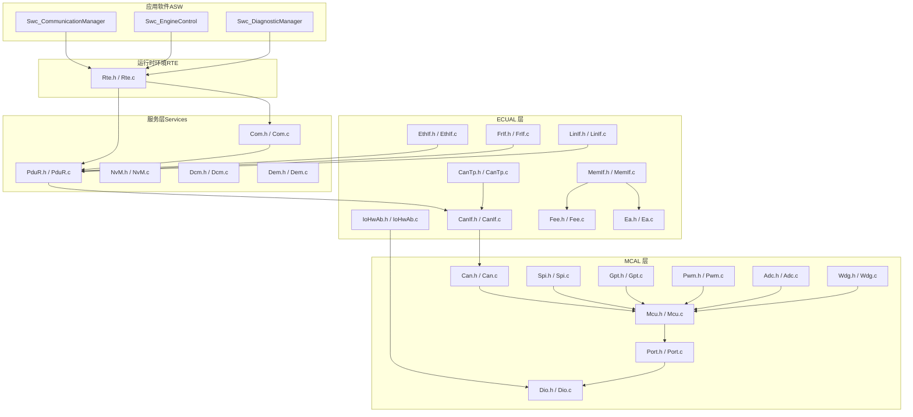
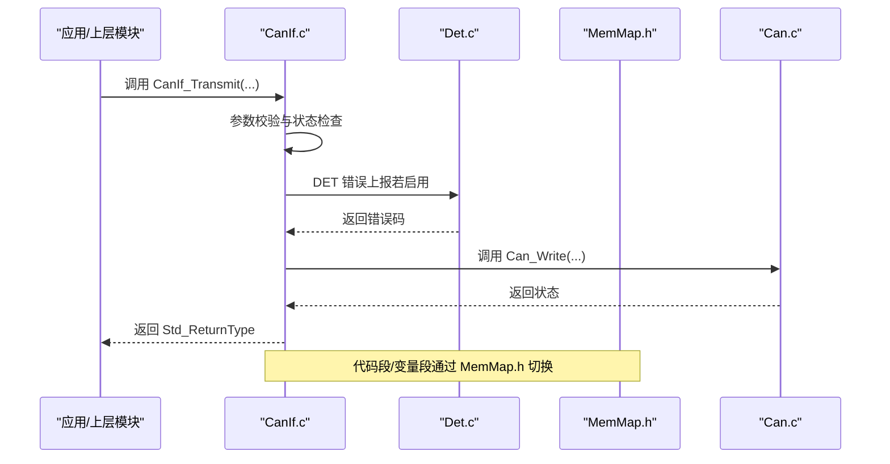
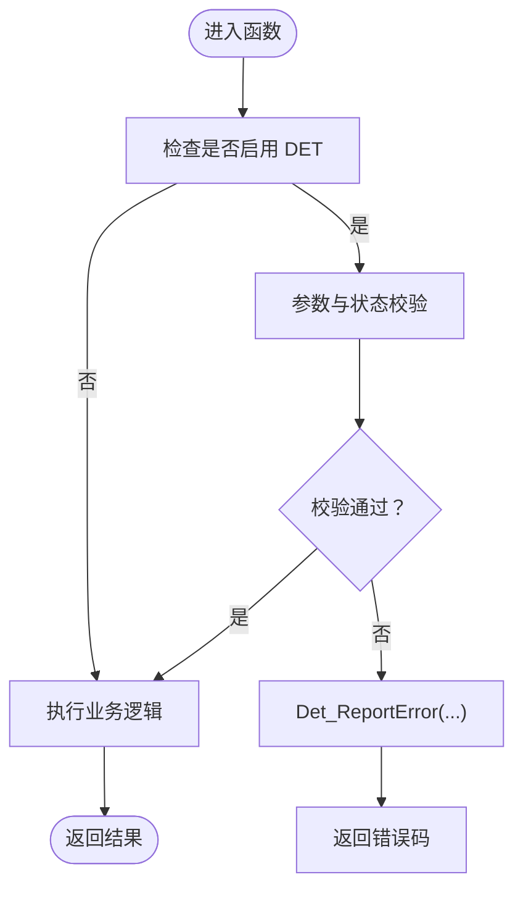
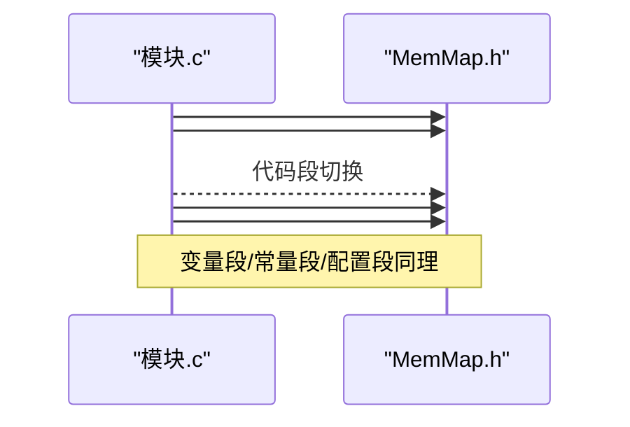
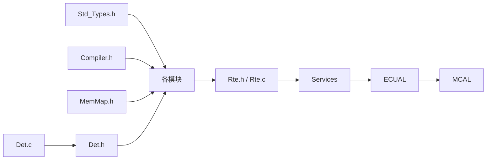

# 代码规范

<cite>
**本文引用的文件**
- [README.md](file://README.md)
- [开发指南.md](file://docs/development-guide.md)
- [API 参考文档.md](file://docs/api-reference.md)
- [Autosar BSW 开发 Skill.md](file://.harness/autosar-bsw-development.md)
- [MemMap.h](file://src/bsw/general/inc/MemMap.h)
- [Compiler.h](file://include/autosar/Compiler.h)
- [Std_Types.h](file://src/bsw/os/include/Std_Types.h)
- [Det.h](file://src/bsw/services/det/include/Det.h)
- [Det.c](file://src/bsw/services/det/src/Det.c)
- [CanIf.c](file://src/bsw/ecual/canif/src/CanIf.c)
- [Com.c](file://src/bsw/services/com/src/Com.c)
- [Os.h](file://src/bsw/os/include/Os.h)
- [CanIf_Cfg.h](file://src/bsw/config/templates/CanIf_Cfg.h)
- [test_mcu.c](file://tests/unit/test_mcu.c)
- [main.c（LED 闪烁示例）](file://examples/led_blink/main.c)
- [main.c（CAN 通信示例）](file://examples/can_demo/main.c)
</cite>

## 目录
1. [简介](#简介)
2. [项目结构](#项目结构)
3. [核心组件](#核心组件)
4. [架构总览](#架构总览)
5. [详细组件分析](#详细组件分析)
6. [依赖关系分析](#依赖关系分析)
7. [性能考虑](#性能考虑)
8. [故障排查指南](#故障排查指南)
9. [结论](#结论)
10. [附录](#附录)

## 简介
本文件为 YuleTech AutoSAR BSW 平台的代码规范文档，面向开发人员与测试人员，系统化阐述命名规范、代码格式、错误处理（DET 错误检测）、内存分区（MemMap.h）等关键要求，并结合实际模块与示例文件给出最佳实践与落地建议。文档同时解释 AutoSAR 标准的实现要点与内存管理策略，帮助团队在一致的规范下高效协作。

## 项目结构
- 项目采用分层架构：RTE → Services → ECUAL → MCAL → Hardware，模块职责清晰、边界明确。
- 代码组织遵循 AutoSAR 分层与模块化原则，各层均提供标准化接口与配置模板，便于移植与集成。
- 示例与测试覆盖典型应用场景，便于理解与验证。

章节来源
- [README.md: 48-84:48-84](file://README.md#L48-L84)

## 核心组件
- 标准类型与编译器抽象：提供统一的数据类型、返回值约定与编译器特性宏，确保跨编译器兼容。
- 错误检测（DET）：统一的错误上报接口与模块级 DET 宏封装，便于集中处理与调试。
- 内存分区（MemMap.h）：通过 START/STOP 宏与编译器 pragma 将代码、常量、配置与变量划分到指定段，满足 AutoSAR 内存映射要求。
- OS 抽象：提供与 AutoSAR OS 一致的 API 与状态类型，便于调度与资源管理。

章节来源
- [Std_Types.h: 23-68:23-68](file://src/bsw/os/include/Std_Types.h#L23-L68)
- [Compiler.h: 28-121:28-121](file://include/autosar/Compiler.h#L28-L121)
- [Det.h: 48-73:48-73](file://src/bsw/services/det/include/Det.h#L48-L73)
- [MemMap.h: 37-793:37-793](file://src/bsw/general/inc/MemMap.h#L37-L793)
- [Os.h: 67-137:67-137](file://src/bsw/os/include/Os.h#L67-L137)

## 架构总览
下图展示典型模块（如 CanIf）如何通过 DET 与 MemMap 实现错误检测与内存分区，以及与上层（如 Com、PduR）和下层（如 Can）的接口关系。

图表来源
- [CanIf.c: 29-185:29-185](file://src/bsw/ecual/canif/src/CanIf.c#L29-L185)
- [Det.c: 47-80:47-80](file://src/bsw/services/det/src/Det.c#L47-L80)
- [MemMap.h: 37-793:37-793](file://src/bsw/general/inc/MemMap.h#L37-L793)

章节来源
- [CanIf.c: 29-185:29-185](file://src/bsw/ecual/canif/src/CanIf.c#L29-L185)
- [Det.c: 47-80:47-80](file://src/bsw/services/det/src/Det.c#L47-L80)

## 详细组件分析

### 命名规范
- 文件名：采用 PascalCase，如 CanIf.c、CanIf.h；配置文件以 _Cfg 结尾，如 CanIf_Cfg.h。
- 函数名：模块名_函数名，如 CanIf_Init、CanIf_Transmit。
- 宏定义：模块名_描述，如 CANIF_E_UNINIT、CANIF_NUMBER_OF_ROUTING_PATHS。
- 类型名：模块名_类型名_Type，如 PduR_SrcPduConfigType、NvM_BlockManagementType。
- 变量名：camelCase，如 canIfStatus、txPduId。

章节来源
- [开发指南.md: 88-138:88-138](file://docs/development-guide.md#L88-L138)
- [Autosar BSW 开发 Skill.md: 26-34:26-34](file://.harness/autosar-bsw-development.md#L26-L34)

### 代码格式与结构
- 文件头：包含项目、平台、外设、依赖、版本、构建信息与版权信息。
- 代码结构：按 INCLUDES、LOCAL CONSTANT、LOCAL MACRO、LOCAL TYPE、LOCAL VARIABLE、LOCAL FUNCTION PROTOTYPES、LOCAL FUNCTIONS、GLOBAL FUNCTIONS、END OF FILE 的顺序组织。
- 代码注释：使用 Javadoc 风格的多行注释，包含简要描述、参数、返回值、前置条件与后置条件。

章节来源
- [开发指南.md: 142-278:142-278](file://docs/development-guide.md#L142-L278)

### 错误处理规范（DET）
- DET 宏封装：每个模块定义 DET 报告宏，根据配置决定是否启用。
- 典型流程：在函数入口进行参数与状态校验，触发 DET 错误上报后返回错误码。
- DET 模块：提供 Det_ReportError、Det_Start、Det_GetVersionInfo 等接口。

图表来源
- [开发指南.md: 284-310:284-310](file://docs/development-guide.md#L284-L310)
- [Autosar BSW 开发 Skill.md: 140-148:140-148](file://.harness/autosar-bsw-development.md#L140-L148)
- [Det.h: 48-73:48-73](file://src/bsw/services/det/include/Det.h#L48-L73)
- [Det.c: 47-80:47-80](file://src/bsw/services/det/src/Det.c#L47-L80)

章节来源
- [开发指南.md: 284-310:284-310](file://docs/development-guide.md#L284-L310)
- [Autosar BSW 开发 Skill.md: 140-148:140-148](file://.harness/autosar-bsw-development.md#L140-L148)
- [Det.h: 48-73:48-73](file://src/bsw/services/det/include/Det.h#L48-L73)
- [Det.c: 47-80:47-80](file://src/bsw/services/det/src/Det.c#L47-L80)

### 内存分区使用（MemMap.h）
- 分区宏：模块使用 START/STOP 宏包裹代码段、常量段、配置段与变量段，确保变量与代码被放置到正确的内存段。
- 编译器适配：针对 GCC、ARMCC、IAR、Tasking、Green Hills 等编译器提供不同的段定义与属性宏。
- 典型用法：在模块源文件中以 START/STOP 宏切换段，再包含 MemMap.h。

图表来源
- [开发指南.md: 314-333:314-333](file://docs/development-guide.md#L314-L333)
- [Autosar BSW 开发 Skill.md: 150-159:150-159](file://.harness/autosar-bsw-development.md#L150-L159)
- [MemMap.h: 37-793:37-793](file://src/bsw/general/inc/MemMap.h#L37-L793)

章节来源
- [开发指南.md: 314-333:314-333](file://docs/development-guide.md#L314-L333)
- [Autosar BSW 开发 Skill.md: 150-159:150-159](file://.harness/autosar-bsw-development.md#L150-L159)
- [MemMap.h: 37-793:37-793](file://src/bsw/general/inc/MemMap.h#L37-L793)

### 标准类型与返回值约定
- 标准返回类型：E_OK、E_NOT_OK、E_BUSY 等。
- 标准数据类型：uint8/uint16/uint32/uint64、sint8/sint16/sint32/sint64、float32/float64、boolean。
- 版本信息结构：Std_VersionInfoType，包含 vendorID、moduleID、sw_major/minor/patch。

章节来源
- [Std_Types.h: 23-80:23-80](file://src/bsw/os/include/Std_Types.h#L23-L80)

### 编译器抽象（Compiler.h）
- 提供跨编译器的内联、中断、弱符号、对齐、打包、段定义等宏。
- 提供 ASSERT、ARRAY_SIZE、OFFSET_OF、SIZE_OF、MIN/MAX/ABS/CLAMP 等工具宏。

章节来源
- [Compiler.h: 28-187:28-187](file://include/autosar/Compiler.h#L28-L187)

### 模块实现示例（CanIf 与 Com）
- CanIf：展示 DET 宏使用、状态机维护、与下层 Can 的交互、错误码定义与返回值处理。
- Com：展示信号打包/解包、IPDU 状态管理、缓冲区组织、内部状态与 DET 宏封装。

章节来源
- [CanIf.c: 29-185:29-185](file://src/bsw/ecual/canif/src/CanIf.c#L29-L185)
- [Com.c: 45-124:45-124](file://src/bsw/services/com/src/Com.c#L45-L124)

### OS 抽象（Os.h）
- 提供与 AutoSAR OS 一致的状态类型、任务类型、事件类型、报警类型等。
- 定义 StartOS、ShutdownOS、ActivateTask、TerminateTask、SetEvent、WaitEvent 等服务接口。

章节来源
- [Os.h: 67-200:67-200](file://src/bsw/os/include/Os.h#L67-L200)

### 配置模板（CanIf_Cfg.h）
- 预编译配置项：如 CANIF_DEV_ERROR_DETECT、CANIF_VERSION_INFO_API、CANIF_DLC_CHECK 等。
- 运行时常量：控制器数量、HRH/HTH 数量、PDU 数量、模式枚举、ID 类型等。
- PDU ID 定义：TX/RX PDU ID 常量，便于上层引用。

章节来源
- [CanIf_Cfg.h: 20-107:20-107](file://src/bsw/config/templates/CanIf_Cfg.h#L20-L107)

### 测试与示例
- 单元测试：围绕 Mcu 模块的初始化、去初始化、版本查询、错误路径等进行验证。
- 示例程序：LED 闪烁（Dio/Gpt）与 CAN 通信（Mcu/Port/Can/CanIf/Com/PduR）演示典型集成流程。

章节来源
- [test_mcu.c: 19-207:19-207](file://tests/unit/test_mcu.c#L19-L207)
- [main.c（LED 闪烁示例）: 61-99:61-99](file://examples/led_blink/main.c#L61-L99)
- [main.c（CAN 通信示例）: 63-118:63-118](file://examples/can_demo/main.c#L63-L118)

## 依赖关系分析
- 模块间依赖：RTE 依赖 Services 与 ECUAL；Services 依赖 ECUAL；ECUAL 依赖 MCAL；MCAL 依赖硬件抽象。
- 通用依赖：所有模块依赖 Std_Types.h、Compiler.h、MemMap.h；错误检测依赖 Det.h/Det.c。
- 配置依赖：模块通过 *_Cfg.h 提供配置，配置项影响编译期与运行期行为。

图表来源
- [Std_Types.h: 17-18:17-18](file://src/bsw/os/include/Std_Types.h#L17-L18)
- [Compiler.h: 19](file://include/autosar/Compiler.h#L19)
- [MemMap.h: 19](file://src/bsw/general/inc/MemMap.h#L19)
- [Det.h: 17](file://src/bsw/services/det/include/Det.h#L17)
- [Det.c: 19](file://src/bsw/services/det/src/Det.c#L19)

章节来源
- [Std_Types.h: 17-18:17-18](file://src/bsw/os/include/Std_Types.h#L17-L18)
- [Compiler.h: 19](file://include/autosar/Compiler.h#L19)
- [MemMap.h: 19](file://src/bsw/general/inc/MemMap.h#L19)
- [Det.h: 17](file://src/bsw/services/det/include/Det.h#L17)
- [Det.c: 19](file://src/bsw/services/det/src/Det.c#L19)

## 性能考虑
- 圈复杂度控制：建议函数复杂度小于 10，避免深层嵌套与多重分支。
- 返回值检查：所有可能返回错误的 API 调用需检查返回值，防止静默失败。
- 内存分区：合理使用 START/STOP 宏，避免不必要的段切换；减少全局变量数量，优先使用局部变量。
- 中断与调度：在中断上下文尽量短小，避免长时间阻塞；利用 OS 的事件机制协调任务。

## 故障排查指南
- 启用 DET：在模块配置中开启 DEV_ERROR_DETECT，以便在错误发生时上报。
- 关键断点：在 DET 错误上报处设置断点，定位错误来源。
- 日志与断言：在调试阶段使用 DEBUG 打印与 ASSERT，快速定位问题。
- 单元测试：通过测试用例覆盖正常路径与异常路径，确保边界条件正确处理。

章节来源
- [开发指南.md: 433-467:433-467](file://docs/development-guide.md#L433-L467)
- [test_mcu.c: 19-207:19-207](file://tests/unit/test_mcu.c#L19-L207)

## 结论
本规范文档系统化地定义了 YuleTech AutoSAR BSW 平台的命名、格式、错误处理与内存分区等关键要求，并结合具体模块与示例文件提供了可操作的最佳实践。遵循该规范有助于提升代码一致性、可维护性与可移植性，确保模块在 AutoSAR 标准框架下稳定运行。

## 附录
- AutoSAR 标准接口参考：涵盖通用 API、MCAL、ECUAL、Service、RTE 层的接口与数据类型。
- 开发流程与验证清单：基于 OpenSpec + Superpowers + Harness Engineering 的方法论，确保规范先行与质量可控。

章节来源
- [API 参考文档.md: 17-594:17-594](file://docs/api-reference.md#L17-L594)
- [.harness/autosar-bsw-development.md: 89-241:89-241](file://.harness/autosar-bsw-development.md#L89-L241)