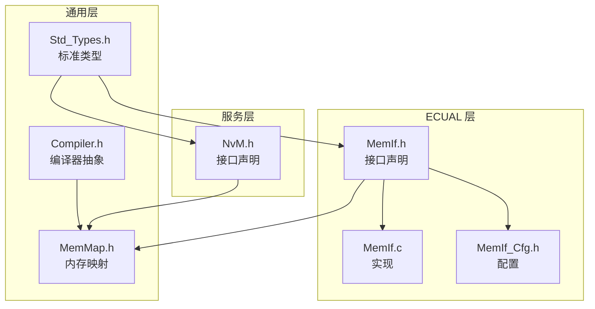
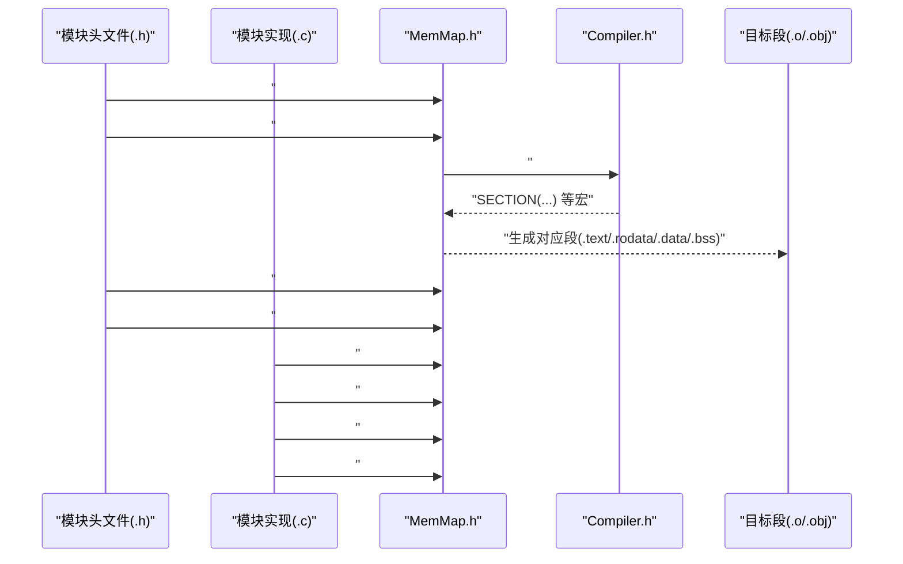
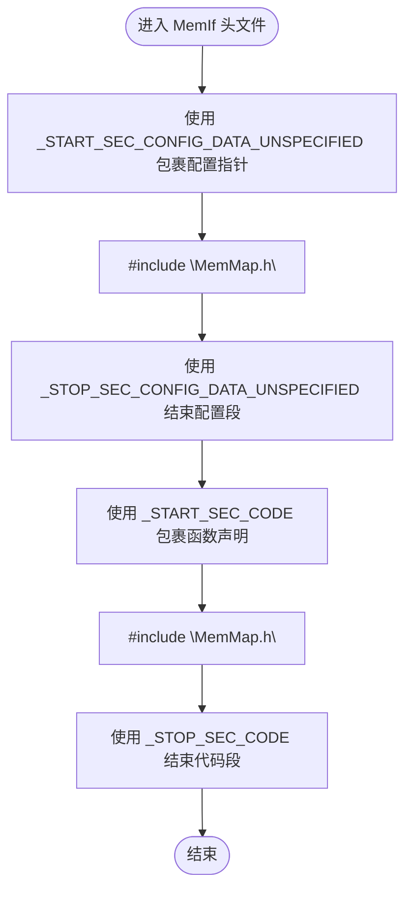
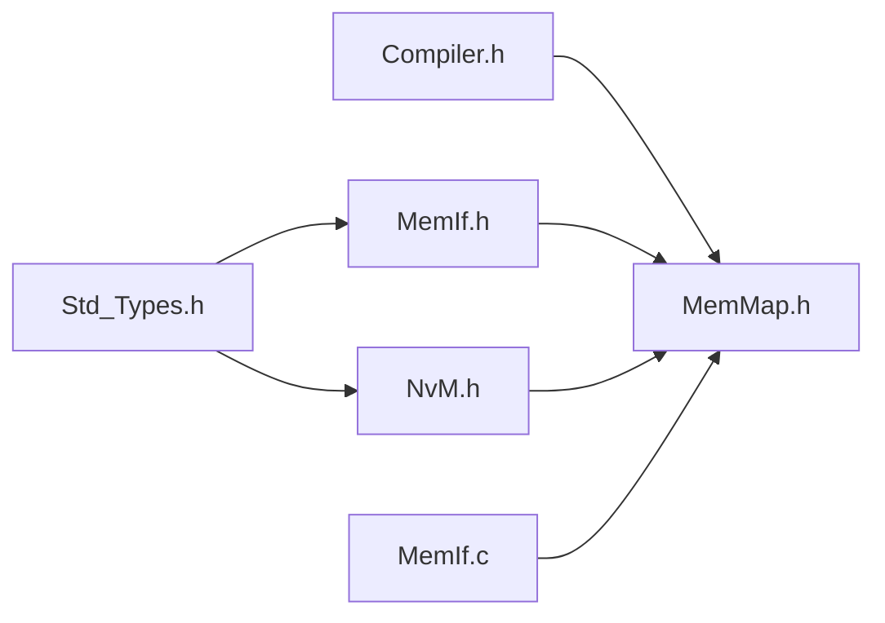

# 内存管理

<cite>
**本文引用的文件**
- [MemMap.h](file://src/bsw/general/inc/MemMap.h)
- [Compiler.h](file://include/autosar/Compiler.h)
- [MemIf.h](file://src/bsw/ecual/memif/include/MemIf.h)
- [MemIf.c](file://src/bsw/ecual/memif/src/MemIf.c)
- [MemIf_Cfg.h](file://src/bsw/ecual/memif/include/MemIf_Cfg.h)
- [NvM.h](file://src/bsw/services/nvm/include/NvM.h)
- [Std_Types.h](file://src/bsw/os/include/Std_Types.h)
- [README.md](file://README.md)
</cite>

## 目录
1. [简介](#简介)
2. [项目结构](#项目结构)
3. [核心组件](#核心组件)
4. [架构总览](#架构总览)
5. [详细组件分析](#详细组件分析)
6. [依赖关系分析](#依赖关系分析)
7. [性能考量](#性能考量)
8. [故障排查指南](#故障排查指南)
9. [结论](#结论)
10. [附录](#附录)

## 简介
本文件面向 YuleTech AutoSAR BSW 平台，系统化阐述内存管理规范与 MemMap.h 的使用方法。内容覆盖：
- 内存分区宏定义与命名约定
- 代码段与数据段的划分策略
- 内存类型分类（代码、常量、配置、可变等）及 AutoSAR 标准要求
- 不同内存类型的使用场景与最佳实践
- 典型模块（如 MemIf、NvM）中的分区使用示例

本规范严格遵循 AutoSAR Classic Platform 4.x 内存映射与编译器抽象标准，并结合本项目的编译器适配层（Compiler.h）进行落地。

## 项目结构
与内存管理直接相关的核心位置如下：
- 通用内存映射与编译器抽象：src/bsw/general/inc/MemMap.h、include/autosar/Compiler.h
- 存储接口与配置：src/bsw/ecual/memif/include/MemIf.h、src/bsw/ecual/memif/src/MemIf.c、src/bsw/ecual/memif/include/MemIf_Cfg.h
- 服务层 NVRAM 管理：src/bsw/services/nvm/include/NvM.h
- 标准类型定义：src/bsw/os/include/Std_Types.h
- 项目总体介绍与开发规范：README.md

**图示来源**
- [MemMap.h:13-31](file://src/bsw/general/inc/MemMap.h#L13-L31)
- [Compiler.h:13-20](file://include/autosar/Compiler.h#L13-L20)
- [MemIf.h:14-22](file://src/bsw/ecual/memif/include/MemIf.h#L14-L22)
- [MemIf.c:9-12](file://src/bsw/ecual/memif/src/MemIf.c#L9-L12)
- [MemIf_Cfg.h:9-17](file://src/bsw/ecual/memif/include/MemIf_Cfg.h#L9-L17)
- [NvM.h:13-21](file://src/bsw/services/nvm/include/NvM.h#L13-L21)

**章节来源**
- [README.md:84-84](file://README.md#L84-L84)

## 核心组件
- MemMap.h：提供跨编译器的内存分区宏，统一代码段、常量、配置、可变等区域的起止指令。
- Compiler.h：提供编译器抽象宏（如 inline、SECTION、ISR 等），并与 MemMap.h 协作完成段级控制。
- MemIf：存储接口模块，展示如何在接口声明、实现与配置中正确使用 MemMap.h 的分区宏。
- NvM：服务层模块，同样通过 MemMap.h 对配置数据与代码进行分区。
- Std_Types.h：提供标准类型与版本信息结构，支撑模块的版本与错误码管理。

**章节来源**
- [MemMap.h:13-31](file://src/bsw/general/inc/MemMap.h#L13-L31)
- [Compiler.h:13-20](file://include/autosar/Compiler.h#L13-L20)
- [MemIf.h:14-22](file://src/bsw/ecual/memif/include/MemIf.h#L14-L22)
- [NvM.h:13-21](file://src/bsw/services/nvm/include/NvM.h#L13-L21)
- [Std_Types.h:11-19](file://src/bsw/os/include/Std_Types.h#L11-L19)

## 架构总览
下图展示了内存分区在模块中的典型使用路径：模块头文件在声明阶段引入分区宏，实现文件在实现阶段引入分区宏，最终由 MemMap.h 将这些宏转换为具体编译器段指令。

**图示来源**
- [MemMap.h:19-19](file://src/bsw/general/inc/MemMap.h#L19-L19)
- [Compiler.h:59-61](file://include/autosar/Compiler.h#L59-L61)
- [MemIf.h:131-137](file://src/bsw/ecual/memif/include/MemIf.h#L131-L137)
- [MemIf.c:31-39](file://src/bsw/ecual/memif/src/MemIf.c#L31-L39)

## 详细组件分析

### MemMap.h：内存分区宏与编译器适配
- 功能定位
  - 提供统一的分区宏集合，覆盖代码段、常量、配置数据、可变数据等。
  - 通过条件编译适配 GCC、IAR、ARMCC 等主流编译器，将分区宏映射为编译器段指令。
- 关键要点
  - 分区宏命名遵循“模块名_START/STOP_SEC_类别_属性”的 AutoSAR 标准格式。
  - 与 Compiler.h 协作，利用 SECTION(name) 等宏实现段级控制。
  - 版本信息字段满足 AutoSAR 版本管理要求。
- 使用建议
  - 在模块头文件中仅使用“_START_SEC_*”与“_STOP_SEC_*”成对包裹声明。
  - 在模块实现文件中仅使用“_START_SEC_*”与“_STOP_SEC_*”成对包裹实现与静态变量。
  - 避免在同一个编译单元中混用多个不同模块的分区宏。

**章节来源**
- [MemMap.h:13-31](file://src/bsw/general/inc/MemMap.h#L13-L31)
- [MemMap.h:37-793](file://src/bsw/general/inc/MemMap.h#L37-L793)
- [Compiler.h:59-61](file://include/autosar/Compiler.h#L59-L61)

### Compiler.h：编译器抽象与段控制
- 功能定位
  - 提供编译器无关的函数、变量、中断、对齐等宏。
  - 通过 SECTION(name) 将 MemMap.h 的分区宏映射到具体段名称。
- 关键要点
  - 不同编译器下宏定义差异（如中断、弱符号、打包等）。
  - 与 MemMap.h 的“段名”约定配合，确保链接时的段一致性。

**章节来源**
- [Compiler.h:28-121](file://include/autosar/Compiler.h#L28-L121)
- [Compiler.h:59-61](file://include/autosar/Compiler.h#L59-L61)

### MemIf：分区使用的典型示例
- 配置数据分区
  - 在头文件中使用“_START_SEC_CONFIG_DATA_UNSPECIFIED”与“_STOP_SEC_CONFIG_DATA_UNSPECIFIED”包裹全局配置指针，确保配置数据位于只读段。
- 静态变量分区
  - 在实现文件中使用“_START_SEC_VAR_CLEARED_UNSPECIFIED”与“_STOP_SEC_VAR_CLEARED_UNSPECIFIED”包裹静态变量，确保其位于已清零的可变段。
- 代码分区
  - 在头文件中使用“_START_SEC_CODE”与“_STOP_SEC_CODE”包裹函数原型声明；在实现文件中包裹函数实现。
- 配置项参考
  - MEMIF_DEV_ERROR_DETECT、MEMIF_VERSION_INFO_API、设备数量与默认模式等。

**图示来源**
- [MemIf.h:131-137](file://src/bsw/ecual/memif/include/MemIf.h#L131-L137)
- [MemIf.h:142-143](file://src/bsw/ecual/memif/include/MemIf.h#L142-L143)

**章节来源**
- [MemIf.h:131-137](file://src/bsw/ecual/memif/include/MemIf.h#L131-L137)
- [MemIf.c:31-39](file://src/bsw/ecual/memif/src/MemIf.c#L31-L39)
- [MemIf_Cfg.h:15-58](file://src/bsw/ecual/memif/include/MemIf_Cfg.h#L15-L58)

### NvM：服务层分区示例
- 配置数据与代码分区
  - 通过“_START_SEC_CONFIG_DATA_UNSPECIFIED”与“_STOP_SEC_CONFIG_DATA_UNSPECIFIED”包裹配置结构体。
  - 通过“_START_SEC_CODE”与“_STOP_SEC_CODE”包裹函数声明与实现。
- 版本信息与错误码
  - 模块版本信息字段满足 AutoSAR 版本管理要求。
  - DET 错误码与请求结果类型定义便于错误追踪与状态查询。

**章节来源**
- [NvM.h:177-183](file://src/bsw/services/nvm/include/NvM.h#L177-L183)
- [NvM.h:188-189](file://src/bsw/services/nvm/include/NvM.h#L188-L189)
- [NvM.h:25-32](file://src/bsw/services/nvm/include/NvM.h#L25-L32)

### AutoSAR 标准与内存类型分类
- 代码段（.text）
  - 存放可执行指令，通常为只读。
  - 使用“_START_SEC_CODE”与“_STOP_SEC_CODE”包裹函数实现与声明。
- 常量段（.rodata/.const）
  - 存放只读常量数据，如字符串、枚举、配置常量。
  - 使用“_START_SEC_CONST_*”系列宏包裹。
- 配置数据段（.rodata）
  - 存放模块配置结构体（只读），如 MemIf_Config、NvM_Config。
  - 使用“_START_SEC_CONFIG_DATA_*”系列宏包裹。
- 可变段（.data/.bss）
  - .data：已初始化的全局/静态变量。
  - .bss：未初始化或初始化为 0 的全局/静态变量。
  - 使用“_START_SEC_VAR_*”系列宏包裹。

**章节来源**
- [MemMap.h:39-210](file://src/bsw/general/inc/MemMap.h#L39-L210)
- [MemMap.h:229-411](file://src/bsw/general/inc/MemMap.h#L229-L411)
- [MemMap.h:420-602](file://src/bsw/general/inc/MemMap.h#L420-L602)

## 依赖关系分析
- 模块依赖
  - MemIf 与 NvM 均依赖 Std_Types.h 提供的标准类型与版本信息结构。
  - MemMap.h 依赖 Compiler.h 提供的段控制宏。
- 编译器适配
  - MemMap.h 通过条件编译适配 GCC/IAR/ARMCC 等编译器，确保分区宏映射到正确的段指令。
- 风险点
  - 若在头文件与实现文件中混用不同模块的分区宏，可能导致链接段冲突。
  - 若忘记成对使用“_START_SEC_*”与“_STOP_SEC_*”，会导致后续段边界混乱。

**图示来源**
- [Std_Types.h:11-19](file://src/bsw/os/include/Std_Types.h#L11-L19)
- [MemIf.h:14-21](file://src/bsw/ecual/memif/include/MemIf.h#L14-L21)
- [NvM.h:13-20](file://src/bsw/services/nvm/include/NvM.h#L13-L20)
- [Compiler.h:13-20](file://include/autosar/Compiler.h#L13-L20)
- [MemMap.h:13-19](file://src/bsw/general/inc/MemMap.h#L13-L19)

**章节来源**
- [Std_Types.h:11-19](file://src/bsw/os/include/Std_Types.h#L11-L19)
- [MemMap.h:13-19](file://src/bsw/general/inc/MemMap.h#L13-L19)
- [Compiler.h:13-20](file://include/autosar/Compiler.h#L13-L20)

## 性能考量
- 段划分对启动时间的影响
  - 将配置数据置于只读段，减少启动时初始化开销。
  - 将静态变量按需放置于 .bss，避免不必要的初始化。
- 编译器优化与段对齐
  - 利用 Compiler.h 的对齐宏（如 ALIGN(n)）提升访问效率。
  - 合理设置段大小，避免碎片化导致的缓存命中率下降。
- 多编译器一致性
  - 通过 MemMap.h 的编译器适配，确保不同工具链下的段布局一致，避免链接时的段重定位问题。

## 故障排查指南
- 常见问题与定位
  - “未初始化”错误：在调用接口前未正确初始化模块（如 MemIf_Init）。检查初始化流程与 DET 报错码。
  - “参数非法”错误：传入空指针、越界索引或长度异常。检查调用参数与边界校验。
  - “段未对齐/段缺失”链接错误：头文件与实现文件混用不同模块的分区宏，或遗漏“_STOP_SEC_*”。逐一核对分区宏成对使用。
- 建议排查步骤
  - 确认模块头文件仅使用“_START_SEC_*”与“_STOP_SEC_*”包裹声明。
  - 确认模块实现文件仅使用“_START_SEC_*”与“_STOP_SEC_*”包裹实现与静态变量。
  - 确认 MemMap.h 与 Compiler.h 正确包含且顺序正确。
  - 使用最小化复现样例，逐步排除外部依赖。

**章节来源**
- [MemIf.c:44-63](file://src/bsw/ecual/memif/src/MemIf.c#L44-L63)
- [MemIf.c:71-92](file://src/bsw/ecual/memif/src/MemIf.c#L71-L92)
- [MemMap.h:37-793](file://src/bsw/general/inc/MemMap.h#L37-L793)

## 结论
- MemMap.h 与 Compiler.h 构成了 YuleTech AutoSAR BSW 平台的内存分区基石，确保跨编译器的一致性与可移植性。
- 通过严格的分区宏使用规范（头文件声明、实现文件实现、配置数据只读），可有效提升系统稳定性与可维护性。
- 建议在所有模块中遵循“声明用 START/STOP 宏成对包裹、实现与静态变量单独成段”的原则，并在变更评审中重点检查分区宏使用是否正确。

## 附录

### 分区宏命名与类别速查
- 代码段：_START_SEC_CODE / _STOP_SEC_CODE
- 常量段：_START_SEC_CONST_* / _STOP_SEC_CONST_*
- 配置数据段：_START_SEC_CONFIG_DATA_* / _STOP_SEC_CONFIG_DATA_*
- 可变段：_START_SEC_VAR_* / _STOP_SEC_VAR_*

**章节来源**
- [MemMap.h:39-210](file://src/bsw/general/inc/MemMap.h#L39-L210)
- [MemMap.h:229-411](file://src/bsw/general/inc/MemMap.h#L229-L411)
- [MemMap.h:420-602](file://src/bsw/general/inc/MemMap.h#L420-L602)