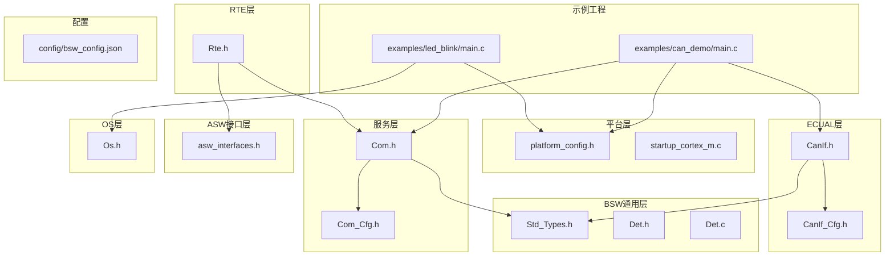
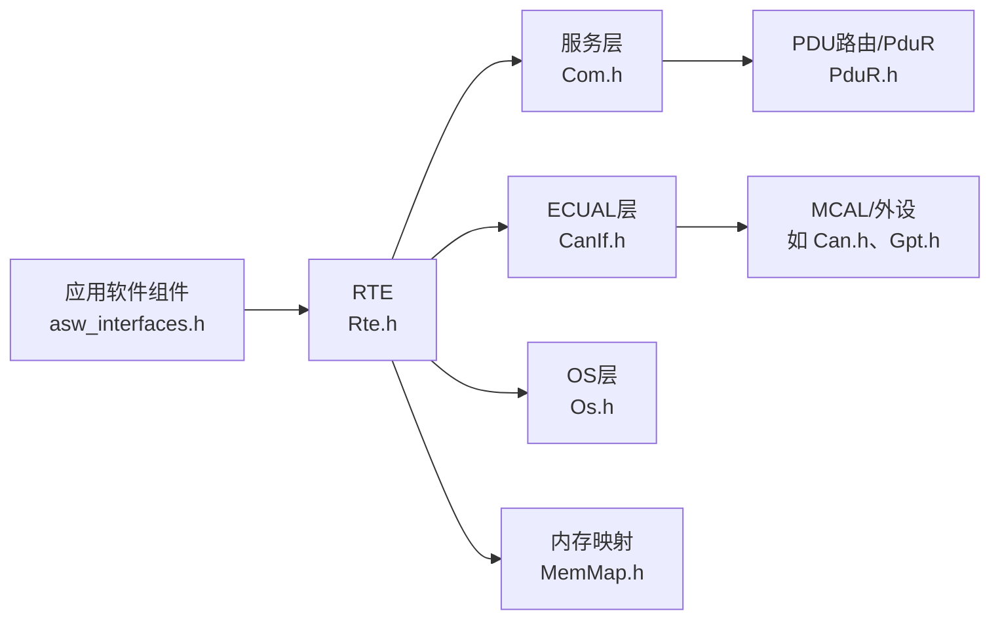
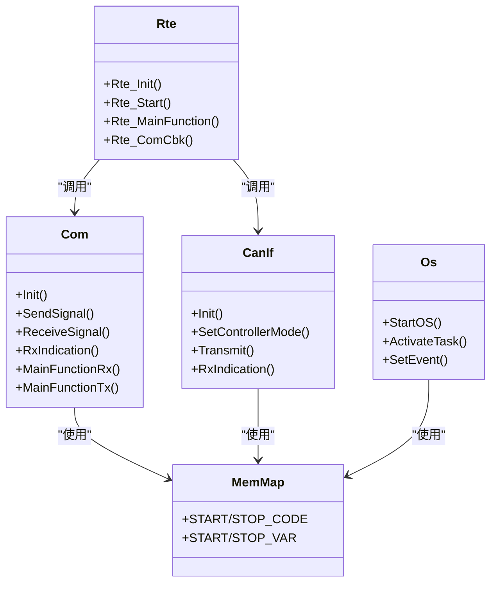

# 命名规范

<cite>
**本文引用的文件**
- [bsw_config.json](file://config/bsw_config.json)
- [main.c（CAN演示）](file://examples/can_demo/main.c)
- [main.c（LED闪烁）](file://examples/led_blink/main.c)
- [platform_config.h](file://platform/cortex-m/platform_config.h)
- [startup_cortex_m.c](file://platform/cortex-m/startup_cortex_m.c)
- [Std_Types.h](file://src/bsw/common/Std_Types.h)
- [Det.h](file://src/bsw/common/Det.h)
- [Det.c](file://src/bsw/common/Det.c)
- [CanIf.h](file://src/bsw/ecual/canif/include/CanIf.h)
- [CanIf_Cfg.h](file://src/bsw/ecual/canif/include/CanIf_Cfg.h)
- [Com.h](file://src/bsw/services/com/include/Com.h)
- [Com_Cfg.h](file://src/bsw/services/com/include/Com_Cfg.h)
- [asw_interfaces.h](file://src/asw/asw_interfaces.h)
- [MemMap.h](file://src/bsw/general/inc/MemMap.h)
- [Os.h](file://src/bsw/os/include/Os.h)
- [Rte.h](file://src/bsw/rte/include/Rte.h)
</cite>

## 目录
1. [引言](#引言)
2. [项目结构与命名范围](#项目结构与命名范围)
3. [核心组件与命名约定总览](#核心组件与命名约定总览)
4. [架构概览与命名一致性原则](#架构概览与命名一致性原则)
5. [详细组件命名规范](#详细组件命名规范)
6. [依赖关系与命名约束分析](#依赖关系与命名约束分析)
7. [性能与可维护性建议](#性能与可维护性建议)
8. [故障排查与命名问题定位](#故障排查与命名问题定位)
9. [结论](#结论)
10. [附录：命名示例与AutoSAR实现对照](#附录命名示例与autosar实现对照)

## 引言
本文件面向YuleTech AutoSAR BSW平台，系统化制定命名规范，覆盖文件命名、函数命名、宏定义、类型与变量命名，并结合AutoSAR标准与项目现有实现，明确模块化设计中的命名一致性原则与最佳实践，确保跨模块协作、静态分析与工具链集成的一致性与可维护性。

## 项目结构与命名范围
- 文件命名范围涵盖：
  - 平台层：platform/cortex-m（启动、平台配置）
  - BSW通用层：common（标准类型、DET）
  - ECUAL层：如CanIf
  - 服务层：如Com
  - ASW接口层：asw_interfaces.h
  - OS层：Os.h
  - RTE层：Rte.h
  - 示例工程：examples（LED闪烁、CAN演示）
  - 配置：config（bsw_config.json）

图表来源
- [platform_config.h:1-307](file://platform/cortex-m/platform_config.h#L1-L307)
- [startup_cortex_m.c:1-267](file://platform/cortex-m/startup_cortex_m.c#L1-L267)
- [Std_Types.h:1-117](file://src/bsw/common/Std_Types.h#L1-L117)
- [Det.h:1-76](file://src/bsw/common/Det.h#L1-L76)
- [Det.c:1-88](file://src/bsw/common/Det.c#L1-L88)
- [CanIf.h:1-403](file://src/bsw/ecual/canif/include/CanIf.h#L1-L403)
- [CanIf_Cfg.h:1-84](file://src/bsw/ecual/canif/include/CanIf_Cfg.h#L1-L84)
- [Com.h:1-508](file://src/bsw/services/com/include/Com.h#L1-L508)
- [Com_Cfg.h:1-124](file://src/bsw/services/com/include/Com_Cfg.h#L1-L124)
- [asw_interfaces.h:1-314](file://src/asw/asw_interfaces.h#L1-L314)
- [Os.h:1-213](file://src/bsw/os/include/Os.h#L1-L213)
- [Rte.h:1-441](file://src/bsw/rte/include/Rte.h#L1-L441)
- [main.c（CAN演示）:1-119](file://examples/can_demo/main.c#L1-L119)
- [main.c（LED闪烁）:1-100](file://examples/led_blink/main.c#L1-L100)
- [bsw_config.json:1-21](file://config/bsw_config.json#L1-L21)

章节来源
- [platform_config.h:1-307](file://platform/cortex-m/platform_config.h#L1-L307)
- [startup_cortex_m.c:1-267](file://platform/cortex-m/startup_cortex_m.c#L1-L267)
- [Std_Types.h:1-117](file://src/bsw/common/Std_Types.h#L1-L117)
- [Det.h:1-76](file://src/bsw/common/Det.h#L1-L76)
- [Det.c:1-88](file://src/bsw/common/Det.c#L1-L88)
- [CanIf.h:1-403](file://src/bsw/ecual/canif/include/CanIf.h#L1-L403)
- [CanIf_Cfg.h:1-84](file://src/bsw/ecual/canif/include/CanIf_Cfg.h#L1-L84)
- [Com.h:1-508](file://src/bsw/services/com/include/Com.h#L1-L508)
- [Com_Cfg.h:1-124](file://src/bsw/services/com/include/Com_Cfg.h#L1-L124)
- [asw_interfaces.h:1-314](file://src/asw/asw_interfaces.h#L1-L314)
- [Os.h:1-213](file://src/bsw/os/include/Os.h#L1-L213)
- [Rte.h:1-441](file://src/bsw/rte/include/Rte.h#L1-L441)
- [main.c（CAN演示）:1-119](file://examples/can_demo/main.c#L1-L119)
- [main.c（LED闪烁）:1-100](file://examples/led_blink/main.c#L1-L100)
- [bsw_config.json:1-21](file://config/bsw_config.json#L1-L21)

## 核心组件与命名约定总览
- 文件命名
  - 头文件：模块名加后缀，如 CanIf.h、Com.h、Os.h、Rte.h、asw_interfaces.h、Std_Types.h、Det.h、MemMap.h
  - 源文件：模块名加后缀，如 CanIf.c、Com.c、Os.c、Rte.c、startup_cortex_m.c
  - 配置头：模块名加_Cfg.h，如 CanIf_Cfg.h、Com_Cfg.h
  - 平台配置：platform_config.h；启动文件：startup_cortex_m.c
  - 示例：examples 下以功能命名，如 can_demo、led_blink
- 函数命名
  - AutoSAR风格：模块前缀+Init/DeInit/Set*/Get*/Trigger*等，如 CanIf_Init、Com_SendSignal、Os_ActivateTask、Rte_MainFunction
  - 回调函数：模块前缀+回调语义，如 CanIf_RxIndication、Com_RxIndication
- 宏定义命名
  - 版本信息：模块名大写+MODULE_ID、SW_*_VERSION
  - 错误码/服务ID：模块名大写+*_SID_* 或 *_E_*
  - 配置开关：模块名大写+*_API 或 *_ENABLE/DISABLE
  - 平台宏：CORTEX_M_*、SYSTICK_*、NVIC_* 等
- 类型与枚举命名
  - 类型：模块名大写+类型后缀，如 CanIf_ConfigType、Com_SignalIdType、Os_TaskType
  - 枚举值：模块名大写+下划线分隔，如 CANIF_OK、COM_UNINIT、OSDEFAULTAPPMODE
- 变量命名
  - 全局变量：g_ 前缀 + 模块缩写 + 名称，如 g_txData、g_rxCounter
  - 静态局部变量：同全局命名风格或使用局部语义名称
  - 配置指针：模块名小写+ConfigType，如 Can_ConfigType、Com_ConfigType
- 内存映射与编译器抽象
  - MemMap.h 提供 START/STOP 宏族，按模块区分代码、常量、配置、变量段
  - Compiler.h 提供编译器相关抽象（内联、弱符号、中断属性等）

章节来源
- [CanIf.h:26-58](file://src/bsw/ecual/canif/include/CanIf.h#L26-L58)
- [Com.h:27-127](file://src/bsw/services/com/include/Com.h#L27-L127)
- [Os.h:26-137](file://src/bsw/os/include/Os.h#L26-L137)
- [Rte.h:25-68](file://src/bsw/rte/include/Rte.h#L25-L68)
- [Det.h:22-44](file://src/bsw/common/Det.h#L22-L44)
- [MemMap.h:37-793](file://src/bsw/general/inc/MemMap.h#L37-L793)
- [Std_Types.h:23-100](file://src/bsw/common/Std_Types.h#L23-L100)
- [platform_config.h:19-306](file://platform/cortex-m/platform_config.h#L19-L306)

## 架构概览与命名一致性原则
- 命名一致性原则
  - 模块内统一：同一模块的函数、类型、宏、变量采用一致的前缀与风格
  - 层次清晰：ECUAL、服务层、OS、RTE等层次通过模块前缀区分
  - AutoSAR对齐：遵循AutoSAR命名习惯（Init/DeInit、Set*/Get*、SID、错误码等）
  - 可读性优先：避免过长或无意义缩写，必要时在注释中给出全称
- 最佳实践
  - 所有公共接口头文件均以模块名命名，避免重名冲突
  - 所有版本信息、服务ID、错误码集中于模块头文件，便于工具链解析
  - 配置项统一以模块名大写+下划线命名，便于生成器与静态分析
  - 回调与事件处理函数保持“模块前缀+语义”的一致性

图表来源
- [asw_interfaces.h:1-314](file://src/asw/asw_interfaces.h#L1-L314)
- [Rte.h:1-441](file://src/bsw/rte/include/Rte.h#L1-L441)
- [Com.h:1-508](file://src/bsw/services/com/include/Com.h#L1-L508)
- [CanIf.h:1-403](file://src/bsw/ecual/canif/include/CanIf.h#L1-L403)
- [Os.h:1-213](file://src/bsw/os/include/Os.h#L1-L213)
- [MemMap.h:1-796](file://src/bsw/general/inc/MemMap.h#L1-L796)

## 详细组件命名规范

### 文件命名规范
- 头文件：模块名加.h，如 Std_Types.h、Det.h、CanIf.h、Com.h、Os.h、Rte.h、asw_interfaces.h、MemMap.h
- 源文件：模块名加.c，如 CanIf.c、Com.c、Os.c、Rte.c、startup_cortex_m.c
- 配置头：模块名_Cfg.h，如 CanIf_Cfg.h、Com_Cfg.h
- 平台文件：platform_config.h、startup_cortex_m.c
- 示例：examples 下以功能命名，如 can_demo、led_blink

章节来源
- [Std_Types.h:1-117](file://src/bsw/common/Std_Types.h#L1-L117)
- [Det.h:1-76](file://src/bsw/common/Det.h#L1-L76)
- [CanIf.h:1-403](file://src/bsw/ecual/canif/include/CanIf.h#L1-L403)
- [Com.h:1-508](file://src/bsw/services/com/include/Com.h#L1-L508)
- [Os.h:1-213](file://src/bsw/os/include/Os.h#L1-L213)
- [Rte.h:1-441](file://src/bsw/rte/include/Rte.h#L1-L441)
- [asw_interfaces.h:1-314](file://src/asw/asw_interfaces.h#L1-L314)
- [MemMap.h:1-796](file://src/bsw/general/inc/MemMap.h#L1-L796)
- [platform_config.h:1-307](file://platform/cortex-m/platform_config.h#L1-L307)
- [startup_cortex_m.c:1-267](file://platform/cortex-m/startup_cortex_m.c#L1-L267)
- [main.c（CAN演示）:1-119](file://examples/can_demo/main.c#L1-L119)
- [main.c（LED闪烁）:1-100](file://examples/led_blink/main.c#L1-L100)

### 函数命名规范（AutoSAR风格）
- 初始化/去初始化：模块名前缀 + Init / DeInit
  - 示例：CanIf_Init、Com_Init、Os_StartOS、Rte_Init
- 设置/获取：模块名前缀 + Set*/Get*
  - 示例：CanIf_SetControllerMode、CanIf_GetControllerMode、Os_GetTaskID、Rte_Switch
- 触发/确认：模块名前缀 + Trigger*/Confirm*/Cancel*
  - 示例：Com_TriggerIPDUSend、CanIf_CancelTransmit
- 回调：模块名前缀 + RxIndication/TxConfirmation/Callback
  - 示例：CanIf_RxIndication、Com_RxIndication、Com_TxConfirmation
- 主函数：模块名前缀 + MainFunction*
  - 示例：Com_MainFunctionRx、Com_MainFunctionTx、Rte_MainFunction

章节来源
- [CanIf.h:272-397](file://src/bsw/ecual/canif/include/CanIf.h#L272-L397)
- [Com.h:243-498](file://src/bsw/services/com/include/Com.h#L243-L498)
- [Os.h:158-201](file://src/bsw/os/include/Os.h#L158-L201)
- [Rte.h:76-346](file://src/bsw/rte/include/Rte.h#L76-L346)

### 宏定义命名规范
- 版本信息：模块名大写 + _VENDOR_ID/_MODULE_ID/_SW_*_VERSION
  - 示例：CANIF_VENDOR_ID、CANIF_MODULE_ID、CANIF_SW_MAJOR_VERSION
- 服务ID（SID）：模块名大写 + _SID_*
  - 示例：CANIF_SID_INIT、COM_API_ID_INIT、OS_SID_ACTIVATETASK、RTE_SID_INIT
- 错误码：模块名大写 + _E_*
  - 示例：CANIF_E_PARAM_POINTER、COM_E_UNINIT、OS_E_OS_ACCESS、RTE_E_UNINIT
- 配置开关：模块名大写 + *_API 或 *_ENABLE/DISABLE
  - 示例：CANIF_DEV_ERROR_DETECT、COM_DEV_ERROR_DETECT、OS_USE_GET_SERVICE_ID
- 平台宏：CORTEX_M_*、SYSTICK_*、NVIC_* 等
  - 示例：CORTEX_M_HAS_FPU、SYSTICK_CLKSOURCE_HCLK、NVIC_PRIO_BITS

章节来源
- [CanIf.h:26-58](file://src/bsw/ecual/canif/include/CanIf.h#L26-L58)
- [Com.h:38-127](file://src/bsw/services/com/include/Com.h#L38-L127)
- [Os.h:26-149](file://src/bsw/os/include/Os.h#L26-L149)
- [Rte.h:25-68](file://src/bsw/rte/include/Rte.h#L25-L68)
- [Det.h:22-44](file://src/bsw/common/Det.h#L22-L44)
- [platform_config.h:19-306](file://platform/cortex-m/platform_config.h#L19-L306)

### 类型与枚举命名规范
- 类型：模块名大写 + 类型后缀（如 ConfigType、ReturnType、StatusType）
  - 示例：CanIf_ConfigType、Com_ConfigType、Os_TaskType、Rte_StatusType
- 枚举值：模块名大写 + 下划线分隔
  - 示例：CANIF_OK、COM_UNINIT、OSDEFAULTAPPMODE、E_OK
- 数据元素：模块名大写 + _DE 后缀
  - 示例：EngineState_DE、VehicleMotion_DE、SignalValue_DE

章节来源
- [CanIf.h:168-245](file://src/bsw/ecual/canif/include/CanIf.h#L168-L245)
- [Com.h:160-227](file://src/bsw/services/com/include/Com.h#L160-L227)
- [Os.h:95-136](file://src/bsw/os/include/Os.h#L95-L136)
- [asw_interfaces.h:28-311](file://src/asw/asw_interfaces.h#L28-L311)

### 变量命名规范
- 全局变量：g_ 前缀 + 模块缩写 + 名称
  - 示例：g_txData、g_rxCounter、g_tickCount
- 静态局部变量：使用语义化名称或 g_ 前缀（视团队约定）
- 配置指针：模块名小写 + ConfigType
  - 示例：Can_ConfigType、Com_ConfigType、Os_ConfigType

章节来源
- [main.c（CAN演示）:27-32](file://examples/can_demo/main.c#L27-L32)
- [main.c（LED闪烁）:31-32](file://examples/led_blink/main.c#L31-L32)
- [CanIf.h:227-245](file://src/bsw/ecual/canif/include/CanIf.h#L227-L245)
- [Com.h:222-227](file://src/bsw/services/com/include/Com.h#L222-L227)

### 内存映射与编译器抽象命名
- MemMap.h：START/STOP 宏族按模块区分代码、常量、配置、变量段
  - 示例：CAN_START_SEC_CODE、COM_STOP_SEC_CODE、MCU_START_SEC_VAR_CLEARED_UNSPECIFIED
- Compiler.h：编译器抽象（内联、弱符号、中断属性），由 MemMap.h 引用

章节来源
- [MemMap.h:37-793](file://src/bsw/general/inc/MemMap.h#L37-L793)

### 配置文件命名与内容组织
- 配置文件：bsw_config.json
  - 结构：version、modules（Mcu、Can等）、参数字段
  - 建议：新增模块时在modules下添加对应对象，保持键名与模块名一致

章节来源
- [bsw_config.json:1-21](file://config/bsw_config.json#L1-L21)

## 依赖关系与命名约束分析

图表来源
- [CanIf.h:272-397](file://src/bsw/ecual/canif/include/CanIf.h#L272-L397)
- [Com.h:243-498](file://src/bsw/services/com/include/Com.h#L243-L498)
- [Os.h:158-201](file://src/bsw/os/include/Os.h#L158-L201)
- [Rte.h:76-346](file://src/bsw/rte/include/Rte.h#L76-L346)
- [MemMap.h:37-793](file://src/bsw/general/inc/MemMap.h#L37-L793)

章节来源
- [CanIf.h:1-403](file://src/bsw/ecual/canif/include/CanIf.h#L1-L403)
- [Com.h:1-508](file://src/bsw/services/com/include/Com.h#L1-L508)
- [Os.h:1-213](file://src/bsw/os/include/Os.h#L1-L213)
- [Rte.h:1-441](file://src/bsw/rte/include/Rte.h#L1-L441)
- [MemMap.h:1-796](file://src/bsw/general/inc/MemMap.h#L1-L796)

## 性能与可维护性建议
- 命名应提升可读性与可搜索性，避免过度缩写
- 将版本信息、服务ID、错误码集中管理，便于工具链与静态分析
- 使用统一的内存段宏族，减少编译器差异带来的维护成本
- 在示例工程中严格遵循命名规范，作为团队实践模板

## 故障排查与命名问题定位
- 版本信息不匹配：检查模块头文件中的版本宏是否与配置一致
- 未定义符号：确认函数/变量命名与声明一致，且位于正确的头文件中
- 内存段错误：核对 MemMap.h 中 START/STOP 宏使用是否与模块一致
- 回调未触发：检查回调函数命名与注册是否符合模块约定

章节来源
- [Det.h:22-44](file://src/bsw/common/Det.h#L22-L44)
- [Det.c:25-80](file://src/bsw/common/Det.c#L25-L80)
- [MemMap.h:37-793](file://src/bsw/general/inc/MemMap.h#L37-L793)

## 结论
通过建立统一的命名规范与一致性原则，YuleTech AutoSAR BSW平台可在多模块协作、工具链集成与长期维护方面获得显著收益。建议在CI流程中加入命名规范检查，确保新代码与既有约定保持一致。

## 附录：命名示例与AutoSAR实现对照

### AutoSAR服务ID与错误码对照
- CanIf：SID_*、E_* 错误码
- Com：API_*、E_* 错误码
- Os：SID_*、E_OS_* 错误码
- Rte：SID_*、E_* 错误码
- Det：SID_*、E_* 错误码

章节来源
- [CanIf.h:38-90](file://src/bsw/ecual/canif/include/CanIf.h#L38-L90)
- [Com.h:44-127](file://src/bsw/services/com/include/Com.h#L44-L127)
- [Os.h:38-88](file://src/bsw/os/include/Os.h#L38-L88)
- [Rte.h:37-68](file://src/bsw/rte/include/Rte.h#L37-L68)
- [Det.h:34-44](file://src/bsw/common/Det.h#L34-L44)

### 示例工程中的命名实践
- CAN演示：全局变量 g_txData/g_rxData、回调函数 CanIf_RxIndication/CanIf_TxConfirmation
- LED闪烁：全局变量 g_tickCount/g_ledState、回调函数 Gpt_Callback

章节来源
- [main.c（CAN演示）:27-58](file://examples/can_demo/main.c#L27-L58)
- [main.c（LED闪烁）:31-56](file://examples/led_blink/main.c#L31-L56)