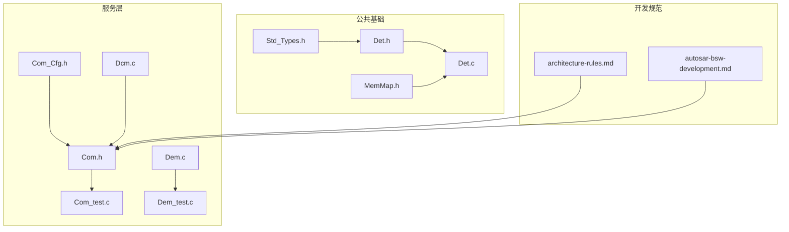
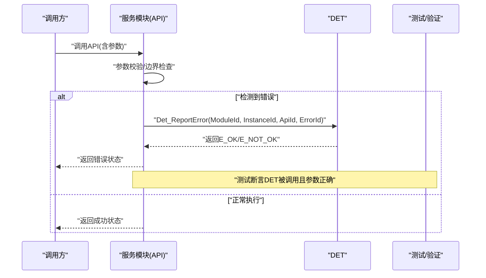
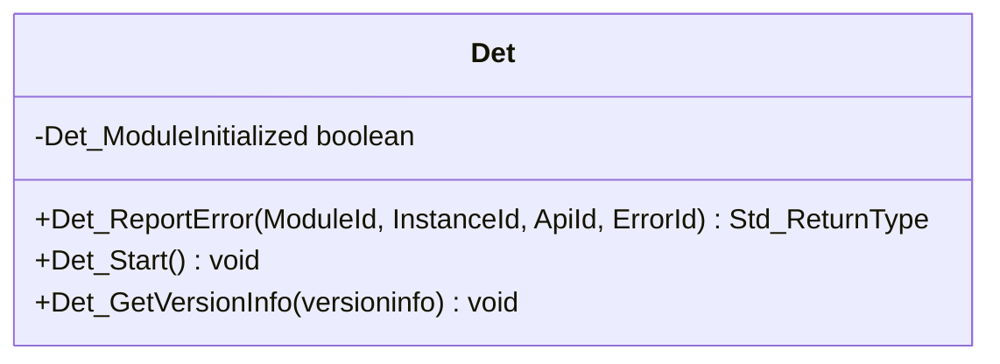
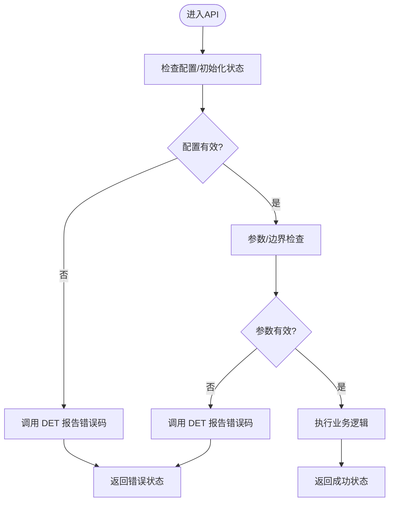
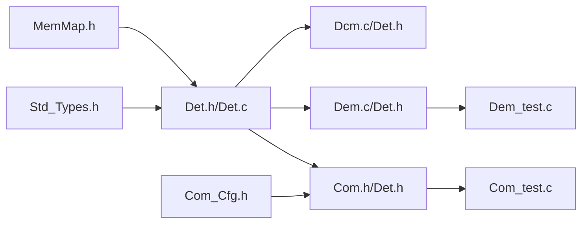

# 错误处理

<cite>
**本文引用的文件**
- [src/bsw/common/Det.h](file://src/bsw/common/Det.h)
- [src/bsw/common/Det.c](file://src/bsw/common/Det.c)
- [src/bsw/common/Std_Types.h](file://src/bsw/common/Std_Types.h)
- [src/bsw/general/inc/MemMap.h](file://src/bsw/general/inc/MemMap.h)
- [.harness/architecture-rules.md](file://.harness/architecture-rules.md)
- [.harness/autosar-bsw-development.md](file://.harness/autosar-bsw-development.md)
- [src/bsw/services/com/include/Com.h](file://src/bsw/services/com/include/Com.h)
- [src/bsw/services/com/include/Com_Cfg.h](file://src/bsw/services/com/include/Com_Cfg.h)
- [src/bsw/services/com/src/Com_test.c](file://src/bsw/services/com/src/Com_test.c)
- [openspec/changes/dev-com-module/specs/Com_spec.md](file://openspec/changes/dev-com-module/specs/Com_spec.md)
- [src/bsw/services/dem/src/Dem.c](file://src/bsw/services/dem/src/Dem.c)
- [src/bsw/services/dem/src/Dem_test.c](file://src/bsw/services/dem/src/Dem_test.c)
- [src/bsw/services/dcm/src/Dcm.c](file://src/bsw/services/dcm/src/Dcm.c)
- [docs/api-reference.md](file://docs/api-reference.md)
</cite>

## 目录
1. [引言](#引言)
2. [项目结构](#项目结构)
3. [核心组件](#核心组件)
4. [架构总览](#架构总览)
5. [详细组件分析](#详细组件分析)
6. [依赖关系分析](#依赖关系分析)
7. [性能考量](#性能考量)
8. [故障排查指南](#故障排查指南)
9. [结论](#结论)
10. [附录](#附录)

## 引言
本规范面向 YuleTech AutoSAR BSW 平台，系统化定义错误处理与 DET（Development Error Tracing）机制，覆盖错误码定义、错误检测与报告流程、条件编译控制策略，并结合开发阶段与生产阶段的差异化策略，确保代码在不同生命周期下的可维护性与可验证性。

## 项目结构
围绕错误处理的关键目录与文件如下：
- 公共基础：标准类型、内存映射、DET 模块
- 服务层：Com、Dem、Dcm 等模块的错误码与 DET 使用
- 开发规范：错误检测宏、条件编译模板与最佳实践
- 验证：单元测试对 DET 报错路径的覆盖

**图表来源**
- [src/bsw/common/Std_Types.h:1-117](file://src/bsw/common/Std_Types.h#L1-L117)
- [src/bsw/general/inc/MemMap.h:1-796](file://src/bsw/general/inc/MemMap.h#L1-L796)
- [src/bsw/common/Det.h:1-76](file://src/bsw/common/Det.h#L1-L76)
- [src/bsw/common/Det.c:1-88](file://src/bsw/common/Det.c#L1-L88)
- [src/bsw/services/com/include/Com.h:1-200](file://src/bsw/services/com/include/Com.h#L1-L200)
- [src/bsw/services/com/include/Com_Cfg.h:1-124](file://src/bsw/services/com/include/Com_Cfg.h#L1-L124)
- [src/bsw/services/com/src/Com_test.c:1-370](file://src/bsw/services/com/src/Com_test.c#L1-L370)
- [src/bsw/services/dem/src/Dem.c:1-200](file://src/bsw/services/dem/src/Dem.c#L1-L200)
- [src/bsw/services/dem/src/Dem_test.c:1-32](file://src/bsw/services/dem/src/Dem_test.c#L1-L32)
- [src/bsw/services/dcm/src/Dcm.c:818-842](file://src/bsw/services/dcm/src/Dcm.c#L818-L842)
- [.harness/architecture-rules.md:89-167](file://.harness/architecture-rules.md#L89-L167)
- [.harness/autosar-bsw-development.md:140-159](file://.harness/autosar-bsw-development.md#L140-L159)

**章节来源**
- [src/bsw/common/Det.h:1-76](file://src/bsw/common/Det.h#L1-L76)
- [src/bsw/common/Det.c:1-88](file://src/bsw/common/Det.c#L1-L88)
- [src/bsw/common/Std_Types.h:1-117](file://src/bsw/common/Std_Types.h#L1-L117)
- [src/bsw/general/inc/MemMap.h:1-796](file://src/bsw/general/inc/MemMap.h#L1-L796)
- [.harness/architecture-rules.md:89-167](file://.harness/architecture-rules.md#L89-L167)
- [.harness/autosar-bsw-development.md:140-159](file://.harness/autosar-bsw-development.md#L140-L159)

## 核心组件
- DET（Development Error Tracer）
  - 提供错误报告、启动与版本信息查询接口，支持条件编译开关。
  - 错误码包括无错误、参数指针错误、不可用等。
- 标准类型与返回值
  - 统一返回类型与空指针常量，便于错误处理一致性。
- 内存映射
  - 提供跨编译器的内存段宏，保证模块按规范分区。
- 服务层错误码与 DET 使用
  - Com、Dem、Dcm 等模块在配置中启用 DET，并在关键 API 中进行参数校验与错误上报。

**章节来源**
- [src/bsw/common/Det.h:34-70](file://src/bsw/common/Det.h#L34-L70)
- [src/bsw/common/Det.c:47-80](file://src/bsw/common/Det.c#L47-L80)
- [src/bsw/common/Std_Types.h:23-80](file://src/bsw/common/Std_Types.h#L23-L80)
- [src/bsw/general/inc/MemMap.h:37-796](file://src/bsw/general/inc/MemMap.h#L37-L796)
- [src/bsw/services/com/include/Com.h:89-107](file://src/bsw/services/com/include/Com.h#L89-L107)
- [src/bsw/services/com/include/Com_Cfg.h:15-18](file://src/bsw/services/com/include/Com_Cfg.h#L15-L18)
- [src/bsw/services/dem/src/Dem.c:44-49](file://src/bsw/services/dem/src/Dem.c#L44-L49)
- [src/bsw/services/dcm/src/Dcm.c:818-842](file://src/bsw/services/dcm/src/Dcm.c#L818-L842)

## 架构总览
下图展示 DET 与各模块的交互关系，以及错误检测宏在模块中的使用方式。

**图表来源**
- [src/bsw/common/Det.h:47-70](file://src/bsw/common/Det.h#L47-L70)
- [src/bsw/common/Det.c:47-80](file://src/bsw/common/Det.c#L47-L80)
- [src/bsw/services/com/include/Com.h:89-107](file://src/bsw/services/com/include/Com.h#L89-L107)
- [src/bsw/services/com/src/Com_test.c:122-134](file://src/bsw/services/com/src/Com_test.c#L122-L134)
- [src/bsw/services/dem/src/Dem.c:44-49](file://src/bsw/services/dem/src/Dem.c#L44-L49)
- [src/bsw/services/dem/src/Dem_test.c:30-32](file://src/bsw/services/dem/src/Dem_test.c#L30-L32)

## 详细组件分析

### DET 模块
- 职责
  - 提供 Det_ReportError、Det_Start、Det_GetVersionInfo 接口。
  - 通过条件编译控制是否实际执行错误上报逻辑。
- 关键点
  - 模块初始化标志用于保障 DET 已启动。
  - 版本信息填充遵循 AutoSAR 标准结构体字段。

**图表来源**
- [src/bsw/common/Det.h:47-70](file://src/bsw/common/Det.h#L47-L70)
- [src/bsw/common/Det.c:33-80](file://src/bsw/common/Det.c#L33-L80)

**章节来源**
- [src/bsw/common/Det.h:34-70](file://src/bsw/common/Det.h#L34-L70)
- [src/bsw/common/Det.c:47-80](file://src/bsw/common/Det.c#L47-L80)

### 标准类型与返回值
- 返回值约定
  - E_OK、E_NOT_OK、E_BUSY 等统一返回类型，便于上层判断。
- 空指针与布尔类型
  - NULL_PTR、TRUE、FALSE 的标准化定义，避免平台差异。

**章节来源**
- [src/bsw/common/Std_Types.h:23-80](file://src/bsw/common/Std_Types.h#L23-L80)

### 内存映射与分区
- 跨编译器的内存段宏
  - 提供 START/STOP 宏，确保代码、常量、配置与变量分区符合 AutoSAR 要求。
- 与 DET/模块的关系
  - DET 与各模块均通过 MemMap.h 进行内存分区声明，保证链接与加载正确性。

**章节来源**
- [src/bsw/general/inc/MemMap.h:37-796](file://src/bsw/general/inc/MemMap.h#L37-L796)
- [src/bsw/common/Det.h:48-73](file://src/bsw/common/Det.h#L48-L73)

### 服务层错误码与 DET 使用
- Com 模块
  - 错误码：参数错误、未初始化、无效信号/信号组/IPDU、版本信息参数为空等。
  - DET 使用：在 Com_Init、Com_DeInit、Com_SendSignal、Com_ReceiveSignal、Com_TriggerIPDUSend、Com_GetVersionInfo 等 API 中进行参数校验与 DET 报告。
  - 配置：COM_DEV_ERROR_DETECT 控制 DET 是否启用。
- Dem 模块
  - 通过宏 DEM_DEV_ERROR_DETECT 控制 DET 报告；在事件查找、DTC 管理等关键路径进行参数与状态检查。
- Dcm 模块
  - 在服务处理过程中根据条件发送正/负响应，配合 DET 报告条件不满足等错误。

**图表来源**
- [src/bsw/services/com/include/Com.h:89-107](file://src/bsw/services/com/include/Com.h#L89-L107)
- [src/bsw/services/com/include/Com_Cfg.h:15-18](file://src/bsw/services/com/include/Com_Cfg.h#L15-L18)
- [src/bsw/services/com/src/Com_test.c:122-134](file://src/bsw/services/com/src/Com_test.c#L122-L134)
- [src/bsw/services/dem/src/Dem.c:44-49](file://src/bsw/services/dem/src/Dem.c#L44-L49)
- [src/bsw/services/dcm/src/Dcm.c:818-842](file://src/bsw/services/dcm/src/Dcm.c#L818-L842)

**章节来源**
- [src/bsw/services/com/include/Com.h:89-107](file://src/bsw/services/com/include/Com.h#L89-L107)
- [src/bsw/services/com/include/Com_Cfg.h:15-18](file://src/bsw/services/com/include/Com_Cfg.h#L15-L18)
- [src/bsw/services/com/src/Com_test.c:122-134](file://src/bsw/services/com/src/Com_test.c#L122-L134)
- [src/bsw/services/dem/src/Dem.c:44-49](file://src/bsw/services/dem/src/Dem.c#L44-L49)
- [src/bsw/services/dcm/src/Dcm.c:818-842](file://src/bsw/services/dcm/src/Dcm.c#L818-L842)

### 条件编译与错误检测宏
- 通用模板
  - 模块级 DET 宏：在配置为 STD_ON 时启用 DET 报告，否则为空操作。
- Com 模块
  - 通过 COM_DEV_ERROR_DETECT 控制 DET 开关；在多个 API 中使用 DET 报告错误。
- Dem 模块
  - 通过 DEM_DEV_ERROR_DETECT 控制 DET 报告；在事件与 DTC 管理中进行参数校验。
- 开发规范
  - 明确错误检测宏与内存分区宏的使用方式，确保一致性与可移植性。

**章节来源**
- [.harness/autosar-bsw-development.md:140-159](file://.harness/autosar-bsw-development.md#L140-L159)
- [src/bsw/services/com/include/Com_Cfg.h:15-18](file://src/bsw/services/com/include/Com_Cfg.h#L15-L18)
- [src/bsw/services/dem/src/Dem.c:44-49](file://src/bsw/services/dem/src/Dem.c#L44-L49)

## 依赖关系分析
- DET 依赖
  - 标准类型：返回值与空指针定义。
  - 内存映射：代码段与变量段分区。
- 服务层依赖
  - Com/Dem/Dcm 等模块依赖 DET 进行错误上报；同时依赖标准类型与配置头文件。
- 测试依赖
  - 单元测试通过模拟 DET 报告行为，断言错误路径被正确触发。

**图表来源**
- [src/bsw/common/Std_Types.h:23-80](file://src/bsw/common/Std_Types.h#L23-L80)
- [src/bsw/general/inc/MemMap.h:37-796](file://src/bsw/general/inc/MemMap.h#L37-L796)
- [src/bsw/common/Det.h:47-70](file://src/bsw/common/Det.h#L47-L70)
- [src/bsw/services/com/include/Com.h:1-200](file://src/bsw/services/com/include/Com.h#L1-L200)
- [src/bsw/services/com/include/Com_Cfg.h:1-124](file://src/bsw/services/com/include/Com_Cfg.h#L1-L124)
- [src/bsw/services/com/src/Com_test.c:1-370](file://src/bsw/services/com/src/Com_test.c#L1-L370)
- [src/bsw/services/dem/src/Dem.c:1-200](file://src/bsw/services/dem/src/Dem.c#L1-L200)
- [src/bsw/services/dem/src/Dem_test.c:1-32](file://src/bsw/services/dem/src/Dem_test.c#L1-L32)
- [src/bsw/services/dcm/src/Dcm.c:818-842](file://src/bsw/services/dcm/src/Dcm.c#L818-L842)

**章节来源**
- [src/bsw/common/Det.h:47-70](file://src/bsw/common/Det.h#L47-L70)
- [src/bsw/common/Det.c:47-80](file://src/bsw/common/Det.c#L47-L80)
- [src/bsw/services/com/include/Com.h:89-107](file://src/bsw/services/com/include/Com.h#L89-L107)
- [src/bsw/services/com/include/Com_Cfg.h:15-18](file://src/bsw/services/com/include/Com_Cfg.h#L15-L18)
- [src/bsw/services/dem/src/Dem.c:44-49](file://src/bsw/services/dem/src/Dem.c#L44-L49)
- [src/bsw/services/dcm/src/Dcm.c:818-842](file://src/bsw/services/dcm/src/Dcm.c#L818-L842)

## 性能考量
- DET 开关控制
  - 生产阶段建议关闭 DET（STD_OFF），以减少分支与函数调用开销。
  - 开发/调试阶段开启 DET（STD_ON），以便快速定位问题。
- 内存分区
  - 合理使用 MemMap.h 的 START/STOP 宏，避免不必要的段重排与链接时间开销。
- 错误路径短路
  - 参数校验应尽早失败并返回，避免后续冗余计算。

## 故障排查指南
- 常见问题
  - 未初始化即调用 API：Com_E_UNINIT、Dem_E_UNINIT 等。
  - 空指针传入：COM_E_PARAM_POINTER、DET_E_PARAM_POINTER。
  - 参数越界/无效标识：COM_E_INVALID_SIGNAL_ID、COM_E_INVALID_IPDU_ID 等。
- 排查步骤
  - 检查模块初始化顺序与状态。
  - 核对传入参数是否为 NULL 或超出范围。
  - 确认 COM_DEV_ERROR_DETECT/DEM_DEV_ERROR_DETECT 等配置项。
  - 查看单元测试断言，复现实例化错误场景。
- 参考示例
  - Com_Init 传入 NULL 配置触发 DET 报告 COM_E_PARAM_POINTER。
  - Dem 在未初始化状态下访问事件/记录触发 DET 报告。
  - Dcm 在子功能处理中根据条件发送正/负响应并配合 DET。

**章节来源**
- [src/bsw/services/com/src/Com_test.c:122-134](file://src/bsw/services/com/src/Com_test.c#L122-L134)
- [src/bsw/services/dem/src/Dem_test.c:30-32](file://src/bsw/services/dem/src/Dem_test.c#L30-L32)
- [src/bsw/services/dcm/src/Dcm.c:818-842](file://src/bsw/services/dcm/src/Dcm.c#L818-L842)
- [openspec/changes/dev-com-module/specs/Com_spec.md:193-219](file://openspec/changes/dev-com-module/specs/Com_spec.md#L193-L219)

## 结论
本规范明确了 YuleTech AutoSAR BSW 平台的 DET 错误检测与报告机制、错误码定义、条件编译控制策略，并结合 Com/Dem/Dcm 等模块的实际应用与测试验证，形成从开发到生产的完整闭环。建议在开发阶段开启 DET 以强化质量控制，在生产阶段关闭 DET 以优化性能与体积。

## 附录

### 错误码定义与说明（节选）
- DET 错误码
  - 无错误、参数指针错误、不可用
- Com 错误码
  - 参数错误、未初始化、参数指针错误、初始化失败、无效信号/信号组/IPDU 等
- Dem 错误码
  - 事件/记录相关错误码（具体值参见模块源码）

**章节来源**
- [src/bsw/common/Det.h:41-43](file://src/bsw/common/Det.h#L41-L43)
- [src/bsw/services/com/include/Com.h:89-107](file://src/bsw/services/com/include/Com.h#L89-L107)
- [docs/api-reference.md:540-548](file://docs/api-reference.md#L540-L548)