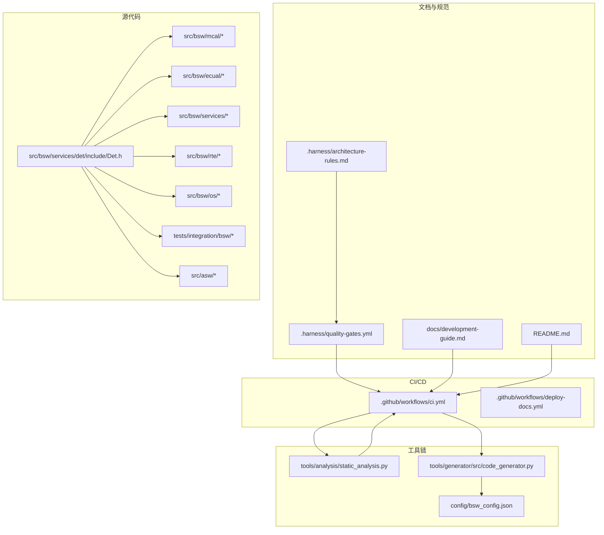
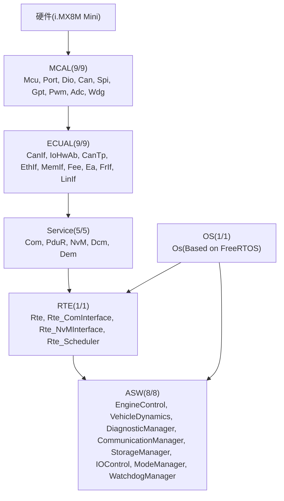
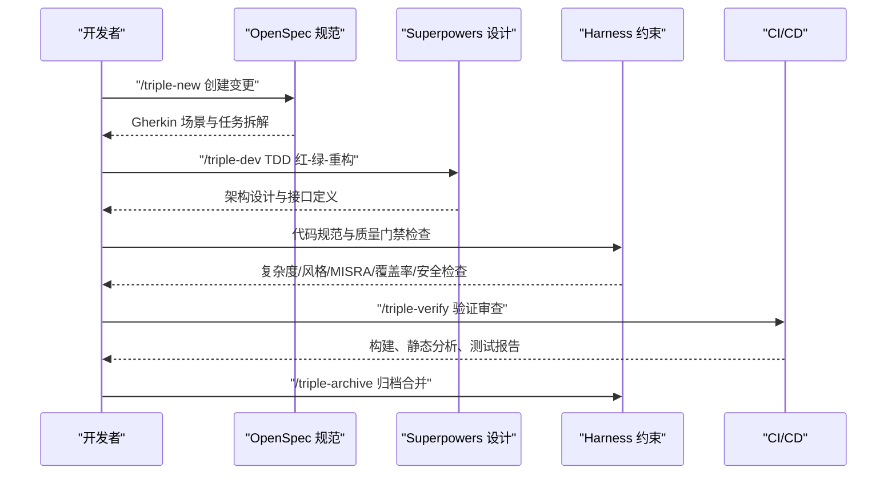
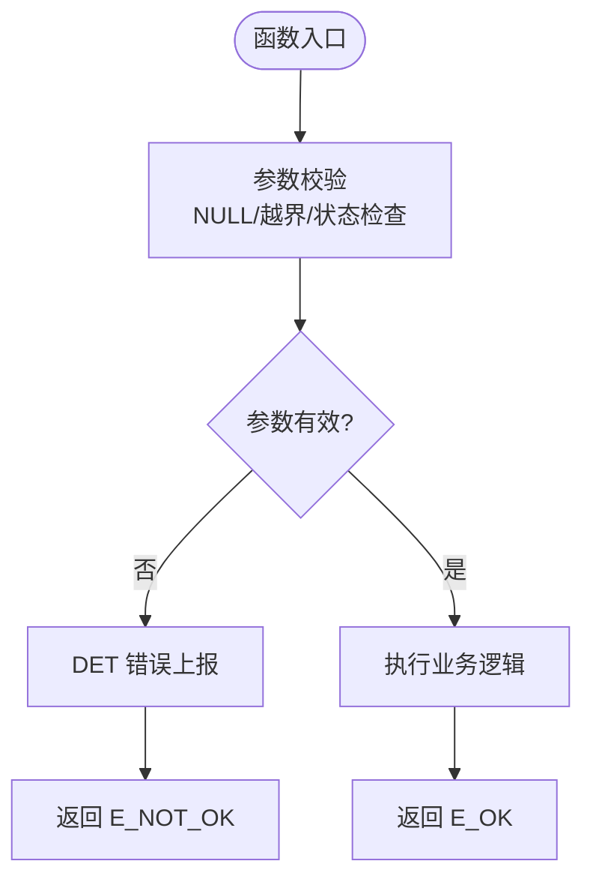
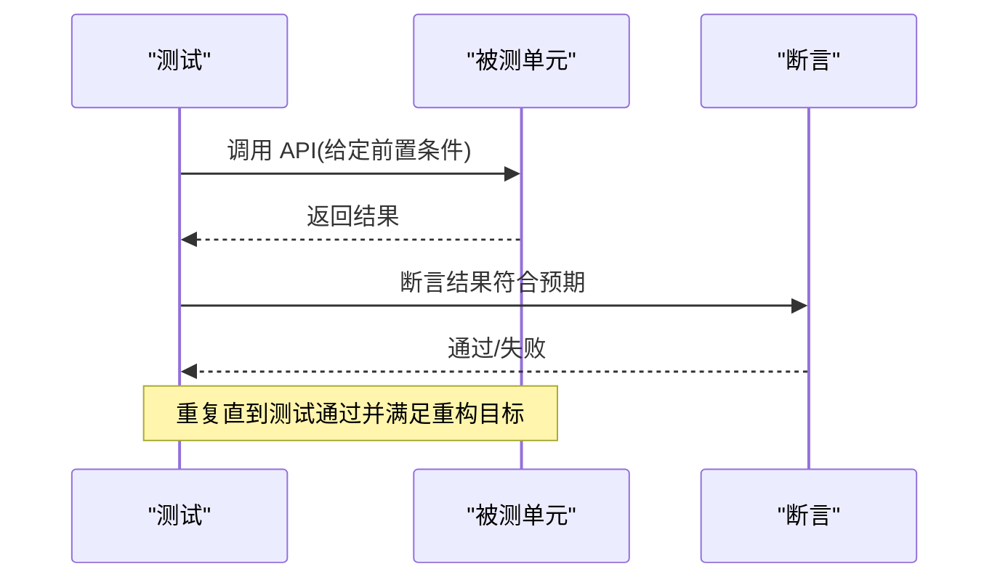
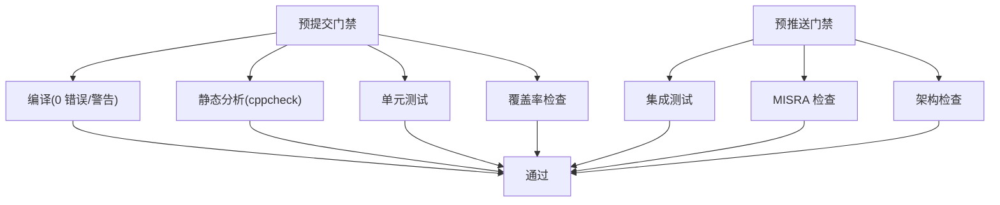
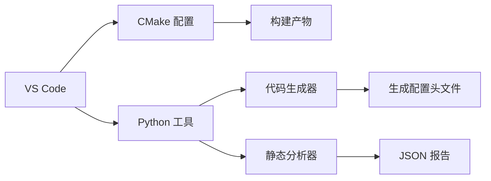
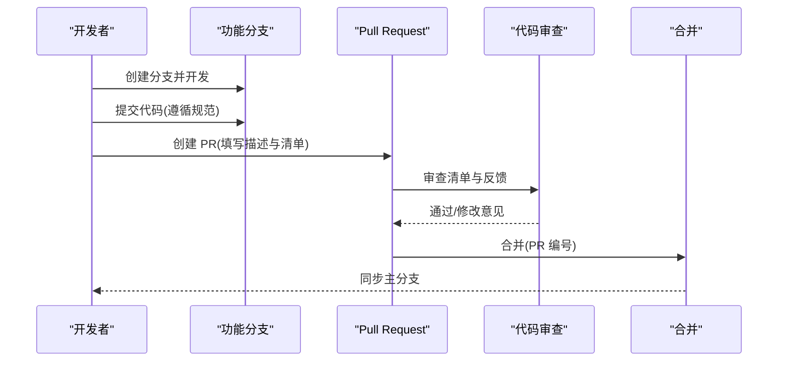
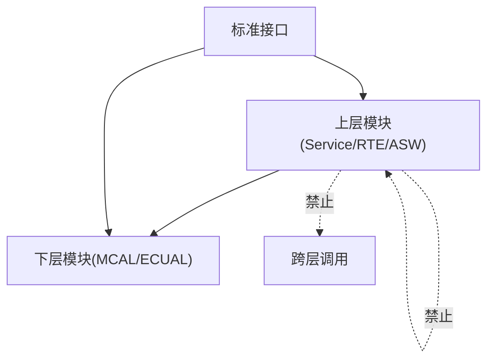

# 开发指南

<cite>
**本文引用的文件**
- [README.md](file://README.md)
- [AGENTS.md](file://AGENTS.md)
- [.github/workflows/ci.yml](file://.github/workflows/ci.yml)
- [.github/workflows/deploy-docs.yml](file://.github/workflows/deploy-docs.yml)
- [.harness/architecture-rules.md](file://.harness/architecture-rules.md)
- [.harness/autosar-bsw-development.md](file://.harness/autosar-bsw-development.md)
- [.harness/yuletech-dev-process.md](file://.harness/yuletech-dev-process.md)
- [.harness/quality-gates.yml](file://.harness/quality-gates.yml)
- [.harness/yuletech-complete-workflow.md](file://.harness/yuletech-complete-workflow.md)
- [.harness/github-pr-workflow.md](file://.harness/github-pr-workflow.md)
- [docs/development-guide.md](file://docs/development-guide.md)
- [src/bsw/services/det/include/Det.h](file://src/bsw/services/det/include/Det.h)
- [tools/analysis/static_analysis.py](file://tools/analysis/static_analysis.py)
- [tools/generator/src/code_generator.py](file://tools/generator/src/code_generator.py)
- [config/bsw_config.json](file://config/bsw_config.json)
</cite>

## 目录
1. [简介](#简介)
2. [项目结构](#项目结构)
3. [核心组件](#核心组件)
4. [架构总览](#架构总览)
5. [详细组件分析](#详细组件分析)
6. [依赖关系分析](#依赖关系分析)
7. [性能考量](#性能考量)
8. [故障排查指南](#故障排查指南)
9. [结论](#结论)
10. [附录](#附录)

## 简介
本指南面向 YuleTech AutoSAR BSW 平台的开发团队，系统阐述“OpenSpec + Superpowers + Harness Engineering”三重开发模式，覆盖从需求探索到代码归档的完整生命周期；配套 TDD 红-绿-重构实践、AutoSAR 命名规范、MemMap 内存分区、DET 错误检测支持、质量门禁与代码审查流程、开发工具链与 IDE 配置建议以及团队协作约定。

## 项目结构
项目采用分层架构与模块化组织，典型层级自下而上为：MCAL（微控制器驱动）、ECUAL（ECU 抽象层）、Service（服务层）、RTE（运行时环境）、ASW（应用服务组件）。CI/CD 通过 GitHub Actions 自动化构建、静态分析、测试与文档发布；质量门禁由 Harness YAML 配置统一约束。

**图表来源**
- [README.md:153-199](file://README.md#L153-L199)
- [.github/workflows/ci.yml:1-144](file://.github/workflows/ci.yml#L1-L144)
- [.github/workflows/deploy-docs.yml:1-22](file://.github/workflows/deploy-docs.yml#L1-L22)
- [.harness/architecture-rules.md:1-255](file://.harness/architecture-rules.md#L1-L255)
- [.harness/quality-gates.yml:1-274](file://.harness/quality-gates.yml#L1-L274)
- [docs/development-guide.md:17-81](file://docs/development-guide.md#L17-L81)
- [tools/analysis/static_analysis.py:1-379](file://tools/analysis/static_analysis.py#L1-L379)
- [tools/generator/src/code_generator.py:1-176](file://tools/generator/src/code_generator.py#L1-L176)
- [config/bsw_config.json:1-21](file://config/bsw_config.json#L1-L21)

**章节来源**
- [README.md:153-199](file://README.md#L153-L199)
- [.github/workflows/ci.yml:1-144](file://.github/workflows/ci.yml#L1-L144)
- [.harness/architecture-rules.md:1-255](file://.harness/architecture-rules.md#L1-L255)
- [.harness/quality-gates.yml:1-274](file://.harness/quality-gates.yml#L1-L274)
- [docs/development-guide.md:17-81](file://docs/development-guide.md#L17-L81)

## 核心组件
- 分层架构与依赖规则：明确上下层依赖、禁止跨层与循环依赖，接口必须通过标准 API。
- 代码质量规则：复杂度、函数/文件行数、参数数量、嵌套深度限制；命名与注释规范。
- AutoSAR 合规：标准类型使用、错误处理、配置与代码分离。
- 安全规则：指针检查、数组边界、初始化状态检查。
- 测试规则：TDD 红-绿-重构、覆盖率阈值、测试命名规范。
- 工具链规则：代码生成可编译且通过 MISRA 检查、配置验证与冲突报告。
- 质量门禁：静态分析、MISRA、复杂度、代码风格、测试覆盖率、安全检查、架构检查、文档检查、提交门禁。

**章节来源**
- [.harness/architecture-rules.md:25-181](file://.harness/architecture-rules.md#L25-L181)
- [.harness/architecture-rules.md:183-255](file://.harness/architecture-rules.md#L183-L255)
- [.harness/quality-gates.yml:6-274](file://.harness/quality-gates.yml#L6-L274)

## 架构总览
YuleTech BSW 严格遵循 AutoSAR Classic Platform 4.x 分层模型，自硬件层向上依次为 MCAL、ECUAL、Service、RTE、ASW。Harness 工程约束确保模块间接口清晰、依赖可控、错误检测完备、内存分区规范。

**图表来源**
- [README.md:48-84](file://README.md#L48-L84)
- [README.md:201-246](file://README.md#L201-L246)

**章节来源**
- [README.md:48-84](file://README.md#L48-L84)
- [README.md:201-246](file://README.md#L201-L246)

## 详细组件分析

### 开发流程方法论（OpenSpec + Superpowers + Harness）
- OpenSpec：所有功能具备对应规范，使用 Gherkin 场景描述，覆盖 Given-When-Then。
- Superpowers：设计文档包含模块架构图、接口定义、数据结构、状态机。
- Harness：约束配置与质量门禁，确保架构合规、代码质量与测试覆盖率达标。

**图表来源**
- [.harness/yuletech-dev-process.md:41-99](file://.harness/yuletech-dev-process.md#L41-L99)
- [.harness/autosar-bsw-development.md:89-137](file://.harness/autosar-bsw-development.md#L89-L137)
- [.harness/architecture-rules.md:183-255](file://.harness/architecture-rules.md#L183-L255)
- [.harness/quality-gates.yml:212-242](file://.harness/quality-gates.yml#L212-L242)

**章节来源**
- [.harness/yuletech-dev-process.md:41-99](file://.harness/yuletech-dev-process.md#L41-L99)
- [.harness/autosar-bsw-development.md:89-137](file://.harness/autosar-bsw-development.md#L89-L137)
- [.harness/architecture-rules.md:183-255](file://.harness/architecture-rules.md#L183-L255)
- [.harness/quality-gates.yml:212-242](file://.harness/quality-gates.yml#L212-L242)

### 代码规范与实现要点
- AutoSAR 命名规范：文件名 PascalCase、函数名 Module_ActionName、宏定义 MODULENAME_MACRO_NAME、类型名 ModuleName_TypeName、变量 camelCase。
- 文件头模板与注释规范：包含项目、平台、版本、作者版权信息；函数注释包含 brief、参数、返回值、前置条件、后置条件、注意。
- 错误检测（DET）：通过模块级 DET 宏封装，启用/关闭由配置开关控制；在参数校验、状态检查、边界检查处上报 DET。
- 内存分区（MemMap）：使用 START/STOP 宏对进行代码与变量分区，确保链接器脚本正确映射。
- 标准类型使用：统一使用 Std_ReturnType、uint8/uint32/sint16 等标准类型，避免原生类型。
- 配置与代码分离：配置结构体与实现分离，避免硬编码。

**图表来源**
- [.harness/architecture-rules.md:140-181](file://.harness/architecture-rules.md#L140-L181)
- [docs/development-guide.md:84-334](file://docs/development-guide.md#L84-L334)
- [src/bsw/services/det/include/Det.h:1-76](file://src/bsw/services/det/include/Det.h#L1-L76)

**章节来源**
- [.harness/architecture-rules.md:59-181](file://.harness/architecture-rules.md#L59-L181)
- [docs/development-guide.md:84-334](file://docs/development-guide.md#L84-L334)
- [src/bsw/services/det/include/Det.h:1-76](file://src/bsw/services/det/include/Det.h#L1-L76)

### TDD 红-绿-重构实践
- 红：编写失败的测试，明确期望行为。
- 绿：编写最小实现使测试通过，不考虑性能与可读性。
- 重构：优化结构与命名，保持测试通过，持续改进。

**图表来源**
- [.harness/architecture-rules.md:185-189](file://.harness/architecture-rules.md#L185-L189)
- [docs/development-guide.md:404-427](file://docs/development-guide.md#L404-L427)

**章节来源**
- [.harness/architecture-rules.md:185-189](file://.harness/architecture-rules.md#L185-L189)
- [docs/development-guide.md:404-427](file://docs/development-guide.md#L404-L427)

### 质量门禁与代码审查流程
- 静态分析：cppcheck 开启 style/performance/portability/information/unusedFunction/missingInclude 等检查。
- MISRA C:2012：必遵守规则与建议规则清单，违规即阻断。
- 复杂度：圈复杂度 < 10、函数行数 < 50、文件行数 < 500、参数数量 < 5、嵌套深度 < 4。
- 代码风格：宏/类型/函数/变量/全局/常量命名规范，缩进、行长、注释比例要求。
- 测试覆盖率：MCAL/Service/Utility 覆盖率阈值；MC/DC 要求。
- 安全检查：缓冲区溢出、空指针、整数溢出、use-after-free、格式化字符串等。
- 架构检查：分层依赖、禁止循环依赖、接口使用、禁止直接硬件访问。
- 文档检查：文件头、函数注释、类型注释、宏注释。
- 提交门禁：编译、静态分析、单元测试、覆盖率检查；预推送：集成测试、MISRA、架构检查。

**图表来源**
- [.harness/quality-gates.yml:6-274](file://.harness/quality-gates.yml#L6-L274)

**章节来源**
- [.harness/quality-gates.yml:6-274](file://.harness/quality-gates.yml#L6-L274)

### 开发工具链与 IDE 配置
- 工具链要求：ARM GCC、CMake、Python、Git、VS Code。
- VS Code 扩展：C/C++、CMake Tools、Python、GitLens。
- 项目设置：创建 build 目录，配置工具链文件，多核并行构建。
- 代码生成：基于 JSON 配置生成模块配置头文件，模板渲染。
- 静态分析：独立 Python 分析器，输出 JSON 报告，包含 MISRA、复杂度、风格检查。

**图表来源**
- [docs/development-guide.md:17-81](file://docs/development-guide.md#L17-L81)
- [tools/generator/src/code_generator.py:1-176](file://tools/generator/src/code_generator.py#L1-L176)
- [tools/analysis/static_analysis.py:1-379](file://tools/analysis/static_analysis.py#L1-L379)
- [config/bsw_config.json:1-21](file://config/bsw_config.json#L1-L21)

**章节来源**
- [docs/development-guide.md:17-81](file://docs/development-guide.md#L17-L81)
- [tools/generator/src/code_generator.py:1-176](file://tools/generator/src/code_generator.py#L1-L176)
- [tools/analysis/static_analysis.py:1-379](file://tools/analysis/static_analysis.py#L1-L379)
- [config/bsw_config.json:1-21](file://config/bsw_config.json#L1-L21)

### 团队协作与工作流程
- 分支策略：main（稳定）、feature/*（功能）、fix/*（修复）。
- 提交规范：feat/fix/docs/style/refactor/test/chore 类型，配合清晰描述。
- PR 流程：创建分支、开发提交、运行验证、创建 PR、代码审查、合并。
- 质量门禁：提交前检查、PR 创建前检查、合并前检查清单。

**图表来源**
- [.harness/github-pr-workflow.md:12-154](file://.harness/github-pr-workflow.md#L12-L154)
- [.harness/github-pr-workflow.md:166-223](file://.harness/github-pr-workflow.md#L166-L223)
- [.harness/yuletech-complete-workflow.md:75-130](file://.harness/yuletech-complete-workflow.md#L75-L130)

**章节来源**
- [.harness/github-pr-workflow.md:12-154](file://.harness/github-pr-workflow.md#L12-L154)
- [.harness/github-pr-workflow.md:166-223](file://.harness/github-pr-workflow.md#L166-L223)
- [.harness/yuletech-complete-workflow.md:75-130](file://.harness/yuletech-complete-workflow.md#L75-L130)

## 依赖关系分析
- 分层依赖：上层可依赖下层，禁止下层依赖上层与跨层依赖。
- 接口契约：模块间通过标准接口交互，避免直接硬件访问。
- 复杂度与耦合：通过复杂度限制与测试覆盖率控制模块内聚与耦合。
- 工具链与外部依赖：ARM GCC、CMake、Python 生态、GitHub Actions。

**图表来源**
- [.harness/architecture-rules.md:25-33](file://.harness/architecture-rules.md#L25-L33)

**章节来源**
- [.harness/architecture-rules.md:25-33](file://.harness/architecture-rules.md#L25-L33)

## 性能考量
- 圈复杂度控制：保持函数复杂度 < 10，提升可维护性与可测试性。
- 函数与文件规模：限制函数/文件行数，避免过长函数与文件。
- 参数数量与嵌套深度：减少参数数量与嵌套层级，提高可读性。
- 内存分区：合理使用 MemMap 分区，避免碎片与链接问题。
- 静态分析与 MISRA：提前发现潜在性能与安全问题。

[本节为通用指导，无需特定文件分析]

## 故障排查指南
- 编译错误：确保 0 错误/0 警告；检查工具链版本与 CMake 配置。
- 静态分析失败：关注 missingInclude、unusedFunction 等 cppcheck 报告；修正 MISRA 规则问题。
- 单元测试失败：对照 TDD 场景，逐条定位失败用例，回归重构。
- 覆盖率不足：补充边界与异常路径测试，达到阈值要求。
- 架构违规：检查依赖方向与接口使用，避免循环依赖与跨层调用。
- 文档缺失：补全文件头、函数注释、类型注释与宏注释。

**章节来源**
- [.harness/quality-gates.yml:212-274](file://.harness/quality-gates.yml#L212-L274)
- [.harness/architecture-rules.md:183-255](file://.harness/architecture-rules.md#L183-L255)

## 结论
本指南以 OpenSpec + Superpowers + Harness 为核心，结合 TDD 实践与严格的质量门禁，形成从需求到归档的闭环开发流程。通过 AutoSAR 命名规范、MemMap 内存分区、DET 错误检测与 MISRA 合规，确保代码质量与可维护性；借助 CI/CD 与工具链自动化，加速交付并降低风险。

[本节为总结，无需特定文件分析]

## 附录
- 快速命令参考
  - 初始化工程：/triple-init
  - 需求探索：/triple-explore
  - 创建变更：/triple-new "描述"
  - 开发执行：/triple-dev
  - 验证审查：/triple-verify
  - 归档合并：/triple-archive
  - 健康检查：/triple-health
- 提交规范类型：feat/fix/docs/style/refactor/test/chore
- 分支策略：main/feature/*/fix/*

**章节来源**
- [README.md:277-304](file://README.md#L277-L304)
- [.harness/github-pr-workflow.md:156-185](file://.harness/github-pr-workflow.md#L156-L185)
- [.harness/yuletech-complete-workflow.md:196-205](file://.harness/yuletech-complete-workflow.md#L196-L205)