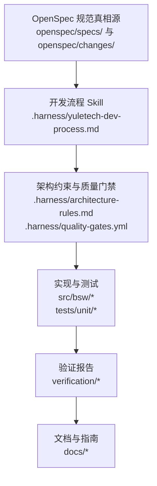
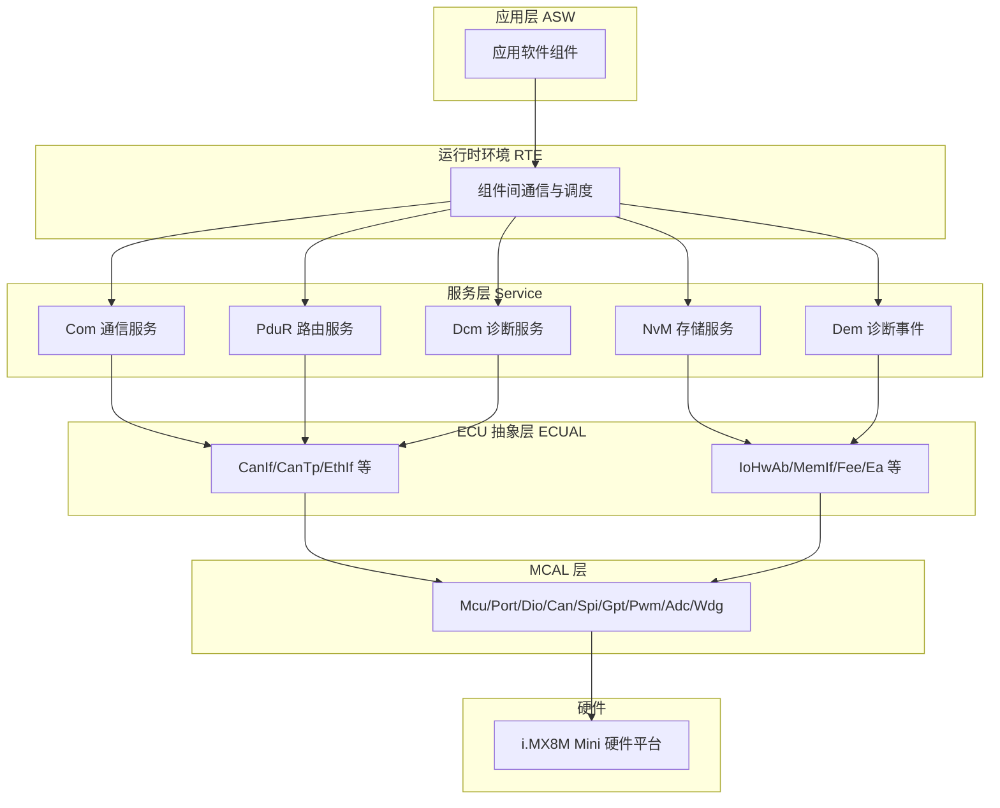
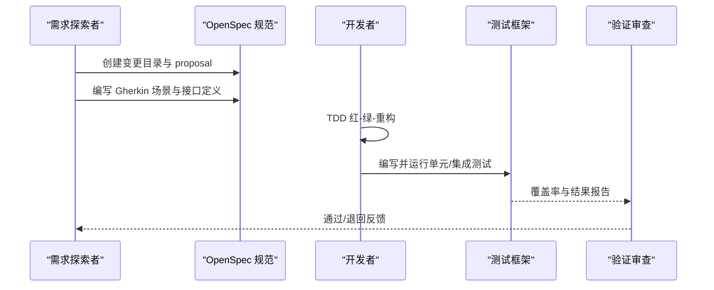
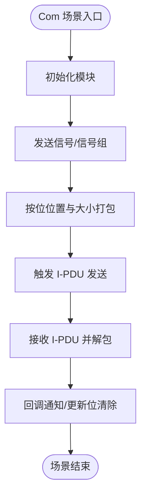
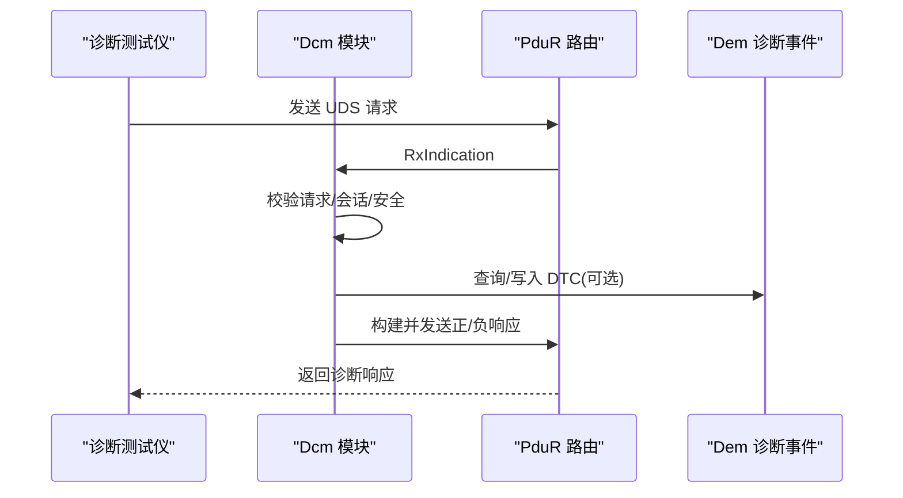
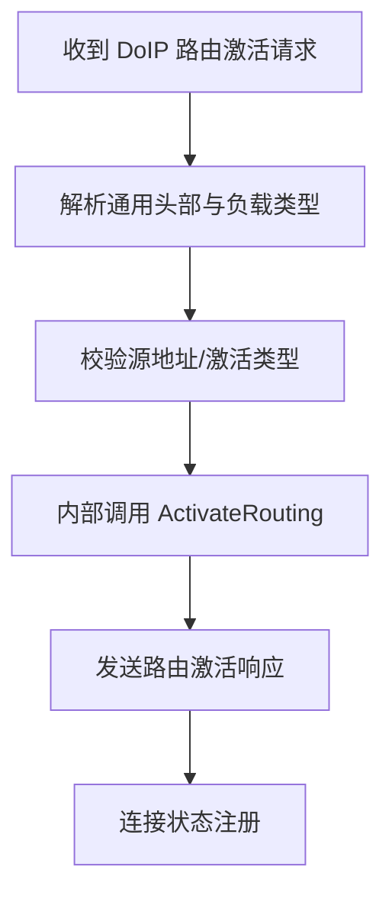
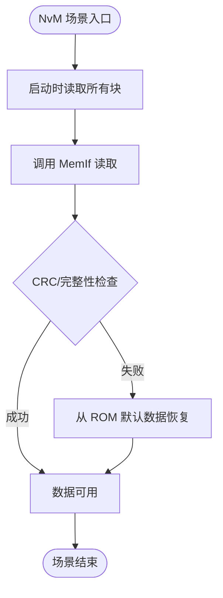
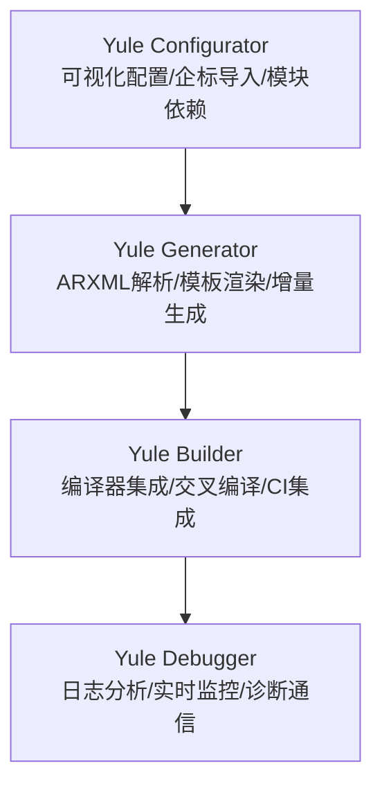

# OpenSpec 开发模式

<cite>
**本文引用的文件**
- [README.md](file://README.md)
- [yuletech-dev-process.md](file://.harness/yuletech-dev-process.md)
- [autosar-bsw-development.md](file://.harness/autosar-bsw-development.md)
- [architecture-rules.md](file://.harness/architecture-rules.md)
- [quality-gates.yml](file://.harness/quality-gates.yml)
- [bsw_integration_verification.md](file://verification/bsw_integration_verification.md)
- [development-guide.md](file://docs/development-guide.md)
- [spec.md](file://openspec/specs/bsw/spec.md)
- [spec.md](file://openspec/specs/toolchain/spec.md)
- [Com_spec.md](file://openspec/changes/dev-com-module/specs/Com_spec.md)
- [Dcm_spec.md](file://openspec/changes/dev-dcm-dem-module/specs/Dcm_spec.md)
- [DoIp_spec.md](file://openspec/changes/dev-doip-docan-module/specs/DoIp_spec.md)
- [NvM_spec.md](file://openspec/changes/dev-nvm-enhancement/specs/NvM_spec.md)
</cite>

## 目录
1. [引言](#引言)
2. [项目结构](#项目结构)
3. [核心组件](#核心组件)
4. [架构总览](#架构总览)
5. [详细组件分析](#详细组件分析)
6. [依赖分析](#依赖分析)
7. [性能考虑](#性能考虑)
8. [故障排除指南](#故障排除指南)
9. [结论](#结论)
10. [附录](#附录)

## 引言
本文件系统化阐述 YuleTech AutoSAR BSW 平台的 OpenSpec 开发模式，围绕“需求探索、设计规范、实现验证”三大核心要素，结合项目现有 OpenSpec 变更文档与开发流程规范，给出可落地的模块设计方法论与实施路径。OpenSpec 以 Gherkin 风格场景（Given-When-Then）明确需求边界，以接口与数据类型定义固化设计契约，并通过 TDD 驱动的实现与验证确保交付质量。

## 项目结构
YuleTech 采用“OpenSpec + Superpowers + Harness Engineering”的开发方法论，OpenSpec 作为规范真相源，贯穿需求、设计、实现与验证全过程；.harness 定义架构约束与质量门禁；verification 提供集成验证报告；docs 提供开发指南与最佳实践。

**图表来源**
- [README.md: 项目结构与开发流程:153-199](file://README.md#L153-L199)
- [yuletech-dev-process.md: 开发流程与阶段划分:41-100](file://.harness/yuletech-dev-process.md#L41-L100)

**章节来源**
- [README.md: 项目结构与开发流程:153-199](file://README.md#L153-L199)
- [.harness/yuletech-dev-process.md: 开发流程与阶段划分:41-100](file://.harness/yuletech-dev-process.md#L41-L100)

## 核心组件
- OpenSpec 规范库：集中存放各层模块的规范与场景，如 BSW 基础规范、工具链规范，以及具体模块的 OpenSpec 变更文档（Com、Dcm、DoIp、NvM）。
- 开发流程 Skill：定义从需求探索到归档合并的五阶段流程，配套 TDD 与 Git 工作流。
- 架构约束与质量门禁：分层依赖、接口使用、错误处理、复杂度与测试覆盖率等强制规则。
- 验证报告：覆盖 MCAL、ECUAL、Service、OS、RTE、ASW 六层的集成验证结果。
- 开发指南：提供代码规范、调试技巧、测试方法与最佳实践。

**章节来源**
- [spec.md: BSW 基础规范:1-271](file://openspec/specs/bsw/spec.md#L1-L271)
- [spec.md: 工具链规范:1-417](file://openspec/specs/toolchain/spec.md#L1-L417)
- [Com_spec.md: Com 模块规范:1-332](file://openspec/changes/dev-com-module/specs/Com_spec.md#L1-L332)
- [Dcm_spec.md: Dcm 模块规范:1-283](file://openspec/changes/dev-dcm-dem-module/specs/Dcm_spec.md#L1-L283)
- [DoIp_spec.md: DoIp 模块规范:1-338](file://openspec/changes/dev-doip-docan-module/specs/DoIp_spec.md#L1-L338)
- [NvM_spec.md: NvM 模块规范:1-389](file://openspec/changes/dev-nvm-enhancement/specs/NvM_spec.md#L1-L389)

## 架构总览
OpenSpec 在 AutoSAR Classic Platform 4.x 标准框架下，定义了从应用层（ASW）到运行时环境（RTE）、服务层（Service）、ECU 抽象层（ECUAL）、MCAL 层到硬件的完整分层架构。各层之间仅允许上层依赖下层，禁止跨层依赖与循环依赖。

**图表来源**
- [README.md: 分层架构图:50-74](file://README.md#L50-L74)
- [architecture-rules.md: 分层依赖规则:25-34](file://.harness/architecture-rules.md#L25-L34)

**章节来源**
- [README.md: 分层架构与模块清单:48-246](file://README.md#L48-L246)
- [.harness/architecture-rules.md: 分层与依赖规则:25-34](file://.harness/architecture-rules.md#L25-L34)

## 详细组件分析

### OpenSpec 三要素与实施路径
- 需求探索（Stage 1）：通过 OpenSpec 变更目录下的 proposal 与 specs，明确模块边界、输入输出与约束条件，形成 Gherkin 场景。
- 设计规范（Stage 2）：在 specs/ 下定义 API 列表、数据类型、错误码、配置参数与依赖关系，确保设计可验证。
- 实现验证（Stage 3–4）：按 TDD 红-绿-重构循环实现，通过单元测试与集成测试验证场景，最终归档至 openspec/specs/。

**图表来源**
- [yuletech-dev-process.md: 开发阶段与 TDD:59-91](file://.harness/yuletech-dev-process.md#L59-L91)
- [development-guide.md: TDD 流程与示例:404-427](file://docs/development-guide.md#L404-L427)

**章节来源**
- [.harness/yuletech-dev-process.md: 开发阶段与 TDD:59-91](file://.harness/yuletech-dev-process.md#L59-L91)
- [docs/development-guide.md: TDD 流程与示例:404-427](file://docs/development-guide.md#L404-L427)

### Com 模块：信号路由与传输
- 功能要点：信号打包/解包、信号组传输、周期/混合传输模式、端到端过滤与更新位、I-PDU 分组控制、截止时间监控、回调通知与信号网关。
- 接口与数据：提供初始化/反初始化、信号收发、信号组收发、I-PDU 控制、PduR 回调与主函数等 API；定义信号、I-PDU、传输模式、分组向量等数据类型。
- 场景覆盖：直接发送、接收解包、信号组原子传输、混合模式周期与事件触发、网关路由等。

**图表来源**
- [Com_spec.md: 场景与流程:234-310](file://openspec/changes/dev-com-module/specs/Com_spec.md#L234-L310)

**章节来源**
- [Com_spec.md: API 列表与数据类型:31-175](file://openspec/changes/dev-com-module/specs/Com_spec.md#L31-L175)
- [Com_spec.md: 场景与流程:234-310](file://openspec/changes/dev-com-module/specs/Com_spec.md#L234-L310)

### Dcm 模块：UDS 诊断协议
- 功能要点：UDS 服务处理（会话控制、复位、读写数据、Routine 控制、下载/上传）、安全访问（种子/钥匙）、DTC 信息访问、数据传输。
- 接口与数据：生命周期 API、诊断处理回调、会话与安全控制 API；定义会话类型、安全等级、协议类型、否定响应码、DID/ RID 配置等。
- 场景覆盖：默认会话读取、扩展会话安全解锁、读取 DTC、软件刷写流程。

**图表来源**
- [Dcm_spec.md: UDS 服务与回调:27-74](file://openspec/changes/dev-dcm-dem-module/specs/Dcm_spec.md#L27-L74)
- [Dcm_spec.md: 场景流程:193-256](file://openspec/changes/dev-dcm-dem-module/specs/Dcm_spec.md#L193-L256)

**章节来源**
- [Dcm_spec.md: UDS 服务与数据类型:27-165](file://openspec/changes/dev-dcm-dem-module/specs/Dcm_spec.md#L27-L165)
- [Dcm_spec.md: 场景与流程:193-256](file://openspec/changes/dev-dcm-dem-module/specs/Dcm_spec.md#L193-L256)

### DoIp 模块：以太网诊断封装
- 功能要点：车辆发现、路由激活、诊断消息封装、存活检查、连接管理。
- 接口与数据：生命周期 API、DCM 接口回调、底层 SoAd 回调、主函数；定义状态机、连接状态、路由激活类型、通用头部与负载类型等。
- 场景覆盖：路由激活、UDS over IP 请求发送、车辆识别响应、未初始化错误检测。

**图表来源**
- [DoIp_spec.md: 路由激活场景:244-260](file://openspec/changes/dev-doip-docan-module/specs/DoIp_spec.md#L244-L260)

**章节来源**
- [DoIp_spec.md: API 列表与数据类型:35-163](file://openspec/changes/dev-doip-docan-module/specs/DoIp_spec.md#L35-L163)
- [DoIp_spec.md: 场景与流程:244-315](file://openspec/changes/dev-doip-docan-module/specs/DoIp_spec.md#L244-L315)

### NvM 模块：非易失存储增强
- 功能要点：异步读写、块管理（Native/Redundant/Dataset）、CRC 保护、默认数据恢复、写保护与一次性写、队列与多块操作。
- 接口与数据：生命周期、单块操作、系统级、状态控制、保护控制、终止控制 API；定义请求结果、块管理类型、CRC 类型、块描述符与配置等。
- 场景覆盖：启动 ReadAll、应用写入 Native 块、冗余块恢复、Dataset 切换、WriteOnce 保护、CRC 失败恢复。

**图表来源**
- [NvM_spec.md: ReadAll 场景:272-288](file://openspec/changes/dev-nvm-enhancement/specs/NvM_spec.md#L272-L288)

**章节来源**
- [NvM_spec.md: API 列表与数据类型:53-204](file://openspec/changes/dev-nvm-enhancement/specs/NvM_spec.md#L53-L204)
- [NvM_spec.md: 场景与流程:272-363](file://openspec/changes/dev-nvm-enhancement/specs/NvM_spec.md#L272-L363)

### 工具链 OpenSpec：配置、生成、构建、调试
- 配置工具（Yule Configurator）：图形化配置、企标导入、模块选择与依赖解析、参数校验与历史回滚。
- 代码生成器（Yule Generator）：ARXML 解析、模板引擎、增量生成、配置报告。
- 构建工具（Yule Builder）：编译器集成、交叉编译、CI/CD 集成、构建脚本生成。
- 调试工具（Yule Debugger）：日志分析、实时监控、诊断通信（UDS、DTC、刷写）。

**图表来源**
- [spec.md: 工具链架构与功能:11-31](file://openspec/specs/toolchain/spec.md#L11-L31)
- [spec.md: 配置工具与 API:33-156](file://openspec/specs/toolchain/spec.md#L33-L156)
- [spec.md: 代码生成器与模板:158-269](file://openspec/specs/toolchain/spec.md#L158-L269)
- [spec.md: 构建工具与 CI:271-348](file://openspec/specs/toolchain/spec.md#L271-L348)
- [spec.md: 调试工具与接口:350-383](file://openspec/specs/toolchain/spec.md#L350-L383)

**章节来源**
- [spec.md: 工具链规范:1-417](file://openspec/specs/toolchain/spec.md#L1-L417)

## 依赖分析
- 分层依赖：上层可依赖下层，禁止下层依赖上层、同层跨模块依赖与循环依赖。
- 接口契约：模块间通信必须通过标准 BSW 接口，避免直接硬件访问。
- 质量门禁：静态分析、MISRA C:2012、复杂度、测试覆盖率、安全检查、架构检查与文档检查。

**图表来源**
- [architecture-rules.md: 分层依赖规则:25-34](file://.harness/architecture-rules.md#L25-L34)

**章节来源**
- [.harness/architecture-rules.md: 分层与依赖规则:25-34](file://.harness/architecture-rules.md#L25-L34)
- [.harness/quality-gates.yml: 质量门禁与阈值:123-145](file://.harness/quality-gates.yml#L123-L145)

## 性能考虑
- 性能指标：中断响应延迟、任务调度延迟、CAN 报文处理、Flash 写操作等均有明确目标值。
- 工具链性能：ARXML 解析、代码生成、配置界面加载、编译构建的性能目标与兼容性要求。
- 覆盖率与复杂度：MCAL/Service 层的语句/分支/MC/DC 覆盖率与函数圈复杂度上限，保障可维护性与安全性。

**章节来源**
- [spec.md: BSW 性能与可靠性:236-257](file://openspec/specs/bsw/spec.md#L236-L257)
- [spec.md: 工具链性能目标:384-394](file://openspec/specs/toolchain/spec.md#L384-L394)
- [.harness/quality-gates.yml: 复杂度与覆盖率阈值:75-99](file://.harness/quality-gates.yml#L75-L99)

## 故障排除指南
- 错误检测（DET）：所有模块均支持 DET，按模块定义的错误码上报，便于定位初始化、参数、状态等问题。
- 静态分析与 MISRA：cppcheck 静态分析与 MISRA C:2012 检查，抑制特定标准头文件与编译器抽象头文件。
- 质量门禁：编译、静态分析、单元测试、覆盖率、集成测试、MISRA、架构检查等门禁确保问题不流入主干。
- 验证报告：集成验证覆盖六层模块，确认分层依赖方向与功能实现符合 AutoSAR 规范。

**章节来源**
- [architecture-rules.md: 错误处理与 DET:107-121](file://.harness/architecture-rules.md#L107-L121)
- [.harness/quality-gates.yml: 静态分析与 MISRA:7-74](file://.harness/quality-gates.yml#L7-L74)
- [bsw_integration_verification.md: 集成验证结果:1-193](file://verification/bsw_integration_verification.md#L1-L193)

## 结论
OpenSpec 在 YuleTech AutoSAR BSW 平台中实现了“以规范驱动开发、以场景验证实现、以门禁保障质量”的闭环。通过 Gherkin 场景明确需求边界，以接口与数据类型固化设计契约，配合 TDD 与质量门禁，确保模块实现可追溯、可验证、可维护。工具链 OpenSpec 进一步将配置、生成、构建与调试标准化，提升开发效率与一致性。

## 附录

### OpenSpec 文档编写模板与示例
- 模板结构
  - 模块概述：职责、关键能力、与上下层关系
  - API 列表：生命周期、核心功能、回调、主函数
  - 数据类型：枚举、结构体、配置参数
  - 错误处理（DET）：错误码与使用场景
  - 配置参数：预编译与运行时配置
  - 场景（Scenarios）：Gherkin 风格，覆盖正常/异常/边界/并发
  - 依赖：上/下/同层模块与公共模块
  - 版本历史：变更记录
- 示例参考
  - [Com 模块规范:1-332](file://openspec/changes/dev-com-module/specs/Com_spec.md#L1-L332)
  - [Dcm 模块规范:1-283](file://openspec/changes/dev-dcm-dem-module/specs/Dcm_spec.md#L1-L283)
  - [DoIp 模块规范:1-338](file://openspec/changes/dev-doip-docan-module/specs/DoIp_spec.md#L1-L338)
  - [NvM 模块规范:1-389](file://openspec/changes/dev-nvm-enhancement/specs/NvM_spec.md#L1-L389)

**章节来源**
- [Com_spec.md: 规范结构与示例:1-332](file://openspec/changes/dev-com-module/specs/Com_spec.md#L1-L332)
- [Dcm_spec.md: 规范结构与示例:1-283](file://openspec/changes/dev-dcm-dem-module/specs/Dcm_spec.md#L1-L283)
- [DoIp_spec.md: 规范结构与示例:1-338](file://openspec/changes/dev-doip-docan-module/specs/DoIp_spec.md#L1-L338)
- [NvM_spec.md: 规范结构与示例:1-389](file://openspec/changes/dev-nvm-enhancement/specs/NvM_spec.md#L1-L389)

### OpenSpec 与传统开发方法的区别与优势
- 区别
  - 传统：需求文档 + 设计评审 + 编码 + 测试，场景与接口相对隐含
  - OpenSpec：以 Gherkin 场景明确需求，以接口与数据类型固化设计，以 TDD 驱动实现与验证
- 优势
  - 需求可追溯：场景即验收标准
  - 设计可验证：接口与数据类型定义契约
  - 实现可回归：场景驱动的测试用例
  - 质量可度量：覆盖率、复杂度、MISRA、架构检查等门禁

**章节来源**
- [.harness/yuletech-dev-process.md: 开发原则与流程:12-31](file://.harness/yuletech-dev-process.md#L12-L31)
- [.harness/quality-gates.yml: 质量门禁与阈值:123-145](file://.harness/quality-gates.yml#L123-L145)

### 在 AutoSAR 开发中的应用场景
- 模块设计：以 OpenSpec 场景驱动接口定义与数据结构设计
- 代码生成：工具链 OpenSpec 将 ARXML 配置转换为可编译代码
- 集成验证：六层模块集成验证，确保分层依赖与接口兼容
- 工具链协同：配置、生成、构建、调试一体化，提升开发效率

**章节来源**
- [spec.md: BSW 基础规范:1-271](file://openspec/specs/bsw/spec.md#L1-L271)
- [spec.md: 工具链规范:1-417](file://openspec/specs/toolchain/spec.md#L1-L417)
- [bsw_integration_verification.md: 集成验证结果:1-193](file://verification/bsw_integration_verification.md#L1-L193)