# TDD 红绿重构流程

<cite>
**本文引用的文件**
- [README.md](file://README.md)
- [test_framework.h](file://tests/unit/test_framework.h)
- [test_mcu.c](file://tests/unit/test_mcu.c)
- [Com_test.c](file://src/bsw/services/com/src/Com_test.c)
- [Dcm_test.c](file://src/bsw/services/dcm/src/Dcm_test.c)
- [Dem_test.c](file://src/bsw/services/dem/src/Dem_test.c)
- [BswM_test.c](file://tests/integration/bsw/BswM_test.c)
- [EcuM_test.c](file://tests/integration/bsw/EcuM_test.c)
- [integration_test.c](file://tests/integration/bsw/integration_test.c)
- [integration_test_cfg.h](file://tests/integration/integration_test_cfg.h)
- [test_runner.c](file://tests/integration/bsw/test_runner.c)
- [main.c](file://examples/can_demo/main.c)
</cite>

## 目录
1. [简介](#简介)
2. [项目结构](#项目结构)
3. [核心组件](#核心组件)
4. [架构总览](#架构总览)
5. [详细组件分析](#详细组件分析)
6. [依赖关系分析](#依赖关系分析)
7. [性能考量](#性能考量)
8. [故障排查指南](#故障排查指南)
9. [结论](#结论)
10. [附录](#附录)

## 简介
本文件面向YuleTech AutoSAR BSW平台，系统化阐述TDD（测试驱动开发）在嵌入式AutoSAR环境中的落地实践，围绕“红-绿-重构”三步法展开：先编写失败测试（红），再编写最简单代码使其通过（绿），最后进行安全重构。文档结合项目现有测试框架与大量单元/集成测试用例，给出可操作的实施步骤、解读测试失败信息的方法、模拟对象（Mock）与桩函数（Stub）的创建策略，以及在资源受限嵌入式平台上的注意事项。

## 项目结构
YuleTech BSW平台采用分层架构（RTE → Service → ECUAL → MCAL → 硬件），测试体系覆盖单模块单元测试与跨层集成测试：
- 单元测试：位于tests/unit与各模块src目录下的*_test.c，使用自研轻量测试框架
- 集成测试：位于tests/integration/bsw，覆盖MCAL→ECUAL→Service→RTE端到端场景
- 示例：examples/can_demo展示典型MCAL/ECUAL/Service协同工作流

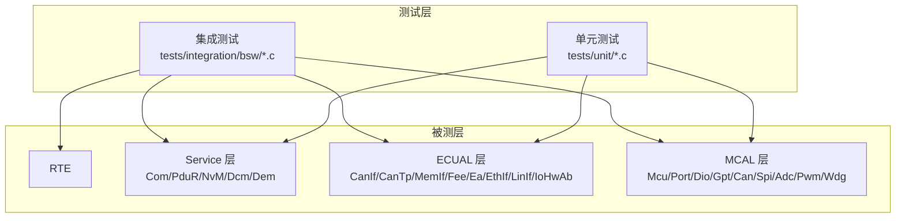

图示来源
- [README.md:48-84](file://README.md#L48-L84)
- [test_framework.h:123-138](file://tests/unit/test_framework.h#L123-L138)
- [integration_test.c:12-71](file://tests/integration/bsw/integration_test.c#L12-L71)

章节来源
- [README.md:48-84](file://README.md#L48-L84)
- [test_framework.h:123-138](file://tests/unit/test_framework.h#L123-L138)
- [integration_test.c:12-71](file://tests/integration/bsw/integration_test.c#L12-L71)

## 核心组件
- 测试框架（轻量级）
  - 提供断言宏（ASSERT_*）、测试套件声明、用例运行器与统计输出
  - 适合嵌入式环境，无动态分配，便于在目标板或主机上运行
- 单元测试用例
  - 每个模块均配套*_test.c，覆盖初始化、错误路径、边界条件、版本查询等
  - 通过Mock/Stub隔离外部依赖，确保测试稳定可靠
- 集成测试
  - 模拟真实OS调度、跨模块交互与典型业务场景（如CAN信号收发、诊断请求、模式切换等）

章节来源
- [test_framework.h:18-141](file://tests/unit/test_framework.h#L18-L141)
- [test_mcu.c:19-209](file://tests/unit/test_mcu.c#L19-L209)
- [Com_test.c:111-394](file://src/bsw/services/com/src/Com_test.c#L111-L394)
- [Dcm_test.c:135-274](file://src/bsw/services/dcm/src/Dcm_test.c#L135-L274)
- [Dem_test.c:88-328](file://src/bsw/services/dem/src/Dem_test.c#L88-L328)
- [BswM_test.c:116-314](file://tests/integration/bsw/BswM_test.c#L116-L314)
- [EcuM_test.c:304-521](file://tests/integration/bsw/EcuM_test.c#L304-L521)
- [integration_test.c:164-514](file://tests/integration/bsw/integration_test.c#L164-L514)

## 架构总览
下图展示典型TDD流程在YuleTech平台的落地：从需求/规范出发，编写最小失败测试，实现满足需求的最简代码，随后进行安全重构提升质量与可维护性。

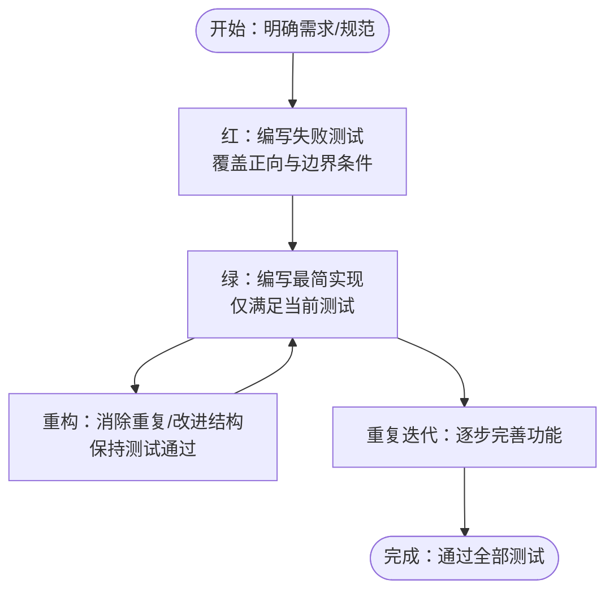

## 详细组件分析

### 测试框架与运行机制
- 断言与统计
  - 提供ASSERT_TRUE/FALSE、ASSERT_EQ/NE、ASSERT_NULL/NOT_NULL、ASSERT_STR_EQ等
  - 统计总数、通过数、失败数，失败时立即返回，避免后续误判
- 测试套件与运行器
  - TEST_SUITE/TEST_CASE_DECLARE/TEST_MAIN_BEGIN/TEST_MAIN_END构成标准模板
  - RUN_TEST按顺序执行，最终汇总结果并退出码指示整体成败

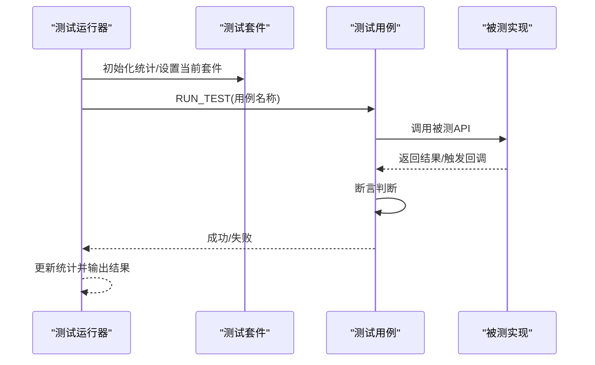

图示来源
- [test_framework.h:18-141](file://tests/unit/test_framework.h#L18-L141)

章节来源
- [test_framework.h:18-141](file://tests/unit/test_framework.h#L18-L141)

### 单元测试示例：MCU模块
- 关键点
  - 正向：传入有效配置，状态进入INIT
  - 边界/错误：传入NULL指针、未初始化调用、无效参数等
  - 版本查询：返回正确的厂商/版本号
- 断言与期望
  - 使用ASSERT_EQ/ASSERT_NE等比较返回值与内部状态
  - 对于错误输入，重点验证不崩溃且行为可预期

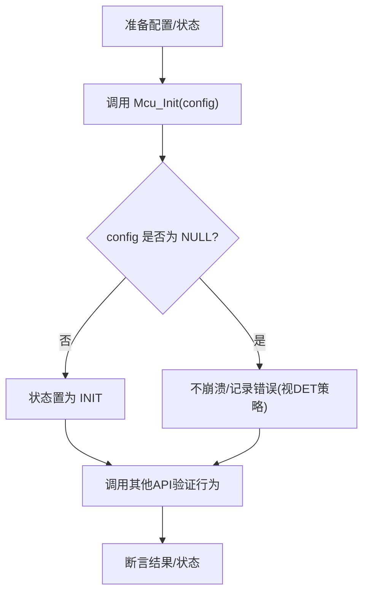

图示来源
- [test_mcu.c:19-96](file://tests/unit/test_mcu.c#L19-L96)

章节来源
- [test_mcu.c:19-209](file://tests/unit/test_mcu.c#L19-L209)

### 单元测试示例：Com模块（通信服务）
- 关键点
  - 初始化/反初始化：空配置报错、未初始化调用报错
  - 发送信号：触发PduR传输、信号ID越界报错
  - 接收信号：RxIndication后正确解包
  - 版本查询：返回正确版本信息
- 模拟对象
  - PduR_Transmit/PduR_GetVersionInfo等桩函数
  - DET错误上报跟踪

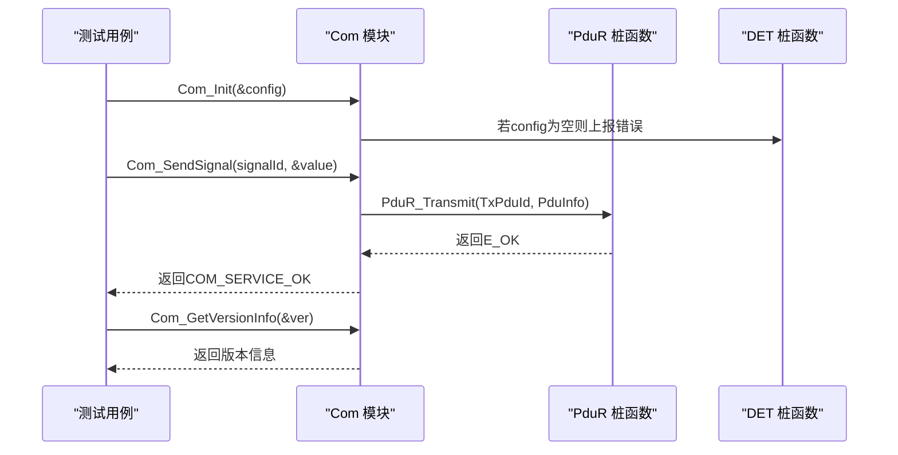

图示来源
- [Com_test.c:62-87](file://src/bsw/services/com/src/Com_test.c#L62-L87)
- [Com_test.c:111-182](file://src/bsw/services/com/src/Com_test.c#L111-L182)

章节来源
- [Com_test.c:111-394](file://src/bsw/services/com/src/Com_test.c#L111-L394)

### 单元测试示例：Dcm模块（诊断通信管理器）
- 关键点
  - 初始化/反初始化：空配置报错、未初始化调用报错
  - UDS服务：会话控制、读DID、TesterPresent
  - 版本查询：返回正确版本信息
- 模拟对象
  - PduR_Transmit/PduR_GetVersionInfo等桩函数
  - DID读取回调

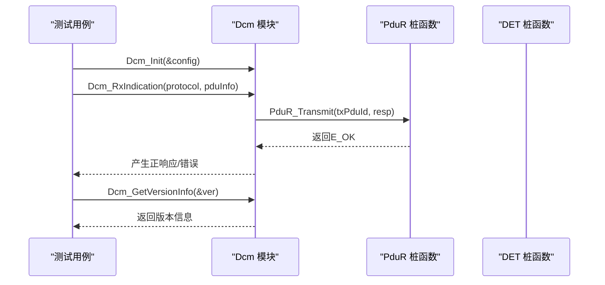

图示来源
- [Dcm_test.c:38-64](file://src/bsw/services/dcm/src/Dcm_test.c#L38-L64)
- [Dcm_test.c:135-194](file://src/bsw/services/dcm/src/Dcm_test.c#L135-L194)

章节来源
- [Dcm_test.c:135-274](file://src/bsw/services/dcm/src/Dcm_test.c#L135-L274)

### 单元测试示例：Dem模块（诊断事件管理器）
- 关键点
  - 初始化/反初始化：空配置报错、未初始化调用报错
  - 事件状态：Passed/Failed、预状态PREFAILED/PREPASSED
  - 故障计数器算法：达到阈值确认DTC
  - DTC清除：清除后状态清零
- 模拟对象
  - DET错误上报跟踪

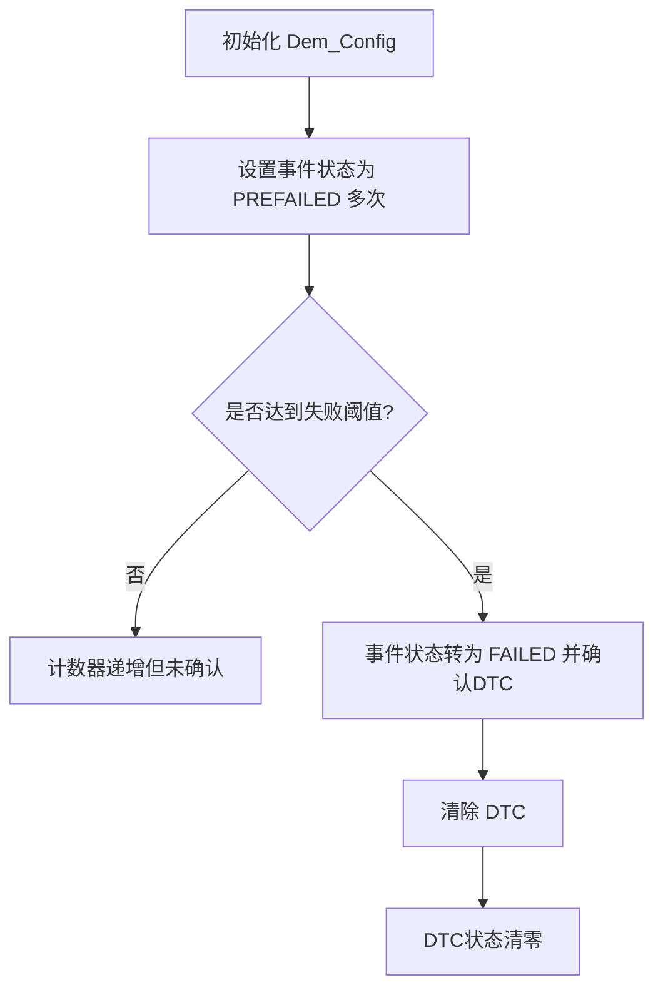

图示来源
- [Dem_test.c:154-214](file://src/bsw/services/dem/src/Dem_test.c#L154-L214)
- [Dem_test.c:216-272](file://src/bsw/services/dem/src/Dem_test.c#L216-L272)

章节来源
- [Dem_test.c:88-328](file://src/bsw/services/dem/src/Dem_test.c#L88-L328)

### 集成测试示例：EcuM（系统主控）
- 关键点
  - 生命周期：Init→StartupTwo→StartupThree→Shutdown，顺序严格
  - 各层初始化顺序：MCAL→ECUAL→Service→RTE
  - 反向析构顺序：Service→ECUAL→MCAL
  - 唤醒事件：设置/校验/清除
- 模拟对象
  - StartOS/ShutdownOS、各层Init/DeInit桩函数
  - 调用顺序追踪

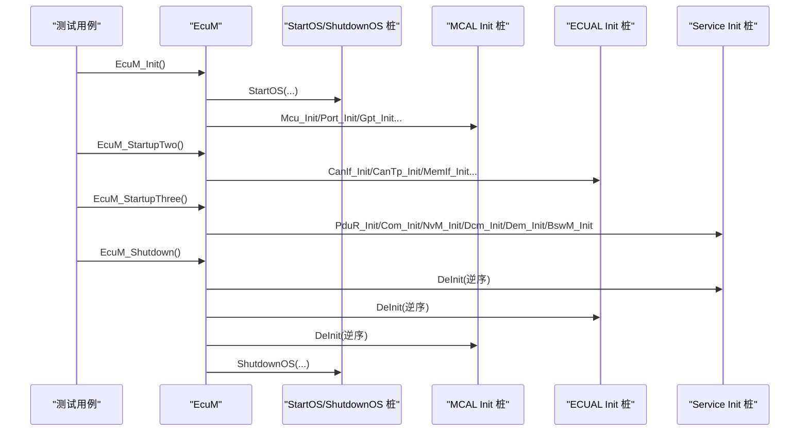

图示来源
- [EcuM_test.c:304-456](file://tests/integration/bsw/EcuM_test.c#L304-L456)

章节来源
- [EcuM_test.c:304-521](file://tests/integration/bsw/EcuM_test.c#L304-L521)

### 集成测试示例：BswM（基础软件模式管理）
- 关键点
  - 模式请求队列：RequestMode不立即生效，需在MainFunction中处理
  - 模式动作：RUN启用COM/PDU路由；SHUTDOWN禁用
  - 规则执行：根据条件函数执行真/假动作
  - 优先级仲裁：高优先用户请求覆盖低优先用户
- 模拟对象
  - Com_IpduGroupControl/PduR_EnableRouting/PduR_DisableRouting
  - DET错误上报

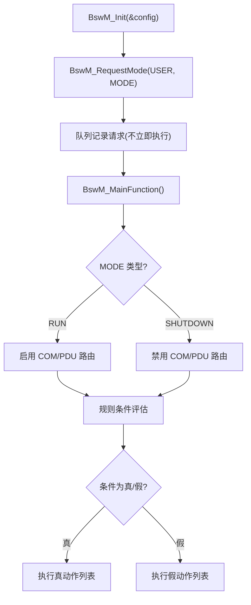

图示来源
- [BswM_test.c:139-218](file://tests/integration/bsw/BswM_test.c#L139-L218)

章节来源
- [BswM_test.c:116-314](file://tests/integration/bsw/BswM_test.c#L116-L314)

### 集成测试示例：跨层端到端（CAN信号收发）
- 关键点
  - MCAL：Can_Init/SetControllerMode
  - ECUAL：CanIf_Init/Transmit/RxIndication
  - Service：Com（发送/接收信号）
  - OS：定时器触发Can/CanIf主函数
- 配置与Mock
  - integration_test_cfg.h定义测试专用配置
  - integration_test.c提供大量Mock/Stub与配置数组

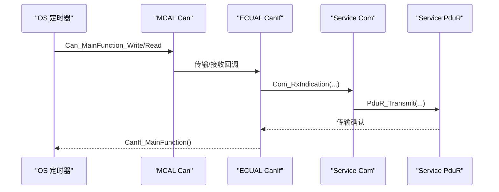

图示来源
- [integration_test.c:177-235](file://tests/integration/bsw/integration_test.c#L177-L235)
- [integration_test.c:456-514](file://tests/integration/bsw/integration_test.c#L456-L514)
- [integration_test_cfg.h:24-88](file://tests/integration/integration_test_cfg.h#L24-L88)

章节来源
- [integration_test.c:177-235](file://tests/integration/bsw/integration_test.c#L177-L235)
- [integration_test.c:456-514](file://tests/integration/bsw/integration_test.c#L456-L514)
- [integration_test_cfg.h:24-88](file://tests/integration/integration_test_cfg.h#L24-L88)

## 依赖关系分析
- 测试对实现的耦合
  - 单元测试通过Mock/Stub隔离外部依赖，降低耦合度
  - 集成测试直接链接真实模块，验证跨层协作
- 断言与错误处理
  - 通过DET桩函数统一追踪错误上报，便于定位问题
- 主循环与调度
  - 集成测试通过OS定时器驱动各模块主函数，模拟真实运行时

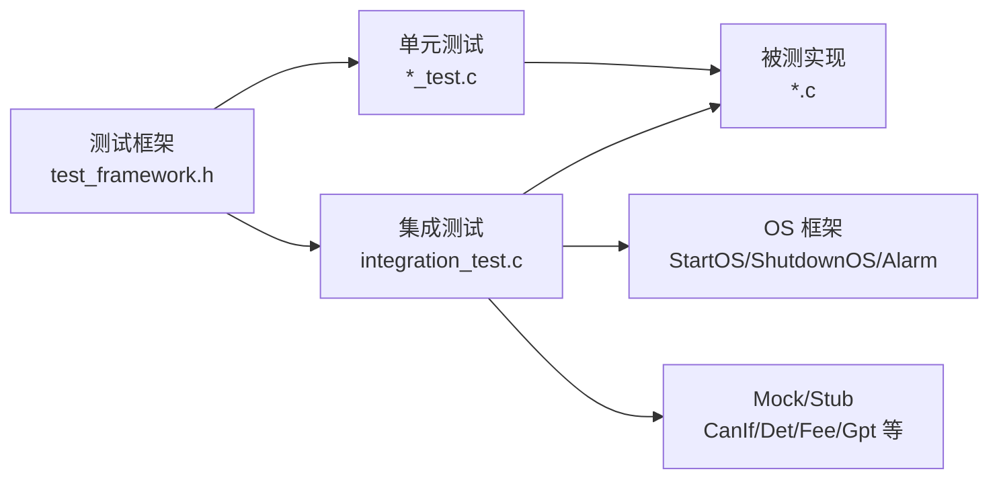

图示来源
- [test_framework.h:123-138](file://tests/unit/test_framework.h#L123-L138)
- [integration_test.c:164-514](file://tests/integration/bsw/integration_test.c#L164-L514)

章节来源
- [test_framework.h:123-138](file://tests/unit/test_framework.h#L123-L138)
- [integration_test.c:164-514](file://tests/integration/bsw/integration_test.c#L164-L514)

## 性能考量
- 断言与打印
  - 测试框架使用printf输出，建议在发布版本关闭冗余日志
- 模拟对象规模
  - 集成测试配置可通过integration_test_cfg.h裁剪，减少内存占用
- 主函数频率
  - OS定时器频率影响测试稳定性，应与被测模块主函数周期匹配

章节来源
- [integration_test_cfg.h:24-88](file://tests/integration/integration_test_cfg.h#L24-L88)
- [integration_test.c:493-514](file://tests/integration/bsw/integration_test.c#L493-L514)

## 故障排查指南
- 如何解读测试失败
  - 查看失败用例的断言信息（例如期望值与实际值）
  - 结合DET错误上报定位错误原因（模块ID、API ID、错误ID）
- 常见问题与解决
  - 未初始化调用：确保按顺序调用Init/Startup系列函数
  - 参数非法：检查指针非空、ID有效、状态合法
  - 未触发回调：确认OS定时器已驱动主函数，或手动触发
  - 内存不足：减小集成测试配置规模或关闭调试输出

章节来源
- [Com_test.c:122-133](file://src/bsw/services/com/src/Com_test.c#L122-L133)
- [Dcm_test.c:220-237](file://src/bsw/services/dcm/src/Dcm_test.c#L220-L237)
- [Dem_test.c:274-288](file://src/bsw/services/dem/src/Dem_test.c#L274-L288)
- [BswM_test.c:220-242](file://tests/integration/bsw/BswM_test.c#L220-L242)
- [EcuM_test.c:416-456](file://tests/integration/bsw/EcuM_test.c#L416-L456)

## 结论
YuleTech AutoSAR BSW平台提供了完善的TDD基础设施：自研轻量测试框架、丰富的单模块单元测试与跨层集成测试。遵循“红-绿-重构”流程，可在嵌入式环境下高效、安全地交付高质量代码。建议在新功能开发中坚持先写测试、再写实现、持续重构的原则，并充分利用Mock/Stub隔离外部依赖，确保测试稳定与可维护。

## 附录
- 示例：CAN通信演示
  - 展示MCAL/ECUAL/Service协同工作，可作为TDD场景的参考实现
- 集成测试运行器
  - test_runner.c集中注册并运行跨层测试用例

章节来源
- [main.c:63-118](file://examples/can_demo/main.c#L63-L118)
- [test_runner.c:27-39](file://tests/integration/bsw/test_runner.c#L27-L39)