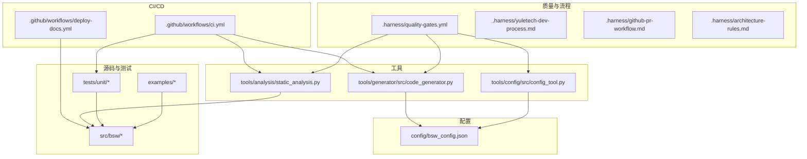
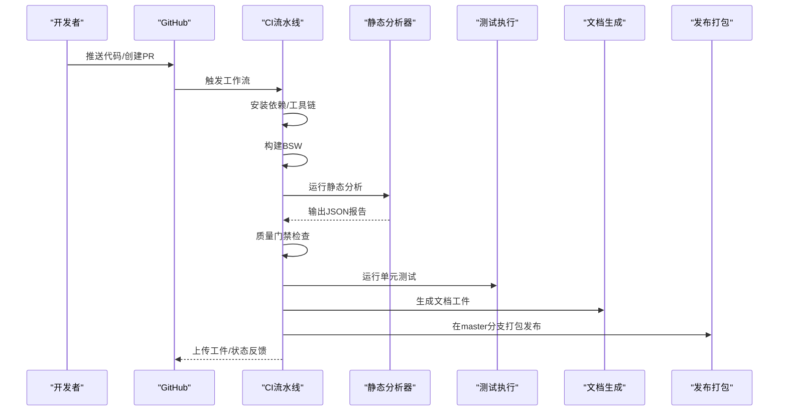
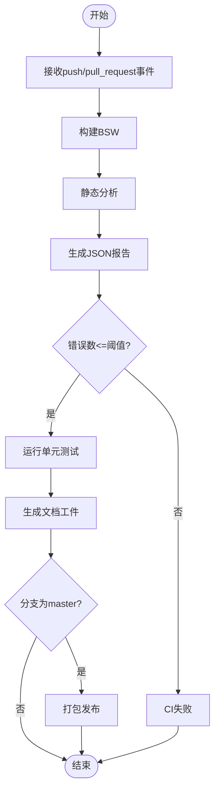
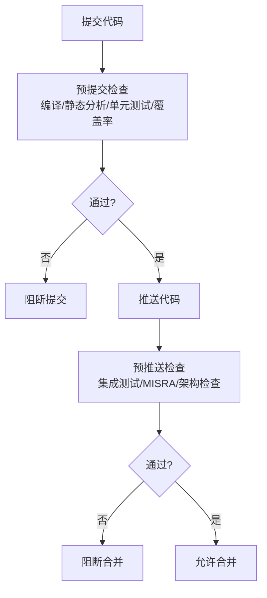
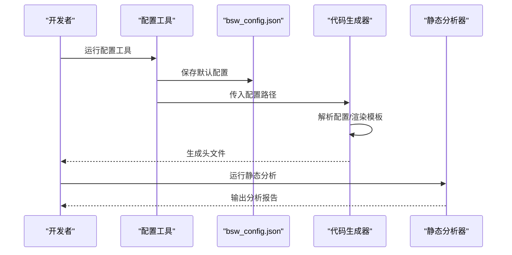
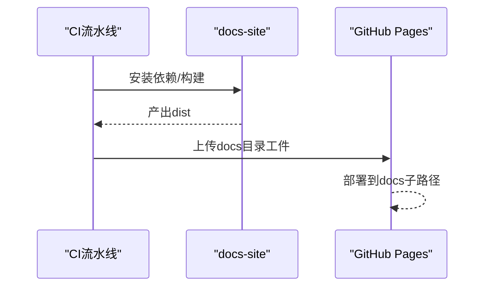
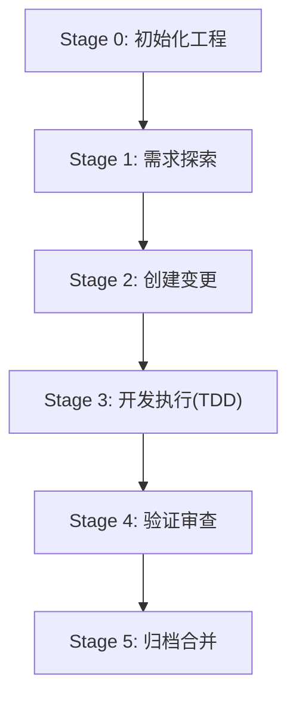
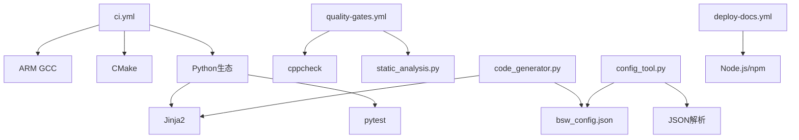

# 开发工作流自动化

<cite>
**本文引用的文件**
- [ci.yml](file://.github/workflows/ci.yml)
- [deploy-docs.yml](file://.github/workflows/deploy-docs.yml)
- [quality-gates.yml](file://.harness/quality-gates.yml)
- [yuletech-complete-workflow.md](file://.harness/yuletech-complete-workflow.md)
- [github-pr-workflow.md](file://.harness/github-pr-workflow.md)
- [autosar-bsw-development.md](file://.harness/autosar-bsw-development.md)
- [architecture-rules.md](file://.harness/architecture-rules.md)
- [yuletech-dev-process.md](file://.harness/yuletech-dev-process.md)
- [static_analysis.py](file://tools/analysis/static_analysis.py)
- [code_generator.py](file://tools/generator/src/code_generator.py)
- [config_tool.py](file://tools/config/src/config_tool.py)
- [bsw_config.json](file://config/bsw_config.json)
- [README.md](file://README.md)
- [test_mcu.c](file://tests/unit/test_mcu.c)
- [main.c (CAN示例)](file://examples/can_demo/main.c)
- [main.c (LED闪烁示例)](file://examples/led_blink/main.c)
</cite>

## 目录
1. [引言](#引言)
2. [项目结构](#项目结构)
3. [核心组件](#核心组件)
4. [架构总览](#架构总览)
5. [详细组件分析](#详细组件分析)
6. [依赖分析](#依赖分析)
7. [性能考虑](#性能考虑)
8. [故障排除指南](#故障排除指南)
9. [结论](#结论)
10. [附录](#附录)

## 引言
本文件面向YuleTech AutoSAR BSW平台的开发团队，系统化阐述基于Superpowers开发工具链的“开发工作流自动化”方案。内容涵盖：
- 自动化代码生成与配置验证
- 构建管理与测试执行
- GitHub Actions CI/CD流水线配置与使用
- 质量门禁与监控
- 分支管理、提交规范、代码审查与发布管理最佳实践

目标是帮助团队在保证AutoSAR合规与代码质量的前提下，提升开发效率、缩短交付周期，并确保项目长期可维护性。

## 项目结构
项目采用分层组织方式，围绕AutoSAR Classic Platform 4.x标准构建，包含规范、设计、源码、工具与文档等模块。关键目录与职责如下：
- .github/workflows：CI/CD流水线定义
- .harness：开发流程与质量规则约束
- config：运行时配置与生成器输入
- tools：代码生成、配置验证与静态分析工具
- src：按层划分的BSW实现（MCAL、ECUAL、Service、RTE、Common）
- tests：单元测试框架与用例
- examples：最小可运行示例
- docs/docs-site：文档站点与静态页面

**图表来源**
- [ci.yml:1-144](file://.github/workflows/ci.yml#L1-L144)
- [deploy-docs.yml:1-22](file://.github/workflows/deploy-docs.yml#L1-L22)
- [quality-gates.yml:1-274](file://.harness/quality-gates.yml#L1-L274)
- [code_generator.py:1-176](file://tools/generator/src/code_generator.py#L1-L176)
- [config_tool.py:1-158](file://tools/config/src/config_tool.py#L1-L158)
- [static_analysis.py:1-379](file://tools/analysis/static_analysis.py#L1-L379)

**章节来源**
- [README.md:153-199](file://README.md#L153-L199)

## 核心组件
- CI/CD流水线
  - 构建阶段：安装ARM GCC、使用CMake与工具链构建BSW
  - 静态分析：运行自研静态分析工具，生成JSON报告并上传
  - 质量门禁：根据报告中的错误数量判定是否通过
  - 单元测试：编译并执行单元测试用例
  - 文档生成：统计代码行数、生成模块清单并上传工件
  - 发布打包：在master分支创建压缩包工件
- 质量门禁
  - 静态分析（cppcheck）、MISRA C:2012、复杂度、代码风格、安全检查、架构检查、覆盖率阈值、文档检查
  - 提交门禁：预提交与预推送检查命令
- 开发工具链
  - 代码生成器：基于Jinja2模板与配置生成头文件
  - 配置工具：加载/保存/验证配置，生成默认配置
  - 静态分析器：MISRA规则、圈复杂度、代码风格检查
- 文档站点
  - 使用Node.js与npm构建文档站点并部署至GitHub Pages

**章节来源**
- [ci.yml:1-144](file://.github/workflows/ci.yml#L1-L144)
- [quality-gates.yml:1-274](file://.harness/quality-gates.yml#L1-L274)
- [code_generator.py:1-176](file://tools/generator/src/code_generator.py#L1-L176)
- [config_tool.py:1-158](file://tools/config/src/config_tool.py#L1-L158)
- [static_analysis.py:1-379](file://tools/analysis/static_analysis.py#L1-L379)
- [deploy-docs.yml:1-22](file://.github/workflows/deploy-docs.yml#L1-L22)

## 架构总览
下图展示从代码提交到产物发布的整体流程，以及质量门禁在各阶段的触发点。

**图表来源**
- [ci.yml:1-144](file://.github/workflows/ci.yml#L1-L144)
- [static_analysis.py:302-322](file://tools/analysis/static_analysis.py#L302-L322)

## 详细组件分析

### CI/CD流水线（GitHub Actions）
- 触发条件
  - push到master/develop；pull_request到master
- 作业分工
  - build：安装ARM GCC、CMake配置与构建
  - test：安装pytest、编译单元测试、执行配置/生成器测试
  - documentation：统计LOC、生成模块清单、上传docs工件
  - release：在master分支创建tar.gz发布包并上传工件
- 质量门禁
  - 读取静态分析报告，统计错误数并判定是否通过

**图表来源**
- [ci.yml:1-144](file://.github/workflows/ci.yml#L1-L144)

**章节来源**
- [ci.yml:1-144](file://.github/workflows/ci.yml#L1-L144)

### 质量门禁配置（Harness）
- 静态分析：启用cppcheck，包含style/performance/portability/information/unusedFunction/missingInclude等规则
- MISRA C:2012：必遵守与建议遵守规则清单，违规即阻断
- 复杂度：圈复杂度、函数/文件行数、参数数量、嵌套深度上限与预警
- 代码风格：命名规范、格式化、注释要求
- 安全检查：缓冲区溢出、空指针、整数溢出、use-after-free、格式化字符串等
- 架构检查：分层依赖、禁止循环依赖、接口使用、禁止直接硬件访问
- 文档检查：文件头、函数/类型/宏注释要求
- 提交门禁：预提交/预推送检查命令（编译、静态分析、单元测试、覆盖率）
- 忽略模式：第三方、生成物、测试桩、模板文件与特定关键字

**图表来源**
- [quality-gates.yml:212-241](file://.harness/quality-gates.yml#L212-L241)

**章节来源**
- [quality-gates.yml:1-274](file://.harness/quality-gates.yml#L1-L274)

### 代码生成与配置验证
- 配置工具
  - 加载/保存/验证配置，支持Mcu/Can等模块参数
  - 默认生成bsw_config.json并进行有效性校验
- 代码生成器
  - 基于Jinja2模板与配置生成头文件（如Mcu_Cfg.h、Can_Cfg.h）
  - 支持多模块批量生成，输出带版本信息与版权头
- 静态分析器
  - MISRA规则匹配、圈复杂度统计、代码风格检查
  - 生成汇总报告（问题总数、错误/警告/提示分布、复杂度指标）

**图表来源**
- [config_tool.py:56-123](file://tools/config/src/config_tool.py#L56-L123)
- [code_generator.py:67-152](file://tools/generator/src/code_generator.py#L67-L152)
- [static_analysis.py:100-131](file://tools/analysis/static_analysis.py#L100-L131)

**章节来源**
- [config_tool.py:1-158](file://tools/config/src/config_tool.py#L1-L158)
- [code_generator.py:1-176](file://tools/generator/src/code_generator.py#L1-L176)
- [static_analysis.py:1-379](file://tools/analysis/static_analysis.py#L1-L379)
- [bsw_config.json:1-21](file://config/bsw_config.json#L1-L21)

### 文档站点与发布
- 使用Node.js与npm安装依赖并构建
- 将构建产物部署到GitHub Pages的docs目录
- 与CI流水线配合，实现文档的自动化生成与发布

**图表来源**
- [deploy-docs.yml:1-22](file://.github/workflows/deploy-docs.yml#L1-L22)

**章节来源**
- [deploy-docs.yml:1-22](file://.github/workflows/deploy-docs.yml#L1-L22)

### 开发工作流与最佳实践
- 开发流程（OpenSpec + Superpowers + Harness）
  - 需求探索、创建变更、开发执行（TDD）、验证审查、归档合并
- Git工作流
  - 分支策略：master（稳定）、feature/*、fix/*
  - 提交规范：feat/fix/docs/style/refactor/test/chore
  - PR流程：创建分支、推送、创建PR、代码审查、合并
- 代码规范与架构约束
  - AutoSAR命名与类型、错误检测、内存分区、注释规范
  - 分层架构、接口使用、禁止循环依赖、直接硬件访问
- 示例与验证
  - 示例程序展示MCAL/ECUAL组合使用
  - 单元测试覆盖初始化、错误处理、边界条件等

**图表来源**
- [yuletech-dev-process.md:41-99](file://.harness/yuletech-dev-process.md#L41-L99)

**章节来源**
- [yuletech-dev-process.md:1-223](file://.harness/yuletech-dev-process.md#L1-L223)
- [github-pr-workflow.md:1-223](file://.harness/github-pr-workflow.md#L1-L223)
- [autosar-bsw-development.md:1-241](file://.harness/autosar-bsw-development.md#L1-L241)
- [architecture-rules.md:1-255](file://.harness/architecture-rules.md#L1-L255)

## 依赖分析
- 组件耦合
  - CI流水线依赖工具链与Python生态（Jinja2、pytest）
  - 质量门禁依赖cppcheck与自研静态分析器
  - 代码生成器依赖Jinja2与配置文件
  - 配置工具依赖JSON解析与数据类
- 外部依赖
  - ARM GCC、CMake、Node.js/npm
  - GitHub Actions Runner环境

**图表来源**
- [ci.yml:16-36](file://.github/workflows/ci.yml#L16-L36)
- [quality-gates.yml:7-40](file://.harness/quality-gates.yml#L7-L40)
- [code_generator.py:10-12](file://tools/generator/src/code_generator.py#L10-L12)
- [config_tool.py:8-12](file://tools/config/src/config_tool.py#L8-L12)
- [deploy-docs.yml:10-16](file://.github/workflows/deploy-docs.yml#L10-L16)

**章节来源**
- [ci.yml:1-144](file://.github/workflows/ci.yml#L1-L144)
- [quality-gates.yml:1-274](file://.harness/quality-gates.yml#L1-L274)
- [code_generator.py:1-176](file://tools/generator/src/code_generator.py#L1-L176)
- [config_tool.py:1-158](file://tools/config/src/config_tool.py#L1-L158)
- [deploy-docs.yml:1-22](file://.github/workflows/deploy-docs.yml#L1-L22)

## 性能考虑
- 构建性能
  - 使用并行编译（make -j$(nproc)）与缓存工具链
  - 避免重复安装依赖，复用Runner环境
- 分析性能
  - 静态分析范围限定在非工具/非生成目录
  - 复杂度阈值与行数限制减少长函数带来的分析成本
- 测试性能
  - 单元测试独立编译，避免不必要的链接
  - 使用最小化测试用例覆盖关键路径

## 故障排除指南
- CI构建失败
  - 检查ARM GCC安装与CMake工具链配置
  - 确认依赖安装步骤（pip/jinja2、apt包）
- 静态分析报告异常
  - 确认分析器对源码编码与忽略路径的处理
  - 对比质量门禁阈值，定位超限规则
- 单元测试失败
  - 使用示例程序验证基本API可用性
  - 检查测试用例与被测模块的接口一致性
- 文档站点构建失败
  - 确认Node.js版本与npm依赖安装
  - 检查构建脚本与输出目录

**章节来源**
- [ci.yml:26-36](file://.github/workflows/ci.yml#L26-L36)
- [static_analysis.py:247-252](file://tools/analysis/static_analysis.py#L247-L252)
- [test_mcu.c:19-34](file://tests/unit/test_mcu.c#L19-L34)
- [deploy-docs.yml:15-16](file://.github/workflows/deploy-docs.yml#L15-L16)

## 结论
通过将Superpowers开发工具链与GitHub Actions流水线深度融合，YuleTech AutoSAR BSW平台实现了从代码生成、配置验证、构建管理到测试与文档发布的全流程自动化。结合Harness质量门禁与架构约束，项目在保证AutoSAR合规与代码质量的同时，显著提升了开发效率与交付稳定性。建议持续优化分析阈值与测试覆盖率，完善示例与文档，以进一步增强团队协作与外部贡献体验。

## 附录
- 示例程序
  - CAN通信演示：展示Can/CanIf/Com/PduR协同工作
  - LED闪烁演示：展示Dio/Gpt驱动使用
- 关键命令参考
  - 构建：CMake配置与并行编译
  - 测试：单元测试与报告生成
  - 文档：站点构建与部署

**章节来源**
- [main.c (CAN示例):1-119](file://examples/can_demo/main.c#L1-L119)
- [main.c (LED闪烁示例):1-100](file://examples/led_blink/main.c#L1-L100)
- [README.md:111-132](file://README.md#L111-L132)