# 开发流程

<cite>
**本文引用的文件**
- [README.md](file://README.md)
- [开发指南.md](file://docs/development-guide.md)
- [yuletech-dev-process.md](file://.harness/yuletech-dev-process.md)
- [autosar-bsw-development.md](file://.harness/autosar-bsw-development.md)
- [architecture-rules.md](file://.harness/architecture-rules.md)
- [quality-gates.yml](file://.harness/quality-gates.yml)
- [github-pr-workflow.md](file://.harness/github-pr-workflow.md)
- [ci.yml](file://.github/workflows/ci.yml)
- [deploy-docs.yml](file://.github/workflows/deploy-docs.yml)
- [Com.h](file://src/bsw/services/com/include/Com.h)
- [Com.c](file://src/bsw/services/com/src/Com.c)
- [rte_generator.py](file://tools/rte_generator/rte_generator.py)
- [init-core-bsw 任务清单](file://openspec/changes/init-core-bsw/tasks.md)
- [Service 层变更提案](file://openspec/changes/init-service-layer/proposal.md)
- [Yule BSW 规范](file://openspec/specs/bsw/spec.md)
- [Yule Toolchain 规范](file://openspec/specs/toolchain/spec.md)
</cite>

## 目录
1. [简介](#简介)
2. [项目结构](#项目结构)
3. [核心组件](#核心组件)
4. [架构总览](#架构总览)
5. [详细组件分析](#详细组件分析)
6. [依赖分析](#依赖分析)
7. [性能考虑](#性能考虑)
8. [故障排查指南](#故障排查指南)
9. [结论](#结论)
10. [附录](#附录)

## 简介
本文件面向 YuleTech AutoSAR BSW 平台的开发者，系统化阐述“OpenSpec + Superpowers + Harness Engineering”三重开发模式下的完整开发流程。从需求探索、OpenSpec 规范编写、模块创建与 TDD 红-绿-重构，到验证审查与归档合并，提供可落地的方法论、工具链与最佳实践，帮助团队高效、高质量地交付 AutoSAR Classic Platform 4.x 基础软件。

## 项目结构
YuleTech BSW 采用分层架构与模块化组织，核心目录与职责如下：
- .harness：定义开发流程、质量门禁与约束规则（Skill 与 YAML）
- openspec：规范真相源，包含系统规范与变更提案、任务拆解
- src/bsw：按层组织的 C 实现，包含 MCAL、ECUAL、Service、RTE、OS、common 等
- tools：代码生成、RTE 生成器、分析工具等
- docs：项目文档与开发指南
- .github/workflows：CI/CD 流水线与文档部署

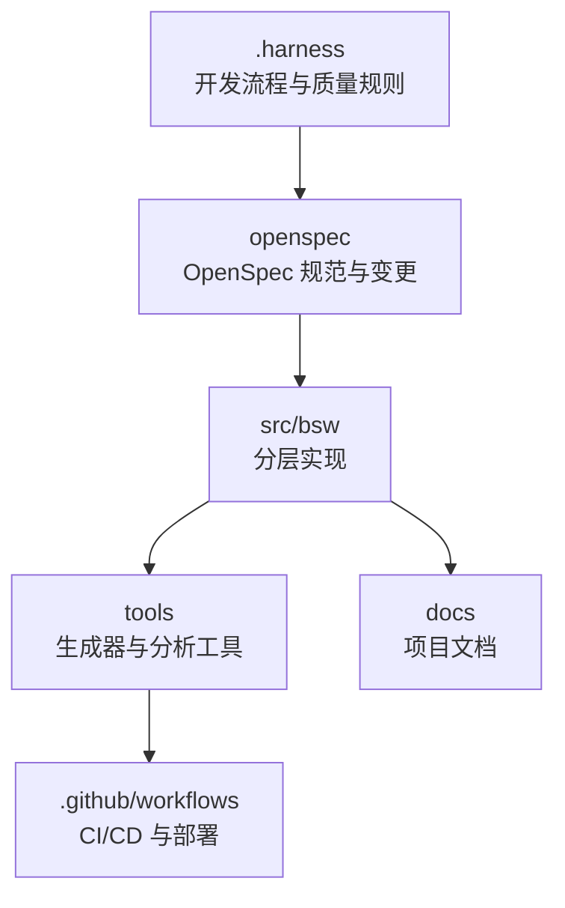

图表来源
- [README.md:153-199](file://README.md#L153-L199)
- [.harness/yuletech-dev-process.md:41-100](file://.harness/yuletech-dev-process.md#L41-L100)

章节来源
- [README.md:153-199](file://README.md#L153-L199)
- [开发指南.md:17-81](file://docs/development-guide.md#L17-L81)

## 核心组件
- OpenSpec 规范与变更管理：以 Gherkin 场景描述需求，形成可验证的行为规范；变更目录包含 proposal、specs、design、tasks。
- Harness 工程约束：定义分层架构规则、命名规范、代码质量与安全规则、测试与工具链规则、质量门禁。
- Superpowers 工具链：代码生成器、RTE 生成器、配置工具、构建与测试流水线，支撑从配置到可运行代码的自动化。

章节来源
- [yuletech-dev-process.md:14-40](file://.harness/yuletech-dev-process.md#L14-L40)
- [architecture-rules.md:5-46](file://.harness/architecture-rules.md#L5-L46)
- [quality-gates.yml:6-117](file://.harness/quality-gates.yml#L6-L117)

## 架构总览
YuleTech BSW 严格遵循 AutoSAR Classic Platform 4.x 分层架构，从应用层到硬件逐层抽象与实现：

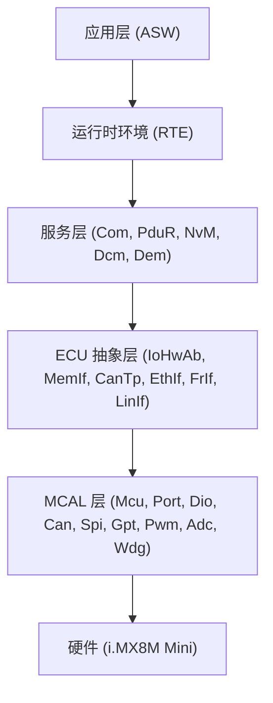

图表来源
- [Yule BSW 规范:13-47](file://openspec/specs/bsw/spec.md#L13-L47)
- [开发指南.md:84-140](file://docs/development-guide.md#L84-L140)

章节来源
- [Yule BSW 规范:13-47](file://openspec/specs/bsw/spec.md#L13-L47)
- [开发指南.md:84-140](file://docs/development-guide.md#L84-L140)

## 详细组件分析

### 1) OpenSpec 规范编写与变更管理
- 变更提案（Proposal）：明确背景、目标、范围与验收标准，如 Service 层初始化提案。
- 规范（Specs）：使用 Gherkin 场景描述功能行为，确保可测试与可验证。
- 设计（Design）：模块架构图、接口定义、数据结构与状态机。
- 任务（Tasks）：将规范转化为可执行的任务清单，包含阶段、里程碑与进度跟踪。

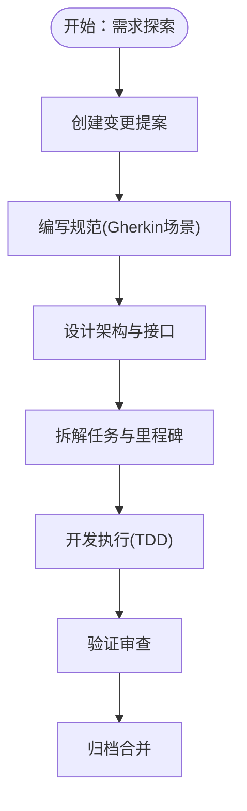

图表来源
- [yuletech-dev-process.md:59-71](file://.harness/yuletech-dev-process.md#L59-L71)
- [Service 层变更提案:1-32](file://openspec/changes/init-service-layer/proposal.md#L1-L32)
- [init-core-bsw 任务清单:1-40](file://openspec/changes/init-core-bsw/tasks.md#L1-L40)

章节来源
- [yuletech-dev-process.md:59-71](file://.harness/yuletech-dev-process.md#L59-L71)
- [Service 层变更提案:1-32](file://openspec/changes/init-service-layer/proposal.md#L1-L32)
- [init-core-bsw 任务清单:1-40](file://openspec/changes/init-core-bsw/tasks.md#L1-L40)

### 2) TDD 红-绿-重构实践
- 红：编写失败的测试，明确期望行为。
- 绿：实现最小功能使测试通过。
- 重构：优化代码结构，保持测试通过。
- 在 Service 层模块（如 Com）中，结合 DET 错误检测与内存分区模板，确保代码质量与可维护性。

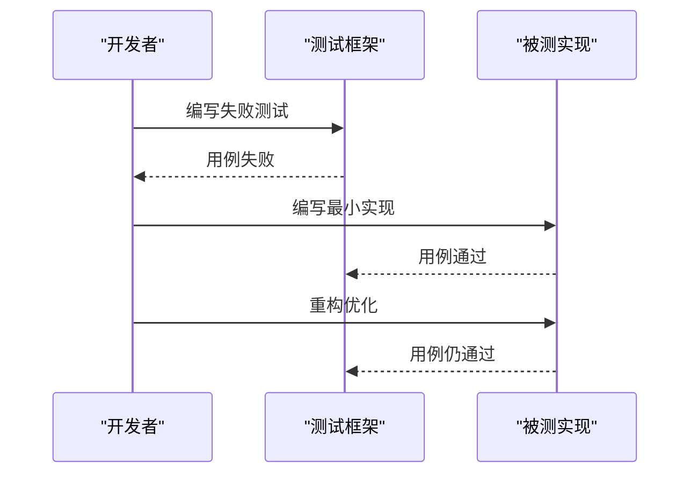

图表来源
- [开发指南.md:404-427](file://docs/development-guide.md#L404-L427)
- [Com.c:405-473](file://src/bsw/services/com/src/Com.c#L405-L473)

章节来源
- [开发指南.md:404-427](file://docs/development-guide.md#L404-L427)
- [Com.c:405-473](file://src/bsw/services/com/src/Com.c#L405-L473)

### 3) 模块创建流程（以 Service 层为例）
- 目录结构：include 与 src 分离，配置头文件 Module_Cfg.h。
- 文件清单：头文件、配置文件、实现文件、MemMap 分区、DET 错误检测、单元测试、CMake 集成。
- 接口与实现：遵循 AutoSAR 标准类型与命名规范，提供初始化、反初始化、核心功能与回调接口。

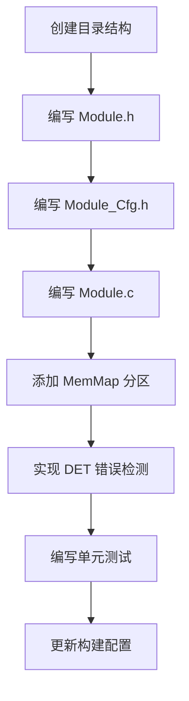

图表来源
- [开发指南.md:339-362](file://docs/development-guide.md#L339-L362)
- [Com.h:14-508](file://src/bsw/services/com/include/Com.h#L14-L508)

章节来源
- [开发指南.md:339-362](file://docs/development-guide.md#L339-L362)
- [Com.h:14-508](file://src/bsw/services/com/include/Com.h#L14-L508)

### 4) OpenSpec 规范示例与验证
- Yule BSW 规范：定义分层架构、模块接口与场景，作为 Service 层实现的权威依据。
- Toolchain 规范：定义配置工具、代码生成器、构建与调试工具的职责与接口，支撑端到端开发闭环。

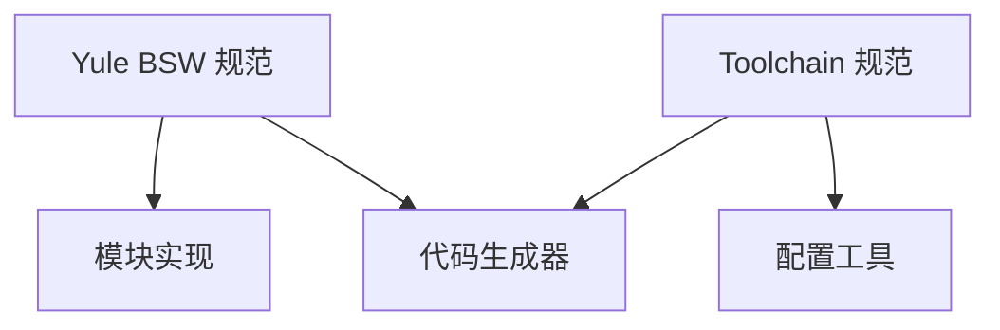

图表来源
- [Yule BSW 规范:11-47](file://openspec/specs/bsw/spec.md#L11-L47)
- [Yule Toolchain 规范:11-31](file://openspec/specs/toolchain/spec.md#L11-L31)

章节来源
- [Yule BSW 规范:11-47](file://openspec/specs/bsw/spec.md#L11-L47)
- [Yule Toolchain 规范:11-31](file://openspec/specs/toolchain/spec.md#L11-L31)

### 5) 验证与审查流程
- 功能验证：初始化、反初始化、核心功能、错误处理、边界条件。
- 代码质量：命名规范、代码结构、注释、错误检测、内存分区。
- 接口兼容性：头文件兼容、下层模块兼容、上层模块兼容。
- 质量门禁：静态分析、MISRA C:2012、复杂度、测试覆盖率、安全检查、架构检查。

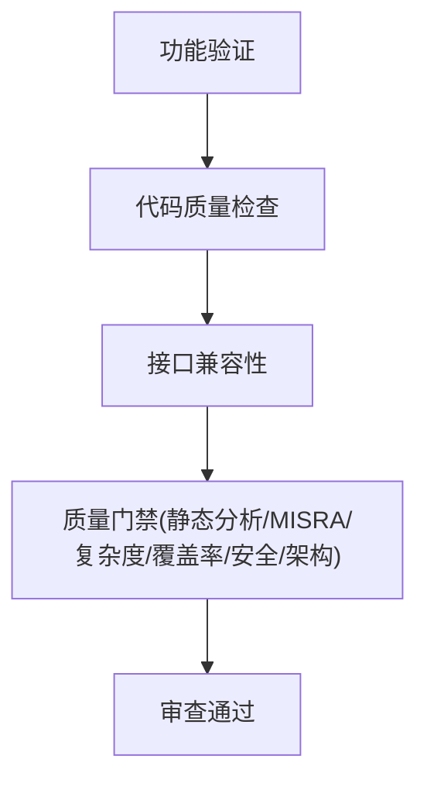

图表来源
- [autosar-bsw-development.md:211-231](file://.harness/autosar-bsw-development.md#L211-L231)
- [quality-gates.yml:6-274](file://.harness/quality-gates.yml#L6-L274)

章节来源
- [autosar-bsw-development.md:211-231](file://.harness/autosar-bsw-development.md#L211-L231)
- [quality-gates.yml:6-274](file://.harness/quality-gates.yml#L6-L274)

### 6) 归档与合并（OpenSpec 规范归档）
- 将通过验证的规范合并至 openspec/specs/，变更移动至 openspec/archived/。
- Git 合并到主分支，保持规范与实现的同步演进。

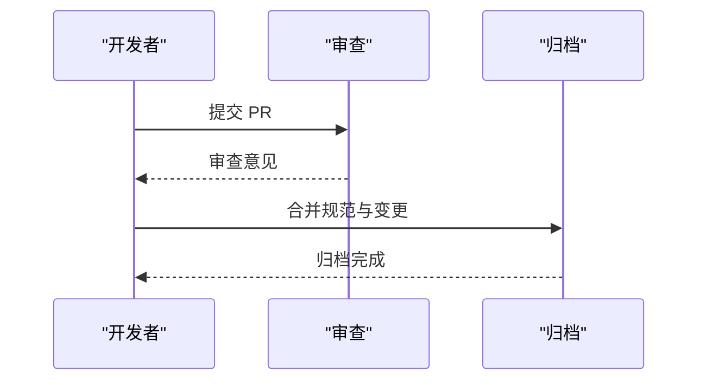

图表来源
- [yuletech-dev-process.md:92-99](file://.harness/yuletech-dev-process.md#L92-L99)
- [autosar-bsw-development.md:130-137](file://.harness/autosar-bsw-development.md#L130-L137)

章节来源
- [yuletech-dev-process.md:92-99](file://.harness/yuletech-dev-process.md#L92-L99)
- [autosar-bsw-development.md:130-137](file://.harness/autosar-bsw-development.md#L130-L137)

### 7) 工具链与 CI/CD
- 代码生成器：根据 ARXML/JSON 配置生成 C 头文件与源文件，支持增量生成与验证。
- 构建与测试：CMake 构建、GCC ARM 工具链、单元测试、覆盖率生成。
- CI/CD：GitHub Actions 执行构建、静态分析、测试与文档生成，支持发布包打包与文档部署。

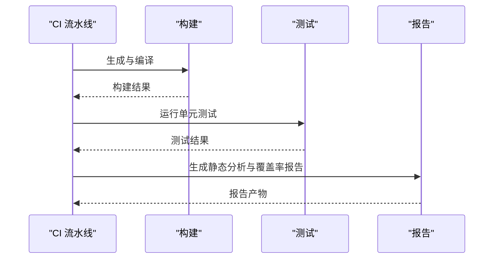

图表来源
- [ci.yml:10-144](file://.github/workflows/ci.yml#L10-L144)
- [deploy-docs.yml:1-22](file://.github/workflows/deploy-docs.yml#L1-L22)
- [rte_generator.py:674-701](file://tools/rte_generator/rte_generator.py#L674-L701)

章节来源
- [ci.yml:10-144](file://.github/workflows/ci.yml#L10-L144)
- [deploy-docs.yml:1-22](file://.github/workflows/deploy-docs.yml#L1-L22)
- [rte_generator.py:674-701](file://tools/rte_generator/rte_generator.py#L674-L701)

## 依赖分析
- 分层依赖规则：上层可依赖下层，禁止下层依赖上层，禁止同层跨模块依赖，依赖必须通过标准接口，禁止循环依赖。
- 接口与实现：模块通过标准头文件与 API 接口交互，避免直接硬件访问与跨层耦合。
- 质量门禁：静态分析、MISRA、复杂度、测试覆盖率、安全与架构检查共同保障代码质量。

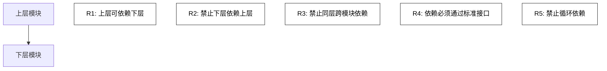

图表来源
- [architecture-rules.md:25-46](file://.harness/architecture-rules.md#L25-L46)
- [quality-gates.yml:171-191](file://.harness/quality-gates.yml#L171-L191)

章节来源
- [architecture-rules.md:25-46](file://.harness/architecture-rules.md#L25-L46)
- [quality-gates.yml:171-191](file://.harness/quality-gates.yml#L171-L191)

## 性能考虑
- 复杂度控制：函数圈复杂度 < 10，函数行数 < 50，文件行数 < 500，参数数量 < 5，嵌套深度 < 4。
- 测试覆盖率：MCAL > 90%，Service > 85%，Utility > 80%（语句/分支/函数覆盖率）。
- 工具链性能：ARXML 解析 < 2s，代码生成 < 5s，配置界面加载 < 1s，编译构建与原生 make 相当。
- 安全与可靠性：MISRA C:2012 检查、零静态分析警告、防御式编程、指针与数组边界检查。

章节来源
- [architecture-rules.md:49-58](file://.harness/architecture-rules.md#L49-L58)
- [quality-gates.yml:75-145](file://.harness/quality-gates.yml#L75-L145)
- [Yule Toolchain 规范:384-406](file://openspec/specs/toolchain/spec.md#L384-L406)

## 故障排查指南
- 提交前检查：编译 0 错误/警告、通过静态分析、MISRA 检查、单元测试、覆盖率达标、代码审查通过、文档更新。
- 代码审查检查：符合分层架构、命名规范、错误处理、注释、复杂度、无安全漏洞。
- GitHub PR 工作流：分支创建、推送、PR 创建与合并、审查意见处理、合并方法选择（merge/squash/rebase）。

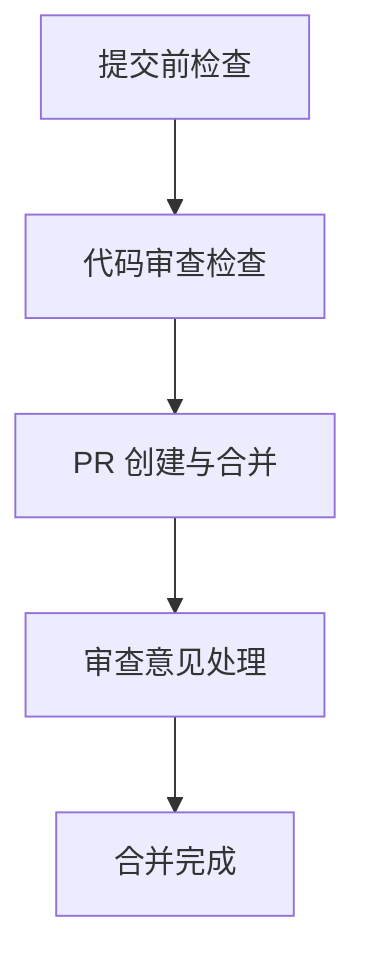

图表来源
- [quality-gates.yml:235-242](file://.harness/quality-gates.yml#L235-L242)
- [github-pr-workflow.md:92-141](file://.harness/github-pr-workflow.md#L92-L141)

章节来源
- [quality-gates.yml:235-242](file://.harness/quality-gates.yml#L235-L242)
- [github-pr-workflow.md:92-141](file://.harness/github-pr-workflow.md#L92-L141)

## 结论
YuleTech AutoSAR BSW 平台以 OpenSpec 为纲、Harness 工程约束为准、Superpowers 工具链为器，形成从需求到实现再到验证归档的闭环开发流程。通过 TDD 红-绿-重构、严格的分层与接口规则、全面的质量门禁与 CI/CD，确保模块化、可移植、可验证的基础软件交付质量与效率。

## 附录
- 快速命令参考（开发阶段）
  - 初始化工程：/triple-init
  - 需求探索：/triple-explore
  - 创建变更：/triple-new “描述”
  - 开发执行：/triple-dev（TDD）
  - 验证审查：/triple-verify
  - 归档合并：/triple-archive
  - 健康检查：/triple-health

章节来源
- [README.md:277-304](file://README.md#L277-L304)
- [yuletech-dev-process.md:41-99](file://.harness/yuletech-dev-process.md#L41-L99)