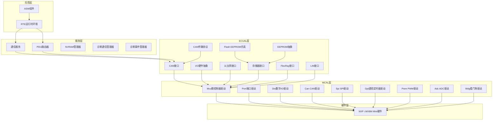
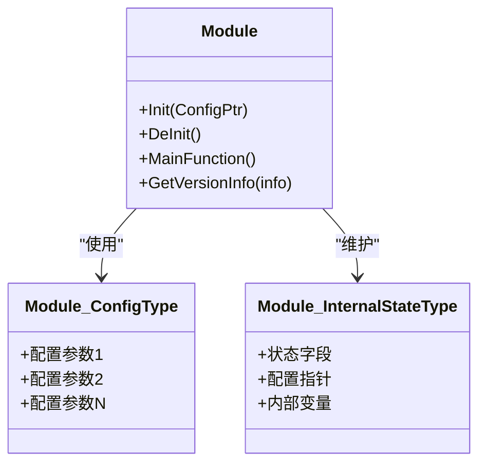
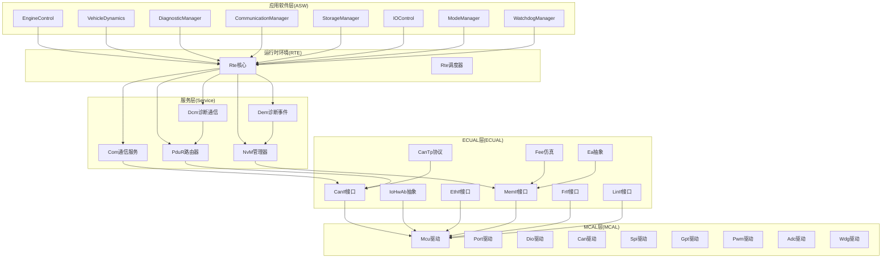
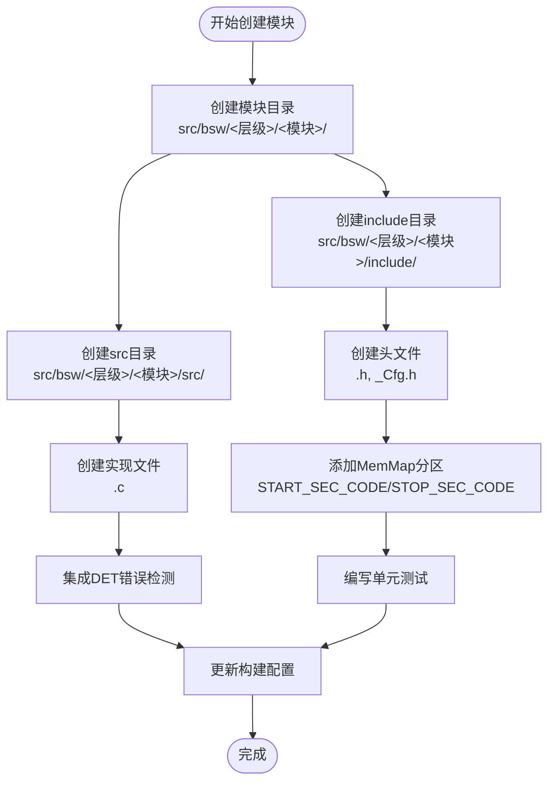
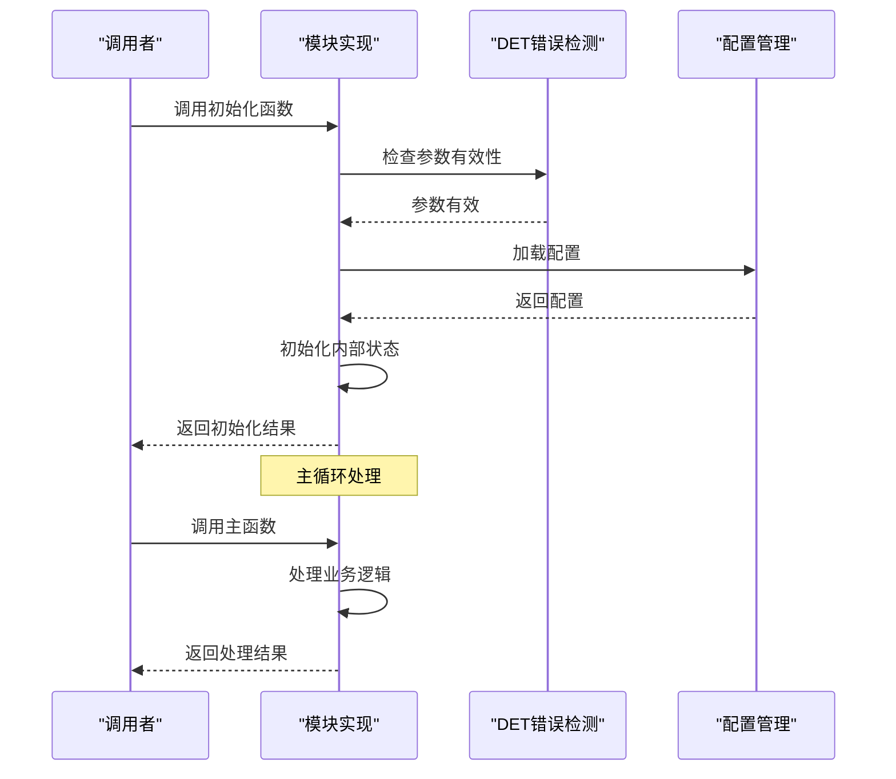
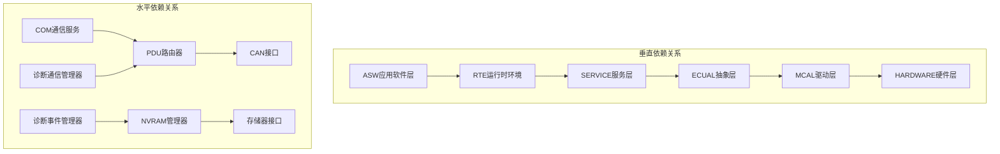

# 模块创建工作流程

<cite>
**本文档引用的文件**
- [README.md](file://README.md)
- [development-guide.md](file://docs/development-guide.md)
- [modules.md](file://docs/modules.md)
- [Det.h](file://src/bsw/common/Det.h)
- [Det.c](file://src/bsw/common/Det.c)
- [CanIf.h](file://src/bsw/ecual/canif/include/CanIf.h)
- [CanIf.c](file://src/bsw/ecual/canif/src/CanIf.c)
- [Com.h](file://src/bsw/services/com/include/Com.h)
- [CanIf_Cfg.h](file://src/bsw/config/templates/CanIf_Cfg.h)
- [MemMap.h](file://src/bsw/general/inc/MemMap.h)
- [CMakeLists.txt](file://tools/build/CMakeLists.txt)
- [test_mcu.c](file://tests/unit/test_mcu.c)
- [main.c](file://examples/can_demo/main.c)
</cite>

## 目录
1. [简介](#简介)
2. [项目结构](#项目结构)
3. [核心组件](#核心组件)
4. [架构概览](#架构概览)
5. [详细组件分析](#详细组件分析)
6. [依赖关系分析](#依赖关系分析)
7. [性能考虑](#性能考虑)
8. [故障排除指南](#故障排除指南)
9. [结论](#结论)
10. [附录](#附录)

## 简介

YuleTech AutoSAR BSW平台是一个基于AutoSAR Classic Platform 4.x标准的开源基础软件平台，专为NXP i.MX8M Mini处理器设计。本平台提供了完整的汽车基础软件栈实现，包括MCAL层、ECUAL层、Service层、RTE层和ASW层。

本指南专注于模块创建工作流程，提供从零开始创建新模块的完整指导，包括目录结构创建、头文件编写、配置文件定义、实现文件开发、内存分区管理、错误检测集成、单元测试编写和构建系统更新。

## 项目结构

YuleTech AutoSAR BSW平台采用分层架构设计，严格按照AutoSAR标准组织代码结构：

**图表来源**
- [README.md:153-199](file://README.md#L153-L199)
- [modules.md:340-376](file://docs/modules.md#L340-L376)

**章节来源**
- [README.md:153-199](file://README.md#L153-L199)
- [modules.md:340-376](file://docs/modules.md#L340-L376)

## 核心组件

### AutoSAR标准模块接口规范

根据YuleTech平台的实现，所有模块必须遵循以下标准接口规范：

#### 基础模块接口
- **初始化函数**: `Module_Init(const Module_ConfigType* ConfigPtr)`
- **去初始化函数**: `Module_DeInit(void)`
- **主函数**: `Module_MainFunction(void)` (用于需要周期性处理的模块)
- **版本信息函数**: `Module_GetVersionInfo(Std_VersionInfoType* versioninfo)` (可选)

#### 配置结构体
所有模块都使用类似的配置结构体模式：

**图表来源**
- [CanIf.h:227-245](file://src/bsw/ecual/canif/include/CanIf.h#L227-L245)
- [Com.h:222-227](file://src/bsw/services/com/include/Com.h#L222-L227)

#### 错误检测接口
所有模块都集成了DET（Development Error Tracer）错误检测机制：

**章节来源**
- [CanIf.h:38-91](file://src/bsw/ecual/canif/include/CanIf.h#L38-L91)
- [Com.h:89-103](file://src/bsw/services/com/include/Com.h#L89-L103)
- [Det.h:39-44](file://src/bsw/common/Det.h#L39-L44)

## 架构概览

YuleTech AutoSAR BSW平台遵循严格的分层架构，每层都有明确的职责和接口：

**图表来源**
- [modules.md:558-623](file://docs/modules.md#L558-L623)

## 详细组件分析

### 模块创建工作流程

#### 第一步：目录结构创建

按照YuleTech平台的标准，新模块应创建以下目录结构：

**图表来源**
- [development-guide.md:341-350](file://docs/development-guide.md#L341-L350)

#### 第二步：头文件编写

头文件应包含以下标准内容：

1. **文件头注释** - 包含版权信息和版本信息
2. **包含文件** - 包含必要的标准头文件和相关模块头文件
3. **版本信息宏定义**
4. **服务ID宏定义**
5. **错误码宏定义**
6. **数据类型定义**
7. **函数原型声明**

**章节来源**
- [CanIf.h:1-12](file://src/bsw/ecual/canif/include/CanIf.h#L1-L12)
- [CanIf.h:25-48](file://src/bsw/ecual/canif/include/CanIf.h#L25-L48)
- [Com.h:14-31](file://src/bsw/services/com/include/Com.h#L14-L31)

#### 第三步：配置文件定义

配置文件模板提供了标准的配置参数：

**章节来源**
- [CanIf_Cfg.h:20-26](file://src/bsw/config/templates/CanIf_Cfg.h#L20-L26)
- [CanIf_Cfg.h:31-35](file://src/bsw/config/templates/CanIf_Cfg.h#L31-L35)

#### 第四步：实现文件开发

实现文件应遵循以下模式：

**图表来源**
- [CanIf.c:29-50](file://src/bsw/ecual/canif/src/CanIf.c#L29-L50)
- [CanIf.c:142-185](file://src/bsw/ecual/canif/src/CanIf.c#L142-L185)

**章节来源**
- [CanIf.c:29-50](file://src/bsw/ecual/canif/src/CanIf.c#L29-L50)
- [CanIf.c:142-185](file://src/bsw/ecual/canif/src/CanIf.c#L142-L185)

#### 第五步：内存分区管理

使用MemMap.h进行内存分区管理：

**章节来源**
- [MemMap.h:37-105](file://src/bsw/general/inc/MemMap.h#L37-L105)
- [MemMap.h:227-295](file://src/bsw/general/inc/MemMap.h#L227-L295)

#### 第六步：错误检测集成

集成DET（Development Error Tracer）错误检测：

**章节来源**
- [Det.h:39-44](file://src/bsw/common/Det.h#L39-L44)
- [Det.c:47-57](file://src/bsw/common/Det.c#L47-L57)

#### 第七步：单元测试编写

编写完整的单元测试：

**章节来源**
- [test_mcu.c:19-34](file://tests/unit/test_mcu.c#L19-L34)
- [test_mcu.c:36-44](file://tests/unit/test_mcu.c#L36-L44)

#### 第八步：构建系统更新

更新CMakeLists.txt配置：

**章节来源**
- [CMakeLists.txt:43-78](file://tools/build/CMakeLists.txt#L43-L78)

### 模块创建检查清单

创建新模块时，请使用以下检查清单确保所有步骤都已完成：

#### 目录结构检查
- [ ] 创建模块根目录
- [ ] 创建include目录
- [ ] 创建src目录
- [ ] 创建必要的子目录

#### 文件创建检查
- [ ] 创建<Module>.h头文件
- [ ] 创建<Module>_Cfg.h配置文件
- [ ] 创建<Module>.c实现文件
- [ ] 创建单元测试文件

#### 代码实现检查
- [ ] 实现初始化函数
- [ ] 实现去初始化函数
- [ ] 实现主函数（如需要）
- [ ] 实现版本信息函数
- [ ] 实现错误处理
- [ ] 集成DET错误检测
- [ ] 使用MemMap内存分区

#### 配置检查
- [ ] 定义配置宏
- [ ] 实现配置结构体
- [ ] 添加默认配置值
- [ ] 实现配置验证

#### 测试检查
- [ ] 编写单元测试
- [ ] 测试正常路径
- [ ] 测试异常路径
- [ ] 测试边界条件
- [ ] 测试错误处理

#### 构建检查
- [ ] 更新CMakeLists.txt
- [ ] 添加源文件路径
- [ ] 更新包含目录
- [ ] 测试编译

#### 文档检查
- [ ] 更新模块文档
- [ ] 更新开发指南
- [ ] 更新API参考
- [ ] 更新模块清单

## 依赖关系分析

### 模块间依赖关系

**图表来源**
- [modules.md:340-376](file://docs/modules.md#L340-L376)

### 具体模块依赖示例

**章节来源**
- [modules.md:356-375](file://docs/modules.md#L356-L375)

## 性能考虑

### 内存管理优化

1. **内存分区策略**: 使用MemMap.h进行精确的内存分区管理
2. **变量存储类别**: 根据使用频率选择合适的存储类别
3. **常量数据优化**: 将只读数据放入常量段
4. **配置数据分离**: 将配置数据与代码分离

### 处理器优化

1. **编译器优化**: 使用适当的编译器标志
2. **函数内联**: 对频繁调用的小函数使用内联
3. **循环优化**: 减少循环中的函数调用
4. **中断处理**: 优化中断服务程序的执行时间

### 实时性能

1. **确定性执行**: 确保模块执行时间的可预测性
2. **优先级管理**: 合理设置任务优先级
3. **资源竞争**: 避免模块间的资源竞争
4. **超时处理**: 实现合理的超时机制

## 故障排除指南

### 常见问题及解决方案

#### 编译错误
- **问题**: 头文件包含错误
  - **解决方案**: 检查包含路径和文件名大小写
- **问题**: 未定义的符号
  - **解决方案**: 确认在CMakeLists.txt中添加了源文件

#### 运行时错误
- **问题**: DET错误报告
  - **解决方案**: 检查参数验证和状态检查
- **问题**: 内存访问冲突
  - **解决方案**: 验证MemMap分区使用

#### 功能缺陷
- **问题**: 模块不按预期工作
  - **解决方案**: 使用单元测试隔离问题
- **问题**: 性能问题
  - **解决方案**: 分析代码复杂度和内存使用

**章节来源**
- [development-guide.md:431-492](file://docs/development-guide.md#L431-L492)

### 调试技巧

#### 使用DET进行调试
- 启用开发错误检测
- 在关键位置添加错误报告
- 使用调试输出跟踪执行流程

#### 单元测试调试
- 编写覆盖所有分支的测试
- 使用模拟对象隔离外部依赖
- 逐步调试复杂的数据流

**章节来源**
- [development-guide.md:431-467](file://docs/development-guide.md#L431-L467)

## 结论

YuleTech AutoSAR BSW平台提供了完整的模块创建工作流程和最佳实践。通过遵循本文档提供的标准化流程，开发者可以高效地创建符合AutoSAR标准的新模块。

关键要点包括：
1. 严格遵循分层架构设计
2. 使用标准化的模块接口
3. 集成完整的错误检测机制
4. 实现全面的单元测试
5. 优化内存和性能
6. 维护完整的文档

这些实践确保了模块的质量、可维护性和可扩展性，为复杂的汽车嵌入式系统开发奠定了坚实的基础。

## 附录

### 实际模块创建示例

#### 参考现有模块的实现模式

**章节来源**
- [CanIf.c:29-50](file://src/bsw/ecual/canif/src/CanIf.c#L29-L50)
- [Com.h:251-251](file://src/bsw/services/com/include/Com.h#L251-L251)

### 开发工具和环境

#### 开发环境配置

**章节来源**
- [development-guide.md:17-80](file://docs/development-guide.md#L17-L80)

### 质量保证流程

#### 代码审查和测试

**章节来源**
- [development-guide.md:496-595](file://docs/development-guide.md#L496-L595)