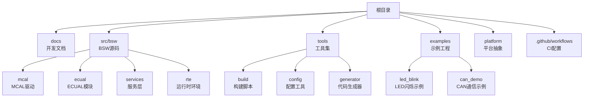
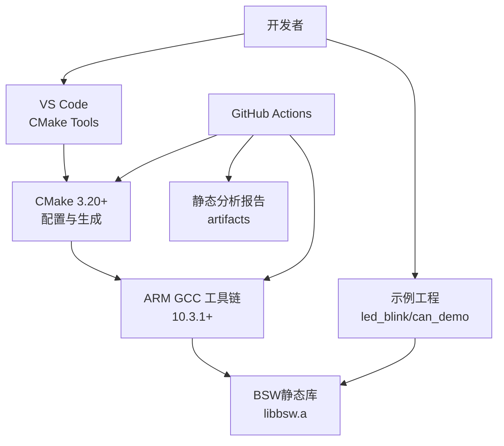
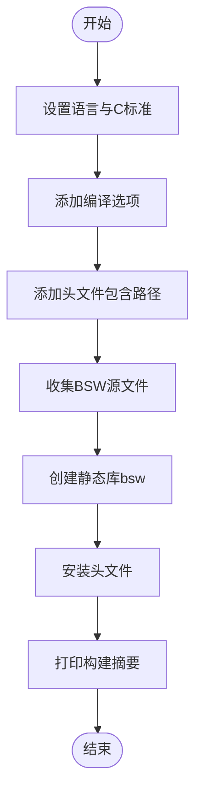
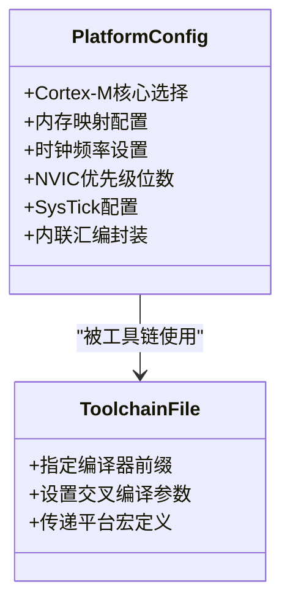
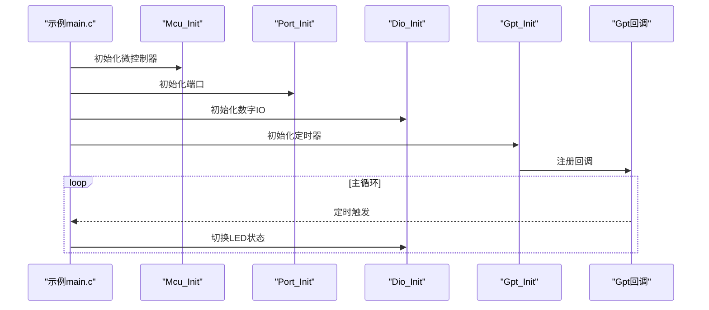
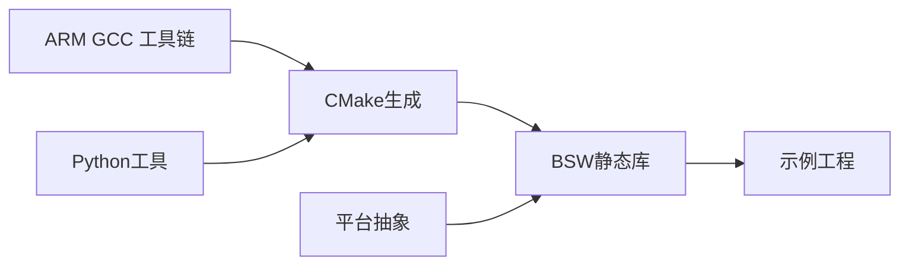

# 开发环境配置

<cite>
**本文引用的文件**
- [README.md](file://README.md)
- [开发指南.md](file://docs/development-guide.md)
- [CI工作流.yml](file://.github/workflows/ci.yml)
- [构建脚本CMakeLists.txt](file://tools/build/CMakeLists.txt)
- [平台配置头文件.h](file://platform/cortex-m/platform_config.h)
- [平台说明README.md](file://platform/cortex-m/README.md)
- [示例说明.md](file://examples/README.md)
- [LED闪烁示例main.c](file://examples/led_blink/main.c)
- [CAN演示示例main.c](file://examples/can_demo/main.c)
</cite>

## 目录
1. [简介](#简介)
2. [项目结构](#项目结构)
3. [核心组件](#核心组件)
4. [架构总览](#架构总览)
5. [详细组件分析](#详细组件分析)
6. [依赖关系分析](#依赖关系分析)
7. [性能考虑](#性能考虑)
8. [故障排除指南](#故障排除指南)
9. [结论](#结论)

## 简介
本指南面向YuleTech AutoSAR BSW平台的开发者，提供从零开始的完整开发环境搭建与验证流程，涵盖工具链要求、跨平台安装命令、VS Code配置建议、项目克隆与构建步骤，以及CMake交叉编译工具链设置与验证方法。该平台基于AutoSAR Classic Platform 4.x标准，支持NXP i.MX8M Mini等ARM Cortex-M目标平台，提供完整的BSW分层实现（MCAL、ECUAL、Service、RTE）。

## 项目结构
项目采用分层组织方式，核心目录包括：
- docs：项目文档与开发指南
- src/bsw：BSW各层源码（MCAL、ECUAL、Service、RTE）
- tools：构建、配置与代码生成工具
- examples：最小可运行示例（LED闪烁、CAN通信）
- platform：目标平台抽象与配置
- .github/workflows：CI流水线配置

**图表来源**
- [README.md:153-199](file://README.md#L153-L199)
- [开发指南.md:337-362](file://docs/development-guide.md#L337-L362)

**章节来源**
- [README.md:153-199](file://README.md#L153-L199)
- [开发指南.md:337-362](file://docs/development-guide.md#L337-L362)

## 核心组件
- 工具链与版本要求
  - 编译器：GCC ARM Embedded 10.3.1+
  - 构建系统：CMake 3.20+
  - Python：3.9+（用于代码生成工具）
  - Git：2.30+（版本控制）
  - VS Code：最新（IDE）
- 平台抽象：platform/cortex-m提供Cortex-M系列内核特性、内存映射、中断优先级、SysTick等配置宏与内联汇编封装
- 构建系统：tools/build/CMakeLists.txt集中管理BSW源码与头文件包含路径，生成静态库供上层应用链接
- 示例工程：examples/led_blink与examples/can_demo展示典型外设使用模式与构建流程

**章节来源**
- [开发指南.md:19-28](file://docs/development-guide.md#L19-L28)
- [平台配置头文件.h:12-32](file://platform/cortex-m/platform_config.h#L12-L32)
- [构建脚本CMakeLists.txt:1-107](file://tools/build/CMakeLists.txt#L1-L107)
- [示例说明.md:1-165](file://examples/README.md#L1-L165)

## 架构总览
下图展示了开发环境的关键组件及其交互关系：开发者在本地或CI中通过CMake配置交叉编译工具链，调用ARM GCC编译器构建BSW静态库；示例工程通过包含BSW头文件与链接静态库完成最终可执行镜像生成。

**图表来源**
- [CI工作流.yml:26-36](file://.github/workflows/ci.yml#L26-L36)
- [构建脚本CMakeLists.txt:80-99](file://tools/build/CMakeLists.txt#L80-L99)
- [示例说明.md:64-82](file://examples/README.md#L64-L82)

## 详细组件分析

### 工具链与版本要求
- 编译器：GCC ARM Embedded 10.3.1+（支持ARM Cortex-M系列）
- 构建系统：CMake 3.20+（支持现代CMake语法与多配置）
- Python：3.9+（用于静态分析、配置工具与代码生成）
- Git：2.30+（版本控制）
- VS Code：最新（配合CMake Tools、C/C++、Python、GitLens扩展）

**章节来源**
- [开发指南.md:19-28](file://docs/development-guide.md#L19-L28)
- [CI工作流.yml:16-25](file://.github/workflows/ci.yml#L16-L25)

### 跨平台安装命令
- Ubuntu/Debian
  - 安装ARM GCC：sudo apt-get install gcc-arm-none-eabi
  - 安装CMake：sudo apt-get install cmake
- macOS
  - 安装ARM GCC：brew install arm-none-eabi-gcc
  - 安装CMake：brew install cmake
- Windows
  - 安装ARM GCC：从官方下载并安装
  - 安装CMake：从官网下载并安装

**章节来源**
- [开发指南.md:31-55](file://docs/development-guide.md#L31-L55)

### VS Code配置建议
- 推荐扩展
  - C/C++（Microsoft）
  - CMake Tools
  - Python
  - GitLens
- 项目设置
  - 克隆仓库后创建构建目录并配置CMake工具链文件
  - 使用CMake Tools进行配置与构建

**章节来源**
- [开发指南.md:57-81](file://docs/development-guide.md#L57-L81)

### 项目克隆与构建流程
- 克隆与初始化
  - git clone https://github.com/yuletech/autosar-bsw-platform.git
  - cd autosar-bsw-platform
- 构建步骤
  - mkdir build && cd build
  - cmake .. -DCMAKE_TOOLCHAIN_FILE=../cmake/arm-gcc-toolchain.cmake
  - make -j$(nproc)
- 运行测试
  - make test
  - make test-report

**章节来源**
- [README.md:104-132](file://README.md#L104-L132)
- [开发指南.md:65-80](file://docs/development-guide.md#L65-L80)

### CMake构建系统配置
- 语言与标准
  - 语言：C
  - C标准：C99
- 编译选项
  - 启用告警与优化级别
- 包含路径
  - 覆盖common、MCAL、ECUAL、Service、RTE全量头文件路径
- 源文件集合
  - MCAL（9个驱动）、ECUAL（9个模块）、Service（5个模块）、RTE（3个文件）
- 目标与安装
  - 生成静态库bsw
  - 安装头文件至include目录

**图表来源**
- [构建脚本CMakeLists.txt:1-107](file://tools/build/CMakeLists.txt#L1-L107)

**章节来源**
- [构建脚本CMakeLists.txt:1-107](file://tools/build/CMakeLists.txt#L1-L107)

### 交叉编译工具链设置
- 工具链文件
  - 通过-D CMAKE_TOOLCHAIN_FILE指定arm-gcc-toolchain.cmake
- 平台配置
  - platform/cortex-m/platform_config.h定义Cortex-M核心类型、内存映射、时钟频率、NVIC优先级位数、SysTick配置等
  - 支持多种Cortex-M内核（M0/M0+/M3/M4/M7/M23/M33/M55），默认M4
- 编译器标志
  - 示例：-mcpu=cortex-m4 -mthumb -mfpu=fpv4-sp-d16 -mfloat-abi=hard
  - 宏定义：-D CORTEX_M_CORE=CORTEX_M4

**图表来源**
- [平台配置头文件.h:12-307](file://platform/cortex-m/platform_config.h#L12-L307)
- [平台说明README.md:143-172](file://platform/cortex-m/README.md#L143-L172)

**章节来源**
- [平台配置头文件.h:12-307](file://platform/cortex-m/platform_config.h#L12-L307)
- [平台说明README.md:143-172](file://platform/cortex-m/README.md#L143-L172)

### 开发环境验证步骤
- 构建验证
  - 成功生成libbsw.a静态库
  - 头文件正确安装至include目录
- 示例验证
  - examples/led_blink与examples/can_demo均可通过CMake配置与构建
  - 可执行文件生成并通过GDB加载（如需）
- CI验证
  - GitHub Actions使用gcc-arm-none-eabi与Python 3.10进行构建与静态分析

**章节来源**
- [构建脚本CMakeLists.txt:90-99](file://tools/build/CMakeLists.txt#L90-L99)
- [示例说明.md:21-82](file://examples/README.md#L21-L82)
- [CI工作流.yml:31-47](file://.github/workflows/ci.yml#L31-L47)

### 示例工程与验证
- LED闪烁示例
  - 使用Dio与Gpt驱动，周期性切换GPIO电平
  - 展示Mcu、Port、Dio、Gpt初始化与回调机制
- CAN通信示例
  - 使用Can、CanIf、Com、PduR，实现消息收发与回显
  - 展示中断回调、主函数循环与后台任务处理

**图表来源**
- [LED闪烁示例main.c:61-99](file://examples/led_blink/main.c#L61-L99)

**章节来源**
- [LED闪烁示例main.c:1-100](file://examples/led_blink/main.c#L1-L100)
- [CAN演示示例main.c:1-119](file://examples/can_demo/main.c#L1-L119)

## 依赖关系分析
- 组件耦合
  - BSW静态库集中管理所有模块源码，上层示例仅需包含头文件并链接静态库
  - 平台抽象独立于具体硬件，通过宏定义与内联汇编适配不同Cortex-M内核
- 外部依赖
  - ARM GCC工具链（编译器、链接器、汇编器）
  - CMake（构建生成）
  - Python（静态分析与工具链）
- 潜在环路
  - 无直接循环依赖，BSW库作为静态产物被示例工程消费

**图表来源**
- [构建脚本CMakeLists.txt:14-40](file://tools/build/CMakeLists.txt#L14-L40)
- [平台配置头文件.h:12-32](file://platform/cortex-m/platform_config.h#L12-L32)

**章节来源**
- [构建脚本CMakeLists.txt:14-40](file://tools/build/CMakeLists.txt#L14-L40)
- [平台配置头文件.h:12-32](file://platform/cortex-m/platform_config.h#L12-L32)

## 性能考虑
- 编译优化
  - CMake默认启用-O2优化，确保发布构建的执行效率
- 内存分区
  - 通过MemMap.h进行精确的内存段划分，减少碎片与提升访问效率
- 中断与定时
  - SysTick与NVIC配置直接影响实时性与中断响应时间

**章节来源**
- [构建脚本CMakeLists.txt:10-11](file://tools/build/CMakeLists.txt#L10-L11)
- [平台配置头文件.h:143-177](file://platform/cortex-m/platform_config.h#L143-L177)

## 故障排除指南
- 构建失败（找不到ARM GCC）
  - 确认已安装gcc-arm-none-eabi，并将其加入PATH
  - 验证CMake工具链文件路径正确
- CMake版本过低
  - 升级CMake至3.20+，确保支持现代语法与工具链文件
- Python相关问题
  - 确保Python 3.9+可用，安装所需依赖（如pytest、Jinja2）
- 示例无法加载或运行
  - 使用GDB加载生成的ELF文件，检查符号表与内存映射
  - 确认目标设备与调试器连接正常

**章节来源**
- [开发指南.md:131-148](file://docs/development-guide.md#L131-L148)
- [CI工作流.yml:16-25](file://.github/workflows/ci.yml#L16-L25)

## 结论
通过本指南，开发者可在Ubuntu/Debian、macOS与Windows三大平台上快速搭建YuleTech AutoSAR BSW开发环境。依托CMake与ARM GCC工具链，结合平台抽象与示例工程，可高效完成BSW构建、验证与调试。建议在实际项目中进一步完善CI流水线与静态分析策略，持续提升代码质量与交付效率。