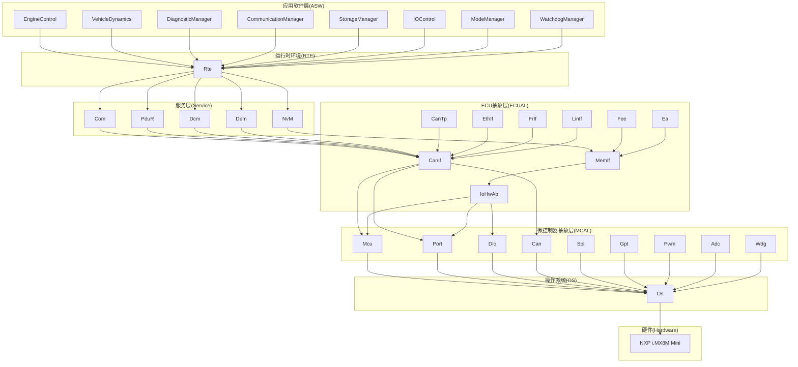
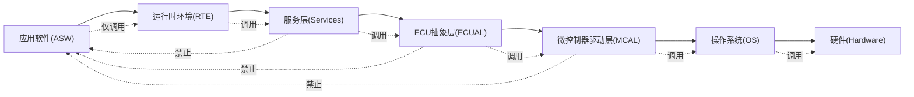
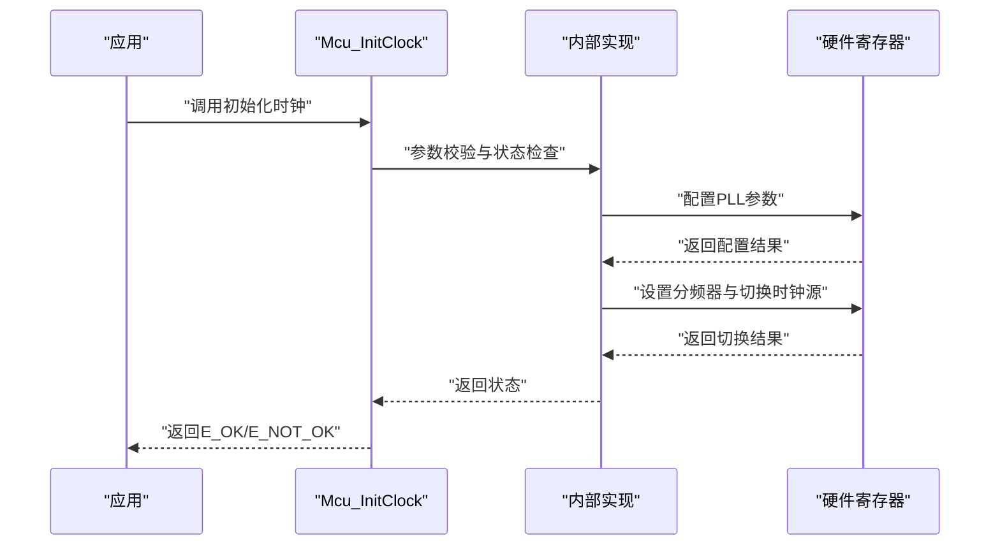
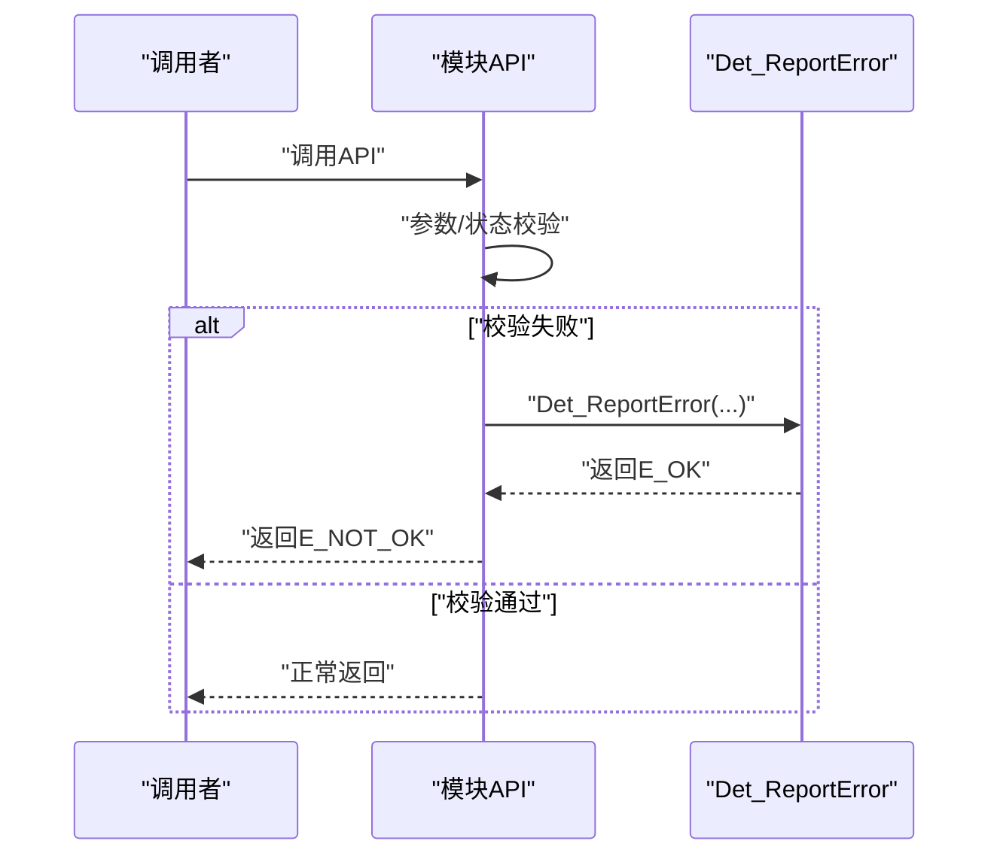
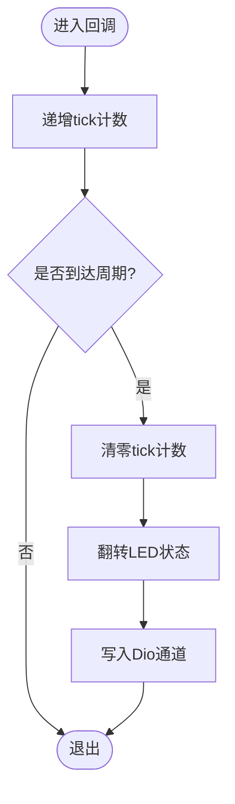
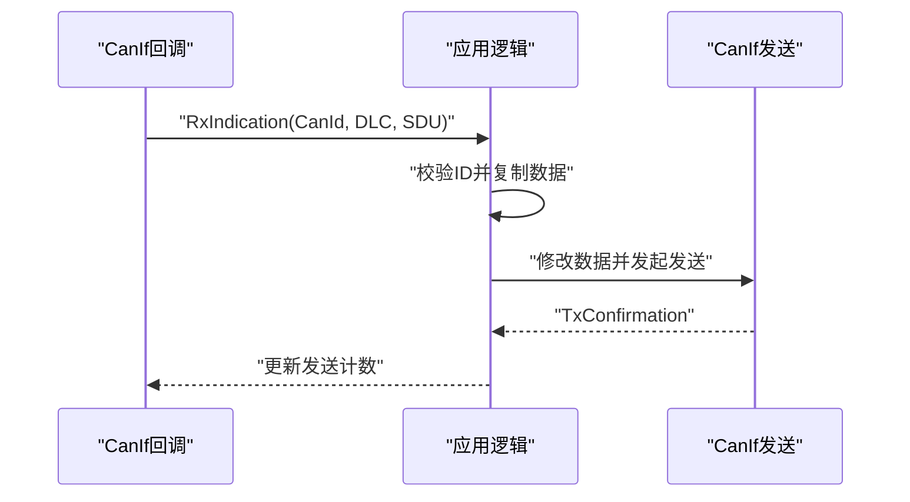
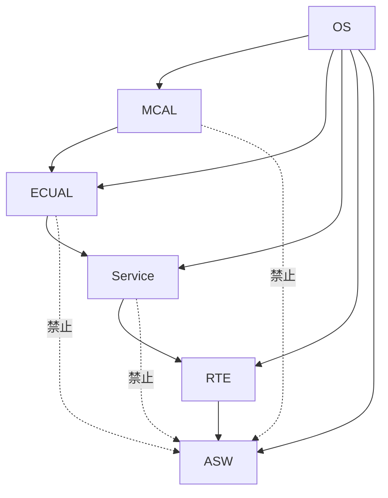
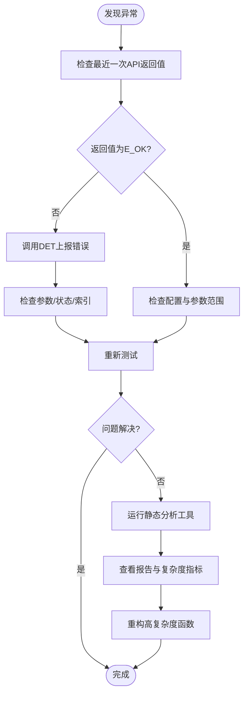

# 最佳实践

<cite>
**本文引用的文件**
- [README.md](file://README.md)
- [.harness/architecture-rules.md](file://.harness/architecture-rules.md)
- [.harness/autosar-bsw-development.md](file://.harness/autosar-bsw-development.md)
- [.harness/yuletech-dev-process.md](file://.harness/yuletech-dev-process.md)
- [.github/workflows/ci.yml](file://.github/workflows/ci.yml)
- [.github/workflows/deploy-docs.yml](file://.github/workflows/deploy-docs.yml)
- [src/bsw/os/include/Std_Types.h](file://src/bsw/os/include/Std_Types.h)
- [src/bsw/services/det/include/Det.h](file://src/bsw/services/det/include/Det.h)
- [src/bsw/services/det/src/Det.c](file://src/bsw/services/det/src/Det.c)
- [include/autosar/Compiler.h](file://include/autosar/Compiler.h)
- [src/bsw/mcal/mcu/include/Mcu.h](file://src/bsw/mcal/mcu/include/Mcu.h)
- [src/bsw/mcal/mcu/src/Mcu.c](file://src/bsw/mcal/mcu/src/Mcu.c)
- [config/bsw_config.json](file://config/bsw_config.json)
- [tools/analysis/static_analysis.py](file://tools/analysis/static_analysis.py)
- [tools/analysis/report_summary.py](file://tools/analysis/report_summary.py)
- [examples/can_demo/main.c](file://examples/can_demo/main.c)
- [examples/led_blink/main.c](file://examples/led_blink/main.c)
- [verification/bsw_integration_verification.md](file://verification/bsw_integration_verification.md)
</cite>

## 目录
1. [引言](#引言)
2. [项目结构](#项目结构)
3. [核心组件](#核心组件)
4. [架构总览](#架构总览)
5. [详细组件分析](#详细组件分析)
6. [依赖分析](#依赖分析)
7. [性能考虑](#性能考虑)
8. [故障排查指南](#故障排查指南)
9. [结论](#结论)
10. [附录](#附录)

## 引言
本指南面向YuleTech AutoSAR BSW平台的开发者，总结项目在开发过程中的经验与规范，提炼可复用的最佳实践，帮助团队编写高质量、可维护、可扩展的AutoSAR代码。内容涵盖函数设计、命名规范、返回值检查、const使用、错误检测、内存分区、静态分析与CI集成等方面，并结合仓库中现有的开发流程、架构规则与示例代码进行说明。

## 项目结构
YuleTech BSW平台采用AutoSAR Classic 4.x分层架构，自下而上包含MCAL、ECUAL、Service、OS、RTE与ASW六层。项目同时提供示例应用与自动化CI流程，确保代码质量与可验证性。

**图表来源**
- [README.md: 48-84:48-84](file://README.md#L48-L84)
- [verification/bsw_integration_verification.md: 15-25:15-25](file://verification/bsw_integration_verification.md#L15-L25)

**章节来源**
- [README.md: 48-84:48-84](file://README.md#L48-L84)
- [verification/bsw_integration_verification.md: 15-25:15-25](file://verification/bsw_integration_verification.md#L15-L25)

## 核心组件
- 标准类型与编译器抽象
  - 使用标准类型与版本信息结构，统一返回值与布尔类型，确保跨平台一致性。
  - 编译器抽象层提供内联、中断、对齐、打包等宏，屏蔽编译器差异。
- 错误检测(DEV ERROR TRACER)
  - DET模块提供统一的错误上报接口，支持启动、版本查询与错误报告。
- MCAL示例：Mcu驱动
  - 展示了完整的初始化、时钟配置、模式设置、复位原因查询与版本信息获取，配套错误检测与内存分区宏。

**章节来源**
- [src/bsw/os/include/Std_Types.h: 23-68:23-68](file://src/bsw/os/include/Std_Types.h#L23-L68)
- [include/autosar/Compiler.h: 28-121:28-121](file://include/autosar/Compiler.h#L28-L121)
- [src/bsw/services/det/include/Det.h: 34-70:34-70](file://src/bsw/services/det/include/Det.h#L34-L70)
- [src/bsw/services/det/src/Det.c: 47-80:47-80](file://src/bsw/services/det/src/Det.c#L47-L80)
- [src/bsw/mcal/mcu/include/Mcu.h: 34-229:34-229](file://src/bsw/mcal/mcu/include/Mcu.h#L34-L229)
- [src/bsw/mcal/mcu/src/Mcu.c: 252-488:252-488](file://src/bsw/mcal/mcu/src/Mcu.c#L252-L488)

## 架构总览
YuleTech BSW严格遵循AutoSAR分层架构，上层仅能依赖下层，禁止跨层依赖与循环依赖；模块间通过标准接口交互，错误检测与内存分区贯穿各层。

**图表来源**
- [.harness/architecture-rules.md: 25-33:25-33](file://.harness/architecture-rules.md#L25-L33)
- [README.md: 48-84:48-84](file://README.md#L48-L84)

**章节来源**
- [.harness/architecture-rules.md: 25-33:25-33](file://.harness/architecture-rules.md#L25-L33)
- [README.md: 48-84:48-84](file://README.md#L48-L84)

## 详细组件分析

### 组件A：Mcu驱动（MCAL）
- 设计要点
  - 使用标准类型与错误码，统一返回值与状态枚举。
  - 通过配置结构体传参，支持多时钟配置与PLL参数配置。
  - 在关键API中进行参数校验与状态检查，配合DET上报错误。
  - 使用内存分区宏组织代码与配置段，满足AUTOSAR内存模型。
- 关键流程（初始化时钟）

**图表来源**
- [src/bsw/mcal/mcu/src/Mcu.c: 285-310:285-310](file://src/bsw/mcal/mcu/src/Mcu.c#L285-L310)
- [src/bsw/mcal/mcu/src/Mcu.c: 92-124:92-124](file://src/bsw/mcal/mcu/src/Mcu.c#L92-L124)

**章节来源**
- [src/bsw/mcal/mcu/include/Mcu.h: 34-229:34-229](file://src/bsw/mcal/mcu/include/Mcu.h#L34-L229)
- [src/bsw/mcal/mcu/src/Mcu.c: 285-310:285-310](file://src/bsw/mcal/mcu/src/Mcu.c#L285-L310)
- [src/bsw/mcal/mcu/src/Mcu.c: 92-124:92-124](file://src/bsw/mcal/mcu/src/Mcu.c#L92-L124)

### 组件B：DET错误检测（通用）
- 设计要点
  - 提供统一的错误上报接口，支持启动与版本查询。
  - 在模块API中进行参数与状态检查，必要时调用DET上报。
- 关键流程（错误上报）

**图表来源**
- [src/bsw/services/det/include/Det.h: 59](file://src/bsw/services/det/include/Det.h#L59)
- [src/bsw/services/det/src/Det.c: 47-57:47-57](file://src/bsw/services/det/src/Det.c#L47-L57)
- [src/bsw/mcal/mcu/src/Mcu.c: 254-264:254-264](file://src/bsw/mcal/mcu/src/Mcu.c#L254-L264)

**章节来源**
- [src/bsw/services/det/include/Det.h: 34-70:34-70](file://src/bsw/services/det/include/Det.h#L34-L70)
- [src/bsw/services/det/src/Det.c: 47-80:47-80](file://src/bsw/services/det/src/Det.c#L47-L80)
- [src/bsw/mcal/mcu/src/Mcu.c: 254-264:254-264](file://src/bsw/mcal/mcu/src/Mcu.c#L254-L264)

### 组件C：示例应用（LED闪烁）
- 设计要点
  - 展示了MCAL与OS的基本使用：Mcu初始化、Port/Dio/Gpt初始化、定时回调与LED翻转。
  - 体现了“先初始化、后使用”的顺序与错误处理的必要性。
- 关键流程（定时翻转LED）

**图表来源**
- [examples/led_blink/main.c: 37-56:37-56](file://examples/led_blink/main.c#L37-L56)
- [examples/led_blink/main.c: 61-99:61-99](file://examples/led_blink/main.c#L61-L99)

**章节来源**
- [examples/led_blink/main.c: 37-56:37-56](file://examples/led_blink/main.c#L37-L56)
- [examples/led_blink/main.c: 61-99:61-99](file://examples/led_blink/main.c#L61-L99)

### 组件D：示例应用（CAN通信）
- 设计要点
  - 展示了MCAL与上层模块的协同：Mcu、Port、Can、CanIf、Com/PduR的组合使用。
  - 通过回调处理接收与发送确认，体现AUTOSAR通信栈的典型工作流。
- 关键流程（接收回显）

**图表来源**
- [examples/can_demo/main.c: 37-53:37-53](file://examples/can_demo/main.c#L37-L53)
- [examples/can_demo/main.c: 63-118:63-118](file://examples/can_demo/main.c#L63-L118)

**章节来源**
- [examples/can_demo/main.c: 37-53:37-53](file://examples/can_demo/main.c#L37-L53)
- [examples/can_demo/main.c: 63-118:63-118](file://examples/can_demo/main.c#L63-L118)

## 依赖分析
- 分层依赖
  - 上层可依赖下层，禁止下层依赖上层，同层模块不得直接跨模块依赖。
  - 依赖必须通过标准接口，避免直接访问硬件寄存器或越层调用。
- 循环依赖
  - 严禁形成A→B→C→A的循环依赖，确保模块化与可维护性。
- 接口契约
  - 所有模块遵循AutoSAR标准类型与错误码，统一返回值与状态枚举。

**图表来源**
- [.harness/architecture-rules.md: 25-33:25-33](file://.harness/architecture-rules.md#L25-L33)

**章节来源**
- [.harness/architecture-rules.md: 25-33:25-33](file://.harness/architecture-rules.md#L25-L33)

## 性能考虑
- 圈复杂度控制
  - 建议将函数圈复杂度控制在10以内，避免过高的判定路径导致维护困难与测试成本上升。
- 函数规模
  - 单函数行数建议不超过50行，单文件行数不超过500行，提升可读性与可测试性。
- 参数数量
  - 函数参数不宜超过5个，过多参数会增加调用复杂度与耦合度。
- 嵌套深度
  - 嵌套层级不宜超过4层，避免深层嵌套影响可读性与调试效率。
- 内存分区
  - 使用MemMap进行代码与数据的内存分区，确保AUTOSAR内存模型合规。

**章节来源**
- [.harness/architecture-rules.md: 49-57:49-57](file://.harness/architecture-rules.md#L49-L57)
- [.harness/architecture-rules.md: 150-181:150-181](file://.harness/architecture-rules.md#L150-L181)

## 故障排查指南
- 错误检测与返回值
  - 所有API调用必须检查返回值，忽略返回值可能导致静默失败与系统不稳定。
  - 在参数为空、状态未初始化、索引越界等情况下，应通过DET上报错误并返回失败。
- 配置与参数校验
  - 配置参数需在生成阶段与构建阶段进行范围与冲突校验，避免运行期异常。
- 静态分析与CI
  - 使用静态分析工具进行MISRA C检查与圈复杂度分析，CI中对错误数量进行阈值控制，防止质量问题流入主干。
- 日志与定位
  - 利用静态分析报告与复杂度指标定位高风险函数，优先重构高复杂度与高频问题区域。

**图表来源**
- [.github/workflows/ci.yml: 38-59:38-59](file://.github/workflows/ci.yml#L38-L59)
- [tools/analysis/static_analysis.py: 302-322:302-322](file://tools/analysis/static_analysis.py#L302-L322)

**章节来源**
- [.github/workflows/ci.yml: 38-59:38-59](file://.github/workflows/ci.yml#L38-L59)
- [tools/analysis/static_analysis.py: 302-322:302-322](file://tools/analysis/static_analysis.py#L302-L322)

## 结论
YuleTech AutoSAR BSW平台在架构、规范与工具链方面形成了完善的体系：分层清晰、接口标准、错误检测完备、内存分区合规，并通过CI与静态分析保障代码质量。开发者应遵循命名规范、保持函数简洁、严格检查返回值、合理使用const与内存分区、持续进行静态分析与测试，以确保代码的可靠性与可维护性。

## 附录

### A. 开发流程与质量门禁
- 开发流程
  - 基于OpenSpec + Superpowers + Harness Engineering的三阶段开发法：探索、创建变更、开发执行、验证审查、归档合并。
- 质量门禁
  - CI中包含构建、静态分析、单元测试与文档生成；静态分析报告错误数超过阈值将阻断流水线。
- Git工作流
  - 分支策略与提交规范明确，PR流程包含验证与审查步骤。

**章节来源**
- [.harness/yuletech-dev-process.md: 41-100:41-100](file://.harness/yuletech-dev-process.md#L41-L100)
- [.github/workflows/ci.yml: 9-60:9-60](file://.github/workflows/ci.yml#L9-L60)
- [.github/workflows/deploy-docs.yml: 6-22:6-22](file://.github/workflows/deploy-docs.yml#L6-L22)

### B. 代码质量工具与报告
- 静态分析工具
  - 集成MISRA C规则检查、圈复杂度分析与代码风格检查，输出JSON报告并生成摘要。
- 报告摘要
  - 统计问题总数、按类别与规则聚合、列出高复杂度函数与问题最多文件，辅助定位与治理。

**章节来源**
- [tools/analysis/static_analysis.py: 52-175:52-175](file://tools/analysis/static_analysis.py#L52-L175)
- [tools/analysis/report_summary.py: 7-86:7-86](file://tools/analysis/report_summary.py#L7-L86)

### C. 配置与示例
- 配置文件
  - 提供模块启用、版本与参数的JSON配置，便于工具链生成与验证。
- 示例应用
  - LED闪烁与CAN通信示例展示了MCAL与上层模块的典型使用方式与回调处理。

**章节来源**
- [config/bsw_config.json: 1-21:1-21](file://config/bsw_config.json#L1-L21)
- [examples/led_blink/main.c: 61-99:61-99](file://examples/led_blink/main.c#L61-L99)
- [examples/can_demo/main.c: 63-118:63-118](file://examples/can_demo/main.c#L63-L118)