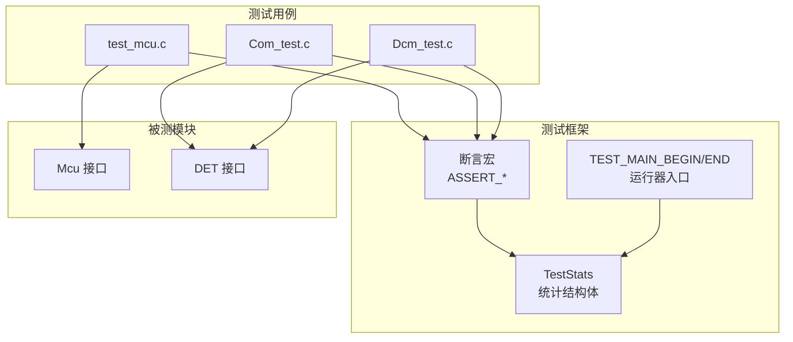
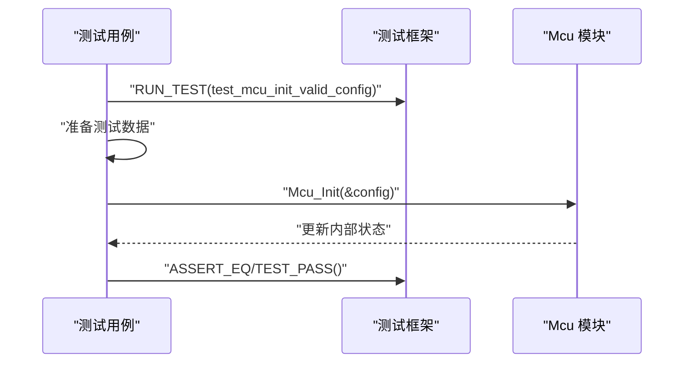
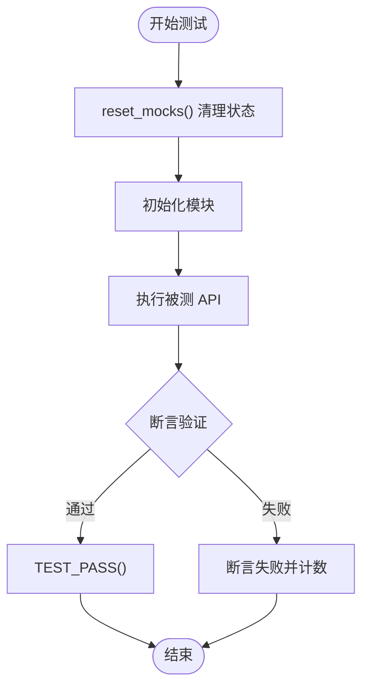
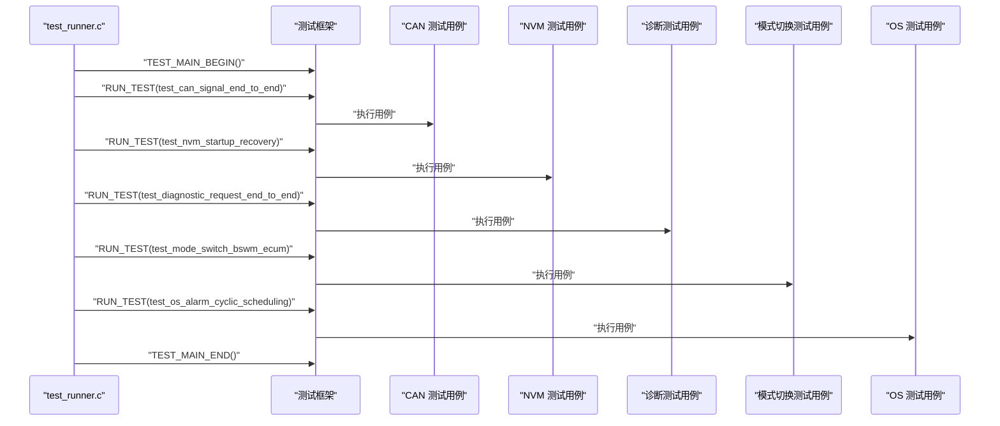
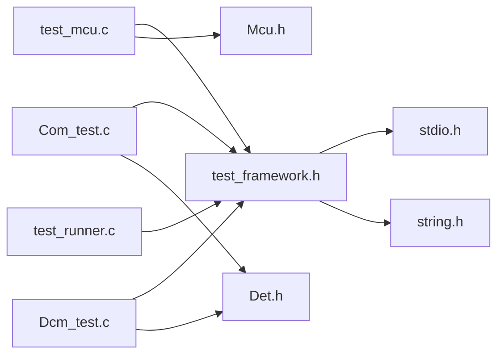

# 单元测试

<cite>
**本文引用的文件**
- [test_framework.h](file://tests/unit/test_framework.h)
- [test_mcu.c](file://tests/unit/test_mcu.c)
- [Mcu.h](file://src/bsw/mcal/mcu/include/Mcu.h)
- [Det.h](file://src/bsw/common/Det.h)
- [Com_test.c](file://src/bsw/services/com/src/Com_test.c)
- [Dcm_test.c](file://src/bsw/services/dcm/src/Dcm_test.c)
- [test_runner.c](file://src/bsw/integration/tests/test_runner.c)
- [ci.yml](file://.github/workflows/ci.yml)
</cite>

## 目录
1. [简介](#简介)
2. [项目结构](#项目结构)
3. [核心组件](#核心组件)
4. [架构总览](#架构总览)
5. [详细组件分析](#详细组件分析)
6. [依赖关系分析](#依赖关系分析)
7. [性能考量](#性能考量)
8. [故障排查指南](#故障排查指南)
9. [结论](#结论)
10. [附录](#附录)

## 简介
本文件面向 YuleTech AutoSAR BSW 平台的单元测试体系，重点围绕自定义测试框架 test_framework.h 的使用方法进行系统化说明。内容涵盖：
- 测试套件与测试用例的组织方式（TEST_SUITE、TEST_CASE_DECLARE、RUN_TEST）
- 断言宏的使用规范（ASSERT_TRUE、ASSERT_EQ、ASSERT_STR_EQ 等）
- 测试结果统计、错误报告机制
- MCU 模块测试示例与硬件抽象层测试策略
- 集成测试运行器与 CI 流水线中的测试执行

## 项目结构
单元测试位于 tests/unit 目录，采用“一个模块一个测试文件”的组织方式；服务层与集成测试分别位于 src/bsw/services/*/src 与 src/bsw/integration/tests 中。

```mermaid
graph TB
subgraph "单元测试"
TF["tests/unit/test_framework.h"]
TM["tests/unit/test_mcu.c"]
end
subgraph "被测模块"
MCUH["src/bsw/mcal/mcu/include/Mcu.h"]
DET["src/bsw/common/Det.h"]
end
subgraph "服务层测试"
COMT["src/bsw/services/com/src/Com_test.c"]
DCM["src/bsw/services/dcm/src/Dcm_test.c"]
end
subgraph "集成测试"
RUN["src/bsw/integration/tests/test_runner.c"]
end
subgraph "CI"
CI["ci.yml"]
end
TM --> TF
TM --> MCUH
COMT --> TF
DCM --> TF
RUN --> TF
CI --> TM
```

**图表来源**
- [test_framework.h:12-141](file://tests/unit/test_framework.h#L12-L141)
- [test_mcu.c:12-209](file://tests/unit/test_mcu.c#L12-L209)
- [Mcu.h:13-239](file://src/bsw/mcal/mcu/include/Mcu.h#L13-L239)
- [Det.h:11-76](file://src/bsw/common/Det.h#L11-L76)
- [Com_test.c:12-394](file://src/bsw/services/com/src/Com_test.c#L12-L394)
- [Dcm_test.c:12-274](file://src/bsw/services/dcm/src/Dcm_test.c#L12-L274)
- [test_runner.c:12-40](file://src/bsw/integration/tests/test_runner.c#L12-L40)
- [ci.yml:77-85](file://.github/workflows/ci.yml#L77-L85)

**章节来源**
- [test_framework.h:12-141](file://tests/unit/test_framework.h#L12-L141)
- [test_mcu.c:12-209](file://tests/unit/test_mcu.c#L12-L209)
- [Mcu.h:13-239](file://src/bsw/mcal/mcu/include/Mcu.h#L13-L239)
- [Det.h:11-76](file://src/bsw/common/Det.h#L11-L76)
- [Com_test.c:12-394](file://src/bsw/services/com/src/Com_test.c#L12-L394)
- [Dcm_test.c:12-274](file://src/bsw/services/dcm/src/Dcm_test.c#L12-L274)
- [test_runner.c:12-40](file://src/bsw/integration/tests/test_runner.c#L12-L40)
- [ci.yml:77-85](file://.github/workflows/ci.yml#L77-L85)

## 核心组件
- 自定义测试框架（test_framework.h）：提供测试统计、断言宏、测试运行器入口等能力。
- MCU 单元测试（test_mcu.c）：覆盖 Mcu 模块初始化、去初始化、版本查询、PLL/复位/时钟等接口的边界与异常路径。
- 服务层测试（Com_test.c、Dcm_test.c）：通过 Mock 外部依赖（如 PduR、DET），验证通信与诊断服务的行为。
- 集成测试运行器（test_runner.c）：统一调度跨层集成测试用例。
- CI 流水线（ci.yml）：演示如何编译并运行单元测试目标。

**章节来源**
- [test_framework.h:18-141](file://tests/unit/test_framework.h#L18-L141)
- [test_mcu.c:19-209](file://tests/unit/test_mcu.c#L19-L209)
- [Com_test.c:17-394](file://src/bsw/services/com/src/Com_test.c#L17-L394)
- [Dcm_test.c:17-274](file://src/bsw/services/dcm/src/Dcm_test.c#L17-L274)
- [test_runner.c:15-40](file://src/bsw/integration/tests/test_runner.c#L15-L40)
- [ci.yml:77-85](file://.github/workflows/ci.yml#L77-L85)

## 架构总览
下图展示了测试框架与被测模块之间的交互关系，以及断言与统计逻辑的位置。



**图表来源**
- [test_framework.h:18-141](file://tests/unit/test_framework.h#L18-L141)
- [test_mcu.c:19-209](file://tests/unit/test_mcu.c#L19-L209)
- [Com_test.c:17-394](file://src/bsw/services/com/src/Com_test.c#L17-L394)
- [Dcm_test.c:17-274](file://src/bsw/services/dcm/src/Dcm_test.c#L17-L274)
- [Mcu.h:134-232](file://src/bsw/mcal/mcu/include/Mcu.h#L134-L232)
- [Det.h:48-73](file://src/bsw/common/Det.h#L48-L73)

## 详细组件分析

### 测试框架 test_framework.h 使用指南
- 测试统计结构体
  - 字段：总次数、通过数、失败数、当前套件名
  - 作用：记录并汇总测试结果
- 宏定义概览
  - TEST_SUITE(name)：声明测试套件函数，设置当前套件名并打印标题
  - TEST_CASE_DECLARE(name)：声明测试用例函数（用户直接定义）
  - RUN_TEST(name)：运行单个测试用例，打印名称并递增总次数
  - 断言宏：
    - ASSERT_TRUE(condition)、ASSERT_FALSE(condition)
    - ASSERT_EQ(expected, actual)、ASSERT_NE(expected, actual)
    - ASSERT_NULL(ptr)、ASSERT_NOT_NULL(ptr)
    - ASSERT_STR_EQ(expected, actual)
  - TEST_PASS()：标记当前用例通过
  - TEST_MAIN_BEGIN()/TEST_MAIN_END()：生成 main 函数，打印结果并返回退出码
- 行为特征
  - 断言失败时立即输出失败信息并增加失败计数，随后 return，确保后续断言不再执行
  - TEST_PASS() 仅在显式调用时增加通过计数

**章节来源**
- [test_framework.h:18-141](file://tests/unit/test_framework.h#L18-L141)

### MCU 模块测试示例与最佳实践
- 测试目标
  - Mcu_Init：验证有效配置与空配置的行为；检查内部状态变化
  - Mcu_DeInit：验证去初始化后的状态
  - Mcu_GetVersionInfo：验证版本信息字段
  - 异常路径：传入空指针、未初始化状态下的调用、无效参数等
- 测试策略
  - 使用静态变量模拟模块内部状态（如状态枚举）
  - 对于可能触发 DET 的场景，结合断言宏验证 DET 调用次数与参数
  - 对于不实际复位的场景，保持行为安全（例如不真正触发复位）
- 示例流程（以 Mcu_Init 为例）



**图表来源**
- [test_mcu.c:19-34](file://tests/unit/test_mcu.c#L19-L34)
- [test_framework.h:39-120](file://tests/unit/test_framework.h#L39-L120)

**章节来源**
- [test_mcu.c:19-209](file://tests/unit/test_mcu.c#L19-L209)
- [Mcu.h:134-232](file://src/bsw/mcal/mcu/include/Mcu.h#L134-L232)

### 服务层测试（Com 与 DCM）与 Mock 机制
- Com 测试要点
  - 通过 Mock PduR_Transmit 验证发送信号是否触发传输
  - 通过 Mock Det_ReportError 验证错误上报（如空指针、未初始化）
  - 验证信号打包/解包、组发送、失效等行为
- DCM 测试要点
  - 通过 Mock PduR_Transmit 验证 UDS 服务响应（会话控制、读 DID、TesterPresent）
  - 通过 Mock DID 回读函数验证数据一致性
- 通用模式
  - reset_mocks() 清理状态
  - 在用例中先初始化再断言行为
  - 对异常路径使用 ASSERT_EQ 验证 DET 调用次数与错误码



**图表来源**
- [Com_test.c:92-105](file://src/bsw/services/com/src/Com_test.c#L92-L105)
- [Dcm_test.c:106-120](file://src/bsw/services/dcm/src/Dcm_test.c#L106-L120)
- [test_framework.h:66-120](file://tests/unit/test_framework.h#L66-L120)

**章节来源**
- [Com_test.c:17-394](file://src/bsw/services/com/src/Com_test.c#L17-L394)
- [Dcm_test.c:17-274](file://src/bsw/services/dcm/src/Dcm_test.c#L17-L274)
- [Det.h:48-73](file://src/bsw/common/Det.h#L48-L73)

### 集成测试运行器与跨层测试
- test_runner.c 统一声明并运行多个外部测试用例（如 CAN 信号端到端、NVM 启动恢复、诊断请求、模式切换、OS 周期调度）
- 通过 TEST_MAIN_BEGIN/END 输出统一的测试结果统计



**图表来源**
- [test_runner.c:18-39](file://src/bsw/integration/tests/test_runner.c#L18-L39)
- [test_framework.h:123-138](file://tests/unit/test_framework.h#L123-L138)

**章节来源**
- [test_runner.c:15-40](file://src/bsw/integration/tests/test_runner.c#L15-L40)
- [test_framework.h:123-138](file://tests/unit/test_framework.h#L123-L138)

## 依赖关系分析
- 测试框架对标准库的依赖：stdio.h 用于输出；string.h 用于字符串比较
- MCU 测试对 Mcu.h 的依赖：获取 API 原型、错误码、版本信息等
- 服务层测试对 DET 的依赖：验证错误上报行为
- 集成测试运行器对测试框架的依赖：统一入口与统计



**图表来源**
- [test_framework.h:15-16](file://tests/unit/test_framework.h#L15-L16)
- [test_mcu.c:12-13](file://tests/unit/test_mcu.c#L12-L13)
- [Mcu.h:19-20](file://src/bsw/mcal/mcu/include/Mcu.h#L19-L20)
- [Com_test.c:12-15](file://src/bsw/services/com/src/Com_test.c#L12-L15)
- [Dcm_test.c:12-15](file://src/bsw/services/dcm/src/Dcm_test.c#L12-L15)
- [Det.h](file://src/bsw/common/Det.h#L17)
- [test_runner.c:12-13](file://src/bsw/integration/tests/test_runner.c#L12-L13)

**章节来源**
- [test_framework.h:15-16](file://tests/unit/test_framework.h#L15-L16)
- [test_mcu.c:12-13](file://tests/unit/test_mcu.c#L12-L13)
- [Mcu.h:19-20](file://src/bsw/mcal/mcu/include/Mcu.h#L19-L20)
- [Com_test.c:12-15](file://src/bsw/services/com/src/Com_test.c#L12-L15)
- [Dcm_test.c:12-15](file://src/bsw/services/dcm/src/Dcm_test.c#L12-L15)
- [Det.h](file://src/bsw/common/Det.h#L17)
- [test_runner.c:12-13](file://src/bsw/integration/tests/test_runner.c#L12-L13)

## 性能考量
- 测试执行时间
  - 单元测试通常为快速断言，整体执行时间短
  - 集成测试涉及多模块交互，建议拆分运行或按需组合
- 内存占用
  - 测试框架仅维护少量统计变量，内存开销极小
  - 服务层测试使用局部 Mock 变量，避免全局污染
- 并行性
  - 当前框架未提供并行执行能力，建议在 CI 中通过作业并行化实现整体加速

## 故障排查指南
- 断言失败定位
  - 断言宏会在失败时打印具体条件与期望/实际值，便于快速定位问题
  - 对字符串断言使用 ASSERT_STR_EQ，避免格式化差异导致误判
- DET 报错验证
  - 服务层测试通过 ASSERT_EQ 验证 DET 调用次数与错误码，确保错误路径被正确覆盖
- 状态不一致
  - MCU 测试通过静态变量模拟内部状态，若断言失败，检查初始化顺序与状态转换逻辑
- CI 执行问题
  - 若本地可运行而 CI 失败，检查工具链安装与编译选项的一致性

**章节来源**
- [test_framework.h:46-120](file://tests/unit/test_framework.h#L46-L120)
- [Com_test.c:118-133](file://src/bsw/services/com/src/Com_test.c#L118-L133)
- [Dcm_test.c:142-157](file://src/bsw/services/dcm/src/Dcm_test.c#L142-L157)
- [test_mcu.c:31-33](file://tests/unit/test_mcu.c#L31-L33)
- [ci.yml:77-85](file://.github/workflows/ci.yml#L77-L85)

## 结论
YuleTech AutoSAR BSW 的单元测试体系以轻量级自定义框架为核心，配合清晰的断言与统计机制，能够高效覆盖 MCU 与服务层的关键行为与异常路径。通过 Mock 与统一运行器，测试具备良好的可维护性与扩展性。建议在后续迭代中：
- 增加更多边界与异常场景的断言
- 将测试用例按模块进一步细分，提升定位效率
- 在 CI 中引入并行化与覆盖率统计，完善质量门禁

## 附录

### 断言宏速查表
- 条件断言：ASSERT_TRUE(condition)、ASSERT_FALSE(condition)
- 数值断言：ASSERT_EQ(expected, actual)、ASSERT_NE(expected, actual)
- 指针断言：ASSERT_NULL(ptr)、ASSERT_NOT_NULL(ptr)
- 字符串断言：ASSERT_STR_EQ(expected, actual)
- 成功标记：TEST_PASS()

**章节来源**
- [test_framework.h:46-120](file://tests/unit/test_framework.h#L46-L120)

### 测试用例编写规范
- 每个用例独立、可重复，避免共享状态
- 显式调用 TEST_PASS() 标记通过，避免隐式成功
- 对异常路径使用断言验证错误上报与返回值
- 使用 reset_mocks() 清理状态，确保用例隔离

**章节来源**
- [Com_test.c:92-105](file://src/bsw/services/com/src/Com_test.c#L92-L105)
- [Dcm_test.c:106-120](file://src/bsw/services/dcm/src/Dcm_test.c#L106-L120)
- [test_mcu.c:33-33](file://tests/unit/test_mcu.c#L33-L33)