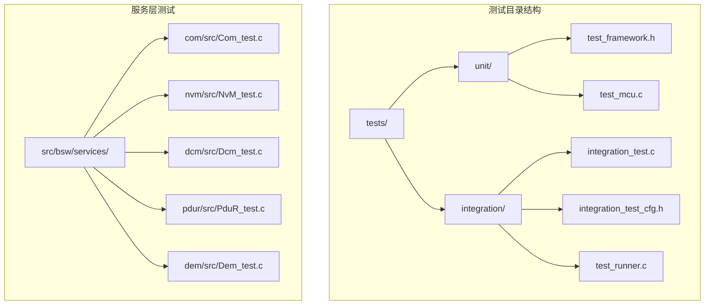
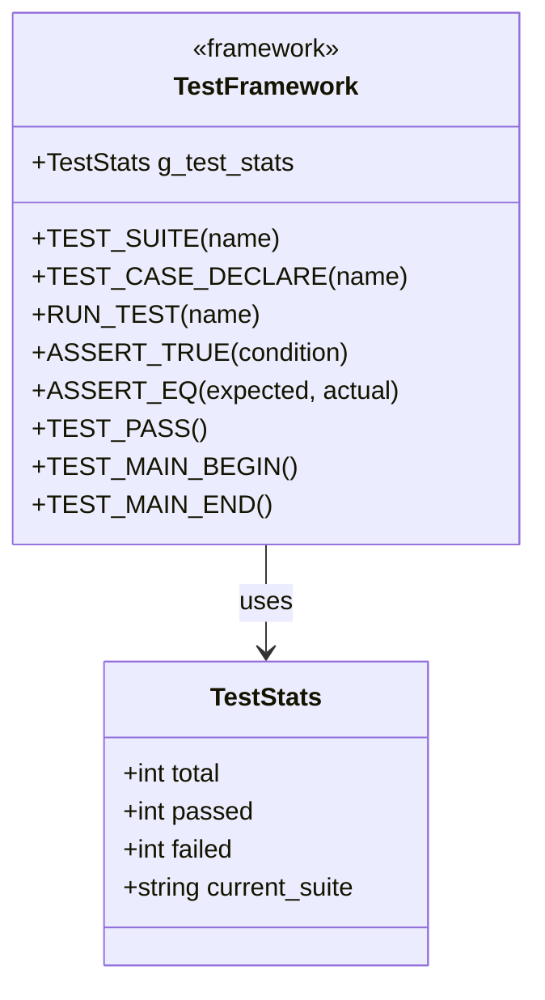
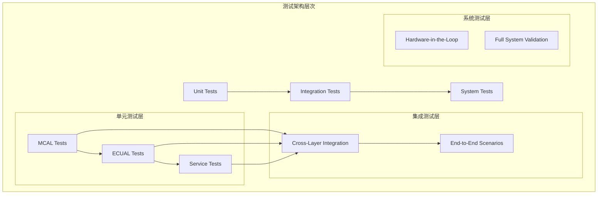
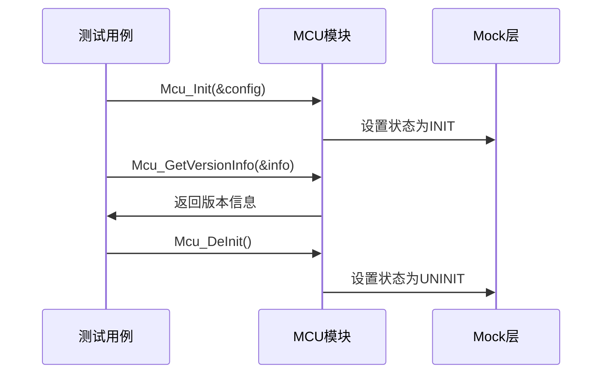
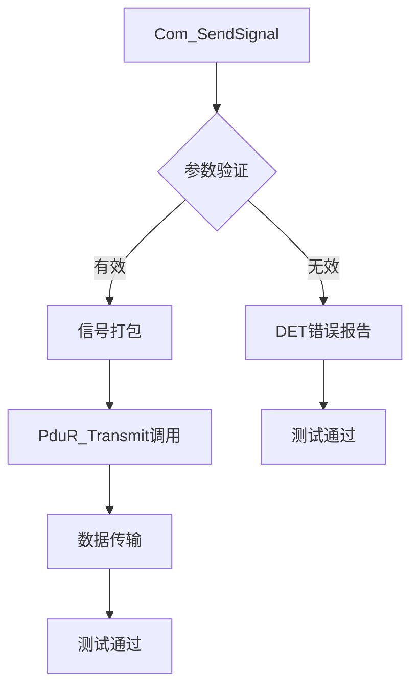
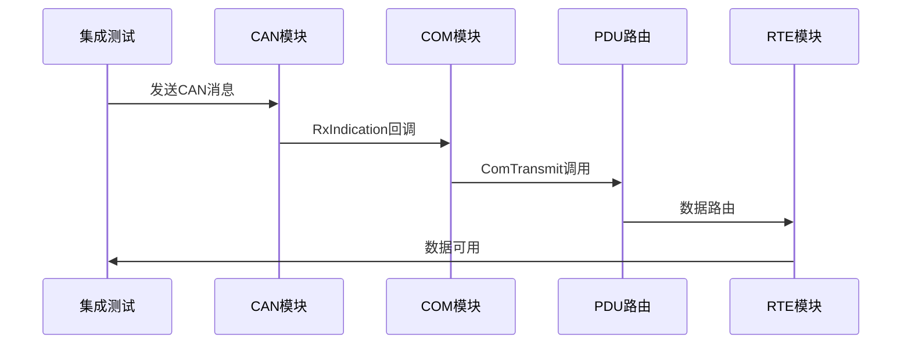
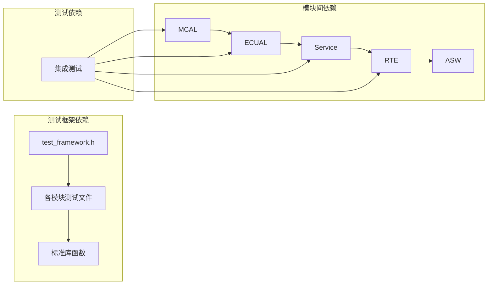

# 测试指南

<cite>
**本文档引用的文件**
- [README.md](file://README.md)
- [开发指南.md](file://docs/development-guide.md)
- [测试框架头文件](file://tests/unit/test_framework.h)
- [MCU 单元测试](file://tests/unit/test_mcu.c)
- [Com 单元测试](file://src/bsw/services/com/src/Com_test.c)
- [NvM 单元测试](file://src/bsw/services/nvm/src/NvM_test.c)
- [Dcm 单元测试](file://src/bsw/services/dcm/src/Dcm_test.c)
- [PduR 单元测试](file://src/bsw/services/pdur/src/PduR_test.c)
- [Dem 单元测试](file://src/bsw/services/dem/src/Dem_test.c)
- [集成测试配置头文件](file://tests/integration/integration_test_cfg.h)
- [集成测试主程序](file://tests/integration/bsw/integration_test.c)
- [集成测试运行器](file://tests/integration/bsw/test_runner.c)
- [CI 工作流](file://.github/workflows/ci.yml)
- [集成验证报告](file://verification/bsw_integration_verification.md)
</cite>

## 目录
1. [简介](#简介)
2. [项目结构](#项目结构)
3. [核心组件](#核心组件)
4. [架构概览](#架构概览)
5. [详细组件分析](#详细组件分析)
6. [依赖关系分析](#依赖关系分析)
7. [性能考虑](#性能考虑)
8. [故障排除指南](#故障排除指南)
9. [结论](#结论)
10. [附录](#附录)

## 简介

YuleTech AutoSAR BSW 平台是一个基于 AutoSAR Classic Platform 4.x 标准的开源汽车基础软件平台。本测试指南专注于 Unity 测试框架的使用、单元测试编写方法和集成测试策略，旨在为开发者提供完整的测试实践指导。

该平台支持多种车载网络协议，包括 CAN、以太网、LIN 等，并提供了完整的 BSW 分层架构实现，涵盖 MCAL、ECUAL、Service、OS、RTE 和 ASW 六个层级。

## 项目结构

项目采用模块化的组织结构，测试相关文件主要分布在以下位置：



**图表来源**
- [测试框架头文件:1-141](file://tests/unit/test_framework.h#L1-L141)
- [集成测试主程序:1-1229](file://tests/integration/bsw/integration_test.c#L1-L1229)

**章节来源**
- [README.md: 153-199:153-199](file://README.md#L153-L199)

## 核心组件

### Unity 测试框架

项目实现了自定义的 Unity 测试框架，提供了完整的测试基础设施：



**图表来源**
- [测试框架头文件:18-27](file://tests/unit/test_framework.h#L18-L27)
- [测试框架头文件:29-141](file://tests/unit/test_framework.h#L29-L141)

### 测试套件组织

测试套件按照模块层次结构组织，每个模块都有对应的测试文件：

| 层级 | 模块数量 | 测试文件 |
|:-----|:------:|:---------|
| MCAL | 9 | test_mcu.c, test_port.c, test_dio.c, test_can.c, test_spi.c, test_gpt.c, test_pwm.c, test_adc.c, test_wdg.c |
| ECUAL | 9 | 各模块对应的测试文件 |
| Service | 5 | Com_test.c, PduR_test.c, NvM_test.c, Dcm_test.c, Dem_test.c |
| 集成测试 | 1 | integration_test.c |

**章节来源**
- [README.md: 203-246:203-246](file://README.md#L203-L246)
- [开发指南.md: 496-602:496-602](file://docs/development-guide.md#L496-L602)

## 架构概览

测试架构采用分层设计，从底层硬件抽象到上层应用软件进行全面测试：



**图表来源**
- [集成测试主程序:910-961](file://tests/integration/bsw/integration_test.c#L910-L961)
- [集成测试运行器:27-39](file://tests/integration/bsw/test_runner.c#L27-L39)

## 详细组件分析

### MCAL 层测试

MCAL 层是硬件抽象的基础，测试重点关注硬件初始化、状态管理和错误处理：

#### MCU 模块测试

MCU 测试涵盖了初始化、去初始化、版本信息获取等核心功能：



**图表来源**
- [MCU 单元测试:19-58](file://tests/unit/test_mcu.c#L19-L58)

**章节来源**
- [MCU 单元测试:19-209](file://tests/unit/test_mcu.c#L19-L209)

### Service 层测试

Service 层包含通信、存储、诊断等多个关键模块，每个模块都有完整的测试覆盖。

#### COM 模块测试

COM 模块测试验证信号打包、解包和路由功能：



**图表来源**
- [Com 单元测试:167-182](file://src/bsw/services/com/src/Com_test.c#L167-L182)

**章节来源**
- [Com 单元测试:111-394](file://src/bsw/services/com/src/Com_test.c#L111-L394)

#### NVM 模块测试

NVM 模块测试关注数据持久化和错误处理：

**章节来源**
- [NvM 单元测试:240-574](file://src/bsw/services/nvm/src/NvM_test.c#L240-L574)

#### DCM 模块测试

DCM 模块测试验证诊断协议处理能力：

**章节来源**
- [Dcm 单元测试:135-274](file://src/bsw/services/dcm/src/Dcm_test.c#L135-L274)

#### PduR 模块测试

PduR 模块测试确保 PDU 路由正确性：

**章节来源**
- [PduR 单元测试:136-325](file://src/bsw/services/pdur/src/PduR_test.c#L136-L325)

#### DEM 模块测试

DEM 模块测试验证故障检测和处理逻辑：

**章节来源**
- [Dem 单元测试:88-328](file://src/bsw/services/dem/src/Dem_test.c#L88-L328)

### 集成测试策略

集成测试验证跨模块的功能协作和数据流：



**图表来源**
- [集成测试主程序:1001-1036](file://tests/integration/bsw/integration_test.c#L1001-L1036)

**章节来源**
- [集成测试主程序:1001-1224](file://tests/integration/bsw/integration_test.c#L1001-L1224)

## 依赖关系分析

测试框架的依赖关系体现了清晰的模块化设计：



**图表来源**
- [测试框架头文件:15-17](file://tests/unit/test_framework.h#L15-L17)
- [集成测试配置头文件:18-19](file://tests/integration/integration_test_cfg.h#L18-L19)

**章节来源**
- [开发指南.md: 136-154:136-154](file://docs/development-guide.md#L136-L154)

## 性能考虑

测试性能优化策略包括：

1. **测试执行效率**
   - 使用轻量级测试框架减少开销
   - 合理的测试套件组织避免重复初始化

2. **内存使用优化**
   - Mock 对象的生命周期管理
   - 测试数据的内存复用

3. **并行测试执行**
   - 单元测试可以独立执行
   - 集成测试按依赖顺序执行

## 故障排除指南

### 常见测试问题

| 问题类型 | 症状 | 解决方案 |
|:---------|:-----|:---------|
| 初始化失败 | 测试崩溃或异常 | 检查配置参数和依赖模块初始化 |
| 内存泄漏 | 内存使用持续增长 | 确保测试后资源清理 |
| Mock 不匹配 | 数据不一致 | 验证 Mock 实现和期望值 |
| 超时错误 | 测试执行超时 | 检查循环条件和等待时间 |

### 调试技巧

1. **启用详细日志**
   ```c
   #define DEBUG_TEST
   ```

2. **使用断点调试**
   - 在关键测试点设置断点
   - 检查变量状态和调用栈

3. **单元测试隔离**
   - 确保测试相互独立
   - 使用 setUp/tearDown 清理状态

**章节来源**
- [开发指南.md: 431-494:431-494](file://docs/development-guide.md#L431-L494)

## 结论

YuleTech AutoSAR BSW 平台提供了完整的测试基础设施，包括：

1. **全面的测试覆盖**：从底层硬件到上层应用的多层级测试
2. **灵活的测试框架**：基于 Unity 的自定义测试框架
3. **严格的测试规范**：符合 AutoSAR 标准的测试实践
4. **高效的测试执行**：优化的测试架构和执行策略

测试指南为开发者提供了从基础概念到高级实践的完整指导，有助于建立高质量的汽车软件测试体系。

## 附录

### 测试覆盖率要求

根据项目规范，测试覆盖率应达到以下标准：

- **语句覆盖率** > 80%
- **分支覆盖率** > 70%  
- **函数覆盖率** > 90%

### 测试执行命令

```bash
# 运行单元测试
make test

# 生成测试报告
make test-report

# 运行特定模块测试
./build/test_mcu
./build/test_com
./build/test_integration
```

### 测试最佳实践

1. **测试设计原则**
   - 每个测试只验证一个功能点
   - 使用有意义的测试命名
   - 包含边界条件测试

2. **Mock 对象使用**
   - 准确模拟外部依赖
   - 验证交互和状态变化
   - 清理 Mock 状态

3. **持续集成**
   - 自动化测试执行
   - 覆盖率监控
   - 测试报告生成

**章节来源**
- [开发指南.md: 587-602:587-602](file://docs/development-guide.md#L587-L602)
- [CI 工作流:77-88](file://.github/workflows/ci.yml#L77-L88)