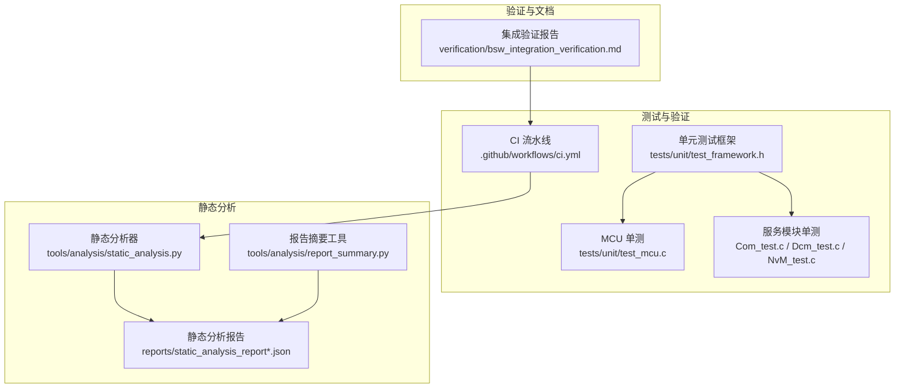
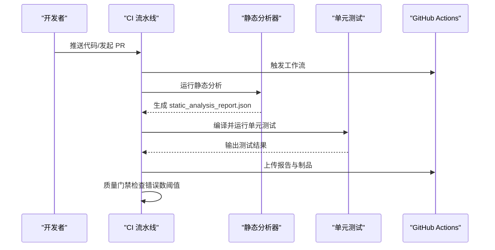
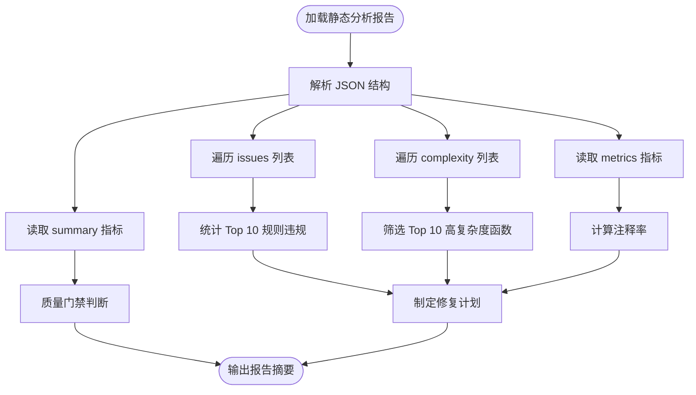
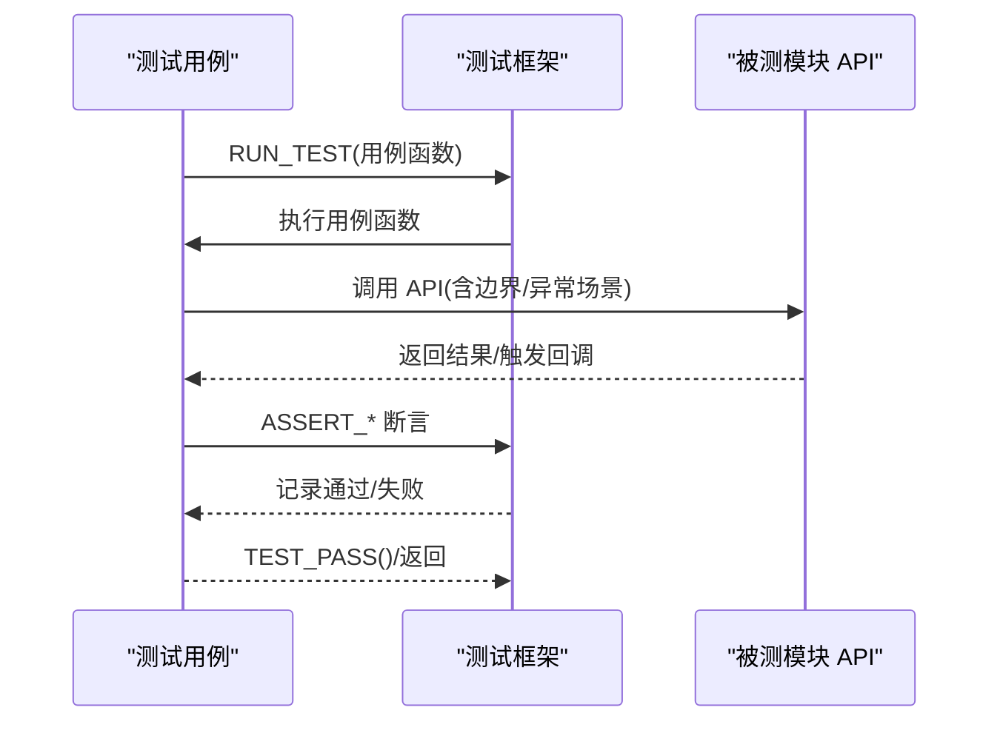
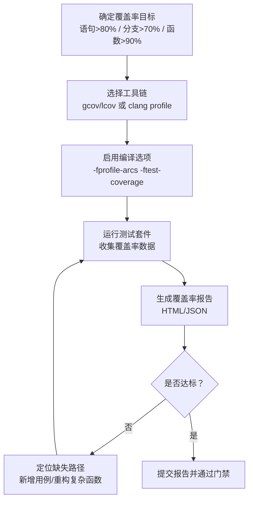
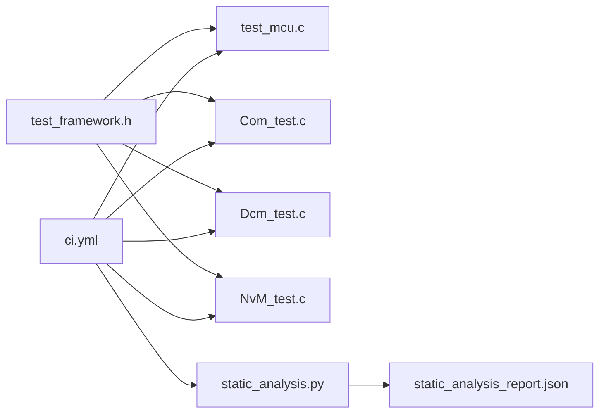

# 测试覆盖率

<cite>
**本文引用的文件**
- [static_analysis.py](file://tools/analysis/static_analysis.py)
- [report_summary.py](file://tools/analysis/report_summary.py)
- [static_analysis_report.json](file://reports/static_analysis_report.json)
- [static_analysis_report_final.json](file://reports/static_analysis_report_final.json)
- [static_analysis_report_v2.json](file://reports/static_analysis_report_v2.json)
- [test_framework.h](file://tests/unit/test_framework.h)
- [test_mcu.c](file://tests/unit/test_mcu.c)
- [Com_test.c](file://src/bsw/services/com/src/Com_test.c)
- [Dcm_test.c](file://src/bsw/services/dcm/src/Dcm_test.c)
- [NvM_test.c](file://src/bsw/services/nvm/src/NvM_test.c)
- [ci.yml](file://.github/workflows/ci.yml)
- [bsw_integration_verification.md](file://verification/bsw_integration_verification.md)
</cite>

## 目录
1. [简介](#简介)
2. [项目结构](#项目结构)
3. [核心组件](#核心组件)
4. [架构总览](#架构总览)
5. [详细组件分析](#详细组件分析)
6. [依赖关系分析](#依赖关系分析)
7. [性能考量](#性能考量)
8. [故障排查指南](#故障排查指南)
9. [结论](#结论)
10. [附录](#附录)

## 简介
本文件面向 YuleTech AutoSAR BSW 平台，系统化阐述测试覆盖率的计算方法与评估标准，并结合仓库中的静态分析报告与单元测试框架，给出可操作的覆盖率提升实践建议。当前仓库未直接提供覆盖率工具链（如 gcov/lcov 或 clang 的 profile），但已具备完善的静态分析与单元测试基础，可通过以下路径实现覆盖率目标：
- 语句覆盖率 > 80%
- 分支覆盖率 > 70%
- 函数覆盖率 > 90%

同时，文档提供静态分析报告的解读方法、质量门禁策略以及最佳实践与改进建议。

## 项目结构
YuleTech BSW 采用 AutoSAR Classic 分层架构，测试与质量保障由以下部分组成：
- 单元测试：位于 tests/unit 与各服务模块 src/bsw/services/*/src 下的 *_test.c
- 静态分析：tools/analysis 下的 static_analysis.py 与 report_summary.py
- CI 流水线：.github/workflows/ci.yml
- 验证报告：verification/bsw_integration_verification.md

**图表来源**
- [test_framework.h](file://tests/unit/test_framework.h)
- [test_mcu.c](file://tests/unit/test_mcu.c)
- [Com_test.c](file://src/bsw/services/com/src/Com_test.c)
- [Dcm_test.c](file://src/bsw/services/dcm/src/Dcm_test.c)
- [NvM_test.c](file://src/bsw/services/nvm/src/NvM_test.c)
- [static_analysis.py](file://tools/analysis/static_analysis.py)
- [report_summary.py](file://tools/analysis/report_summary.py)
- [static_analysis_report.json](file://reports/static_analysis_report.json)
- [ci.yml](file://.github/workflows/ci.yml)
- [bsw_integration_verification.md](file://verification/bsw_integration_verification.md)

**章节来源**
- [ci.yml](file://.github/workflows/ci.yml)
- [bsw_integration_verification.md](file://verification/bsw_integration_verification.md)

## 核心组件
- 单元测试框架与用例
  - 测试框架提供断言宏与统计逻辑，便于统一输出测试结果
  - 单测用例覆盖关键 API 的正常路径与异常路径（如空指针、未初始化状态）
- 静态分析工具
  - 提供 MISRA C 规则检查、圈复杂度分析与代码风格检查
  - 输出结构化的 JSON 报告，便于自动化质量门禁
- CI 流水线
  - 在构建后执行静态分析与单元测试步骤，上传报告并进行质量检查

**章节来源**
- [test_framework.h](file://tests/unit/test_framework.h)
- [test_mcu.c](file://tests/unit/test_mcu.c)
- [static_analysis.py](file://tools/analysis/static_analysis.py)
- [ci.yml](file://.github/workflows/ci.yml)

## 架构总览
下图展示从代码到报告与门禁的整体流程：

**图表来源**
- [ci.yml](file://.github/workflows/ci.yml)
- [static_analysis.py](file://tools/analysis/static_analysis.py)

**章节来源**
- [ci.yml](file://.github/workflows/ci.yml)

## 详细组件分析

### 静态分析报告解读
- 报告结构
  - summary：总问题数、错误数、警告数、信息数
  - metrics：文件数、总行数、代码行、注释行、空行、函数数、平均/最大圈复杂度
  - issues：按文件、行号、规则、严重性、类别列出
  - complexity：函数级复杂度列表
- 关键指标
  - 代码注释率 = 注释行 / 总行数
  - 平均/最大圈复杂度用于识别高风险函数
- 使用建议
  - 将错误数作为质量门禁阈值（示例：>100 判定失败）
  - 结合 Top 10 规则违规与 Top 10 高复杂度函数定位改进点

**图表来源**
- [report_summary.py](file://tools/analysis/report_summary.py)
- [static_analysis_report.json](file://reports/static_analysis_report.json)

**章节来源**
- [report_summary.py](file://tools/analysis/report_summary.py)
- [static_analysis_report.json](file://reports/static_analysis_report.json)
- [static_analysis_report_final.json](file://reports/static_analysis_report_final.json)
- [static_analysis_report_v2.json](file://reports/static_analysis_report_v2.json)

### 单元测试用例分析
- 测试框架
  - 提供 TEST_SUITE、RUN_TEST、ASSERT_* 系列断言宏与统计结构体
  - 统一的 TEST_MAIN_BEGIN/END 宏简化测试入口
- 典型用例模式
  - 正常路径：构造输入 → 调用被测函数 → 断言输出
  - 异常路径：传入非法参数（NULL、无效 ID、未初始化）→ 断言错误处理（DET 报错或不崩溃）
- 示例覆盖维度
  - 初始化/去初始化流程
  - 参数校验（空指针、越界 ID）
  - 状态机转换（未初始化状态下调用 API）
  - 与外部接口交互（如 PduR/MemIf/Det）

**图表来源**
- [test_framework.h](file://tests/unit/test_framework.h)
- [test_mcu.c](file://tests/unit/test_mcu.c)
- [Com_test.c](file://src/bsw/services/com/src/Com_test.c)
- [Dcm_test.c](file://src/bsw/services/dcm/src/Dcm_test.c)
- [NvM_test.c](file://src/bsw/services/nvm/src/NvM_test.c)

**章节来源**
- [test_framework.h](file://tests/unit/test_framework.h)
- [test_mcu.c](file://tests/unit/test_mcu.c)
- [Com_test.c](file://src/bsw/services/com/src/Com_test.c)
- [Dcm_test.c](file://src/bsw/services/dcm/src/Dcm_test.c)
- [NvM_test.c](file://src/bsw/services/nvm/src/NvM_test.c)

### 覆盖率计算与评估标准
- 语句覆盖率（>80%）
  - 定义：执行过的可执行语句数 / 可执行语句总数
  - 重要性：确保主要逻辑路径被执行
- 分支覆盖率（>70%）
  - 定义：被判定为真/假的分支数 / 分支总数
  - 重要性：验证条件分支的两种分支都被覆盖
- 函数覆盖率（>90%）
  - 定义：至少被调用一次的函数数 / 函数总数
  - 重要性：保证关键功能函数被测试到

[本图为概念流程，无需图表来源]

**章节来源**
- [test_framework.h](file://tests/unit/test_framework.h)
- [test_mcu.c](file://tests/unit/test_mcu.c)

## 依赖关系分析
- 测试依赖
  - 单元测试依赖被测模块头文件与公共断言框架
  - 服务模块单测通过 Mock 外部接口（如 PduR、MemIf、Det）
- 静态分析依赖
  - 解析 C/H 源码，提取函数定义、复杂度与风格问题
- CI 依赖
  - ARM GCC 工具链、Python 环境、pytest（用于其他工具测试）

**图表来源**
- [test_framework.h](file://tests/unit/test_framework.h)
- [test_mcu.c](file://tests/unit/test_mcu.c)
- [Com_test.c](file://src/bsw/services/com/src/Com_test.c)
- [Dcm_test.c](file://src/bsw/services/dcm/src/Dcm_test.c)
- [NvM_test.c](file://src/bsw/services/nvm/src/NvM_test.c)
- [static_analysis.py](file://tools/analysis/static_analysis.py)
- [static_analysis_report.json](file://reports/static_analysis_report.json)
- [ci.yml](file://.github/workflows/ci.yml)

**章节来源**
- [ci.yml](file://.github/workflows/ci.yml)

## 性能考量
- 静态分析性能
  - 仅分析源文件与头文件，排除 tools 与 generated 目录，避免冗余扫描
  - 复杂度计算基于关键字计数，时间复杂度近似 O(N)，适合大规模代码库
- 单元测试性能
  - 使用轻量断言宏与最小化外部依赖（Mock），缩短测试执行时间
  - 建议按模块拆分测试，便于并行执行

[本节为通用指导，无需章节来源]

## 故障排查指南
- 静态分析报告过大或错误过多
  - 使用 report_summary.py 快速定位 Top 10 规则违规与 Top 10 高复杂度函数
  - 优先修复高复杂度函数与高频错误（如 MISRA-C-8.1、MISRA-C-5.1）
- 单元测试失败
  - 检查断言宏使用是否正确，确认被测函数在不同状态下的行为
  - 对于外部接口（PduR/MemIf/Det），确保 Mock 行为与期望一致
- CI 质量门禁失败
  - 根据 ci.yml 中的质量检查逻辑调整阈值或修复问题

**章节来源**
- [report_summary.py](file://tools/analysis/report_summary.py)
- [static_analysis_report.json](file://reports/static_analysis_report.json)
- [ci.yml](file://.github/workflows/ci.yml)

## 结论
YuleTech AutoSAR BSW 平台已建立完善的静态分析与单元测试体系，具备良好的质量基线。若要达到语句覆盖率 > 80%、分支覆盖率 > 70%、函数覆盖率 > 90% 的目标，建议：
- 引入覆盖率工具链（如 gcov/lcov 或 clang profile），在 CI 中生成并上报覆盖率报告
- 基于静态分析报告的 Top 规则与 Top 函数，针对性补充测试用例
- 通过重构降低高复杂度函数的圈复杂度，提升分支覆盖与语句覆盖
- 将覆盖率指标纳入质量门禁，持续推动代码质量提升

[本节为总结，无需章节来源]

## 附录

### 静态分析报告字段说明
- summary
  - total_issues：问题总数
  - errors/warnings/info：错误/警告/信息数量
- metrics
  - total_files/total_lines/code_lines/comment_lines/blank_lines：文件数与行数统计
  - avg_complexity/max_complexity/functions_count：复杂度与函数统计
- issues
  - file_path/line_number/rule_id/severity/category/message：问题定位与描述
- complexity
  - file_path/function_name/line_number/complexity/lines_of_code：函数级复杂度

**章节来源**
- [static_analysis_report.json](file://reports/static_analysis_report.json)
- [static_analysis_report_final.json](file://reports/static_analysis_report_final.json)
- [static_analysis_report_v2.json](file://reports/static_analysis_report_v2.json)

### 覆盖率提升最佳实践
- 代码重构
  - 将高复杂度函数拆分为多个小函数，降低圈复杂度
  - 合理组织条件分支，减少嵌套层级
- 测试用例补充
  - 针对未覆盖的分支增加测试用例（如空指针、越界、未初始化）
  - 对 Mock 接口进行边界测试，确保外部依赖行为正确
- 质量门禁
  - 在 CI 中加入覆盖率阈值检查，未达标禁止合并

[本节为通用指导，无需章节来源]