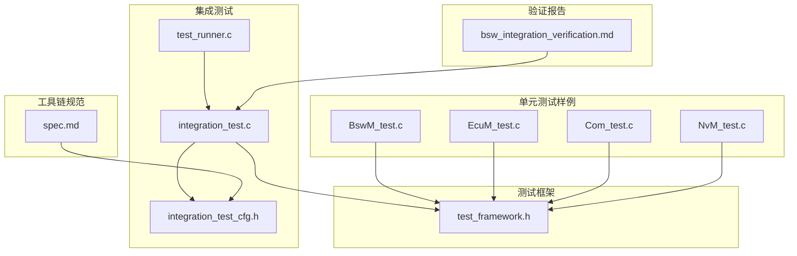
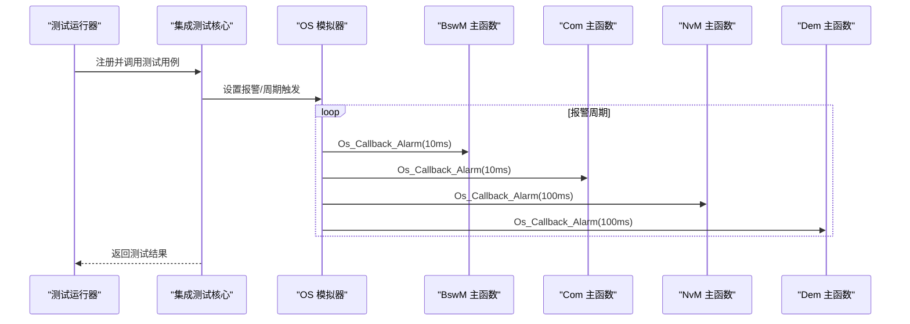
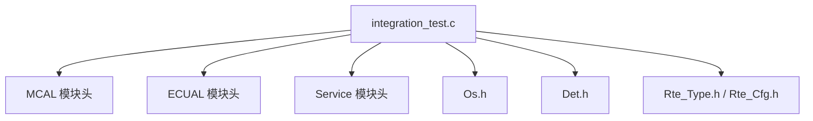

# 集成测试

<cite>
**本文引用的文件**
- [integration_test_cfg.h](file://tests/integration/integration_test_cfg.h)
- [test_runner.c](file://tests/integration/bsw/test_runner.c)
- [integration_test.c](file://tests/integration/bsw/integration_test.c)
- [test_framework.h](file://tests/unit/test_framework.h)
- [bsw_integration_verification.md](file://verification/bsw_integration_verification.md)
- [BswM_test.c](file://tests/integration/bsw/BswM_test.c)
- [EcuM_test.c](file://tests/integration/bsw/EcuM_test.c)
- [Com_test.c](file://src/bsw/services/com/src/Com_test.c)
- [NvM_test.c](file://src/bsw/services/nvm/src/NvM_test.c)
- [spec.md](file://openspec/specs/toolchain/spec.md)
</cite>

## 目录
1. [简介](#简介)
2. [项目结构](#项目结构)
3. [核心组件](#核心组件)
4. [架构总览](#架构总览)
5. [详细组件分析](#详细组件分析)
6. [依赖关系分析](#依赖关系分析)
7. [性能考量](#性能考量)
8. [故障排查指南](#故障排查指南)
9. [结论](#结论)
10. [附录](#附录)

## 简介
本文件面向 YuleTech AutoSAR BSW 平台，系统化阐述“跨层集成测试”的整体架构与策略，涵盖模块间接口测试、组件协同测试与系统级功能验证。重点说明集成测试配置文件 integration_test_cfg.h 的使用方法、测试运行器 test_runner.c 的工作原理，并提供具体用例示例（MCAL、ECUAL、服务层之间的集成），以及测试环境搭建、测试数据准备与测试结果验证方法。目标是帮助开发者快速理解并扩展该平台的集成测试能力。

## 项目结构
集成测试位于 tests/integration/bsw 目录，配套的单元测试框架位于 tests/unit。验证报告位于 verification 目录，工具链规范位于 openspec。

图表来源
- [integration_test_cfg.h:1-101](file://tests/integration/integration_test_cfg.h#L1-101)
- [test_runner.c:1-40](file://tests/integration/bsw/test_runner.c#L1-40)
- [integration_test.c:1-800](file://tests/integration/bsw/integration_test.c#L1-800)
- [test_framework.h:1-141](file://tests/unit/test_framework.h#L1-141)
- [bsw_integration_verification.md:1-193](file://verification/bsw_integration_verification.md#L1-193)
- [spec.md:1-417](file://openspec/specs/toolchain/spec.md#L1-417)

章节来源
- [integration_test_cfg.h:1-101](file://tests/integration/integration_test_cfg.h#L1-101)
- [test_runner.c:1-40](file://tests/integration/bsw/test_runner.c#L1-40)
- [integration_test.c:1-800](file://tests/integration/bsw/integration_test.c#L1-800)
- [test_framework.h:1-141](file://tests/unit/test_framework.h#L1-141)
- [bsw_integration_verification.md:1-193](file://verification/bsw_integration_verification.md#L1-193)
- [spec.md:1-417](file://openspec/specs/toolchain/spec.md#L1-417)

## 核心组件
- 集成测试配置文件：用于在测试环境中覆盖默认配置，降低资源占用并提供稳定的测试信号/报文/块等标识符。
- 测试运行器：集中注册并执行一组跨层集成测试用例，输出测试统计。
- 集成测试核心：实现多层（MCAL/ECUAL/Service/OS/EcuM/RTE）协同的端到端场景，包含大量模拟器与跟踪变量。
- 单元测试框架：提供断言宏、测试统计与主流程宏，支撑集成测试与单元测试统一风格。
- 验证报告：汇总各层模块完成度与验证结果，作为集成测试目标的参考依据。
- 工具链规范：定义配置工具、代码生成器、构建工具与调试诊断工具，为集成测试提供配置与生成支持。

章节来源
- [integration_test_cfg.h:24-101](file://tests/integration/integration_test_cfg.h#L24-L101)
- [test_runner.c:18-39](file://tests/integration/bsw/test_runner.c#L18-L39)
- [integration_test.c:12-71](file://tests/integration/bsw/integration_test.c#L12-L71)
- [test_framework.h:18-141](file://tests/unit/test_framework.h#L18-L141)
- [bsw_integration_verification.md:15-193](file://verification/bsw_integration_verification.md#L15-L193)
- [spec.md:33-94](file://openspec/specs/toolchain/spec.md#L33-L94)

## 架构总览
集成测试以“测试运行器”为入口，按顺序执行多个跨层用例；每个用例在测试核心中通过“模拟器/桩函数”对真实模块进行替换，从而在无真实硬件的情况下完成端到端验证。测试核心还内置了对 OS 报警的调度，以驱动 BswM、Com、NvM、Dem 等模块的主函数循环。

图表来源
- [test_runner.c:27-39](file://tests/integration/bsw/test_runner.c#L27-L39)
- [integration_test.c:493-514](file://tests/integration/bsw/integration_test.c#L493-L514)

章节来源
- [test_runner.c:27-39](file://tests/integration/bsw/test_runner.c#L27-L39)
- [integration_test.c:493-514](file://tests/integration/bsw/integration_test.c#L493-L514)

## 详细组件分析

### 集成测试配置文件 integration_test_cfg.h
- 目的：在测试环境下重定义 COM、NvM、CanIf 等模块的配置规模与标识符，以减小内存占用并提升可重复性。
- 关键点：
  - COM：限定信号数量、IPDU 数量与缓冲大小，便于端到端验证。
  - NvM：限定块数量与队列长度，聚焦启动恢复与写入流程。
  - CanIf：限定控制器、TX/RX PDU 数量与 HRH/HTH 数量，简化 CAN 通路。
  - 信号/IPDU/块/报警等标识符常量，确保测试用例与配置一致。
  - 引擎配置数据类型，用于 NvM 启动恢复场景的数据结构。

章节来源
- [integration_test_cfg.h:24-101](file://tests/integration/integration_test_cfg.h#L24-L101)

### 测试运行器 test_runner.c
- 目的：集中注册并执行一组跨层集成测试用例，打印测试套件标题与统计结果。
- 关键点：
  - 声明外部测试用例函数原型。
  - 使用 TEST_MAIN_BEGIN/END 宏包裹 main，输出测试统计。
  - 顺序执行多个测试用例，体现从底层到高层的集成顺序。

章节来源
- [test_runner.c:18-39](file://tests/integration/bsw/test_runner.c#L18-L39)

### 集成测试核心 integration_test.c
- 目的：在无真实硬件的条件下，通过模拟器/桩函数实现 MCAL、ECUAL、Service、OS、EcuM、RTE 的协同验证。
- 关键点：
  - 模块头文件包含：MCAL、ECUAL、Service、Integration、OS、DET、RTE。
  - 模拟器与跟踪变量：DET、CAN、Fee、Gpt、OS、MemIf、DCM、BswM、Com、PduR、RTE 数据等。
  - DET 模拟：拦截 DET 报告，便于断言错误路径。
  - MCAL/ECUAL 桩函数：最小实现，避免真实外设依赖。
  - OS 模拟：StartOS/ShutdownOS、SetRelAlarm/CancelAlarm、回调分发至各模块主函数。
  - EcuM 配置：提供最小化配置，支持启动三阶段与关闭序列。
  - CanIf/Com/CanTp/NvM/Dcm/BswM 配置：基于 integration_test_cfg.h 的常量生成，保证一致性。
  - OS 报警回调：根据报警 ID 调用 BswM_MainFunction、Com_MainFunctionTx/Rx、NvM_MainFunction、Dem_MainFunction。

章节来源
- [integration_test.c:12-71](file://tests/integration/bsw/integration_test.c#L12-L71)
- [integration_test.c:85-160](file://tests/integration/bsw/integration_test.c#L85-L160)
- [integration_test.c:164-229](file://tests/integration/bsw/integration_test.c#L164-L229)
- [integration_test.c:246-325](file://tests/integration/bsw/integration_test.c#L246-L325)
- [integration_test.c:330-406](file://tests/integration/bsw/integration_test.c#L330-L406)
- [integration_test.c:456-514](file://tests/integration/bsw/integration_test.c#L456-L514)
- [integration_test.c:519-594](file://tests/integration/bsw/integration_test.c#L519-L594)
- [integration_test.c:621-695](file://tests/integration/bsw/integration_test.c#L621-L695)
- [integration_test.c:714-737](file://tests/integration/bsw/integration_test.c#L714-L737)
- [integration_test.c:758-774](file://tests/integration/bsw/integration_test.c#L758-L774)
- [integration_test.c:793-800](file://tests/integration/bsw/integration_test.c#L793-L800)

### 单元测试框架 test_framework.h
- 目的：提供断言宏、测试统计与主流程宏，支撑集成测试与单元测试统一风格。
- 关键点：
  - 测试统计结构体与全局计数。
  - 断言宏：ASSERT_TRUE/FALSE、ASSERT_EQ/NE、ASSERT_NULL/NOT_NULL、ASSERT_STR_EQ。
  - RUN_TEST 宏：统一运行测试用例并输出结果。
  - TEST_MAIN_BEGIN/END 宏：封装 main，输出统计结果。

章节来源
- [test_framework.h:18-141](file://tests/unit/test_framework.h#L18-L141)

### 验证报告 bsw_integration_verification.md
- 目的：汇总 MCAL、ECUAL、Service、OS、RTE、ASW 各层模块完成度与验证结果，作为集成测试目标的参考。
- 关键点：
  - 各层模块数、已完成数与状态。
  - OS 层 API 验证结果。
  - 架构符合度：分层依赖方向符合 AutoSAR 规范。
  - 已知问题与后续工作：集成测试用例缺失等。

章节来源
- [bsw_integration_verification.md:15-193](file://verification/bsw_integration_verification.md#L15-L193)

### 工具链规范 spec.md
- 目的：定义配置工具、代码生成器、构建工具与调试诊断工具，为集成测试提供配置与生成支持。
- 关键点：
  - 配置工具：可视化配置、企标导入、模块选择与依赖解析。
  - 代码生成器：ARXML 解析、模板引擎、增量生成。
  - 构建工具：编译器集成、构建脚本、CI/CD 集成。
  - 调试诊断工具：日志分析、实时监控、诊断通信。

章节来源
- [spec.md:33-94](file://openspec/specs/toolchain/spec.md#L33-L94)
- [spec.md:158-230](file://openspec/specs/toolchain/spec.md#L158-L230)
- [spec.md:271-349](file://openspec/specs/toolchain/spec.md#L271-L349)
- [spec.md:350-383](file://openspec/specs/toolchain/spec.md#L350-L383)

## 依赖关系分析
集成测试核心对各层模块存在直接依赖，同时通过 OS 报警回调形成跨层调度关系。

图表来源
- [integration_test.c:24-71](file://tests/integration/bsw/integration_test.c#L24-L71)

章节来源
- [integration_test.c:24-71](file://tests/integration/bsw/integration_test.c#L24-L71)

## 性能考量
- 测试规模控制：通过 integration_test_cfg.h 降低 COM/NvM/CanIf 等配置规模，减少内存占用与执行时间。
- 模拟器效率：使用静态数组与简单状态机替代真实外设，提高测试执行速度。
- OS 报警周期：合理设置报警周期，平衡测试完整性与执行耗时。
- 断言与统计：统一的断言宏与统计逻辑，便于快速定位失败用例并评估整体质量。

[本节为通用指导，不直接分析具体文件]

## 故障排查指南
- 配置不一致：若测试用例与 integration_test_cfg.h 常量不匹配，可能导致断言失败或运行异常。请核对信号/IPDU/块/报警等标识符。
- 模拟器未初始化：若 CAN/Fee/Gpt/MemIf/OS 等模拟器未正确初始化，相关模块可能返回错误或不触发预期行为。检查初始化函数与全局标志位。
- OS 报警未触发：若 OS 报警未设置或回调未分发，Com/NvM/Dem/BswM 的主函数不会被调用。检查 SetRelAlarm 与 Os_Callback_Alarm 的实现。
- DET 报错路径：若期望 DET 报错但未发生，检查 DET 模拟是否正确拦截并记录错误参数。
- 单元测试框架：利用 test_framework.h 的断言宏与统计信息，快速定位失败原因。

章节来源
- [integration_test_cfg.h:24-101](file://tests/integration/integration_test_cfg.h#L24-L101)
- [integration_test.c:164-172](file://tests/integration/bsw/integration_test.c#L164-L172)
- [integration_test.c:246-325](file://tests/integration/bsw/integration_test.c#L246-L325)
- [integration_test.c:456-514](file://tests/integration/bsw/integration_test.c#L456-L514)
- [test_framework.h:46-120](file://tests/unit/test_framework.h#L46-L120)

## 结论
YuleTech AutoSAR BSW 平台的集成测试以“配置文件 + 运行器 + 核心测试 + 框架 + 报告 + 工具链”为主线，实现了对 MCAL、ECUAL、Service、OS、EcuM、RTE 的跨层协同验证。通过模拟器与跟踪变量，测试在无真实硬件条件下完成端到端场景验证；通过统一的断言与统计机制，保障测试结果的可验证性与可维护性。建议在现有基础上继续完善系统级集成测试用例，逐步引入 SIL 仿真与自动化流水线，持续提升平台质量与交付效率。

[本节为总结性内容，不直接分析具体文件]

## 附录

### 测试环境搭建
- 环境要求：支持 C 语言编译与标准库的主机环境（Windows/Linux/macOS）。
- 依赖：集成测试仅依赖本地头文件与单元测试框架，无需额外第三方库。
- 构建方式：使用工具链规范中的构建工具生成编译脚本，或直接使用 GCC/IAR 等编译器编译测试源码。

章节来源
- [spec.md:271-349](file://openspec/specs/toolchain/spec.md#L271-L349)

### 测试数据准备
- 配置数据：通过 integration_test_cfg.h 定义信号/IPDU/块/报警等标识符与规模。
- 模拟器数据：在 integration_test.c 中初始化模拟器变量（如 CAN/Fee/Gpt/OS/MemIf 等）。
- 配置结构：基于配置常量生成 CanIf/Com/CanTp/NvM/Dcm/BswM 等模块的配置结构体。

章节来源
- [integration_test_cfg.h:24-101](file://tests/integration/integration_test_cfg.h#L24-L101)
- [integration_test.c:519-594](file://tests/integration/bsw/integration_test.c#L519-L594)
- [integration_test.c:621-695](file://tests/integration/bsw/integration_test.c#L621-L695)
- [integration_test.c:714-737](file://tests/integration/bsw/integration_test.c#L714-L737)
- [integration_test.c:758-774](file://tests/integration/bsw/integration_test.c#L758-L774)
- [integration_test.c:793-800](file://tests/integration/bsw/integration_test.c#L793-L800)

### 测试结果验证方法
- 使用 test_framework.h 的断言宏进行条件判断与错误报告。
- 通过 TEST_MAIN_BEGIN/END 宏输出测试统计（总数、通过数、失败数）。
- 结合验证报告 bsw_integration_verification.md 的模块完成度，评估集成测试覆盖范围与质量趋势。

章节来源
- [test_framework.h:46-120](file://tests/unit/test_framework.h#L46-L120)
- [test_framework.h:122-138](file://tests/unit/test_framework.h#L122-L138)
- [bsw_integration_verification.md:15-193](file://verification/bsw_integration_verification.md#L15-L193)

### 典型集成测试用例示例（路径）
以下为具体用例的实现位置（不直接展示代码内容）：
- CAN 信号端到端：[integration_test.c:1-800](file://tests/integration/bsw/integration_test.c#L1-L800)
- NvM 启动恢复：[integration_test.c:1-800](file://tests/integration/bsw/integration_test.c#L1-L800)
- 诊断请求端到端：[integration_test.c:1-800](file://tests/integration/bsw/integration_test.c#L1-L800)
- 模式切换（BswM/EcuM）：[integration_test.c:1-800](file://tests/integration/bsw/integration_test.c#L1-L800)
- OS 报警周期调度：[integration_test.c:493-514](file://tests/integration/bsw/integration_test.c#L493-L514)

章节来源
- [integration_test.c:1-800](file://tests/integration/bsw/integration_test.c#L1-L800)
- [integration_test.c:493-514](file://tests/integration/bsw/integration_test.c#L493-L514)

### 单元测试参考（路径）
- BswM 单元测试：[BswM_test.c:116-306](file://tests/integration/bsw/BswM_test.c#L116-L306)
- EcuM 单元测试：[EcuM_test.c:304-513](file://tests/integration/bsw/EcuM_test.c#L304-L513)
- Com 单元测试：[Com_test.c:112-200](file://src/bsw/services/com/src/Com_test.c#L112-L200)
- NvM 单元测试：[NvM_test.c:114-200](file://src/bsw/services/nvm/src/NvM_test.c#L114-L200)

章节来源
- [BswM_test.c:116-306](file://tests/integration/bsw/BswM_test.c#L116-L306)
- [EcuM_test.c:304-513](file://tests/integration/bsw/EcuM_test.c#L304-L513)
- [Com_test.c:112-200](file://src/bsw/services/com/src/Com_test.c#L112-L200)
- [NvM_test.c:114-200](file://src/bsw/services/nvm/src/NvM_test.c#L114-L200)