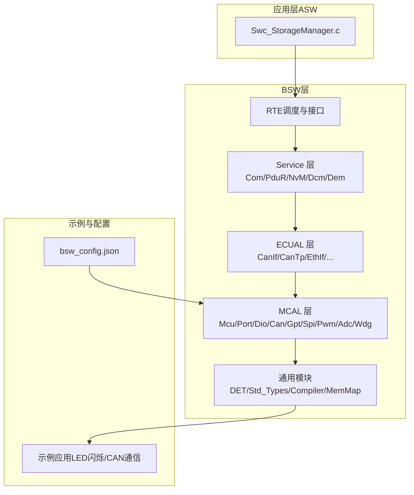
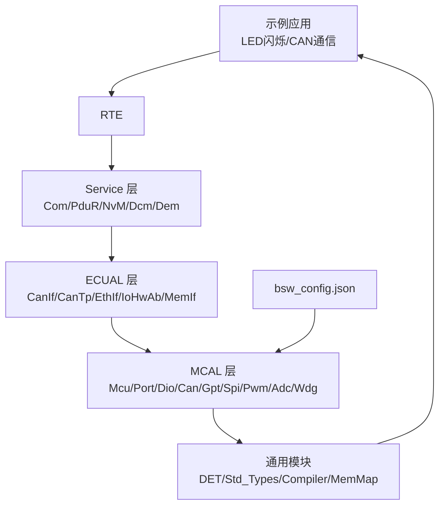
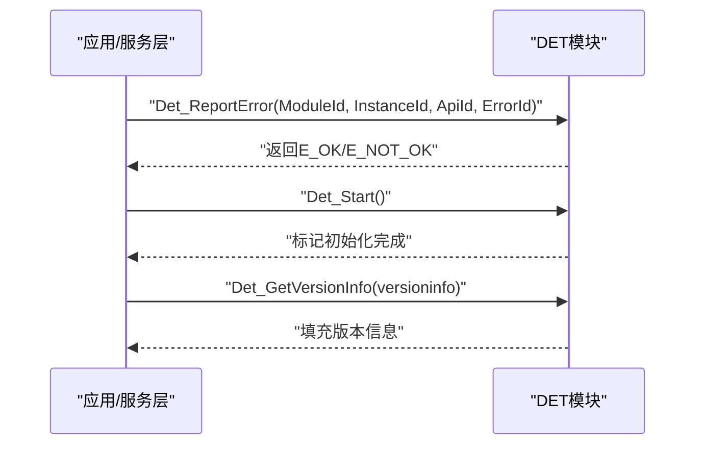
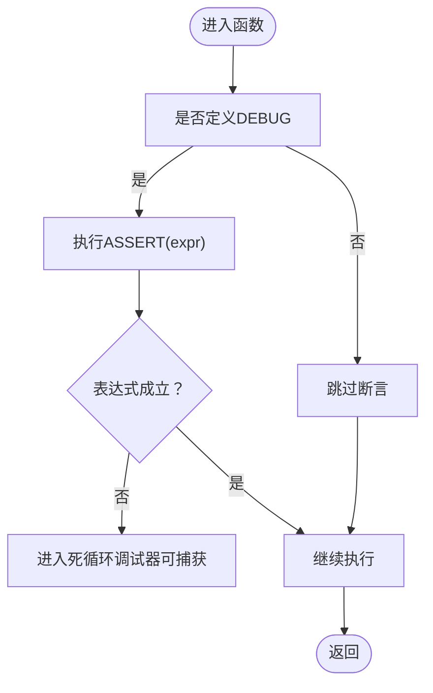
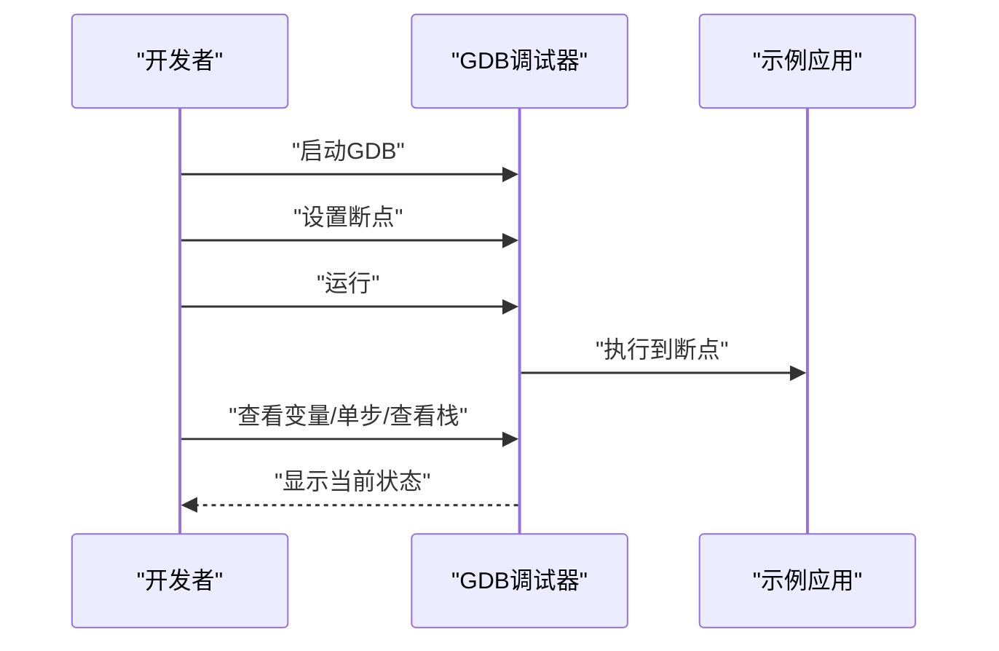
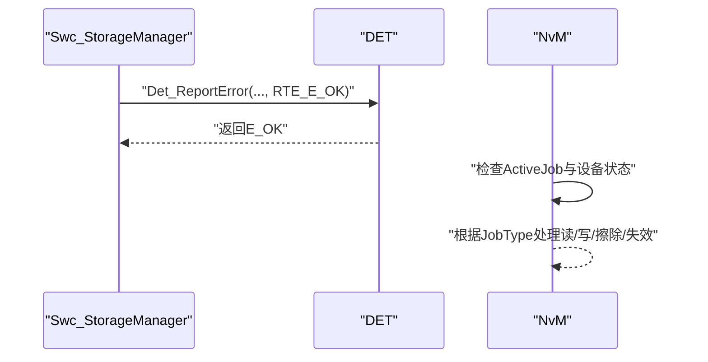
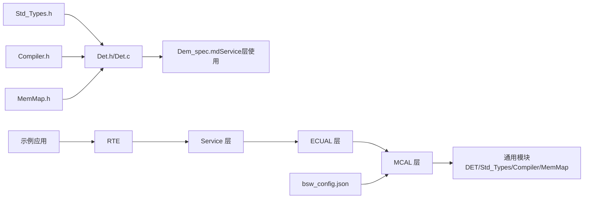

# 调试技巧

<cite>
**本文引用的文件**
- [Det.h](file://src/bsw/services/det/include/Det.h)
- [Det.c](file://src/bsw/services/det/src/Det.c)
- [Std_Types.h](file://src/bsw/os/include/Std_Types.h)
- [Compiler.h](file://include/autosar/Compiler.h)
- [MemMap.h](file://src/bsw/general/inc/MemMap.h)
- [test_framework.h](file://tests/unit/test_framework.h)
- [bsw_config.json](file://config/bsw_config.json)
- [README.md](file://README.md)
- [development-guide.md](file://docs/development-guide.md)
- [Dem_spec.md](file://openspec/changes/dev-dcm-dem-module/specs/Dem_spec.md)
- [Swc_StorageManager.c](file://src/asw/storage_manager/src/Swc_StorageManager.c)
- [NvM.c](file://src/bsw/services/nvm/src/NvM.c)
- [main.c（LED闪烁示例）](file://examples/led_blink/main.c)
- [main.c（CAN通信示例）](file://examples/can_demo/main.c)
</cite>

## 目录
1. [简介](#简介)
2. [项目结构](#项目结构)
3. [核心组件](#核心组件)
4. [架构总览](#架构总览)
5. [详细组件分析](#详细组件分析)
6. [依赖关系分析](#依赖关系分析)
7. [性能考虑](#性能考虑)
8. [故障排查指南](#故障排查指南)
9. [结论](#结论)
10. [附录](#附录)

## 简介
本指南面向YuleTech AutoSAR BSW平台的开发者，系统讲解如何高效使用DET错误检测系统、日志输出与断言技术，并结合GDB进行实战调试（启动、断点、变量查看、单步执行、调用栈分析）。同时提供常见问题的调试策略与性能优化建议，帮助快速定位与解决问题。

## 项目结构
YuleTech BSW平台采用AutoSAR Classic分层架构，包含RTE、Service层、ECUAL层、MCAL层以及通用公共模块。调试相关的关键位置包括：
- 通用公共模块：DET、标准类型、编译器抽象、内存分区
- 单元测试框架：内置断言与测试运行器
- 示例应用：LED闪烁与CAN通信，便于验证与调试
- 配置文件：模块启用状态、参数与频率等

**图表来源**
- [README.md: 项目结构与模块清单:153-199](file://README.md#L153-L199)
- [bsw_config.json: 模块启用与参数:1-21](file://config/bsw_config.json#L1-L21)

**章节来源**
- [README.md: 项目结构与模块清单:153-199](file://README.md#L153-L199)
- [bsw_config.json: 模块启用与参数:1-21](file://config/bsw_config.json#L1-L21)

## 核心组件
- DET（Development Error Tracer）
  - 提供错误上报、启动与版本查询接口，便于在开发阶段捕获非法调用与参数错误。
  - 在Service层（如Dem）规范中明确在特定API路径下触发DET错误码。
- 标准类型与断言
  - 标准返回类型、布尔、指针等定义；Compiler.h提供DEBUG模式下的ASSERT断言宏。
- 内存分区（MemMap）
  - 通过模块化的START/STOP段宏，确保代码、常量、配置与变量正确放置于指定内存段。
- 单元测试框架
  - 提供丰富的断言宏（TRUE/FALSE/EQ/NE/NULL/NOT_NULL/STR_EQ），配合测试运行器输出结果。

**章节来源**
- [Det.h: DET接口与错误码定义:31-70](file://src/bsw/services/det/include/Det.h#L31-L70)
- [Det.c: DET实现与初始化:47-80](file://src/bsw/services/det/src/Det.c#L47-L80)
- [Std_Types.h: 标准类型与返回码:23-80](file://src/bsw/os/include/Std_Types.h#L23-L80)
- [Compiler.h: 断言与编译器宏:165-175](file://include/autosar/Compiler.h#L165-L175)
- [MemMap.h: 内存分区段宏:37-221](file://src/bsw/general/inc/MemMap.h#L37-L221)
- [test_framework.h: 单元测试断言与运行器:28-138](file://tests/unit/test_framework.h#L28-L138)
- [Dem_spec.md: Service层中的DET使用规范:242-261](file://openspec/changes/dev-dcm-dem-module/specs/Dem_spec.md#L242-L261)

## 架构总览
下图展示调试相关关键路径：应用层通过RTE调用Service层，Service层经ECUAL访问MCAL，MCAL使用通用模块（DET/Std_Types/Compiler/MemMap），示例应用与配置文件贯穿全链路。

**图表来源**
- [README.md: 分层架构与模块清单:48-84](file://README.md#L48-L84)
- [bsw_config.json: 模块启用与参数:1-21](file://config/bsw_config.json#L1-L21)

## 详细组件分析

### DET错误检测系统
- 接口与职责
  - 报告错误：Det_ReportError，接收模块ID、实例ID、API ID与错误码，返回标准返回类型。
  - 启动模块：Det_Start，标记模块初始化完成。
  - 版本信息：Det_GetVersionInfo，填充版本信息结构体。
- 错误码与服务ID
  - 定义了标准错误码（如无错误、参数指针为空、不可用等）与服务ID（报告错误、启动、获取版本信息）。
- 在Service层的使用
  - 当启用开发错误检测时，Dem等模块在API入口处根据条件调用Det_ReportError，覆盖未初始化、空指针、无效参数等场景。

**图表来源**
- [Det.h: 接口声明:51-70](file://src/bsw/services/det/include/Det.h#L51-L70)
- [Det.c: 实现逻辑:47-80](file://src/bsw/services/det/src/Det.c#L47-L80)
- [Dem_spec.md: Service层中的DET使用:242-261](file://openspec/changes/dev-dcm-dem-module/specs/Dem_spec.md#L242-L261)

**章节来源**
- [Det.h: DET接口与错误码定义:31-70](file://src/bsw/services/det/include/Det.h#L31-L70)
- [Det.c: DET实现与初始化:47-80](file://src/bsw/services/det/src/Det.c#L47-L80)
- [Dem_spec.md: Service层中的DET使用规范:242-261](file://openspec/changes/dev-dcm-dem-module/specs/Dem_spec.md#L242-L261)

### 日志输出与断言技术
- 断言宏
  - Compiler.h在DEBUG模式下提供ASSERT(expr)，失败时进入死循环，便于立即发现逻辑错误。
  - 在非DEBUG模式下，ASSERT为空操作，不影响发布版本性能。
- 单元测试断言
  - test_framework.h提供ASSERT_TRUE/FALSE、ASSERT_EQ/NE、ASSERT_NULL/NOT_NULL、ASSERT_STR_EQ等，配合TEST_SUITE/RUN_TEST/TEST_MAIN输出测试结果。
- 日志输出
  - 示例应用（LED闪烁/CAN通信）中通过回调函数与全局变量记录状态变化，便于观察运行时行为。

**图表来源**
- [Compiler.h: 断言宏定义:165-175](file://include/autosar/Compiler.h#L165-L175)
- [test_framework.h: 测试断言宏:46-114](file://tests/unit/test_framework.h#L46-L114)

**章节来源**
- [Compiler.h: 断言与编译器宏:165-175](file://include/autosar/Compiler.h#L165-L175)
- [test_framework.h: 单元测试断言与运行器:28-138](file://tests/unit/test_framework.h#L28-L138)
- [main.c（LED闪烁示例）: 回调与状态变量:37-56](file://examples/led_blink/main.c#L37-L56)
- [main.c（CAN通信示例）: 回调与状态变量:37-58](file://examples/can_demo/main.c#L37-L58)

### GDB调试器使用
- 启动与基本操作
  - 启动GDB：gdb ./build/test_module
  - 设置断点：break Module_Init、break Module_Transmit
  - 运行：run
  - 查看变量：print Module_InternalState、print configPtr
  - 单步执行：step、next
  - 查看调用栈：backtrace
- 实战建议
  - 在示例应用入口（如main）设置断点，逐步跟踪初始化序列。
  - 结合回调函数（如Gpt_Callback、CanIf_RxIndication）设置断点，观察中断或周期任务行为。
  - 利用backtrace定位异常发生的具体调用链。

**图表来源**
- [development-guide.md: GDB调试步骤:469-492](file://docs/development-guide.md#L469-L492)

**章节来源**
- [development-guide.md: GDB调试步骤:469-492](file://docs/development-guide.md#L469-L492)
- [main.c（LED闪烁示例）: 回调与状态变量:37-56](file://examples/led_blink/main.c#L37-L56)
- [main.c（CAN通信示例）: 回调与状态变量:37-58](file://examples/can_demo/main.c#L37-L58)

### 应用层与服务层中的调试要点
- Swc_StorageManager
  - 初始化完成后调用Det_ReportError上报状态，便于确认模块就绪。
- NvM
  - 在作业状态机切换时检查设备状态，若处于空闲则推进对应读写擦除流程，适合在状态切换处设置断点观察流程。

**图表来源**
- [Swc_StorageManager.c: 初始化与DET上报:193-195](file://src/asw/storage_manager/src/Swc_StorageManager.c#L193-L195)
- [NvM.c: 作业状态机与设备状态检查:1818-1855](file://src/bsw/services/nvm/src/NvM.c#L1818-L1855)

**章节来源**
- [Swc_StorageManager.c: 初始化与DET上报:193-195](file://src/asw/storage_manager/src/Swc_StorageManager.c#L193-L195)
- [NvM.c: 作业状态机与设备状态检查:1818-1855](file://src/bsw/services/nvm/src/NvM.c#L1818-L1855)

## 依赖关系分析
- DET依赖Std_Types（返回码、布尔、指针）、MemMap（段管理）。
- Service层（如Dem）在启用开发错误检测时依赖DET。
- 示例应用依赖MCAL与RTE，MCAL依赖通用模块（DET/Std_Types/Compiler/MemMap）。
- 配置文件影响MCAL模块的参数（如时钟频率、波特率、控制器数量）。

**图表来源**
- [Det.h: DET接口与错误码定义:17-70](file://src/bsw/services/det/include/Det.h#L17-L70)
- [Det.c: DET实现与初始化:19-80](file://src/bsw/services/det/src/Det.c#L19-L80)
- [Compiler.h: 断言与编译器宏:19-187](file://include/autosar/Compiler.h#L19-L187)
- [MemMap.h: 内存分区段宏:19-796](file://src/bsw/general/inc/MemMap.h#L19-L796)
- [Dem_spec.md: Service层中的DET使用:242-261](file://openspec/changes/dev-dcm-dem-module/specs/Dem_spec.md#L242-L261)
- [bsw_config.json: 模块启用与参数:1-21](file://config/bsw_config.json#L1-L21)

**章节来源**
- [Det.h: DET接口与错误码定义:17-70](file://src/bsw/services/det/include/Det.h#L17-L70)
- [Det.c: DET实现与初始化:19-80](file://src/bsw/services/det/src/Det.c#L19-L80)
- [Compiler.h: 断言与编译器宏:19-187](file://include/autosar/Compiler.h#L19-L187)
- [MemMap.h: 内存分区段宏:19-796](file://src/bsw/general/inc/MemMap.h#L19-L796)
- [Dem_spec.md: Service层中的DET使用:242-261](file://openspec/changes/dev-dcm-dem-module/specs/Dem_spec.md#L242-L261)
- [bsw_config.json: 模块启用与参数:1-21](file://config/bsw_config.json#L1-L21)

## 性能考虑
- 断言成本
  - DEBUG模式下的ASSERT会增加运行时开销，发布版本应关闭DEBUG以避免性能损失。
- 内存分区
  - 正确使用MemMap段宏可避免不必要的段重排与链接时长，提升构建效率。
- 日志与回调
  - 示例应用中的回调函数应保持轻量，避免在高频中断中进行耗时操作。
- 配置优化
  - bsw_config.json中的时钟频率、波特率等参数直接影响MCAL性能与稳定性，需按硬件实际配置。

**章节来源**
- [Compiler.h: 断言与编译器宏:165-175](file://include/autosar/Compiler.h#L165-L175)
- [MemMap.h: 内存分区段宏:37-221](file://src/bsw/general/inc/MemMap.h#L37-L221)
- [bsw_config.json: 模块启用与参数:1-21](file://config/bsw_config.json#L1-L21)

## 故障排查指南
- DET未生效
  - 确认已调用Det_Start并完成初始化。
  - 检查是否在Service层启用了开发错误检测（如Dem中相关宏）。
- 断言失败
  - 在DEBUG模式下ASSERT失败会导致死循环，使用GDB attach或复位后查看断点位置。
  - 结合单元测试断言输出定位具体失败用例。
- 回调未触发
  - 在示例应用的回调函数（如Gpt_Callback、CanIf_RxIndication）设置断点，确认中断或周期任务是否正常执行。
- NvM状态异常
  - 在NvM状态机切换处设置断点，观察设备状态与作业类型，确认流程是否按预期推进。

**章节来源**
- [Det.c: DET初始化与版本查询:62-80](file://src/bsw/services/det/src/Det.c#L62-L80)
- [Dem_spec.md: Service层中的DET使用:242-261](file://openspec/changes/dev-dcm-dem-module/specs/Dem_spec.md#L242-L261)
- [test_framework.h: 单元测试断言与运行器:28-138](file://tests/unit/test_framework.h#L28-L138)
- [main.c（LED闪烁示例）: 回调与状态变量:37-56](file://examples/led_blink/main.c#L37-L56)
- [main.c（CAN通信示例）: 回调与状态变量:37-58](file://examples/can_demo/main.c#L37-L58)
- [NvM.c: 作业状态机与设备状态检查:1818-1855](file://src/bsw/services/nvm/src/NvM.c#L1818-L1855)

## 结论
通过合理使用DET错误检测、断言与日志输出，并结合GDB进行系统化调试，可以显著提升YuleTech BSW平台的开发效率与问题定位速度。建议在开发阶段始终开启DET与断言，在发布前关闭DEBUG以保证性能与稳定性。

## 附录
- 常用命令速查
  - 启动GDB：gdb ./build/test_module
  - 设置断点：break 函数名
  - 运行：run
  - 查看变量：print 变量名
  - 单步执行：step、next
  - 查看调用栈：backtrace
- 关键文件索引
  - DET接口与实现：[Det.h:31-70](file://src/bsw/services/det/include/Det.h#L31-L70)、[Det.c:47-80](file://src/bsw/services/det/src/Det.c#L47-L80)
  - 标准类型与断言：[Std_Types.h:23-80](file://src/bsw/os/include/Std_Types.h#L23-L80)、[Compiler.h:165-175](file://include/autosar/Compiler.h#L165-L175)
  - 内存分区：[MemMap.h:37-221](file://src/bsw/general/inc/MemMap.h#L37-L221)
  - 单元测试断言：[test_framework.h:46-114](file://tests/unit/test_framework.h#L46-L114)
  - 示例应用：[LED闪烁示例:37-56](file://examples/led_blink/main.c#L37-L56)、[CAN通信示例:37-58](file://examples/can_demo/main.c#L37-L58)
  - 配置文件：[bsw_config.json:1-21](file://config/bsw_config.json#L1-L21)